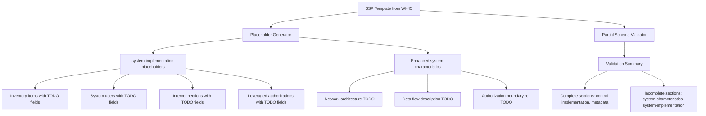
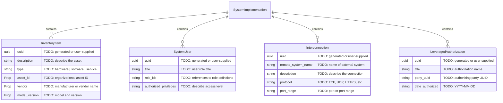
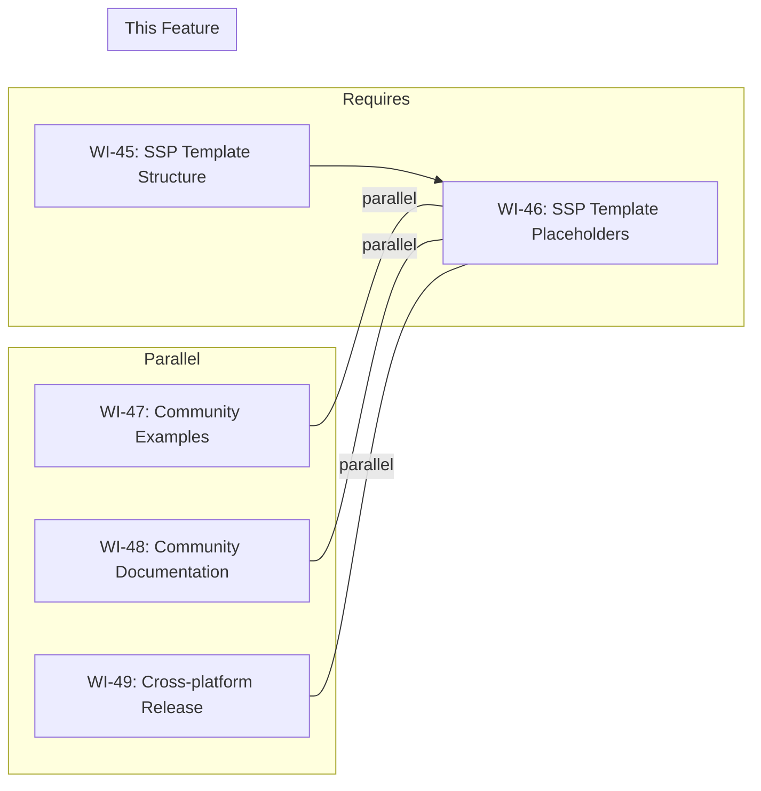

# 046-prd-ssp-template-placeholders

> **Document Type:** Product Requirements Document
> **Audience:** LLM agents, human reviewers
> **Status:** Draft
> **Last Updated:** 2026-02-10 <!-- @auto -->
> **Owner:** Brian Luby <!-- @human-required -->

**Feature Branch**: `046-ssp-template-placeholders`
**Created**: 2026-02-10
**Status**: Draft
**Input**: Derived from FORGE Product Roadmap WI-46

---

## Review Tier Legend

| Marker | Tier | Speckit Behavior |
|--------|------|------------------|
| :red_circle: `@human-required` | Human Generated | Prompt human to author; blocks until complete |
| :yellow_circle: `@human-review` | LLM + Human Review | LLM drafts → prompt human to confirm/edit; blocks until confirmed |
| :green_circle: `@llm-autonomous` | LLM Autonomous | LLM completes; no prompt; logged for audit |
| :white_circle: `@auto` | Auto-generated | System fills (timestamps, links); no prompt |

---

## Document Completion Order

> :warning: **For LLM Agents:** Complete sections in this order. Do not fill downstream sections until upstream human-required inputs exist.

1. **Context** (Background, Scope) → requires human input first
2. **Problem Statement & User Scenarios** → requires human input
3. **Requirements** (Must/Should/Could/Won't) → requires human input
4. **Technical Constraints** → human review
5. **Diagrams, Data Model, Interface** → LLM can draft after above exist
6. **Acceptance Criteria** → derived from requirements
7. **Everything else** → can proceed

---

## Context

### Background :red_circle: `@human-required`
This PRD covers **WI-46: SSP Template — System Placeholders** from the FORGE Product Roadmap (Sprint S-46, Jan 19–23 2027, Theme T-6: Ecosystem & Community, Milestone MS-7). WI-45 established the foundational SSP template structure with policy-derived implementation statements and basic TODO markers in the `system-characteristics` section. This work item extends the template by generating comprehensive placeholder sections for system-specific data that cannot be derived from policy text: inventory items (hardware, software, services), network boundaries, hosting environment details, and interconnections. Each placeholder field is annotated with clear TODO markers describing the expected data format and OSCAL data type. Additionally, this work item introduces partial SSP schema validation — validating the structural elements that are complete while tolerating TODO placeholder values in required fields. The goal is to produce an SSP template that is as close to schema-valid as possible, making it straightforward for compliance engineers to complete the remaining system-specific sections.

> **Confidence Level:** :orange_circle: Exploratory — Phase 3 scope is directionally agreed; scope and timing are flexible.

### Scope Boundaries :yellow_circle: `@human-review`

**In Scope:**
- Generating placeholder sections within `system-implementation` for: inventory items (hardware, software, services), system users, leveraged authorizations, and interconnections
- Generating placeholder fields within `system-characteristics` for: network architecture description, data flow description, and authorization boundary diagram reference
- Annotating all system-specific placeholder fields with clear TODO markers including expected OSCAL data type and format guidance
- Partial SSP schema validation: validating structural completeness (section presence, field names, nesting) while tolerating TODO strings in value fields
- Reporting a validation summary indicating which sections are complete (policy-derived) and which require manual completion
- Unit tests for placeholder generation, TODO annotation format, and partial schema validation

**Out of Scope:**
- Populating inventory with actual system data — requires external input beyond FORGE's scope
- Full SSP schema validation with strict value checking — TODO placeholders will fail strict value validation by design
- Assessment Plan or POA&M generation — deferred per parent PRD W-2
- Interactive wizard or prompt-based SSP completion — FORGE is a CLI conversion tool, not an authoring tool
- XML or YAML SSP template output — JSON only in this work item

### Glossary :yellow_circle: `@human-review`

| Term | Definition |
|------|------------|
| SSP Template | A partially populated SSP JSON structure containing policy-derived content and TODO placeholders for system-specific data |
| System Implementation | OSCAL SSP section describing the system's components, inventory items, users, and leveraged authorizations |
| Inventory Item | An OSCAL element representing a hardware device, software installation, or service within the system boundary |
| Authorization Boundary | The defined perimeter of the information system including all components and services under the system's security authorization |
| Interconnection | An OSCAL element describing a connection between the system and an external system or network |
| Partial Schema Validation | Validating an SSP template's structural elements (section presence, field names, nesting) while tolerating placeholder values in required fields |
| Leveraged Authorization | An OSCAL element describing an existing authorization (e.g., cloud provider FedRAMP ATO) that the system inherits |

### Related Documents :white_circle: `@auto`

| Document | Link | Relationship |
|----------|------|--------------|
| Parent PRD | docs/FORGE_PRD.md | Parent requirements; W-1 defers full SSP but templates are in scope |
| Product Roadmap | docs/FORGE_PRODUCT_ROADMAP.md | Sprint S-46 context |
| Product Vision | docs/FORGE_PRODUCT_VISION.md | Strategic goal G-4 (Implementation Layer) |
| Constitution | .specify/memory/constitution.md | Technical constraints and quality gates |
| Depends On | docs/PRD/045-prd-ssp-template-structure.md | SSP template structure this work item extends |

---

## Problem Statement :red_circle: `@human-required`

WI-45 generates an SSP template with policy-derived implementation statements and basic TODO markers in `system-characteristics`, but the `system-implementation` section — which describes the actual system components, inventory, users, and interconnections — remains empty. Without structured placeholder sections for these system-specific elements, compliance engineers face two problems: (1) they must manually construct the correct OSCAL structure for inventory items, users, and interconnections from scratch, which is error-prone and time-consuming, and (2) they have no guidance on what OSCAL expects in each field, leading to validation failures when they attempt to complete the template. This work item fills that gap by generating comprehensive, annotated placeholder sections that serve as a guided completion framework. Additionally, without any schema validation feedback, users cannot tell which parts of the template are structurally sound and which need attention — partial validation provides this visibility.

---

## User Scenarios & Testing :red_circle: `@human-required`

### User Story 1 — System Implementation Placeholders (Priority: P1)

A compliance engineer opens the SSP template and finds structured placeholder sections for inventory items, users, and interconnections with clear completion guidance.

> As a compliance engineer, I want the SSP template to include structured placeholder sections for system inventory, users, and interconnections so that I have a guided framework for completing system-specific information without needing to construct OSCAL structures manually.

**Why this priority**: This is the core deliverable of WI-46. Without structured placeholders, the system-implementation section is empty and users must build it from scratch.

**Independent Test**: Generate an SSP template and verify that the `system-implementation` section contains placeholder structures for at least one inventory item, one system user, and one interconnection, each with TODO-annotated fields.

**Acceptance Scenarios**:
1. **Given** a generated SSP template, **When** inspecting the `system-implementation` section, **Then** placeholder structures exist for inventory items, system users, and interconnections.
2. **Given** a placeholder inventory item in the template, **When** reading its fields, **Then** each field contains a TODO marker with a description of the expected value and OSCAL data type.

---

### User Story 2 — TODO Annotations with Format Guidance (Priority: P1)

A compliance engineer reads a TODO marker and immediately understands what information is needed and in what format.

> As a compliance engineer, I want each TODO marker to include the expected OSCAL data type and a brief example so that I can complete fields correctly on the first attempt without consulting the OSCAL specification.

**Why this priority**: TODO markers without format guidance lead to incorrect entries and repeated validation failures. Clear annotations reduce the completion error rate.

**Independent Test**: Inspect TODO markers in the generated template and verify each includes both a description and format hint (e.g., data type, example value).

**Acceptance Scenarios**:
1. **Given** a TODO marker for a system name field, **When** reading the marker, **Then** it includes both a description (e.g., "Enter the official system name") and a format hint (e.g., "string, max 256 characters").
2. **Given** a TODO marker for a security sensitivity level, **When** reading the marker, **Then** it includes the valid enumerated values (e.g., "low", "moderate", "high").

---

### User Story 3 — Partial Schema Validation (Priority: P2)

A compliance engineer runs validation on the SSP template and receives a report showing which sections are structurally valid and which need completion.

> As a compliance engineer, I want to validate the SSP template's structure and receive a summary showing which sections are complete and which have remaining TODO placeholders so that I can track my completion progress.

**Why this priority**: Partial validation provides completion tracking without requiring the entire SSP to be finished. This is high-value but not blocking for template generation itself.

**Independent Test**: Run `forge validate` on a generated SSP template and verify it reports structural validity for policy-derived sections and lists incomplete TODO sections separately.

**Acceptance Scenarios**:
1. **Given** a generated SSP template with TODO placeholders, **When** running `forge validate ssp-template.json`, **Then** a validation summary is produced listing structurally valid sections and sections with remaining TODOs.
2. **Given** an SSP template where a user has completed the system-characteristics section, **When** running validation, **Then** that section is reported as complete while system-implementation still shows TODO items.

---

## Assumptions & Risks :yellow_circle: `@human-review`

### Assumptions
- [A-1] WI-45 is complete and the SSP template structure with policy-derived implementation statements is stable.
- [A-2] The OSCAL SSP v1.2.0 schema is sufficiently documented to determine the expected structure and data types for system-implementation sub-elements.
- [A-3] Partial schema validation can be implemented by validating structural elements (section presence, nesting, field names) while skipping value validation on fields containing TODO markers.
- [A-4] Users will complete the template in a text editor or OSCAL-aware tool; FORGE does not provide an interactive completion interface.

### Risks
| ID | Risk | Likelihood | Impact | Mitigation |
|----|------|------------|--------|------------|
| R-1 | OSCAL SSP schema has complex constraints (e.g., co-occurrence rules, cross-references) that make partial validation unreliable | Med | Med | Validate only structural presence and nesting; defer complex constraint checking to full validation after manual completion |
| R-2 | Placeholder structures become outdated if OSCAL SSP schema evolves | Low | Low | Pin to OSCAL v1.2.0; monitor NIST releases; update placeholders if schema changes |
| R-3 | Users misunderstand TODO annotations and enter incorrect data formats | Low | Low | Include explicit examples in TODO markers; validation catches format errors after completion |

---

## Feature Overview

### Flow Diagram :yellow_circle: `@human-review`



### State Diagram (if applicable) :yellow_circle: `@human-review`
N/A — No state transitions. Placeholder generation extends the existing template in a single pass.

---

## Requirements

### Must Have (M) — MVP, launch blockers :red_circle: `@human-required`
- [ ] **M-1:** The SSP template shall include a placeholder structure in `system-implementation` for at least one inventory item with TODO-annotated fields for: `uuid`, `description`, `type` (hardware/software/service), and `props` for asset-id, vendor, model/version.
- [ ] **M-2:** The SSP template shall include a placeholder structure for at least one system user with TODO-annotated fields for: `uuid`, `title`, `role-ids`, and `authorized-privileges`.
- [ ] **M-3:** The SSP template shall include a placeholder structure for at least one interconnection with TODO-annotated fields for: `uuid`, `remote-system-name`, `description`, `protocol`, and `port-range`.
- [ ] **M-4:** All TODO markers in placeholder sections shall include: (a) a descriptive instruction, (b) the expected OSCAL data type or enumerated values, and (c) a brief example where applicable.
- [ ] **M-5:** The `system-characteristics` section shall be extended with TODO placeholders for: network architecture description, data flow description, and authorization boundary diagram reference (href to diagram file).
- [ ] **M-6:** The system shall support partial SSP schema validation that checks structural completeness (section presence, required field names, correct nesting) while tolerating TODO placeholder strings in value fields.
- [ ] **M-7:** Partial validation shall produce a summary report listing sections that are structurally complete versus sections with remaining TODO placeholders.

### Should Have (S) — High value, not blocking :red_circle: `@human-required`
- [ ] **S-1:** The SSP template shall include a placeholder structure for at least one leveraged authorization with TODO-annotated fields for: `uuid`, `title`, `party-uuid` (authorizing party), and `date-authorized`.
- [ ] **S-2:** Placeholder inventory items should include commented guidance on how to add additional items (i.e., a "copy this block and fill in" instruction in a remarks field).
- [ ] **S-3:** The partial validation summary should report the count of remaining TODO markers per section.

### Could Have (C) — Nice to have, if time permits :yellow_circle: `@human-review`
- [ ] **C-1:** The template could include a `system-implementation.remarks` field with a checklist of all system-specific sections needing completion, formatted as a human-readable summary.
- [ ] **C-2:** Partial validation could produce machine-readable output (JSON) in addition to human-readable stdout output, for integration with CI/CD pipelines.

### Won't Have (W) — Explicitly deferred :yellow_circle: `@human-review`
- [ ] **W-1:** Interactive wizard or prompt-based SSP completion — *Reason: FORGE is a CLI conversion tool, not an authoring environment*
- [ ] **W-2:** Auto-population of inventory from external data sources (CMDBs, cloud APIs) — *Reason: Beyond FORGE's scope as a policy-to-OSCAL converter*
- [ ] **W-3:** Network diagram generation or visualization — *Reason: Diagrams require system-specific knowledge and tooling beyond policy text*
- [ ] **W-4:** Full strict schema validation of templates with TODO placeholders — *Reason: Placeholders intentionally violate value constraints; full validation applies after manual completion*

---

## Technical Constraints :yellow_circle: `@human-review`

- **Language/Framework:** Rust (latest stable)
- **Output Format:** JSON only (OSCAL SSP v1.2.0 structure)
- **Serialization:** `serde_json` for template extension and placeholder generation
- **Schema Reference:** OSCAL SSP v1.2.0 JSON schema for field names, nesting, and data types
- **Error Handling:** `thiserror` for placeholder generation and validation errors
- **TODO Marker Format:** Consistent with WI-45: `"TODO: [descriptive instruction] (type: [data-type], example: [example-value])"` — must be searchable and machine-parseable
- **Validation:** Partial validation uses structural checks (field presence, nesting); delegates to existing `forge validate` infrastructure (WI-19+)
- **Testing:** TDD mandatory; unit tests for placeholder structure, TODO annotation content, and partial validation logic
- **Dependencies:** No new external crates required; leverages existing `serde`, `serde_json`, `jsonschema` (if available from WI-19)

---

## Data Model (if applicable) :yellow_circle: `@human-review`



---

## Interface Contract (if applicable) :yellow_circle: `@human-review`

```rust
/// Extend an SSP template with system-specific placeholder sections
pub fn populate_system_placeholders(
    template: &mut SspTemplate,
) -> Result<(), ForgeError>;

/// Run partial schema validation on an SSP template
pub fn validate_ssp_template_partial(
    template: &SspTemplate,
) -> Result<ValidationSummary, ForgeError>;

/// Validation summary for partial SSP template checking
pub struct ValidationSummary {
    /// Sections that are structurally complete
    pub complete_sections: Vec<String>,
    /// Sections with remaining TODO placeholders
    pub incomplete_sections: Vec<IncompleteSectionReport>,
    /// Total TODO markers remaining
    pub total_todo_count: usize,
}

pub struct IncompleteSectionReport {
    /// Section name (e.g., "system-characteristics", "system-implementation")
    pub section: String,
    /// Number of TODO markers in this section
    pub todo_count: usize,
    /// List of field paths with TODO markers
    pub todo_fields: Vec<String>,
}

/// TODO marker generation with format guidance
fn todo_marker_with_type(
    instruction: &str,
    data_type: &str,
    example: Option<&str>,
) -> String {
    match example {
        Some(ex) => format!("TODO: {} (type: {}, example: {})", instruction, data_type, ex),
        None => format!("TODO: {} (type: {})", instruction, data_type),
    }
}
```

---

## Evaluation Criteria :yellow_circle: `@human-review`

| Criterion | Weight | Metric | Target | Notes |
|-----------|--------|--------|--------|-------|
| Placeholder Completeness | Critical | All system-implementation sub-sections have placeholder structures | 100% | Inventory, users, interconnections at minimum |
| TODO Annotation Quality | Critical | All placeholders have descriptive TODO markers with type info | 100% | Must include instruction + data type |
| Partial Validation Accuracy | High | Validation correctly distinguishes complete from incomplete sections | 100% | No false positives or negatives |
| Template Usability | Medium | Compliance engineer can complete template without consulting OSCAL spec | Qualitative | TODO markers provide sufficient guidance |

---

## Tool/Approach Candidates :yellow_circle: `@human-review`

| Option | License | Pros | Cons | Spike Result |
|--------|---------|------|------|--------------|
| Direct serde_json placeholder construction | MIT/Apache-2.0 | Consistent with WI-45; full control | More verbose code | Selected |
| JSON Schema-driven placeholder generation | N/A | Auto-generates placeholders from schema; stays in sync | Complex implementation; schema parsing adds effort | Considered for future; too complex for initial implementation |
| Template file with mustache/handlebars variables | MIT | Easy to modify template externally | Adds dependency; less type-safe; harder to maintain | Rejected |

### Selected Approach :red_circle: `@human-required`
> **Decision:** Direct `serde_json` construction extending the WI-45 template, with a separate partial validation pass using structural checks against the OSCAL SSP schema.
> **Rationale:** Consistent with WI-45 approach; keeps the codebase uniform; no new dependencies. Partial validation reuses existing `forge validate` infrastructure where possible.

---

## Acceptance Criteria :yellow_circle: `@human-review`

| AC ID | Requirement | User Story | Given | When | Then |
|-------|-------------|------------|-------|------|------|
| AC-1 | M-1 | US-1 | A generated SSP template | Inspecting system-implementation | At least one inventory item placeholder exists with TODO-annotated uuid, description, type, and props fields |
| AC-2 | M-2 | US-1 | A generated SSP template | Inspecting system-implementation | At least one system user placeholder exists with TODO-annotated uuid, title, role-ids, and authorized-privileges fields |
| AC-3 | M-3 | US-1 | A generated SSP template | Inspecting system-implementation | At least one interconnection placeholder exists with TODO-annotated uuid, remote-system-name, description, protocol, and port-range fields |
| AC-4 | M-4 | US-2 | Any TODO marker in the template | Reading the marker text | The marker includes a descriptive instruction, expected data type, and (where applicable) an example value |
| AC-5 | M-5 | US-1 | A generated SSP template | Inspecting system-characteristics | TODO placeholders exist for network architecture description, data flow description, and authorization boundary diagram reference |
| AC-6 | M-6, M-7 | US-3 | A generated SSP template with TODO placeholders | Running `forge validate ssp-template.json` | A validation summary is produced listing structurally complete sections and sections with remaining TODOs |

### Edge Cases :green_circle: `@llm-autonomous`
- [ ] **EC-1:** (M-6) When validating a template where all TODO markers have been manually replaced with valid values, then partial validation reports all sections as complete.
- [ ] **EC-2:** (M-4) When a field has enumerated valid values (e.g., inventory type: hardware/software/service), the TODO marker lists all valid options.
- [ ] **EC-3:** (M-1) When the template is generated from a policy with no implementation statements (empty control-implementation), placeholder sections are still generated in system-implementation.
- [ ] **EC-4:** (M-7) When running validation on a non-SSP-template OSCAL file (e.g., a Catalog), the validator returns a clear error indicating the file is not an SSP template.

---

## Dependencies :yellow_circle: `@human-review`



- **Requires:** [WI-45: SSP Template Structure](docs/PRD/045-prd-ssp-template-structure.md) — the foundational SSP template structure must exist before extending it with system placeholders
- **Parallel With:** [WI-47: Community Examples](docs/PRD/047-prd-community-examples.md), [WI-48: Community Documentation](docs/PRD/048-prd-community-documentation.md), [WI-49: Cross-platform Release](docs/PRD/049-prd-cross-platform-release.md) — runs in the same Phase 3 timeframe
- **Blocks:** None directly; SSP template is feature-complete after WI-46
- **External:** OSCAL v1.2.0 SSP JSON schema (published, stable)

---

## Security Considerations :yellow_circle: `@human-review`

| Aspect | Assessment | Notes |
|--------|------------|-------|
| Internet Exposure | No | CLI tool; no network operations |
| Sensitive Data | Yes | Completed SSP templates will contain system inventory, boundary, and interconnection details that are sensitive; FORGE generates only placeholders, but users should treat completed templates as sensitive |
| Authentication Required | No | Local CLI tool |
| Security Review Required | No | Placeholder generation only; no actual system data included by FORGE; security sensitivity arises when users complete the template |

---

## Implementation Guidance :green_circle: `@llm-autonomous`

### Suggested Approach
Extend the SSP template generation from WI-45 by adding a `populate_system_placeholders()` function that fills in the `system-implementation` section with placeholder structures. For each placeholder category (inventory items, users, interconnections, leveraged authorizations), create one example structure with all fields set to TODO markers using the enhanced format: `"TODO: [instruction] (type: [data-type], example: [example])"`. Add a `remarks` field on each placeholder explaining how to duplicate the structure for additional items.

For partial validation, implement a `validate_ssp_template_partial()` function that:
1. Checks structural completeness: are all required OSCAL SSP sections present?
2. Checks field names: do all fields match the OSCAL SSP schema?
3. Checks nesting: are sub-elements correctly nested within parent elements?
4. Counts TODO markers: tally remaining placeholders per section
5. Produces a `ValidationSummary` with complete/incomplete sections and TODO counts

Integrate partial validation into the existing `forge validate` command, detecting SSP templates by the `template-status=incomplete` metadata prop.

### Anti-patterns to Avoid
- Generating too many placeholder items (e.g., 10 empty inventory items) — one annotated example per category is sufficient; users duplicate as needed
- Using opaque placeholder values (e.g., empty strings or nulls) instead of descriptive TODO markers — every placeholder must be self-documenting
- Implementing full strict schema validation on templates — TODO strings will fail value constraints by design; partial validation checks structure only
- Coupling placeholder generation to specific system types or deployment models — keep placeholders generic

### Reference Examples
- NIST OSCAL SSP example: https://github.com/usnistgov/oscal-content/tree/main/examples/ssp
- OSCAL SSP JSON schema: defines required fields, nesting, and data types for system-implementation
- WI-45 SSP template generator for the base template structure

---

## Spike Tasks :yellow_circle: `@human-review`

N/A — No spike tasks. The OSCAL SSP schema is published and the placeholder generation pattern is straightforward.

---

## Success Metrics :red_circle: `@human-required`

| Metric | Baseline | Target | Measurement Method |
|--------|----------|--------|-------------------|
| Placeholder coverage | N/A | All system-implementation sub-sections have placeholders | Automated test |
| TODO annotation quality | N/A | 100% of placeholders include instruction + data type | String analysis in test |
| Partial validation accuracy | N/A | Correctly identifies complete vs. incomplete sections | Unit test with known template states |
| Template completion time | N/A | <1 hour for a simple system (qualitative) | User feedback after community release |

### Technical Verification :green_circle: `@llm-autonomous`
| Metric | Target | Verification Method |
|--------|--------|---------------------|
| Test coverage | >90% | `cargo test` + coverage tool |
| No clippy warnings | 0 | `cargo clippy -- -D warnings` |
| No formatting violations | 0 | `cargo fmt --check` |

---

## Definition of Ready :red_circle: `@human-required`

### Readiness Checklist
- [x] Problem statement reviewed and validated by stakeholder
- [x] All Must Have requirements have acceptance criteria
- [x] Technical constraints are explicit and agreed
- [x] Dependencies identified and owners confirmed
- [x] Security review completed (or N/A documented with justification)
- [x] No open questions blocking implementation

### Sign-off
| Role | Name | Date | Decision |
|------|------|------|----------|
| Product Owner | Brian Luby | YYYY-MM-DD | [Ready / Not Ready] |

---

## Changelog :white_circle: `@auto`

| Version | Date | Author | Changes |
|---------|------|--------|---------|
| 0.1 | 2026-02-10 | LLM (Claude) | Initial draft derived from FORGE Product Roadmap WI-46 |

---

## Decision Log :yellow_circle: `@human-review`

| Date | Decision | Rationale | Alternatives Considered |
|------|----------|-----------|------------------------|
| 2026-02-10 | One annotated example placeholder per category rather than multiple empty entries | Keeps template concise; users duplicate as needed; avoids overwhelming the template with empty structures | Multiple empty placeholders (clutters template), zero placeholders with instructions only (no structural guidance) |
| 2026-02-10 | Enhanced TODO marker format with data type and example | Self-documenting placeholders reduce user errors and eliminate need to consult OSCAL spec for common fields | Simple TODO markers without type info (from WI-45 pattern; insufficient for complex system fields) |
| 2026-02-10 | Partial validation via structural checks rather than schema validation with placeholder exceptions | Simpler to implement; avoids schema manipulation; clearly separates "structure correct" from "values complete" | Full schema validation with TODO-aware exceptions (complex; fragile if schema changes), no validation (leaves users without progress feedback) |

---

## Open Questions :yellow_circle: `@human-review`

- [ ] **OQ-1:** Should partial validation be a separate subcommand (e.g., `forge validate --partial`) or should the existing `forge validate` auto-detect SSP templates and apply partial rules based on the `template-status=incomplete` prop?
- [ ] **OQ-2:** Should TODO markers include OSCAL specification section references (e.g., "See OSCAL SSP v1.2.0, section 3.4.2") for users who want detailed guidance, or is this too verbose?

---

## Review Checklist :green_circle: `@llm-autonomous`

Before marking as Approved:
- [x] All requirements have unique IDs (M-1 through M-7, S-1 through S-3, C-1 through C-2, W-1 through W-4)
- [x] All Must Have requirements have linked acceptance criteria
- [x] User stories are prioritized and independently testable
- [x] Acceptance criteria reference both requirement IDs and user stories
- [x] Glossary terms are used consistently throughout
- [x] Diagrams use terminology from Glossary
- [x] Security considerations documented
- [x] Definition of Ready checklist is complete
- [x] No open questions blocking implementation (OQ-1 and OQ-2 are non-blocking design preferences)
