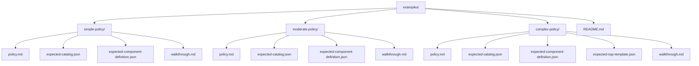
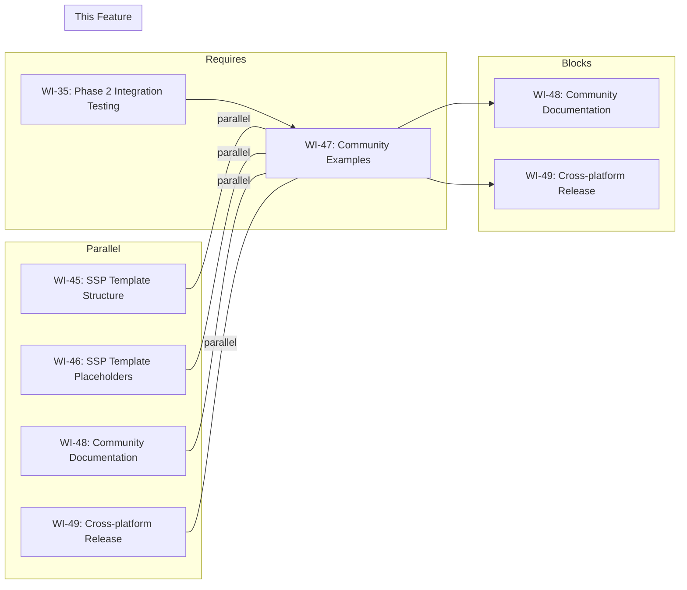

# 047-prd-community-examples

> **Document Type:** Product Requirements Document
> **Audience:** LLM agents, human reviewers
> **Status:** Draft
> **Last Updated:** 2026-02-10 <!-- @auto -->
> **Owner:** Brian Luby <!-- @human-required -->

**Feature Branch**: `047-community-examples`
**Created**: 2026-02-10
**Status**: Draft
**Input**: Derived from FORGE Product Roadmap WI-47

---

## Review Tier Legend

| Marker | Tier | Speckit Behavior |
|--------|------|------------------|
| :red_circle: `@human-required` | Human Generated | Prompt human to author; blocks until complete |
| :yellow_circle: `@human-review` | LLM + Human Review | LLM drafts → prompt human to confirm/edit; blocks until confirmed |
| :green_circle: `@llm-autonomous` | LLM Autonomous | LLM completes; no prompt; logged for audit |
| :white_circle: `@auto` | Auto-generated | System fills (timestamps, links); no prompt |

---

## Document Completion Order

> :warning: **For LLM Agents:** Complete sections in this order. Do not fill downstream sections until upstream human-required inputs exist.

1. **Context** (Background, Scope) → requires human input first
2. **Problem Statement & User Scenarios** → requires human input
3. **Requirements** (Must/Should/Could/Won't) → requires human input
4. **Technical Constraints** → human review
5. **Diagrams, Data Model, Interface** → LLM can draft after above exist
6. **Acceptance Criteria** → derived from requirements
7. **Everything else** → can proceed

---

## Context

### Background :red_circle: `@human-required`
This PRD covers **WI-47: Community Examples** from the FORGE Product Roadmap (Sprint S-47, Jan 26–30 2027, Theme T-6: Ecosystem & Community, Milestone MS-7). Strategic goal G-3 targets establishing FORGE as the standard open-source policy-to-OSCAL tool, measured by community adoption (50+ GitHub stars, 5+ organizations using FORGE). Community examples are essential for adoption: new users need concrete, working examples to understand what FORGE does, how to use it, and what output to expect. This work item creates a curated `examples/` directory containing 3+ sample Markdown policy documents of varying complexity, the expected OSCAL outputs for each (Catalog, Component Definition, and optionally SSP template), and annotated walkthroughs explaining each stage of the conversion pipeline. These examples serve as both onboarding material for new users and golden-file reference implementations for contributors.

> **Confidence Level:** :orange_circle: Exploratory — Phase 3 scope is directionally agreed; scope and timing are flexible.

### Scope Boundaries :yellow_circle: `@human-review`

**In Scope:**
- Creating 3+ sample Markdown policy documents covering different complexity levels (simple, moderate, complex)
- Generating expected OSCAL outputs for each sample: Catalog JSON, Component Definition JSON, and (optionally) SSP template JSON
- Writing annotated walkthroughs for each example explaining the conversion pipeline step-by-step (input parsing, requirement extraction, OSCAL generation)
- Organizing all examples in an `examples/` directory at the repository root with a clear directory structure
- Ensuring all sample policies and expected outputs are self-contained (no external dependencies)
- Verifying that expected outputs pass `forge validate` (schema validation from WI-19+)
- Including a README in the `examples/` directory explaining the example structure and how to run them

**Out of Scope:**
- Sample policies for non-Markdown formats (PDF, DOCX) — FORGE currently supports Markdown only
- Automated test harness for examples (golden-file testing is covered by WI-21/WI-22) — examples are for human consumption
- Community contribution guidelines (CONTRIBUTING.md) — deferred to WI-48
- Comprehensive OSCAL specification tutorial — examples explain FORGE conversion, not the OSCAL standard itself
- Real-world organizational policies — all examples are synthetic/fictional to avoid IP and sensitivity concerns
- Profile or Assessment Plan example outputs — deferred to future work items if needed

### Glossary :yellow_circle: `@human-review`

| Term | Definition |
|------|------------|
| Sample Policy | A synthetic Markdown document written to demonstrate FORGE's conversion capabilities, structured with headings, requirement statements, and citations |
| Expected Output | The OSCAL JSON file(s) that FORGE should produce when converting a given sample policy, used as a reference for correctness |
| Annotated Walkthrough | A Markdown document explaining each stage of the FORGE conversion pipeline for a specific example, with commentary on how input elements map to output elements |
| Golden File | A known-correct output file used to verify that FORGE produces the expected result (distinct from examples in purpose: golden files are for automated testing, examples are for human learning) |
| Conversion Pipeline | The end-to-end FORGE process: ingest (read file) → parse (extract structure) → model (domain representation) → generate (OSCAL output) → validate (schema check) |

### Related Documents :white_circle: `@auto`

| Document | Link | Relationship |
|----------|------|--------------|
| Parent PRD | docs/FORGE_PRD.md | Parent requirements; community adoption supports all M-requirements |
| Product Roadmap | docs/FORGE_PRODUCT_ROADMAP.md | Sprint S-47 context |
| Product Vision | docs/FORGE_PRODUCT_VISION.md | Strategic goal G-3 (Community Adoption) |
| Constitution | .specify/memory/constitution.md | Technical constraints and quality gates |
| Depends On (Phase 2) | WI-35 | Phase 2 integration testing ensures stable pipeline outputs |
| Related | docs/PRD/045-prd-ssp-template-structure.md | SSP template examples depend on WI-45 output |

---

## Problem Statement :red_circle: `@human-required`

FORGE's README and documentation describe what the tool does, but without concrete, runnable examples, potential users and contributors cannot quickly understand the tool's capabilities, expected input format, or output quality. New users face three barriers: (1) they must write or find a Markdown policy document to test with, not knowing what structure FORGE expects; (2) they cannot verify whether their output is correct without a known-good reference; (3) they cannot understand the conversion pipeline without tracing through a real example. Without examples, the learning curve is steep, adoption is slow, and contributors lack context for understanding the codebase. Community examples eliminate these barriers by providing ready-to-run sample policies, verified expected outputs, and annotated explanations of the conversion process.

---

## User Scenarios & Testing :red_circle: `@human-required`

### User Story 1 — New User Runs First Conversion (Priority: P1)

A new user clones the FORGE repository, finds a sample policy, and runs their first conversion to see FORGE in action.

> As a new FORGE user, I want to find a sample policy document in the repository and run `forge convert` on it so that I can see FORGE produce OSCAL output within minutes of cloning the repo.

**Why this priority**: First impressions drive adoption. If a new user cannot see FORGE work within 5 minutes, they are likely to abandon the tool. This is the most critical user experience for G-3.

**Independent Test**: Clone the repository, navigate to `examples/`, pick any sample policy, run `forge convert examples/simple-policy/policy.md --strategy catalog --format json`, and verify the output matches the expected output file.

**Acceptance Scenarios**:
1. **Given** a freshly cloned FORGE repository, **When** navigating to the `examples/` directory, **Then** a README file exists explaining the available examples and how to run them.
2. **Given** any sample policy in the examples directory, **When** running `forge convert <sample-policy> --strategy catalog --format json`, **Then** the output is valid OSCAL JSON that matches the provided expected output file.

---

### User Story 2 — Verify Output Correctness (Priority: P1)

A user or contributor compares FORGE output against the expected output to verify correctness.

> As a FORGE contributor, I want expected OSCAL outputs for each sample policy so that I can verify my changes haven't broken the conversion pipeline by comparing actual output against the reference.

**Why this priority**: Expected outputs serve as regression references. Contributors need confidence that their changes produce correct results. This directly supports code quality and contribution velocity.

**Independent Test**: Run `forge convert` on each sample policy, then diff the actual output against the expected output file and verify they match (ignoring timestamps and UUIDs).

**Acceptance Scenarios**:
1. **Given** a sample policy and its expected Catalog output, **When** running `forge convert <sample> --strategy catalog --format json`, **Then** the output matches the expected output (modulo timestamps and generated UUIDs).
2. **Given** a sample policy and its expected Component Definition output, **When** running `forge convert <sample> --strategy component --format json`, **Then** the output matches the expected output (modulo timestamps and generated UUIDs).

---

### User Story 3 — Understand Conversion Pipeline (Priority: P2)

A contributor reads the annotated walkthrough to understand how FORGE transforms policy text into OSCAL elements.

> As a potential FORGE contributor, I want an annotated walkthrough of the conversion pipeline for at least one example so that I understand how policy sections, requirements, and citations map to OSCAL controls, statements, and back-matter resources.

**Why this priority**: Understanding the pipeline is essential for contributors but not required for basic usage. The walkthrough bridges the gap between documentation and code, making the codebase approachable.

**Independent Test**: Read the annotated walkthrough for one example and verify it explains each pipeline stage (ingest, parse, model, generate, validate) with concrete input/output snippets.

**Acceptance Scenarios**:
1. **Given** the annotated walkthrough for a sample policy, **When** reading it, **Then** it explains each pipeline stage with before/after snippets showing how input text maps to OSCAL output elements.
2. **Given** the annotated walkthrough, **When** following its instructions, **Then** a reader can reproduce the described conversion and trace specific OSCAL elements back to their source policy text.

---

## Assumptions & Risks :yellow_circle: `@human-review`

### Assumptions
- [A-1] The FORGE conversion pipeline (through Phase 2) is stable and produces consistent outputs suitable for use as expected reference files.
- [A-2] Sample policies are synthetic/fictional and do not contain any real organizational security data.
- [A-3] Expected outputs can be regenerated by running FORGE on the sample policies, ensuring they stay in sync with the tool's behavior.
- [A-4] UUIDs and timestamps in expected outputs will differ between generation runs; comparison tooling or documentation will note these expected differences.
- [A-5] The `examples/` directory will be versioned alongside the codebase and maintained as the tool evolves.

### Risks
| ID | Risk | Likelihood | Impact | Mitigation |
|----|------|------------|--------|------------|
| R-1 | Expected outputs become stale as FORGE evolves, leading to user confusion | Med | Med | Include a script or CI check to regenerate expected outputs; note version compatibility in README |
| R-2 | Sample policies are too simple or too complex to be useful | Low | Med | Create 3 examples at different complexity levels (simple, moderate, complex); solicit community feedback |
| R-3 | Annotated walkthroughs become outdated as pipeline implementation changes | Med | Low | Keep walkthroughs focused on conceptual mapping rather than implementation details; update alongside pipeline changes |
| R-4 | Sample policy text inadvertently resembles a real organization's policy, creating confusion | Low | Low | Use obviously fictional organization names and policy content; include disclaimer in README |

---

## Feature Overview

### Flow Diagram :yellow_circle: `@human-review`



### State Diagram (if applicable) :yellow_circle: `@human-review`
N/A — No state transitions. Examples are static reference files.

---

## Requirements

### Must Have (M) — MVP, launch blockers :red_circle: `@human-required`
- [ ] **M-1:** The repository shall contain an `examples/` directory at the project root with at least 3 sample Markdown policy documents of varying complexity.
- [ ] **M-2:** Each sample policy shall have an accompanying expected OSCAL Catalog JSON output file that FORGE produces when run with `--strategy catalog --format json`.
- [ ] **M-3:** Each sample policy shall have an accompanying expected OSCAL Component Definition JSON output file that FORGE produces when run with `--strategy component --format json`.
- [ ] **M-4:** All expected output files shall pass `forge validate` (schema validation) without errors.
- [ ] **M-5:** The `examples/` directory shall contain a README.md explaining: the purpose of the examples, directory structure, how to run each example, and how to compare output against expected files.
- [ ] **M-6:** At least one sample policy shall include an annotated walkthrough (Markdown file) explaining each stage of the conversion pipeline with concrete input/output snippets.

### Should Have (S) — High value, not blocking :red_circle: `@human-required`
- [ ] **S-1:** Each of the 3+ sample policies shall include an annotated walkthrough (not just one).
- [ ] **S-2:** The sample policies shall demonstrate different structural patterns: (a) simple flat policy with few requirements, (b) moderately structured policy with nested sections and citations, (c) complex policy with compound statements, cross-references, and multiple requirement categories.
- [ ] **S-3:** At least one sample policy shall include an expected SSP template JSON output (demonstrating WI-45/WI-46 SSP template generation).
- [ ] **S-4:** Expected output files shall use deterministic UUIDs (via FORGE's stable UUID generation from WI-7) so that output comparison is reproducible.

### Could Have (C) — Nice to have, if time permits :yellow_circle: `@human-review`
- [ ] **C-1:** A shell script (e.g., `examples/run-all.sh`) that regenerates all expected outputs, making it easy to update examples when FORGE's output format changes.
- [ ] **C-2:** The README could include a quick-start section with copy-pasteable commands for the most common use case (single policy to Catalog).
- [ ] **C-3:** A comparison utility or instructions for diffing actual vs. expected output while ignoring timestamps and UUIDs.

### Won't Have (W) — Explicitly deferred :yellow_circle: `@human-review`
- [ ] **W-1:** Sample policies in non-Markdown formats (PDF, DOCX) — *Reason: FORGE currently supports Markdown only*
- [ ] **W-2:** Automated golden-file test harness for examples — *Reason: Golden-file testing is WI-21/WI-22; examples are for human consumption*
- [ ] **W-3:** Real-world organizational policy examples — *Reason: IP and sensitivity concerns; all examples must be synthetic*
- [ ] **W-4:** Profile or Assessment Plan example outputs — *Reason: Deferred to future work items if needed*

---

## Technical Constraints :yellow_circle: `@human-review`

- **Language/Framework:** Sample policies are Markdown; expected outputs are JSON; walkthroughs are Markdown
- **Directory Structure:** `examples/` at repository root; subdirectories per example (e.g., `examples/simple-policy/`, `examples/moderate-policy/`, `examples/complex-policy/`)
- **File Naming:** Consistent naming: `policy.md`, `expected-catalog.json`, `expected-component-definition.json`, `expected-ssp-template.json` (optional), `walkthrough.md`
- **Reproducibility:** Expected outputs must be reproducible by running FORGE on the sample policy with the documented command; UUIDs should be deterministic (WI-7 stable UUIDs)
- **Validation:** All expected JSON outputs must pass `forge validate` without errors
- **Content:** All sample policies must be synthetic/fictional; no real organizational data
- **Licensing:** Sample policies and outputs are covered by the project's MIT license
- **Dependencies:** No additional crates or tools required; examples are static files

---

## Data Model (if applicable) :yellow_circle: `@human-review`

N/A — This work item produces static example files, not data structures. The examples demonstrate the existing data model and conversion pipeline defined in prior work items.

---

## Interface Contract (if applicable) :yellow_circle: `@human-review`

N/A — No new code interfaces. Examples use the existing FORGE CLI interface:

```bash
# Run conversion on a sample policy
forge convert examples/simple-policy/policy.md --strategy catalog --format json --output output.json

# Compare against expected output (user workflow)
diff output.json examples/simple-policy/expected-catalog.json

# Validate expected output
forge validate examples/simple-policy/expected-catalog.json
```

---

## Evaluation Criteria :yellow_circle: `@human-review`

| Criterion | Weight | Metric | Target | Notes |
|-----------|--------|--------|--------|-------|
| Example Count | Critical | Number of sample policies | >= 3 | Minimum 3, covering different complexity levels |
| Output Correctness | Critical | Expected outputs pass forge validate | 100% | All expected JSONs must be schema-valid |
| Reproducibility | Critical | Running FORGE on sample produces matching output | 100% | Deterministic UUIDs enable exact comparison |
| Walkthrough Quality | High | Pipeline stages explained with input/output snippets | >= 1 walkthrough | At least one annotated walkthrough |
| Onboarding Time | Medium | Time for new user to run first example | < 5 minutes | README provides clear instructions |

---

## Tool/Approach Candidates :yellow_circle: `@human-review`

| Option | License | Pros | Cons | Spike Result |
|--------|---------|------|------|--------------|
| Static files in examples/ directory | MIT | Simple; no tooling required; version-controlled alongside code | Must be manually updated when FORGE output changes | Selected |
| Auto-generated examples via build script | N/A | Always up-to-date | Adds build complexity; examples not visible in repo without running build | Rejected for initial implementation; C-1 script provides optional regeneration |
| External documentation site with examples | N/A | Rich formatting, interactive | Adds hosting dependency; disconnected from repo; maintenance overhead | Rejected; examples should live in the repository |

### Selected Approach :red_circle: `@human-required`
> **Decision:** Static files in an `examples/` directory at the repository root, organized by complexity level, with expected outputs and annotated walkthroughs committed alongside source policies.
> **Rationale:** Simplest approach that achieves adoption goals; examples are immediately available to anyone who clones the repo; no build or hosting dependencies. An optional regeneration script (C-1) can keep expected outputs in sync as FORGE evolves.

---

## Acceptance Criteria :yellow_circle: `@human-review`

| AC ID | Requirement | User Story | Given | When | Then |
|-------|-------------|------------|-------|------|------|
| AC-1 | M-1 | US-1 | A freshly cloned FORGE repository | Listing the contents of `examples/` | At least 3 subdirectories exist, each containing a `policy.md` file |
| AC-2 | M-2, M-3 | US-2 | Any sample policy directory | Listing its contents | Both `expected-catalog.json` and `expected-component-definition.json` files are present |
| AC-3 | M-4 | US-2 | Any expected output JSON file | Running `forge validate <expected-output.json>` | Validation passes with zero errors |
| AC-4 | M-5 | US-1 | The `examples/` directory | Opening `examples/README.md` | The README explains the purpose, directory structure, run instructions, and output comparison guidance |
| AC-5 | M-6 | US-3 | At least one sample policy directory | Opening `walkthrough.md` | The walkthrough explains each pipeline stage (ingest, parse, model, generate, validate) with input/output snippets |
| AC-6 | M-2, M-3 | US-2 | Any sample policy | Running `forge convert <policy.md> --strategy catalog --format json` | The output matches the expected-catalog.json file (modulo timestamps and UUIDs if not deterministic) |

### Edge Cases :green_circle: `@llm-autonomous`
- [ ] **EC-1:** (M-1) When a sample policy contains only a single requirement, then FORGE still produces valid Catalog and Component Definition outputs with one control/implemented-requirement.
- [ ] **EC-2:** (M-2) When expected output files are regenerated after a FORGE update, then the regenerated files also pass `forge validate`.
- [ ] **EC-3:** (M-1) When a sample policy contains Unicode characters (e.g., em dashes, smart quotes), then FORGE handles them correctly and the expected output is valid JSON.
- [ ] **EC-4:** (M-5) When a user follows the README instructions on a supported platform (Linux, macOS), then the commands work as documented without modification.

---

## Dependencies :yellow_circle: `@human-review`



- **Requires:** [WI-35: Phase 2 Integration Testing](docs/PRD/035-prd-phase2-integration.md) — the conversion pipeline must be stable and validated before creating reference example outputs
- **Parallel With:** [WI-45: SSP Template Structure](docs/PRD/045-prd-ssp-template-structure.md), [WI-46: SSP Template Placeholders](docs/PRD/046-prd-ssp-template-placeholders.md), [WI-48: Community Documentation](docs/PRD/048-prd-community-documentation.md), [WI-49: Cross-platform Release](docs/PRD/049-prd-cross-platform-release.md) — runs in the same Phase 3 timeframe
- **Blocks:** [WI-48: Community Documentation](docs/PRD/048-prd-community-documentation.md) — documentation references examples for usage guide; [WI-49: Cross-platform Release](docs/PRD/049-prd-cross-platform-release.md) — release package should include working examples
- **External:** None

---

## Security Considerations :yellow_circle: `@human-review`

| Aspect | Assessment | Notes |
|--------|------------|-------|
| Internet Exposure | No | Static files in repository; no network operations |
| Sensitive Data | No | All sample policies are synthetic/fictional; no real organizational security data |
| Authentication Required | No | Public repository; examples are publicly visible |
| Security Review Required | No | No code execution surface; sample policies contain no sensitive data. Care must be taken that sample policies do not inadvertently resemble real organizational policies |

---

## Implementation Guidance :green_circle: `@llm-autonomous`

### Suggested Approach
Create the `examples/` directory at the repository root with the following structure:

```
examples/
  README.md
  simple-policy/
    policy.md
    expected-catalog.json
    expected-component-definition.json
    walkthrough.md
  moderate-policy/
    policy.md
    expected-catalog.json
    expected-component-definition.json
    walkthrough.md
  complex-policy/
    policy.md
    expected-catalog.json
    expected-component-definition.json
    expected-ssp-template.json
    walkthrough.md
```

**Sample Policy Design:**

1. **Simple Policy** (`simple-policy/policy.md`): A short access control policy with 3–5 flat requirements, no nested sections, no citations. Demonstrates the minimal conversion case.

2. **Moderate Policy** (`moderate-policy/policy.md`): An information security policy with 8–12 requirements across 3–4 nested sections (e.g., Access Control, Audit, Incident Response), including 2–3 citations to NIST SP 800-53 controls. Demonstrates section hierarchy, requirement atomization, and citation extraction.

3. **Complex Policy** (`complex-policy/policy.md`): A comprehensive security policy with 15–20 requirements across 5+ sections, compound statements requiring atomization, cross-references between sections, multiple citation sources, and both normative ("shall") and advisory ("should") language. Demonstrates the full pipeline capability.

**Expected Output Generation:**
Run FORGE on each sample policy with all supported strategies and capture the output. Verify each output passes `forge validate`. Commit the outputs as reference files.

**Walkthrough Writing:**
For each example, write a Markdown document that walks through the conversion pipeline stage by stage:
1. **Input**: Show the raw policy text
2. **Parse**: Explain how headings become sections and requirement sentences are extracted
3. **Model**: Show the domain model representation (PolicyDocument → PolicySections → PolicyRequirements)
4. **Generate**: Show how domain model elements map to OSCAL elements (controls, statements, back-matter)
5. **Validate**: Confirm the output passes schema validation

Include before/after code snippets at each stage.

### Anti-patterns to Avoid
- Using real organizational policy text — all content must be synthetic/fictional
- Creating examples that only work with a specific FORGE version without noting compatibility — include version note in README
- Writing walkthroughs that reference internal implementation details (function names, module structure) — keep walkthroughs conceptual and user-focused
- Making expected outputs dependent on non-deterministic behavior (random UUIDs, timestamps) — use FORGE's deterministic UUID generation (WI-7)
- Creating overly trivial examples that don't demonstrate meaningful conversion features

### Reference Examples
- NIST OSCAL content repository: https://github.com/usnistgov/oscal-content — example OSCAL documents for reference
- Rust CLI tool example directories: common pattern in open-source Rust projects for onboarding
- FORGE golden-file tests (WI-21/WI-22) for validated output patterns

---

## Spike Tasks :yellow_circle: `@human-review`

N/A — No spike tasks. Example creation is a documentation/content task building on the established pipeline.

---

## Success Metrics :red_circle: `@human-required`

| Metric | Baseline | Target | Measurement Method |
|--------|----------|--------|-------------------|
| Example count | 0 | >= 3 sample policies | Count files in examples/ |
| Output validity | N/A | 100% of expected outputs pass forge validate | Automated validation |
| Walkthrough coverage | 0 | >= 1 annotated walkthrough (target: all 3) | File count |
| New user onboarding time | N/A | < 5 minutes to run first example | Manual testing / user feedback |
| Contributor understanding | N/A | Walkthrough enables pipeline comprehension | Qualitative feedback |

### Technical Verification :green_circle: `@llm-autonomous`
| Metric | Target | Verification Method |
|--------|--------|---------------------|
| All expected outputs valid | 100% | `forge validate` on each expected output file |
| Examples reproducible | 100% | `forge convert` on each policy matches expected output |
| README instructions work | 100% | Manual walkthrough on clean clone |

---

## Definition of Ready :red_circle: `@human-required`

### Readiness Checklist
- [x] Problem statement reviewed and validated by stakeholder
- [x] All Must Have requirements have acceptance criteria
- [x] Technical constraints are explicit and agreed
- [x] Dependencies identified and owners confirmed
- [x] Security review completed (or N/A documented with justification)
- [x] No open questions blocking implementation

### Sign-off
| Role | Name | Date | Decision |
|------|------|------|----------|
| Product Owner | Brian Luby | YYYY-MM-DD | [Ready / Not Ready] |

---

## Changelog :white_circle: `@auto`

| Version | Date | Author | Changes |
|---------|------|--------|---------|
| 0.1 | 2026-02-10 | LLM (Claude) | Initial draft derived from FORGE Product Roadmap WI-47 |

---

## Decision Log :yellow_circle: `@human-review`

| Date | Decision | Rationale | Alternatives Considered |
|------|----------|-----------|------------------------|
| 2026-02-10 | Static files in repository rather than auto-generated examples | Immediately visible on clone; no build dependency; simplest approach for initial community release | Auto-generated via build script (adds complexity; examples not visible without build), external docs site (hosting dependency; disconnected from repo) |
| 2026-02-10 | Three complexity levels (simple, moderate, complex) | Covers the range of user needs from quick-start to comprehensive demo; demonstrates breadth of FORGE capabilities | Single example (insufficient), 5+ examples (maintenance burden for initial release) |
| 2026-02-10 | Synthetic/fictional policy content only | Avoids IP concerns, sensitivity risks, and legal complications; clearly demonstrates functionality without real-world baggage | Adapted real-world policies (IP risk; sensitivity concerns), NIST reference policies (may not demonstrate FORGE-specific features) |
| 2026-02-10 | Include annotated walkthroughs alongside examples | Walkthroughs bridge the gap between examples and codebase understanding; essential for contributor onboarding | Code comments only (insufficient context), separate tutorial docs (disconnected from examples) |

---

## Open Questions :yellow_circle: `@human-review`

- [ ] **OQ-1:** Should sample policies use a fictional organization name (e.g., "Acme Corp") or be generic (e.g., "Organization Security Policy")? A named fictional organization makes examples more relatable but requires consistent naming across all examples.
- [ ] **OQ-2:** Should the `examples/` directory include a Makefile or shell script for regenerating expected outputs (C-1), or should this be deferred to WI-48 (community documentation)?

---

## Review Checklist :green_circle: `@llm-autonomous`

Before marking as Approved:
- [x] All requirements have unique IDs (M-1 through M-6, S-1 through S-4, C-1 through C-3, W-1 through W-4)
- [x] All Must Have requirements have linked acceptance criteria
- [x] User stories are prioritized and independently testable
- [x] Acceptance criteria reference both requirement IDs and user stories
- [x] Glossary terms are used consistently throughout
- [x] Diagrams use terminology from Glossary
- [x] Security considerations documented
- [x] Definition of Ready checklist is complete
- [x] No open questions blocking implementation (OQ-1 and OQ-2 are non-blocking preferences)
