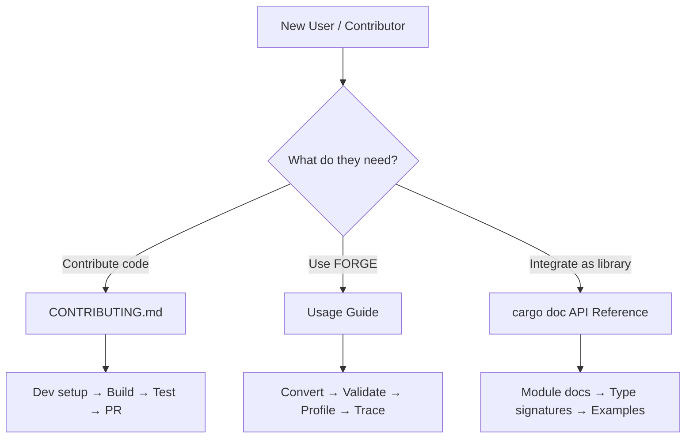
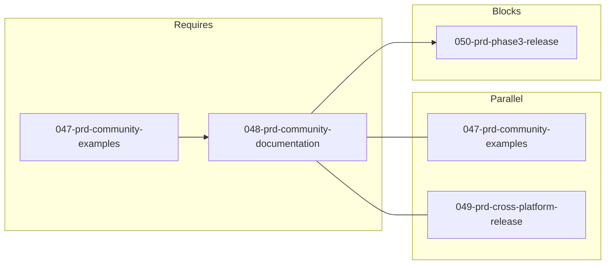

# 048-prd-community-documentation

> **Document Type:** Product Requirements Document
> **Audience:** LLM agents, human reviewers
> **Status:** Draft
> **Last Updated:** 2026-02-10 <!-- @auto -->
> **Owner:** Brian Luby <!-- @human-required -->

**Feature Branch**: `048-community-documentation`
**Created**: 2026-02-10
**Status**: Draft
**Input**: Derived from FORGE Product Roadmap WI-48

---

## Review Tier Legend

| Marker | Tier | Speckit Behavior |
|--------|------|------------------|
| :red_circle: `@human-required` | Human Generated | Prompt human to author; blocks until complete |
| :yellow_circle: `@human-review` | LLM + Human Review | LLM drafts → prompt human to confirm/edit; blocks until confirmed |
| :green_circle: `@llm-autonomous` | LLM Autonomous | LLM completes; no prompt; logged for audit |
| :white_circle: `@auto` | Auto-generated | System fills (timestamps, links); no prompt |

---

## Document Completion Order

> :warning: **For LLM Agents:** Complete sections in this order. Do not fill downstream sections until upstream human-required inputs exist.

1. **Context** (Background, Scope) → requires human input first
2. **Problem Statement & User Scenarios** → requires human input
3. **Requirements** (Must/Should/Could/Won't) → requires human input
4. **Technical Constraints** → human review
5. **Diagrams, Data Model, Interface** → LLM can draft after above exist
6. **Acceptance Criteria** → derived from requirements
7. **Everything else** → can proceed

---

## Context

### Background :red_circle: `@human-required`
This PRD covers **WI-48: Community Documentation** from the FORGE Product Roadmap (Sprint S-48, Feb 2–6 2027, Theme T-6: Ecosystem & Community, Milestone MS-7). As FORGE approaches community release, comprehensive documentation is essential for adoption. New contributors need a clear development setup guide, users need a workflow-oriented usage guide, and API consumers need generated reference documentation. WI-47 established community examples with sample policies and expected outputs; WI-48 builds on that foundation by providing the written guides and reference material that make FORGE accessible to developers, users, and integrators who were not involved in its creation.

### Scope Boundaries :yellow_circle: `@human-review`

**In Scope:**
- Creating CONTRIBUTING.md with development environment setup, build instructions, test commands, and contribution workflow
- Writing a usage guide covering common FORGE workflows (convert, validate, profile, trace, batch operations)
- Generating `cargo doc` API documentation with module-level and public API doc comments
- Ensuring documentation references the community examples from WI-47

**Out of Scope:**
- Video tutorials or screencasts — deferred to post-release community efforts
- Hosted documentation site (e.g., mdBook, GitHub Pages) — deferred; initial docs are Markdown in the repository
- Internals/architecture documentation for contributors — covered by existing docs/ directory
- Translation or localization of documentation — not planned for this horizon
- Marketing materials or blog posts — outside project scope

### Glossary :yellow_circle: `@human-review`

| Term | Definition |
|------|------------|
| CONTRIBUTING.md | Standard open-source file providing contribution guidelines, development setup, and workflow instructions |
| cargo doc | Rust's built-in documentation generator that produces HTML API reference from doc comments in source code |
| Usage Guide | A task-oriented document showing users how to accomplish common workflows with FORGE |
| Doc Comments | Rust comments (`///` or `//!`) that are compiled into API documentation by `cargo doc` |
| Community Examples | Sample Markdown policies and expected OSCAL outputs created in WI-47 |

### Related Documents :white_circle: `@auto`

| Document | Link | Relationship |
|----------|------|--------------|
| Parent PRD | docs/FORGE_PRD.md | Parent requirements |
| Product Roadmap | docs/FORGE_PRODUCT_ROADMAP.md | Sprint S-48 context |
| Product Vision | docs/FORGE_PRODUCT_VISION.md | Strategic goal G-3 (Community Adoption) |
| Constitution | .specify/memory/constitution.md | Technical constraints and quality gates |
| WI-47 PRD | docs/PRD/047-prd-community-examples.md | Prerequisite: community examples |

---

## Problem Statement :red_circle: `@human-required`

FORGE has been developed over 47 sprints with comprehensive functionality spanning Markdown-to-OSCAL conversion, validation, profile generation, traceability, batch processing, and more. However, the project lacks the written documentation that external developers and users need to get started. Without a CONTRIBUTING.md, potential contributors cannot set up a development environment or understand the contribution workflow. Without a usage guide, users must read source code or PRDs to discover available features. Without `cargo doc` API documentation, integrators cannot understand the public API surface. This documentation gap is the primary barrier to community adoption and must be addressed before the ecosystem release.

---

## User Scenarios & Testing :red_circle: `@human-required`

### User Story 1 — New Contributor Setup (Priority: P1)

A developer discovers FORGE and wants to contribute code improvements.

> As an open-source contributor, I want clear instructions for setting up the FORGE development environment so that I can build, test, and submit changes without guessing at the workflow.

**Why this priority**: Without contribution docs, the project cannot grow beyond its original author. This is the most critical enabler for community adoption (G-3).

**Independent Test**: Follow CONTRIBUTING.md from a clean machine and verify that the developer can clone, build, test, and run FORGE successfully.

**Acceptance Scenarios**:
1. **Given** a developer with Rust installed, **When** following CONTRIBUTING.md, **Then** they can clone the repo, run `cargo build`, `cargo test`, and `cargo run -- --help` successfully.
2. **Given** a developer reading CONTRIBUTING.md, **When** looking for the contribution workflow, **Then** they find branch naming conventions, PR guidelines, and CI expectations.

---

### User Story 2 — User Workflows (Priority: P1)

A compliance engineer installs FORGE and needs to learn how to convert their organization's security policy.

> As a compliance engineer using FORGE, I want a usage guide with common workflows so that I can convert, validate, and work with OSCAL artifacts without reading source code.

**Why this priority**: The usage guide is the primary onboarding path for non-developer users and directly supports community adoption.

**Independent Test**: Follow the usage guide to convert a sample Markdown policy to OSCAL Catalog JSON, validate the output, and generate a profile.

**Acceptance Scenarios**:
1. **Given** a user reading the usage guide, **When** following the "Convert a policy" workflow, **Then** they can produce a valid OSCAL Catalog JSON from a sample Markdown document.
2. **Given** a user reading the usage guide, **When** looking for available commands, **Then** all FORGE subcommands (convert, validate, profile, trace, export) are documented with examples.

---

### User Story 3 — API Reference (Priority: P2)

A developer wants to use FORGE as a library or understand its internal module structure.

> As a developer integrating FORGE, I want generated API documentation so that I can understand the public API surface, module organization, and type signatures.

**Why this priority**: API docs enable library-level integration and help contributors navigate the codebase. Lower priority than user-facing docs because most users interact via CLI.

**Independent Test**: Run `cargo doc --no-deps --open` and verify that all public modules and types have meaningful documentation.

**Acceptance Scenarios**:
1. **Given** the FORGE source code, **When** running `cargo doc --no-deps`, **Then** documentation is generated without warnings for missing docs on public items.
2. **Given** the generated API docs, **When** browsing module pages, **Then** each public module has a module-level doc comment explaining its purpose.

---

## Assumptions & Risks :yellow_circle: `@human-review`

### Assumptions
- [A-1] Developers using FORGE have Rust stable toolchain installed or can install it following rustup.rs instructions.
- [A-2] The usage guide references community examples from WI-47 as ready-to-use starting points.
- [A-3] `cargo doc` will be run as part of CI to catch documentation regressions.

### Risks
| ID | Risk | Likelihood | Impact | Mitigation |
|----|------|------------|--------|------------|
| R-1 | Documentation becomes stale as features evolve post-release | Medium | Medium | Include doc review in PR checklist; CI lint for `cargo doc` warnings |
| R-2 | Usage guide does not cover edge cases users encounter | Low | Low | Community examples from WI-47 supplement the guide; GitHub Issues provide feedback channel |

---

## Feature Overview

### Flow Diagram :yellow_circle: `@human-review`

### State Diagram (if applicable) :yellow_circle: `@human-review`
N/A — No state transitions in this work item. Documentation is static content.

---

## Requirements

### Must Have (M) — MVP, launch blockers :red_circle: `@human-required`
- [ ] **M-1:** A CONTRIBUTING.md file shall exist at the repository root with development setup instructions (prerequisites, clone, build, test, run).
- [ ] **M-2:** CONTRIBUTING.md shall document the contribution workflow (branch naming, commit conventions, PR process, CI expectations).
- [ ] **M-3:** A usage guide shall document common workflows: converting Markdown to OSCAL Catalog, converting to Component Definition, validating output, and generating profiles.
- [ ] **M-4:** The usage guide shall include concrete command examples with expected output descriptions for each workflow.
- [ ] **M-5:** All public modules shall have module-level doc comments (`//!`) explaining their purpose and role in the pipeline.
- [ ] **M-6:** `cargo doc --no-deps` shall complete without warnings for missing documentation on public items.

### Should Have (S) — High value, not blocking :red_circle: `@human-required`
- [ ] **S-1:** The usage guide shall include a "Quick Start" section that takes users from installation to first successful conversion in under 5 minutes.
- [ ] **S-2:** The usage guide shall reference community examples from WI-47 as starting points for each workflow.
- [ ] **S-3:** CONTRIBUTING.md shall include a "Common Issues" or FAQ section addressing known setup problems.

### Could Have (C) — Nice to have, if time permits :yellow_circle: `@human-review`
- [ ] **C-1:** Doc comments on public functions and structs include inline code examples that are tested by `cargo test --doc`.
- [ ] **C-2:** A table of contents or index page linking all documentation resources (README, CONTRIBUTING, usage guide, API docs, examples).

### Won't Have (W) — Explicitly deferred :yellow_circle: `@human-review`
- [ ] **W-1:** Hosted documentation site (mdBook, GitHub Pages) — *Reason: Deferred to post-release; Markdown in-repo docs are sufficient for initial community release*
- [ ] **W-2:** Video tutorials or interactive walkthroughs — *Reason: Outside current scope; community can contribute post-release*
- [ ] **W-3:** Architecture or internals documentation — *Reason: Existing docs/ directory covers this; focus here is on user/contributor-facing docs*

---

## Technical Constraints :yellow_circle: `@human-review`

- **Language/Framework:** Rust (latest stable), Cargo build system
- **Documentation Tool:** `cargo doc` for API reference generation
- **Doc Format:** Markdown for CONTRIBUTING.md and usage guide
- **CI Integration:** `cargo doc --no-deps` must succeed without warnings as part of CI quality gates
- **Linting:** `cargo clippy -- -D warnings` must pass (per constitution quality gates)
- **Formatting:** `cargo fmt --all` must produce no changes (per constitution quality gates)
- **Testing:** `cargo test` must pass; doc tests (if added) must pass

---

## Data Model (if applicable) :yellow_circle: `@human-review`

N/A — No data model changes in this work item. This work item produces documentation artifacts only.

---

## Interface Contract (if applicable) :yellow_circle: `@human-review`

N/A — No code interface changes in this work item. Documentation describes existing interfaces.

---

## Evaluation Criteria :yellow_circle: `@human-review`

| Criterion | Weight | Metric | Target | Notes |
|-----------|--------|--------|--------|-------|
| CONTRIBUTING.md completeness | Critical | Covers setup, build, test, contribute workflow | All sections present | Enables contributor onboarding |
| Usage guide coverage | Critical | Documents all major CLI workflows | convert, validate, profile, trace, export covered | Enables user adoption |
| API doc coverage | High | `cargo doc --no-deps` warnings | Zero warnings | Ensures comprehensive API reference |

---

## Tool/Approach Candidates :yellow_circle: `@human-review`

| Option | License | Pros | Cons | Spike Result |
|--------|---------|------|------|--------------|
| Markdown in-repo docs | N/A | Simple, no build step, version-controlled with code | No search, no navigation beyond GitHub rendering | Selected for initial release |
| mdBook | MIT/Apache-2.0 | Rich HTML output, search, chapter organization | Requires hosting, adds build dependency | Deferred to post-release |
| cargo doc (built-in) | N/A | Standard Rust tooling, automatic from source | Only covers API, not user guides | Selected for API reference |

### Selected Approach :red_circle: `@human-required`
> **Decision:** Markdown files in repository for CONTRIBUTING.md and usage guide; `cargo doc` for API reference
> **Rationale:** Minimizes tooling overhead, keeps documentation version-controlled alongside code, and uses standard Rust documentation practices. A hosted doc site can be added post-release if community demand warrants it.

---

## Acceptance Criteria :yellow_circle: `@human-review`

| AC ID | Requirement | User Story | Given | When | Then |
|-------|-------------|------------|-------|------|------|
| AC-1 | M-1, M-2 | US-1 | A developer with Rust installed | Following CONTRIBUTING.md | They can clone, build, test, and run FORGE; contribution workflow is clear |
| AC-2 | M-3, M-4 | US-2 | A user reading the usage guide | Following a workflow example | They can execute the documented commands and produce expected results |
| AC-3 | M-5, M-6 | US-3 | FORGE source code | Running `cargo doc --no-deps` | Documentation generates without warnings; all public modules have doc comments |
| AC-4 | S-1 | US-2 | A new user | Following the Quick Start section | They complete their first conversion in under 5 minutes |
| AC-5 | S-2 | US-2 | A user reading the usage guide | Looking for example inputs | Community examples from WI-47 are referenced and linked |

### Edge Cases :green_circle: `@llm-autonomous`
- [ ] **EC-1:** (M-1) When a developer has a non-standard Rust installation, then CONTRIBUTING.md references rustup.rs as the canonical installation method.
- [ ] **EC-2:** (M-3) When a user tries a workflow not covered in the guide, then the guide points to `forge --help` and `forge <subcommand> --help` for complete option lists.
- [ ] **EC-3:** (M-6) When a new public item is added without doc comments, then CI fails with a `cargo doc` warning, preventing documentation regression.

---

## Dependencies :yellow_circle: `@human-review`

- **Requires:** WI-47 (Community Examples — provides sample policies and expected outputs referenced by documentation)
- **Parallel With:** WI-47, WI-49
- **Blocks:** WI-50 (Phase 3 Integration Testing & Release)
- **External:** Rust stable toolchain, `cargo doc`

---

## Security Considerations :yellow_circle: `@human-review`

| Aspect | Assessment | Notes |
|--------|------------|-------|
| Internet Exposure | No | Documentation files in repository; no network services |
| Sensitive Data | No | Documentation only; no credentials or secrets |
| Authentication Required | No | Public repository documentation |
| Security Review Required | N/A | No attack surface; documentation artifacts only |

---

## Implementation Guidance :green_circle: `@llm-autonomous`

### Suggested Approach
Start with CONTRIBUTING.md at the repository root, following conventions from popular Rust open-source projects (e.g., ripgrep, bat, fd). Structure it with sections: Prerequisites, Getting Started, Building, Testing, Code Style, Submitting Changes, and Common Issues. For the usage guide, create a docs/USAGE.md or docs/usage-guide.md organized by workflow (Quick Start, Convert to Catalog, Convert to Component Definition, Validate, Generate Profile, Trace, Batch Convert, Export Formats). Each workflow should include the command, expected output, and a reference to a WI-47 community example. For API docs, add `//!` module-level comments to each top-level module and `///` doc comments to all public types, functions, and methods. Add `#![warn(missing_docs)]` to lib.rs to enforce documentation coverage at compile time.

### Anti-patterns to Avoid
- Writing documentation that describes implementation details rather than user-facing behavior
- Duplicating CLI `--help` text verbatim in the usage guide instead of providing workflow context
- Leaving doc comments as trivial restatements of function names (e.g., `/// Gets the name` on `fn get_name()`)
- Writing CONTRIBUTING.md that assumes familiarity with the project's history or architecture

### Reference Examples
- ripgrep CONTRIBUTING: https://github.com/BurntSushi/ripgrep
- Rust API Guidelines on documentation: https://rust-lang.github.io/api-guidelines/documentation.html
- The Rust Book on doc comments: https://doc.rust-lang.org/book/ch14-02-publishing-to-crates-io.html

---

## Spike Tasks :yellow_circle: `@human-review`

N/A — No spike tasks for this work item. Documentation formats and tooling are well-established.

---

## Success Metrics :red_circle: `@human-required`

| Metric | Baseline | Target | Measurement Method |
|--------|----------|--------|-------------------|
| CONTRIBUTING.md exists and is complete | N/A | All sections present | Manual review |
| Usage guide covers all workflows | N/A | All CLI subcommands documented | Manual review |
| API doc warnings | N/A | Zero warnings | `cargo doc --no-deps` |

### Technical Verification :green_circle: `@llm-autonomous`
| Metric | Target | Verification Method |
|--------|--------|---------------------|
| `cargo doc --no-deps` warnings | 0 | CI pipeline |
| Doc test pass rate | 100% | `cargo test --doc` |
| No clippy warnings | 0 | `cargo clippy -- -D warnings` |
| No formatting violations | 0 | `cargo fmt --check` |

---

## Definition of Ready :red_circle: `@human-required`

### Readiness Checklist
- [x] Problem statement reviewed and validated by stakeholder
- [x] All Must Have requirements have acceptance criteria
- [x] Technical constraints are explicit and agreed
- [x] Dependencies identified and owners confirmed
- [x] Security review completed (or N/A documented with justification)
- [x] No open questions blocking implementation

### Sign-off
| Role | Name | Date | Decision |
|------|------|------|----------|
| Product Owner | Brian Luby | YYYY-MM-DD | [Ready / Not Ready] |

---

## Changelog :white_circle: `@auto`

| Version | Date | Author | Changes |
|---------|------|--------|---------|
| 0.1 | 2026-02-10 | LLM (Claude) | Initial draft derived from FORGE Product Roadmap WI-48 |

---

## Decision Log :yellow_circle: `@human-review`

| Date | Decision | Rationale | Alternatives Considered |
|------|----------|-----------|------------------------|
| 2026-02-10 | Use Markdown in-repo docs over hosted site | Minimizes tooling, keeps docs versioned with code, sufficient for initial release | mdBook (deferred), GitHub Wiki (less discoverable) |
| 2026-02-10 | Enforce `cargo doc` warnings in CI | Prevents documentation regression as new public items are added | Manual review only (error-prone) |

---

## Open Questions :yellow_circle: `@human-review`

No open questions for this work item.

---

## Review Checklist :green_circle: `@llm-autonomous`

Before marking as Approved:
- [x] All requirements have unique IDs (M-1 through M-6, S-1 through S-3, C-1 through C-2, W-1 through W-3)
- [x] All Must Have requirements have linked acceptance criteria
- [x] User stories are prioritized and independently testable
- [x] Acceptance criteria reference both requirement IDs and user stories
- [x] Glossary terms are used consistently throughout
- [x] Diagrams use terminology from Glossary
- [x] Security considerations documented (N/A justified)
- [x] Definition of Ready checklist is complete
- [x] No open questions blocking implementation
