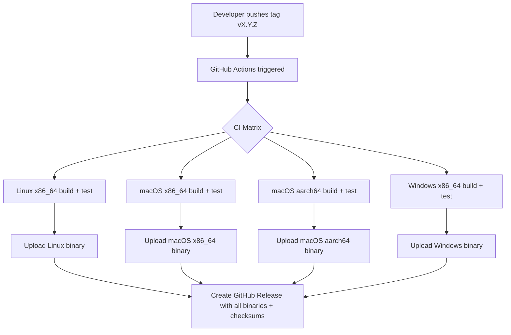
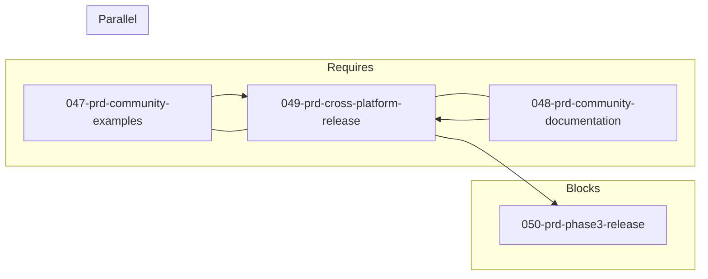

# 049-prd-cross-platform-release

> **Document Type:** Product Requirements Document
> **Audience:** LLM agents, human reviewers
> **Status:** Draft
> **Last Updated:** 2026-02-10 <!-- @auto -->
> **Owner:** Brian Luby <!-- @human-required -->

**Feature Branch**: `049-cross-platform-release`
**Created**: 2026-02-10
**Status**: Draft
**Input**: Derived from FORGE Product Roadmap WI-49

---

## Review Tier Legend

| Marker | Tier | Speckit Behavior |
|--------|------|------------------|
| :red_circle: `@human-required` | Human Generated | Prompt human to author; blocks until complete |
| :yellow_circle: `@human-review` | LLM + Human Review | LLM drafts → prompt human to confirm/edit; blocks until confirmed |
| :green_circle: `@llm-autonomous` | LLM Autonomous | LLM completes; no prompt; logged for audit |
| :white_circle: `@auto` | Auto-generated | System fills (timestamps, links); no prompt |

---

## Document Completion Order

> :warning: **For LLM Agents:** Complete sections in this order. Do not fill downstream sections until upstream human-required inputs exist.

1. **Context** (Background, Scope) → requires human input first
2. **Problem Statement & User Scenarios** → requires human input
3. **Requirements** (Must/Should/Could/Won't) → requires human input
4. **Technical Constraints** → human review
5. **Diagrams, Data Model, Interface** → LLM can draft after above exist
6. **Acceptance Criteria** → derived from requirements
7. **Everything else** → can proceed

---

## Context

### Background :red_circle: `@human-required`
This PRD covers **WI-49: Cross-Platform Release** from the FORGE Product Roadmap (Sprint S-49, Feb 9–13 2027, Theme T-6: Ecosystem & Community, Milestone MS-7). FORGE has been developed and tested primarily on a single platform throughout its 48-sprint development cycle. For community adoption (Vision Goal G-3), users on Linux, macOS, and Windows need to be able to install and run FORGE without building from source. This work item establishes a GitHub Actions CI pipeline that produces pre-built binaries for all three major platforms, publishes them via GitHub Releases, and provides installation instructions for both `cargo install` and direct binary download. WI-47 (Community Examples) and WI-48 (Community Documentation) provide the documentation and examples that accompany these release binaries.

### Scope Boundaries :yellow_circle: `@human-review`

**In Scope:**
- GitHub Actions CI workflow for building FORGE on Linux (x86_64), macOS (x86_64 and aarch64/ARM), and Windows (x86_64)
- Automated pre-built binary releases via GitHub Releases on tagged versions
- Installation instructions covering `cargo install forge` and direct binary download
- Release artifact checksums (SHA-256) for integrity verification
- CI matrix testing across all target platforms

**Out of Scope:**
- Package manager distribution (Homebrew, apt, chocolatey, etc.) — deferred to post-release based on community demand
- Container images (Docker, OCI) — deferred; CLI binary distribution is the priority
- Nightly or rolling release builds — only tagged version releases
- Cross-compilation from a single CI runner — use native runners per platform
- Code signing or notarization — deferred to post-release if required for macOS Gatekeeper

### Glossary :yellow_circle: `@human-review`

| Term | Definition |
|------|------------|
| GitHub Actions | GitHub's CI/CD platform for automating build, test, and release workflows |
| GitHub Releases | GitHub feature for publishing versioned release artifacts (binaries, changelogs) associated with git tags |
| CI Matrix | A GitHub Actions strategy that runs the same workflow across multiple configurations (OS, architecture) in parallel |
| Pre-built Binary | A compiled executable distributed to users so they do not need to build from source |
| cargo install | Rust's package manager command for building and installing a crate from source via crates.io or a git repository |
| Cross-compilation | Building a binary on one platform that targets a different platform's architecture |
| SHA-256 Checksum | Cryptographic hash used to verify the integrity of downloaded binary files |

### Related Documents :white_circle: `@auto`

| Document | Link | Relationship |
|----------|------|--------------|
| Parent PRD | docs/FORGE_PRD.md | Parent requirements |
| Product Roadmap | docs/FORGE_PRODUCT_ROADMAP.md | Sprint S-49 context |
| Product Vision | docs/FORGE_PRODUCT_VISION.md | Strategic goal G-3 (Community Adoption) |
| Constitution | .specify/memory/constitution.md | Technical constraints and quality gates |
| WI-47 PRD | docs/PRD/047-prd-community-examples.md | Prerequisite: community examples |
| WI-48 PRD | docs/PRD/048-prd-community-documentation.md | Prerequisite: community documentation |

---

## Problem Statement :red_circle: `@human-required`

FORGE is a Rust CLI tool that currently can only be obtained by building from source with `cargo build`. This requires users to have the Rust toolchain installed and to clone the repository — a significant barrier for compliance engineers and security professionals who want to use FORGE but are not Rust developers. Without pre-built binaries for Linux, macOS, and Windows, FORGE cannot achieve the community adoption envisioned in Goal G-3. Without automated CI builds across platforms, there is no assurance that FORGE compiles and runs correctly on all target operating systems. This work item eliminates the "must build from source" barrier and establishes the release infrastructure needed for ongoing community distribution.

---

## User Scenarios & Testing :red_circle: `@human-required`

### User Story 1 — Binary Download and Install (Priority: P1)

A compliance engineer on macOS wants to install FORGE without installing the Rust toolchain.

> As a compliance engineer, I want to download a pre-built FORGE binary for my operating system so that I can start converting policies to OSCAL without setting up a Rust development environment.

**Why this priority**: This is the primary adoption path for non-developer users. Without pre-built binaries, FORGE is effectively limited to Rust developers.

**Independent Test**: Download the binary for the target platform from GitHub Releases, make it executable, and run `forge --help` to verify it works.

**Acceptance Scenarios**:
1. **Given** a tagged release on GitHub, **When** navigating to the Releases page, **Then** pre-built binaries are available for Linux (x86_64), macOS (x86_64, aarch64), and Windows (x86_64).
2. **Given** a downloaded binary, **When** running `forge --help`, **Then** usage text is displayed without any additional dependencies or setup.
3. **Given** a downloaded binary and its SHA-256 checksum, **When** verifying the checksum, **Then** the hash matches the published value.

---

### User Story 2 — Install via cargo install (Priority: P1)

A Rust developer wants to install FORGE using the standard Rust package manager workflow.

> As a Rust developer, I want to install FORGE via `cargo install` so that I can use the standard Rust toolchain workflow I am already familiar with.

**Why this priority**: `cargo install` is the expected installation method for Rust developers and requires publishing to crates.io or supporting installation from the git repository.

**Independent Test**: Run `cargo install --git <repo-url>` or `cargo install forge` and verify the binary is installed to `~/.cargo/bin/forge`.

**Acceptance Scenarios**:
1. **Given** the FORGE repository, **When** running `cargo install --git https://github.com/policy-forge/forge`, **Then** the binary is compiled and installed to `~/.cargo/bin/forge`.
2. **Given** an installed FORGE binary, **When** running `forge --version`, **Then** the version matches the tagged release.

---

### User Story 3 — CI Cross-Platform Validation (Priority: P1)

A contributor pushes code and needs assurance that it compiles and passes tests on all target platforms.

> As a FORGE contributor, I want CI to build and test on Linux, macOS, and Windows so that I know my changes work across all supported platforms before merging.

**Why this priority**: Cross-platform CI is essential for maintaining binary compatibility and catching platform-specific issues early.

**Independent Test**: Push a change to a PR branch and verify that GitHub Actions runs build and test jobs on all three platforms.

**Acceptance Scenarios**:
1. **Given** a pull request, **When** CI runs, **Then** build and test jobs execute on Linux, macOS, and Windows.
2. **Given** a CI run, **When** all platform jobs complete, **Then** the results are reported individually per platform.
3. **Given** a failure on one platform, **When** viewing CI results, **Then** the failing platform is clearly identified.

---

## Assumptions & Risks :yellow_circle: `@human-review`

### Assumptions
- [A-1] GitHub Actions provides runners for Linux (ubuntu-latest), macOS (macos-latest), and Windows (windows-latest) with Rust toolchain available or installable.
- [A-2] FORGE has no platform-specific dependencies that would prevent compilation on any target platform.
- [A-3] Release binaries are statically linked or bundle all necessary runtime dependencies.

### Risks
| ID | Risk | Likelihood | Impact | Mitigation |
|----|------|------------|--------|------------|
| R-1 | Platform-specific compilation failures on Windows (path separators, file handling) | Medium | Medium | Add Windows-specific tests in CI; fix issues as they surface |
| R-2 | macOS aarch64 (Apple Silicon) runner availability or cost constraints | Low | Low | GitHub Actions supports aarch64 macOS runners; fallback to cross-compilation if needed |
| R-3 | Binary size too large for convenient download | Low | Low | Use `--release` with LTO; strip debug symbols |

---

## Feature Overview

### Flow Diagram :yellow_circle: `@human-review`



### State Diagram (if applicable) :yellow_circle: `@human-review`
N/A — No state transitions in this work item. The CI pipeline is a linear build-test-release flow.

---

## Requirements

### Must Have (M) — MVP, launch blockers :red_circle: `@human-required`
- [ ] **M-1:** A GitHub Actions workflow shall build FORGE on Linux (x86_64), macOS (x86_64), and Windows (x86_64) for every push to main and every pull request.
- [ ] **M-2:** The CI workflow shall run `cargo test` on all target platforms, failing the build if any tests fail.
- [ ] **M-3:** A release workflow shall be triggered by git tags matching `v*` (e.g., `v1.0.0`) and produce pre-built binaries for all target platforms.
- [ ] **M-4:** Release binaries shall be uploaded to GitHub Releases with descriptive asset names including the platform and architecture (e.g., `forge-v1.0.0-linux-x86_64`).
- [ ] **M-5:** SHA-256 checksums shall be generated and published alongside release binaries.
- [ ] **M-6:** Installation instructions shall document both `cargo install` from git and binary download from GitHub Releases.

### Should Have (S) — High value, not blocking :red_circle: `@human-required`
- [ ] **S-1:** The CI workflow shall include a macOS aarch64 (Apple Silicon) build target for native ARM binary distribution.
- [ ] **S-2:** Release binaries shall be built with `--release` profile, LTO enabled, and debug symbols stripped for minimal binary size.
- [ ] **S-3:** The release workflow shall auto-generate release notes from git log or conventional commit messages.

### Could Have (C) — Nice to have, if time permits :yellow_circle: `@human-review`
- [ ] **C-1:** A `cargo install forge` path via crates.io publication.
- [ ] **C-2:** A shell one-liner installation script (similar to rustup) for quick binary installation on Unix systems.

### Won't Have (W) — Explicitly deferred :yellow_circle: `@human-review`
- [ ] **W-1:** Package manager distribution (Homebrew, apt, chocolatey) — *Reason: Deferred to post-release based on community demand and maintenance burden*
- [ ] **W-2:** Docker/OCI container images — *Reason: CLI binary distribution is sufficient for initial release*
- [ ] **W-3:** Code signing or macOS notarization — *Reason: Deferred to post-release if macOS Gatekeeper issues arise*
- [ ] **W-4:** Nightly or rolling release builds — *Reason: Only tagged version releases for stability*

---

## Technical Constraints :yellow_circle: `@human-review`

- **Language/Framework:** Rust (latest stable), Cargo build system
- **CI Platform:** GitHub Actions with matrix strategy for multi-platform builds
- **Target Platforms:** Linux x86_64 (ubuntu-latest), macOS x86_64 (macos-latest), Windows x86_64 (windows-latest); macOS aarch64 as a should-have
- **Release Tool:** GitHub Releases via `gh` CLI or GitHub Actions release action
- **Build Profile:** `--release` with LTO for production binaries
- **Linting:** `cargo clippy -- -D warnings` must pass on all platforms
- **Formatting:** `cargo fmt --check` must pass
- **Testing:** `cargo test` must pass on all target platforms

---

## Data Model (if applicable) :yellow_circle: `@human-review`

N/A — No data model changes in this work item. This work item produces CI/CD configuration and release infrastructure.

---

## Interface Contract (if applicable) :yellow_circle: `@human-review`

```yaml
# GitHub Actions Release Workflow (conceptual)
# .github/workflows/release.yml

name: Release
on:
  push:
    tags: ['v*']

jobs:
  build:
    strategy:
      matrix:
        include:
          - os: ubuntu-latest
            target: x86_64-unknown-linux-gnu
            artifact: forge-linux-x86_64
          - os: macos-latest
            target: x86_64-apple-darwin
            artifact: forge-macos-x86_64
          - os: macos-latest
            target: aarch64-apple-darwin
            artifact: forge-macos-aarch64
          - os: windows-latest
            target: x86_64-pc-windows-msvc
            artifact: forge-windows-x86_64.exe
    runs-on: ${{ matrix.os }}
    steps:
      - uses: actions/checkout@v4
      - uses: dtolnay/rust-toolchain@stable
      - run: cargo build --release
      - run: cargo test --release
      # Upload artifact with platform-specific name

  release:
    needs: build
    steps:
      # Download all artifacts
      # Generate SHA-256 checksums
      # Create GitHub Release with binaries and checksums
```

---

## Evaluation Criteria :yellow_circle: `@human-review`

| Criterion | Weight | Metric | Target | Notes |
|-----------|--------|--------|--------|-------|
| Cross-platform CI | Critical | Build + test on Linux, macOS, Windows | All pass | Ensures portability |
| Release binaries | Critical | Binaries available on GitHub Releases | All 3+ platforms | Enables adoption |
| Installation docs | High | Instructions for cargo install + binary download | Both paths documented | Lowers barrier to entry |

---

## Tool/Approach Candidates :yellow_circle: `@human-review`

| Option | License | Pros | Cons | Spike Result |
|--------|---------|------|------|--------------|
| GitHub Actions (native runners) | Free for public repos | Native compilation, no cross-compile issues, integrated with GitHub Releases | Runner minutes limits (not a concern for public repos) | Selected |
| cross (cross-rs) | MIT/Apache-2.0 | Cross-compile from one runner | Docker-based, slower, may introduce subtle issues | Deferred; native runners preferred |
| cargo-dist | MIT/Apache-2.0 | Automated release pipeline for Rust | Additional dependency, opinionated workflow | Consider for future simplification |

### Selected Approach :red_circle: `@human-required`
> **Decision:** GitHub Actions with native platform runners for CI builds and GitHub Releases for binary distribution
> **Rationale:** Native runners eliminate cross-compilation complexity, GitHub Releases is the standard distribution mechanism for open-source projects, and this approach requires no additional tools or services. GitHub Actions is free for public repositories.

---

## Acceptance Criteria :yellow_circle: `@human-review`

| AC ID | Requirement | User Story | Given | When | Then |
|-------|-------------|------------|-------|------|------|
| AC-1 | M-1, M-2 | US-3 | A pull request to main | CI runs | Build and test jobs pass on Linux, macOS, and Windows |
| AC-2 | M-3, M-4 | US-1 | A git tag `v1.0.0` is pushed | Release workflow runs | Pre-built binaries for all platforms are uploaded to GitHub Releases |
| AC-3 | M-5 | US-1 | Release binaries on GitHub Releases | Downloading binary and checksum | SHA-256 checksum matches the downloaded binary |
| AC-4 | M-6 | US-2 | Installation instructions in documentation | Following cargo install steps | FORGE binary is installed and runnable |
| AC-5 | S-1 | US-1 | A tagged release | Checking GitHub Releases | A macOS aarch64 binary is available |
| AC-6 | S-2 | US-1 | Release binary | Checking binary size | Binary is built with release profile, LTO, and stripped symbols |

### Edge Cases :green_circle: `@llm-autonomous`
- [ ] **EC-1:** (M-1) When a platform-specific test fails, then the CI failure clearly identifies which platform failed and which test(s) are affected.
- [ ] **EC-2:** (M-3) When a tag does not match the `v*` pattern, then the release workflow does not trigger.
- [ ] **EC-3:** (M-4) When the Windows binary is built, then the artifact name includes the `.exe` extension.
- [ ] **EC-4:** (M-6) When a user downloads a Linux binary, then the installation instructions explain how to make it executable (`chmod +x`) and add it to PATH.

---

## Dependencies :yellow_circle: `@human-review`



- **Requires:** WI-47 (Community Examples — examples accompany release), WI-48 (Community Documentation — docs accompany release)
- **Parallel With:** WI-47, WI-48
- **Blocks:** WI-50 (Phase 3 Integration Testing & Release)
- **External:** GitHub Actions, GitHub Releases, Rust stable toolchain

---

## Security Considerations :yellow_circle: `@human-review`

| Aspect | Assessment | Notes |
|--------|------------|-------|
| Internet Exposure | No | CI runs in GitHub's infrastructure; no user-facing network services |
| Sensitive Data | Low | GitHub Actions secrets for release publishing; managed by GitHub |
| Authentication Required | No | Binaries are publicly downloadable |
| Security Review Required | Low | SHA-256 checksums provide integrity verification; code signing deferred |
| Supply Chain | Low | Builds from source on trusted GitHub runners; no third-party binary dependencies |

---

## Implementation Guidance :green_circle: `@llm-autonomous`

### Suggested Approach
Create `.github/workflows/ci.yml` for the main CI pipeline with a matrix strategy covering `ubuntu-latest`, `macos-latest`, and `windows-latest`. Each job should install the Rust stable toolchain (using `dtolnay/rust-toolchain@stable`), run `cargo fmt --check`, `cargo clippy -- -D warnings`, and `cargo test`. Create `.github/workflows/release.yml` triggered on `v*` tags, building with `--release` profile, stripping debug symbols, generating SHA-256 checksums, and uploading artifacts to a GitHub Release. Use the `softprops/action-gh-release` action or `gh release create` for publishing. Add a Cargo.toml `[profile.release]` section with `lto = true` and `strip = true`. Document installation in the README and the usage guide from WI-48.

### Anti-patterns to Avoid
- Using cross-compilation when native runners are available — native builds are more reliable
- Hardcoding version numbers in workflow files — derive from git tag
- Skipping tests in the release workflow to save CI time — release binaries must pass all tests
- Publishing binaries without checksums — users cannot verify download integrity
- Using `actions/upload-release-asset` (deprecated) — use `softprops/action-gh-release` or `gh CLI`

### Reference Examples
- ripgrep release workflow: https://github.com/BurntSushi/ripgrep/blob/master/.github/workflows/release.yml
- dtolnay/rust-toolchain action: https://github.com/dtolnay/rust-toolchain
- softprops/action-gh-release: https://github.com/softprops/action-gh-release

---

## Spike Tasks :yellow_circle: `@human-review`

N/A — No spike tasks for this work item. GitHub Actions CI/CD for Rust is well-documented and widely used.

---

## Success Metrics :red_circle: `@human-required`

| Metric | Baseline | Target | Measurement Method |
|--------|----------|--------|-------------------|
| Platforms with CI builds | 1 (development machine) | 3+ (Linux, macOS x2, Windows) | GitHub Actions matrix |
| Release binaries available | 0 | 3+ per release | GitHub Releases page |
| Installation paths documented | 0 | 2 (cargo install + binary download) | Documentation review |

### Technical Verification :green_circle: `@llm-autonomous`
| Metric | Target | Verification Method |
|--------|--------|---------------------|
| CI passes on all platforms | 100% | GitHub Actions status checks |
| Release binaries functional | All pass `forge --help` | Smoke test in release workflow |
| SHA-256 checksums present | All binaries | GitHub Releases page inspection |
| No clippy warnings (all platforms) | 0 | `cargo clippy -- -D warnings` in CI |

---

## Definition of Ready :red_circle: `@human-required`

### Readiness Checklist
- [x] Problem statement reviewed and validated by stakeholder
- [x] All Must Have requirements have acceptance criteria
- [x] Technical constraints are explicit and agreed
- [x] Dependencies identified and owners confirmed
- [x] Security review completed (or N/A documented with justification)
- [x] No open questions blocking implementation

### Sign-off
| Role | Name | Date | Decision |
|------|------|------|----------|
| Product Owner | Brian Luby | YYYY-MM-DD | [Ready / Not Ready] |

---

## Changelog :white_circle: `@auto`

| Version | Date | Author | Changes |
|---------|------|--------|---------|
| 0.1 | 2026-02-10 | LLM (Claude) | Initial draft derived from FORGE Product Roadmap WI-49 |

---

## Decision Log :yellow_circle: `@human-review`

| Date | Decision | Rationale | Alternatives Considered |
|------|----------|-----------|------------------------|
| 2026-02-10 | Use native GitHub Actions runners per platform over cross-compilation | Native builds are more reliable and avoid cross-compile toolchain complexity | cross-rs (Docker-based cross-compilation), single-platform build |
| 2026-02-10 | Publish via GitHub Releases over crates.io as primary distribution | GitHub Releases is simpler for binary distribution; crates.io is a could-have for Rust developers | crates.io only (excludes non-Rust users), self-hosted downloads (maintenance burden) |

---

## Open Questions :yellow_circle: `@human-review`

No open questions for this work item.

---

## Review Checklist :green_circle: `@llm-autonomous`

Before marking as Approved:
- [x] All requirements have unique IDs (M-1 through M-6, S-1 through S-3, C-1 through C-2, W-1 through W-4)
- [x] All Must Have requirements have linked acceptance criteria
- [x] User stories are prioritized and independently testable
- [x] Acceptance criteria reference both requirement IDs and user stories
- [x] Glossary terms are used consistently throughout
- [x] Diagrams use terminology from Glossary
- [x] Security considerations documented
- [x] Definition of Ready checklist is complete
- [x] No open questions blocking implementation
