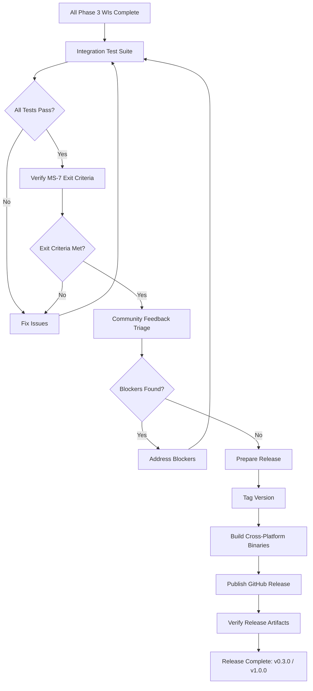
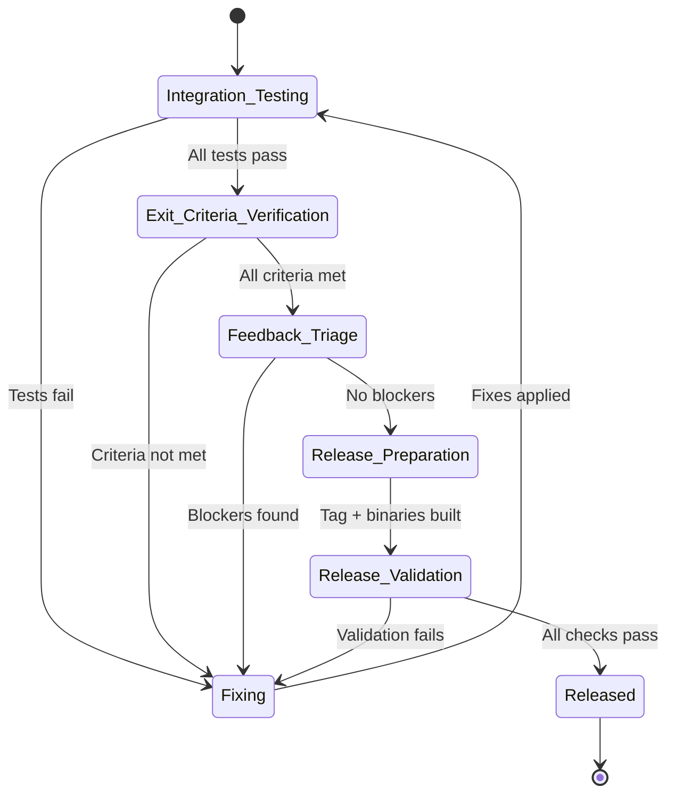
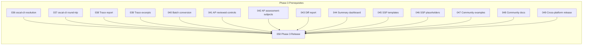

# 050-prd-phase3-release

> **Document Type:** Product Requirements Document
> **Audience:** LLM agents, human reviewers
> **Status:** Draft
> **Last Updated:** 2026-02-10 <!-- @auto -->
> **Owner:** Brian Luby <!-- @human-required -->

**Feature Branch**: `050-phase3-release`
**Created**: 2026-02-10
**Status**: Draft
**Input**: Derived from FORGE Product Roadmap WI-50

---

## Review Tier Legend

| Marker | Tier | Speckit Behavior |
|--------|------|------------------|
| :red_circle: `@human-required` | Human Generated | Prompt human to author; blocks until complete |
| :yellow_circle: `@human-review` | LLM + Human Review | LLM drafts → prompt human to confirm/edit; blocks until confirmed |
| :green_circle: `@llm-autonomous` | LLM Autonomous | LLM completes; no prompt; logged for audit |
| :white_circle: `@auto` | Auto-generated | System fills (timestamps, links); no prompt |

---

## Document Completion Order

> :warning: **For LLM Agents:** Complete sections in this order. Do not fill downstream sections until upstream human-required inputs exist.

1. **Context** (Background, Scope) → requires human input first
2. **Problem Statement & User Scenarios** → requires human input
3. **Requirements** (Must/Should/Could/Won't) → requires human input
4. **Technical Constraints** → human review
5. **Diagrams, Data Model, Interface** → LLM can draft after above exist
6. **Acceptance Criteria** → derived from requirements
7. **Everything else** → can proceed

---

## Context

### Background :red_circle: `@human-required`
This PRD covers **WI-50: Phase 3 Integration Testing & Release** from the FORGE Product Roadmap (Sprint S-50, Feb 16–20+ 2027, Theme T-6: Ecosystem & Community, Milestone MS-7). This is the final work item in the FORGE roadmap, serving as the capstone integration testing and release gate for all Phase 3 work (WI-36 through WI-49). Phase 3 added ecosystem capabilities including oscal-cli integration (WI-36, WI-37), traceability reporting (WI-38, WI-39), batch conversion (WI-40), Assessment Plan scaffolding (WI-41, WI-42), diff reporting (WI-43), summary dashboard (WI-44), SSP template generation (WI-45, WI-46), community examples (WI-47), community documentation (WI-48), and cross-platform release infrastructure (WI-49). WI-50 validates that all these features work together end-to-end, integrates any community feedback received during Phase 3 development, and tags the final release as v0.3.0 or v1.0.0 depending on maturity assessment. This work item satisfies the MS-7 exit criteria: "oscal-cli integration tested; community examples published; Assessment Plan scaffolding working."

### Scope Boundaries :yellow_circle: `@human-review`

**In Scope:**
- Final integration testing across all Phase 3 features (WI-36 through WI-49)
- End-to-end testing of the full FORGE pipeline: ingestion through all OSCAL output models (Catalog, Component Definition, Profile, Assessment Plan scaffold, SSP template)
- Verification of MS-7 exit criteria: oscal-cli integration, community examples, Assessment Plan scaffolding
- Integration of community feedback received during Phase 3 development
- Version tagging and release preparation (v0.3.0 or v1.0.0)
- Final release notes, changelog, and announcement preparation
- Cross-platform release verification (Linux, macOS, Windows binaries from WI-49)

**Out of Scope:**
- New feature development — all features are implemented in WI-36 through WI-49
- Post-release support or maintenance planning — deferred to future roadmap
- SSP generation beyond templates — requires system-specific data
- Assessment Results or POA&M generation — requires actual assessment data
- Migration guides from other tools — deferred to community contribution

### Glossary :yellow_circle: `@human-review`

| Term | Definition |
|------|------------|
| Integration Testing | Testing that verifies multiple components work together correctly as a complete system |
| Exit Criteria | Specific, measurable conditions that must be met before a milestone is considered complete |
| Release Candidate | A version of the software that is potentially ready for final release, pending validation |
| Semantic Versioning | Version numbering scheme (MAJOR.MINOR.PATCH) conveying compatibility information |
| v0.3.0 | Minor version release indicating Phase 3 ecosystem features are complete but API stability is not yet guaranteed |
| v1.0.0 | Major version release indicating API stability and production readiness |
| Changelog | A document recording notable changes for each version of the project |
| Community Feedback | Issues, suggestions, and bug reports from users and contributors during Phase 3 development |

### Related Documents :white_circle: `@auto`

| Document | Link | Relationship |
|----------|------|--------------|
| Parent PRD | docs/FORGE_PRD.md | Parent requirements |
| Product Roadmap | docs/FORGE_PRODUCT_ROADMAP.md | Sprint S-50 context, MS-7 exit criteria |
| Product Vision | docs/FORGE_PRODUCT_VISION.md | Strategic goals G-1 through G-4 |
| Constitution | .specify/memory/constitution.md | Technical constraints and quality gates |
| All Phase 3 PRDs | docs/PRD/036-prd-* through docs/PRD/049-prd-* | Prerequisites: all Phase 3 work items |

---

## Problem Statement :red_circle: `@human-required`

Phase 3 of the FORGE roadmap spans 15 work items (WI-36 through WI-49) developed over 14 sprints, adding ecosystem integration, advanced reporting, Assessment Plan scaffolding, SSP templates, community documentation, and cross-platform release infrastructure. Each work item was developed and tested independently, but no comprehensive integration test has verified that all these features work together as a cohesive product. Without this final integration testing and release gate, there is no assurance that the full FORGE pipeline — from Markdown ingestion through all OSCAL output models, validation, traceability, batch processing, and oscal-cli interoperability — functions correctly end-to-end. Additionally, community feedback accumulated during Phase 3 must be triaged and addressed before the release. This work item is the quality gate between development and community release, ensuring that MS-7 exit criteria are met and the tagged release represents a reliable, documented, and tested product.

---

## User Scenarios & Testing :red_circle: `@human-required`

### User Story 1 — End-to-End Pipeline Validation (Priority: P1)

A release engineer needs to verify that FORGE works correctly across all supported workflows before tagging a release.

> As the release engineer, I want comprehensive integration tests covering all FORGE features so that I can confidently tag and publish a release knowing all capabilities work together.

**Why this priority**: The release cannot proceed without validated integration testing. This is the final quality gate.

**Independent Test**: Execute the full integration test suite covering all Phase 3 features and verify all tests pass on all target platforms.

**Acceptance Scenarios**:
1. **Given** FORGE built from the release candidate branch, **When** running the full test suite (`cargo test`), **Then** all unit, integration, and doc tests pass with zero failures.
2. **Given** a sample Markdown policy document, **When** running the complete pipeline (convert to Catalog, Component Definition, Profile; validate all outputs; generate trace report; batch convert), **Then** all operations succeed and produce valid OSCAL artifacts.
3. **Given** the generated OSCAL artifacts, **When** validating with oscal-cli, **Then** all artifacts pass oscal-cli validation without errors.

---

### User Story 2 — MS-7 Exit Criteria Verification (Priority: P1)

A stakeholder needs to verify that all MS-7 milestone exit criteria are satisfied.

> As the product owner, I want explicit verification of each MS-7 exit criterion so that I can approve the milestone completion and authorize the release.

**Why this priority**: Milestone exit criteria are the contractual definition of "done" for Phase 3. The release is blocked until all criteria are met.

**Independent Test**: Verify each MS-7 exit criterion independently: oscal-cli integration tested, community examples published, Assessment Plan scaffolding working.

**Acceptance Scenarios**:
1. **Given** FORGE with oscal-cli integration (WI-36, WI-37), **When** running profile resolution and round-trip validation via oscal-cli, **Then** operations complete successfully.
2. **Given** community examples from WI-47, **When** converting each example policy to OSCAL, **Then** the output matches expected results and examples are published in the repository.
3. **Given** the Assessment Plan scaffolding (WI-41, WI-42), **When** generating an Assessment Plan from a policy and component definition, **Then** a valid AP scaffold is produced with reviewed-controls, tasks, and assessment-subjects.

---

### User Story 3 — Community Release (Priority: P1)

A user downloads the released version and follows the documentation to complete their first policy conversion.

> As a new FORGE user, I want a tagged, documented, and tested release with pre-built binaries so that I can install FORGE and convert my first policy to OSCAL using the provided documentation and examples.

**Why this priority**: The entire roadmap builds toward this moment — a community-ready release that users can adopt.

**Independent Test**: Download the release binary, follow the Quick Start guide, convert a community example policy, and validate the output.

**Acceptance Scenarios**:
1. **Given** the tagged release on GitHub, **When** downloading a pre-built binary (from WI-49), **Then** it runs correctly on the target platform.
2. **Given** the released binary and documentation (from WI-48), **When** following the Quick Start guide, **Then** the user completes their first conversion within 5 minutes.
3. **Given** the released binary and community examples (from WI-47), **When** converting a sample policy, **Then** the output matches the expected OSCAL artifact provided with the example.

---

## Assumptions & Risks :yellow_circle: `@human-review`

### Assumptions
- [A-1] All Phase 3 work items (WI-36 through WI-49) have been completed and individually tested before WI-50 begins.
- [A-2] oscal-cli is available and functional for integration testing on the CI environment.
- [A-3] Community feedback received during Phase 3 is limited in scope and can be addressed within one sprint.
- [A-4] The version number decision (v0.3.0 vs v1.0.0) will be made by the product owner based on API stability assessment.

### Risks
| ID | Risk | Likelihood | Impact | Mitigation |
|----|------|------------|--------|------------|
| R-1 | Integration issues surface between features that were not caught in individual work item testing | Medium | Medium | Comprehensive end-to-end test scenarios; fix issues within this sprint |
| R-2 | Community feedback requires significant rework of completed features | Low | High | Triage feedback by severity; defer non-critical items to post-release; only address blockers |
| R-3 | Cross-platform issues discovered during release validation | Low | Medium | CI already covers all platforms from WI-49; focus on smoke testing release binaries |
| R-4 | oscal-cli version incompatibility with generated artifacts | Low | Medium | Pin oscal-cli version in CI; test against the specific version documented in WI-36 |

---

## Feature Overview

### Flow Diagram :yellow_circle: `@human-review`

### State Diagram (if applicable) :yellow_circle: `@human-review`

---

## Requirements

### Must Have (M) — MVP, launch blockers :red_circle: `@human-required`
- [ ] **M-1:** The full test suite (`cargo test`) shall pass with zero failures on all target platforms (Linux, macOS, Windows).
- [ ] **M-2:** An end-to-end integration test shall verify the complete pipeline: Markdown ingestion through Catalog, Component Definition, and Profile generation with validation.
- [ ] **M-3:** oscal-cli integration shall be tested: profile resolution delegation (WI-36) and round-trip validation (WI-37) shall pass.
- [ ] **M-4:** Community examples (WI-47) shall be verified: each sample policy converts to OSCAL and matches expected output.
- [ ] **M-5:** Assessment Plan scaffolding (WI-41, WI-42) shall produce valid AP scaffolds with reviewed-controls, tasks, and assessment-subjects.
- [ ] **M-6:** All Phase 3 features shall be exercised in integration tests: traceability reports, batch conversion, diff reports, summary dashboard, SSP templates.
- [ ] **M-7:** The release shall be tagged (v0.3.0 or v1.0.0) and published to GitHub Releases with cross-platform binaries and checksums.
- [ ] **M-8:** Release notes shall document all Phase 3 features, breaking changes (if any), and known limitations.

### Should Have (S) — High value, not blocking :red_circle: `@human-required`
- [ ] **S-1:** Community feedback received during Phase 3 shall be triaged, with blockers addressed before release and non-critical items documented as known issues.
- [ ] **S-2:** A CHANGELOG.md shall be updated (or created) covering all changes from v0.2.0 (or v0.1.0) through the release.
- [ ] **S-3:** Release binaries shall be smoke-tested on each target platform: download, run `forge --help`, convert a sample policy.

### Could Have (C) — Nice to have, if time permits :yellow_circle: `@human-review`
- [ ] **C-1:** Performance regression testing: verify that processing time for a 50-page document has not degraded from Phase 1 baseline (<30s target from WI-24).
- [ ] **C-2:** A release announcement draft for GitHub Discussions or project blog.

### Won't Have (W) — Explicitly deferred :yellow_circle: `@human-review`
- [ ] **W-1:** New feature development — *Reason: This sprint is exclusively for integration testing and release*
- [ ] **W-2:** Post-release support planning or roadmap for next major version — *Reason: Deferred to post-release retrospective*
- [ ] **W-3:** Migration guides from other policy-to-OSCAL tools — *Reason: Deferred to community contribution*

---

## Technical Constraints :yellow_circle: `@human-review`

- **Language/Framework:** Rust (latest stable), Cargo build system
- **CI Platform:** GitHub Actions with cross-platform matrix (from WI-49)
- **OSCAL Version:** v1.2.0 schemas for validation
- **oscal-cli:** Pinned version for integration testing (from WI-36)
- **Release Tool:** GitHub Releases via release workflow (from WI-49)
- **Linting:** `cargo clippy -- -D warnings` must pass on all platforms
- **Formatting:** `cargo fmt --check` must pass
- **Testing:** `cargo test` must pass on all target platforms with zero failures
- **Version Tagging:** Semantic versioning; tag format `v0.3.0` or `v1.0.0`

---

## Data Model (if applicable) :yellow_circle: `@human-review`

N/A — No data model changes in this work item. This work item validates the existing data model and pipeline.

---

## Interface Contract (if applicable) :yellow_circle: `@human-review`

N/A — No interface changes in this work item. This work item validates existing interfaces end-to-end.

---

## Evaluation Criteria :yellow_circle: `@human-review`

| Criterion | Weight | Metric | Target | Notes |
|-----------|--------|--------|--------|-------|
| Test suite pass rate | Critical | `cargo test` results | 100% pass, all platforms | No regressions allowed |
| MS-7 exit criteria | Critical | Each criterion verified | All 3 criteria met | oscal-cli, examples, AP scaffolding |
| Release published | Critical | GitHub Release exists | Tagged, binaries, checksums | Community can download and use |
| Community feedback | High | Blockers addressed | Zero open blockers | Non-critical items documented |

---

## Tool/Approach Candidates :yellow_circle: `@human-review`

| Option | License | Pros | Cons | Spike Result |
|--------|---------|------|------|--------------|
| Manual integration testing | N/A | Thorough, human judgment | Time-consuming, not repeatable | Supplement automated tests |
| Automated integration test suite | N/A | Repeatable, CI-integrated, catches regressions | Requires test fixture maintenance | Selected as primary approach |
| oscal-cli validation | NIST (public domain) | Authoritative OSCAL validation | External dependency | Selected for OSCAL validation |

### Selected Approach :red_circle: `@human-required`
> **Decision:** Automated integration test suite supplemented by manual verification of release artifacts and MS-7 exit criteria
> **Rationale:** Automated tests ensure repeatable validation on every commit. Manual verification provides human judgment for release readiness. oscal-cli provides authoritative OSCAL validation. This combination covers both automated regression detection and subjective quality assessment.

---

## Acceptance Criteria :yellow_circle: `@human-review`

| AC ID | Requirement | User Story | Given | When | Then |
|-------|-------------|------------|-------|------|------|
| AC-1 | M-1 | US-1 | Release candidate code | Running `cargo test` on Linux, macOS, Windows | All tests pass with zero failures |
| AC-2 | M-2 | US-1 | A sample Markdown policy | Running full pipeline (convert, validate, profile) | All OSCAL artifacts are generated and schema-valid |
| AC-3 | M-3 | US-2 | Generated OSCAL artifacts | Running oscal-cli validation and profile resolution | oscal-cli operations complete successfully |
| AC-4 | M-4 | US-2 | Community example policies from WI-47 | Converting each example | Output matches expected OSCAL artifacts |
| AC-5 | M-5 | US-2 | A policy and component definition | Generating Assessment Plan scaffold | Valid AP scaffold with reviewed-controls, tasks, assessment-subjects |
| AC-6 | M-6 | US-1 | Integration test suite | Running all Phase 3 feature tests | Trace, batch, diff, dashboard, SSP template tests pass |
| AC-7 | M-7 | US-3 | Approved release candidate | Tagging and publishing | GitHub Release exists with binaries for all platforms and checksums |
| AC-8 | M-8 | US-3 | Tagged release | Reading release notes | All Phase 3 features documented with known limitations |

### Edge Cases :green_circle: `@llm-autonomous`
- [ ] **EC-1:** (M-2) When running the full pipeline with a minimal single-section policy, then all output models are generated successfully (no crashes on small input).
- [ ] **EC-2:** (M-2) When running the full pipeline with a large multi-section policy (50+ pages), then all output models are generated within the performance target (<30s).
- [ ] **EC-3:** (M-6) When a Phase 3 feature is exercised with edge-case input (empty sections, missing metadata, special characters), then it fails gracefully with descriptive error messages.
- [ ] **EC-4:** (M-7) When the release tag is pushed, then the CI pipeline builds, tests, and publishes binaries for all platforms automatically.

---

## Dependencies :yellow_circle: `@human-review`

- **Requires:** ALL Phase 3 work items (WI-36 through WI-49)
- **Parallel With:** None — this is the final integration gate
- **Blocks:** Nothing — this is the last work item in the roadmap
- **External:** oscal-cli, GitHub Actions, GitHub Releases, Rust stable toolchain

---

## Security Considerations :yellow_circle: `@human-review`

| Aspect | Assessment | Notes |
|--------|------------|-------|
| Internet Exposure | No | CLI tool, no network services in the release |
| Sensitive Data | No | Integration tests use sample policies, no real security data |
| Authentication Required | No | Public repository and release |
| Security Review Required | Low | Review release binaries for accidental inclusion of test data or credentials; verify checksum integrity |
| Supply Chain | Low | Release binaries built from source on trusted CI runners; checksums published |

---

## Implementation Guidance :green_circle: `@llm-autonomous`

### Suggested Approach
Begin by creating a comprehensive integration test module (e.g., `tests/integration_phase3.rs`) that exercises all Phase 3 features in sequence: (1) convert a sample policy to Catalog, Component Definition, and Profile; (2) validate all outputs against OSCAL schemas; (3) run oscal-cli profile resolution and round-trip validation; (4) generate traceability report; (5) batch-convert multiple documents; (6) generate diff report between two versions; (7) produce summary dashboard output; (8) scaffold Assessment Plan; (9) generate SSP template. Verify community examples produce expected outputs. Run the full test suite on all platforms via CI. Triage any community feedback issues. Prepare release notes covering all Phase 3 features. Tag the release, trigger the release workflow from WI-49, and verify published binaries on each platform.

### Anti-patterns to Avoid
- Rushing the release without thorough integration testing — this sprint exists specifically for validation
- Addressing all community feedback regardless of severity — triage and defer non-blockers
- Skipping cross-platform verification of release binaries — platform-specific issues can slip through
- Tagging a release before all MS-7 exit criteria are explicitly verified and documented
- Making feature changes during integration testing — fixes only, no new features

### Reference Examples
- Rust release checklist patterns: https://doc.rust-lang.org/cargo/reference/publishing.html
- Semantic versioning decision guide: https://semver.org/
- OSCAL validation with oscal-cli: https://github.com/usnistgov/oscal-cli

---

## Spike Tasks :yellow_circle: `@human-review`

N/A — No spike tasks for this work item. All technical approaches have been validated in prior work items.

---

## Success Metrics :red_circle: `@human-required`

| Metric | Baseline | Target | Measurement Method |
|--------|----------|--------|-------------------|
| Test pass rate | N/A | 100% on all platforms | `cargo test` on Linux, macOS, Windows |
| MS-7 exit criteria | 0/3 met | 3/3 met | Independent verification of each criterion |
| Release published | No release | Tagged release with binaries | GitHub Releases page |
| Community blocker issues | Unknown | Zero open blockers | GitHub Issues triage |

### Technical Verification :green_circle: `@llm-autonomous`
| Metric | Target | Verification Method |
|--------|--------|---------------------|
| Integration test pass rate | 100% | `cargo test` full suite |
| oscal-cli validation pass rate | 100% | oscal-cli invocation in CI |
| Cross-platform binary verification | All platforms pass smoke test | Download + `forge --help` on each |
| No clippy warnings | 0 | `cargo clippy -- -D warnings` |
| No formatting violations | 0 | `cargo fmt --check` |
| Community example accuracy | 100% match expected output | Automated comparison in test suite |

---

## Definition of Ready :red_circle: `@human-required`

### Readiness Checklist
- [x] Problem statement reviewed and validated by stakeholder
- [x] All Must Have requirements have acceptance criteria
- [x] Technical constraints are explicit and agreed
- [x] Dependencies identified and owners confirmed
- [x] Security review completed (or N/A documented with justification)
- [x] No open questions blocking implementation

### Sign-off
| Role | Name | Date | Decision |
|------|------|------|----------|
| Product Owner | Brian Luby | YYYY-MM-DD | [Ready / Not Ready] |

---

## Changelog :white_circle: `@auto`

| Version | Date | Author | Changes |
|---------|------|--------|---------|
| 0.1 | 2026-02-10 | LLM (Claude) | Initial draft derived from FORGE Product Roadmap WI-50 |

---

## Decision Log :yellow_circle: `@human-review`

| Date | Decision | Rationale | Alternatives Considered |
|------|----------|-----------|------------------------|
| 2026-02-10 | Automated integration tests as primary validation method | Repeatable, CI-integrated, catches regressions across all platforms | Manual testing only (not repeatable), partial testing (insufficient coverage) |
| 2026-02-10 | Triage community feedback with blocker/non-blocker classification | Prevents scope creep while ensuring release quality; non-blockers documented as known issues | Address all feedback (risks schedule), ignore all feedback (risks quality) |
| 2026-02-10 | Defer v0.3.0 vs v1.0.0 decision to product owner at release time | API stability assessment requires human judgment based on Phase 3 testing results | Pre-commit to v1.0.0 (premature), default to v0.3.0 (may undersell maturity) |

---

## Open Questions :yellow_circle: `@human-review`

No open questions for this work item.

---

## Review Checklist :green_circle: `@llm-autonomous`

Before marking as Approved:
- [x] All requirements have unique IDs (M-1 through M-8, S-1 through S-3, C-1 through C-2, W-1 through W-3)
- [x] All Must Have requirements have linked acceptance criteria
- [x] User stories are prioritized and independently testable
- [x] Acceptance criteria reference both requirement IDs and user stories
- [x] Glossary terms are used consistently throughout
- [x] Diagrams use terminology from Glossary
- [x] Security considerations documented
- [x] Definition of Ready checklist is complete
- [x] No open questions blocking implementation
