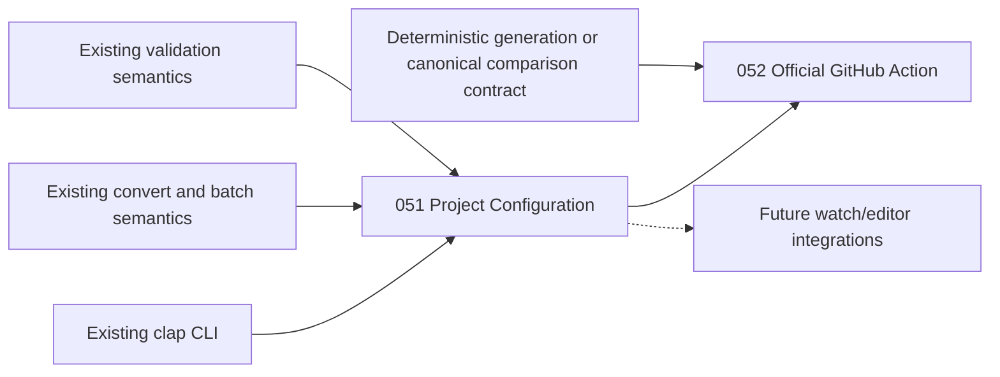

# 051-prd-project-configuration

> **Document Type:** Product Requirements Document
> **Audience:** LLM agents, human reviewers
> **Status:** Approved
> **Last Updated:** 2026-08-22 <!-- @auto -->
> **Owner:** Brian Luby <!-- @human-required -->

**Feature Branch**: `051-project-configuration`
**Created**: 2026-08-22
**Status**: Draft
**Input**: FORGE v1.2 roadmap priority 1

---

## Review Tier Legend

| Marker | Tier | Speckit Behavior |
|--------|------|------------------|
| :red_circle: `@human-required` | Human Generated | Prompt human to author; blocks until complete |
| :yellow_circle: `@human-review` | LLM + Human Review | LLM drafts, then prompts a human to confirm or edit; blocks until confirmed |
| :green_circle: `@llm-autonomous` | LLM Autonomous | LLM completes; no prompt; logged for audit |
| :white_circle: `@auto` | Auto-generated | System fills timestamps and links; no prompt |

---

## Context

### Background :red_circle: `@human-required`

FORGE v1.1.0 exposes project behavior through command-line flags. The live CLI embeds defaults directly in `src/cli/mod.rs`, including conversion format (`json`), maximum input size (`10` MB), batch jobs (`0`, auto), validation output format (`text`), validation timeout (`30` seconds), and profile-resolution timeout (`60` seconds). Required conversion choices such as `--strategy` must be repeated on every invocation. This is workable for an individual command, but it makes repository-wide use verbose and makes local and CI commands easier to configure differently by accident.

The v1.2 roadmap ranks project configuration first because a checked-in `.forge.toml` can establish one reviewable source for Forge command defaults. The official GitHub Action planned separately can consume the same file, but Action implementation, file discovery, drift comparison, and workflow authoring are not part of this PRD.

This PRD defines a deliberately narrow configuration MVP: one versioned project file, deterministic discovery, explicit precedence, strict validation, and settings for the existing `convert` and `validate` commands. It does not define input globbing, plugins, secrets, external command execution, or a user-level configuration file.

### Evidence and Hypotheses :yellow_circle: `@human-review`

| Type | Observation | Product Implication |
|------|-------------|---------------------|
| Repository evidence | `src/cli/mod.rs` defines command defaults in clap attributes and has no project configuration layer. | Config resolution must distinguish an explicitly supplied CLI value from a clap default or config values can never take effect. |
| Repository evidence | `forge convert` supports batch input, output directory derivation, `--jobs`, `--source-profile`, `--stable-id-baseline`, and multiple output formats. | A project file can remove repeated operational flags without creating a new conversion pipeline. |
| Repository evidence | Current batch output names are derived from the input stem and format, with deterministic `_2`, `_3`, and later suffixes for collisions in input order. | This PRD must preserve existing output naming and must not introduce implicit filesystem glob order. |
| Repository evidence | `src/oscal/metadata.rs` uses UUID v4 and the current UTC time for production artifact metadata unless callers provide overrides. | Reproducible config resolution does **not** currently guarantee byte-identical OSCAL artifacts; drift checking needs a separate deterministic-generation or canonical-comparison contract. |
| Product hypothesis | Teams adopting FORGE in repositories will prefer a checked-in, reviewable config over duplicating flags in shell scripts and workflow YAML. | Validate through external design-partner use; do not present this as established research. |
| Product hypothesis | Strict unknown-key errors will prevent more failures than permissive parsing causes during forward upgrades. | Measure configuration error types and revisit only with evidence. |

No user interviews, support-ticket counts, or production usage data were supplied for this PRD. Adoption and usability targets below are hypotheses to validate.

### Scope Boundaries :yellow_circle: `@human-review`

**In Scope:**

- A checked-in `.forge.toml` project configuration file
- Automatic discovery from the current working directory to the filesystem root
- An explicit global `--config <path>` option
- A `FORGE_CONFIG` environment variable for selecting a config file in automation
- Deterministic precedence: explicit CLI values over supported environment overrides, over project configuration, over built-in defaults
- A versioned, strictly validated TOML schema
- Configuration defaults for existing `convert` and `validate` command settings
- Config-relative path resolution with project-boundary protections
- Actionable parse, schema, type, range, conflict, and path errors before command side effects
- A read-only `forge config check` command for validation
- Backward compatibility when no configuration file is present

**Out of Scope:**

- GitHub Action implementation, workflow generation, or drift enforcement; these consume this feature through a separate PRD
- Input discovery, include/exclude patterns, or glob expansion; callers continue to pass explicit input paths
- User-level or system-level config such as `~/.config/forge/config.toml`
- Merging or inheriting multiple configuration files
- Secrets, credentials, API keys, or environment-variable interpolation inside TOML
- Config-driven execution of `oscal-cli` or another executable
- Plugin, script, shell, or pre/post-transform hooks
- Byte-reproducible OSCAL metadata or canonical artifact comparison
- Changing current batch output naming or overwrite behavior
- A native watch daemon or editor integration

### Related Documents :white_circle: `@auto`

| Document | Link | Relationship |
|----------|------|--------------|
| Product Roadmap | `docs/FORGE_PRODUCT_ROADMAP.md` | Completed v1.1 roadmap and future-candidate context |
| Product Vision | `docs/FORGE_PRODUCT_VISION.md` | Deterministic, auditable, CLI-first product principles |
| Parent PRD | `docs/FORGE_PRD.md` | Core conversion requirements and technical constraints |
| Batch Conversion PRD | `docs/PRD/040-prd-batch-conversion.md` | Existing batch and output-directory semantics |
| Diff Report PRD | `docs/PRD/043-prd-diff-report.md` | Existing change-detection behavior and repository PRD convention |
| Cross-Platform Release PRD | `docs/PRD/049-prd-cross-platform-release.md` | Distribution and cross-platform constraints |
| Constitution | `.specify/memory/constitution.md` | Quality gates and implementation governance |

---

## Problem Statement :red_circle: `@human-required`

Compliance and DevSecOps teams must currently repeat FORGE flags across developer commands, scripts, and CI workflows. Repetition increases setup friction and allows the same repository to be converted or validated with different strategies, formats, size limits, source profiles, parallelism, or output destinations without an obvious code-reviewed change. FORGE needs one portable, reviewable project contract that resolves predictably on every supported platform while preserving existing CLI behavior for users who do not adopt configuration.

---

## Goals :red_circle: `@human-required`

| ID | Goal | Measurable Outcome |
|----|------|--------------------|
| G-1 | Make repository command defaults reviewable and reusable. | In design-partner trials, at least 3 of 5 repositories can express their canonical convert and validate defaults in one `.forge.toml` without wrapper-specific flag duplication. **Hypothesis.** |
| G-2 | Make configuration resolution predictable. | The complete precedence and discovery test matrix passes on Linux, macOS, and Windows with 100% expected-value agreement. |
| G-3 | Preserve existing behavior for non-adopters. | All pre-feature CLI tests pass unchanged when no config is selected, and golden semantic outputs remain equivalent aside from pre-existing volatile metadata. |
| G-4 | Fail safely and actionably. | 100% of invalid-config fixtures fail before conversion, validation, output creation, or external process execution and identify the file plus offending key or location where available. |
| G-5 | Reduce repeated command configuration. | A representative catalog batch command can be reduced to `forge convert <explicit-inputs>` when strategy, format, output, limits, and jobs are defined in `.forge.toml`. |

---

## Non-Goals :red_circle: `@human-required`

- **Do not discover source files.** Input lists and ordering remain explicit so the config layer cannot introduce platform-dependent glob behavior; the GitHub Action may define its own deterministic file-selection contract.
- **Do not execute tools or hooks from config.** Automatically discovered repository files are an untrusted boundary; executable paths, `round-trip = true`, shell commands, and transforms remain explicit CLI concerns.
- **Do not create a configuration hierarchy.** A single nearest config is easier to explain and audit than global, parent, local, and include-file merges.
- **Do not store secrets.** `.forge.toml` is intended to be committed. FORGE will not add secret fields, `${VAR}` expansion, or credential loading.
- **Do not solve artifact drift in this feature.** Stable option resolution is necessary but insufficient while generated artifact metadata includes runtime UUIDs and timestamps.
- **Do not redesign existing commands.** Output naming, file-format behavior, validation behavior, and exit codes remain owned by their existing commands.

---

## User Scenarios and Testing :red_circle: `@human-required`

### User Story 1 — Reuse Checked-In Conversion Defaults (Priority: P1)

> As a compliance engineer, I want repository conversion defaults in `.forge.toml` so that I can run the same conversion settings as my teammates without copying a long command.

**Why this priority:** This is the primary value of project configuration.

**Independent Test:** Commit a schema-version 1 config containing catalog, JSON, output-directory, size-limit, and jobs defaults; run `forge convert policy-a.md policy-b.md`; verify those settings are used and the two outputs follow existing naming rules.

### User Story 2 — Override a Project Default Explicitly (Priority: P1)

> As a DevSecOps engineer, I want command-line values to override project defaults so that one exceptional CI job is explicit without modifying the repository contract.

**Why this priority:** A config that cannot be overridden would make the CLI less composable and could break existing workflows.

**Independent Test:** Configure JSON output and 4 jobs, set `FORGE_JOBS=2`, then invoke `--format yaml --jobs 1`; verify YAML and one job are effective while unrelated config values remain.

### User Story 3 — Select or Discover Exactly One Config (Priority: P1)

> As a maintainer working in nested repository directories, I want deterministic config selection so that I know which project contract FORGE applies.

**Why this priority:** Ambiguous discovery would undermine reproducibility and could apply settings from the wrong repository.

**Independent Test:** Create configs in a parent and child directory, invoke FORGE from the child tree, and verify the nearest file is selected without merging; repeat with `FORGE_CONFIG` and `--config`.

### User Story 4 — Diagnose Invalid Configuration Without Side Effects (Priority: P1)

> As a repository maintainer, I want precise validation errors so that I can fix configuration before a command writes artifacts.

**Why this priority:** Project config affects every user and CI run; a vague or late error has broad impact.

**Independent Test:** Run `forge config check` against fixtures with invalid TOML, missing version, unknown key, invalid enum, out-of-range jobs, conflicting settings, and unsafe path traversal; verify deterministic non-zero failures and no output files.

### User Story 5 — Share Validation Defaults with Automation (Priority: P2)

> As a DevSecOps engineer, I want validation output and timeout defaults in the same project file so that local validation and the future official Action begin with the same reviewed settings.

**Why this priority:** It completes the local-to-CI configuration contract, but conversion defaults deliver the core value first.

**Independent Test:** Configure validation JSON output and a 20-second timeout; run validation without those flags and verify the effective settings, then override each via CLI.

### User Story 6 — Keep Existing Ad Hoc Commands Working (Priority: P2)

> As an existing FORGE user, I want commands outside a configured project to behave exactly as before so that adopting v1.2 does not require migration.

**Why this priority:** Backward compatibility protects existing users while project adoption is voluntary.

**Independent Test:** Run the pre-feature CLI integration suite in a directory with no `.forge.toml` and with `FORGE_CONFIG` unset; verify parsing, defaults, outputs, and exit codes.

---

## Risks :yellow_circle: `@human-review`

| ID | Risk | Likelihood | Impact | Mitigation |
|----|------|------------|--------|------------|
| R-1 | clap-provided defaults are mistaken for explicit CLI values, preventing config from taking effect. | High | High | Parse configurable CLI fields as optional/raw-presence values, then apply defaults only in a dedicated resolver; test every precedence layer. |
| R-2 | An automatically discovered config causes unexpected file reads or writes. | Medium | High | Permit only project-root-contained config paths; reject traversal and absolute config path values; validate before side effects. |
| R-3 | A repository config triggers an untrusted external executable. | Medium | Critical | Exclude external executable paths, round-trip enabling, hooks, and commands from project config. |
| R-4 | Strict unknown-key handling blocks a newer config on an older binary. | Medium | Medium | Require `schema-version`; report the running FORGE version and supported schema instead of silently degrading. |
| R-5 | Teams assume checked-in config guarantees byte-identical generated artifacts. | High | High | State the limitation in CLI docs and config examples; make deterministic generation or canonical comparison a dependency for drift enforcement. |
| R-6 | Config `output` behaves differently for one versus multiple inputs. | Medium | Medium | Preserve and document current semantics: file path for one input, directory for batch; reject incompatible shapes before conversion. |
| R-7 | Environment overrides make local behavior hard to explain. | Medium | Medium | Support a small allowlist only; error on invalid values; expose sources in verbose diagnostics without printing sensitive values. |
| R-8 | Upward discovery crosses into an unrelated parent repository. | Low | Medium | Nearest config wins and no merge occurs; document CWD as the discovery anchor; explicit `--config` is available. |
| R-9 | Config parsing introduces a new dependency or supply-chain surface. | Low | Medium | Prefer an already-present TOML-capable dependency if suitable; otherwise evaluate a narrowly scoped, maintained parser in the architecture review. |

---

## Feature Overview

### Resolution Flow :yellow_circle: `@human-review`

1. Parse the raw CLI while retaining which values were explicitly supplied.
2. Select at most one config using `--config`, `FORGE_CONFIG`, then nearest upward discovery.
3. Bound, parse, version-check, and validate the entire file and its project-relative paths.
4. Overlay defaults, project settings, supported environment settings, then explicit CLI values.
5. Validate effective cross-field constraints before executing the command.

### Proposed Configuration Contract :yellow_circle: `@human-review`

```toml
schema-version = 1

[convert]
strategy = "catalog"
format = "json"
output = "generated/oscal"
max-size-mb = 10
jobs = 0
summary = false
# source-profile = "oscal/baseline-profile.json"
# stable-id-baseline = "policies/baseline.md"
# to = "catalog"
# import-ssp = "https://example.test/oscal/ssp.json"

[validate]
format = "text"
timeout-seconds = 30
# schema-type = "catalog"
# output = "generated/validation.json"
```

The top-level schema is closed: only `schema-version`, `convert`, and `validate` are legal in version 1. Command tables are also closed; unknown keys are errors.

### Supported Settings :yellow_circle: `@human-review`

| Config Key | Type / Allowed Values | Existing CLI Equivalent | Built-In Default | Notes |
|------------|-----------------------|-------------------------|------------------|-------|
| `schema-version` | Integer, exactly `1` | None | None; required | Prevents silent interpretation of a newer schema. |
| `convert.strategy` | `catalog` or `component` | `--strategy` | None; required unless supplied by CLI/config | Config may satisfy the current required CLI choice. |
| `convert.format` | `json`, `xml`, or `yaml` | `--format` | `json` | Existing serialization behavior is unchanged. |
| `convert.output` | Project-relative path | `--output` | stdout for single input; current directory for batch | Existing single-file versus batch semantics are preserved. |
| `convert.max-size-mb` | Integer `1..=51200` | `--max-size` | `10` | Upper bound prevents byte-conversion overflow and unreasonable accidental values; command input guardrails still apply. |
| `convert.source-profile` | Project-relative regular-file path | `--source-profile` | None | Required by existing component conversion behavior. |
| `convert.jobs` | Integer `0..=256` | `--jobs` | `0` | `0` retains current automatic parallelism. May be overridden by `FORGE_JOBS`. |
| `convert.stable-id-baseline` | Project-relative regular-file path | `--stable-id-baseline` | None | Existing batch limitation and warnings remain. |
| `convert.to` | `catalog`, `component-definition`, or `ssp` | `--to` | None | Existing strategy interaction and SSP restrictions remain. |
| `convert.import-ssp` | Non-empty URI/reference string | `--import-ssp` | None | No environment interpolation; existing batch limitation remains. |
| `convert.summary` | Boolean | `--summary` / explicit negative form | `false` | CLI must support an explicit false override when config sets true. |
| `validate.schema-type` | `catalog` or `component-definition` | `--schema-type` | Auto-detect | Existing conflict with round-trip remains. |
| `validate.format` | `text` or `json` | `--format` | `text` | Validation report format, not artifact format. |
| `validate.output` | Project-relative path | `--output` | stdout | Must remain inside project root when sourced from config. |
| `validate.timeout-seconds` | Integer `1..=3600` | `--timeout` | `30` | Only used when the caller explicitly enables round-trip through CLI. |

**Intentionally unsupported in schema version 1:** command inputs, globs, global verbose/quiet state, `validate.round-trip`, `validate.oscal-cli-path`, `resolve`, `trace`, `diff`, `profile`, hooks, and secrets. Unsupported fields fail validation rather than being ignored.

### Environment Contract :yellow_circle: `@human-review`

Version 1 supports only this allowlist:

| Variable | Purpose | Value Rules |
|----------|---------|-------------|
| `FORGE_CONFIG` | Select one config file when `--config` is absent | File path; relative values resolve from the current working directory |
| `FORGE_JOBS` | Override `convert.jobs` for machine/runner capacity | Integer `0..=256` |

No generic transformation from config keys to environment names is allowed. Empty or invalid supported variables are errors when relevant; unrelated `FORGE_*` variables are ignored unless reserved by another documented FORGE feature.

### Precedence Contract :yellow_circle: `@human-review`

**Config file selection:**

1. `--config <path>`
2. `FORGE_CONFIG`
3. Nearest `.forge.toml` found by searching the current working directory, then each ancestor
4. No project config

Selection stops after one file. Files are never merged. If an explicitly selected file is missing or invalid, FORGE fails; it does not fall back to discovery.

**Effective command settings, highest precedence first:**

1. Explicit CLI value
2. Supported command-setting environment override (`FORGE_JOBS` in schema version 1)
3. Selected project config value
4. Existing built-in default

Unrelated settings remain sourced independently. For example, `--format yaml` overrides only `convert.format`; it does not discard `convert.output` or `convert.jobs` from the project file.

### Path Contract :yellow_circle: `@human-review`

- Paths in `.forge.toml` must be relative, must resolve from the config file's parent directory, and must remain within that project root after lexical normalization.
- `..` segments are allowed only when the normalized result remains within the project root; absolute config path values and escapes are rejected.
- FORGE does not expand `~`, shell variables, `${VAR}`, `%VAR%`, command substitutions, or glob metacharacters in config values.
- CLI paths and `FORGE_CONFIG` retain current shell/CWD semantics and may be absolute.
- The selected config must be a regular file, must not be a symbolic link, and must not exceed 1 MiB.
- Input/reference paths that must exist are validated as regular files before command side effects. Output parents follow current command behavior after boundary validation.
- Error messages may display normalized project-relative paths but must not embed absolute local paths in generated OSCAL artifacts.

---

## Requirements

### Must Have (M) — MVP Launch Blockers :red_circle: `@human-required`

- [ ] **M-1:** FORGE shall automatically select the nearest `.forge.toml` by searching from the current working directory through its ancestors, stopping at the first match.
- [ ] **M-2:** FORGE shall provide a global `--config <path>` option accepted before or after the subcommand and a `FORGE_CONFIG` selector, with selection precedence defined in this PRD.
- [ ] **M-3:** FORGE shall select at most one configuration file and shall not merge parent, child, user, or system configurations.
- [ ] **M-4:** Every project config shall contain `schema-version = 1`; missing, non-integer, or unsupported versions shall fail with an actionable compatibility error.
- [ ] **M-5:** Schema version 1 shall support exactly the `convert` and `validate` settings listed in the Supported Settings table, using the same enum, range, conflict, and command semantics as their CLI equivalents.
- [ ] **M-6:** Unknown top-level sections and unknown command keys shall be errors. When one unambiguous close key exists, the error should suggest it without automatically correcting the config.
- [ ] **M-7:** Effective settings shall resolve as explicit CLI over supported environment override over project config over built-in default; the implementation shall preserve whether a CLI value was explicitly supplied.
- [ ] **M-8:** Config-sourced booleans shall have explicit CLI positive and negative forms where needed so a user can override either `true` or `false` without editing the file.
- [ ] **M-9:** Relative config paths shall resolve from the selected config's directory and shall be rejected if absolute or if normalization escapes the project root.
- [ ] **M-10:** Config reading shall reject symbolic links, non-regular files, and files larger than 1 MiB.
- [ ] **M-11:** TOML parse, schema, type, range, enum, conflict, missing-path, and unsafe-path failures shall identify the selected config and offending key or source location where available.
- [ ] **M-12:** FORGE shall fully parse and validate the selected config plus effective command constraints before creating output directories/files or invoking external processes.
- [ ] **M-13:** FORGE shall provide `forge config check [--config <path>]`, which validates config selection, parsing, paths, and cross-field constraints without running conversion, validation, or external tools.
- [ ] **M-14:** When no config is selected and supported environment overrides are unset, existing commands, required arguments, built-in defaults, outputs, and exit-code behavior shall remain backward compatible.
- [ ] **M-15:** Resolution order, environment allowlist, supported settings, config example, and the distinction between option reproducibility and artifact byte reproducibility shall be documented for users.
- [ ] **M-16:** Config schema version 1 shall not permit executable paths, process-enabling flags, shell commands, plugins, hooks, secrets, interpolation, or input globs.
- [ ] **M-17:** The effective configuration result shall be independent of TOML key order, directory-entry order, locale, shell, hostname, username, and wall-clock time.

### Should Have (S) — High-Value Fast Follows :red_circle: `@human-required`

- [ ] **S-1:** `forge config show` should print the effective settings and their sources (`cli`, `environment`, `project`, `default`) without executing a command.
- [ ] **S-2:** `forge config show --format json` should provide a stable machine-readable representation suitable for CI diagnostics.
- [ ] **S-3:** Config diagnostics should use stable error identifiers so the future official GitHub Action can annotate failures consistently.
- [ ] **S-4:** `forge config check` should warn when a valid setting is irrelevant to all expected repository workflows, such as a component-only source profile with catalog strategy, without failing unless existing command semantics require failure.
- [ ] **S-5:** Documentation should include catalog, component, batch, and validation examples plus a migration table from existing CLI flags.

### Could Have (C) — Optional if Capacity Permits :yellow_circle: `@human-review`

- [ ] **C-1:** `forge config init` could write a commented schema-version 1 starter file after explicit confirmation and without overwriting an existing file.
- [ ] **C-2:** `forge config show` could include the selected config path relative to the current working directory for easier diagnostics.
- [ ] **C-3:** Validation errors could include documentation URLs keyed by stable error identifier.

### Won't Have (W) — Explicitly Deferred :yellow_circle: `@human-review`

- [ ] **W-1:** User/global configuration — *Reason: would create hidden settings and merge semantics before project configuration is validated.*
- [ ] **W-2:** Multiple config inheritance or `include` directives — *Reason: undermines the one-file audit contract and increases precedence complexity.*
- [ ] **W-3:** Input globs, recursive discovery, or include/exclude patterns — *Reason: file selection belongs to callers and the separate GitHub Action PRD in this horizon.*
- [ ] **W-4:** Configurable `oscal-cli` path or config-enabled round trip — *Reason: an automatically discovered repository file must not select an executable or trigger a process.*
- [ ] **W-5:** General environment-variable mapping — *Reason: a small documented allowlist is easier to audit and reproduce.*
- [ ] **W-6:** Environment, shell, or home-directory interpolation in TOML — *Reason: reduces portability and creates secret and command-injection risks.*
- [ ] **W-7:** Plugin and transform hooks — *Reason: separate extension-platform decision with a larger compatibility and trust surface.*
- [ ] **W-8:** Artifact UUID/timestamp reproducibility — *Reason: requires a generation or comparison policy across OSCAL models, not merely config resolution.*
- [ ] **W-9:** Configuration for `resolve`, `trace`, `diff`, and `profile` — *Reason: validate the schema and precedence model on the v1.2 conversion/CI path before broadening it.*

---

## Technical Constraints :yellow_circle: `@human-review`

- **Language/Runtime:** Rust edition 2024, stable 1.93.0.
- **Format:** TOML with a closed, serde-deserializable schema and `deny_unknown_fields`-equivalent behavior.
- **CLI:** clap 4.x remains the public parser. Configurable fields must preserve raw explicitness rather than applying clap defaults before resolution.
- **Dependencies:** Prefer no new crate when a current dependency safely supports the schema; otherwise require a focused architecture and supply-chain review before adding a TOML parser.
- **Cross-Platform:** Discovery, path normalization, diagnostics, and precedence must be tested on Linux, macOS, and Windows.
- **I/O:** Read the config once per invocation; enforce the 1 MiB limit before parsing; validate before command-side writes.
- **Determinism:** Use an explicit resolver with fixed overlay order. Do not depend on hash-map iteration for diagnostics or serialized effective config.
- **Error Handling:** Return typed `ForgeError` variants and existing configuration/usage exit-code conventions; no panics on malformed or adversarial config.
- **Quality Gates:** `cargo test`, `cargo clippy -- -D warnings`, and `cargo fmt --check` must pass.
- **Testing:** Unit tests for parsing/resolution plus cross-platform integration fixtures for discovery, precedence, paths, unknown fields, and side-effect prevention.
- **Artifact Limitation:** Production catalog/component metadata currently uses runtime UUID v4 and UTC time. This PRD must not claim byte equality until another feature changes generation or defines canonical comparison.

---

## Acceptance Criteria :yellow_circle: `@human-review`

| AC ID | Requirement | User Story | Given | When | Then |
|-------|-------------|------------|-------|------|------|
| AC-1 | M-1, M-3 | US-3 | `.forge.toml` in the CWD and an ancestor | FORGE starts without a selector | The CWD file alone is selected and no merge occurs |
| AC-2 | M-2 | US-3 | Discovered config, `FORGE_CONFIG`, and `--config` name three files | FORGE starts | The `--config` file alone is selected |
| AC-3 | M-2 | US-3 | Discovered config plus valid `FORGE_CONFIG` | FORGE starts without `--config` | The environment-selected file alone is selected |
| AC-4 | M-4 | US-4 | Config lacks `schema-version` | `forge config check` runs | It fails with the file and required version; no fallback or side effect occurs |
| AC-5 | M-4 | US-4 | Config declares schema version 2 | A v1-only binary loads it | It reports supported version 1 and the running FORGE version |
| AC-6 | M-5 | US-1 | Config supplies strategy, format, output, max size, jobs, and summary | `forge convert` runs with explicit inputs only | The effective values match config and existing conversion behavior executes |
| AC-7 | M-6 | US-4 | Config contains `convert.formt` | Config is checked | It fails on the unknown key and suggests `convert.format` when unambiguous |
| AC-8 | M-7 | US-2 | Default jobs 0, config jobs 4, `FORGE_JOBS=2`, CLI `--jobs 1` | Conversion runs | Jobs resolves to 1 |
| AC-9 | M-7 | US-2 | Same layers without CLI jobs | Conversion runs | Jobs resolves to 2 |
| AC-10 | M-7 | US-2 | Same config with environment unset | Conversion runs | Jobs resolves to 4 |
| AC-11 | M-7 | US-2 | No CLI, environment, or config jobs value | Conversion runs | Jobs resolves to built-in 0 |
| AC-12 | M-8 | US-2 | Config sets summary true | Caller uses the documented negative CLI form | Summary resolves false without editing config |
| AC-13 | M-9 | US-4 | Config at `/project/.forge.toml` sets output `generated/oscal` | Config resolves | Effective path is `/project/generated/oscal` |
| AC-14 | M-9, M-12 | US-4 | Config sets output `../outside` or an absolute output | Any command loads it | It fails before creating output |
| AC-15 | M-10 | US-4 | Config is a symlink, directory, device, or exceeds 1 MiB | Config is selected | It fails with an actionable file-safety error |
| AC-16 | M-11, M-12 | US-4 | Config contains invalid TOML or out-of-range jobs | A command runs | It fails before conversion/validation and identifies the cause |
| AC-17 | M-13 | US-4 | Valid config and existing referenced paths | `forge config check` runs | It exits 0, performs no conversion, writes no command output, and invokes no external process |
| AC-18 | M-14 | US-6 | No config and no supported environment override | Existing CLI suite runs | Required values, defaults, outputs, and exit codes match the pre-feature baseline |
| AC-19 | M-16 | US-5 | Config includes `round-trip`, `oscal-cli-path`, `inputs`, or a hook | Config is checked | The unsupported key is rejected and nothing is executed |
| AC-20 | M-17 | US-1 | Semantically identical configs with reordered keys | Each resolves under the same explicit invocation | Effective settings are identical |
| AC-21 | M-15 | US-5 | A user reads project-config documentation | They inspect reproducibility guidance | It states that current artifact UUID/timestamp volatility is outside this feature |

### Edge Cases :green_circle: `@llm-autonomous`

- [ ] **EC-1:** An explicit config file may use a filename other than `.forge.toml`; its parent is still the project root.
- [ ] **EC-2:** A missing explicitly selected config fails and does not fall back to `FORGE_CONFIG` or discovery.
- [ ] **EC-3:** An empty `FORGE_CONFIG` fails as an invalid selector instead of silently enabling discovery.
- [ ] **EC-4:** Discovery from the filesystem root checks the root once and terminates without looping.
- [ ] **EC-5:** Mixed path separators and `.` segments normalize consistently on the host platform.
- [ ] **EC-6:** A config-relative path containing `..` that remains inside the project root is accepted; one that escapes is rejected.
- [ ] **EC-7:** A configured output file is rejected when multiple inputs require a directory, using the existing batch error semantics.
- [ ] **EC-8:** `convert.strategy = "component"` without an effective source profile produces the existing actionable requirement error.
- [ ] **EC-9:** Mutually incompatible effective fields are rejected after overlays, so a CLI override can resolve a conflict present at a lower layer.
- [ ] **EC-10:** A non-UTF-8 config fails cleanly without lossy interpretation or panic.

---

## Security and Privacy Considerations :yellow_circle: `@human-review`

| Aspect | Assessment | Requirement |
|--------|------------|-------------|
| Trust Boundary | Automatically discovered repository config may be attacker-controlled after cloning or checking out a branch. | Config cannot choose executables, enable external processes, run hooks, interpolate shell/environment content, or escape project-root paths. |
| File Reads | Config may name a source profile or stable-ID baseline. | Paths must be project-relative, root-contained, regular files, and validated before use. |
| File Writes | Config may set conversion/validation output paths. | Paths must remain within project root; validate the entire config before creating files or directories. |
| Resource Exhaustion | TOML nesting, strings, or extreme numeric values could consume resources. | Enforce a 1 MiB file limit, closed schema, bounded numeric settings, and parser error handling. |
| Secrets | Project config is expected to be committed. | No credential fields or interpolation; docs warn users not to store secrets. |
| Error Leakage | Diagnostics can reveal local filesystem layout or config content. | Prefer project-relative paths; do not dump the entire config or environment; never embed absolute paths in generated artifacts. |
| TOCTOU / Symlinks | Config or referenced paths could be swapped between validation and use. | Reject config symlinks and follow existing safe-file practices; architecture review should minimize validation/use gaps for referenced files. |
| External Execution | Existing round-trip/resolve behavior invokes `oscal-cli`. | Config cannot enable or choose it; only explicit command behavior may cross this boundary. |

**Security review is required** because automatic discovery changes the behavior of commands based on repository-controlled content and can influence file-write destinations.

---

## Dependencies :yellow_circle: `@human-review`



- **Requires:** Existing CLI parser and command handlers; existing batch output and validation semantics; agreement on schema version 1.
- **Blocks:** The official GitHub Action's ability to consume one repository-scoped command contract.
- **Does Not Block:** Ad hoc CLI use with complete flags.
- **Parallel Dependency for Drift Enforcement:** A deterministic artifact-generation mode or documented canonical comparison that handles runtime UUID/timestamp fields. Project configuration alone does not solve byte drift.
- **External:** No network service. A TOML parser decision may require dependency review.

---

## Phasing and Timeline Considerations :yellow_circle: `@human-review`

No contractual date was supplied. The roadmap intent is FORGE v1.2, ahead of or alongside the official GitHub Action.

### Phase 0 — Architecture and Contract Review

| Phase | Scope | Exit Gate |
|-------|-------|-----------|
| 0 — Contract | Parser decision, typed resolution boundary, clap explicitness, security review, schema freeze | Architecture and security approval |
| 1 — Convert MVP | Selection/discovery, `[convert]`, precedence, safe paths, `config check` | No-config compatibility and conversion matrix pass |
| 2 — Validate/Consumer | `[validate]`, Action-consumer documentation, cross-platform tests | Linux/macOS/Windows pass |
| 3 — Evidence-gated | Consider `config show`, JSON diagnostics, and `config init` | Design-partner evidence justifies each addition |

---

## Success Metrics :red_circle: `@human-required`

### Leading Indicators

| Metric | Baseline | Success Target | Stretch Target | Measurement Method | Evaluation Window |
|--------|----------|----------------|----------------|--------------------|-------------------|
| Config resolution correctness | No config layer | 100% expected values in precedence matrix | Same plus property-based overlay tests | Automated unit/integration suite | Before release |
| Invalid-config side effects | No config layer | 0 writes/processes across all invalid fixtures | Property/adversarial fixtures also remain zero | Temp-directory and process-spy tests | Before release |
| Backward compatibility | Current v1.1 CLI | 100% existing CLI suite passes with no config | Golden semantic parity across all examples | Existing test suite and fixture comparison | Before release |
| Design-partner task completion | Unknown | 4 of 5 participants create/check a config without maintainer intervention | 5 of 5 | Moderated repository setup exercise | Within 30 days of pilot |
| Configuration error recovery | Unknown | 80% of seeded errors fixed on first retry | 90% | Moderated usability exercise; **hypothesis** | Within 30 days of pilot |

### Lagging Indicators

| Metric | Baseline | Success Target | Measurement Method | Evaluation Window |
|--------|----------|----------------|--------------------|-------------------|
| External repository adoption | 0 known `.forge.toml` users | 3 external repositories commit a schema-version 1 config | Voluntary design-partner confirmation or public repository evidence | 60 days after release |
| Local/CI settings consistency | Unknown | 80% of pilot repositories use the same config locally and in automation | Design-partner workflow review; **hypothesis** | 60 days after release |
| Repeated-flag reduction | Current canonical commands repeat strategy/format/limits/jobs | At least 50% fewer configurable tokens in pilot canonical convert commands | Before/after command comparison | 30 days after adoption |
| Config-related support burden | No baseline | Fewer than 1 unresolved config issue per 10 adopting repositories | Issue labels and pilot log; directional due small sample | 90 days after release |

Targets based on external adoption or usability are hypotheses, not claims about current users.

---

## Definition of Ready :red_circle: `@human-required`

### Readiness Checklist

- [x] Brian Luby approves the schema version 1 key list. *(Approved in review round of 051 implementation; see Decision Log and [security review](../SEC/051-sec-project-configuration.md).)*
- [x] Engineering confirms how clap will retain explicit CLI presence. *(Configurable fields parse as `Option` presence-preserving values; clap defaults are applied only in the dedicated resolver — see `src/config.rs` `ConvertCliValues`.)*
- [x] Security approves automatic discovery and path restrictions. *(See [051-sec-project-configuration.md](../SEC/051-sec-project-configuration.md).)*
- [x] The GitHub Action PRD confirms the no-glob config boundary and explicit input contract. *(052 consumes `.forge.toml` as-is; inputs remain caller-owned.)*
- [x] The artifact reproducibility limitation has an owner in the Action or a separate generation/comparison work item. *(Owned by PRD 052 drift-enforcement dependency.)*

---

## Decision Log :yellow_circle: `@human-review`

| Date | Decision | Rationale | Alternatives Considered |
|------|----------|-----------|------------------------|
| 2026-08-22 | Use `.forge.toml` with required integer `schema-version = 1`. | Conventional project-local filename plus explicit versioning supports committed, forward-compatible contracts. | Unversioned TOML; YAML; JSON |
| 2026-08-22 | Select one config with `--config` over `FORGE_CONFIG` over nearest upward discovery. | Predictable, explainable, and useful in nested directories and automation. | Input-relative discovery; repository-only discovery; merge all ancestors |
| 2026-08-22 | Resolve settings as explicit CLI over allowlisted environment over project config over defaults. | Preserves CLI composability while allowing reviewed project defaults and limited machine capacity overrides. | Config always wins; environment over CLI; generic env mapping |
| 2026-08-22 | Limit schema version 1 to `convert` and `validate`. | These commands serve the v1.2 repository/CI path and validate the model before expanding the surface. | Configure every command immediately |
| 2026-08-22 | Keep input paths and globs outside `.forge.toml`. | Explicit ordered inputs avoid platform-specific expansion and keep file-selection ownership with caller/Action. | Config `inputs`; recursive source roots; shell globs in TOML |
| 2026-08-22 | Reject executable selection and process-enabling settings in discovered config. | A cloned repository must not gain code-execution control through automatic config loading. | Trust prompt; allow explicit-config only; unrestricted tool config |
| 2026-08-22 | Treat byte-reproducible artifact generation as a separate dependency. | Current production metadata contains UUID v4 and current time; hiding that fact would make Action drift requirements invalid. | Add generation redesign to this config PRD; claim semantic determinism only |
| 2026-08-22 | **Q-2 resolved:** keep the `max-size-mb = 1..=51200` schema ceiling. | The ceiling prevents byte-conversion overflow and unreasonable accidental values; command-level input guardrails continue to apply per file. Freezing now avoids a breaking schema change later. | Drop the ceiling (rely on overflow guard only) |
| 2026-08-22 | Security review of auto-discovery approved with mitigations T-1..T-9 and accepted residual TOCTOU/symlink risks. | All write/execute/read boundaries are enforced and tested; residual risks require local write access to an operator-chosen tree. | Block release pending further hardening |

---

## Open Questions :yellow_circle: `@human-review`

| ID | Question | Owner | Blocking? | Decision Point |
|----|----------|-------|-----------|----------------|
| Q-1 | Which TOML parsing approach best satisfies strict unknown-field diagnostics, byte limits, and the project's dependency policy? | Engineering / Security | Yes | Before implementation begins |
| Q-2 | Should `max-size-mb` retain only the current overflow guard instead of introducing the proposed 50 GiB schema ceiling? | Engineering / Product | Yes | Before schema version 1 is frozen |
| Q-3 | Should an explicit future opt-in allow config paths outside project root for monorepos with shared profiles, and what trust signal would make that safe? | Product / Security | No | After design-partner feedback |
| Q-4 | Should `forge config show` ship in the MVP or remain a fast follow if verbose resolution logs prove sufficient? | Product / Engineering | No | During Phase 1 planning |
| Q-5 | Will the GitHub Action own canonical artifact comparison, or will a separate FORGE generation feature provide deterministic root UUID and timestamp inputs? | Product / Engineering | No for PRD 051; Yes for drift enforcement | Before Action drift mode ships |
| Q-6 | After v1 adoption, which additional command section (`profile`, `resolve`, `trace`, or `diff`) has enough repeated-settings evidence to enter schema version 2? | Product | No | v1.2 retrospective |

---

## Changelog :white_circle: `@auto`

| Version | Date | Author | Changes |
|---------|------|--------|---------|
| 0.1 | 2026-08-22 | Codex | Initial draft for FORGE v1.2 project configuration and precedence |
