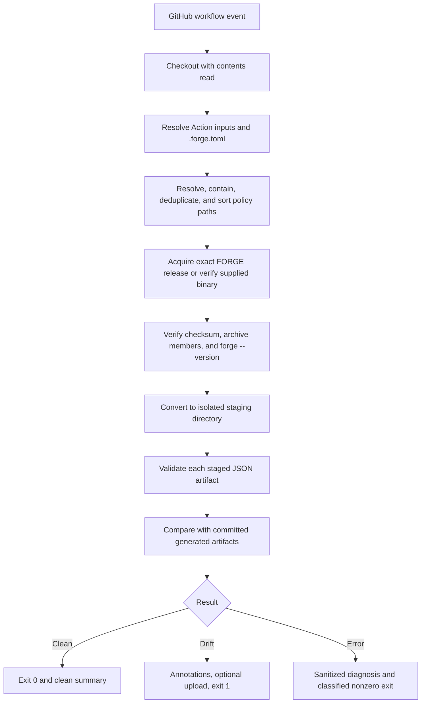

# 052-prd-github-action-drift-enforcement

> **Document Type:** Product Requirements Document
> **Audience:** Product, engineering, security, compliance practitioners
> **Status:** Draft
> **Last Updated:** 2026-08-22
> **Owner:** Brian Luby

**Feature Branch**: `052-github-action-drift-enforcement`
**Created**: 2026-08-22
**Status**: Draft
**Input**: FORGE v1.2 roadmap priority 2

---

## Executive Summary

FORGE needs an official, reusable GitHub Action that turns a repository's policy conversion settings into a dependable pull-request gate. The Action will acquire and verify an exact FORGE release, combine `.forge.toml` project settings with an explicit, deterministically ordered policy-path selection, generate artifacts in an isolated staging directory, validate them, and fail when the result differs from committed generated artifacts.

The MVP is a check, not an updater: it will not commit generated files, post pull-request comments, execute organization-defined hooks, or run a long-lived `forge --watch` daemon. Default logs and annotations will disclose status and repository-relative paths, but no policy excerpts or generated artifact content. After the FORGE binary and optional workflow artifact service are acquired, policy processing remains deterministic and offline.

---

## Context

### Background

FORGE v1.1.0 already provides local conversion, batch output, embedded JSON validation, OSCAL-aware diffing, cross-platform release archives, SHA-256 checksums, an SBOM, and SLSA provenance. However, adopters must assemble their own workflow, installation logic, validation steps, and drift comparison. This raises time-to-first-value and creates inconsistent or insecure implementations.

PRD 051 introduces `.forge.toml` for project-level command defaults. Its schema intentionally excludes input discovery, arbitrary hooks, and automatic external-process selection. Therefore, the Action owns a small CI-specific path-selection contract, sorts resolved repository-relative inputs, and passes explicit paths to FORGE while leaving conversion behavior to FORGE and `.forge.toml`.

Current release assets use these names:

- `forge-v{version}-{target}.tar.gz` on Linux and macOS
- `forge-v{version}-x86_64-pc-windows-msvc.zip` on Windows
- `SHA256SUMS`, `multiple.intoto.jsonl`, and `forge-v{version}-sbom.cdx.json`

Current Catalog and Component Definition generation is not byte-reproducible because artifact metadata uses a UUID v4 and the current time. A deterministic-generation or carefully bounded canonical-comparison contract is therefore a launch dependency, not an assumption this Action may hide.

### Problem Statement

Compliance and platform teams cannot reliably enforce policy-as-code if every repository must invent how to install FORGE, select policies, validate generated OSCAL, and distinguish real drift from tooling noise. The cost is missed drift, false failures, insecure workflow permissions, duplicated maintenance, and low confidence that a green check means committed artifacts reflect the reviewed policy source.

### Target Users

1. **Compliance engineers** who maintain policy source and committed OSCAL artifacts.
2. **Platform engineers** who standardize repository checks without learning FORGE internals.
3. **Reviewers and auditors** who need a concise, trustworthy signal that source and generated artifacts agree.
4. **Security maintainers** who need dependency pinning, least privilege, and safe behavior on forked pull requests.

### Evidence and Confidence

The workflow problem is inferred from Forge's current manual CLI/release surface and the v1.2 roadmap; no external-user baseline has yet been established. Adoption and usability targets in this PRD are hypotheses to test with design partners, not claims about current behavior.

---

## Scope

### In Scope

- An official reusable GitHub Action maintained by Policy Forge.
- Exact FORGE version selection, official release-archive acquisition, checksum verification, archive safety checks, and `forge --version` verification.
- Reading `.forge.toml` using the precedence and path semantics defined by PRD 051.
- Explicit include/exclude path selection in the Action interface; deterministic repository-relative path resolution and sorting.
- Catalog and Component Definition JSON conversion in an isolated staging directory.
- Explicit validation of every staged JSON artifact using FORGE's embedded, offline validation.
- Drift comparison against committed artifacts without modifying the checkout.
- Reliable exit classifications, step outputs, a concise GitHub job summary, and bounded annotations.
- Optional upload of staged generated artifacts, disabled by default.
- Linux, macOS, and Windows GitHub-hosted runner coverage using existing release targets.

### Out of Scope

- **Native `forge convert --watch` or another long-running daemon.** CI event triggers solve the MVP job without a file-watcher lifecycle.
- **Automatic commits, branch pushes, or pull-request creation.** Mutation requires a separate, explicitly authorized workflow.
- **Pull-request comments.** They require write permission and complicate fork safety; job summaries and check annotations are sufficient.
- **`pull_request_target` execution.** Running untrusted policy/config changes with base-repository authority is an unacceptable default.
- **Arbitrary scripts, plugins, pre/post transforms, or commands from `.forge.toml`.** Declarative conversion only preserves the trust boundary.
- **Remote policy inputs, remote profiles, or GRC uploads.** All policy processing inputs are local files in the checkout.
- **oscal-cli round-trip validation or Profile Resolution.** These add Java/external-process dependencies and violate offline-after-acquisition behavior.
- **XML/YAML drift enforcement in the first release.** JSON provides the existing explicit validation and OSCAL-aware comparison path; other formats are fast follows.
- **A hosted service or usage telemetry.** Measurement uses consenting pilot repositories and GitHub workflow data available to maintainers.

---

## Goals

| ID | Goal | MVP Target |
|----|------|------------|
| G-1 | Reduce setup friction | A pilot repository reaches a meaningful clean/drift result in 15 minutes or less from documented copy/paste setup |
| G-2 | Detect real generated-artifact drift | 100% of seeded add, remove, and substantive-change fixtures fail the check |
| G-3 | Avoid false drift | 100 consecutive unchanged fixture runs across supported runner classes produce zero drift failures |
| G-4 | Make failures actionable | At least 90% of pilot failures are correctly classified as configuration, acquisition, conversion, validation, or drift without opening raw logs |
| G-5 | Preserve confidentiality by default | Zero source-policy excerpts or generated artifact bodies appear in default logs, summaries, and annotations |
| G-6 | Establish an adoption signal | Three repositories outside Forge complete at least ten Action runs each during the pilot |

---

## User Stories

### Compliance Engineer

- **US-1 (P0):** As a compliance engineer, I want a pull request to fail when edited policy source no longer matches committed OSCAL so that stale compliance artifacts cannot merge unnoticed.
- **US-2 (P0):** As a compliance engineer, I want every newly generated artifact validated before drift is assessed so that invalid output is reported as invalid rather than merely different.
- **US-3 (P1):** As a compliance engineer, I want to opt into uploading staged outputs after drift so that I can inspect or download the proposed artifacts without running FORGE locally.

### Platform Engineer

- **US-4 (P0):** As a platform engineer, I want to pin both the Action and FORGE versions so that workflow results do not change because a mutable dependency updated.
- **US-5 (P0):** As a platform engineer, I want repository-wide defaults in `.forge.toml` and a small Action path-selection interface so that CI and local use share conversion behavior.
- **US-6 (P0):** As a platform engineer, I want stable exit classifications and step outputs so that required checks and reusable workflows can respond predictably.
- **US-7 (P1):** As a self-hosted-runner operator, I want to provide an already installed FORGE binary that is still version-verified so that policy processing can run in a pre-provisioned environment.

### Reviewer and Security Maintainer

- **US-8 (P0):** As a reviewer, I want a concise summary naming affected generated files without dumping policy text so that I can understand why the check failed safely.
- **US-9 (P0):** As a security maintainer, I want the Action to work with `contents: read` on forked pull requests so that no write token or repository secrets are exposed.
- **US-10 (P0):** As a security maintainer, I want checksum verification and safe extraction before execution so that a corrupted or substituted archive is rejected.

---

## Product Flow



### Outcome Precedence

The Action stops at the first failed phase in this order: configuration/path safety, tool acquisition/integrity, conversion, validation, drift. It must never label an acquisition, conversion, or validation error as drift.

---

## Requirements

### Must Have (M) — Launch Blockers

- [ ] **M-1 — Official reusable interface:** Publish an official Policy Forge Action that can be invoked from another repository with a versioned `uses:` reference.
- [ ] **M-2 — Least-privilege execution:** The documented workflow shall require only `contents: read`; the Action shall not require secrets, write permissions, or `pull_request_target`.
- [ ] **M-3 — Exact tool version:** `forge-version` shall accept an exact SemVer release only. `latest`, ranges, branches, and mutable aliases shall be rejected for drift checks.
- [ ] **M-4 — Verified acquisition:** The Action shall select the existing versioned target archive, download `SHA256SUMS`, verify the selected archive's SHA-256 digest, reject unsafe archive entries, extract only the expected executable, and verify `forge --version` exactly matches the requested version before use.
- [ ] **M-5 — Existing-binary verification:** An optional `forge-path` shall bypass download only after confirming it is a regular executable file and its reported version equals `forge-version`.
- [ ] **M-6 — Project configuration:** The Action shall pass the selected `.forge.toml` to FORGE and honor PRD 051 precedence, path anchoring, schema version, and validation errors. It shall not implement a second parser for conversion semantics.
- [ ] **M-7 — Deterministic input selection:** A required `paths` input shall support newline-delimited repository-relative files or documented glob patterns; optional `exclude` patterns shall be applied before lexical sorting. Empty selection, duplicate paths, absolute paths, parent traversal, and files resolving outside the checkout shall fail configuration.
- [ ] **M-8 — No arbitrary execution:** Neither Action inputs nor `.forge.toml` may select shell commands, scripts, plugins, or implicit external binaries.
- [ ] **M-9 — Isolated generation:** Conversion shall write to a temporary staging directory and shall not overwrite, delete, or modify committed artifacts in the checkout.
- [ ] **M-10 — JSON MVP:** The initial drift gate shall support configured Catalog and Component Definition JSON outputs. Unsupported model or output formats shall fail with an actionable configuration message rather than being skipped.
- [ ] **M-11 — Explicit validation:** Every staged artifact shall pass `forge validate` using embedded schemas before comparison. Validation shall not use oscal-cli, network access, or remote schemas.
- [ ] **M-12 — Reproducible comparison contract:** Before launch, FORGE shall provide either deterministic metadata generation for CI or a versioned canonical comparison that excludes only documented volatile fields. The Action shall delegate comparison semantics to FORGE; it shall not silently strip arbitrary fields or use naive text diff.
- [ ] **M-13 — Drift classification:** Missing committed artifacts, extra committed artifacts within the declared output set, or substantive differences shall produce a drift result. Reordering or documented volatile metadata shall follow the comparison contract in M-12.
- [ ] **M-14 — Reliable result contract:** The process shall return `0` for clean, `1` for drift, `2` for configuration/conversion failure, `3` for validation failure, and `4` for acquisition/integrity/version failure. An unexpected Action defect shall use a distinct documented code and `status=error`.
- [ ] **M-15 — Step outputs:** The Action shall expose `status` (`clean`, `drift`, `error`), `forge-version`, `converted-count`, `drift-count`, and, when uploaded, `artifact-name`.
- [ ] **M-16 — Concise GitHub UX:** The Action shall write a job summary with phase status, exact FORGE version, counts, affected repository-relative paths, and a remediation command. It shall emit at most 50 sanitized annotations and summarize any remainder.
- [ ] **M-17 — Confidential defaults:** Default logs, summaries, annotations, and outputs shall not include source lines, control text, generated JSON bodies, diffs, absolute runner paths, tokens, or environment dumps. FORGE shall run in quiet mode except for captured diagnostics.
- [ ] **M-18 — Optional artifact upload:** `upload-generated` shall support `never` (default), `on-drift`, and `always`. Upload shall require explicit opt-in, use a bounded retention period, and clearly state that generated artifacts inherit policy sensitivity.
- [ ] **M-19 — Offline policy processing:** After tool acquisition and before an explicitly opted-in workflow-artifact upload, conversion, validation, and comparison shall make no network requests.
- [ ] **M-20 — Platform verification:** Acceptance tests shall cover current official release targets on GitHub-hosted Linux x86_64, macOS x86_64/aarch64 where runners are available, and Windows x86_64.

### Should Have (S) — High-Priority Follow-Ups

- [ ] **S-1 — Provenance verification:** Verify the release archive against the published SLSA provenance in addition to SHA-256.
- [ ] **S-2 — Safe cache:** Cache verified FORGE binaries by exact version, target, and checksum; re-verify on every cache hit and prevent fork runs from replacing trusted cache entries.
- [ ] **S-3 — Local parity command:** Print a copyable local command that uses the same config, selected inputs, and comparison mode.
- [ ] **S-4 — JSON result manifest:** Optionally upload a small machine-readable result manifest containing statuses and repository-relative paths but no policy content.
- [ ] **S-5 — XML/YAML support:** Extend validation and reproducible comparison after their canonicalization contracts are defined.
- [ ] **S-6 — Changed-input optimization:** Permit an opt-in optimization that skips unaffected declared policies only after equivalence with a full run is proven; full evaluation remains the default.

### Could Have (C) — Desirable but Non-Blocking

- [ ] **C-1:** SARIF output for drift and validation metadata without embedding policy excerpts.
- [ ] **C-2:** Reusable-workflow templates for common pull-request and default-branch setups.
- [ ] **C-3:** An opt-in Linux container distribution pinned by digest for organizations that prefer containerized actions.
- [ ] **C-4:** A summary-only dry run that validates configuration, resolves inputs, and verifies the tool without converting.

### Won't Have This Time (W)

- [ ] **W-1:** Native watch mode or a resident daemon.
- [ ] **W-2:** Automatic commits, pushes, remediation pull requests, or force updates.
- [ ] **W-3:** Pull-request comments or labels requiring write permissions.
- [ ] **W-4:** Arbitrary transform/plugin hooks or commands from configuration.
- [ ] **W-5:** Remote policies, remote source profiles, GRC connectors, or hosted storage.
- [ ] **W-6:** oscal-cli installation, Profile Resolution, or round-trip validation.
- [ ] **W-7:** Semantic interpretation of policy intent; drift reports generated-artifact change, not compliance impact.

---

## Interface Contract

### Recommended Workflow

Consumers should pin the Action to a full commit SHA and annotate the corresponding release tag. The exact Action repository/ref is a rollout decision; the public contract is:

```yaml
name: FORGE policy drift

on:
  pull_request:
  push:
    branches: [main]

permissions:
  contents: read

jobs:
  forge:
    runs-on: ubuntu-latest
    steps:
      - uses: actions/checkout@<full-commit-sha>
      - name: Check generated OSCAL
        id: forge
        uses: policy-forge/forge-action@<full-commit-sha> # v1
        with:
          forge-version: "1.2.0"
          config: ".forge.toml"
          paths: |
            policies/**/*.md
            policies/**/*.pdf
            policies/**/*.docx
          exclude: |
            policies/archive/**
          upload-generated: "on-drift"
          retention-days: "5"
```

### Action Inputs

| Input | Required | Default | Contract |
|-------|----------|---------|----------|
| `forge-version` | Yes | None | Exact SemVer release; mutable selectors rejected |
| `config` | No | `.forge.toml` | Repository-relative PRD 051 config path |
| `paths` | Yes | None | Newline-delimited explicit files/globs; sorted after resolution |
| `exclude` | No | Empty | Newline-delimited exclusions applied before sorting |
| `forge-path` | No | Empty | Preinstalled binary; still version-verified |
| `upload-generated` | No | `never` | `never`, `on-drift`, or `always` |
| `retention-days` | No | `5` | Bounded to the GitHub-supported range and organizational policy |
| `annotation-limit` | No | `50` | Maximum sanitized annotations; hard upper bound 50 in MVP |

### Action Outputs

| Output | Values | Meaning |
|--------|--------|---------|
| `status` | `clean`, `drift`, `error` | Overall classified outcome |
| `forge-version` | Exact SemVer | Verified executable version |
| `converted-count` | Integer | Successfully generated and validated artifacts |
| `drift-count` | Integer | Declared artifacts missing, extra, or changed |
| `artifact-name` | String or empty | Uploaded workflow artifact name, when enabled |

### `.forge.toml` Interaction

Schema v1 remains owned by PRD 051. Relevant conversion defaults are supplied through `[convert]`, including strategy, format, output, size, source profile, job count, stable-ID baseline, output type, optional SSP import, and summary behavior. The Action overrides only the staging output destination and quiet/machine behavior needed for a non-mutating check. It must preserve the effective semantics of the configured committed-output destination for comparison.

Because PRD 051 intentionally has no input globs, the Action's `paths`/`exclude` inputs are the sole source-selection layer. Config-relative paths anchor at the config directory; Action path patterns anchor at `GITHUB_WORKSPACE`. Resolved paths are deduplicated and sorted before being passed to FORGE so batch collision suffixes remain stable.

### Exit Codes

| Code | Classification | GitHub Result |
|------|----------------|---------------|
| `0` | Valid artifacts match committed outputs | Success |
| `1` | Drift detected | Failure |
| `2` | Invalid Action/config/path selection or conversion failure | Failure |
| `3` | Generated artifact validation failure | Failure |
| `4` | Download, checksum, extraction, executable, or version verification failure | Failure |
| `5` | Unexpected Action implementation error | Failure |

The Action must also set `status` before termination where GitHub permits. It shall preserve captured FORGE exit details internally while mapping them to this phase-level contract.

---

## Acceptance Criteria

| AC | Requirements | Given | When | Then |
|----|--------------|-------|------|------|
| AC-1 | M-1, M-2 | A repository workflow with `contents: read` | A same-repository or fork pull request runs | The Action completes without write permission or secrets |
| AC-2 | M-3, M-4 | Exact version `1.2.0` and an official target archive | Acquisition runs | The checksum, archive members, executable, and reported version are verified before execution |
| AC-3 | M-3 | `forge-version: latest` or a SemVer range | The Action starts | It fails as configuration with code 2 and explains exact pinning |
| AC-4 | M-5 | A supplied local binary reporting a different version | Verification runs | It fails with code 4 before reading policy content |
| AC-5 | M-6, M-7 | Valid `.forge.toml` plus patterns matching three policies | Inputs resolve | FORGE receives three unique, lexically sorted paths with config semantics applied |
| AC-6 | M-7 | A pattern resolves outside the checkout through `..` or a symlink | Path validation runs | The Action fails with code 2 and processes no policy |
| AC-7 | M-9 | Committed artifacts exist in the checkout | Generation runs | New outputs are written only under an isolated staging directory |
| AC-8 | M-10, M-11 | A configured Catalog JSON conversion | FORGE generates a valid artifact | `forge validate` passes before comparison |
| AC-9 | M-11, M-14 | Generated JSON violates the supported OSCAL schema | Validation runs | The Action reports validation, not drift, and exits 3 |
| AC-10 | M-12, M-13 | Source and committed artifact are unchanged | The check repeats 100 times across the acceptance matrix | Every run exits 0 with zero false drift |
| AC-11 | M-13, M-14 | A source requirement is added without updating the committed artifact | The check runs | Drift is reported for the expected output and the Action exits 1 |
| AC-12 | M-13 | A declared committed artifact is absent | Comparison runs | It is classified as missing drift, not an internal error |
| AC-13 | M-16, M-17 | Drift contains sensitive control text | The summary and annotations render | They contain status, counts, and paths but no source excerpt, artifact body, or textual diff |
| AC-14 | M-18 | `upload-generated` is omitted | Any run completes | No generated artifact is uploaded |
| AC-15 | M-18 | `upload-generated: on-drift` and drift occurs | The run completes | Staged outputs are uploaded with bounded retention and `artifact-name` is set |
| AC-16 | M-19 | The verified FORGE executable is available and upload is disabled | Conversion through comparison runs under a network-deny test | The policy-processing phase succeeds without network access |
| AC-17 | M-20 | The same clean fixture repository | The platform matrix runs | Supported Linux, macOS, and Windows jobs produce the same clean classification |
| AC-18 | M-8 | A fork changes `.forge.toml` to request a command or external binary | The Action validates config | The unsupported key is rejected and no command executes |
| AC-19 | M-15 | A clean, drift, or error fixture run | The Action terminates | `status`, `forge-version`, `converted-count`, and `drift-count` are set consistently; `artifact-name` is set only when upload succeeds |

### Edge Cases

- No patterns match: configuration failure, not a successful no-op.
- Two inputs share a filename stem: sorted input order and Forge's collision suffix rules determine stable outputs.
- A generated file exists but is not valid UTF-8/JSON: validation failure, not drift.
- More than 50 artifacts drift: annotations stop at the cap and the summary reports the remainder.
- A checksum entry is absent or duplicated: acquisition fails closed.
- Archive contains absolute paths, `..`, symlinks, or unexpected executables: extraction fails closed.
- Workflow cancellation: no checkout files are modified; temporary files may be discarded by the runner.
- Artifact upload fails after a correct drift result: summary retains drift; upload failure is separately identified and does not convert drift to clean.

---

## Technical Constraints and Decisions

1. **FORGE owns policy semantics.** The Action orchestrates the CLI and must not reimplement TOML conversion settings, OSCAL validation, or OSCAL-aware comparison.
2. **Staging is mandatory.** `git diff` after overwriting the checkout is rejected because it mutates workspace state and conflates unrelated working-tree changes.
3. **JSON first.** It is the only current format with a direct `forge validate` command and the clearest canonical comparison path.
4. **Exact versions only.** The Action version and FORGE binary version are independently pinned; examples recommend full-SHA Action references.
5. **Official assets only.** Installer selection follows the v1.1 naming contract and verifies `SHA256SUMS`. A changed release naming contract requires an Action update and acceptance coverage.
6. **No automatic external tools.** The Action does not invoke `resolve`, `validate --round-trip`, Java, or oscal-cli.
7. **Reproducibility is a launch gate.** Current UUID v4/current-time metadata prevents raw byte comparison. Engineering must choose a Forge-owned deterministic mode or documented canonical comparison before implementation is declared ready.
8. **No content telemetry.** The Action emits no analytics and makes no network request with policy-derived data.

### Selected MVP Approach

Use a small official Action wrapper around the released FORGE binary. Resolve input paths deterministically, invoke Forge's config-aware conversion into a staging directory, independently validate every generated JSON file, and delegate drift semantics to a Forge-owned reproducible comparison contract. Render GitHub-native summaries/annotations and optionally hand staged files to GitHub's artifact service.

Alternatives rejected:

- **Handwritten shell snippet:** quickest initially, but duplicates security, version, and exit-code logic in every repository.
- **Docker-only Action:** reduces host variance but adds image distribution, digest maintenance, and poor non-Linux parity.
- **Build FORGE from source on every run:** slow and makes Cargo registry/toolchain state part of the result.
- **Naive byte comparison now:** produces false drift from UUID v4 and timestamps.
- **Action-owned JSON normalization:** risks silently hiding meaningful OSCAL changes and duplicating Forge semantics.

---

## Security and Privacy

### Threat Model

On pull requests, policy files and `.forge.toml` are attacker-controlled repository content. The workflow definition, pinned Action implementation, and permissions are trusted. The Action must assume filenames, document metadata, diagnostics, and archive contents are hostile strings.

| Risk | Likelihood | Impact | Mitigation |
|------|------------|--------|------------|
| Malicious fork requests write authority | Medium | High | `pull_request`, never `pull_request_target`; `contents: read`; no secrets or PR writes |
| Path traversal or symlink escape | Medium | High | Canonical containment checks for config, inputs, profiles, expected outputs, and staging paths |
| Arbitrary command execution from config | Medium | High | Declarative allowlist; reject hooks, commands, and implicit external-process keys |
| Release archive substitution/corruption | Low | High | Exact version, SHA-256 verification, exact asset name, version check; SLSA verification fast follow |
| Malicious archive extraction | Low | High | Inspect members; reject traversal, absolute paths, links, and unexpected files; extract in private temp directory |
| Cache poisoning | Medium | High | Exact version/target/checksum key, verify every hit, fork-safe cache policy |
| Policy leakage through logs/annotations | Medium | High | Quiet capture, structured redaction, path-only summaries, escaped/truncated untrusted strings |
| Policy leakage through uploaded artifacts | Medium | High | Disabled by default, explicit warning, bounded retention, sensitivity inheritance |
| Annotation/workflow-command injection | Medium | Medium | Escape `%`, CR/LF, and workflow metacharacters; cap length and count |
| False-clean comparison | Low | High | Forge-owned versioned comparison, seeded negative fixtures, fail closed on unsupported fields/types |

### Privacy Rules

- Policy and generated artifacts remain on the runner unless upload is explicitly enabled.
- Default logs contain no document content, source excerpts, control titles/statements, or artifact diffs.
- Repository-relative paths may be shown because they are required for remediation; absolute runner paths are removed.
- Debug mode, if later added, must still never print artifact bodies by default and must display a sensitivity warning.
- Uploaded staged artifacts inherit the source policy's classification and use the shortest practical retention.

---

## Dependencies

| Dependency | Type | Status/Need |
|------------|------|-------------|
| PRD 051 — `.forge.toml` project configuration | Blocking | Schema v1, precedence, validation, and path anchoring must be implemented and stable |
| Deterministic generation/canonical comparison | Blocking | Forge-owned contract must resolve UUID v4/current-time output variance |
| Official v1.2 release assets | Blocking | Exact target archives and `SHA256SUMS` must be published under the documented naming contract |
| Current `forge convert` batch behavior | Internal | Explicit sorted paths, output-directory override, collision naming, and quiet behavior |
| Current `forge validate` | Internal | Embedded offline Catalog/Component Definition JSON validation and nonzero invalid result |
| PRD 043 / current `forge diff` | Internal | OSCAL-aware change classification; may require expansion for complete artifact comparison |
| GitHub Actions summaries, annotations, artifacts | External | GitHub-hosted workflow APIs; artifact upload remains optional |

The Action does not depend on PRD 053 migration reporting, oscal-cli, a package manager, MCP, a web service, or plugin hooks.

---

## Rollout and Phasing

### Phase 0 — Contract Spikes

- Select and test the deterministic-generation/canonical-comparison contract.
- Prove verified acquisition for every supported release target.
- Threat-model forked pull requests, path containment, archive extraction, and cache behavior.
- Freeze Action input/output and exit-code contracts.

**Exit gate:** zero false drift across 100 unchanged fixture runs and all seeded drift cases detected.

### Phase 1 — Forge Repository Canary

- Publish a pre-release Action ref pinned in Forge's own workflow.
- Exercise push, pull request, fork simulation, clean, drift, validation failure, checksum failure, and cancellation cases.
- Keep generated upload disabled by default.

**Exit gate:** 30 consecutive canary runs with correct classification and no content leakage in reviewed logs.

### Phase 2 — Design-Partner Pilot

- Onboard at least three repositories with different policy layouts.
- Measure setup time, first clean result, error classification, false drift, and repeat use.
- Review default logs and any uploaded artifacts with each repository owner.

**Exit gate:** pilot thresholds in Goals G-1 through G-6 met or explicitly revised with evidence.

### Phase 3 — v1 General Availability

- Publish immutable Action release and a moving major tag for convenience while recommending full-SHA pins.
- Publish copy/paste workflows, version-update guidance, security model, troubleshooting, and local parity instructions.
- Support the previous minor FORGE release only if compatibility tests remain green; otherwise document an exact minimum.

No hard calendar deadline is assumed. GA is gated on PRD 051, reproducible comparison, and release acquisition—not roadmap date alone.

---

## Success Metrics (Hypotheses)

### Leading Indicators

| Hypothesis | Success Threshold | Stretch | Measurement |
|------------|-------------------|---------|-------------|
| H-1: Setup is low-friction | Median time from workflow addition to first meaningful result ≤15 minutes in pilot | ≤10 minutes | Moderated pilot timing and issue notes |
| H-2: Users activate | 3 external repositories complete 10 runs each within 30 days | 5 repositories | Consented repository workflow history |
| H-3: Results are stable | 0 false drift in 100 unchanged matrix runs | 0 in 500 | Acceptance fixture workflow |
| H-4: Drift is detected | 100% of seeded add/remove/change/missing cases fail | Same across all runner classes | Controlled fixtures |
| H-5: Failures are actionable | ≥90% correctly classified without raw-log investigation | ≥95% | Pilot failure review |
| H-6: Defaults protect content | 0 policy excerpts/artifact bodies in default output | 0 across all pilot logs | Manual and automated log scanning |

### Lagging Indicators

| Hypothesis | Evaluation Window | Signal |
|------------|-------------------|--------|
| H-7: Teams retain the check | 60 days | At least 2 of 3 pilot repositories keep it required and run it on subsequent policy changes |
| H-8: The check prevents stale artifacts | 90 days | At least one genuine drift event is corrected before merge, without a false-clean incident |
| H-9: Maintenance stays bounded | 90 days | Fewer than two Action-specific support interventions per active pilot repository after onboarding |

No policy content, private repository metadata, or hidden telemetry will be collected to measure these hypotheses.

---

## Risks and Mitigations

| ID | Risk | Likelihood | Impact | Mitigation |
|----|------|------------|--------|------------|
| R-1 | Nondeterministic UUID/timestamp creates false drift | High | High | Blocking reproducibility contract; no GA on naive byte comparison |
| R-2 | PRD 051 config and Action path selection feel split | Medium | Medium | Explain boundaries; keep only `paths`/`exclude` in Action; print resolved plan |
| R-3 | Batch stem collisions change mappings as inputs grow | Medium | Medium | Sort paths; surface resolved input→output map; recommend unique stems |
| R-4 | Cross-platform wrapper behavior diverges | Medium | Medium | Shared test fixtures and platform matrix; same exit/output contract |
| R-5 | Release asset naming changes | Low | High | Contract test release manifest; fail closed with exact expected asset name |
| R-6 | Optional uploads surprise security teams | Medium | High | Default never; explicit sensitivity warning and short retention |
| R-7 | Comparison ignores meaningful metadata | Medium | High | Versioned Forge-owned canonical rules, documented exclusions, negative fixtures |
| R-8 | Too many annotations obscure the result | Medium | Low | Cap at 50; group counts and remaining paths in summary |

---

## Open Questions

### Blocking Before Implementation Completion

1. **Engineering/Product:** Will Forge v1.2 expose deterministic root UUID and timestamp generation, or a versioned canonical drift command? The choice must preserve meaningful OSCAL identity changes while eliminating known volatile noise.
2. **Engineering:** Does the Forge-owned comparison need a new `forge check`/machine-readable mode, or can an expanded `forge diff` provide complete Catalog and Component Definition artifact coverage and stable exit output?
3. **Product/Engineering:** Will the Action live in `policy-forge/forge-action` or a path in the Forge repository? Release ownership and compatibility testing must be explicit before public examples are frozen.
4. **Engineering:** Should v1 reject single-file `[convert].output` when multiple Action paths resolve, or rely entirely on PRD 051's current batch validation error? The user-facing remediation must be consistent.

### Non-Blocking During Pilot

5. **Security:** Is SHA-256 plus exact release/version verification sufficient for MVP, or is SLSA provenance verification required before GA?
6. **Product:** Should `on-drift` become the recommended upload mode after pilots, or remain an advanced option because of artifact sensitivity?
7. **Engineering:** Which previous FORGE minor version, if any, should each Action release support after v1.2?

---

## Definition of Ready

- [ ] PRD 051 schema and config-aware CLI behavior are approved.
- [ ] Deterministic-generation/canonical-comparison decision is recorded and prototyped.
- [ ] Exact Action repository, release, and compatibility policy are decided.
- [ ] Every Must Have requirement maps to an acceptance scenario.
- [ ] Fork/permission and artifact-upload threat model is reviewed.
- [ ] Pilot repositories and owners are identified.

## Definition of Done

- [ ] All Must Have requirements and AC-1 through AC-19 pass.
- [ ] Platform matrix and 100-run stability gate pass.
- [ ] Seeded drift, invalid artifact, bad checksum, unsafe archive, and path-escape tests pass.
- [ ] Default logs/summaries/annotations pass content-leakage review.
- [ ] Three design-partner repositories complete the pilot.
- [ ] Version pinning, permissions, sensitivity, troubleshooting, and local parity are documented.
- [ ] Product owner approves GA or records revised evidence-based thresholds.

---

## Decision Log

| Date | Decision | Rationale |
|------|----------|-----------|
| 2026-08-22 | Make the official Action a non-mutating check | Keeps authorization narrow and makes forked pull-request use safe |
| 2026-08-22 | Use `.forge.toml` for conversion semantics and Action inputs only for CI path selection | Avoids duplicating PRD 051 while respecting its deliberate exclusion of input globs |
| 2026-08-22 | Require exact FORGE versions and recommend full-SHA Action pins | Prevents silent behavior changes in a drift gate |
| 2026-08-22 | Launch with Catalog/Component Definition JSON | Uses existing offline validation and limits canonicalization risk |
| 2026-08-22 | Treat reproducible comparison as a launch dependency | Current UUID v4 and current timestamp make naive byte drift unreliable |
| 2026-08-22 | Disable generated-artifact upload by default | Artifacts inherit source-policy sensitivity |
| 2026-08-22 | Exclude native watch mode | GitHub events solve CI enforcement; a daemon is a different product surface |

---

## Changelog

| Version | Date | Author | Changes |
|---------|------|--------|---------|
| 0.1 | 2026-08-22 | Codex | Initial draft for FORGE v1.2 roadmap priority 2 |
