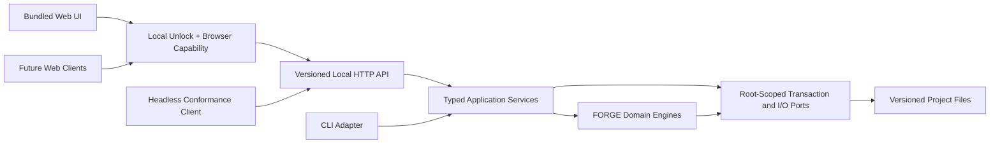

# 062-prd-local-web-workspace

> **Document Type:** Product Requirements Document
> **Audience:** Product, design, engineering, security, accessibility, LLM agents, human reviewers
> **Status:** Draft
> **Last Updated:** 2026-08-28 <!-- @auto -->
> **Owner:** Brian Luby <!-- @human-required -->

**Feature Branch**: `062-local-web-workspace`
**Created**: 2026-08-24
**Status**: Draft
**Input**: Post-v1.3 product planning

---

## Executive Summary :yellow_circle: `@human-review`

FORGE will add a local-first browser workspace that makes its human-reviewed
policy-to-framework workflow usable without learning the CLI or editing JSON by
hand. The MVP's golden path is to open a project, understand its current review
queue, update explicit mapping and applicability decisions, preview every file
change, and regenerate a provenance-rich gap report. Policy conversion,
validation, inventory, and trace exploration support that path; the UI is not a
generic wrapper around every command.

The workspace runs as part of the local FORGE binary, opens the user's system
browser, binds only to an OS-assigned port on `127.0.0.1`, and has authority
over one explicitly selected project root. A simple per-launch passphrase
unlocks browser access, after which a short-lived, scoped capability protects
the local API from drive-by web pages. This is a local access gate, not an
account system or proof of reviewer identity. FORGE is API-first: every browser
capability is specified and delivered through a versioned, documented local
HTTP API before UI implementation, and the bundled web application is one
client of that contract. The API and CLI delegate to the same typed Rust
application services, and versioned files remain the source of truth.

This release does **not** create a hosted product. Its supported API is
loopback-only; it has no accounts, remotely exposed endpoint, LAN mode,
database, multitenancy, cloud storage, live collaboration, or background
network access. Those are separate product and security decisions.

## Context

### Background :red_circle: `@human-required`

FORGE's current primary persona can obtain deterministic, traceable OSCAL
artifacts, human-reviewed mappings, and applicability reports, but must assemble
the workflow through terminal commands and hand-edited manifests. That
interaction cost obscures the strongest part of the product: the ability to
move from a review item to the exact framework control, mapping decision,
policy subject, source excerpt, and input fingerprint that produced it.

A web interface can make those relationships visible and bring FORGE to
compliance engineers who are comfortable with structured review but not with
CLI orchestration. A hosted web application would simultaneously introduce
identity, authorization, tenancy, persistence, billing, privacy, and operational
obligations that the product has not validated. PRD 062 therefore tests the web
experience locally before any service-mode investment.

### Why Now :yellow_circle: `@human-review`

- PRD 055 mapping and PRD 056 applicability now provide structured,
  deterministic, human-governed domain contracts suitable for a visual review
  experience.
- Existing report models, trace links, validation results, hashes, and stable
  reason codes can drive UI views without scraping terminal output.
- The original 50-item CLI roadmap is complete; a focused workspace can test
  persona expansion instead of adding another isolated command.
- A local deployment preserves the project's offline and user-supplied-content
  boundaries while product and usability hypotheses are tested.

### Evidence and Unvalidated Hypotheses :yellow_circle: `@human-review`

| Type | Observation | Product implication |
|------|-------------|---------------------|
| Repository evidence | Mapping and applicability expose typed Rust modules, closed manifests, deterministic reports, stable review classifications, and static HTML renderers. | Reuse domain contracts; do not create browser-only semantics. |
| Repository evidence | Several current `execute_*` paths mix preparation, rendering, file writes, and CLI result classification. | Extract application services that can preview and return typed results before either CLI or UI commits effects. |
| Architecture gap | FORGE has no workspace HTTP implementation, machine-readable API description, compatibility policy, or headless API conformance client today. | Specify the API and prove complete capability coverage before building browser views. |
| Product vision | FORGE is CLI-first, local/offline, correctness-first, and provenance-first. | The workspace complements the CLI and preserves on-disk interoperability. |
| Product hypothesis | A review-queue-first workspace will improve activation more than exposing every CLI command as a form. | Measure the end-to-end gap-review task before broadening workflow coverage. |
| Product hypothesis | A system-browser workspace will validate demand without the packaging and platform cost of an embedded desktop shell. | Defer webview/desktop packaging until the local browser workflow is proven. |

No customer interview corpus, comparative usability baseline, visual design,
front-end technology decision, or deployment research was supplied. All
adoption and task-time targets in this PRD are hypotheses to validate.

### Product Assumptions :red_circle: `@human-required`

- The first target remains a single compliance engineer working with local,
  user-supplied project files.
- Users will accept one launch command in the MVP; after launch, the golden path
  requires no terminal interaction. A zero-terminal launcher is a fast follow.
- Users will accept setting a per-launch passphrase in the no-echo terminal
  prompt and entering it once in the browser. The MVP does not persist or
  recover this passphrase.
- Mapping and applicability decisions remain explicit human judgments. The UI
  may organize and validate them but never infer them.
- Local project files are authoritative and are expected to be reviewable in
  Git or another existing file workflow.
- Reviewer names in manifests are asserted metadata, not identities established
  by the local unlock or digital signatures.

## Problem Statement :red_circle: `@human-required`

Compliance engineers who can perform structured control review but are
uncomfortable with terminal and JSON workflows cannot readily use FORGE's
mapping, applicability, gap, and provenance capabilities. Existing users must
also mentally connect several commands and artifacts to answer a basic
question: “What needs human attention, why, and what will change if I resolve
it?”

Simply wrapping CLI commands in a browser would preserve that fragmentation and
create new filesystem, request-forgery, script-injection, concurrency, and data
loss risks. FORGE needs one coherent visual workflow built on the same trusted
domain contracts, with explicit local authority and preview-before-write
semantics.

## Product Principles and Guardrails :red_circle: `@human-required`

1. **Review work, not commands.** Navigation begins with project state and
   human-required actions, not a command palette.
2. **Contract first.** A versioned OpenAPI contract and capability matrix are
   reviewed before browser implementation. The API defines product behavior;
   the current UI does not define the API after the fact.
3. **The browser is an API client.** Every project read, validation, preview,
   mutation, operation status, export, and shutdown action uses the documented
   API. The static web shell has no privileged or server-rendered project-data
   path.
4. **One engine.** The API and CLI use shared typed Rust application services.
   HTML, JavaScript, HTTP handlers, and CLI adapters contain no domain policy.
5. **Files remain authoritative.** The workspace has no private database and
   does not make browser state a source of truth.
6. **No silent judgment.** The UI never auto-maps controls, decides
   applicability, claims compliance, or upgrades a suggestion into an approved
   decision.
7. **Preview before effect.** Every material write is validated, diffed, named,
   and explicitly confirmed against the bytes the user previewed.
8. **Local means local.** Runtime network traffic is limited to the loopback
   workspace session. Assets, fonts, analytics, and update checks are not
   fetched remotely.
9. **Provenance is navigable.** Counts and classifications must lead to their
   exact subjects, decisions, source locations, and fingerprints.
10. **Accessible is shippable.** The complete golden path must conform to WCAG
   2.2 AA; accessibility is not deferred to a later visual polish phase.

## Goals :red_circle: `@human-required`

| ID | Goal | MVP success threshold |
|----|------|-----------------------|
| G-1 | Make the gap-review workflow usable after one launch command and local unlock. | At least 4 of 5 target users complete the seeded project workflow without facilitator intervention. |
| G-2 | Make review state and provenance understandable. | At least 4 of 5 users correctly explain one gap classification and navigate to its framework, mapping, and policy evidence in under two minutes. |
| G-3 | Establish a complete API-first product boundary. | A headless client completes 100% of the browser golden path using only the published local API, with no UI-only endpoint, embedded project data, or filesystem shortcut. |
| G-4 | Prevent unintended authority or data loss. | All seeded off-root access, unauthorized requests, stale confirmations, injected content, external file conflicts, and interrupted writes fail without changing protected files. |
| G-5 | Validate repeat value before service-mode investment. | At least three pilot organizations reopen and update a workspace within 60 days using opt-in pilot follow-up, not product telemetry. |
| G-6 | Preserve CLI and file interoperability. | API and CLI adapters over the same application request produce the same validated artifact bytes and result classification when inputs and deterministic options match. |

## Non-Goals :red_circle: `@human-required`

- **Hosted or remotely exposed deployment.** Accounts, SSO, RBAC, tenancy, LAN
  binding, non-loopback API access, cloud storage, and service operations
  require a separate PRD and threat model. This does not make the supported
  loopback API internal or optional.
- **Every CLI feature in the first release.** Profile resolution, batch
  automation, Assessment Results, POA&M, integrations, MCP, and AI are not
  required to validate the golden path.
- **A general file manager or editor.** The workspace operates on registered,
  supported FORGE resources; it does not browse or edit arbitrary project
  files.
- **Automatic compliance judgment.** Mapping participation, applicability, and
  gap classifications retain their existing precise meanings.
- **Rich source-document editing.** Original Markdown is viewable with exact
  source references but not edited in the MVP; PDF and DOCX fidelity editing is
  excluded.
- **Identity assurance or signatures.** The local unlock authenticates
  possession of a per-launch secret and the capability authorizes a browser
  session; neither authenticates a reviewer.
- **Mobile-first or small-screen use.** The MVP targets supported desktop
  browsers, while still supporting zoom, reflow, keyboard, and assistive
  technology requirements for its desktop layouts.

## Personas and Prioritized User Stories :red_circle: `@human-required`

### Primary — Compliance engineer

#### US-1 — Understand project state (P0)

> As a compliance engineer, I want one project overview that distinguishes
> invalid inputs, stale inputs, unresolved review items, and completed outputs
> so that I know what to do next without reconstructing command order.

#### US-2 — Review framework scope (P0)

> As a compliance engineer, I want to review every framework control and record
> explicit applicability, exclusion, deferral, or under-review state so that
> organizational scope remains complete and reproducible.

#### US-3 — Review mapping participation (P0)

> As a compliance engineer, I want policy and framework subjects side by side
> with exact source context so that I can record a relationship or an explicit
> no-relationship decision without losing provenance.

#### US-4 — Resolve the queue and regenerate analysis (P0)

> As a compliance engineer, I want saved decisions to regenerate the same
> deterministic applicability report used by the CLI so that the visible queue
> reflects authoritative project files.

#### US-5 — Add and validate a policy artifact (P0)

> As a compliance engineer, I want to register or upload a Markdown policy,
> preview its conversion outputs, and validate them so that a new project can
> reach the review workflow without manually authoring commands.

### Secondary — Auditor or reviewer

#### US-6 — Trace a result to source (P0)

> As an auditor, I want to move from any count or classification to the exact
> control, decision, mapping edge, policy requirement, source location, and
> fingerprints so that I can understand the basis of the result.

#### US-7 — Review without write authority (P0)

> As an auditor, I want a read-only launch mode so that I can explore a project
> without the session being capable of modifying it.

#### US-8 — Export a static report (P1)

> As an auditor, I want a self-contained, redacted report generated from the
> same versioned report model so that I can review results without running the
> workspace.

### Cross-cutting edge stories

#### US-9 — Preview and confirm writes (P0)

> As a policy owner, I want the exact target, validation result, base hash, and
> semantic/text diff before a write so that confirmation cannot apply different
> bytes from those I reviewed.

#### US-10 — Recover from conflict or interruption (P0)

> As a user, I want external changes, expired previews, validation failures, and
> interrupted operations to preserve prior files and explain the next safe
> action so that I can recover without reconstructing the project.

#### US-11 — Use assistive technology (P0)

> As a keyboard or screen-reader user, I want the entire golden path to expose
> meaningful structure, focus, status, errors, and non-color cues so that I can
> complete the same work independently.

#### US-12 — Unlock local access without creating an account (P0)

> As a local operator, I want one per-launch passphrase to unlock the browser
> session so that casual or drive-by access is blocked without creating an
> account or attaching my identity to review decisions.

### API client developer

#### US-13 — Drive the complete workspace through the API (P0)

> As a local client developer, I want a documented, versioned API with safe
> bootstrap, concurrency, idempotency, operation status, and compatibility
> semantics so that I can reproduce every web workflow without browser
> automation or private implementation knowledge.

## Scope

### In Scope for MVP :yellow_circle: `@human-review`

- A single local FORGE process and a single explicit project root per session
- System-browser launch plus `--no-open` and `--read-only` modes
- A per-launch, non-persistent local passphrase unlock for interactive browser
  sessions, followed by a scoped memory-only browser capability
- A supported, versioned loopback API described by a committed OpenAPI 3.1
  document and capability matrix
- Complete browser-to-API coverage plus machine-readable session bootstrap for
  supported local clients and headless conformance tests
- Versioned project resource registration through `forge.workspace/1`
- Project overview, review queue, framework scope, mapping review,
  trace/provenance exploration, validation, and report views
- Markdown-to-OSCAL conversion needed to onboard a policy into the workspace
- PRD 055 mapping and PRD 056 applicability manifest editing and analysis
- Two-step preview/confirm writes with atomic commit and conflict detection
- Self-contained local assets and static redacted report export
- Shared Rust application services used by both CLI and API adapters
- Desktop-browser accessibility and responsive behavior through 200% zoom
- Security, parity, accessibility, and cross-platform release gates

### Explicitly Out of Scope for MVP :yellow_circle: `@human-review`

- Assessment Results (PRD 063), POA&M (PRD 064), integrations (PRD 065),
  AI suggestions (PRD 066), MCP (PRD 067), or collaboration packages (PRD 068)
- Full lifecycle editing, guided policy drafting, framework-impact editing, or
  generic OSCAL object editing
- Arbitrary directory scanning, arbitrary file reads, shell execution,
  embedded terminal, plugins, browser extensions, or user-supplied JavaScript
- Automatic framework or schema downloads and redistribution of restricted
  framework content
- Service workers, browser offline caches, local storage of project content, or
  background browser synchronization

## Golden Path and Information Architecture :yellow_circle: `@human-review`

### Golden Path

| Step | User outcome | Required API capability | Authoritative on-disk contract | Material write |
|------|--------------|-------------------------|--------------------------------|----------------|
| 1. Launch and unlock | Open one explicit project, unlock the browser locally, and see whether the session is writable. | Static bootstrap, local unlock, browser/machine capability issuance, and session metadata | Canonical project root, optional `.forge.toml` | No |
| 2. Register | Create or open the versioned list of supported project resources. | Resource collection read and index preview/commit | `forge.workspace/1` | Yes, preview required |
| 3. Diagnose | See invalid, stale, missing, and review-required states in priority order. | Inventory, validation, queue, filter, and operation-status resources | Typed inventory, validation, mapping, and applicability results | No |
| 4. Review scope | Record human applicability decisions with required rationale and reviewer metadata. | Applicability draft validation and preview | `forge.applicability/1` | Yes, preview required |
| 5. Review mappings | Record positive or explicit no-relationship decisions against exact resource fingerprints. | Mapping draft validation and preview | PRD 055 Mapping Collection inputs | Yes, preview required |
| 6. Confirm | Review semantic changes, text diff, validation outcome, target, and base hash. | Preview resource plus idempotent conditional commit | One-time preview receipt | No |
| 7. Regenerate | Commit the confirmed manifest bytes and rebuild the applicability report. | Commit and queryable analysis operation | Shared application-service result | Yes, atomic |
| 8. Trace/export | Navigate provenance and optionally export a redacted static report. | Provenance traversal and export preview/commit | Versioned report and trace models | Export only, preview required |

### Primary Navigation

1. **Overview** — project health, resource inventory, review counts, recent
   in-session operations, and the next recommended *human action*.
2. **Review Queue** — stable reason-code views for unresolved applicability,
   mapping, validation, stale-input, and conflict items.
3. **Framework Scope** — filterable control inventory and explicit
   applicability decision editor.
4. **Mappings** — policy/framework subject comparison, relationship decisions,
   provenance, and participation summaries.
5. **Policies & Artifacts** — registered Markdown sources, derived OSCAL
   artifacts, conversion preview, validation, and hashes.
6. **Trace & Reports** — bidirectional navigation among report items, OSCAL
   subjects, and exact source locations; static export.

### Required UX States

Every primary view defines and tests locked, throttled unlock, loading, empty,
ready, invalid input, review required, stale input, external conflict,
permission denied, expired session, and process-stopped states. Errors preserve
user-entered in-memory form values when safe, move focus to a summary, link each
issue to its field or resource, and state whether retrying can succeed.

## Workspace, Data, and Authority Model :yellow_circle: `@human-review`

### Launch Contract

- Provide `forge workspace --project <DIR>`.
- `<DIR>` must exist, be a directory, and resolve to one canonical project
  root before the server starts. The command does not discover a broader root.
- For an interactive browser session, prompt the operator to set and confirm a
  per-launch passphrase without terminal echo. Start in a locked state; the
  browser must submit that passphrase successfully before receiving API
  authority. If the passphrase is lost, the supported recovery is to stop and
  relaunch the workspace with project files unchanged.
- Bind an OS-assigned port on `127.0.0.1` only. Do not bind `0.0.0.0`,
  `::`, a LAN address, or the hostname `localhost`; do not expose a
  configurable host flag.
- Open the system browser by default. `--no-open` prints the launch URL for
  manual use. `--read-only` removes mutation routes and write capabilities
  from the session.
- Provide `--machine-session` as an explicit alternative to browser launch. It
  emits exactly one sensitive JSON session descriptor on stdout containing the
  base URL, API version, session ID, capability, mode, and process identity;
  diagnostics remain on stderr. This explicit automation mode does not prompt
  for or accept the browser passphrase. The capability is not placed in
  arguments, persisted, or printed unless this mode is explicitly selected.
- Support orderly shutdown through Ctrl-C and a confirmed in-UI “Stop
  workspace” action. Shutdown invalidates the passphrase verifier, all session
  capabilities, and in-memory preview receipts.
- The command prints a safe session summary but never logs the passphrase,
  password hash, capability, sensitive request bodies, source excerpts, or
  absolute paths by default.

### Project Resource Index

The MVP introduces one optional, human-reviewable `forge.workspace.json` file
at the project root using the `forge.workspace/1` schema. It is an index, not a
database or domain authority.

- It contains a closed schema, a project label, and an ordered list of supported
  resources with a stable local key, typed role, and project-relative path.
- Supported initial roles are policy source, generated OSCAL artifact, mapping
  manifest/collection, applicability manifest/report, and trace/report output.
- It contains no launch tokens, absolute paths, secrets, reviewer credentials,
  cached source text, UI layout, approval state, or inferred relationships.
- The workspace computes current hashes and validation state at read time.
  Domain manifests and artifacts retain their own provenance contracts.
- Existing CLI projects without the index open in setup mode. The user
  explicitly registers root-contained files or uploads bytes to a confirmed
  root-contained target; the workspace does not recursively scan arbitrary
  files.
- Updating the index uses the same preview, validation, conflict, and atomic
  write path as every other material mutation.

### Source of Truth

- Versioned domain manifests and OSCAL artifacts on disk are authoritative.
- Browser form state is ephemeral. It is never silently persisted to
  `localStorage`, `sessionStorage`, IndexedDB, a service worker, or a hidden
  server database.
- Refreshing or closing a page with uncommitted edits requires an explicit
  warning. Discarded form state cannot alter project files.
- The UI may create view models, filters, and draft edits in memory. Every
  authoritative write must serialize a documented on-disk contract.

### Import Semantics

- “Register” references an existing, root-contained supported file without
  copying it.
- “Upload” lets the browser read a user-selected local file and sends bounded
  bytes to a user-confirmed target beneath the project root. The server does not
  receive or retain the source machine path.
- Uploads are inert data, not executable content. They are validated by
  declared role, extension/media type, size, parser, and destination rules
  before a preview is offered.
- No import operation fetches a URL or follows a reference to the network.

## Trust Model and Security Boundaries :red_circle: `@human-required`

### Protected Assets

- Policy and framework content, manifests, reviewer metadata, hashes, generated
  OSCAL artifacts, reports, and source excerpts
- Integrity of human decisions and generated outputs
- Confidentiality and integrity of files outside the selected project root
- Authority represented by the unlock passphrase, password verifier, session
  capabilities, and pending preview receipts

### In-Scope Threats

- A hostile website attempting DNS rebinding, cross-origin requests, CSRF, or
  browser-driven access to a running workspace
- Guessing, replay, leakage, reflection, or accidental persistence of the local
  unlock passphrase or a scoped capability
- Untrusted Markdown, OSCAL, manifest, framework, filename, or report content
  attempting XSS, markup injection, path traversal, parser exhaustion, or
  unsafe download behavior
- A project file changed externally between read, preview, confirmation, and
  commit
- Symlinks, path aliases, special files, oversize inputs, malformed encodings,
  duplicate keys, deep structures, and output/input aliasing
- Accidental user action, browser disconnect, process interruption, or partial
  filesystem failure during a write

### Explicit Trust Assumptions

- The local operating system, FORGE binary, system browser, and user account are
  trusted.
- The capability is intended to stop drive-by web access, not a malicious
  process running as the same OS user. A same-account attacker may be able to
  inspect browser or process memory and is outside the MVP security claim.
- Reviewer identity strings are asserted by the user. Passing the local unlock
  proves possession of a per-launch secret, not who operated the browser.
- Project-root files are potentially hostile input even though the user
  selected the root.

### Local Unlock Authentication and Session Authorization

The MVP uses two deliberately separate controls. A simple local passphrase
unlocks a browser client; a newly minted capability then authorizes that client
to call the API. The unlock is not an account, durable identity, role, reviewer
attestation, or remotely usable authentication system.

- For an interactive browser launch, collect and confirm a per-launch
  passphrase through a no-echo controlling-terminal prompt before browser
  access is enabled. Do not accept it as a command-line argument, environment
  variable, URL value, or project/workspace file. An interactive launch without
  a usable controlling terminal fails closed and points automation to
  `--machine-session`.
- Accept passphrases from 15 through 128 characters, including spaces and
  Unicode, without composition rules. Hash the passphrase with Argon2id and a
  cryptographically random per-launch salt using bounded, documented parameters;
  retain only the hash in process memory and erase plaintext buffers as soon as
  practical. Do not persist a password, hash, salt, recovery answer, or account.
- Expose one narrowly scoped `POST /api/v1/session/unlock` operation. It accepts
  the passphrase over the exact loopback origin and is the only `/api/v1`
  operation callable without an existing bearer capability. Before successful
  unlock, the server returns no project data or state-derived response.
- Apply strict Host, Origin, Fetch Metadata, JSON content-type, body-size, and
  attempt-rate controls to unlock. Use bounded increasing delay after failures,
  generic failure responses, and security-event logs that contain no passphrase,
  hash, project state, or distinguishing credential details.
- On success, mint a distinct browser-scoped capability, return it once to the
  first-party page, and retain it only in page memory. A second browser context
  must unlock separately and receives a different capability.
- Do not use the RFC 7617 HTTP Basic scheme. Its credentials are ambient and
  repeatedly transmitted, while FORGE needs a non-ambient bearer capability
  with explicit browser/machine and read/write scopes. “Basic auth” in this MVP
  means the simple local unlock described here, not an HTTP Basic header.

- Generate at least 256 bits of cryptographically secure random capability
  material for each launch.
- Deliver the browser capability only in the successful unlock response and
  retain it only in page memory. Never place the passphrase or capability in a
  browser URL, cookie, browser storage, server-rendered HTML, or static asset.
- In explicit `--machine-session` mode, deliver a separately typed machine
  capability only in the one-line stdout descriptor. Do not open a browser or
  run the interactive unlock flow, and do not reuse a browser-scoped
  capability. The client keeps the descriptor in memory and must treat stdout
  capture as secret material.
- Except for `POST /api/v1/session/unlock`, require
  `Authorization: Bearer <capability>` for every `/api/v1/` request. Do not use
  ambient cookie authentication.
- Bind each capability to the session ID, project root, client mode, and
  read-only/write scope. The API rejects a browser capability used as a machine
  capability or a read-only capability used for mutation.
- Static bootstrap assets may be unauthenticated but contain no project data.
- Reject missing, malformed, or wrong capabilities with a generic response and
  no project-state disclosure. Compare secret values in constant time.
- Expire the capability on process shutdown. Do not persist, rotate into logs,
  reflect into HTML, include it in crash output, or send it in a referrer.

### Browser and HTTP Controls

- Require an exact `Host` value for the bound `127.0.0.1:<port>` endpoint
  and reject DNS names, alternate ports, forwarded-host headers, and proxy
  routing.
- For browser state-changing requests, require the exact session `Origin`,
  appropriate Fetch Metadata, a non-simple JSON content type, and a
  browser-scoped bearer capability. Machine clients use the separately scoped
  machine capability and do not emulate browser headers. Do not enable CORS.
- Serve a restrictive CSP with no remote origins, no inline/evaluated script,
  no object/embed, no framing, and no unrestricted navigation.
- Apply `no-store` to API and project-derived responses. Do not register a
  service worker. Apply restrictive referrer, MIME-sniffing, framing,
  permissions, and download headers.
- Render all project content through escaped text or a narrowly allowlisted,
  tested Markdown representation. Never inject generated report HTML directly
  into the application DOM.
- Bound headers, URLs, JSON depth, body sizes, multipart parts, decompressed
  sizes, request rate, concurrent operations, and operation duration.

### Project Containment

- The HTTP adapter exposes typed resource and operation APIs, never a generic
  “read path,” “write path,” or directory-listing endpoint.
- Normalize and validate every project-relative path, reject absolute paths and
  platform prefixes, and enforce the selected root at open time.
- Reject symbolic links and non-regular files for supported inputs and outputs.
  Revalidate parent and target identities immediately before commit.
- Use race-resistant directory-relative open/create primitives where supported
  and a documented fail-closed equivalent on every supported platform.
- Do not pass project content to a shell, subprocess, templating evaluator,
  browser extension, plugin, or network client.

## API-First Architecture and Shared Application-Service Boundary :red_circle: `@human-required`

The API is the first implementation artifact and the only project-data boundary
available to browser clients. The bundled web application, a headless
conformance client, and any future web experience use the same supported local
HTTP contract. The workspace must not call `cli::execute`, capture
stdout/stderr, translate exit codes into API state, or spawn the `forge` binary.
HTTP and CLI adapters delegate to typed application services.

API-first does not mean remote-first. PRD 062 exposes the contract only on the
authenticated loopback session. A remotely accessible deployment still
requires separate identity, authorization, tenancy, persistence, operations,
and threat-model decisions.

### Architecture Decision — API-First Local Workspace

**Status:** Accepted for PRD 062 on 2026-08-28.

**Context:** FORGE needs a browser experience now and may need additional web or
automation clients later. An API derived after the first UI would make browser
behavior the implicit product contract, encourage privileged UI shortcuts, and
leave future clients dependent on private implementation details.

**Decision:** Specify and support a versioned loopback HTTP API before browser
implementation. Every web capability uses that API. HTTP and CLI remain thin
adapters over shared application services; the CLI is not forced through HTTP.

**Alternatives considered:**

- **UI-first with an internal API** — rejected because it makes API completeness
  and compatibility optional and cannot prove that another client can reproduce
  the workflow.
- **Force every interface, including the CLI, through HTTP** — rejected because
  it adds a server/session dependency to reliable offline CLI execution without
  improving shared-domain semantics.
- **Remote-first service API** — rejected for this PRD because identity,
  authorization, tenancy, persistence, and operations are not yet designed.

**Consequences and trade-offs:** The contract, fixtures, compatibility policy,
and headless tests add up-front work and constrain future breaking changes. In
return, UI/API drift becomes testable, alternate local clients are supported,
future web surfaces have a stable foundation, and the local security boundary
remains explicit. The API surface stays limited to the approved MVP so product
learning is not displaced by speculative platform design.

### High-Level Architecture

The browser receives only a static application shell and unlock form before
authentication. Successful unlock returns its scoped capability; only then can
it obtain project data, perform validation, and request effects through
`/api/v1`. No server-rendered project content, embedded initial-state blob,
direct filesystem bridge, UI-only handler, or alternate privileged backchannel
is permitted.

### Contract-First Artifacts

- Commit the normative OpenAPI 3.1 description at
  `docs/api/forge-workspace-v1.openapi.yaml` before implementing a browser view.
- Commit representative valid and invalid request, response, error, pagination,
  concurrency, operation, preview, and commit fixtures alongside the contract.
- Maintain a capability matrix mapping every in-release P0/P1 product action to
  one or more API operations, application services, authorization modes, and
  acceptance tests. A browser feature without a matrix entry cannot enter
  implementation.
- Apply the same gate to every later FORGE web surface: a follow-on PRD may
  extend the API and matrix before adding UI, but may not introduce a separate
  feature-specific backend or privileged browser path.
- Treat the OpenAPI document and referenced schemas as release artifacts. CI
  fails when handlers, fixtures, generated/type-checked clients, or the bundled
  UI drift from the committed contract.
- Choose hand-authored versus code-generated contract ownership in an ADR. In
  either case, one artifact is normative and automated drift detection is
  mandatory; two independently maintained schemas are prohibited.

### MVP API Capability Matrix

Exact paths and schemas belong in the OpenAPI document, but the contract must
cover this complete product surface before browser implementation:

| Capability | Required API resources/operations | Required semantics |
|------------|-----------------------------------|--------------------|
| Session | Static bootstrap, local unlock, capability scope, API/version discovery, shutdown | Argon2id passphrase verification and throttling for browser unlock; separate human/machine bootstrap; read-only/write scope; no ambient auth |
| Project | Project summary, configuration status, resource collection | No recursive arbitrary scan; registered resource IDs; current hashes |
| Resource registration | Register, upload, inspect, preview index change, commit | Bounded content; typed role; root-contained target; safe media handling |
| Policy onboarding | Prepare conversion, inspect derived products, validate, commit | Shared conversion service; deterministic result model; no direct write |
| Validation | Validate registered/draft resources and retrieve structured diagnostics | Stable codes and field/resource pointers; no terminal parsing |
| Applicability | Inventory, get/edit draft decisions, validate, preview, analyze | Complete control denominator; explicit human states; no inference |
| Mapping | Subject inventory, get/edit draft relationships, validate, preview, build/check | Exact resource identity; positive/no-relationship distinction |
| Review queues | List/filter/sort/page review items and retrieve counts | Stable reason codes; counts reconcile to unfiltered denominator |
| Provenance | Traverse reports, controls, decisions, mapping edges, policy subjects, and excerpts | Bounded excerpts; resource fingerprints; no arbitrary path reads |
| Effects | Create preview, inspect diff, commit, query commit result | Conditional, idempotent, exact-byte, hash-bound, atomic semantics |
| Operations | Start, query, cancel, and safely retry bounded work | Stable operation ID and terminal result; response-loss recovery |
| Reports/exports | Prepare, preview, commit, and download approved output | Redaction profile; safe filename/content type; no remote publish |

### Required Application-Service Shape

Each API/CLI-supported operation separates:

1. **Load and validate inputs** — return typed domain data, fingerprints,
   structured diagnostics, and no effects.
2. **Prepare result** — return the proposed artifact bytes, semantic change
   summary, result classification, and destination intent.
3. **Preview effect** — bind the exact proposed bytes and destination to current
   input/target hashes and a one-time receipt.
4. **Commit effect** — recheck hashes, atomically write only the previewed bytes,
   and return the committed fingerprint.

The CLI may preserve its current syntax and exit codes, but API and CLI adapters
must delegate to the same application requests and results. The CLI does not
need to make an HTTP loopback call; forcing a local CLI through the transport
would add failure modes without improving contract fidelity.

### Initial Service-Extraction Map

| Capability | Current source boundary | PRD 062 service need |
|------------|-------------------------|----------------------|
| Conversion | `pipeline::run_catalog_pipeline`, `run_component_pipeline` | Typed request/result plus deterministic serialization and prepared output bytes |
| Validation | `validate` models and functions | Structured diagnostics independent of terminal formatting |
| Mapping | `mapping::execute_init/build/check` | Separate manifest preparation, model build, report rendering, result classification, and commit |
| Applicability | `applicability::execute_init/analyze` | Separate decision validation, report build, queue model, rendering, and commit |
| Trace | `trace` report/extractor/resolver modules | Typed bidirectional view model with bounded source excerpts |
| Project/config | `.forge.toml`, safe I/O helpers, domain manifests | Explicit root context, resource index, typed inventory, and operation-scoped path authority |

### HTTP and Resource Semantics

- Namespace the supported contract beneath `/api/v1`; version API models
  independently from on-disk schemas and domain implementation types.
- Make `POST /api/v1/session/unlock` the only unauthenticated API operation. Its
  schema and responses reveal no project state; every other operation requires
  a correctly scoped bearer capability.
- Use JSON for structured requests/responses, with explicit bounded upload and
  download media types. Do not expose arbitrary command names or paths.
- Address project objects by opaque registered resource IDs. Project-relative
  paths may appear only in authorized resource metadata and effect previews.
- Return an entity tag or equivalent strong version for every mutable resource.
  Conditional mutation requires the observed version and fails on mismatch.
- Require a client-generated idempotency key for effect-creating requests. A
  retry with the same key and same request returns the original operation or
  commit result; reuse with different content fails.
- Represent work as a queryable operation resource with a stable ID, state,
  progress facts when available, cancellation status, typed terminal result,
  and safe error. A lost HTTP response must not leave the client unable to
  determine whether a write committed.
- Use deterministic cursor pagination and documented filter/sort fields for
  controls, subjects, mappings, review queues, and other bounded collections.
  Page traversal must not duplicate or omit stable items for an unchanged
  resource version.
- Return stable machine-readable error and review reason codes with a safe
  message, affected resource/field, retryability, correlation ID, and current
  resource version when relevant.
- Never include capabilities, absolute paths, raw source excerpts, or Rust
  debug strings in generic error envelopes.

### Compatibility and Support Policy

- `/api/v1` is a supported local product interface for the bundled UI and
  documented same-host clients; it is not an undocumented implementation
  detail.
- Additive optional fields and new operations are allowed within v1. Removing a
  field/operation, narrowing an accepted value, changing established semantics,
  or reinterpreting an error code requires `/api/v2`.
- When a successor major is introduced, retain the previous API major for at
  least one stable FORGE minor release and publish migration guidance before
  removal.
- The server publishes its API major and exact contract version during
  bootstrap. Bundled assets declare their supported API major and fail closed
  with a safe upgrade error on mismatch.
- Release notes identify contract additions, deprecations, and breaking
  versions. The OpenAPI description and fixtures are included with source and
  packaged release artifacts.
- The support promise does not authorize a remote bind. All PRD 062 API clients
  use the same loopback, capability, project-root, and offline-runtime controls.

### API Completeness Proof

- A maintained headless conformance client launches a machine session and
  completes the entire golden path using only the published API.
- Browser end-to-end tests capture every project-data request and prove each
  maps to the committed OpenAPI contract and capability matrix.
- Static HTML/bootstrap inspection proves that no project data or privileged
  operation result is embedded outside the API.
- Contract coverage fails CI if any visible control, keyboard command, automatic
  refresh, retry, upload, download, cancellation, or shutdown action lacks a
  documented API operation.
- API and CLI parity fixtures compare application request/result semantics and
  artifact bytes; UI snapshots alone are not parity evidence.

## Write Preview and Transaction Model :red_circle: `@human-required`

Every material mutation follows one two-step API contract:

1. A browser or machine client submits a typed draft or selects an operation.
2. The service parses and validates the complete proposed on-disk document.
3. The API returns the project-relative target, create/overwrite status,
   current target version/hash, input hashes, validation diagnostics, semantic
   summary, and escaped text diff. A human-facing client displays them before
   accepting confirmation.
4. The server creates a bounded, short-lived, one-time preview receipt bound to
   the session, operation type, destination identity, base hash, input hashes,
   and exact proposed-byte hash.
5. Confirmation submits only the receipt, explicit confirmation intent, the
   observed resource version, and a client-generated idempotency key.
6. The service revalidates destination and input identities. Any mismatch,
   expiry, reuse, or validation drift invalidates the receipt.
7. The service creates or reuses a stable operation, commits the exact
   previewed bytes through the shared atomic writer, and retains the terminal
   operation result and committed hash for safe session-scoped retry/query.

The workspace never performs autosave, saves on navigation, overwrites an
externally changed target, or converts a failed operation into a partial
success. A client may retry only through the documented idempotency contract;
the server never repeats an effect for an identical retry. Multi-file
operations either commit as a documented transaction with rollback or remain
out of the MVP.

## Requirements

### Must Have (M) — MVP launch blockers :red_circle: `@human-required`

- [ ] **M-1 — Launch and lifecycle:** Provide
  `forge workspace --project <DIR> [--read-only] [--no-open|--machine-session]`,
  exact loopback binding, no-echo interactive passphrase setup, human and
  machine bootstrap, safe output separation, system-browser opening, and
  explicit shutdown.
- [ ] **M-2 — Local unlock and session capability:** Implement the non-persistent,
  per-launch passphrase unlock and scoped capability authorization contract,
  including the sole unauthenticated unlock endpoint, Argon2id verification,
  throttling, generic failures, and separate browser/machine bootstrap.
- [ ] **M-3 — Project containment:** Constrain all resource access and effects
  to typed, registered, regular files beneath the explicit project root using
  race-resistant open/commit checks.
- [ ] **M-4 — Offline packaged assets:** Embed or package all required UI
  assets with FORGE and perform no runtime outbound requests, telemetry, remote
  font loads, schema/framework fetches, or update checks.
- [ ] **M-5 — Shared services:** Extract typed, effect-aware application
  services for every API/CLI-supported operation; prohibit shell/subprocess
  use, stdout scraping, and adapter-specific domain rules.
- [ ] **M-6 — Project index:** Parse and write a closed, bounded
  `forge.workspace.json` resource index using the `forge.workspace/1` schema,
  project-relative paths, and no secrets or hidden approval state.
- [ ] **M-7 — Project overview:** Present authoritative invalid, stale,
  review-required, complete, and conflict states with counts that link to the
  exact affected resources.
- [ ] **M-8 — Policy onboarding:** Register or safely upload Markdown, prepare
  Catalog or Component Definition conversion outputs, validate them, and
  preview their writes without requiring further terminal commands.
- [ ] **M-9 — Applicability review:** View the complete control inventory and
  create/edit PRD 056 decisions with all required state, rationale, reviewer,
  and review-time fields; omissions remain `under-review`.
- [ ] **M-10 — Mapping review:** View policy and framework subjects with exact
  resource identity and create/edit PRD 055 positive or explicit
  no-relationship decisions; never infer a relationship.
- [ ] **M-11 — Queue and analysis:** Rebuild mapping/applicability models
  through shared services and display stable reason-code review queues,
  classifications, totals, filters, and non-compliance terminology.
- [ ] **M-12 — Provenance navigation:** Navigate from every displayed count or
  classification to its source controls, mapping edges, decisions, policy
  subjects, source locations, resource identities, and hashes.
- [ ] **M-13 — Explicit writes:** Require a valid two-step preview receipt and
  explicit confirmation for every material write; show the exact target,
  hashes, validation, semantic summary, and text diff.
- [ ] **M-14 — Atomicity and conflicts:** Preserve original bytes on
  cancellation, disconnect, validation error, stale input, stale target,
  process interruption, or failed commit; never use last-write-wins.
- [ ] **M-15 — Web security:** Implement strict Host/Origin/Fetch Metadata,
  unlock throttling, bearer authorization, no CORS, restrictive CSP/headers,
  escaped rendering, bounded requests, and safe downloads.
- [ ] **M-16 — Confidentiality:** Keep passphrases, password hashes,
  capabilities, project data, absolute paths, reviewer PII, and source excerpts
  out of logs, browser persistence, caches, generic errors, and default static
  exports.
- [ ] **M-17 — Accessibility:** Conform to WCAG 2.2 AA for the complete golden
  path, including keyboard navigation, visible focus, logical structure,
  status/error announcements, zoom/reflow, contrast, target size, and
  non-color cues.
- [ ] **M-18 — Error recovery:** Provide stable error codes and actionable,
  accessible recovery for invalid files, expired sessions/previews, external
  changes, permission failures, resource limits, and process shutdown.
- [ ] **M-19 — Parity and determinism:** Prove representative API and CLI
  application requests produce byte-equivalent artifacts and equivalent result
  classifications for identical deterministic inputs.
- [ ] **M-20 — Release evidence:** Pass the API-contract,
  headless-conformance, cross-platform, browser, transaction, offline-runtime,
  security, accessibility, and parity gates in the
  Verification Plan with no undispositioned launch-blocking defect.
- [ ] **M-21 — Normative API contract:** Commit and release a complete OpenAPI
  3.1 contract, representative fixtures, and capability matrix before browser
  implementation; CI rejects contract/handler/client drift.
- [ ] **M-22 — Complete browser API coverage:** Deliver every browser-visible
  read, mutation, refresh, retry, upload, download, cancellation, and shutdown
  action exclusively through a documented `/api/v1` operation; prohibit
  embedded project state and privileged UI-only paths.
- [ ] **M-23 — Conditional and idempotent effects:** Version mutable resources,
  require conditional mutations and idempotency keys, and return the original
  operation/commit result for safe identical retries after response loss.
- [ ] **M-24 — Queryable operations:** Represent bounded work with stable,
  queryable operation IDs, terminal results, safe cancellation, and enough
  state to determine whether a write committed after disconnect or timeout.
- [ ] **M-25 — API compatibility:** Treat `/api/v1` as a supported local
  interface, allow only additive compatible changes within v1, require a new
  major for breaking semantics, and publish contract versions, deprecations,
  migration guidance, and the stated support window.
- [ ] **M-26 — Headless conformance:** Provide a machine-readable session
  bootstrap and maintained headless client that completes the entire browser
  golden path using only the published API and produces parity-equivalent
  results.

### Should Have (S) — High-value fast follows :yellow_circle: `@human-review`

- [ ] **S-1 — Static reports:** Export self-contained, redacted HTML from the
  same versioned report models with an explicit sensitive-content preview.
- [ ] **S-2 — Guided authoring:** Add PRD 061 plans/skeletons for approved gaps
  without generating final policy prose.
- [ ] **S-3 — Lifecycle and impact views:** Add read-only PRD 058 lifecycle and
  PRD 057 framework-impact state before adding mutation paths.
- [ ] **S-4 — Long operations:** Support bounded progress, cancellation, and
  restart-safe re-execution for operations that exceed the normal request
  window.
- [ ] **S-5 — Zero-terminal launcher:** Provide signed desktop shortcuts or
  platform launch integration without embedding a privileged webview.
- [ ] **S-6 — Project bundle:** Export/import an explicit manifest-and-hash
  bundle that excludes source content by default and never becomes a hidden
  archive format.

### Could Have (C) — Future considerations :green_circle: `@llm-autonomous`

- [ ] **C-1:** Signed desktop packaging with an embedded, hardened webview after
  the system-browser workflow proves value.
- [ ] **C-2:** PRD 068 collaboration over a separately authenticated,
  authorized, audited, and tenant-isolated service.
- [ ] **C-3:** PRD 066 side-by-side suggestion review inside the existing
  quarantine and human-promotion boundary.
- [ ] **C-4:** Local-only saved layout/accessibility preferences in an explicit,
  non-sensitive versioned file.

### Won't Have (W) — This release :red_circle: `@human-required`

- [ ] **W-1:** Configurable host, LAN access, hosted deployment, non-loopback
  API exposure, accounts, SSO, RBAC, multitenancy, cloud storage, billing, or
  server daemon.
- [ ] **W-2:** Shell, subprocess, embedded terminal, plugins, arbitrary file
  endpoints, remote assets, URL imports, user scripts, or browser extensions.
- [ ] **W-3:** Automatic mapping, applicability, policy generation, compliance
  scoring, evidence sufficiency, remediation ownership, or identity claims.
- [ ] **W-4:** Autosave, hidden browser/database state, silent overwrite,
  last-write-wins, or unpreviewed multi-file transactions.

## Acceptance Criteria — Given / When / Then :yellow_circle: `@human-review`

| ID | Given | When | Then |
|----|-------|------|------|
| AC-1 | A valid project root and no running session | The user runs `forge workspace --project <DIR>` and sets a passphrase through the no-echo prompt | FORGE binds an OS-assigned `127.0.0.1` port, opens the system browser to a locked static shell, and exposes no project data before unlock or authority beyond that root afterward. |
| AC-2 | A session launched with `--read-only` | The browser inspects routes and attempts mutations | All read views work and mutation routes/capabilities are unavailable without touching project files. |
| AC-3 | Any request has a wrong Host, content type, unlock credential, or bearer capability, or a browser request has a wrong Origin or Fetch Metadata context | It attempts unlock, requests project data, or requests a mutation | The request is rejected generically and no project state, credential detail, or bytes are disclosed or changed. |
| AC-4 | A path is absolute, traverses the root, resolves through a symlink, aliases an input, or names a special file | A resource is registered, opened, uploaded, or committed | The operation fails at the relevant open/commit boundary without external content access or partial output. |
| AC-5 | A project has no `forge.workspace.json` index | The workspace opens | A setup state explains registration/upload and does not recursively scan or infer project resources. |
| AC-6 | A valid Markdown source and output intent | Conversion is prepared | The UI shows validation, summary, exact destination, and diff before any output is written. |
| AC-7 | A framework control is omitted from the applicability manifest | Analysis is viewed | The control is visible as `under-review`; the UI does not infer applicability or exclusion. |
| AC-8 | A user records a positive or no-relationship mapping | The draft is validated | The UI preserves exact subject/resource identity and never converts absence or text similarity into a relationship. |
| AC-9 | A review count is displayed | The user activates the count | The UI opens the exact queue items and can navigate to their control, decision, mapping, policy source, and fingerprints. |
| AC-10 | A valid preview receipt exists | The user confirms | Only the exact previewed bytes are atomically committed and the returned committed hash matches the preview. |
| AC-11 | Any input, target, or parent identity changes after preview | The user confirms | The receipt is rejected as stale; no last-write-wins or automatic retry occurs. |
| AC-12 | A source contains HTML/script, malicious filenames, URI secrets, or oversized/deep input | It is parsed, rendered, logged, or exported | Content remains inert and bounded; secrets and sensitive defaults are not reflected, logged, cached, or included in redacted output. |
| AC-13 | The browser refreshes or closes with uncommitted edits | Navigation proceeds | The user receives an accessible warning; discarding loses only ephemeral form state and changes no files. |
| AC-14 | The same application request is submitted through API and CLI adapters over identical deterministic inputs | Artifacts and typed classifications are compared | Output bytes and classifications match, or the mismatch blocks release with a documented contract defect. |
| AC-15 | A keyboard and screen-reader user performs the golden path at 200% zoom | The accessibility evaluation runs | All tasks, status changes, errors, dialogs, tables, diffs, and confirmations remain perceivable and operable under WCAG 2.2 AA. |
| AC-16 | Outbound network access is denied by the test harness | The packaged workspace completes the golden path | The experience remains functional and attempts no non-loopback connection. |
| AC-17 | The browser disconnects or the process is interrupted during an operation | The project is reopened | Authoritative files are either unchanged or contain the fully committed validated bytes, never a partial document. |
| AC-18 | A valid project and no browser process | The maintained headless client uses `--machine-session` and the published API | It completes registration, diagnosis, applicability review, mapping review, preview, commit, analysis, provenance, export, and shutdown with results equivalent to the browser golden path. |
| AC-19 | The committed OpenAPI contract, handlers, fixtures, headless client, and bundled UI | Contract conformance runs | Every implemented request/response conforms and every browser project-data request maps to a documented operation; any drift fails CI. |
| AC-20 | The unauthenticated HTML and static assets are inspected and the full UI suite runs | Project-data access is traced | No project data, privileged result, direct filesystem bridge, or UI-only operation exists outside `/api/v1`. |
| AC-21 | A mutable resource has version A and changes to version B after a client reads it | The client conditionally previews or commits against version A | The API returns a typed conflict with version B and changes no file. |
| AC-22 | A commit succeeds but its HTTP response is lost | The client retries the identical request with the same idempotency key | The API returns the original operation and committed hash without performing a second write. |
| AC-23 | A client disconnects or times out after starting work | It queries the stable operation ID | The API reports pending, running, cancelled, failed, or succeeded with a typed terminal result sufficient to determine whether an effect committed. |
| AC-24 | A registered resource version contains more items than one page | A client traverses all cursors with documented filters and sort | For the unchanged version, each eligible item appears exactly once and counts reconcile to the unfiltered denominator. |
| AC-25 | A bundled UI or local client supports another API major | It bootstraps against the server | Startup fails closed with a safe version error and performs no project operation; supported v1 clients continue to work across additive v1 changes. |
| AC-26 | An interactive session is locked | Invalid and then valid passphrases are submitted | Invalid attempts receive bounded throttling and indistinguishable failures without project disclosure; a valid attempt returns a new browser-scoped, memory-only bearer capability, while neither passphrase nor hash is persisted, reflected, or logged. |

## Requirements Traceability :white_circle: `@auto`

| Requirement | Acceptance evidence |
|-------------|---------------------|
| M-1 | AC-1, AC-2, AC-18, AC-26 |
| M-2 | AC-1, AC-3, AC-18, AC-26 |
| M-3 | AC-4, AC-11 |
| M-4 | AC-16 |
| M-5 | AC-14, AC-18 |
| M-6 | AC-5 |
| M-7 | AC-5, AC-9 |
| M-8 | AC-6 |
| M-9 | AC-7 |
| M-10 | AC-8 |
| M-11 | AC-7, AC-8, AC-9 |
| M-12 | AC-9 |
| M-13 | AC-6, AC-10 |
| M-14 | AC-11, AC-17 |
| M-15 | AC-3, AC-12, AC-26 |
| M-16 | AC-12, AC-16, AC-26 |
| M-17 | AC-15 |
| M-18 | AC-11, AC-13, AC-17 |
| M-19 | AC-14 |
| M-20 | AC-3, AC-4, AC-10 through AC-25 |
| M-21 | AC-19 |
| M-22 | AC-18, AC-19, AC-20 |
| M-23 | AC-21, AC-22 |
| M-24 | AC-22, AC-23 |
| M-25 | AC-19, AC-25 |
| M-26 | AC-14, AC-18 |

## Success Metrics and Measurement :red_circle: `@human-required`

FORGE emits no product telemetry in the MVP. Product metrics come from
explicitly consented pilot studies, participant observation, follow-up
interviews, and user-provided project evidence.

| Type | Metric | Success | Guardrail / failure signal | Method and window |
|------|--------|---------|----------------------------|-------------------|
| Leading | Seeded golden-path completion | At least 4 of 5 target users finish without intervention | Two or more users require terminal/JSON rescue | Moderated task study before beta |
| Leading | First-project activation | At least 3 of 5 users register a policy and produce a valid gap report in their first session | Any silent data loss or unrecoverable project state | Pilot session observation |
| Leading | Provenance comprehension | At least 4 of 5 identify the basis of a seeded gap in under two minutes | Any user interprets mapped participation as compliance after the workflow | Timed task plus comprehension questions |
| Leading | Accessibility completion | All core tasks completed by keyboard; screen-reader study has no critical blocker | Any P0 workflow is pointer-only or loses announced status/focus | Automated checks plus manual keyboard and screen-reader evaluation |
| Leading | Security and integrity | 100% of seeded boundary/transaction attacks fail safely | Any off-root read/write, unauthorized API access, XSS, token disclosure, or partial write | Automated adversarial suite and independent review |
| Leading | API completeness | Headless conformance completes 100% of browser golden-path actions and every browser request maps to the contract | Any UI-only capability, undocumented request, embedded project data, or contract drift | Capability-matrix, OpenAPI, headless, and browser-network conformance in CI |
| Lagging | Repeat use | Three pilot organizations reopen and update projects within 60 days | No organization repeats the workflow | Opt-in follow-up; no background telemetry |
| Lagging | Support burden | Fewer than one maintainer intervention per five completed pilot workflows | Repeated confusion around setup, terminology, or recovery | Pilot issue log over 60 days |

Targets must be revisited after the first five studies; a small pilot validates
direction, not market-scale adoption.

## Verification and Release Plan :red_circle: `@human-required`

### Test Layers

1. **Domain and service tests** — pure input/result tests, validation, result
   classification, deterministic serialization, and effect planning.
2. **API contract tests** — OpenAPI 3.1 validation, request/response fixtures,
   error codes, unlock and capability enforcement, resource versions,
   idempotency, pagination, operation lifecycle, compatibility, and
   packaged-asset/API version matching.
3. **Headless conformance tests** — launch a machine session and complete every
   browser golden-path capability through the published API without loading the
   UI.
4. **Browser/API coverage tests** — trace every browser project-data request
   and interaction and fail on an undocumented request, embedded project state,
   direct bridge, or UI-only capability.
5. **Parity/golden tests** — CLI and API application paths over mapping,
   applicability, conversion, validation, and trace fixtures on Linux, macOS,
   and Windows.
6. **Transaction tests** — expired/reused receipts, stale resource versions,
   idempotent response-loss retries, input and target races,
   cancellation, disk-full/permission errors, process interruption, rollback,
   and atomicity.
7. **Security tests** — hostile Host/Origin, DNS-rebinding assumptions, CSRF,
   CORS, wrong/oversize unlock input, unlock throttling and response
   indistinguishability, password/hash/token leakage, capability scope failures,
   XSS, CSP, path traversal, symlinks, aliases, special files, malicious
   downloads, body/depth limits, and request exhaustion.
8. **Accessibility tests** — automated rules plus manual keyboard,
   screen-reader, focus, zoom/reflow, table/diff, dialog, error, and status
   testing for the golden path.
9. **End-to-end tests** — packaged binary and embedded assets in supported
   desktop browsers, including read-only mode, setup, review, confirmation,
   conflict recovery, export, and shutdown.
10. **Offline-runtime test** — deny all non-loopback network access while the
   packaged golden path runs.

### Launch Gates

- Product and design approve the golden path after five target-user tests.
- The normative OpenAPI contract and capability matrix cover every MVP action;
  contract, headless, browser/API coverage, compatibility, and drift gates pass.
- Security approves a local-server threat model and a version-pinned,
  applicability-scoped OWASP ASVS 5.0.0 verification checklist.
- No open critical/high security finding; each medium finding has an explicit
  owner and launch disposition.
- The golden path conforms to WCAG 2.2 AA through automated and human
  evaluation, with no critical accessibility blocker.
- Cross-platform packaged tests pass on supported Linux, macOS, and Windows
  targets; the supported desktop-browser matrix is documented and exercised.
- Every Must Have maps to executable acceptance evidence and passes.
- CLI behavior for unsupported commands remains unchanged.
- Runtime network-deny testing confirms there are no non-loopback requests.
- Release artifacts include the embedded UI assets in existing checksum,
  provenance, and SBOM/release controls.

## Dependencies and Delivery Slices :yellow_circle: `@human-review`

### Dependencies

- **Implemented domain contracts:** PRD 055 mapping, PRD 056 applicability,
  existing conversion, validation, summary, and trace models
- **Engineering:** normative OpenAPI contract, capability matrix, service
  extraction, machine bootstrap, operation/idempotency model, and shared safe
  transaction writer before browser implementation
- **Product/design:** golden-path prototype, terminology validation, empty/error
  states, and target-user testing
- **Security:** threat model, local unlock and browser capability review,
  Argon2id parameter selection, containment design, and adversarial test plan
- **Accessibility:** component interaction patterns and manual evaluation plan
- **Release:** deterministic embedded-asset build and packaged browser tests

### Delivery Slices

| Slice | Scope | Exit evidence |
|-------|-------|---------------|
| 0. API contracts and ADRs | Threat model; OpenAPI 3.1 contract; capability matrix; request/response fixtures; compatibility policy; service/effect boundary; project index schema; contract-ownership, frontend/build, and browser-support ADRs | API review approved; schema/fixture validation and drift checks execute before UI code exists |
| 1. Read-only API and explorer | Local unlock, human/machine bootstrap, capability scopes, root containment, project/resource/validation/queue/provenance/operation APIs, headless client, packaged web shell, shutdown | Headless and browser read-only golden paths pass contract, security, API-coverage, and accessibility checks |
| 2. Safe mutation API | Prepared outputs, resource versions, idempotency, operation status, semantic/text diffs, one-time receipts, atomic writer, conflict/interruption/response-loss recovery | Transaction, API conformance, headless, and parity suites pass across platforms |
| 3. Review workflow | Applicability and mapping API operations/editors, policy onboarding, regeneration, complete golden path | Headless/browser equivalence, five-user study, WCAG gate, and parity evidence |
| 4. Pilot release | Static report, documentation, packaged release, support/recovery runbook | All launch gates pass and pilot distribution is approved |

Each slice must remain usable without adding remote services. Slice 1 should be
released internally before any write route is enabled.

## Risks and Mitigations :yellow_circle: `@human-review`

| Risk | Impact | Mitigation |
|------|--------|------------|
| The workspace becomes a generic CLI wrapper | Users still face fragmented concepts and duplicated behavior | Review-queue golden path, shared service contracts, no command endpoint |
| A loopback server exposes project filesystem authority | Host data disclosure or loss | Exact loopback/Host/Origin/capability boundary, typed resource APIs, strict root, race-resistant I/O, no shell |
| API and CLI adapters diverge | Different artifacts or governance decisions | Shared application services, parity fixtures, one source of validation/serialization truth |
| API is designed after the UI | Alternate clients cannot reproduce behavior and browser-only semantics become permanent | OpenAPI and capability matrix precede views; headless and browser/API coverage block CI |
| An early API freezes the wrong workflow | Compatibility burden preserves unvalidated concepts | Keep the API surface limited to the approved MVP, use resource/domain language, validate fixtures in Slice 0, and introduce a new major rather than silently changing semantics |
| Supporting API compatibility adds release burden | Multiple contract majors increase binary size, test scope, and maintenance | Allow only additive v1 evolution, retain a superseded major for one stable minor release, and avoid speculative endpoints |
| Idempotent retry is incomplete | Response loss causes duplicate writes or unknown commit state | Client idempotency keys, stable operation resources, retained session results, and response-loss tests |
| Preview does not bind the committed effect | User confirms different bytes or overwrites external work | Hash-bound one-time receipts, revalidation, exact-byte atomic commit |
| Untrusted prose or report HTML executes in the browser | Data disclosure or local action under session authority | Escaped view models, restrictive CSP, no raw report injection, adversarial XSS corpus |
| Browser storage or logs retain policy data | Confidentiality breach | Memory-only drafts/tokens, no service worker/storage, no-store, redacted logs/errors |
| A simple unlock is mistaken for identity or implemented as ambient HTTP Basic credentials | False reviewer attribution, credential exposure, or weaker CSRF resistance | Explicit non-identity claim; passphrase only unlocks a scoped memory-only bearer capability; no HTTP Basic, cookies, or persisted password |
| Accessibility is postponed behind visual implementation | Target users are excluded and redesign cost rises | Accessible prototype and patterns in Slice 0; WCAG 2.2 AA gate in every slice |
| Scope expands into hosted collaboration | Delivery and security obligations exceed evidence | Explicit non-goals; PRD 068 and a future service-mode PRD own collaboration |
| New frontend toolchain harms reproducibility or maintainability | Release drift and contributor friction | Blocking ADR, locked dependencies, deterministic asset build, embedded artifact hash, offline packaged tests |
| Project index duplicates domain authority | Conflicting sources of truth | Index stores only resource registration; domain decisions and provenance remain in versioned domain files |

## Open Questions :yellow_circle: `@human-review`

- **[Product, blocking]** Confirm that local-only, single-user delivery is the
  intended first web release rather than a hosted team workspace.
- **[Product/design, blocking]** Is the proposed scope-review → mapping-review →
  gap-report journey the correct golden path for the first five user tests?
- **[Engineering, blocking]** Will the normative OpenAPI artifact be
  contract-authored with generated server/client checks or code-authored with
  deterministic OpenAPI generation? Record ownership, review workflow, and
  drift enforcement in an ADR before API implementation.
- **[Engineering, blocking]** Which front-end/build approach best satisfies
  embedded offline assets, deterministic releases, CSP without inline/eval
  script, WCAG, and contributor maintainability? Record the decision in an ADR;
  do not make framework selection a domain contract.
- **[Engineering/security, blocking]** Which platform-specific directory
  capability/open primitives provide the required race-resistant containment
  on supported targets, and where must a platform fail closed?
- **[Design/accessibility, blocking]** Which table, diff, source-excerpt, dialog,
  and status patterns will be used consistently across the golden path?
- **[Product, non-blocking]** Should a zero-terminal signed launcher be pulled
  into the MVP if pilot recruitment shows the launch command itself blocks the
  target persona?

## Definition of Ready :red_circle: `@human-required`

- [ ] Product approves the local-only boundary, primary persona, golden path,
  MVP scope, non-goals, success thresholds, and pilot method.
- [ ] Design completes an accessible low-fidelity prototype for every golden
  path and required UX state and tests it with five target users.
- [ ] Engineering inventories the current CLI/domain boundaries and approves
  the service-extraction map, `forge.workspace/1` schema, preview/commit
  transaction design, resource-version/idempotency model, and operation
  lifecycle.
- [ ] Product and engineering approve the complete MVP API capability matrix,
  normative OpenAPI 3.1 contract, representative fixtures, compatibility
  policy, and machine-session bootstrap before browser implementation begins.
- [ ] Engineering records API contract ownership and drift enforcement in an
  ADR and has contract validation plus a headless read-only proof running in CI.
- [ ] Engineering records the front-end/build and packaged-asset choice in an
  ADR with deterministic/offline build evidence.
- [ ] Security approves the threat model, local unlock, Argon2id parameters,
  session bootstrap, root containment, request limits, logging policy, and
  ASVS-derived verification matrix.
- [ ] Accessibility approves the WCAG 2.2 AA evaluation plan and assistive
  technology/browser matrix.
- [ ] Release engineering approves cross-platform packaging and end-to-end
  browser/API/headless test ownership and the API support/deprecation process.
- [ ] Every Must Have has an owner, dependency, executable acceptance test, and
  agreed delivery slice.

## Definition of Done :red_circle: `@human-required`

- [ ] All Must Have requirements and mapped acceptance criteria pass.
- [ ] The golden path is complete in both normal and read-only sessions.
- [ ] The maintained headless client completes every browser golden-path action
  through the released API, and browser/API coverage proves there is no
  undocumented request, embedded project state, or UI-only capability.
- [ ] OpenAPI, fixtures, handlers, local clients, and bundled assets pass
  contract and compatibility checks with no drift.
- [ ] Five target-user studies meet the task and comprehension threshold or the
  PRD is explicitly re-scoped before pilot release.
- [ ] Security, accessibility, parity, transaction, cross-platform, browser,
  and offline-runtime gates pass with retained evidence.
- [ ] User documentation explains launch, local unlock and loss/restart
  behavior, trust assumptions, file authority, preview/commit, conflict
  recovery, read-only review, shutdown, and the lack of hosted
  identity/collaboration.
- [ ] Developer and local-client documentation explains the supported API,
  machine bootstrap, compatibility/deprecation policy, operation and
  idempotency semantics, application-service boundary, resource index, asset
  build, security controls, and test ownership.
- [ ] Release notes clearly label the workspace local-only and single-user and
  do not market the capability token as reviewer authentication.
- [ ] No hidden database, browser persistence, remote dependency, generic file
  API, shell path, embedded project state, privileged UI backchannel, or
  adapter-specific domain logic is present.

## Standards and References :white_circle: `@auto`

| Reference | Use |
|-----------|-----|
| `docs/FORGE_PRODUCT_VISION.md` | Product principles, primary persona, CLI-first boundary |
| `docs/project-configuration.md` | Existing project root and `.forge.toml` behavior |
| `docs/PRD/044-prd-summary-dashboard.md` | Conversion summary model |
| `docs/PRD/055-prd-control-mapping.md` | Human-reviewed mapping contract and terminology |
| `docs/PRD/056-prd-framework-applicability-gap-analysis.md` | Scope decisions, classifications, review queue, and report model |
| `docs/PRD/061-prd-framework-guided-policy-authoring.md` | Fast-follow guided authoring |
| `docs/PRD/068-prd-collaborative-review-queues.md` | Future collaboration boundary |
| [WCAG 2.2](https://www.w3.org/TR/WCAG22/) | Normative accessibility target |
| [OWASP ASVS 5.0.0](https://github.com/OWASP/ASVS/tree/v5.0.0) | Version-pinned source for an applicability-scoped security verification checklist |
| [OWASP Authentication Cheat Sheet](https://cheatsheetseries.owasp.org/cheatsheets/Authentication_Cheat_Sheet.html) | Passphrase, generic failure, throttling, and authentication-event guidance |
| [RFC 7617](https://datatracker.ietf.org/doc/html/rfc7617) | Rationale for rejecting ambient HTTP Basic credentials for the local API |

## Working Decision Log :yellow_circle: `@human-review`

These decisions are part of the draft and require human approval before the
Definition of Ready is complete.

| Date | Decision | Rationale | Reversal point / alternatives |
|------|----------|-----------|-------------------------------|
| 2026-08-24 | Start local-first and single-user | Tests workflow value without premature service obligations | A future hosted-service PRD owns accounts, tenancy, persistence, and remote operations |
| 2026-08-24 | Call shared Rust APIs, not the shell | Prevents injection, stdout coupling, and behavior drift | No supported alternative |
| 2026-08-24 | Keep versioned files authoritative | Preserves CLI and source-control interoperability | No hidden UI database |
| 2026-08-28 | Use gap review as the golden path | Connects mapping, applicability, traceability, and the strongest user outcome | Revisit after five prototype tests |
| 2026-08-28 | Open the system browser for MVP | Lowest-cost way to validate a true web experience across current packages | Revisit signed launcher/webview after pilot evidence |
| 2026-08-28 | Bind only `127.0.0.1` on an OS-assigned port | Reduces cross-platform and host-resolution ambiguity while preserving loopback-only use | Add IPv6 only after equivalent exact-host/security tests |
| 2026-08-28 | Use a simple local unlock followed by scoped capabilities, not HTTP Basic, cookies, accounts, or reviewer login | Adds an understandable MVP access gate while preserving non-ambient API authorization and avoiding a false identity claim | Hosted identity requires a separate architecture; revisit OS-native unlock only with a signed launcher |
| 2026-08-28 | Add a narrow project resource index | Avoids arbitrary scanning while making workspace resources explicit | Revisit after real-project migration testing |
| 2026-08-28 | Bind confirmation to exact prepared bytes | Makes preview-before-write a verifiable integrity contract | No last-write-wins alternative |
| 2026-08-28 | Make the workspace API-first | Ensures every web experience and headless client can reproduce the same supported product capabilities | Rejected UI-defined/internal-adapter API |
| 2026-08-28 | Publish a supported loopback API contract | Enables alternate local clients and future web surfaces without expanding into remote service mode | Remote exposure remains a separate PRD |
| 2026-08-28 | Require headless golden-path conformance | Turns API completeness into executable release evidence | Browser-only end-to-end tests are insufficient |

## Changelog :white_circle: `@auto`

| Version | Date | Author | Changes |
|---------|------|--------|---------|
| 0.1 | 2026-08-24 | Codex | Initial secure local-first workspace draft |
| 0.2 | 2026-08-28 | Codex | Reframed the product around a review-queue golden path; defined personas, information architecture, workspace index, session and trust model, shared application-service boundary, preview/commit transaction, detailed requirements and traceability, metrics, verification layers, delivery slices, and Ready/Done gates |
| 0.3 | 2026-08-28 | Codex | Made the system API-first with a normative OpenAPI contract, complete browser capability matrix, supported local compatibility policy, machine bootstrap, conditional/idempotent effects, queryable operations, headless conformance, and browser/API coverage gates |
| 0.4 | 2026-08-28 | Codex | Added a required per-launch local passphrase unlock before browser capability issuance; specified Argon2id verification, throttling, generic failures, secret handling, headless separation, and the explicit rejection of ambient HTTP Basic credentials |
