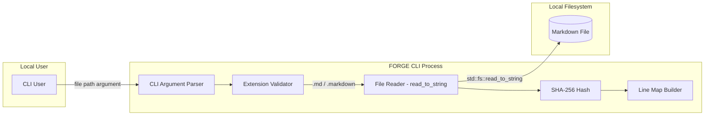
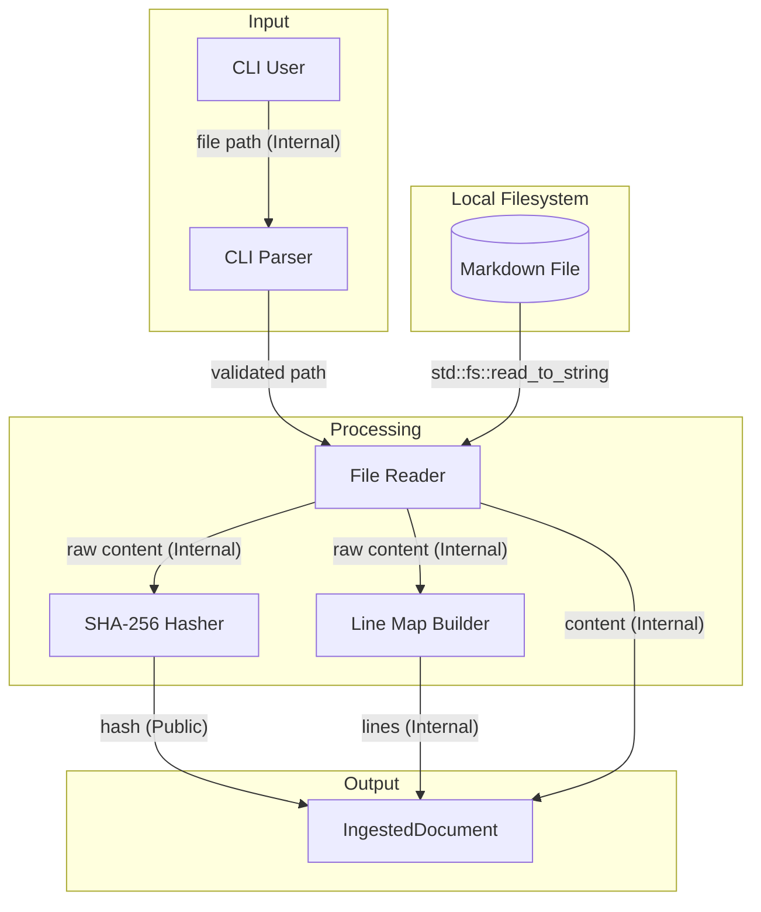
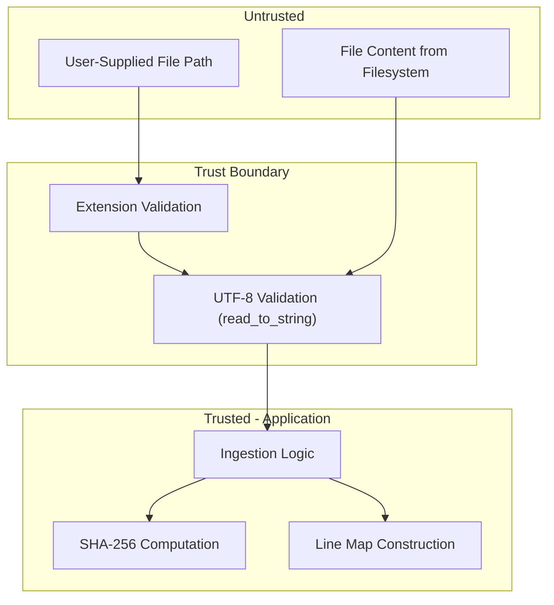

# 002-sec-markdown-ingestion

> **Document Type:** Security Review (Lightweight)
> **Audience:** LLM agents, human reviewers
> **Status:** Draft
> **Last Updated:** 2026-02-11 <!-- @auto -->
> **Reviewer:** Brian Luby <!-- @human-required -->
> **Risk Level:** Medium <!-- @human-required -->

---

## Review Tier Legend

| Marker | Tier | Speckit Behavior |
|--------|------|------------------|
| 🔴 `@human-required` | Human Generated | Prompt human to author; blocks until complete |
| 🟡 `@human-review` | LLM + Human Review | LLM drafts → prompt human to confirm/edit; blocks until confirmed |
| 🟢 `@llm-autonomous` | LLM Autonomous | LLM completes; no prompt; logged for audit |
| ⚪ `@auto` | Auto-generated | System fills (timestamps, links); no prompt |

---

## Severity Definitions

| Level | Label | Definition |
|-------|-------|------------|
| 🔴 | **Critical** | Immediate exploitation risk; data breach or system compromise likely |
| 🟠 | **High** | Significant risk; exploitation possible with moderate effort |
| 🟡 | **Medium** | Notable risk; exploitation requires specific conditions |
| 🟢 | **Low** | Minor risk; limited impact or unlikely exploitation |

---

## Linkage ⚪ `@auto`

| Document | ID | Relationship |
|----------|-----|--------------|
| Parent PRD | [002-prd-markdown-ingestion.md](../PRD/002-prd-markdown-ingestion.md) | Feature being reviewed |
| Architecture Review | [002-ar-markdown-ingestion.md](../AR/002-ar-markdown-ingestion.md) | Technical implementation |

---

## Purpose

This is a **lightweight security review** intended to catch obvious security concerns early in the product lifecycle. It is NOT a comprehensive threat model. Full threat modeling should occur during implementation when infrastructure-as-code and concrete implementations exist.

**This review answers three questions:**
1. What does this feature expose to attackers?
2. What data does it touch, and how sensitive is that data?
3. What's the impact if something goes wrong?

**Scope of this review:**
- ✅ Attack surface identification
- ✅ Data classification
- ✅ High-level CIA assessment
- ❌ Detailed threat enumeration (deferred to implementation)
- ❌ Penetration testing (deferred to implementation)
- ❌ Compliance audit (separate process)

---

## Feature Security Summary

### One-line Summary 🔴 `@human-required`
> Markdown ingestion reads a user-specified file from the local filesystem, validates its extension, reads content into memory as UTF-8, computes a SHA-256 hash, and builds a line map -- the primary security concern is safe file I/O handling (path traversal, symlink following, file size limits).

### Risk Assessment 🔴 `@human-required`
> **Risk Level:** Medium
> **Justification:** This is the only feature in the pipeline that performs direct filesystem I/O from a user-supplied path, making it the primary attack surface for the entire CLI tool; however, it is a local CLI tool with no network exposure, so the blast radius is limited to the local user's own files.

---

## Attack Surface Analysis

### Exposure Points 🟡 `@human-review`

| Exposure Type | Details | Authentication | Authorization | Notes |
|---------------|---------|----------------|---------------|-------|
| User Input Field | File path argument to `forge convert <path>` | N/A — local CLI | N/A — local CLI | Path must be validated; see risks R1-R3 |

### Attack Surface Diagram 🟢 `@llm-autonomous`

### Exposure Checklist 🟢 `@llm-autonomous`

- [x] **No internet-facing endpoints** — local CLI tool only
- [x] **No sensitive data in URL parameters** — N/A, no URLs
- [ ] **File input validated** (extension validated; size limits should be enforced) — see R2
- [x] **No rate limiting needed** — local CLI tool
- [x] **No CORS policy needed** — no HTTP
- [x] **No debug/admin endpoints** — no endpoints at all
- [x] **No webhooks** — no network communication

---

## Data Flow Analysis

### Data Inventory 🟡 `@human-review`

| Data Element | PRD Entity | Classification | Source | Destination | Retention | Encrypted Rest | Encrypted Transit | Residency |
|--------------|------------|----------------|--------|-------------|-----------|----------------|-------------------|-----------|
| File path | IngestedDocument.file_path | Internal | CLI argument | In-memory struct | Process lifetime | N/A — in-memory | N/A — local | Local |
| File content | IngestedDocument.content | Internal | Local filesystem | In-memory struct | Process lifetime | N/A — in-memory | N/A — local | Local |
| Content hash | IngestedDocument.content_hash | Public | Computed from content | In-memory struct | Process lifetime | N/A — in-memory | N/A — local | Local |
| Line map | IngestedDocument.lines | Internal | Computed from content | In-memory struct | Process lifetime | N/A — in-memory | N/A — local | Local |

### Data Classification Reference 🟢 `@llm-autonomous`

| Level | Label | Description | Examples | Handling Requirements |
|-------|-------|-------------|----------|----------------------|
| 1 | **Public** | No impact if disclosed | Marketing content, public docs | No special handling |
| 2 | **Internal** | Minor impact if disclosed | Internal configs, non-sensitive logs | Access controls, no public exposure |
| 3 | **Confidential** | Significant impact if disclosed | PII, user data, credentials | Encryption, audit logging, access controls |
| 4 | **Restricted** | Severe impact if disclosed | Payment data, health records, secrets | Encryption, strict access, compliance requirements |

### Data Flow Diagram 🟢 `@llm-autonomous`

### Data Handling Checklist 🟢 `@llm-autonomous`

- [x] **No Restricted data stored** — policy documents are Internal classification
- [x] **No encryption at rest needed** — in-memory processing only, local CLI
- [x] **No data in transit** — no network communication
- [x] **No PII processed** — policy documents, not personal data
- [x] **No logs contain sensitive data** — no logging in this WI
- [x] **No hardcoded secrets** — no secrets involved
- [x] **Data minimization applied** — only reads the file content needed for processing

---

## Third-Party & Supply Chain 🟡 `@human-review`

### New External Services

| Service | Purpose | Data Shared | Communication | Approved? |
|---------|---------|-------------|---------------|-----------|
| **None** | No external services | — | — | — |

### New Libraries/Dependencies

| Library | Version | License | Purpose | Security Check |
|---------|---------|---------|---------|----------------|
| sha2 | latest stable | MIT/Apache-2.0 | SHA-256 content hashing | ✅ Approved — pure Rust, widely used, no unsafe code |
| pulldown-cmark | latest stable | MIT | Markdown parsing (added here, consumed by WI-3/WI-4) | ✅ Approved — pure Rust, widely used, well-maintained |

### Supply Chain Checklist

- [x] **No new services — local CLI tool**
- [x] **Dependencies have acceptable licenses** (MIT, Apache-2.0)
- [x] **Dependencies are actively maintained** (sha2 and pulldown-cmark are widely used in the Rust ecosystem)
- [x] **No known critical vulnerabilities** in dependency versions (verify with `cargo audit`)

---

## CIA Impact Assessment

If this feature is compromised, what's the impact?

### Confidentiality 🟡 `@human-review`

> **What could be disclosed?**

| Asset at Risk | Classification | Exposure Scenario | Impact | Likelihood |
|---------------|----------------|-------------------|--------|------------|
| Policy document content | Internal | Path traversal reads unintended files; content exposed in error messages or stdout | Low | Low |
| Local filesystem structure | Internal | Error messages reveal directory paths | Low | Medium |

**Confidentiality Risk Level:** Low

### Integrity 🟡 `@human-review`

> **What could be modified or corrupted?**

| Asset at Risk | Modification Scenario | Impact | Likelihood |
|---------------|----------------------|--------|------------|
| OSCAL output correctness | Malformed or adversarial Markdown input produces incorrect OSCAL output | Medium | Low |
| IngestedDocument content | TOCTOU race: file modified between validation and read | Low | Low |

**Integrity Risk Level:** Medium

### Availability 🟡 `@human-review`

> **What could be disrupted?**

| Service/Function | Disruption Scenario | Impact | Likelihood |
|------------------|---------------------|--------|------------|
| CLI process | Memory exhaustion from reading an extremely large file (e.g., multi-GB) | Low | Low |
| CLI process | Hang on reading a special file (e.g., /dev/zero on Unix) | Low | Low |

**Availability Risk Level:** Low

### CIA Summary 🟢 `@llm-autonomous`

| Dimension | Risk Level | Primary Concern | Mitigation Priority |
|-----------|------------|-----------------|---------------------|
| **Confidentiality** | Low | Path traversal reading unintended local files | Low |
| **Integrity** | Medium | Correct OSCAL output from valid input | Medium |
| **Availability** | Low | Memory exhaustion from oversized files | Low |

**Overall CIA Risk:** Low-Medium — *Local CLI tool with filesystem access; integrity of OSCAL output is the primary concern, with limited confidentiality and availability impact since the user is running the tool on their own files.*

---

## Trust Boundaries 🟡 `@human-review`

Where does trust change in this feature?

### Trust Boundary Checklist 🟢 `@llm-autonomous`

- [x] **All input from untrusted sources is validated** — file extension validated; UTF-8 validated by `read_to_string`
- [x] **No external API responses to validate** — no network communication
- [x] **No authorization needed** — local CLI tool; user has filesystem permissions
- [x] **No service-to-service calls** — single-process CLI

---

## Known Risks & Mitigations 🟡 `@human-review`

| ID | Risk Description | Severity | Mitigation | Status | Owner |
|----|------------------|----------|------------|--------|-------|
| R1 | **Path traversal**: User supplies path with `../` sequences or absolute paths that read files outside the intended directory | Low | The CLI accepts any path the user provides — this is by design for a local CLI tool. The user already has filesystem access. Canonicalize paths to resolve symlinks if needed. | Accepted | Brian Luby |
| R2 | **Memory exhaustion from large files**: `read_to_string` loads the entire file into memory; a multi-GB file would exhaust memory | Low | Document a recommended file size limit (e.g., 10MB). PRD A-2 states policy documents are typically under 1MB. Add a configurable file size check before reading. | Open | Brian Luby |
| R3 | **Symlink following**: A symlink could point to sensitive files (e.g., `/etc/shadow`) | Low | For a local CLI tool, the user controls which files to process. This is equivalent to `cat <file>`. No mitigation beyond standard OS permissions. | Accepted | Brian Luby |
| R4 | **TOCTOU race condition**: File could be modified between extension check and `read_to_string` call | Low | Negligible risk for a local CLI tool — the user controls the filesystem. No mitigation needed. | Accepted | Brian Luby |
| R5 | **Special files**: Reading device files (e.g., `/dev/zero`, `/dev/urandom`) could hang or exhaust memory | Low | `read_to_string` on special files has OS-dependent behavior. A file size check (R2 mitigation) would also address this. | Open | Brian Luby |

### Risk Acceptance 🔴 `@human-required`

| Risk ID | Accepted By | Date | Justification | Review Date |
|---------|-------------|------|---------------|-------------|
| R1 | Brian Luby | 2026-02-11 | Local CLI tool — user already has filesystem access equivalent to the tool | 2026-08-11 |
| R3 | Brian Luby | 2026-02-11 | Same justification as R1 — symlink resolution is a user concern | 2026-08-11 |
| R4 | Brian Luby | 2026-02-11 | TOCTOU is a theoretical risk with no practical exploitation path for a local CLI tool | 2026-08-11 |

---

## Security Requirements 🟡 `@human-review`

Based on this review, the implementation MUST satisfy:

### Input Validation

| Req ID | Requirement | PRD AC | Verification Method |
|--------|-------------|--------|---------------------|
| SEC-1 | File extension must be validated (case-insensitive `.md` or `.markdown`) before reading | AC-2 | Unit Test |
| SEC-2 | Non-UTF-8 files must be rejected with a descriptive error | AC-4, EC-4 | Unit Test |
| SEC-3 | Missing or unreadable files must produce descriptive errors with non-zero exit code | AC-4 | Unit Test |

### Resource Limits

| Req ID | Requirement | PRD AC | Verification Method |
|--------|-------------|--------|---------------------|
| SEC-4 | File size should be checked before reading; warn or reject files exceeding a configurable limit (default: 10MB) | — | Unit Test |

### Safe File Handling

| Req ID | Requirement | PRD AC | Verification Method |
|--------|-------------|--------|---------------------|
| SEC-5 | Use `std::fs::read_to_string` for file reading (validates UTF-8 automatically) | AC-1 | Code Review |
| SEC-6 | Error messages must not expose full filesystem paths beyond the user-supplied path | — | Code Review |

---

## Compliance Considerations 🟡 `@human-review`

| Regulation | Applicable? | Relevant Requirements | N/A Justification |
|------------|-------------|----------------------|-------------------|
| GDPR | N/A | — | Local CLI tool; no PII processing; no data collection or transmission |
| CCPA | N/A | — | Local CLI tool; no personal information processing |
| SOC 2 | N/A | — | Local CLI tool; no service operations |
| HIPAA | N/A | — | Local CLI tool; no health data processing |
| PCI-DSS | N/A | — | Local CLI tool; no payment data processing |
| Other | N/A | — | No regulatory requirements apply to a local CLI tool processing policy documents |

---

## Review Findings

### Issues Identified 🟡 `@human-review`

| ID | Finding | Severity | Category | Recommendation | Status |
|----|---------|----------|----------|----------------|--------|
| F1 | No file size limit enforced before `read_to_string` | Low | Availability | Add a configurable file size check (default 10MB) before reading the file into memory | Open |
| F2 | No protection against reading special/device files | Low | Availability | Consider checking `fs::metadata().is_file()` before reading to ensure only regular files are processed | Open |

### Positive Observations 🟢 `@llm-autonomous`

- `std::fs::read_to_string` provides automatic UTF-8 validation, eliminating an entire class of encoding-related vulnerabilities
- Extension-based format detection is explicit and restrictive, preventing unintended file type processing
- SHA-256 content hashing provides integrity verification capability for downstream pipeline stages
- The ingestion layer is a thin, focused module (~50-80 lines) with a small, auditable codebase

---

## Open Questions 🟡 `@human-review`

- [ ] **Q1:** Should the file size limit be a hard rejection or a warning? (Recommendation: warn above 10MB, reject above 100MB)
- [ ] **Q2:** Should `std::fs::canonicalize` be called on the input path to resolve symlinks, or should the tool follow symlinks transparently? (Recommendation: follow symlinks transparently, consistent with standard CLI tool behavior)

---

## Changelog ⚪ `@auto`

| Version | Date | Author | Changes |
|---------|------|--------|---------|
| 0.1 | 2026-02-11 | LLM (Claude) | Initial review |

---

## Review Sign-off 🔴 `@human-required`

| Role | Name | Date | Decision |
|------|------|------|----------|
| Security Reviewer | Brian Luby | YYYY-MM-DD | [Approved / Approved with conditions / Rejected] |
| Feature Owner | Brian Luby | YYYY-MM-DD | [Acknowledged] |

### Conditions for Approval (if applicable) 🔴 `@human-required`

- [ ] Implement file size check before `read_to_string` (F1)
- [ ] Consider `metadata().is_file()` check to avoid reading special files (F2)

---

## Security Requirements Traceability 🟢 `@llm-autonomous`

| SEC Req ID | PRD Req ID | PRD AC ID | Test Type | Test Location |
|------------|------------|-----------|-----------|---------------|
| SEC-1 | M-2 | AC-2 | Unit | tests/ingest_test.rs |
| SEC-2 | S-1 | EC-4 | Unit | tests/ingest_test.rs |
| SEC-3 | M-4 | AC-4 | Unit | tests/ingest_test.rs |
| SEC-4 | — | — | Unit | tests/ingest_test.rs |
| SEC-5 | M-1 | AC-1 | Code Review | src/ingest/mod.rs |
| SEC-6 | — | — | Code Review | src/ingest/mod.rs |

---

## Review Checklist 🟢 `@llm-autonomous`

Before marking as Approved:
- [x] Attack surface documented with auth/authz status for each exposure
- [x] Exposure Points table has no contradictory rows (None vs. actual endpoints)
- [x] All PRD Data Model entities appear in Data Inventory
- [x] All data elements are classified using the 4-tier model
- [x] Third-party dependencies and services are listed
- [x] CIA impact is assessed with Low/Medium/High ratings
- [x] Trust boundaries are identified
- [x] Security requirements have verification methods specified
- [x] Security requirements trace to PRD ACs where applicable
- [x] No Critical/High findings remain Open
- [x] Compliance N/A items have justification
- [x] Risk acceptance has named approver and review date
