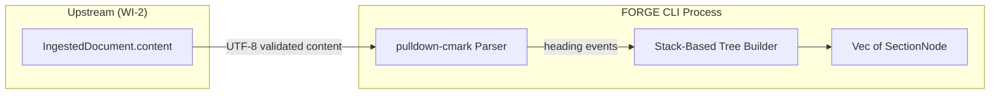
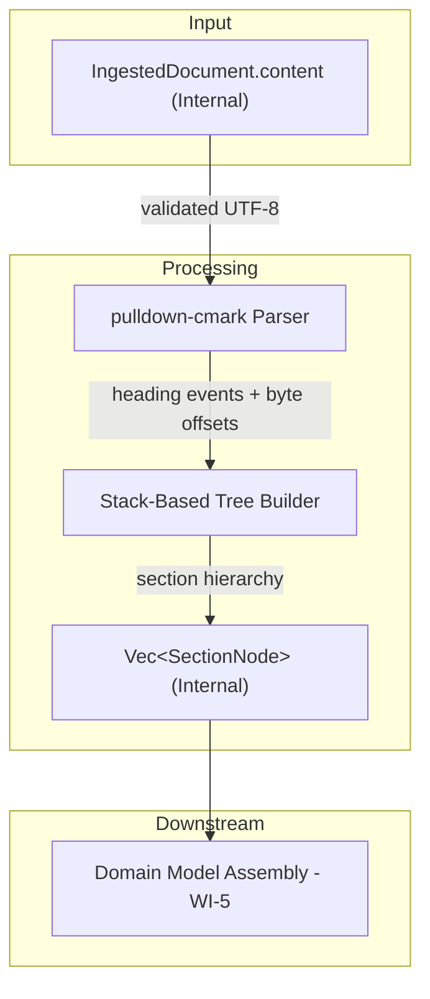
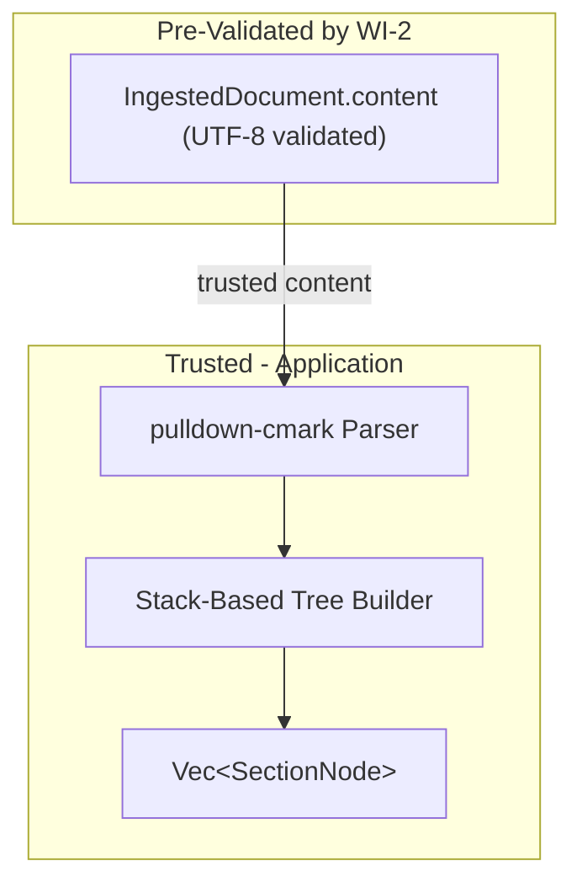

# 003-sec-structural-extraction-headings

> **Document Type:** Security Review (Lightweight)
> **Audience:** LLM agents, human reviewers
> **Status:** Draft
> **Last Updated:** 2026-02-11 <!-- @auto -->
> **Reviewer:** Brian Luby <!-- @human-required -->
> **Risk Level:** Low <!-- @human-required -->

---

## Review Tier Legend

| Marker | Tier | Speckit Behavior |
|--------|------|------------------|
| 🔴 `@human-required` | Human Generated | Prompt human to author; blocks until complete |
| 🟡 `@human-review` | LLM + Human Review | LLM drafts → prompt human to confirm/edit; blocks until confirmed |
| 🟢 `@llm-autonomous` | LLM Autonomous | LLM completes; no prompt; logged for audit |
| ⚪ `@auto` | Auto-generated | System fills (timestamps, links); no prompt |

---

## Severity Definitions

| Level | Label | Definition |
|-------|-------|------------|
| 🔴 | **Critical** | Immediate exploitation risk; data breach or system compromise likely |
| 🟠 | **High** | Significant risk; exploitation possible with moderate effort |
| 🟡 | **Medium** | Notable risk; exploitation requires specific conditions |
| 🟢 | **Low** | Minor risk; limited impact or unlikely exploitation |

---

## Linkage ⚪ `@auto`

| Document | ID | Relationship |
|----------|-----|--------------|
| Parent PRD | [003-prd-structural-extraction-headings.md](../PRD/003-prd-structural-extraction-headings.md) | Feature being reviewed |
| Architecture Review | [003-ar-structural-extraction-headings.md](../AR/003-ar-structural-extraction-headings.md) | Technical implementation |

---

## Purpose

This is a **lightweight security review** intended to catch obvious security concerns early in the product lifecycle. It is NOT a comprehensive threat model. Full threat modeling should occur during implementation when infrastructure-as-code and concrete implementations exist.

**This review answers three questions:**
1. What does this feature expose to attackers?
2. What data does it touch, and how sensitive is that data?
3. What's the impact if something goes wrong?

**Scope of this review:**
- ✅ Attack surface identification
- ✅ Data classification
- ✅ High-level CIA assessment
- ❌ Detailed threat enumeration (deferred to implementation)
- ❌ Penetration testing (deferred to implementation)
- ❌ Compliance audit (separate process)

---

## Feature Security Summary

### One-line Summary 🔴 `@human-required`
> Heading extraction parses already-ingested Markdown content using pulldown-cmark events to build a hierarchical section tree (SectionNode) -- the primary security concern is stack/memory safety when processing deeply nested or adversarial heading structures.

### Risk Assessment 🔴 `@human-required`
> **Risk Level:** Low
> **Justification:** This feature processes already-ingested, UTF-8-validated content using the well-maintained pulldown-cmark library; it performs no I/O and has no external exposure. The only meaningful risk is resource consumption from pathological input documents, and even that is bounded by the upstream file size limits in WI-2.

---

## Attack Surface Analysis

### Exposure Points 🟡 `@human-review`

| Exposure Type | Details | Authentication | Authorization | Notes |
|---------------|---------|----------------|---------------|-------|
| **None** | **Feature has no direct external exposure** — operates on already-ingested content | — | — | Input is pre-validated by WI-2 ingestion layer |

### Attack Surface Diagram 🟢 `@llm-autonomous`

### Exposure Checklist 🟢 `@llm-autonomous`

- [x] **No internet-facing endpoints** — local CLI tool, no network
- [x] **No user input at this stage** — content is pre-validated by WI-2
- [x] **No file I/O** — operates on in-memory strings
- [x] **No rate limiting needed** — local CLI tool
- [x] **No CORS, webhooks, or admin endpoints** — no HTTP at all

---

## Data Flow Analysis

### Data Inventory 🟡 `@human-review`

| Data Element | PRD Entity | Classification | Source | Destination | Retention | Encrypted Rest | Encrypted Transit | Residency |
|--------------|------------|----------------|--------|-------------|-----------|----------------|-------------------|-----------|
| Markdown content | IngestedDocument.content | Internal | WI-2 ingestion | pulldown-cmark parser | Process lifetime | N/A — in-memory | N/A — local | Local |
| Section tree | Vec of SectionNode | Internal | Computed from content | In-memory struct | Process lifetime | N/A — in-memory | N/A — local | Local |
| Heading titles | SectionNode.title | Internal | Extracted from content | In-memory struct | Process lifetime | N/A — in-memory | N/A — local | Local |
| Source line numbers | SectionNode.source_line | Public | Computed from byte offsets | In-memory struct | Process lifetime | N/A — in-memory | N/A — local | Local |

### Data Classification Reference 🟢 `@llm-autonomous`

| Level | Label | Description | Examples | Handling Requirements |
|-------|-------|-------------|----------|----------------------|
| 1 | **Public** | No impact if disclosed | Marketing content, public docs | No special handling |
| 2 | **Internal** | Minor impact if disclosed | Internal configs, non-sensitive logs | Access controls, no public exposure |
| 3 | **Confidential** | Significant impact if disclosed | PII, user data, credentials | Encryption, audit logging, access controls |
| 4 | **Restricted** | Severe impact if disclosed | Payment data, health records, secrets | Encryption, strict access, compliance requirements |

### Data Flow Diagram 🟢 `@llm-autonomous`

### Data Handling Checklist 🟢 `@llm-autonomous`

- [x] **No Restricted data stored** — policy headings are Internal classification
- [x] **No encryption needed** — in-memory processing only, local CLI
- [x] **No data in transit** — no network communication
- [x] **No PII processed** — section headings from policy documents
- [x] **No secrets involved** — no credentials or tokens
- [x] **Data minimization applied** — only heading structure is extracted

---

## Third-Party & Supply Chain 🟡 `@human-review`

### New External Services

| Service | Purpose | Data Shared | Communication | Approved? |
|---------|---------|-------------|---------------|-----------|
| **None** | No external services | — | — | — |

### New Libraries/Dependencies

| Library | Version | License | Purpose | Security Check |
|---------|---------|---------|---------|----------------|
| pulldown-cmark | 0.13.x | MIT | Markdown event-based parsing (new dependency for WI-3) | ✅ Approved — pure Rust, no unsafe, well-maintained |

pulldown-cmark is a new dependency introduced by this WI (added to Cargo.toml in Phase 1 setup).

### Supply Chain Checklist

- [x] **No new services**
- [x] **No new dependencies beyond WI-2**
- [x] **pulldown-cmark is actively maintained** with no known critical vulnerabilities

---

## CIA Impact Assessment

If this feature is compromised, what's the impact?

### Confidentiality 🟡 `@human-review`

> **What could be disclosed?**

| Asset at Risk | Classification | Exposure Scenario | Impact | Likelihood |
|---------------|----------------|-------------------|--------|------------|
| Policy heading titles | Internal | Heading text appears in debug output or error messages | Low | Low |

**Confidentiality Risk Level:** Low

### Integrity 🟡 `@human-review`

> **What could be modified or corrupted?**

| Asset at Risk | Modification Scenario | Impact | Likelihood |
|---------------|----------------------|--------|------------|
| Section tree hierarchy | Malformed heading structure produces incorrect parent-child relationships | Medium | Low |
| Source line numbers | Off-by-one in byte-offset-to-line conversion produces incorrect traceability | Medium | Low |

**Integrity Risk Level:** Medium

### Availability 🟡 `@human-review`

> **What could be disrupted?**

| Service/Function | Disruption Scenario | Impact | Likelihood |
|------------------|---------------------|--------|------------|
| CLI process | Stack overflow from deeply nested recursive data structure operations | Low | Low |
| CLI process | Memory exhaustion from document with thousands of headings producing large tree | Low | Low |

**Availability Risk Level:** Low

### CIA Summary 🟢 `@llm-autonomous`

| Dimension | Risk Level | Primary Concern | Mitigation Priority |
|-----------|------------|-----------------|---------------------|
| **Confidentiality** | Low | Heading text in debug output | Low |
| **Integrity** | Medium | Correct section hierarchy and line numbers | Medium |
| **Availability** | Low | Resource consumption from pathological documents | Low |

**Overall CIA Risk:** Low — *This feature processes already-validated content with no I/O, no network exposure, and bounded resource consumption. Integrity of the section tree is the primary concern, addressed through comprehensive testing.*

---

## Trust Boundaries 🟡 `@human-review`

Where does trust change in this feature?

Note: The trust boundary for user input was crossed in WI-2 (ingestion). By the time content reaches heading extraction, it has already been validated as a readable Markdown file with valid UTF-8 encoding. This feature operates entirely within the trusted application boundary.

### Trust Boundary Checklist 🟢 `@llm-autonomous`

- [x] **Input is pre-validated by upstream WI-2** — UTF-8 and format validated
- [x] **No external API responses to validate** — no network communication
- [x] **No authorization checks needed** — internal processing
- [x] **No service-to-service calls** — single-process CLI

---

## Known Risks & Mitigations 🟡 `@human-review`

| ID | Risk Description | Severity | Mitigation | Status | Owner |
|----|------------------|----------|------------|--------|-------|
| R1 | **Stack overflow from deeply nested operations**: If the tree builder uses recursion for deeply nested sections, a document with extreme nesting could cause a stack overflow | Low | The stack-based algorithm in AR-003 uses an explicit stack (Vec), not call-stack recursion, avoiding this risk. However, any downstream recursive traversal of the tree (e.g., for Debug printing) should be bounded. Maximum heading depth is 6 (H1-H6), naturally bounding tree depth. | Mitigated | Brian Luby |
| R2 | **Memory exhaustion from large document**: A document with thousands of headings could produce a large in-memory tree | Low | Bounded by upstream file size limits from WI-2 (policy documents typically under 1MB). A 1MB Markdown document could contain at most ~10,000 headings, producing a tree that fits easily in memory. | Mitigated | Brian Luby |
| R3 | **Incorrect hierarchy from adversarial heading patterns**: Carefully crafted heading sequences (e.g., rapid level changes) could confuse the tree builder | Low | The stack-based algorithm handles all heading level combinations by design (pop-to-parent semantics). Comprehensive unit tests cover irregular nesting patterns per PRD M-4 and EC-1 through EC-4. | Mitigated | Brian Luby |

### Risk Acceptance 🔴 `@human-required`

No risks require acceptance — all identified risks are mitigated to acceptable levels.

| Risk ID | Accepted By | Date | Justification | Review Date |
|---------|-------------|------|---------------|-------------|
| — | — | — | No risks require acceptance | — |

---

## Security Requirements 🟡 `@human-review`

Based on this review, the implementation MUST satisfy:

### Input Validation

| Req ID | Requirement | PRD AC | Verification Method |
|--------|-------------|--------|---------------------|
| SEC-1 | The tree builder must handle all heading level combinations (H1-H6) without panicking, including skipped levels and documents starting with deep headings | AC-4, EC-1, EC-2 | Unit Test |
| SEC-2 | Documents with no headings must return an empty section list (not an error or panic) | EC-1 | Unit Test |

### Resource Limits

| Req ID | Requirement | PRD AC | Verification Method |
|--------|-------------|--------|---------------------|
| SEC-3 | The tree construction algorithm must use an explicit stack (not call-stack recursion) to prevent stack overflow | — | Code Review |
| SEC-4 | Tree depth is naturally bounded by Markdown heading levels (max 6) — no additional enforcement needed | — | Code Review |

---

## Compliance Considerations 🟡 `@human-review`

| Regulation | Applicable? | Relevant Requirements | N/A Justification |
|------------|-------------|----------------------|-------------------|
| GDPR | N/A | — | Local CLI tool; no PII processing; no data collection or transmission |
| CCPA | N/A | — | Local CLI tool; no personal information processing |
| SOC 2 | N/A | — | Local CLI tool; no service operations |
| HIPAA | N/A | — | Local CLI tool; no health data processing |
| PCI-DSS | N/A | — | Local CLI tool; no payment data processing |
| Other | N/A | — | No regulatory requirements apply to local in-memory parsing of policy document headings |

---

## Review Findings

### Issues Identified 🟡 `@human-review`

| ID | Finding | Severity | Category | Recommendation | Status |
|----|---------|----------|----------|----------------|--------|
| F1 | If downstream code uses recursive traversal of the SectionNode tree for serialization or display, stack depth should be considered | Low | Availability | Use iterative traversal or bound recursion depth to 6 (max heading levels) for any tree-walking operations | Open |

### Positive Observations 🟢 `@llm-autonomous`

- The stack-based algorithm uses an explicit stack (Vec) rather than call-stack recursion, eliminating stack overflow risk in the tree construction itself
- Tree depth is naturally bounded by Markdown heading levels (maximum 6), providing an inherent safety limit
- pulldown-cmark is a pure Rust, memory-safe parser with no unsafe code blocks
- The feature processes pre-validated content (UTF-8 validated by WI-2), so it does not need to handle encoding errors
- The O(n) single-pass algorithm ensures processing time is linear and predictable

---

## Open Questions 🟡 `@human-review`

No open questions for this work item.

---

## Changelog ⚪ `@auto`

| Version | Date | Author | Changes |
|---------|------|--------|---------|
| 0.1 | 2026-02-11 | LLM (Claude) | Initial review |

---

## Review Sign-off 🔴 `@human-required`

| Role | Name | Date | Decision |
|------|------|------|----------|
| Security Reviewer | Brian Luby | YYYY-MM-DD | [Approved / Approved with conditions / Rejected] |
| Feature Owner | Brian Luby | YYYY-MM-DD | [Acknowledged] |

### Conditions for Approval (if applicable) 🔴 `@human-required`

- [ ] Ensure downstream tree traversal uses iterative or bounded-depth recursion (F1)

---

## Security Requirements Traceability 🟢 `@llm-autonomous`

| SEC Req ID | PRD Req ID | PRD AC ID | Test Type | Test Location |
|------------|------------|-----------|-----------|---------------|
| SEC-1 | M-4 | AC-4 | Unit | src/parse/mod.rs |
| SEC-2 | M-1 | EC-1 | Unit | src/parse/mod.rs |
| SEC-3 | — | — | Code Review | src/parse/mod.rs |
| SEC-4 | — | — | Code Review | src/parse/mod.rs |

---

## Review Checklist 🟢 `@llm-autonomous`

Before marking as Approved:
- [x] Attack surface documented with auth/authz status for each exposure
- [x] Exposure Points table has no contradictory rows (None vs. actual endpoints)
- [x] All PRD Data Model entities appear in Data Inventory
- [x] All data elements are classified using the 4-tier model
- [x] Third-party dependencies and services are listed
- [x] CIA impact is assessed with Low/Medium/High ratings
- [x] Trust boundaries are identified
- [x] Security requirements have verification methods specified
- [x] Security requirements trace to PRD ACs where applicable
- [x] No Critical/High findings remain Open
- [x] Compliance N/A items have justification
- [x] Risk acceptance has named approver and review date
