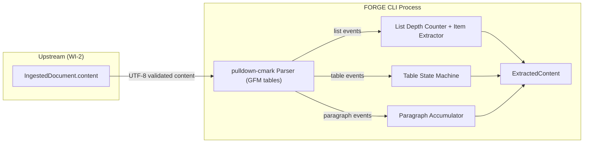
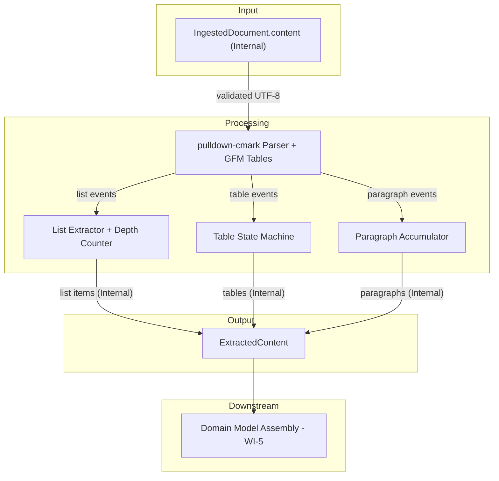
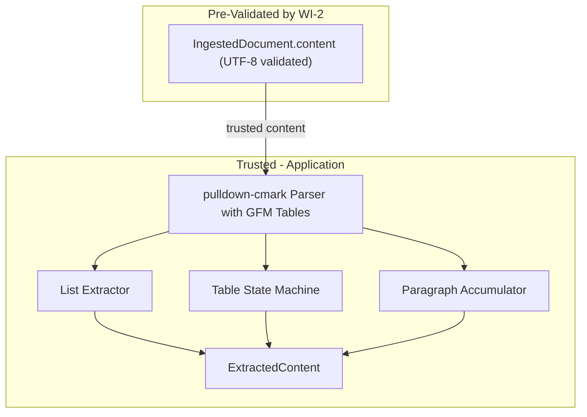

# 004-sec-structural-extraction-clauses

> **Document Type:** Security Review (Lightweight)
> **Audience:** LLM agents, human reviewers
> **Status:** Draft
> **Last Updated:** 2026-02-11 <!-- @auto -->
> **Reviewer:** Brian Luby <!-- @human-required -->
> **Risk Level:** Low <!-- @human-required -->

---

## Review Tier Legend

| Marker | Tier | Speckit Behavior |
|--------|------|------------------|
| 🔴 `@human-required` | Human Generated | Prompt human to author; blocks until complete |
| 🟡 `@human-review` | LLM + Human Review | LLM drafts → prompt human to confirm/edit; blocks until confirmed |
| 🟢 `@llm-autonomous` | LLM Autonomous | LLM completes; no prompt; logged for audit |
| ⚪ `@auto` | Auto-generated | System fills (timestamps, links); no prompt |

---

## Severity Definitions

| Level | Label | Definition |
|-------|-------|------------|
| 🔴 | **Critical** | Immediate exploitation risk; data breach or system compromise likely |
| 🟠 | **High** | Significant risk; exploitation possible with moderate effort |
| 🟡 | **Medium** | Notable risk; exploitation requires specific conditions |
| 🟢 | **Low** | Minor risk; limited impact or unlikely exploitation |

---

## Linkage ⚪ `@auto`

| Document | ID | Relationship |
|----------|-----|--------------|
| Parent PRD | [004-prd-structural-extraction-clauses.md](../PRD/004-prd-structural-extraction-clauses.md) | Feature being reviewed |
| Architecture Review | [004-ar-structural-extraction-clauses.md](../AR/004-ar-structural-extraction-clauses.md) | Technical implementation |

---

## Purpose

This is a **lightweight security review** intended to catch obvious security concerns early in the product lifecycle. It is NOT a comprehensive threat model. Full threat modeling should occur during implementation when infrastructure-as-code and concrete implementations exist.

**This review answers three questions:**
1. What does this feature expose to attackers?
2. What data does it touch, and how sensitive is that data?
3. What's the impact if something goes wrong?

**Scope of this review:**
- ✅ Attack surface identification
- ✅ Data classification
- ✅ High-level CIA assessment
- ❌ Detailed threat enumeration (deferred to implementation)
- ❌ Penetration testing (deferred to implementation)
- ❌ Compliance audit (separate process)

---

## Feature Security Summary

### One-line Summary 🔴 `@human-required`
> Clause extraction parses already-ingested Markdown content using pulldown-cmark events (with GFM table extension) to extract list items, tables, and paragraphs -- the primary security concern is robustness of the event-based state machine against malformed or adversarial Markdown structures, and memory consumption from deeply nested lists.

### Risk Assessment 🔴 `@human-required`
> **Risk Level:** Low
> **Justification:** This feature processes pre-validated content using pulldown-cmark events with no I/O and no external exposure. The event-based pattern matching uses pulldown-cmark (a well-maintained Markdown parser) rather than custom regex patterns, eliminating ReDoS risk at this layer. Resource consumption is bounded by upstream file size limits.

---

## Attack Surface Analysis

### Exposure Points 🟡 `@human-review`

| Exposure Type | Details | Authentication | Authorization | Notes |
|---------------|---------|----------------|---------------|-------|
| **None** | **Feature has no direct external exposure** — operates on already-ingested content | — | — | Input is pre-validated by WI-2 ingestion layer |

### Attack Surface Diagram 🟢 `@llm-autonomous`

### Exposure Checklist 🟢 `@llm-autonomous`

- [x] **No internet-facing endpoints** — local CLI tool, no network
- [x] **No user input at this stage** — content is pre-validated by WI-2
- [x] **No file I/O** — operates on in-memory strings
- [x] **No rate limiting needed** — local CLI tool
- [x] **No CORS, webhooks, or admin endpoints** — no HTTP at all

---

## Data Flow Analysis

### Data Inventory 🟡 `@human-review`

| Data Element | PRD Entity | Classification | Source | Destination | Retention | Encrypted Rest | Encrypted Transit | Residency |
|--------------|------------|----------------|--------|-------------|-----------|----------------|-------------------|-----------|
| Markdown content | IngestedDocument.content | Internal | WI-2 ingestion | pulldown-cmark parser | Process lifetime | N/A — in-memory | N/A — local | Local |
| Extracted list items | ExtractedListItem | Internal | Computed from events | In-memory struct | Process lifetime | N/A — in-memory | N/A — local | Local |
| Extracted tables | ExtractedTable | Internal | Computed from events | In-memory struct | Process lifetime | N/A — in-memory | N/A — local | Local |
| Extracted paragraphs | ExtractedParagraph | Internal | Computed from events | In-memory struct | Process lifetime | N/A — in-memory | N/A — local | Local |
| Source line numbers | Various .source_line fields | Public | Computed from byte offsets | In-memory struct | Process lifetime | N/A — in-memory | N/A — local | Local |

### Data Classification Reference 🟢 `@llm-autonomous`

| Level | Label | Description | Examples | Handling Requirements |
|-------|-------|-------------|----------|----------------------|
| 1 | **Public** | No impact if disclosed | Marketing content, public docs | No special handling |
| 2 | **Internal** | Minor impact if disclosed | Internal configs, non-sensitive logs | Access controls, no public exposure |
| 3 | **Confidential** | Significant impact if disclosed | PII, user data, credentials | Encryption, audit logging, access controls |
| 4 | **Restricted** | Severe impact if disclosed | Payment data, health records, secrets | Encryption, strict access, compliance requirements |

### Data Flow Diagram 🟢 `@llm-autonomous`

### Data Handling Checklist 🟢 `@llm-autonomous`

- [x] **No Restricted data stored** — policy content is Internal classification
- [x] **No encryption needed** — in-memory processing only, local CLI
- [x] **No data in transit** — no network communication
- [x] **No PII processed** — policy clause text from documents
- [x] **No secrets involved** — no credentials or tokens
- [x] **Data minimization applied** — only list items, tables, and paragraphs are extracted

---

## Third-Party & Supply Chain 🟡 `@human-review`

### New External Services

| Service | Purpose | Data Shared | Communication | Approved? |
|---------|---------|-------------|---------------|-----------|
| **None** | No external services | — | — | — |

### New Libraries/Dependencies

| Library | Version | License | Purpose | Security Check |
|---------|---------|---------|---------|----------------|
| pulldown-cmark | latest stable | MIT | Markdown parsing with GFM table extension (already added in WI-2) | ✅ Approved — pure Rust, no unsafe, well-maintained |

No new dependencies are introduced by this WI. pulldown-cmark (with its GFM tables extension) was added in WI-2.

### Supply Chain Checklist

- [x] **No new services**
- [x] **No new dependencies beyond WI-2**
- [x] **pulldown-cmark is actively maintained** with no known critical vulnerabilities

---

## CIA Impact Assessment

If this feature is compromised, what's the impact?

### Confidentiality 🟡 `@human-review`

> **What could be disclosed?**

| Asset at Risk | Classification | Exposure Scenario | Impact | Likelihood |
|---------------|----------------|-------------------|--------|------------|
| Policy requirement text | Internal | Extracted clause text appears in debug output or error messages | Low | Low |
| Table content (roles, responsibilities) | Internal | Table data exposed through verbose logging | Low | Low |

**Confidentiality Risk Level:** Low

### Integrity 🟡 `@human-review`

> **What could be modified or corrupted?**

| Asset at Risk | Modification Scenario | Impact | Likelihood |
|---------------|----------------------|--------|------------|
| Extracted list items | Malformed list structure causes items to be missed or duplicated | Medium | Low |
| Table structure | Malformed Markdown table causes incorrect header/row extraction | Low | Low |
| Nesting depth | Adversarial nested lists cause incorrect depth tracking | Low | Low |

**Integrity Risk Level:** Low-Medium

### Availability 🟡 `@human-review`

> **What could be disrupted?**

| Service/Function | Disruption Scenario | Impact | Likelihood |
|------------------|---------------------|--------|------------|
| CLI process | Memory exhaustion from document with thousands of deeply nested list items | Low | Low |
| CLI process | Excessive CPU from document with extremely complex table structures | Low | Low |

**Availability Risk Level:** Low

### CIA Summary 🟢 `@llm-autonomous`

| Dimension | Risk Level | Primary Concern | Mitigation Priority |
|-----------|------------|-----------------|---------------------|
| **Confidentiality** | Low | Policy text in debug output | Low |
| **Integrity** | Low-Medium | Correct extraction of list items and table structure | Medium |
| **Availability** | Low | Resource consumption from pathological documents | Low |

**Overall CIA Risk:** Low — *This feature operates entirely on pre-validated in-memory content using pulldown-cmark events. No I/O, no network, no regex patterns. Integrity of extracted data is the primary concern, addressed by comprehensive testing against varied Markdown structures.*

---

## Trust Boundaries 🟡 `@human-review`

Where does trust change in this feature?

Note: The trust boundary for user input was crossed in WI-2 (ingestion). By the time content reaches clause extraction, it has already been validated as a readable Markdown file with valid UTF-8 encoding. This feature operates entirely within the trusted application boundary.

### Trust Boundary Checklist 🟢 `@llm-autonomous`

- [x] **Input is pre-validated by upstream WI-2** — UTF-8 and format validated
- [x] **No external API responses to validate** — no network communication
- [x] **No authorization checks needed** — internal processing
- [x] **No service-to-service calls** — single-process CLI

---

## Known Risks & Mitigations 🟡 `@human-review`

| ID | Risk Description | Severity | Mitigation | Status | Owner |
|----|------------------|----------|------------|--------|-------|
| R1 | **Deeply nested lists**: A document with lists nested 100+ levels deep could produce ExtractedListItem structs with high nesting_depth values, potentially causing issues in downstream consumers | Low | The nesting depth counter uses a u8 (max 255), which is more than sufficient. pulldown-cmark itself handles nested list parsing correctly. Downstream consumers should handle arbitrary nesting depth values. Upstream file size limits bound the total number of items. | Mitigated | Brian Luby |
| R2 | **Malformed table structure**: Tables with inconsistent column counts (e.g., rows with more cells than headers) could cause unexpected behavior in the table state machine | Low | Best-effort extraction: the state machine processes whatever events pulldown-cmark emits. Malformed Markdown tables produce malformed events, and pulldown-cmark handles edge cases in the parser itself. Empty cells produce empty strings per AR-004. | Mitigated | Brian Luby |
| R3 | **Memory from large number of extracted items**: A document with thousands of list items and tables produces many ExtractedListItem and ExtractedTable structs | Low | Bounded by upstream file size limits from WI-2. A 1MB Markdown document can produce at most ~10,000 list items, each a small struct. Total memory overhead is negligible. | Mitigated | Brian Luby |
| R4 | **No ReDoS risk at this layer**: The architecture uses pulldown-cmark events (not regex) for structural extraction | Low | This is a positive finding. The AR explicitly chose event-based parsing over regex-based parsing (Option 3 was rejected). No regex patterns are used in clause extraction. | Mitigated | Brian Luby |

### Risk Acceptance 🔴 `@human-required`

No risks require acceptance — all identified risks are mitigated to acceptable levels.

| Risk ID | Accepted By | Date | Justification | Review Date |
|---------|-------------|------|---------------|-------------|
| — | — | — | No risks require acceptance | — |

---

## Security Requirements 🟡 `@human-review`

Based on this review, the implementation MUST satisfy:

### Input Validation

| Req ID | Requirement | PRD AC | Verification Method |
|--------|-------------|--------|---------------------|
| SEC-1 | The clause extractor must handle documents with no lists or tables without error, returning an empty ExtractedContent | EC-1 | Unit Test |
| SEC-2 | Empty table cells must produce empty strings, not null values or panics | EC-5 | Unit Test |
| SEC-3 | Inline Markdown formatting within list items must be stripped cleanly without producing malformed text | EC-4 | Unit Test |

### Resource Limits

| Req ID | Requirement | PRD AC | Verification Method |
|--------|-------------|--------|---------------------|
| SEC-4 | The nesting depth counter must use a bounded type (u8) and handle overflow gracefully (saturate, do not panic) | M-5 | Unit Test |
| SEC-5 | The extraction algorithm must be O(n) in document size to ensure predictable processing time | — | Code Review |

### Safe Processing

| Req ID | Requirement | PRD AC | Verification Method |
|--------|-------------|--------|---------------------|
| SEC-6 | Use pulldown-cmark event-based parsing (not regex) for all structural extraction to avoid ReDoS risk | — | Code Review |
| SEC-7 | Enable `Options::ENABLE_TABLES` on the pulldown-cmark parser for GFM table support | M-3 | Code Review |

---

## Compliance Considerations 🟡 `@human-review`

| Regulation | Applicable? | Relevant Requirements | N/A Justification |
|------------|-------------|----------------------|-------------------|
| GDPR | N/A | — | Local CLI tool; no PII processing; no data collection or transmission |
| CCPA | N/A | — | Local CLI tool; no personal information processing |
| SOC 2 | N/A | — | Local CLI tool; no service operations |
| HIPAA | N/A | — | Local CLI tool; no health data processing |
| PCI-DSS | N/A | — | Local CLI tool; no payment data processing |
| Other | N/A | — | No regulatory requirements apply to local in-memory parsing of policy document structures |

---

## Review Findings

### Issues Identified 🟡 `@human-review`

| ID | Finding | Severity | Category | Recommendation | Status |
|----|---------|----------|----------|----------------|--------|
| — | No security issues identified | — | — | — | — |

### Positive Observations 🟢 `@llm-autonomous`

- The architecture explicitly chose event-based pulldown-cmark parsing over regex-based parsing (AR-004 Option 3 rejected), eliminating ReDoS risk entirely at this layer
- pulldown-cmark is a pure Rust, memory-safe parser with no unsafe code blocks
- The feature processes pre-validated content (UTF-8 validated by WI-2), eliminating encoding-related vulnerabilities
- The nesting depth counter uses pulldown-cmark's own `Start(List)`/`End(List)` event pairs, which are authoritative and reliable
- The O(n) single-pass algorithm ensures processing time is linear and predictable
- The architecture correctly defers section association to WI-5 rather than coupling clause extraction to heading extraction, maintaining clean separation of concerns

---

## Open Questions 🟡 `@human-review`

No open questions for this work item.

---

## Changelog ⚪ `@auto`

| Version | Date | Author | Changes |
|---------|------|--------|---------|
| 0.1 | 2026-02-11 | LLM (Claude) | Initial review |

---

## Review Sign-off 🔴 `@human-required`

| Role | Name | Date | Decision |
|------|------|------|----------|
| Security Reviewer | Brian Luby | YYYY-MM-DD | [Approved / Approved with conditions / Rejected] |
| Feature Owner | Brian Luby | YYYY-MM-DD | [Acknowledged] |

### Conditions for Approval (if applicable) 🔴 `@human-required`

No conditions — no open findings.

---

## Security Requirements Traceability 🟢 `@llm-autonomous`

| SEC Req ID | PRD Req ID | PRD AC ID | Test Type | Test Location |
|------------|------------|-----------|-----------|---------------|
| SEC-1 | M-1 | EC-1 | Unit | tests/parse_clauses_test.rs |
| SEC-2 | M-3 | EC-5 | Unit | tests/parse_clauses_test.rs |
| SEC-3 | M-1 | EC-4 | Unit | tests/parse_clauses_test.rs |
| SEC-4 | M-5 | AC-5 | Unit | tests/parse_clauses_test.rs |
| SEC-5 | — | — | Code Review | src/parse/clauses.rs |
| SEC-6 | — | — | Code Review | src/parse/clauses.rs |
| SEC-7 | M-3 | AC-3 | Code Review | src/parse/clauses.rs |

---

## Review Checklist 🟢 `@llm-autonomous`

Before marking as Approved:
- [x] Attack surface documented with auth/authz status for each exposure
- [x] Exposure Points table has no contradictory rows (None vs. actual endpoints)
- [x] All PRD Data Model entities appear in Data Inventory
- [x] All data elements are classified using the 4-tier model
- [x] Third-party dependencies and services are listed
- [x] CIA impact is assessed with Low/Medium/High ratings
- [x] Trust boundaries are identified
- [x] Security requirements have verification methods specified
- [x] Security requirements trace to PRD ACs where applicable
- [x] No Critical/High findings remain Open
- [x] Compliance N/A items have justification
- [x] Risk acceptance has named approver and review date
