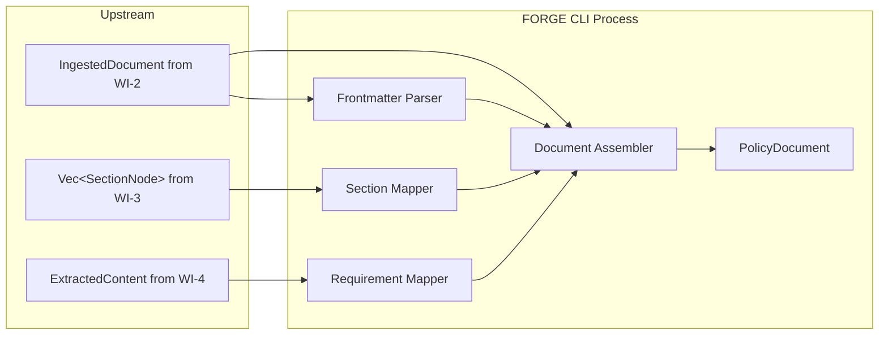
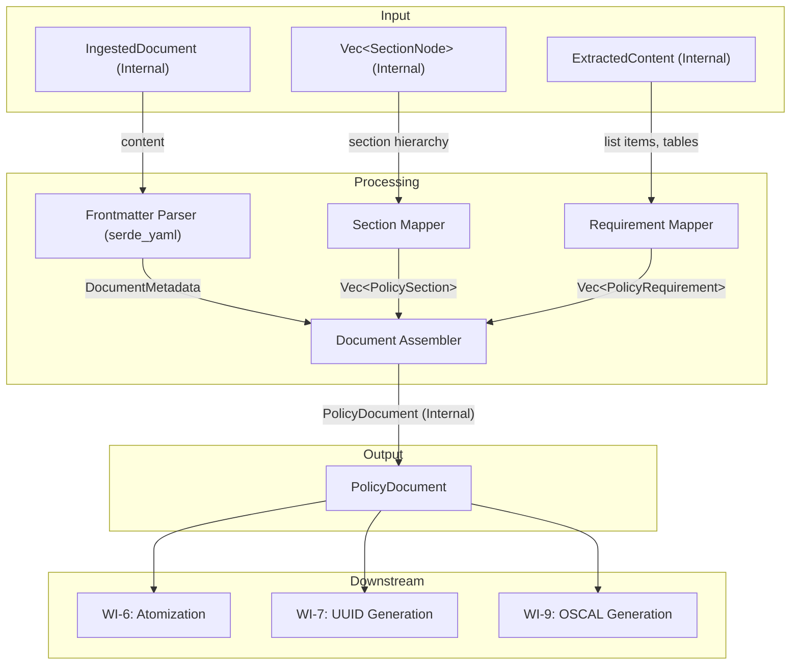
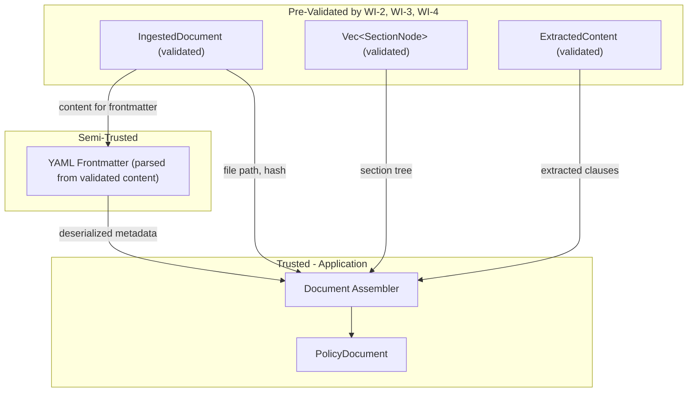

# 005-sec-domain-model

> **Document Type:** Security Review (Lightweight)
> **Audience:** LLM agents, human reviewers
> **Status:** Draft
> **Last Updated:** 2026-02-11 <!-- @auto -->
> **Reviewer:** Brian Luby <!-- @human-required -->
> **Risk Level:** Low <!-- @human-required -->

---

## Review Tier Legend

| Marker | Tier | Speckit Behavior |
|--------|------|------------------|
| 🔴 `@human-required` | Human Generated | Prompt human to author; blocks until complete |
| 🟡 `@human-review` | LLM + Human Review | LLM drafts → prompt human to confirm/edit; blocks until confirmed |
| 🟢 `@llm-autonomous` | LLM Autonomous | LLM completes; no prompt; logged for audit |
| ⚪ `@auto` | Auto-generated | System fills (timestamps, links); no prompt |

---

## Severity Definitions

| Level | Label | Definition |
|-------|-------|------------|
| 🔴 | **Critical** | Immediate exploitation risk; data breach or system compromise likely |
| 🟠 | **High** | Significant risk; exploitation possible with moderate effort |
| 🟡 | **Medium** | Notable risk; exploitation requires specific conditions |
| 🟢 | **Low** | Minor risk; limited impact or unlikely exploitation |

---

## Linkage ⚪ `@auto`

| Document | ID | Relationship |
|----------|-----|--------------|
| Parent PRD | [005-prd-domain-model.md](../PRD/005-prd-domain-model.md) | Feature being reviewed |
| Architecture Review | [005-ar-domain-model.md](../AR/005-ar-domain-model.md) | Technical implementation |

---

## Purpose

This is a **lightweight security review** intended to catch obvious security concerns early in the product lifecycle. It is NOT a comprehensive threat model. Full threat modeling should occur during implementation when infrastructure-as-code and concrete implementations exist.

**This review answers three questions:**
1. What does this feature expose to attackers?
2. What data does it touch, and how sensitive is that data?
3. What's the impact if something goes wrong?

**Scope of this review:**
- ✅ Attack surface identification
- ✅ Data classification
- ✅ High-level CIA assessment
- ❌ Detailed threat enumeration (deferred to implementation)
- ❌ Penetration testing (deferred to implementation)
- ❌ Compliance audit (separate process)

---

## Feature Security Summary

### One-line Summary 🔴 `@human-required`
> The domain model defines internal data structures (PolicyDocument, PolicySection, PolicyRequirement, DocumentMetadata) and an assembly function that wires extraction outputs into a unified model, with YAML frontmatter parsing as the only input processing -- this is the lowest-risk feature in the pipeline, as it performs no I/O and primarily defines types and data transformations.

### Risk Assessment 🔴 `@human-required`
> **Risk Level:** Low
> **Justification:** The domain model is an internal data structure layer with no external exposure, no filesystem I/O, and no network communication. The only processing is in-memory assembly of already-extracted data and YAML frontmatter parsing from already-ingested content. The `serde_yaml` dependency introduces a small deserialization surface, but the input is pre-validated UTF-8 content from the local filesystem.

---

## Attack Surface Analysis

### Exposure Points 🟡 `@human-review`

| Exposure Type | Details | Authentication | Authorization | Notes |
|---------------|---------|----------------|---------------|-------|
| **None** | **Feature has no external exposure** — internal data structures and assembly logic only | — | — | Input data comes from WI-2, WI-3, WI-4 (all pre-validated) |

### Attack Surface Diagram 🟢 `@llm-autonomous`

### Exposure Checklist 🟢 `@llm-autonomous`

- [x] **No internet-facing endpoints** — local CLI tool, no network
- [x] **No user input at this stage** — all data comes from upstream WIs
- [x] **No file I/O** — operates on in-memory structures
- [x] **No rate limiting needed** — local CLI tool
- [x] **No CORS, webhooks, or admin endpoints** — no HTTP at all

---

## Data Flow Analysis

### Data Inventory 🟡 `@human-review`

| Data Element | PRD Entity | Classification | Source | Destination | Retention | Encrypted Rest | Encrypted Transit | Residency |
|--------------|------------|----------------|--------|-------------|-----------|----------------|-------------------|-----------|
| Document metadata | DocumentMetadata | Internal | YAML frontmatter or first heading | In-memory struct | Process lifetime | N/A — in-memory | N/A — local | Local |
| Document title | DocumentMetadata.title | Internal | Frontmatter / first H1 / filename | In-memory struct | Process lifetime | N/A — in-memory | N/A — local | Local |
| Document version | DocumentMetadata.version | Internal | Frontmatter / default "0.0.0" | In-memory struct | Process lifetime | N/A — in-memory | N/A — local | Local |
| Policy sections | Vec of PolicySection | Internal | Mapped from SectionNode (WI-3) | In-memory struct | Process lifetime | N/A — in-memory | N/A — local | Local |
| Policy requirements | Vec of PolicyRequirement | Internal | Mapped from ExtractedListItem (WI-4) | In-memory struct | Process lifetime | N/A — in-memory | N/A — local | Local |
| Content hash | DocumentMetadata.content_hash | Public | From IngestedDocument (WI-2) | In-memory struct | Process lifetime | N/A — in-memory | N/A — local | Local |
| Source path | DocumentMetadata.source_path | Internal | From IngestedDocument (WI-2) | In-memory struct | Process lifetime | N/A — in-memory | N/A — local | Local |

### Data Classification Reference 🟢 `@llm-autonomous`

| Level | Label | Description | Examples | Handling Requirements |
|-------|-------|-------------|----------|----------------------|
| 1 | **Public** | No impact if disclosed | Marketing content, public docs | No special handling |
| 2 | **Internal** | Minor impact if disclosed | Internal configs, non-sensitive logs | Access controls, no public exposure |
| 3 | **Confidential** | Significant impact if disclosed | PII, user data, credentials | Encryption, audit logging, access controls |
| 4 | **Restricted** | Severe impact if disclosed | Payment data, health records, secrets | Encryption, strict access, compliance requirements |

### Data Flow Diagram 🟢 `@llm-autonomous`

### Data Handling Checklist 🟢 `@llm-autonomous`

- [x] **No Restricted data stored** — policy document metadata is Internal classification
- [x] **No encryption needed** — in-memory processing only, local CLI
- [x] **No data in transit** — no network communication
- [x] **No PII processed** — document metadata and policy requirement text
- [x] **No secrets involved** — no credentials or tokens
- [x] **Data minimization applied** — only metadata fields needed for the domain model are extracted

---

## Third-Party & Supply Chain 🟡 `@human-review`

### New External Services

| Service | Purpose | Data Shared | Communication | Approved? |
|---------|---------|-------------|---------------|-----------|
| **None** | No external services | — | — | — |

### New Libraries/Dependencies

| Library | Version | License | Purpose | Security Check |
|---------|---------|---------|---------|----------------|
| serde | latest stable | MIT/Apache-2.0 | Serialization derives for domain model structs | ✅ Approved — standard Rust serialization library |
| serde_yaml | latest stable | MIT/Apache-2.0 | YAML frontmatter parsing | ✅ Approved — well-maintained, standard YAML parsing in Rust |

### Supply Chain Checklist

- [x] **No new services**
- [x] **Dependencies have acceptable licenses** (MIT, Apache-2.0)
- [x] **serde is the de facto standard** serialization library in Rust; actively maintained
- [x] **serde_yaml is well-maintained** and widely used for YAML parsing
- [x] **No known critical vulnerabilities** in dependency versions (verify with `cargo audit`)

---

## CIA Impact Assessment

If this feature is compromised, what's the impact?

### Confidentiality 🟡 `@human-review`

> **What could be disclosed?**

| Asset at Risk | Classification | Exposure Scenario | Impact | Likelihood |
|---------------|----------------|-------------------|--------|------------|
| Document metadata (title, version, author) | Internal | Metadata appears in debug output or CLI summary | Low | Low |
| Policy requirement text | Internal | Requirement text in domain model exposed through debug/display | Low | Low |

**Confidentiality Risk Level:** Low

### Integrity 🟡 `@human-review`

> **What could be modified or corrupted?**

| Asset at Risk | Modification Scenario | Impact | Likelihood |
|---------------|----------------------|--------|------------|
| PolicyDocument assembly | Incorrect section-to-requirement association causes requirements to appear in wrong sections | Medium | Low |
| DocumentMetadata | Malformed YAML frontmatter parsed incorrectly, producing wrong title/version | Low | Low |

**Integrity Risk Level:** Low

### Availability 🟡 `@human-review`

> **What could be disrupted?**

| Service/Function | Disruption Scenario | Impact | Likelihood |
|------------------|---------------------|--------|------------|
| CLI process | YAML bomb in frontmatter causes serde_yaml to exhaust memory or CPU | Low | Low |
| CLI process | Extremely large number of sections/requirements causes memory pressure during assembly | Low | Low |

**Availability Risk Level:** Low

### CIA Summary 🟢 `@llm-autonomous`

| Dimension | Risk Level | Primary Concern | Mitigation Priority |
|-----------|------------|-----------------|---------------------|
| **Confidentiality** | Low | Policy text in debug/display output | Low |
| **Integrity** | Low | Correct section-to-requirement association | Medium |
| **Availability** | Low | YAML bomb or large document assembly | Low |

**Overall CIA Risk:** Low — *The domain model is an internal data structure layer with no external exposure. All data has already been validated by upstream WIs. The only new processing is YAML frontmatter parsing and in-memory struct assembly, both of which operate on bounded, pre-validated input.*

---

## Trust Boundaries 🟡 `@human-review`

Where does trust change in this feature?

Note: YAML frontmatter is the only new parsing in this WI. The content itself was validated as UTF-8 by WI-2, but the YAML within it has not been structurally validated until deserialization by `serde_yaml`. The AR specifies fault-tolerant parsing: malformed YAML causes a warning and fallback to defaults, not an error.

### Trust Boundary Checklist 🟢 `@llm-autonomous`

- [x] **All input from upstream WIs is pre-validated** — UTF-8 and format validated by WI-2
- [x] **YAML frontmatter is parsed fault-tolerantly** — malformed YAML falls back to defaults with a warning
- [x] **No external API responses to validate** — no network communication
- [x] **No authorization checks needed** — internal data assembly

---

## Known Risks & Mitigations 🟡 `@human-review`

| ID | Risk Description | Severity | Mitigation | Status | Owner |
|----|------------------|----------|------------|--------|-------|
| R1 | **YAML deserialization of untrusted content**: The YAML frontmatter is user-authored content. While the file has been validated as UTF-8, the YAML structure could be crafted to exploit serde_yaml vulnerabilities (e.g., YAML bombs with recursive anchors/aliases) | Low | serde_yaml handles common YAML attack vectors. Policy frontmatter is small (typically 5-10 lines). The fault-tolerant parsing approach means deserialization failures fall back to defaults. Consider setting a size limit on the frontmatter region (e.g., first 1KB). | Mitigated | Brian Luby |
| R2 | **Incorrect requirement-to-section association**: The line-range-based association heuristic could misattribute requirements to the wrong section if document structure is unusual | Low | This is an integrity concern, not a security vulnerability. Comprehensive unit tests with varied document layouts per AR-005 testing strategy. The heuristic is documented as an approximation. | Mitigated | Brian Luby |
| R3 | **Option fields create runtime ambiguity**: Downstream consumers must handle `None` values for stable_id, content_hash, etc., and failure to do so could cause panics | Low | This is a code quality concern, not a security vulnerability. Rust's type system enforces Option handling at compile time. `unwrap()` on Option should be avoided per standard Rust practices. | Mitigated | Brian Luby |

### Risk Acceptance 🔴 `@human-required`

No risks require acceptance — all identified risks are mitigated to acceptable levels.

| Risk ID | Accepted By | Date | Justification | Review Date |
|---------|-------------|------|---------------|-------------|
| — | — | — | No risks require acceptance | — |

---

## Security Requirements 🟡 `@human-review`

Based on this review, the implementation MUST satisfy:

### Input Validation

| Req ID | Requirement | PRD AC | Verification Method |
|--------|-------------|--------|---------------------|
| SEC-1 | YAML frontmatter parsing must be fault-tolerant: malformed YAML produces a warning and falls back to heading/filename defaults, not an error or panic | AC-3, EC-4 | Unit Test |
| SEC-2 | Empty documents must produce a valid (empty) PolicyDocument, not an error or panic | EC-3 | Unit Test |
| SEC-3 | Documents with no frontmatter and no headings must produce a PolicyDocument with sensible defaults (filename as title, "0.0.0" as version) | EC-1 | Unit Test |

### Data Integrity

| Req ID | Requirement | PRD AC | Verification Method |
|--------|-------------|--------|---------------------|
| SEC-4 | All PolicySection and PolicyRequirement structs must preserve source_line from upstream extraction | AC-4 | Unit Test |
| SEC-5 | The assembly function must not silently drop sections or requirements during mapping | AC-1, AC-5 | Unit Test |

### Safe Processing

| Req ID | Requirement | PRD AC | Verification Method |
|--------|-------------|--------|---------------------|
| SEC-6 | Do not use `unwrap()` on serde_yaml deserialization results — handle errors gracefully | — | Code Review |
| SEC-7 | Domain model structs must use `Option<T>` for fields populated by later WIs (stable_id, citations) to prevent invalid state | — | Code Review |

---

## Compliance Considerations 🟡 `@human-review`

| Regulation | Applicable? | Relevant Requirements | N/A Justification |
|------------|-------------|----------------------|-------------------|
| GDPR | N/A | — | Local CLI tool; no PII processing; no data collection or transmission |
| CCPA | N/A | — | Local CLI tool; no personal information processing |
| SOC 2 | N/A | — | Local CLI tool; no service operations |
| HIPAA | N/A | — | Local CLI tool; no health data processing |
| PCI-DSS | N/A | — | Local CLI tool; no payment data processing |
| Other | N/A | — | No regulatory requirements apply to internal data model structs in a local CLI tool |

---

## Review Findings

### Issues Identified 🟡 `@human-review`

| ID | Finding | Severity | Category | Recommendation | Status |
|----|---------|----------|----------|----------------|--------|
| F1 | YAML frontmatter region should be bounded to prevent parsing excessively large YAML blocks | Low | Availability | Consider limiting frontmatter parsing to the first 4KB of content (well above typical frontmatter size) to bound serde_yaml processing time | Open |

### Positive Observations 🟢 `@llm-autonomous`

- The domain model is purely a data structure layer with no I/O, no network, and no external exposure — the smallest possible attack surface
- The architecture explicitly uses `Option<T>` for fields populated by later WIs, preventing invalid state through Rust's type system
- Fault-tolerant YAML frontmatter parsing (warning + fallback) ensures malformed input never causes process failure
- The `assemble_document` function serves as a clean boundary between extraction and domain model, making the assembly logic independently testable
- All domain model structs derive `Debug` and `Clone`, enabling safe introspection without side effects
- serde_yaml is a well-maintained, widely-used library with known resistance to common YAML attack vectors

---

## Open Questions 🟡 `@human-review`

No open questions for this work item.

---

## Changelog ⚪ `@auto`

| Version | Date | Author | Changes |
|---------|------|--------|---------|
| 0.1 | 2026-02-11 | LLM (Claude) | Initial review |

---

## Review Sign-off 🔴 `@human-required`

| Role | Name | Date | Decision |
|------|------|------|----------|
| Security Reviewer | Brian Luby | YYYY-MM-DD | [Approved / Approved with conditions / Rejected] |
| Feature Owner | Brian Luby | YYYY-MM-DD | [Acknowledged] |

### Conditions for Approval (if applicable) 🔴 `@human-required`

- [ ] Consider bounding the frontmatter parsing region to first 4KB (F1) — low priority

---

## Security Requirements Traceability 🟢 `@llm-autonomous`

| SEC Req ID | PRD Req ID | PRD AC ID | Test Type | Test Location |
|------------|------------|-----------|-----------|---------------|
| SEC-1 | M-4 | AC-3, EC-4 | Unit | tests/model_test.rs |
| SEC-2 | M-1 | EC-3 | Unit | tests/model_test.rs |
| SEC-3 | M-4 | EC-1 | Unit | tests/model_test.rs |
| SEC-4 | M-6 | AC-4 | Unit | tests/model_test.rs |
| SEC-5 | M-5 | AC-1, AC-5 | Unit | tests/model_test.rs |
| SEC-6 | — | — | Code Review | src/model/mod.rs |
| SEC-7 | — | — | Code Review | src/model/mod.rs |

---

## Review Checklist 🟢 `@llm-autonomous`

Before marking as Approved:
- [x] Attack surface documented with auth/authz status for each exposure
- [x] Exposure Points table has no contradictory rows (None vs. actual endpoints)
- [x] All PRD Data Model entities appear in Data Inventory
- [x] All data elements are classified using the 4-tier model
- [x] Third-party dependencies and services are listed
- [x] CIA impact is assessed with Low/Medium/High ratings
- [x] Trust boundaries are identified
- [x] Security requirements have verification methods specified
- [x] Security requirements trace to PRD ACs where applicable
- [x] No Critical/High findings remain Open
- [x] Compliance N/A items have justification
- [x] Risk acceptance has named approver and review date
