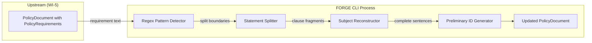
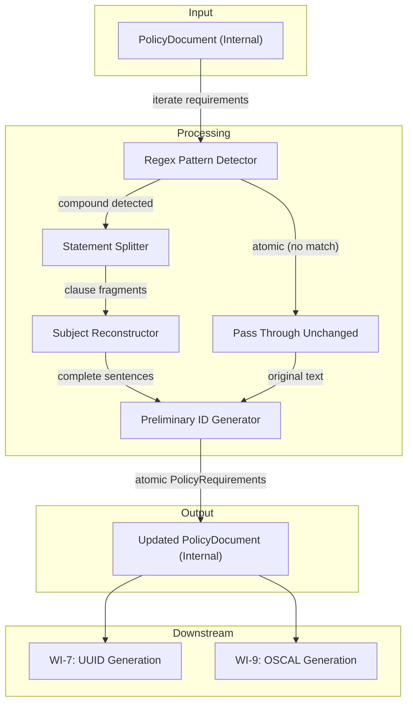
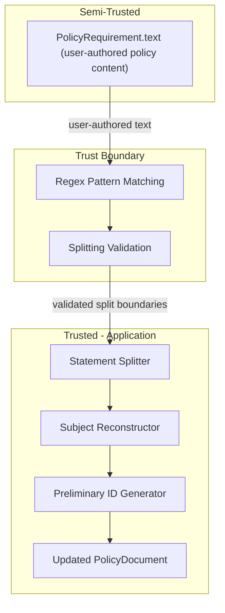

# 006-sec-requirement-atomization

> **Document Type:** Security Review (Lightweight)
> **Audience:** LLM agents, human reviewers
> **Status:** Draft
> **Last Updated:** 2026-02-11 <!-- @auto -->
> **Reviewer:** Brian Luby <!-- @human-required -->
> **Risk Level:** Low-Medium <!-- @human-required -->

---

## Review Tier Legend

| Marker | Tier | Speckit Behavior |
|--------|------|------------------|
| 🔴 `@human-required` | Human Generated | Prompt human to author; blocks until complete |
| 🟡 `@human-review` | LLM + Human Review | LLM drafts → prompt human to confirm/edit; blocks until confirmed |
| 🟢 `@llm-autonomous` | LLM Autonomous | LLM completes; no prompt; logged for audit |
| ⚪ `@auto` | Auto-generated | System fills (timestamps, links); no prompt |

---

## Severity Definitions

| Level | Label | Definition |
|-------|-------|------------|
| 🔴 | **Critical** | Immediate exploitation risk; data breach or system compromise likely |
| 🟠 | **High** | Significant risk; exploitation possible with moderate effort |
| 🟡 | **Medium** | Notable risk; exploitation requires specific conditions |
| 🟢 | **Low** | Minor risk; limited impact or unlikely exploitation |

---

## Linkage ⚪ `@auto`

| Document | ID | Relationship |
|----------|-----|--------------|
| Parent PRD | [006-prd-requirement-atomization.md](../PRD/006-prd-requirement-atomization.md) | Feature being reviewed |
| Architecture Review | [006-ar-requirement-atomization.md](../AR/006-ar-requirement-atomization.md) | Technical implementation |

---

## Purpose

This is a **lightweight security review** intended to catch obvious security concerns early in the product lifecycle. It is NOT a comprehensive threat model. Full threat modeling should occur during implementation when infrastructure-as-code and concrete implementations exist.

**This review answers three questions:**
1. What does this feature expose to attackers?
2. What data does it touch, and how sensitive is that data?
3. What's the impact if something goes wrong?

**Scope of this review:**
- ✅ Attack surface identification
- ✅ Data classification
- ✅ High-level CIA assessment
- ❌ Detailed threat enumeration (deferred to implementation)
- ❌ Penetration testing (deferred to implementation)
- ❌ Compliance audit (separate process)

---

## Feature Security Summary

### One-line Summary 🔴 `@human-required`
> Requirement atomization uses regex-based heuristic splitting to decompose compound policy statements into individual atomic requirements -- the primary security concerns are ReDoS vulnerability from crafted input text, output cardinality explosion (one input producing thousands of atomic requirements), and correctness of the splitting heuristic.

### Risk Assessment 🔴 `@human-required`
> **Risk Level:** Low-Medium
> **Justification:** This feature introduces regex-based pattern matching on user-authored policy text, creating a potential ReDoS attack surface. However, the risk is mitigated by the fact that (a) input is from local files processed by the same user, (b) the `regex` crate has built-in protection against catastrophic backtracking, and (c) the patterns used are simple bounded patterns without problematic constructs. The output cardinality risk is bounded by the document size.

---

## Attack Surface Analysis

### Exposure Points 🟡 `@human-review`

| Exposure Type | Details | Authentication | Authorization | Notes |
|---------------|---------|----------------|---------------|-------|
| User Input Field | Policy requirement text (from local Markdown file) processed by regex | N/A — local CLI | N/A — local CLI | Text originates from user's local file, already ingested by WI-2 |

### Attack Surface Diagram 🟢 `@llm-autonomous`

### Exposure Checklist 🟢 `@llm-autonomous`

- [x] **No internet-facing endpoints** — local CLI tool, no network
- [x] **No direct user input at this stage** — text comes from already-ingested policy documents
- [x] **No file I/O** — operates on in-memory domain model
- [x] **No rate limiting needed** — local CLI tool
- [x] **No CORS, webhooks, or admin endpoints** — no HTTP at all

---

## Data Flow Analysis

### Data Inventory 🟡 `@human-review`

| Data Element | PRD Entity | Classification | Source | Destination | Retention | Encrypted Rest | Encrypted Transit | Residency |
|--------------|------------|----------------|--------|-------------|-----------|----------------|-------------------|-----------|
| Requirement text | PolicyRequirement.text | Internal | Domain model (WI-5) | Regex pattern matcher | Process lifetime | N/A — in-memory | N/A — local | Local |
| Atomic requirement text | PolicyRequirement.text (split) | Internal | Computed by splitter | Updated domain model | Process lifetime | N/A — in-memory | N/A — local | Local |
| Preliminary IDs | PolicyRequirement.stable_id | Internal | Content-based hash | Updated domain model | Process lifetime | N/A — in-memory | N/A — local | Local |
| Source line numbers | PolicyRequirement.source_line | Public | Propagated from parent | Updated domain model | Process lifetime | N/A — in-memory | N/A — local | Local |
| Original compound text | AtomizationResult.original_text | Internal | Original requirement | In-memory result | Process lifetime | N/A — in-memory | N/A — local | Local |

### Data Classification Reference 🟢 `@llm-autonomous`

| Level | Label | Description | Examples | Handling Requirements |
|-------|-------|-------------|----------|----------------------|
| 1 | **Public** | No impact if disclosed | Marketing content, public docs | No special handling |
| 2 | **Internal** | Minor impact if disclosed | Internal configs, non-sensitive logs | Access controls, no public exposure |
| 3 | **Confidential** | Significant impact if disclosed | PII, user data, credentials | Encryption, audit logging, access controls |
| 4 | **Restricted** | Severe impact if disclosed | Payment data, health records, secrets | Encryption, strict access, compliance requirements |

### Data Flow Diagram 🟢 `@llm-autonomous`

### Data Handling Checklist 🟢 `@llm-autonomous`

- [x] **No Restricted data stored** — policy requirement text is Internal classification
- [x] **No encryption needed** — in-memory processing only, local CLI
- [x] **No data in transit** — no network communication
- [x] **No PII processed** — policy requirement text from documents
- [x] **No secrets involved** — no credentials or tokens
- [x] **Data minimization applied** — only requirement text is processed by the regex

---

## Third-Party & Supply Chain 🟡 `@human-review`

### New External Services

| Service | Purpose | Data Shared | Communication | Approved? |
|---------|---------|-------------|---------------|-----------|
| **None** | No external services | — | — | — |

### New Libraries/Dependencies

| Library | Version | License | Purpose | Security Check |
|---------|---------|---------|---------|----------------|
| regex | latest stable | MIT/Apache-2.0 | Regex pattern matching for conjunction + normative verb detection | ✅ Approved — Rust's standard regex crate; has built-in protections against catastrophic backtracking; no unsafe code in pattern matching |

### Supply Chain Checklist

- [x] **No new services**
- [x] **Dependencies have acceptable licenses** (MIT, Apache-2.0)
- [x] **regex crate is the standard** regex library in Rust; actively maintained with security-conscious design
- [x] **regex crate has built-in ReDoS protections** — uses a finite automaton approach that guarantees linear-time matching
- [x] **No known critical vulnerabilities** in dependency versions (verify with `cargo audit`)

---

## CIA Impact Assessment

If this feature is compromised, what's the impact?

### Confidentiality 🟡 `@human-review`

> **What could be disclosed?**

| Asset at Risk | Classification | Exposure Scenario | Impact | Likelihood |
|---------------|----------------|-------------------|--------|------------|
| Policy requirement text | Internal | Requirement text appears in atomization debug/warning output | Low | Low |

**Confidentiality Risk Level:** Low

### Integrity 🟡 `@human-review`

> **What could be modified or corrupted?**

| Asset at Risk | Modification Scenario | Impact | Likelihood |
|---------------|----------------------|--------|------------|
| Atomic requirement text | Incorrect splitting produces malformed requirements (e.g., missing subject, broken sentence) | Medium | Medium |
| Requirement count | False splits inflate the requirement count; missed splits leave compound requirements intact | Medium | Low |
| Preliminary IDs | Non-deterministic ID generation breaks downstream UUID stability | Medium | Low |

**Integrity Risk Level:** Medium

### Availability 🟡 `@human-review`

> **What could be disrupted?**

| Service/Function | Disruption Scenario | Impact | Likelihood |
|------------------|---------------------|--------|------------|
| CLI process | ReDoS: crafted policy text causes regex to consume excessive CPU time | Low | Low |
| CLI process | Output cardinality explosion: pathological input with many conjunction+verb pairs produces thousands of atomic requirements from a single statement | Low | Low |
| CLI process | Memory exhaustion from cardinality explosion | Low | Low |

**Availability Risk Level:** Low

### CIA Summary 🟢 `@llm-autonomous`

| Dimension | Risk Level | Primary Concern | Mitigation Priority |
|-----------|------------|-----------------|---------------------|
| **Confidentiality** | Low | Policy text in debug output | Low |
| **Integrity** | Medium | Correct splitting and subject reconstruction | High |
| **Availability** | Low | ReDoS and cardinality explosion from regex processing | Medium |

**Overall CIA Risk:** Low-Medium — *The primary concern is integrity: ensuring the regex-based splitter correctly decomposes compound statements without corrupting text or losing context. Availability risk from ReDoS is mitigated by the Rust `regex` crate's linear-time guarantee. Confidentiality risk is minimal as this is a local CLI tool processing the user's own files.*

---

## Trust Boundaries 🟡 `@human-review`

Where does trust change in this feature?

Note: While the content has been validated as UTF-8 by WI-2 and structurally extracted by WI-3/WI-4, the policy requirement text itself is user-authored natural language. The regex operates directly on this user-authored content, making it the point where user-controlled data meets pattern matching logic. The Rust `regex` crate's linear-time guarantee provides the primary security boundary against adversarial input.

### Trust Boundary Checklist 🟢 `@llm-autonomous`

- [x] **User-authored text is processed by bounded regex** — Rust `regex` crate guarantees linear-time matching
- [x] **No external API responses to validate** — no network communication
- [x] **No authorization checks needed** — internal processing
- [x] **Conservative splitting approach** — when in doubt, do not split (per product principle P-1)

---

## Known Risks & Mitigations 🟡 `@human-review`

| ID | Risk Description | Severity | Mitigation | Status | Owner |
|----|------------------|----------|------------|--------|-------|
| R1 | **ReDoS from crafted input**: Regex patterns matching against user-authored policy text could theoretically cause catastrophic backtracking on adversarial input | Low | The Rust `regex` crate uses a finite automaton approach that guarantees linear-time matching (O(n) in input length), unlike backtracking regex engines in Python/JavaScript/Java. The specific pattern `\b(and\|or)\s+(must\|shall\|should\|will)\b` is simple and does not contain problematic constructs (no nested quantifiers, no backreferences). Additionally, test with adversarial long input strings per PRD technical verification. | Mitigated | Brian Luby |
| R2 | **Output cardinality explosion**: A pathological input like "must X and must Y and must Z and ... (repeated 1000 times)" could produce thousands of atomic requirements from a single input requirement | Low | Bounded by upstream file size limits from WI-2. A single policy requirement extracted from a list item is typically 1-3 sentences. Even a deliberately crafted long statement in a <1MB document would produce at most hundreds of splits, each a small string. Consider adding a maximum split count per requirement (e.g., 50) as a safety bound. | Open | Brian Luby |
| R3 | **Incorrect splitting corrupts requirement text**: The splitter could produce malformed sentences when the shared subject reconstruction heuristic fails on unusual sentence structures | Medium | Conservative splitting: only split when a normative verb follows a conjunction (PRD M-1). The AR specifies that ambiguous patterns are preserved as-is. Comprehensive test fixtures cover compound and atomic patterns per AR-006 testing strategy. Subject reconstruction is tested with diverse fixtures. | Mitigated | Brian Luby |
| R4 | **Crafted unicode input**: Policy text with unusual unicode characters (zero-width spaces, bidirectional override characters) could affect regex matching or produce visually misleading output | Low | The Rust `regex` crate handles Unicode correctly by default. The `\b` word boundary in the pattern respects Unicode word boundaries. Zero-width characters would not match "and"/"or"/"must"/"shall" patterns. This is a theoretical concern with very low practical likelihood in policy documents. | Mitigated | Brian Luby |
| R5 | **Non-deterministic output**: If the atomizer processes requirements in a non-deterministic order (e.g., due to parallel processing), preliminary IDs would differ across runs | Low | The AR specifies sequential processing in document order. The atomizer is a pure function with no side effects, no threading, and no randomness. Preliminary IDs are computed from content hash + source line + atom index, all of which are deterministic. | Mitigated | Brian Luby |

### Risk Acceptance 🔴 `@human-required`

No risks require acceptance — all identified risks are either mitigated or open with low severity.

| Risk ID | Accepted By | Date | Justification | Review Date |
|---------|-------------|------|---------------|-------------|
| — | — | — | No risks require acceptance | — |

---

## Security Requirements 🟡 `@human-review`

Based on this review, the implementation MUST satisfy:

### Input Validation

| Req ID | Requirement | PRD AC | Verification Method |
|--------|-------------|--------|---------------------|
| SEC-1 | The regex pattern must use the Rust `regex` crate (which guarantees linear-time matching), not a backtracking regex engine | — | Code Review |
| SEC-2 | The regex pattern must not contain problematic constructs (nested quantifiers, backreferences, unbounded repetition with overlap) | — | Code Review |
| SEC-3 | Empty or whitespace-only requirement text must pass through without error | EC-7 | Unit Test |
| SEC-4 | Regex patterns must be tested against adversarial input (long repetitive strings, unicode edge cases) to verify no performance degradation | — | Unit Test |

### Resource Limits

| Req ID | Requirement | PRD AC | Verification Method |
|--------|-------------|--------|---------------------|
| SEC-5 | Consider implementing a maximum split count per requirement (e.g., 50 atomic requirements from a single compound statement) to bound output cardinality | — | Unit Test |
| SEC-6 | The atomizer must be O(n * m) where n = number of requirements and m = average text length, ensuring predictable performance | — | Code Review |

### Determinism

| Req ID | Requirement | PRD AC | Verification Method |
|--------|-------------|--------|---------------------|
| SEC-7 | The atomizer must be a pure function: no side effects, no global state, no threading | AC-6 | Code Review |
| SEC-8 | Preliminary IDs must be deterministic: same input text + source line + atom index must always produce the same ID | AC-5, AC-6 | Unit Test |

### Safe Processing

| Req ID | Requirement | PRD AC | Verification Method |
|--------|-------------|--------|---------------------|
| SEC-9 | Atomic (non-compound) statements must pass through completely unchanged — no text modification | AC-3, AC-4 | Unit Test |
| SEC-10 | The regex pattern must be compiled once (lazy_static or equivalent), not recompiled per requirement | — | Code Review |

---

## Compliance Considerations 🟡 `@human-review`

| Regulation | Applicable? | Relevant Requirements | N/A Justification |
|------------|-------------|----------------------|-------------------|
| GDPR | N/A | — | Local CLI tool; no PII processing; no data collection or transmission |
| CCPA | N/A | — | Local CLI tool; no personal information processing |
| SOC 2 | N/A | — | Local CLI tool; no service operations |
| HIPAA | N/A | — | Local CLI tool; no health data processing |
| PCI-DSS | N/A | — | Local CLI tool; no payment data processing |
| Other | N/A | — | No regulatory requirements apply to local in-memory text splitting of policy documents |

---

## Review Findings

### Issues Identified 🟡 `@human-review`

| ID | Finding | Severity | Category | Recommendation | Status |
|----|---------|----------|----------|----------------|--------|
| F1 | No maximum split count per requirement to bound output cardinality | Low | Availability | Add a configurable maximum split count (default: 50) per requirement. If a single requirement would produce more than 50 atomic parts, preserve it as-is and log a warning. | Open |
| F2 | Regex pattern should be validated for ReDoS resistance during code review | Low | Availability | The Rust `regex` crate provides linear-time guarantees, but the specific pattern should be reviewed to confirm no problematic constructs. Add unit tests with adversarial input (10KB+ repetitive strings). | Open |

### Positive Observations 🟢 `@llm-autonomous`

- The Rust `regex` crate uses a finite automaton approach that guarantees O(n) matching time, eliminating the catastrophic backtracking vulnerability found in Python, JavaScript, and Java regex engines
- The architecture chose regex-based heuristics over NLP/ML (AR-006 Option 2 rejected), ensuring deterministic and auditable output per product principle P-3
- Conservative splitting (only split on conjunction + normative verb patterns) minimizes false positives, per product principle P-1 (Correctness over convenience)
- The atomizer is designed as a pure function with no side effects, ensuring deterministic behavior
- The preliminary ID generation uses content-based hashing, providing deterministic IDs without introducing randomness
- The regex pattern `\b(and|or)\s+(must|shall|should|will)\b` is simple and bounded — no nested quantifiers, no backreferences, no problematic constructs

---

## Open Questions 🟡 `@human-review`

- [ ] **Q1:** Should the maximum split count per requirement be configurable via CLI flag or hardcoded? (Recommendation: hardcoded default of 50, with a compile-time constant that can be changed in future releases)

---

## Changelog ⚪ `@auto`

| Version | Date | Author | Changes |
|---------|------|--------|---------|
| 0.1 | 2026-02-11 | LLM (Claude) | Initial review |

---

## Review Sign-off 🔴 `@human-required`

| Role | Name | Date | Decision |
|------|------|------|----------|
| Security Reviewer | Brian Luby | YYYY-MM-DD | [Approved / Approved with conditions / Rejected] |
| Feature Owner | Brian Luby | YYYY-MM-DD | [Acknowledged] |

### Conditions for Approval (if applicable) 🔴 `@human-required`

- [ ] Add adversarial input tests for the regex pattern (F2) — verify linear-time behavior with 10KB+ repetitive strings
- [ ] Consider adding maximum split count per requirement (F1) — low priority

---

## Security Requirements Traceability 🟢 `@llm-autonomous`

| SEC Req ID | PRD Req ID | PRD AC ID | Test Type | Test Location |
|------------|------------|-----------|-----------|---------------|
| SEC-1 | — | — | Code Review | src/parse/atomize.rs |
| SEC-2 | — | — | Code Review | src/parse/atomize.rs |
| SEC-3 | M-3 | EC-7 | Unit | tests/atomize_test.rs |
| SEC-4 | — | — | Unit | tests/atomize_test.rs |
| SEC-5 | — | — | Unit | tests/atomize_test.rs |
| SEC-6 | — | — | Code Review | src/parse/atomize.rs |
| SEC-7 | M-4 | AC-6 | Code Review | src/parse/atomize.rs |
| SEC-8 | M-4 | AC-5, AC-6 | Unit | tests/atomize_test.rs |
| SEC-9 | M-3 | AC-3, AC-4 | Unit | tests/atomize_test.rs |
| SEC-10 | — | — | Code Review | src/parse/atomize.rs |

---

## Review Checklist 🟢 `@llm-autonomous`

Before marking as Approved:
- [x] Attack surface documented with auth/authz status for each exposure
- [x] Exposure Points table has no contradictory rows (None vs. actual endpoints)
- [x] All PRD Data Model entities appear in Data Inventory
- [x] All data elements are classified using the 4-tier model
- [x] Third-party dependencies and services are listed
- [x] CIA impact is assessed with Low/Medium/High ratings
- [x] Trust boundaries are identified
- [x] Security requirements have verification methods specified
- [x] Security requirements trace to PRD ACs where applicable
- [x] No Critical/High findings remain Open
- [x] Compliance N/A items have justification
- [x] Risk acceptance has named approver and review date
