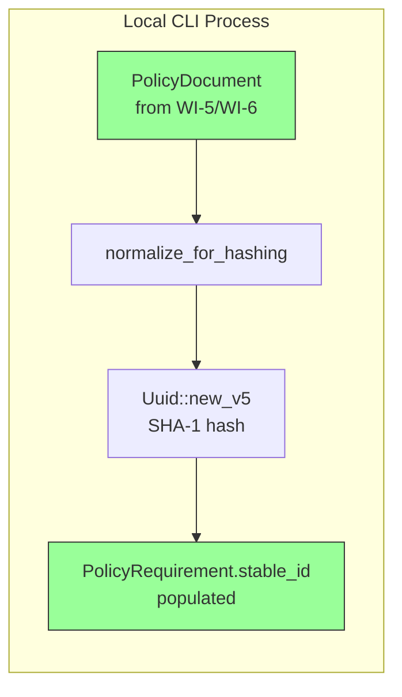
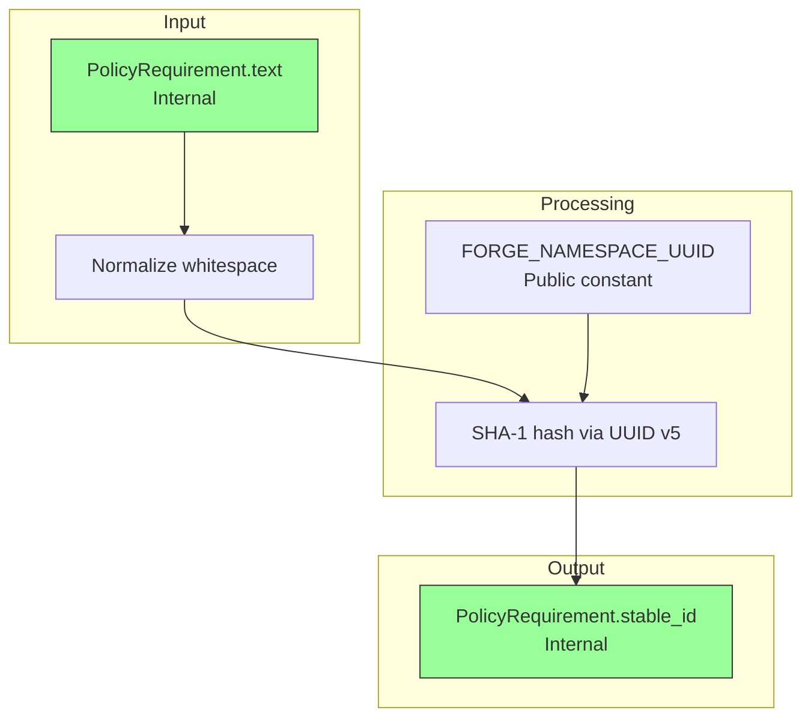
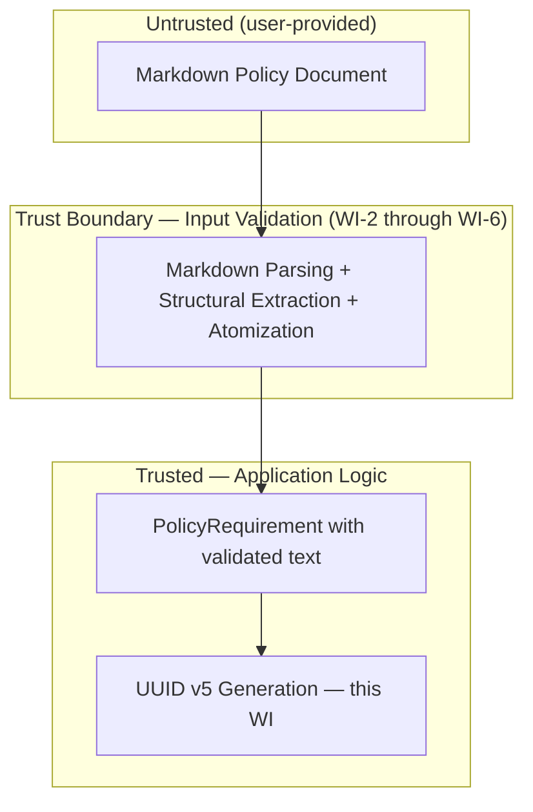

# 007-sec-uuid-generation

> **Document Type:** Security Review (Lightweight)
> **Audience:** LLM agents, human reviewers
> **Status:** Draft
> **Last Updated:** 2026-02-11 <!-- @auto -->
> **Reviewer:** Brian Luby <!-- @human-required -->
> **Risk Level:** Low <!-- @human-required -->

---

## Review Tier Legend

| Marker | Tier | Speckit Behavior |
|--------|------|------------------|
| 🔴 `@human-required` | Human Generated | Prompt human to author; blocks until complete |
| 🟡 `@human-review` | LLM + Human Review | LLM drafts → prompt human to confirm/edit; blocks until confirmed |
| 🟢 `@llm-autonomous` | LLM Autonomous | LLM completes; no prompt; logged for audit |
| ⚪ `@auto` | Auto-generated | System fills (timestamps, links); no prompt |

---

## Severity Definitions

| Level | Label | Definition |
|-------|-------|------------|
| 🔴 | **Critical** | Immediate exploitation risk; data breach or system compromise likely |
| 🟠 | **High** | Significant risk; exploitation possible with moderate effort |
| 🟡 | **Medium** | Notable risk; exploitation requires specific conditions |
| 🟢 | **Low** | Minor risk; limited impact or unlikely exploitation |

---

## Linkage ⚪ `@auto`

| Document | ID | Relationship |
|----------|-----|--------------|
| Parent PRD | [007-prd-uuid-generation.md](../PRD/007-prd-uuid-generation.md) | Feature being reviewed |
| Architecture Review | [007-ar-uuid-generation.md](../AR/007-ar-uuid-generation.md) | Technical implementation |

---

## Purpose

This is a **lightweight security review** intended to catch obvious security concerns early in the product lifecycle. It is NOT a comprehensive threat model. Full threat modeling should occur during implementation when infrastructure-as-code and concrete implementations exist.

**This review answers three questions:**
1. What does this feature expose to attackers?
2. What data does it touch, and how sensitive is that data?
3. What's the impact if something goes wrong?

**Scope of this review:**
- ✅ Attack surface identification
- ✅ Data classification
- ✅ High-level CIA assessment
- ❌ Detailed threat enumeration (deferred to implementation)
- ❌ Penetration testing (deferred to implementation)
- ❌ Compliance audit (separate process)

---

## Feature Security Summary

### One-line Summary 🔴 `@human-required`
> Deterministic UUID v5 generation from policy requirement text using a fixed namespace UUID and SHA-1 hashing — a pure, local computation with no network, auth, or external input beyond the already-parsed domain model.

### Risk Assessment 🔴 `@human-required`
> **Risk Level:** Low
> **Justification:** Pure local computation with no network I/O, no authentication, no user-facing endpoints, and no PII; the primary concern is identifier predictability, which is acceptable for a content-addressing scheme in a local CLI tool.

---

## Attack Surface Analysis

### Exposure Points 🟡 `@human-review`

| Exposure Type | Details | Authentication | Authorization | Notes |
|---------------|---------|----------------|---------------|-------|
| **None** | **Feature has no external exposure** | — | — | Pure in-memory computation on already-parsed domain model data; no network endpoints, no file uploads, no user input fields |

### Attack Surface Diagram 🟢 `@llm-autonomous`

### Exposure Checklist 🟢 `@llm-autonomous`

All items are N/A for this feature — it is a local CLI tool with no internet-facing endpoints, no file uploads, no webhooks, and no external event processing.

- [x] **No internet-facing endpoints** — local CLI, pure computation
- [x] **No sensitive data in URL parameters** — N/A, no URLs
- [x] **No file uploads** — N/A
- [x] **No public endpoints requiring rate limiting** — N/A
- [x] **No CORS configuration** — N/A
- [x] **No debug/admin endpoints** — N/A
- [x] **No webhooks** — N/A

---

## Data Flow Analysis

### Data Inventory 🟡 `@human-review`

| Data Element | PRD Entity | Classification | Source | Destination | Retention | Encrypted Rest | Encrypted Transit | Residency |
|--------------|------------|----------------|--------|-------------|-----------|----------------|-------------------|-----------|
| Policy requirement text | PolicyRequirement.text | Internal | Parsed Markdown (WI-5/WI-6) | In-memory processing | None (transient) | N/A | N/A | Local |
| Normalized requirement text | Intermediate string | Internal | normalize_for_hashing output | UUID v5 hash input | None (transient) | N/A | N/A | Local |
| Generated UUID v5 | PolicyRequirement.stable_id | Internal | SHA-1 hash of namespace + text | PolicyRequirement struct | None (in-memory) | N/A | N/A | Local |
| FORGE namespace UUID | FORGE_NAMESPACE_UUID constant | Public | Hardcoded in source | UUID v5 generation | Permanent (source code) | N/A | N/A | Local |

### Data Classification Reference 🟢 `@llm-autonomous`

| Level | Label | Description | Examples | Handling Requirements |
|-------|-------|-------------|----------|----------------------|
| 1 | **Public** | No impact if disclosed | Marketing content, public docs | No special handling |
| 2 | **Internal** | Minor impact if disclosed | Internal configs, non-sensitive logs | Access controls, no public exposure |
| 3 | **Confidential** | Significant impact if disclosed | PII, user data, credentials | Encryption, audit logging, access controls |
| 4 | **Restricted** | Severe impact if disclosed | Payment data, health records, secrets | Encryption, strict access, compliance requirements |

### Data Flow Diagram 🟢 `@llm-autonomous`

### Data Handling Checklist 🟢 `@llm-autonomous`

- [x] **No Restricted data stored** — only Internal classification data (policy text, UUIDs)
- [x] **No Confidential data at rest** — N/A, no persistence
- [x] **No data in transit** — N/A, no network communication
- [x] **No PII** — policy requirement text is organizational, not personal
- [x] **Logs do not contain Confidential/Restricted data** — debug logging of UUIDs is Internal only
- [x] **No secrets hardcoded** — FORGE_NAMESPACE_UUID is a public constant, not a secret
- [x] **Data minimization applied** — only requirement text is processed; no additional data collected

---

## Third-Party & Supply Chain 🟡 `@human-review`

### New External Services

N/A — no external services introduced. This feature is a pure local computation.

### New Libraries/Dependencies

| Library | Version | License | Purpose | Security Check |
|---------|---------|---------|---------|----------------|
| `uuid` | Latest stable | MIT/Apache-2.0 | UUID v5 generation (SHA-1 hash of namespace + name) | ✅ Approved — standard Rust UUID crate, widely used, well-audited |

### Supply Chain Checklist

- [x] **No new external services**
- [x] **Dependencies have acceptable licenses** — `uuid` crate is MIT/Apache-2.0
- [x] **Dependencies are actively maintained** — `uuid` is a tier-1 Rust ecosystem crate with frequent releases
- [x] **No known critical vulnerabilities** — checked via `cargo audit`

---

## CIA Impact Assessment

If this feature is compromised, what's the impact?

### Confidentiality 🟡 `@human-review`

> **What could be disclosed?**

| Asset at Risk | Classification | Exposure Scenario | Impact | Likelihood |
|---------------|----------------|-------------------|--------|------------|
| Policy requirement text | Internal | UUID v5 is a one-way hash; original text cannot be recovered from the UUID | Low | Very Low |
| FORGE namespace UUID | Public | Namespace UUID is a compile-time constant in open-source code; not a secret | None | N/A |

**Confidentiality Risk Level:** Low

### Integrity 🟡 `@human-review`

> **What could be modified or corrupted?**

| Asset at Risk | Modification Scenario | Impact | Likelihood |
|---------------|----------------------|--------|------------|
| Generated stable_id values | An attacker who controls the policy document input could craft requirement text to produce a specific UUID v5 (predictable from input). Since UUID v5 is deterministic, knowing the namespace UUID and target text allows computing the resulting UUID. | Low | Low |
| FORGE_NAMESPACE_UUID constant | If the namespace UUID were changed (source code modification), all previously generated stable_ids would become invalid, breaking traceability | Medium | Very Low |
| OSCAL document integrity | Incorrect UUIDs could produce misleading OSCAL artifacts where controls appear to be the same or different when they are not | Medium | Low |

**Integrity Risk Level:** Low

### Availability 🟡 `@human-review`

> **What could be disrupted?**

| Service/Function | Disruption Scenario | Impact | Likelihood |
|------------------|---------------------|--------|------------|
| UUID generation | Computationally negligible — SHA-1 hash of short strings completes in microseconds; no resource exhaustion vector | Low | Very Low |
| Pipeline processing | If `assign_stable_ids` fails, downstream OSCAL generation (WI-9+) cannot proceed | Medium | Very Low |

**Availability Risk Level:** Low

### CIA Summary 🟢 `@llm-autonomous`

| Dimension | Risk Level | Primary Concern | Mitigation Priority |
|-----------|------------|-----------------|---------------------|
| **Confidentiality** | Low | UUID v5 is one-way; namespace UUID is public constant | Low |
| **Integrity** | Low | Predictable UUIDs from known input; namespace immutability | Medium |
| **Availability** | Low | No resource exhaustion vector; pure computation | Low |

**Overall CIA Risk:** Low — *Pure local computation with no network exposure; integrity is the primary concern but mitigated by the tool's local-only nature and content-addressing design.*

---

## Trust Boundaries 🟡 `@human-review`

### Trust Boundary Checklist 🟢 `@llm-autonomous`

- [x] **All input from untrusted sources is validated** — requirement text is already parsed and validated by WI-2 through WI-6 before UUID generation
- [x] **External API responses are validated** — N/A, no external APIs
- [x] **Authorization checked at data access** — N/A, no authorization model
- [x] **Service-to-service calls are authenticated** — N/A, no service calls

---

## Known Risks & Mitigations 🟡 `@human-review`

| ID | Risk Description | Severity | Mitigation | Status | Owner |
|----|------------------|----------|------------|--------|-------|
| R1 | UUID v5 predictability: given the public namespace UUID and known requirement text, anyone can compute the resulting stable_id | Low | Acceptable for local CLI tool; UUIDs are identifiers, not secrets. No security decisions depend on UUID unpredictability. | Accepted | Brian Luby |
| R2 | SHA-1 collision: two different requirement texts could theoretically produce the same UUID v5 | Low | SHA-1 collision probability is negligible at policy document scale (hundreds of requirements). If a collision is ever observed, it would be a data integrity issue, not a security vulnerability. | Accepted | Brian Luby |
| R3 | Namespace UUID change invalidates all previously generated stable_ids | Low | Namespace UUID is a compile-time constant with a prominent WARNING comment. Any change is a documented breaking change requiring a migration path. | Mitigated | Brian Luby |

### Risk Acceptance 🔴 `@human-required`

| Risk ID | Accepted By | Date | Justification | Review Date |
|---------|-------------|------|---------------|-------------|
| R1 | Brian Luby | 2026-02-11 | UUIDs are content-addressing identifiers for a local CLI tool, not security tokens; predictability is by design | 2026-08-11 |
| R2 | Brian Luby | 2026-02-11 | SHA-1 collision probability is negligible at the scale of policy documents (hundreds, not billions of inputs) | 2026-08-11 |

---

## Security Requirements 🟡 `@human-review`

### Authentication & Authorization

N/A — FORGE is a local CLI tool with no authentication or authorization model.

### Data Protection

N/A — No persistent data storage. All processing is in-memory and transient.

### Input Validation

| Req ID | Requirement | PRD AC | Verification Method |
|--------|-------------|--------|---------------------|
| SEC-1 | UUID generation must handle empty requirement text without panicking (produce a valid UUID v5 of empty string) | AC-1, EC-1 | Unit Test |
| SEC-2 | Whitespace normalization must handle adversarial whitespace patterns (Unicode whitespace, mixed tabs/newlines) without panicking or producing unexpected results | AC-2, EC-2, EC-3 | Unit Test |

### Operational Security

| Req ID | Requirement | PRD AC | Verification Method |
|--------|-------------|--------|---------------------|
| SEC-3 | FORGE_NAMESPACE_UUID must not be configurable at runtime to prevent accidental or malicious namespace changes | S-1 | Code Review |
| SEC-4 | UUID generation function must be pure (no side effects, no I/O) to ensure auditability | M-4 | Code Review |

---

## Compliance Considerations 🟡 `@human-review`

| Regulation | Applicable? | Relevant Requirements | N/A Justification |
|------------|-------------|----------------------|-------------------|
| GDPR | N/A | — | No PII processed; policy requirement text is organizational, not personal data |
| CCPA | N/A | — | No consumer personal information collected or processed |
| SOC 2 | N/A | — | Local CLI tool; no hosted service or data storage |
| HIPAA | N/A | — | No protected health information |
| PCI-DSS | N/A | — | No payment data |
| Other | N/A | — | No applicable regulations for a local developer tool processing policy documents |

---

## Review Findings

### Issues Identified 🟡 `@human-review`

| ID | Finding | Severity | Category | Recommendation | Status |
|----|---------|----------|----------|----------------|--------|
| F1 | UUID v5 uses SHA-1 which is cryptographically broken for collision resistance | Low | CIA/Integrity | Acceptable for content-addressing; document that SHA-1 is not used for security purposes. No action required. | Resolved |

### Positive Observations 🟢 `@llm-autonomous`

- Pure function design with no side effects ensures the UUID generation logic is trivially auditable and testable
- No network I/O eliminates an entire class of attack vectors (SSRF, data exfiltration, MitM)
- Whitespace normalization using Rust's `split_whitespace()` handles Unicode safely without custom parsing
- Fixed namespace UUID as a compile-time constant prevents runtime manipulation
- Content-based deterministic IDs (UUID v5) are more robust than random IDs for traceability and auditability

---

## Open Questions 🟡 `@human-review`

No open security questions for this work item.

---

## Changelog ⚪ `@auto`

| Version | Date | Author | Changes |
|---------|------|--------|---------|
| 0.1 | 2026-02-11 | LLM (Claude) | Initial security review |

---

## Review Sign-off 🔴 `@human-required`

| Role | Name | Date | Decision |
|------|------|------|----------|
| Security Reviewer | Brian Luby | YYYY-MM-DD | [Approved / Approved with conditions / Rejected] |
| Feature Owner | Brian Luby | YYYY-MM-DD | [Acknowledged] |

### Conditions for Approval (if applicable) 🔴 `@human-required`

None — no conditions required for this low-risk feature.

---

## Security Requirements Traceability 🟢 `@llm-autonomous`

| SEC Req ID | PRD Req ID | PRD AC ID | Test Type | Test Location |
|------------|------------|-----------|-----------|---------------|
| SEC-1 | M-1 | AC-1, EC-1 | Unit | src/uuid.rs (#[cfg(test)] mod tests) |
| SEC-2 | M-2 | AC-2, EC-2, EC-3 | Unit | src/uuid.rs (#[cfg(test)] mod tests) |
| SEC-3 | S-1 | — | Code Review | src/uuid.rs (compile-time constant) |
| SEC-4 | M-4 | AC-1 | Code Review | src/uuid.rs (pure function) |

---

## Review Checklist 🟢 `@llm-autonomous`

Before marking as Approved:
- [x] Attack surface documented — no external exposure
- [x] Exposure Points table has no contradictory rows — only "None" row present
- [x] All PRD Data Model entities appear in Data Inventory
- [x] All data elements are classified using the 4-tier model
- [x] Third-party dependencies and services are listed
- [x] CIA impact is assessed with Low/Medium/High ratings
- [x] Trust boundaries are identified
- [x] Security requirements have verification methods specified
- [x] Security requirements trace to PRD ACs where applicable
- [x] No Critical/High findings remain Open
- [x] Compliance N/A items have justification
- [x] Risk acceptance has named approver and review date
