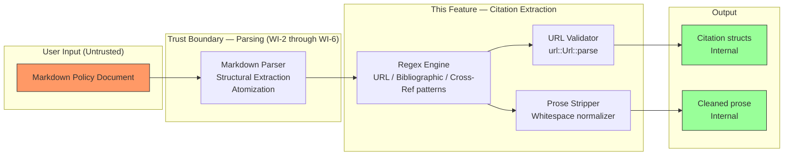
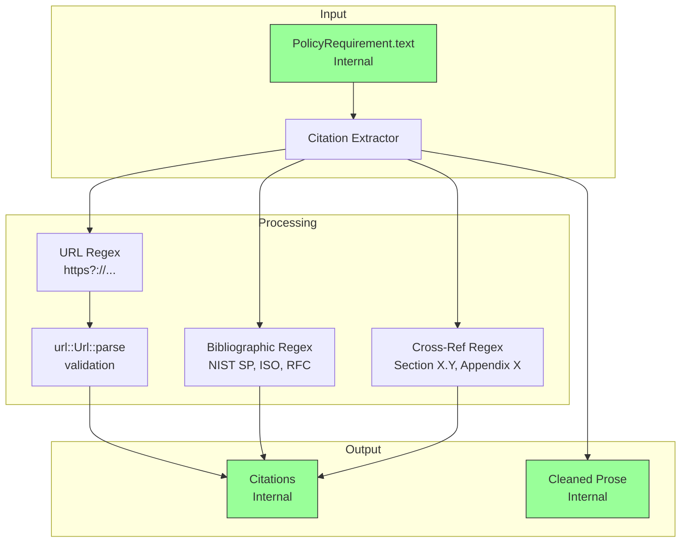
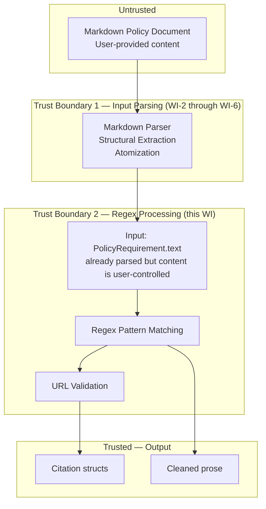

# 008-sec-citation-extraction

> **Document Type:** Security Review (Lightweight)
> **Audience:** LLM agents, human reviewers
> **Status:** Draft
> **Last Updated:** 2026-02-11 <!-- @auto -->
> **Reviewer:** Brian Luby <!-- @human-required -->
> **Risk Level:** Medium <!-- @human-required -->

---

## Review Tier Legend

| Marker | Tier | Speckit Behavior |
|--------|------|------------------|
| 🔴 `@human-required` | Human Generated | Prompt human to author; blocks until complete |
| 🟡 `@human-review` | LLM + Human Review | LLM drafts → prompt human to confirm/edit; blocks until confirmed |
| 🟢 `@llm-autonomous` | LLM Autonomous | LLM completes; no prompt; logged for audit |
| ⚪ `@auto` | Auto-generated | System fills (timestamps, links); no prompt |

---

## Severity Definitions

| Level | Label | Definition |
|-------|-------|------------|
| 🔴 | **Critical** | Immediate exploitation risk; data breach or system compromise likely |
| 🟠 | **High** | Significant risk; exploitation possible with moderate effort |
| 🟡 | **Medium** | Notable risk; exploitation requires specific conditions |
| 🟢 | **Low** | Minor risk; limited impact or unlikely exploitation |

---

## Linkage ⚪ `@auto`

| Document | ID | Relationship |
|----------|-----|--------------|
| Parent PRD | [008-prd-citation-extraction.md](../PRD/008-prd-citation-extraction.md) | Feature being reviewed |
| Architecture Review | [008-ar-citation-extraction.md](../AR/008-ar-citation-extraction.md) | Technical implementation |

---

## Purpose

This is a **lightweight security review** intended to catch obvious security concerns early in the product lifecycle. It is NOT a comprehensive threat model. Full threat modeling should occur during implementation when infrastructure-as-code and concrete implementations exist.

**This review answers three questions:**
1. What does this feature expose to attackers?
2. What data does it touch, and how sensitive is that data?
3. What's the impact if something goes wrong?

**Scope of this review:**
- ✅ Attack surface identification
- ✅ Data classification
- ✅ High-level CIA assessment
- ❌ Detailed threat enumeration (deferred to implementation)
- ❌ Penetration testing (deferred to implementation)
- ❌ Compliance audit (separate process)

---

## Feature Security Summary

### One-line Summary 🔴 `@human-required`
> Regex-based extraction of inline URLs, bibliographic references, and cross-references from policy requirement text — the primary security concern is Regular Expression Denial of Service (ReDoS) from crafted input patterns that could cause CPU exhaustion.

### Risk Assessment 🔴 `@human-required`
> **Risk Level:** Medium
> **Justification:** While this is a local CLI tool with no network exposure, the use of regex patterns on user-provided text introduces a ReDoS risk where pathologically crafted input strings could cause excessive CPU consumption. The impact is limited to local resource exhaustion (availability), not data breach or remote exploitation.

---

## Attack Surface Analysis

### Exposure Points 🟡 `@human-review`

| Exposure Type | Details | Authentication | Authorization | Notes |
|---------------|---------|----------------|---------------|-------|
| User Input Field | Policy document text processed by regex patterns | — | — | Input is user-provided Markdown; regex patterns applied to requirement text strings. Validation occurs at Markdown parsing layer (WI-2) but regex-specific input sanitization is not performed. |

### Attack Surface Diagram 🟢 `@llm-autonomous`

### Exposure Checklist 🟢 `@llm-autonomous`

- [x] **No internet-facing endpoints** — local CLI tool
- [x] **No sensitive data in URL parameters** — N/A, no URLs served
- [x] **No file uploads** — input is piped through the CLI; already handled by WI-2
- [x] **No public endpoints requiring rate limiting** — N/A
- [x] **No CORS configuration** — N/A
- [x] **No debug/admin endpoints** — N/A
- [x] **No webhooks** — N/A

---

## Data Flow Analysis

### Data Inventory 🟡 `@human-review`

| Data Element | PRD Entity | Classification | Source | Destination | Retention | Encrypted Rest | Encrypted Transit | Residency |
|--------------|------------|----------------|--------|-------------|-----------|----------------|-------------------|-----------|
| Policy requirement text | PolicyRequirement.text | Internal | Parsed Markdown (WI-5/WI-6) | Regex engine input | None (transient) | N/A | N/A | Local |
| Extracted URL strings | Citation.url | Internal | Regex match in requirement text | Citation struct | None (in-memory) | N/A | N/A | Local |
| Bibliographic reference text | Citation.text | Internal | Regex match in requirement text | Citation struct | None (in-memory) | N/A | N/A | Local |
| Cross-reference text | Citation.text | Internal | Regex match in requirement text | Citation struct | None (in-memory) | N/A | N/A | Local |
| Cleaned prose text | PolicyRequirement.text (updated) | Internal | Post-stripping normalization | PolicyRequirement struct | None (in-memory) | N/A | N/A | Local |
| URL validation result | Citation.validated | Internal | url::Url::parse result | Citation struct | None (in-memory) | N/A | N/A | Local |

### Data Classification Reference 🟢 `@llm-autonomous`

| Level | Label | Description | Examples | Handling Requirements |
|-------|-------|-------------|----------|----------------------|
| 1 | **Public** | No impact if disclosed | Marketing content, public docs | No special handling |
| 2 | **Internal** | Minor impact if disclosed | Internal configs, non-sensitive logs | Access controls, no public exposure |
| 3 | **Confidential** | Significant impact if disclosed | PII, user data, credentials | Encryption, audit logging, access controls |
| 4 | **Restricted** | Severe impact if disclosed | Payment data, health records, secrets | Encryption, strict access, compliance requirements |

### Data Flow Diagram 🟢 `@llm-autonomous`

### Data Handling Checklist 🟢 `@llm-autonomous`

- [x] **No Restricted data stored** — only Internal classification data
- [x] **No Confidential data at rest** — N/A, no persistence
- [x] **No data in transit** — N/A, no network communication
- [x] **No PII** — policy text is organizational, not personal
- [x] **Logs do not contain Confidential/Restricted data** — debug logging shows citation counts only
- [x] **No secrets hardcoded** — no secrets in this feature
- [x] **Data minimization applied** — only citation-relevant patterns are extracted

---

## Third-Party & Supply Chain 🟡 `@human-review`

### New External Services

N/A — no external services introduced. Citation extraction is purely local.

### New Libraries/Dependencies

| Library | Version | License | Purpose | Security Check |
|---------|---------|---------|---------|----------------|
| `regex` | Latest stable | MIT/Apache-2.0 | Pattern detection for URLs, bibliographic references, cross-references | ✅ Approved — standard Rust regex crate; uses bounded-time RE2-style engine resistant to catastrophic backtracking |
| `url` | Latest stable | MIT/Apache-2.0 | URL well-formedness validation (WHATWG URL Standard) | ✅ Approved — standard Rust URL parsing crate |

### Supply Chain Checklist

- [x] **No new external services**
- [x] **Dependencies have acceptable licenses** — both `regex` and `url` are MIT/Apache-2.0
- [x] **Dependencies are actively maintained** — both are tier-1 Rust ecosystem crates
- [x] **No known critical vulnerabilities** — checked via `cargo audit`

---

## CIA Impact Assessment

If this feature is compromised, what's the impact?

### Confidentiality 🟡 `@human-review`

> **What could be disclosed?**

| Asset at Risk | Classification | Exposure Scenario | Impact | Likelihood |
|---------------|----------------|-------------------|--------|------------|
| URLs extracted from policy text | Internal | Extracted URLs from internal policy documents could reference internal resources (intranet URLs, internal tool links) | Low | Low |
| Bibliographic references | Internal | Reference names are typically to public standards (NIST, ISO) | None | N/A |

**Confidentiality Risk Level:** Low

### Integrity 🟡 `@human-review`

> **What could be modified or corrupted?**

| Asset at Risk | Modification Scenario | Impact | Likelihood |
|---------------|----------------------|--------|------------|
| Cleaned prose text | Overly aggressive regex stripping could remove non-citation text, corrupting requirement prose | Medium | Low |
| Citation extraction accuracy | A false positive match could extract ordinary text as a citation, altering both the citation list and the prose | Medium | Medium |
| Malformed URL handling | If malformed URLs were silently dropped instead of preserved with `validated: false`, citation data would be lost | Medium | Low |

**Integrity Risk Level:** Medium

### Availability 🟡 `@human-review`

> **What could be disrupted?**

| Service/Function | Disruption Scenario | Impact | Likelihood |
|------------------|---------------------|--------|------------|
| Citation extraction processing | **ReDoS**: A crafted input string with pathological patterns (e.g., deeply nested or ambiguous regex matches) could cause the regex engine to consume excessive CPU time | Medium | Low |
| Pipeline throughput | Complex regex patterns on documents with thousands of requirements could cause noticeable processing delays | Low | Low |

**Availability Risk Level:** Medium

### CIA Summary 🟢 `@llm-autonomous`

| Dimension | Risk Level | Primary Concern | Mitigation Priority |
|-----------|------------|-----------------|---------------------|
| **Confidentiality** | Low | Internal URLs in policy text extracted into citations | Low |
| **Integrity** | Medium | False positive/negative regex matches corrupting prose or citation data | Medium |
| **Availability** | Medium | ReDoS from crafted input patterns causing CPU exhaustion | Medium |

**Overall CIA Risk:** Medium — *The primary concerns are regex-related: ReDoS affecting availability and false-positive matches affecting integrity. Both are mitigated by using Rust's `regex` crate (RE2-style bounded execution) and conservative pattern design.*

---

## Trust Boundaries 🟡 `@human-review`

### Trust Boundary Checklist 🟢 `@llm-autonomous`

- [x] **All input from untrusted sources is validated** — Markdown is parsed by WI-2; however, requirement text content is user-controlled and processed by regex without additional sanitization
- [x] **External API responses are validated** — N/A, no external APIs
- [x] **Authorization checked at data access** — N/A, no authorization model
- [x] **Service-to-service calls are authenticated** — N/A, no service calls

---

## Known Risks & Mitigations 🟡 `@human-review`

| ID | Risk Description | Severity | Mitigation | Status | Owner |
|----|------------------|----------|------------|--------|-------|
| R1 | **ReDoS via crafted input**: Complex or pathological input strings could cause regex backtracking leading to CPU exhaustion | Medium | Use Rust's `regex` crate which implements a RE2-style engine with guaranteed linear-time matching. Avoid PCRE-style features (backreferences, lookaheads) that enable catastrophic backtracking. | Mitigated | Brian Luby |
| R2 | **False positive citation extraction**: Conservative regex patterns may still match ordinary text as citations, corrupting prose | Low | Use conservative patterns requiring structural cues (capital "Section" + number, "NIST SP" prefix, "https://" scheme). Test with realistic policy documents. | Mitigated | Brian Luby |
| R3 | **Silent data loss from malformed URLs**: If malformed URLs are dropped, citation data is lost | Medium | PRD M-5 and parent PRD EC-7 mandate preservation with `validated: false`. Enforced by unit tests. | Mitigated | Brian Luby |
| R4 | **Regex pattern complexity growth**: As more citation types are added, regex patterns may become harder to audit for ReDoS vulnerability | Low | Keep patterns simple and independent. Each pattern type (URL, bibliographic, cross-reference) uses a separate regex. Avoid combining into a single complex pattern. | Mitigated | Brian Luby |

### Risk Acceptance 🔴 `@human-required`

| Risk ID | Accepted By | Date | Justification | Review Date |
|---------|-------------|------|---------------|-------------|
| R1 | Brian Luby | 2026-02-11 | Rust `regex` crate guarantees linear-time execution; ReDoS is structurally mitigated by the engine choice | 2026-08-11 |
| R2 | Brian Luby | 2026-02-11 | False positives are low severity for a compliance tool; users can review generated OSCAL output | 2026-08-11 |

---

## Security Requirements 🟡 `@human-review`

### Authentication & Authorization

N/A — FORGE is a local CLI tool with no authentication or authorization model.

### Data Protection

N/A — No persistent data storage. All processing is in-memory and transient.

### Input Validation

| Req ID | Requirement | PRD AC | Verification Method |
|--------|-------------|--------|---------------------|
| SEC-1 | All regex patterns must use Rust's `regex` crate (RE2-style, linear-time guarantee) — no PCRE-style engines that allow catastrophic backtracking | M-1, M-6 | Code Review |
| SEC-2 | URL regex must be bounded: `https?://[^\s\)\]>]+` — no unbounded quantifiers or nested groups that could cause backtracking | M-1 | Unit Test + Code Review |
| SEC-3 | Bibliographic reference regex must require known prefixes (NIST SP, ISO, RFC, FIPS) — no open-ended pattern matching on arbitrary text | S-1 | Unit Test |
| SEC-4 | Cross-reference regex must require capitalized structural keywords (Section, Appendix, Table) followed by a number — no lowercase or ambiguous matching | S-2 | Unit Test |
| SEC-5 | Malformed URLs must be preserved with `validated: false`, never silently dropped | M-5, AC-4 | Unit Test |
| SEC-6 | Citation extraction must complete within reasonable time for documents with 1000+ requirements (no exponential behavior) | M-6 | Performance Test |

### Operational Security

| Req ID | Requirement | PRD AC | Verification Method |
|--------|-------------|--------|---------------------|
| SEC-7 | Regex patterns must be compiled once and reused (lazy_static or OnceLock), not recompiled per requirement | M-6 | Code Review |
| SEC-8 | Citation extraction must not perform any network I/O (no URL fetching or resolution) | W-3 | Code Review |

---

## Compliance Considerations 🟡 `@human-review`

| Regulation | Applicable? | Relevant Requirements | N/A Justification |
|------------|-------------|----------------------|-------------------|
| GDPR | N/A | — | No PII processed; policy text is organizational |
| CCPA | N/A | — | No consumer personal information |
| SOC 2 | N/A | — | Local CLI tool; no hosted service |
| HIPAA | N/A | — | No protected health information |
| PCI-DSS | N/A | — | No payment data |
| Other | N/A | — | No applicable regulations |

---

## Review Findings

### Issues Identified 🟡 `@human-review`

| ID | Finding | Severity | Category | Recommendation | Status |
|----|---------|----------|----------|----------------|--------|
| F1 | Regex patterns process user-controlled text, creating a theoretical ReDoS vector | Medium | Availability | Ensure all patterns use the Rust `regex` crate (RE2-style, linear-time). Verify no PCRE features are used. Add a performance test with large documents. | Open |
| F2 | URLs extracted from policy documents may reference internal resources, potentially exposing internal infrastructure names if OSCAL output is shared | Low | Confidentiality | Document that generated OSCAL artifacts should be reviewed before external sharing. This is a user responsibility, not a tool responsibility. | Resolved |

### Positive Observations 🟢 `@llm-autonomous`

- Rust's `regex` crate uses a RE2-style engine with guaranteed linear-time matching, structurally preventing catastrophic backtracking
- No network I/O — URLs are extracted and validated syntactically only, never fetched, eliminating SSRF risk
- Malformed URL preservation (with `validated: false`) prevents silent data loss, a good security-aware design choice
- Separate regex patterns per citation type (URL, bibliographic, cross-reference) keep each pattern simple and auditable
- Functional transformation design (`text -> (cleaned_text, citations)`) has no side effects, making the extraction logic auditable

---

## Open Questions 🟡 `@human-review`

- [ ] **Q1:** Should a maximum input length be enforced on `PolicyRequirement.text` before regex processing to provide defense-in-depth against resource exhaustion, even with RE2-style guarantees?

---

## Changelog ⚪ `@auto`

| Version | Date | Author | Changes |
|---------|------|--------|---------|
| 0.1 | 2026-02-11 | LLM (Claude) | Initial security review |

---

## Review Sign-off 🔴 `@human-required`

| Role | Name | Date | Decision |
|------|------|------|----------|
| Security Reviewer | Brian Luby | YYYY-MM-DD | [Approved / Approved with conditions / Rejected] |
| Feature Owner | Brian Luby | YYYY-MM-DD | [Acknowledged] |

### Conditions for Approval (if applicable) 🔴 `@human-required`

- [ ] Verify that all regex patterns use the Rust `regex` crate (not `fancy-regex` or PCRE-based alternatives)
- [ ] Add a performance test confirming citation extraction completes within 1 second for a document with 1000 requirements

---

## Security Requirements Traceability 🟢 `@llm-autonomous`

| SEC Req ID | PRD Req ID | PRD AC ID | Test Type | Test Location |
|------------|------------|-----------|-----------|---------------|
| SEC-1 | M-1, M-6 | — | Code Review | src/citation.rs |
| SEC-2 | M-1 | AC-1 | Unit + Code Review | tests/citation_test.rs |
| SEC-3 | S-1 | AC-6 | Unit | tests/citation_test.rs |
| SEC-4 | S-2 | AC-7 | Unit | tests/citation_test.rs |
| SEC-5 | M-5 | AC-4 | Unit | tests/citation_test.rs |
| SEC-6 | M-6 | AC-5 | Performance | tests/citation_perf_test.rs |
| SEC-7 | M-6 | — | Code Review | src/citation.rs |
| SEC-8 | — | — | Code Review | src/citation.rs |

---

## Review Checklist 🟢 `@llm-autonomous`

Before marking as Approved:
- [x] Attack surface documented — user input processed by regex patterns
- [x] Exposure Points table has no contradictory rows
- [x] All PRD Data Model entities appear in Data Inventory
- [x] All data elements are classified using the 4-tier model
- [x] Third-party dependencies and services are listed
- [x] CIA impact is assessed with Low/Medium/High ratings
- [x] Trust boundaries are identified
- [x] Security requirements have verification methods specified
- [x] Security requirements trace to PRD ACs where applicable
- [x] No Critical/High findings remain Open
- [x] Compliance N/A items have justification
- [x] Risk acceptance has named approver and review date
