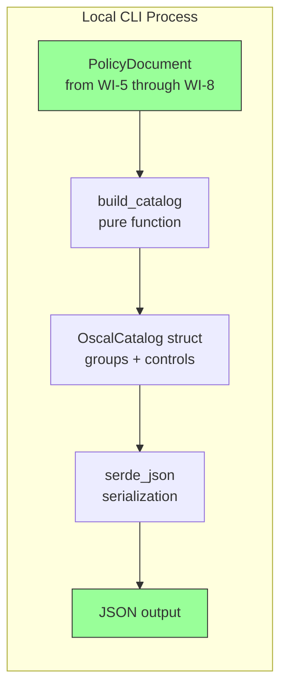
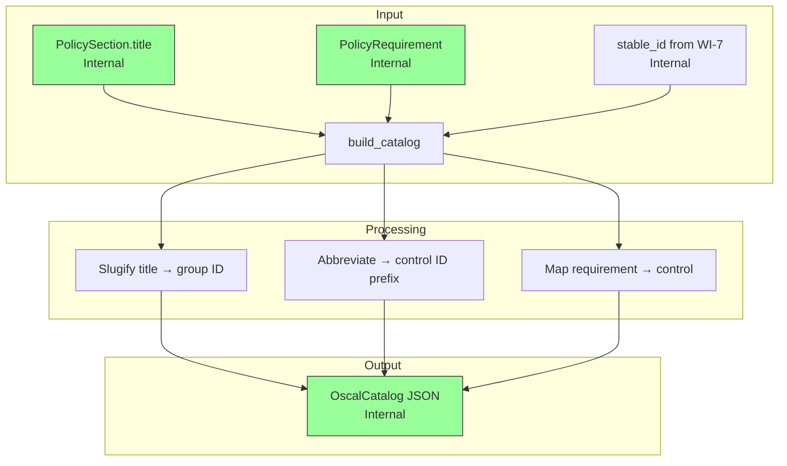
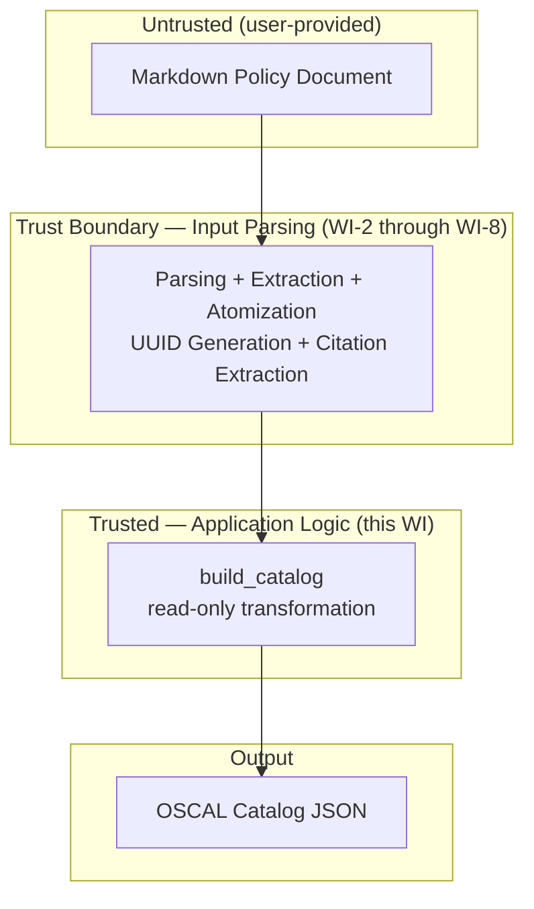

# 009-sec-catalog-groups-controls

> **Document Type:** Security Review (Lightweight)
> **Audience:** LLM agents, human reviewers
> **Status:** Draft
> **Last Updated:** 2026-02-11 <!-- @auto -->
> **Reviewer:** Brian Luby <!-- @human-required -->
> **Risk Level:** Low <!-- @human-required -->

---

## Review Tier Legend

| Marker | Tier | Speckit Behavior |
|--------|------|------------------|
| 🔴 `@human-required` | Human Generated | Prompt human to author; blocks until complete |
| 🟡 `@human-review` | LLM + Human Review | LLM drafts → prompt human to confirm/edit; blocks until confirmed |
| 🟢 `@llm-autonomous` | LLM Autonomous | LLM completes; no prompt; logged for audit |
| ⚪ `@auto` | Auto-generated | System fills (timestamps, links); no prompt |

---

## Severity Definitions

| Level | Label | Definition |
|-------|-------|------------|
| 🔴 | **Critical** | Immediate exploitation risk; data breach or system compromise likely |
| 🟠 | **High** | Significant risk; exploitation possible with moderate effort |
| 🟡 | **Medium** | Notable risk; exploitation requires specific conditions |
| 🟢 | **Low** | Minor risk; limited impact or unlikely exploitation |

---

## Linkage ⚪ `@auto`

| Document | ID | Relationship |
|----------|-----|--------------|
| Parent PRD | [009-prd-catalog-groups-controls.md](../PRD/009-prd-catalog-groups-controls.md) | Feature being reviewed |
| Architecture Review | [009-ar-catalog-groups-controls.md](../AR/009-ar-catalog-groups-controls.md) | Technical implementation |

---

## Purpose

This is a **lightweight security review** intended to catch obvious security concerns early in the product lifecycle. It is NOT a comprehensive threat model. Full threat modeling should occur during implementation when infrastructure-as-code and concrete implementations exist.

**This review answers three questions:**
1. What does this feature expose to attackers?
2. What data does it touch, and how sensitive is that data?
3. What's the impact if something goes wrong?

**Scope of this review:**
- ✅ Attack surface identification
- ✅ Data classification
- ✅ High-level CIA assessment
- ❌ Detailed threat enumeration (deferred to implementation)
- ❌ Penetration testing (deferred to implementation)
- ❌ Compliance audit (separate process)

---

## Feature Security Summary

### One-line Summary 🔴 `@human-required`
> Maps the internal domain model (PolicySections and PolicyRequirements) to OSCAL Catalog JSON structure (groups and controls) — a pure, read-only data transformation with no network I/O, no authentication, and no external input beyond the already-validated domain model.

### Risk Assessment 🔴 `@human-required`
> **Risk Level:** Low
> **Justification:** Pure data transformation operating on already-validated internal data structures; no network exposure, no user input processing, no authentication. The primary concern is mapping integrity — ensuring the section-to-group and requirement-to-control mapping correctly reflects the source policy structure.

---

## Attack Surface Analysis

### Exposure Points 🟡 `@human-review`

| Exposure Type | Details | Authentication | Authorization | Notes |
|---------------|---------|----------------|---------------|-------|
| **None** | **Feature has no external exposure** | — | — | Pure in-memory data transformation from domain model structs to OSCAL structs; no network endpoints, no file I/O during building, no user input fields |

### Attack Surface Diagram 🟢 `@llm-autonomous`

### Exposure Checklist 🟢 `@llm-autonomous`

All items are N/A — local CLI tool with no internet-facing endpoints.

- [x] **No internet-facing endpoints** — local CLI, pure data transformation
- [x] **No sensitive data in URL parameters** — N/A, no URLs
- [x] **No file uploads** — N/A
- [x] **No public endpoints requiring rate limiting** — N/A
- [x] **No CORS configuration** — N/A
- [x] **No debug/admin endpoints** — N/A
- [x] **No webhooks** — N/A

---

## Data Flow Analysis

### Data Inventory 🟡 `@human-review`

| Data Element | PRD Entity | Classification | Source | Destination | Retention | Encrypted Rest | Encrypted Transit | Residency |
|--------------|------------|----------------|--------|-------------|-----------|----------------|-------------------|-----------|
| PolicySection titles | PolicySection.title | Internal | Domain model (WI-5) | OscalGroup.title, OscalGroup.id | None (transient) | N/A | N/A | Local |
| PolicyRequirement text | PolicyRequirement.text | Internal | Domain model (WI-5/WI-6) | OscalControl.title | None (transient) | N/A | N/A | Local |
| Stable UUIDs | PolicyRequirement.stable_id | Internal | WI-7 UUID generation | OscalControl.uuid | None (transient) | N/A | N/A | Local |
| Generated control IDs | OscalControl.id | Internal | Abbreviation algorithm output | OscalControl.id field | None (transient) | N/A | N/A | Local |
| Generated group IDs | OscalGroup.id | Internal | Slugification algorithm output | OscalGroup.id field | None (transient) | N/A | N/A | Local |
| Serialized JSON output | OSCAL Catalog JSON | Internal | serde_json serialization | File system (downstream WI-13) | Persistent (file) | N/A | N/A | Local |

### Data Classification Reference 🟢 `@llm-autonomous`

| Level | Label | Description | Examples | Handling Requirements |
|-------|-------|-------------|----------|----------------------|
| 1 | **Public** | No impact if disclosed | Marketing content, public docs | No special handling |
| 2 | **Internal** | Minor impact if disclosed | Internal configs, non-sensitive logs | Access controls, no public exposure |
| 3 | **Confidential** | Significant impact if disclosed | PII, user data, credentials | Encryption, audit logging, access controls |
| 4 | **Restricted** | Severe impact if disclosed | Payment data, health records, secrets | Encryption, strict access, compliance requirements |

### Data Flow Diagram 🟢 `@llm-autonomous`

### Data Handling Checklist 🟢 `@llm-autonomous`

- [x] **No Restricted data stored** — only Internal classification data
- [x] **No Confidential data at rest** — policy text is organizational, not personal
- [x] **No data in transit** — N/A, no network communication
- [x] **No PII** — no personally identifiable information in policy section titles or requirement text
- [x] **Logs do not contain Confidential/Restricted data** — debug logging shows group/control counts only
- [x] **No secrets hardcoded** — no secrets in this feature
- [x] **Data minimization applied** — only section titles and requirement text are mapped

---

## Third-Party & Supply Chain 🟡 `@human-review`

### New External Services

N/A — no external services introduced.

### New Libraries/Dependencies

| Library | Version | License | Purpose | Security Check |
|---------|---------|---------|---------|----------------|
| `serde` | Latest stable | MIT/Apache-2.0 | Serialization framework for OSCAL structs | ✅ Approved — standard Rust serialization crate |
| `serde_json` | Latest stable | MIT/Apache-2.0 | JSON serialization of OSCAL Catalog output | ✅ Approved — standard Rust JSON crate |

Note: `serde` and `serde_json` are already in the project dependency tree from the constitution technology stack. No new dependencies introduced by this work item.

### Supply Chain Checklist

- [x] **No new external services**
- [x] **Dependencies have acceptable licenses** — MIT/Apache-2.0
- [x] **Dependencies are actively maintained** — `serde` and `serde_json` are foundational Rust ecosystem crates
- [x] **No known critical vulnerabilities** — checked via `cargo audit`

---

## CIA Impact Assessment

If this feature is compromised, what's the impact?

### Confidentiality 🟡 `@human-review`

> **What could be disclosed?**

| Asset at Risk | Classification | Exposure Scenario | Impact | Likelihood |
|---------------|----------------|-------------------|--------|------------|
| Policy requirement text in control titles | Internal | OSCAL JSON output contains policy text as control titles; if the output file is shared externally, internal policy language is disclosed | Low | Low |
| Section titles in group IDs | Internal | Slugified section titles are visible in OSCAL JSON group IDs | Low | Low |

**Confidentiality Risk Level:** Low

### Integrity 🟡 `@human-review`

> **What could be modified or corrupted?**

| Asset at Risk | Modification Scenario | Impact | Likelihood |
|---------------|----------------------|--------|------------|
| Section-to-group mapping | Incorrect mapping (e.g., sections dropped, duplicated, or reordered) could produce an OSCAL Catalog that misrepresents the policy structure | Medium | Low |
| Requirement-to-control mapping | If requirements are mapped to wrong groups or controls are omitted, the Catalog would be misleading for compliance purposes | Medium | Low |
| Control ID uniqueness | If control ID collision detection fails, two different requirements could share the same control ID, causing one to overwrite the other in OSCAL tooling | Medium | Low |
| Control ID abbreviation correctness | Incorrect abbreviation algorithm could produce confusing or misleading control IDs that do not trace to the source section | Low | Low |

**Integrity Risk Level:** Medium

### Availability 🟡 `@human-review`

> **What could be disrupted?**

| Service/Function | Disruption Scenario | Impact | Likelihood |
|------------------|---------------------|--------|------------|
| Catalog building | A very large document (thousands of sections) could cause slow processing due to collision detection across all IDs | Low | Very Low |
| Pipeline continuity | If `build_catalog` returns an error (e.g., missing stable_id), downstream WIs (WI-10, WI-11, WI-12) cannot proceed | Medium | Low |

**Availability Risk Level:** Low

### CIA Summary 🟢 `@llm-autonomous`

| Dimension | Risk Level | Primary Concern | Mitigation Priority |
|-----------|------------|-----------------|---------------------|
| **Confidentiality** | Low | Policy text appears in OSCAL output as control titles | Low |
| **Integrity** | Medium | Correct mapping from domain model to OSCAL groups/controls | Medium |
| **Availability** | Low | No resource exhaustion vector in pure data transformation | Low |

**Overall CIA Risk:** Low — *Pure read-only data transformation with no network exposure. Integrity of the mapping is the primary concern, mitigated by comprehensive unit tests and deterministic algorithms.*

---

## Trust Boundaries 🟡 `@human-review`

### Trust Boundary Checklist 🟢 `@llm-autonomous`

- [x] **All input from untrusted sources is validated** — the Catalog builder operates on the domain model, which has been parsed and validated by WI-2 through WI-8
- [x] **External API responses are validated** — N/A, no external APIs
- [x] **Authorization checked at data access** — N/A, no authorization model
- [x] **Service-to-service calls are authenticated** — N/A, no service calls

---

## Known Risks & Mitigations 🟡 `@human-review`

| ID | Risk Description | Severity | Mitigation | Status | Owner |
|----|------------------|----------|------------|--------|-------|
| R1 | Incorrect section-to-group mapping produces misleading OSCAL Catalog that misrepresents the policy structure | Low | Comprehensive unit tests verify 100% mapping accuracy; the builder is a pure function that is trivially testable | Mitigated | Brian Luby |
| R2 | Control ID collisions cause one requirement to overwrite another in downstream OSCAL tooling | Low | Collision detection algorithm with numeric suffix fallback; unit tests verify global uniqueness across all generated IDs | Mitigated | Brian Luby |
| R3 | Policy text appearing in OSCAL control titles could inadvertently disclose internal policy language if output is shared externally | Low | User responsibility to review OSCAL output before sharing; this is inherent to the tool's purpose (converting policy to OSCAL) | Accepted | Brian Luby |

### Risk Acceptance 🔴 `@human-required`

| Risk ID | Accepted By | Date | Justification | Review Date |
|---------|-------------|------|---------------|-------------|
| R3 | Brian Luby | 2026-02-11 | Disclosing policy text in OSCAL output is the fundamental purpose of the tool; users choose what to share | 2026-08-11 |

---

## Security Requirements 🟡 `@human-review`

### Authentication & Authorization

N/A — FORGE is a local CLI tool with no authentication or authorization model.

### Data Protection

N/A — No persistent data storage in the builder. Output JSON is written to the filesystem by downstream WI-13.

### Input Validation

| Req ID | Requirement | PRD AC | Verification Method |
|--------|-------------|--------|---------------------|
| SEC-1 | The builder must validate that `PolicyRequirement.stable_id` is `Some` before mapping to a control UUID; missing stable_ids must produce an error, not a silent default | AC-4, EC-5 | Unit Test |
| SEC-2 | Control ID generation must enforce global uniqueness; duplicate IDs must produce an error or be resolved | AC-6, EC-3 | Unit Test |
| SEC-3 | Section titles with special characters or non-ASCII text must be safely slugified without producing malformed group IDs | AC-1, EC-4 | Unit Test |

### Operational Security

| Req ID | Requirement | PRD AC | Verification Method |
|--------|-------------|--------|---------------------|
| SEC-4 | The builder must be a pure function — no file I/O, no network access, no environment variable reads, no side effects | — | Code Review |
| SEC-5 | The builder must not mutate the input PolicyDocument — read-only transformation | — | Code Review |

---

## Compliance Considerations 🟡 `@human-review`

| Regulation | Applicable? | Relevant Requirements | N/A Justification |
|------------|-------------|----------------------|-------------------|
| GDPR | N/A | — | No PII processed; policy text is organizational |
| CCPA | N/A | — | No consumer personal information |
| SOC 2 | N/A | — | Local CLI tool; no hosted service |
| HIPAA | N/A | — | No protected health information |
| PCI-DSS | N/A | — | No payment data |
| Other | N/A | — | No applicable regulations |

---

## Review Findings

### Issues Identified 🟡 `@human-review`

No security issues identified. This feature is a pure data transformation with no external exposure.

### Positive Observations 🟢 `@llm-autonomous`

- Pure function design (`build_catalog` is read-only on the domain model) eliminates side-effect-related vulnerabilities
- Typed OSCAL structs with `#[derive(Serialize)]` prevent structural errors at compile time, reducing the risk of producing malformed JSON
- No network I/O or external dependencies beyond the already-validated domain model
- Deterministic output — same input always produces the same OSCAL Catalog, ensuring auditability
- Control ID collision detection provides defense-in-depth against silent data loss

---

## Open Questions 🟡 `@human-review`

No open security questions for this work item.

---

## Changelog ⚪ `@auto`

| Version | Date | Author | Changes |
|---------|------|--------|---------|
| 0.1 | 2026-02-11 | LLM (Claude) | Initial security review |

---

## Review Sign-off 🔴 `@human-required`

| Role | Name | Date | Decision |
|------|------|------|----------|
| Security Reviewer | Brian Luby | YYYY-MM-DD | [Approved / Approved with conditions / Rejected] |
| Feature Owner | Brian Luby | YYYY-MM-DD | [Acknowledged] |

### Conditions for Approval (if applicable) 🔴 `@human-required`

None — no conditions required for this low-risk feature.

---

## Security Requirements Traceability 🟢 `@llm-autonomous`

| SEC Req ID | PRD Req ID | PRD AC ID | Test Type | Test Location |
|------------|------------|-----------|-----------|---------------|
| SEC-1 | M-6 | AC-4, EC-5 | Unit | src/oscal/catalog.rs |
| SEC-2 | M-8 | AC-6, EC-3 | Unit | src/oscal/catalog.rs |
| SEC-3 | M-2 | AC-1, EC-4 | Unit | src/oscal/catalog.rs |
| SEC-4 | — | — | Code Review | src/oscal/catalog.rs |
| SEC-5 | — | — | Code Review | src/oscal/catalog.rs |

---

## Review Checklist 🟢 `@llm-autonomous`

Before marking as Approved:
- [x] Attack surface documented — no external exposure
- [x] Exposure Points table has no contradictory rows — only "None" row present
- [x] All PRD Data Model entities appear in Data Inventory
- [x] All data elements are classified using the 4-tier model
- [x] Third-party dependencies and services are listed
- [x] CIA impact is assessed with Low/Medium/High ratings
- [x] Trust boundaries are identified
- [x] Security requirements have verification methods specified
- [x] Security requirements trace to PRD ACs where applicable
- [x] No Critical/High findings remain Open
- [x] Compliance N/A items have justification
- [x] Risk acceptance has named approver and review date
