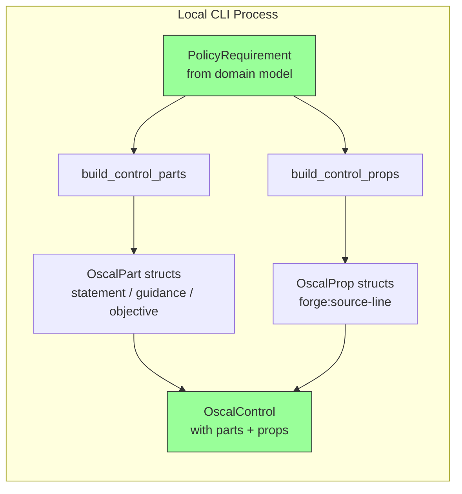
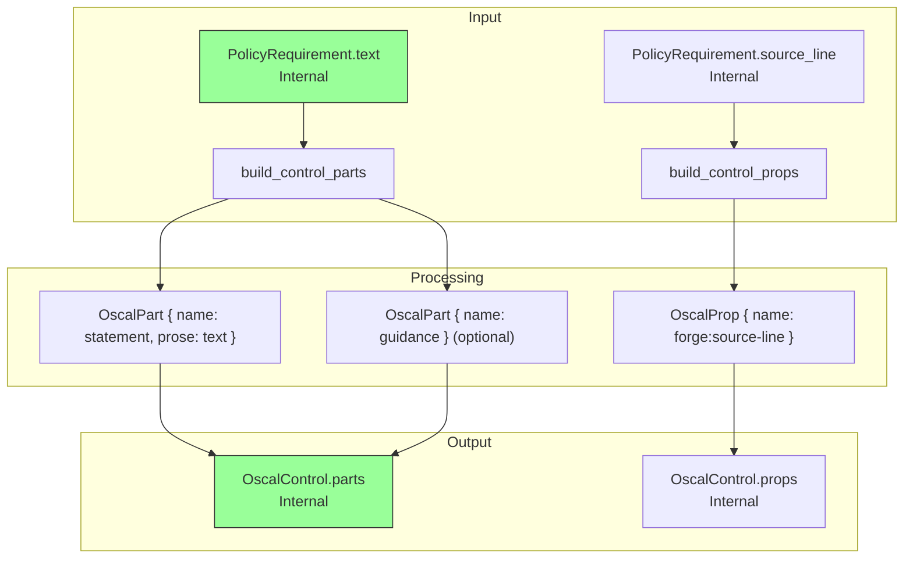
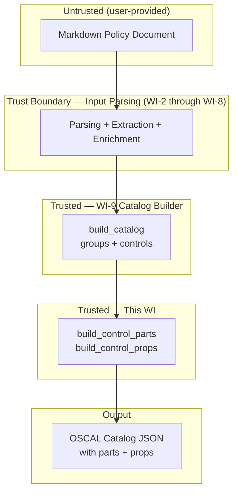

# 010-sec-catalog-statement-parts

> **Document Type:** Security Review (Lightweight)
> **Audience:** LLM agents, human reviewers
> **Status:** Draft
> **Last Updated:** 2026-02-11 <!-- @auto -->
> **Reviewer:** Brian Luby <!-- @human-required -->
> **Risk Level:** Low <!-- @human-required -->

---

## Review Tier Legend

| Marker | Tier | Speckit Behavior |
|--------|------|------------------|
| 🔴 `@human-required` | Human Generated | Prompt human to author; blocks until complete |
| 🟡 `@human-review` | LLM + Human Review | LLM drafts → prompt human to confirm/edit; blocks until confirmed |
| 🟢 `@llm-autonomous` | LLM Autonomous | LLM completes; no prompt; logged for audit |
| ⚪ `@auto` | Auto-generated | System fills (timestamps, links); no prompt |

---

## Severity Definitions

| Level | Label | Definition |
|-------|-------|------------|
| 🔴 | **Critical** | Immediate exploitation risk; data breach or system compromise likely |
| 🟠 | **High** | Significant risk; exploitation possible with moderate effort |
| 🟡 | **Medium** | Notable risk; exploitation requires specific conditions |
| 🟢 | **Low** | Minor risk; limited impact or unlikely exploitation |

---

## Linkage ⚪ `@auto`

| Document | ID | Relationship |
|----------|-----|--------------|
| Parent PRD | [010-prd-catalog-statement-parts.md](../PRD/010-prd-catalog-statement-parts.md) | Feature being reviewed |
| Architecture Review | [010-ar-catalog-statement-parts.md](../AR/010-ar-catalog-statement-parts.md) | Technical implementation |

---

## Purpose

This is a **lightweight security review** intended to catch obvious security concerns early in the product lifecycle. It is NOT a comprehensive threat model. Full threat modeling should occur during implementation when infrastructure-as-code and concrete implementations exist.

**This review answers three questions:**
1. What does this feature expose to attackers?
2. What data does it touch, and how sensitive is that data?
3. What's the impact if something goes wrong?

**Scope of this review:**
- ✅ Attack surface identification
- ✅ Data classification
- ✅ High-level CIA assessment
- ❌ Detailed threat enumeration (deferred to implementation)
- ❌ Penetration testing (deferred to implementation)
- ❌ Compliance audit (separate process)

---

## Feature Security Summary

### One-line Summary 🔴 `@human-required`
> Populates OSCAL control `parts[]` arrays with statement prose from PolicyRequirement text and attaches structured metadata as `props` — a pure internal data transformation extending the WI-9 Catalog builder with no network I/O, no authentication, and no external input.

### Risk Assessment 🔴 `@human-required`
> **Risk Level:** Low
> **Justification:** Pure data transformation that copies policy requirement text into OSCAL part structures. No network exposure, no user input processing beyond already-validated domain model data, and no authentication. The primary concern is data integrity — ensuring requirement text is correctly placed in statement parts and that structured metadata uses props, not remarks.

---

## Attack Surface Analysis

### Exposure Points 🟡 `@human-review`

| Exposure Type | Details | Authentication | Authorization | Notes |
|---------------|---------|----------------|---------------|-------|
| **None** | **Feature has no external exposure** | — | — | Extends the in-memory Catalog builder (WI-9) with parts and props; no new endpoints, no file I/O during building |

### Attack Surface Diagram 🟢 `@llm-autonomous`

### Exposure Checklist 🟢 `@llm-autonomous`

All items are N/A — local CLI tool with no internet-facing endpoints.

- [x] **No internet-facing endpoints** — local CLI, internal data transformation
- [x] **No sensitive data in URL parameters** — N/A
- [x] **No file uploads** — N/A
- [x] **No public endpoints requiring rate limiting** — N/A
- [x] **No CORS configuration** — N/A
- [x] **No debug/admin endpoints** — N/A
- [x] **No webhooks** — N/A

---

## Data Flow Analysis

### Data Inventory 🟡 `@human-review`

| Data Element | PRD Entity | Classification | Source | Destination | Retention | Encrypted Rest | Encrypted Transit | Residency |
|--------------|------------|----------------|--------|-------------|-----------|----------------|-------------------|-----------|
| Policy requirement text | PolicyRequirement.text | Internal | Domain model (WI-5/WI-6) | OscalPart.prose (statement) | None (transient) | N/A | N/A | Local |
| Source line number | PolicyRequirement.source_line | Internal | Domain model (WI-5) | OscalProp (forge:source-line) | None (transient) | N/A | N/A | Local |
| Part IDs | OscalPart.id | Internal | Generated from control ID + suffix | OscalPart struct | None (transient) | N/A | N/A | Local |
| Prop name-value pairs | OscalProp | Internal | Generated from PolicyRequirement metadata | OscalControl.props | None (transient) | N/A | N/A | Local |

### Data Classification Reference 🟢 `@llm-autonomous`

| Level | Label | Description | Examples | Handling Requirements |
|-------|-------|-------------|----------|----------------------|
| 1 | **Public** | No impact if disclosed | Marketing content, public docs | No special handling |
| 2 | **Internal** | Minor impact if disclosed | Internal configs, non-sensitive logs | Access controls, no public exposure |
| 3 | **Confidential** | Significant impact if disclosed | PII, user data, credentials | Encryption, audit logging, access controls |
| 4 | **Restricted** | Severe impact if disclosed | Payment data, health records, secrets | Encryption, strict access, compliance requirements |

### Data Flow Diagram 🟢 `@llm-autonomous`

### Data Handling Checklist 🟢 `@llm-autonomous`

- [x] **No Restricted data stored** — only Internal classification data
- [x] **No Confidential data at rest** — N/A, no persistence in this WI
- [x] **No data in transit** — N/A, no network communication
- [x] **No PII** — policy text and line numbers are organizational metadata
- [x] **Logs do not contain Confidential/Restricted data** — debug logging shows part counts only
- [x] **No secrets hardcoded** — no secrets in this feature
- [x] **Data minimization applied** — only requirement text and source line metadata are mapped to parts/props

---

## Third-Party & Supply Chain 🟡 `@human-review`

### New External Services

N/A — no external services introduced.

### New Libraries/Dependencies

No new dependencies introduced by this work item. `serde` and `serde_json` are already in the dependency tree from WI-9 and the constitution technology stack.

### Supply Chain Checklist

- [x] **No new external services**
- [x] **No new dependencies introduced**
- [x] **Existing dependencies have acceptable licenses** — MIT/Apache-2.0
- [x] **No known critical vulnerabilities** — checked via `cargo audit`

---

## CIA Impact Assessment

If this feature is compromised, what's the impact?

### Confidentiality 🟡 `@human-review`

> **What could be disclosed?**

| Asset at Risk | Classification | Exposure Scenario | Impact | Likelihood |
|---------------|----------------|-------------------|--------|------------|
| Policy requirement text in statement prose | Internal | OSCAL JSON output contains full policy requirement text in `parts[].prose`; if shared externally, internal policy language is disclosed | Low | Low |
| Source line numbers in props | Internal | `forge:source-line` reveals the line number in the source document where a requirement originated | None | N/A |

**Confidentiality Risk Level:** Low

### Integrity 🟡 `@human-review`

> **What could be modified or corrupted?**

| Asset at Risk | Modification Scenario | Impact | Likelihood |
|---------------|----------------------|--------|------------|
| Statement part prose accuracy | If the prose field does not exactly match `PolicyRequirement.text`, the OSCAL Catalog misrepresents the source policy | Medium | Low |
| Part ID correctness | Incorrect part IDs (not following `{control-id}_smt` convention) could break downstream profile or assessment references | Low | Low |
| Remarks misuse | If structured data is accidentally placed in `remarks` instead of `props`, it would violate NIST guidance and produce non-idiomatic OSCAL | Low | Low |

**Integrity Risk Level:** Low

### Availability 🟡 `@human-review`

> **What could be disrupted?**

| Service/Function | Disruption Scenario | Impact | Likelihood |
|------------------|---------------------|--------|------------|
| Parts generation | Computationally trivial — string copying and struct construction; no resource exhaustion vector | Low | Very Low |
| Pipeline continuity | If `build_control_parts` fails, controls remain semantically empty but structurally valid (graceful degradation) | Low | Very Low |

**Availability Risk Level:** Low

### CIA Summary 🟢 `@llm-autonomous`

| Dimension | Risk Level | Primary Concern | Mitigation Priority |
|-----------|------------|-----------------|---------------------|
| **Confidentiality** | Low | Policy text appears in OSCAL output as statement prose | Low |
| **Integrity** | Low | Prose must accurately reflect source requirement text; props not remarks for metadata | Medium |
| **Availability** | Low | No resource exhaustion vector; trivial computation | Low |

**Overall CIA Risk:** Low — *Straightforward internal data transformation. Integrity (correct text mapping, props-not-remarks) is the only notable concern, well-mitigated by unit tests.*

---

## Trust Boundaries 🟡 `@human-review`

### Trust Boundary Checklist 🟢 `@llm-autonomous`

- [x] **All input from untrusted sources is validated** — parts builder operates on already-validated domain model data from WI-2 through WI-8
- [x] **External API responses are validated** — N/A, no external APIs
- [x] **Authorization checked at data access** — N/A, no authorization model
- [x] **Service-to-service calls are authenticated** — N/A, no service calls

---

## Known Risks & Mitigations 🟡 `@human-review`

| ID | Risk Description | Severity | Mitigation | Status | Owner |
|----|------------------|----------|------------|--------|-------|
| R1 | Statement prose does not match source requirement text, producing a Catalog that misrepresents the policy | Low | Direct string copy from `PolicyRequirement.text` to `OscalPart.prose`; verified by unit tests comparing input text to output prose | Mitigated | Brian Luby |
| R2 | Structured data accidentally stored in `remarks` instead of `props`, violating NIST guidance | Low | `OscalControl` struct does not define a `remarks` field; the only metadata pathway is through `OscalProp`. Enforced by unit tests. | Mitigated | Brian Luby |
| R3 | Part IDs do not follow `{control-id}_smt` convention, breaking downstream references | Low | `generate_part_id` function enforces the convention; verified by unit tests | Mitigated | Brian Luby |

### Risk Acceptance 🔴 `@human-required`

No risks require acceptance — all identified risks are mitigated.

---

## Security Requirements 🟡 `@human-review`

### Authentication & Authorization

N/A — FORGE is a local CLI tool with no authentication or authorization model.

### Data Protection

N/A — No persistent data storage in the parts builder. Output is part of the Catalog JSON written by downstream WI-13.

### Input Validation

| Req ID | Requirement | PRD AC | Verification Method |
|--------|-------------|--------|---------------------|
| SEC-1 | Statement part prose must be a direct copy of `PolicyRequirement.text` — no transformation, truncation, or sanitization that could alter the policy meaning | AC-1, AC-2 | Unit Test |
| SEC-2 | Empty requirement text must produce a statement part with empty prose and a logged warning, not a panic or error | EC-1 | Unit Test |
| SEC-3 | Structured metadata (source line) must be expressed as `OscalProp`, never placed in a `remarks` field | AC-3, AC-4 | Unit Test + Code Review |

### Operational Security

| Req ID | Requirement | PRD AC | Verification Method |
|--------|-------------|--------|---------------------|
| SEC-4 | Part and prop generation must be pure functions — no file I/O, no network access, no side effects | — | Code Review |
| SEC-5 | `forge:` namespace prefix must be used for all FORGE-specific prop names to avoid collision with OSCAL-standard prop names | AC-3 | Code Review |

---

## Compliance Considerations 🟡 `@human-review`

| Regulation | Applicable? | Relevant Requirements | N/A Justification |
|------------|-------------|----------------------|-------------------|
| GDPR | N/A | — | No PII processed; policy text is organizational |
| CCPA | N/A | — | No consumer personal information |
| SOC 2 | N/A | — | Local CLI tool; no hosted service |
| HIPAA | N/A | — | No protected health information |
| PCI-DSS | N/A | — | No payment data |
| Other | N/A | — | No applicable regulations |

---

## Review Findings

### Issues Identified 🟡 `@human-review`

No security issues identified. This feature is a straightforward internal data transformation with no external exposure.

### Positive Observations 🟢 `@llm-autonomous`

- No `remarks` field on `OscalControl` — structurally prevents NIST guidance violation at the type level
- `forge:` namespace prefix on props avoids naming collisions with OSCAL-standard property names
- Builder functions are independently testable, separate from the Catalog builder, enabling focused verification
- Direct text copy (no transformation) for prose minimizes risk of inadvertent content modification
- Composable function design (`build_control_parts` and `build_control_props`) maintains separation of concerns

---

## Open Questions 🟡 `@human-review`

No open security questions for this work item.

---

## Changelog ⚪ `@auto`

| Version | Date | Author | Changes |
|---------|------|--------|---------|
| 0.1 | 2026-02-11 | LLM (Claude) | Initial security review |

---

## Review Sign-off 🔴 `@human-required`

| Role | Name | Date | Decision |
|------|------|------|----------|
| Security Reviewer | Brian Luby | YYYY-MM-DD | [Approved / Approved with conditions / Rejected] |
| Feature Owner | Brian Luby | YYYY-MM-DD | [Acknowledged] |

### Conditions for Approval (if applicable) 🔴 `@human-required`

None — no conditions required for this low-risk feature.

---

## Security Requirements Traceability 🟢 `@llm-autonomous`

| SEC Req ID | PRD Req ID | PRD AC ID | Test Type | Test Location |
|------------|------------|-----------|-----------|---------------|
| SEC-1 | M-2 | AC-1, AC-2 | Unit | tests/catalog_parts_test.rs |
| SEC-2 | M-1 | EC-1 | Unit | tests/catalog_parts_test.rs |
| SEC-3 | M-4 | AC-3, AC-4 | Unit + Code Review | tests/catalog_parts_test.rs, src/oscal/parts.rs |
| SEC-4 | — | — | Code Review | src/oscal/parts.rs |
| SEC-5 | — | — | Code Review | src/oscal/parts.rs |

---

## Review Checklist 🟢 `@llm-autonomous`

Before marking as Approved:
- [x] Attack surface documented — no external exposure
- [x] Exposure Points table has no contradictory rows — only "None" row present
- [x] All PRD Data Model entities appear in Data Inventory
- [x] All data elements are classified using the 4-tier model
- [x] Third-party dependencies and services are listed (none new)
- [x] CIA impact is assessed with Low/Medium/High ratings
- [x] Trust boundaries are identified
- [x] Security requirements have verification methods specified
- [x] Security requirements trace to PRD ACs where applicable
- [x] No Critical/High findings remain Open
- [x] Compliance N/A items have justification
- [x] No risk acceptance needed — all risks mitigated
