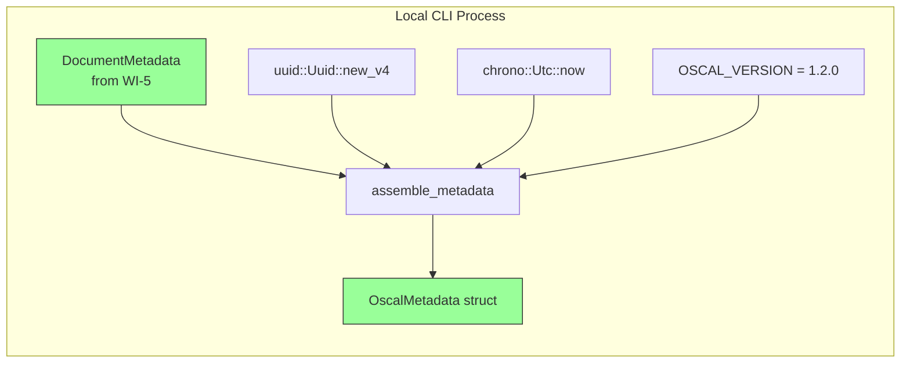
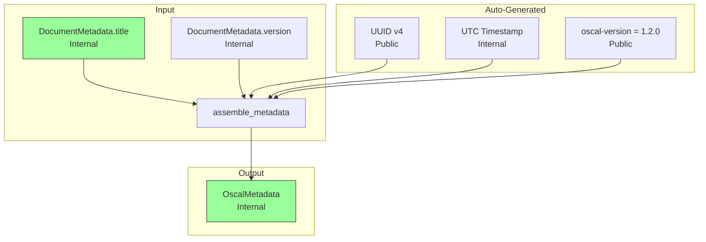
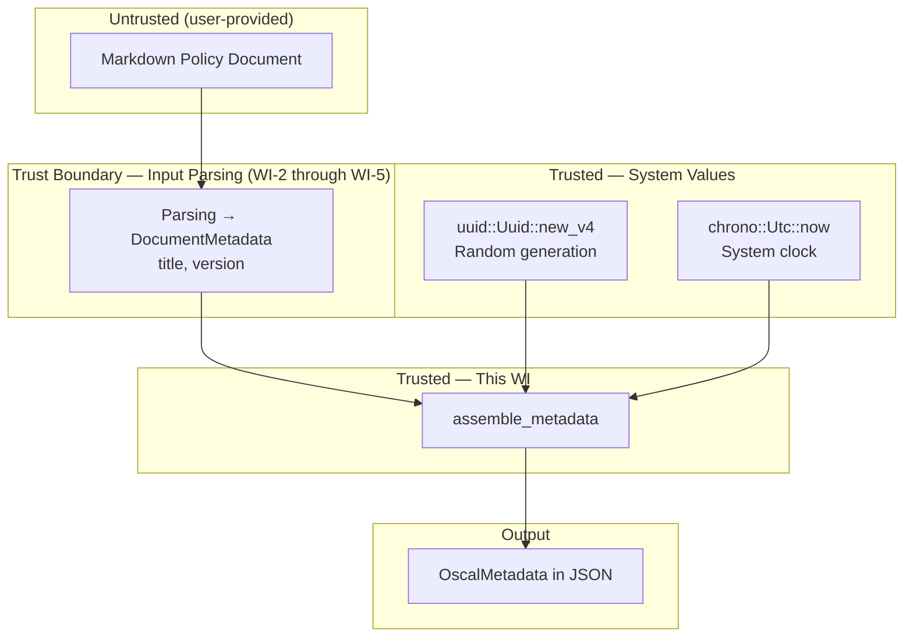

# 011-sec-oscal-metadata

> **Document Type:** Security Review (Lightweight)
> **Audience:** LLM agents, human reviewers
> **Status:** Draft
> **Last Updated:** 2026-02-11 <!-- @auto -->
> **Reviewer:** Brian Luby <!-- @human-required -->
> **Risk Level:** Low <!-- @human-required -->

---

## Review Tier Legend

| Marker | Tier | Speckit Behavior |
|--------|------|------------------|
| 🔴 `@human-required` | Human Generated | Prompt human to author; blocks until complete |
| 🟡 `@human-review` | LLM + Human Review | LLM drafts → prompt human to confirm/edit; blocks until confirmed |
| 🟢 `@llm-autonomous` | LLM Autonomous | LLM completes; no prompt; logged for audit |
| ⚪ `@auto` | Auto-generated | System fills (timestamps, links); no prompt |

---

## Severity Definitions

| Level | Label | Definition |
|-------|-------|------------|
| 🔴 | **Critical** | Immediate exploitation risk; data breach or system compromise likely |
| 🟠 | **High** | Significant risk; exploitation possible with moderate effort |
| 🟡 | **Medium** | Notable risk; exploitation requires specific conditions |
| 🟢 | **Low** | Minor risk; limited impact or unlikely exploitation |

---

## Linkage ⚪ `@auto`

| Document | ID | Relationship |
|----------|-----|--------------|
| Parent PRD | [011-prd-oscal-metadata.md](../PRD/011-prd-oscal-metadata.md) | Feature being reviewed |
| Architecture Review | [011-ar-oscal-metadata.md](../AR/011-ar-oscal-metadata.md) | Technical implementation |

---

## Purpose

This is a **lightweight security review** intended to catch obvious security concerns early in the product lifecycle. It is NOT a comprehensive threat model. Full threat modeling should occur during implementation when infrastructure-as-code and concrete implementations exist.

**This review answers three questions:**
1. What does this feature expose to attackers?
2. What data does it touch, and how sensitive is that data?
3. What's the impact if something goes wrong?

**Scope of this review:**
- ✅ Attack surface identification
- ✅ Data classification
- ✅ High-level CIA assessment
- ❌ Detailed threat enumeration (deferred to implementation)
- ❌ Penetration testing (deferred to implementation)
- ❌ Compliance audit (separate process)

---

## Feature Security Summary

### One-line Summary 🔴 `@human-required`
> Assembles the OSCAL metadata object (uuid, title, last-modified, version, oscal-version) for generated artifacts — the primary security concern is ensuring metadata does not leak system information (hostname, username, file paths) into OSCAL output unless intended.

### Risk Assessment 🔴 `@human-required`
> **Risk Level:** Low
> **Justification:** Metadata assembly is a simple struct construction with five fields sourced from the domain model and auto-generated values (UUID v4, UTC timestamp). No network I/O, no authentication, no PII. The low risk stems from the need to ensure generated metadata does not inadvertently include system-identifying information.

---

## Attack Surface Analysis

### Exposure Points 🟡 `@human-review`

| Exposure Type | Details | Authentication | Authorization | Notes |
|---------------|---------|----------------|---------------|-------|
| **None** | **Feature has no external exposure** | — | — | Metadata assembly is a pure function that reads domain model fields and generates UUID + timestamp; no network endpoints, no user input fields beyond the already-parsed PolicyDocument |

### Attack Surface Diagram 🟢 `@llm-autonomous`

### Exposure Checklist 🟢 `@llm-autonomous`

All items are N/A — local CLI tool with no internet-facing endpoints.

- [x] **No internet-facing endpoints** — local CLI, pure function
- [x] **No sensitive data in URL parameters** — N/A
- [x] **No file uploads** — N/A
- [x] **No public endpoints requiring rate limiting** — N/A
- [x] **No CORS configuration** — N/A
- [x] **No debug/admin endpoints** — N/A
- [x] **No webhooks** — N/A

---

## Data Flow Analysis

### Data Inventory 🟡 `@human-review`

| Data Element | PRD Entity | Classification | Source | Destination | Retention | Encrypted Rest | Encrypted Transit | Residency |
|--------------|------------|----------------|--------|-------------|-----------|----------------|-------------------|-----------|
| Document title | DocumentMetadata.title | Internal | PolicyDocument (WI-5) | OscalMetadata.title | None (transient) | N/A | N/A | Local |
| Document version | DocumentMetadata.version | Internal | PolicyDocument (WI-5) | OscalMetadata.version | None (transient) | N/A | N/A | Local |
| Artifact UUID v4 | OscalMetadata.uuid | Public | uuid crate random generation | OscalMetadata struct → JSON output | Persistent (in output file) | N/A | N/A | Local |
| Last-modified timestamp | OscalMetadata.last_modified | Internal | chrono::Utc::now() | OscalMetadata struct → JSON output | Persistent (in output file) | N/A | N/A | Local |
| OSCAL version string | OscalMetadata.oscal_version | Public | Hardcoded constant "1.2.0" | OscalMetadata struct → JSON output | Persistent (in output file) | N/A | N/A | Local |

### Data Classification Reference 🟢 `@llm-autonomous`

| Level | Label | Description | Examples | Handling Requirements |
|-------|-------|-------------|----------|----------------------|
| 1 | **Public** | No impact if disclosed | Marketing content, public docs | No special handling |
| 2 | **Internal** | Minor impact if disclosed | Internal configs, non-sensitive logs | Access controls, no public exposure |
| 3 | **Confidential** | Significant impact if disclosed | PII, user data, credentials | Encryption, audit logging, access controls |
| 4 | **Restricted** | Severe impact if disclosed | Payment data, health records, secrets | Encryption, strict access, compliance requirements |

### Data Flow Diagram 🟢 `@llm-autonomous`

### Data Handling Checklist 🟢 `@llm-autonomous`

- [x] **No Restricted data stored** — only Internal and Public classification data
- [x] **No Confidential data at rest** — title and version are organizational metadata
- [x] **No data in transit** — N/A, no network communication
- [x] **No PII** — document title, version, UUID, and timestamp contain no personal data
- [x] **Logs do not contain Confidential/Restricted data** — metadata values are Internal/Public
- [x] **No secrets hardcoded** — UUID v4 is random, not a secret; OSCAL version is a public constant
- [x] **Data minimization applied** — only the five required OSCAL metadata fields are generated

---

## Third-Party & Supply Chain 🟡 `@human-review`

### New External Services

N/A — no external services introduced.

### New Libraries/Dependencies

| Library | Version | License | Purpose | Security Check |
|---------|---------|---------|---------|----------------|
| `uuid` | Latest stable | MIT/Apache-2.0 | UUID v4 generation for artifact instance identity | ✅ Approved — already in dependency tree from WI-7 |
| `chrono` | Latest stable | MIT/Apache-2.0 | ISO 8601 UTC timestamp generation | ✅ Approved — standard Rust datetime crate |

### Supply Chain Checklist

- [x] **No new external services**
- [x] **Dependencies have acceptable licenses** — MIT/Apache-2.0
- [x] **Dependencies are actively maintained** — both are tier-1 Rust ecosystem crates
- [x] **No known critical vulnerabilities** — checked via `cargo audit`

---

## CIA Impact Assessment

If this feature is compromised, what's the impact?

### Confidentiality 🟡 `@human-review`

> **What could be disclosed?**

| Asset at Risk | Classification | Exposure Scenario | Impact | Likelihood |
|---------------|----------------|-------------------|--------|------------|
| Document title | Internal | OSCAL metadata includes the policy document title, which could reveal internal document names if output is shared | Low | Low |
| Generation timestamp | Internal | `last-modified` reveals when the artifact was generated, providing limited temporal information | Low | Low |
| System information leakage | Internal | If metadata inadvertently included hostname, username, file path, or timezone (beyond UTC), it could reveal details about the system running FORGE | Medium | Low |

**Confidentiality Risk Level:** Low

### Integrity 🟡 `@human-review`

> **What could be modified or corrupted?**

| Asset at Risk | Modification Scenario | Impact | Likelihood |
|---------------|----------------------|--------|------------|
| OSCAL schema compliance | If metadata fields are missing or incorrectly formatted (e.g., invalid timestamp, non-UUID string), the artifact fails schema validation | Medium | Low |
| Artifact identity | If UUID v4 generation is flawed (e.g., always produces the same value), artifact instances could not be distinguished, causing confusion in OSCAL tool consumption | Low | Very Low |
| Version string accuracy | If `metadata.version` does not match the source document's actual version, downstream consumers may misidentify the policy revision | Low | Low |

**Integrity Risk Level:** Low

### Availability 🟡 `@human-review`

> **What could be disrupted?**

| Service/Function | Disruption Scenario | Impact | Likelihood |
|------------------|---------------------|--------|------------|
| Metadata assembly | Computationally trivial — one UUID generation, one timestamp, three string copies; no resource exhaustion vector | Low | Very Low |
| Pipeline continuity | If `assemble_metadata` fails (e.g., chrono panic on invalid system clock), downstream artifact generation cannot produce valid output | Medium | Very Low |

**Availability Risk Level:** Low

### CIA Summary 🟢 `@llm-autonomous`

| Dimension | Risk Level | Primary Concern | Mitigation Priority |
|-----------|------------|-----------------|---------------------|
| **Confidentiality** | Low | Ensure no system information leakage (hostname, username, paths) in metadata | Medium |
| **Integrity** | Low | Correct field formatting (valid UUID v4, valid ISO 8601 timestamp) | Medium |
| **Availability** | Low | No resource exhaustion vector; trivial computation | Low |

**Overall CIA Risk:** Low — *Simple struct construction with five fields. The only notable security concern is ensuring metadata fields do not inadvertently leak system information beyond what is intended.*

---

## Trust Boundaries 🟡 `@human-review`

### Trust Boundary Checklist 🟢 `@llm-autonomous`

- [x] **All input from untrusted sources is validated** — DocumentMetadata title and version come from the WI-5 domain model, already parsed and validated
- [x] **External API responses are validated** — N/A, no external APIs
- [x] **Authorization checked at data access** — N/A, no authorization model
- [x] **Service-to-service calls are authenticated** — N/A, no service calls

---

## Known Risks & Mitigations 🟡 `@human-review`

| ID | Risk Description | Severity | Mitigation | Status | Owner |
|----|------------------|----------|------------|--------|-------|
| R1 | **System information leakage**: Metadata could inadvertently include hostname, username, filesystem paths, or local timezone if implementation reads system information beyond `Utc::now()` and `Uuid::new_v4()` | Low | The `assemble_metadata` function must only use `DocumentMetadata` fields, `Uuid::new_v4()`, `Utc::now()`, and the `OSCAL_VERSION` constant. No `std::env`, no `hostname`, no filesystem path reading. Verified by code review. | Mitigated | Brian Luby |
| R2 | **Timestamp timezone leakage**: If `last-modified` uses local timezone instead of UTC, it could reveal the operator's geographic region | Low | Use `chrono::Utc::now()` exclusively, producing UTC timestamps with "Z" suffix. Verified by unit test checking for "Z" or "+00:00" suffix. | Mitigated | Brian Luby |
| R3 | **UUID v4 randomness quality**: If the CSPRNG backing `Uuid::new_v4()` is flawed, UUIDs could be predictable or collide | Low | The `uuid` crate uses the OS-provided CSPRNG (`getrandom`), which is well-audited. UUID v4 predictability is not a security concern here — artifact UUIDs are identifiers, not secrets. | Mitigated | Brian Luby |

### Risk Acceptance 🔴 `@human-required`

| Risk ID | Accepted By | Date | Justification | Review Date |
|---------|-------------|------|---------------|-------------|
| R1 | Brian Luby | 2026-02-11 | Mitigated by implementation constraint — function signature only accepts DocumentMetadata and MetadataOptions; no system information APIs are called | 2026-08-11 |

---

## Security Requirements 🟡 `@human-review`

### Authentication & Authorization

N/A — FORGE is a local CLI tool with no authentication or authorization model.

### Data Protection

| Req ID | Requirement | PRD AC | Verification Method |
|--------|-------------|--------|---------------------|
| SEC-1 | Metadata assembly must not read or include system-identifying information (hostname, username, filesystem paths, environment variables) in any metadata field | — | Code Review |
| SEC-2 | The `last-modified` timestamp must always use UTC (with "Z" or "+00:00" suffix), never a local timezone that could reveal geographic information | AC-5 | Unit Test |

### Input Validation

| Req ID | Requirement | PRD AC | Verification Method |
|--------|-------------|--------|---------------------|
| SEC-3 | If `DocumentMetadata.title` is empty, metadata assembly must produce a valid (possibly empty) title field, not panic or include a default that reveals system information | AC-8, EC-1 | Unit Test |
| SEC-4 | If `DocumentMetadata.version` is the default "0.0.0", metadata assembly must use it as-is, not substitute system-derived version information | AC-8, EC-2 | Unit Test |

### Operational Security

| Req ID | Requirement | PRD AC | Verification Method |
|--------|-------------|--------|---------------------|
| SEC-5 | The `assemble_metadata` function must be a pure function (given its inputs) — no file I/O, no network access, no environment variable reads | M-6 | Code Review |
| SEC-6 | `MetadataOptions` overrides (for testing) must not be exposed as CLI flags or environment variables that could be exploited to inject arbitrary metadata | S-1, S-2 | Code Review |

---

## Compliance Considerations 🟡 `@human-review`

| Regulation | Applicable? | Relevant Requirements | N/A Justification |
|------------|-------------|----------------------|-------------------|
| GDPR | N/A | — | No PII processed; document title and version are organizational metadata |
| CCPA | N/A | — | No consumer personal information |
| SOC 2 | N/A | — | Local CLI tool; no hosted service |
| HIPAA | N/A | — | No protected health information |
| PCI-DSS | N/A | — | No payment data |
| Other | N/A | — | No applicable regulations |

---

## Review Findings

### Issues Identified 🟡 `@human-review`

| ID | Finding | Severity | Category | Recommendation | Status |
|----|---------|----------|----------|----------------|--------|
| F1 | Potential for system information leakage if future implementations add hostname, username, or path information to metadata fields (e.g., in `revisions`, `parties`, or custom props) | Low | Confidentiality | Establish a policy that OSCAL metadata must not include system-identifying information unless explicitly configured by the user. Document this in implementation guardrails. | Open |

### Positive Observations 🟢 `@llm-autonomous`

- Function signature constrains inputs to `DocumentMetadata` and `MetadataOptions` only — no pathway to inject system information
- UTC-only timestamps (`chrono::Utc::now()`) prevent timezone-based geographic leakage
- `MetadataOptions` pattern for testing is internal-only (not exposed as CLI flags), preventing external metadata injection
- UUID v4 is generated from the OS CSPRNG via the `uuid` crate, ensuring high-quality randomness
- Hardcoded `OSCAL_VERSION` constant eliminates any risk of version string manipulation
- No `remarks` field — prevents accidental storage of arbitrary or system-derived information

---

## Open Questions 🟡 `@human-review`

- [ ] **Q1:** When optional metadata fields are added in future WIs (e.g., `roles`, `parties`, `responsible-parties`), should there be a policy prohibiting automatic inclusion of system-derived information (hostname, username) without explicit user consent?

---

## Changelog ⚪ `@auto`

| Version | Date | Author | Changes |
|---------|------|--------|---------|
| 0.1 | 2026-02-11 | LLM (Claude) | Initial security review |

---

## Review Sign-off 🔴 `@human-required`

| Role | Name | Date | Decision |
|------|------|------|----------|
| Security Reviewer | Brian Luby | YYYY-MM-DD | [Approved / Approved with conditions / Rejected] |
| Feature Owner | Brian Luby | YYYY-MM-DD | [Acknowledged] |

### Conditions for Approval (if applicable) 🔴 `@human-required`

- [ ] Verify that `assemble_metadata` implementation does not call any system information APIs (`std::env`, `hostname`, `whoami`, etc.)

---

## Security Requirements Traceability 🟢 `@llm-autonomous`

| SEC Req ID | PRD Req ID | PRD AC ID | Test Type | Test Location |
|------------|------------|-----------|-----------|---------------|
| SEC-1 | — | — | Code Review | src/oscal/metadata.rs |
| SEC-2 | M-4 | AC-5 | Unit | tests/metadata_test.rs |
| SEC-3 | M-2 | AC-8, EC-1 | Unit | tests/metadata_test.rs |
| SEC-4 | M-3 | AC-8, EC-2 | Unit | tests/metadata_test.rs |
| SEC-5 | M-6 | AC-7 | Code Review | src/oscal/metadata.rs |
| SEC-6 | S-1, S-2 | — | Code Review | src/oscal/metadata.rs |

---

## Review Checklist 🟢 `@llm-autonomous`

Before marking as Approved:
- [x] Attack surface documented — no external exposure
- [x] Exposure Points table has no contradictory rows — only "None" row present
- [x] All PRD Data Model entities appear in Data Inventory
- [x] All data elements are classified using the 4-tier model
- [x] Third-party dependencies and services are listed
- [x] CIA impact is assessed with Low/Medium/High ratings
- [x] Trust boundaries are identified
- [x] Security requirements have verification methods specified
- [x] Security requirements trace to PRD ACs where applicable
- [x] No Critical/High findings remain Open
- [x] Compliance N/A items have justification
- [x] Risk acceptance has named approver and review date
