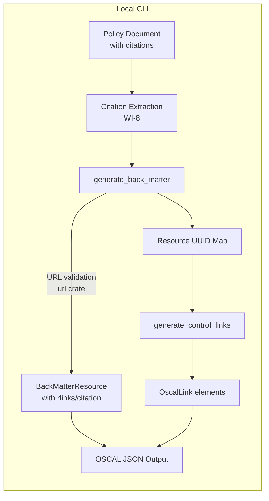
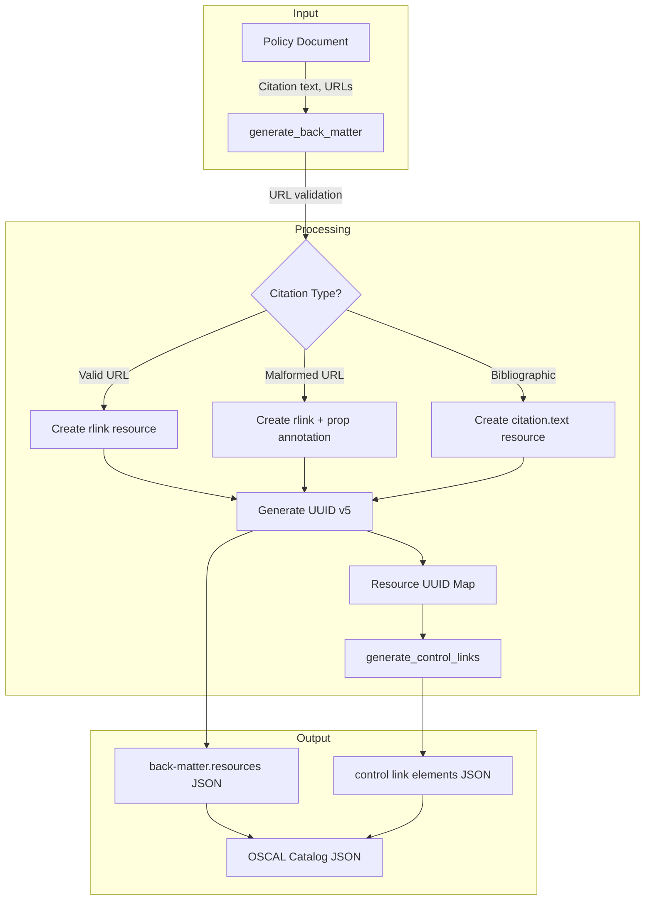
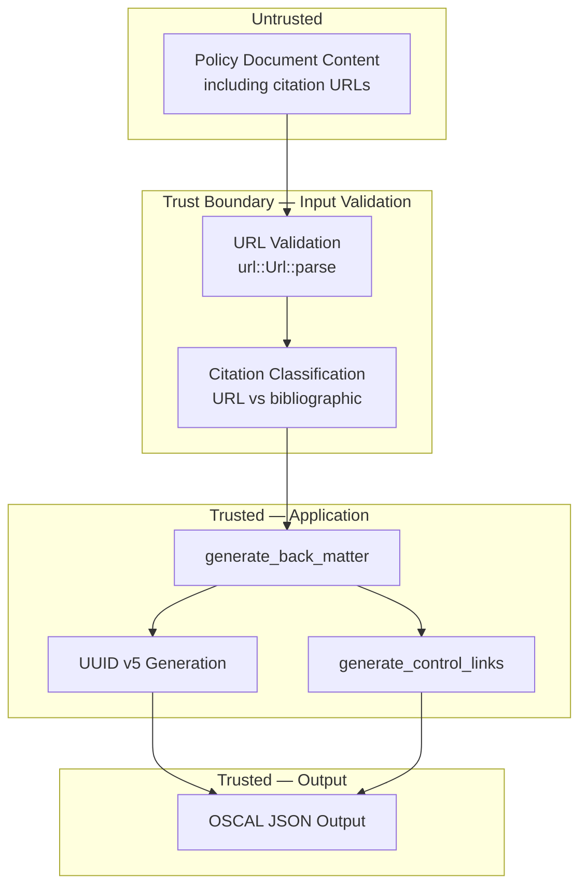

# 012-sec-back-matter

> **Document Type:** Security Review (Lightweight)
> **Audience:** LLM agents, human reviewers
> **Status:** Draft
> **Last Updated:** 2026-02-11 <!-- @auto -->
> **Reviewer:** Brian Luby <!-- @human-required -->
> **Risk Level:** Low <!-- @human-required -->

---

## Review Tier Legend

| Marker | Tier | Speckit Behavior |
|--------|------|------------------|
| 🔴 `@human-required` | Human Generated | Prompt human to author; blocks until complete |
| 🟡 `@human-review` | LLM + Human Review | LLM drafts → prompt human to confirm/edit; blocks until confirmed |
| 🟢 `@llm-autonomous` | LLM Autonomous | LLM completes; no prompt; logged for audit |
| ⚪ `@auto` | Auto-generated | System fills (timestamps, links); no prompt |

---

## Severity Definitions

| Level | Label | Definition |
|-------|-------|------------|
| 🔴 | **Critical** | Immediate exploitation risk; data breach or system compromise likely |
| 🟠 | **High** | Significant risk; exploitation possible with moderate effort |
| 🟡 | **Medium** | Notable risk; exploitation requires specific conditions |
| 🟢 | **Low** | Minor risk; limited impact or unlikely exploitation |

---

## Linkage ⚪ `@auto`

| Document | ID | Relationship |
|----------|-----|--------------|
| Parent PRD | [012-prd-back-matter.md](../PRD/012-prd-back-matter.md) | Feature being reviewed |
| Architecture Review | [012-ar-back-matter.md](../AR/012-ar-back-matter.md) | Technical implementation |

---

## Purpose

This is a **lightweight security review** intended to catch obvious security concerns early in the product lifecycle. It is NOT a comprehensive threat model. Full threat modeling should occur during implementation when infrastructure-as-code and concrete implementations exist.

**This review answers three questions:**
1. What does this feature expose to attackers?
2. What data does it touch, and how sensitive is that data?
3. What's the impact if something goes wrong?

**Scope of this review:**
- ✅ Attack surface identification
- ✅ Data classification
- ✅ High-level CIA assessment
- ❌ Detailed threat enumeration (deferred to implementation)
- ❌ Penetration testing (deferred to implementation)
- ❌ Compliance audit (separate process)

---

## Feature Security Summary

### One-line Summary 🔴 `@human-required`
> Back matter generation converts extracted citations into OSCAL `back-matter.resources[]` entries and wires `link` elements in control bodies. Resource URIs from source documents are preserved in `rlinks` fields, creating a potential vector for URI injection if source documents contain crafted links.

### Risk Assessment 🔴 `@human-required`
> **Risk Level:** Low
> **Justification:** Local CLI tool with no network activity; URIs are stored as data in JSON output but never fetched, resolved, or executed. The risk is limited to malicious URI strings persisting in generated OSCAL artifacts if the source policy document is adversarial.

---

## Attack Surface Analysis

### Exposure Points 🟡 `@human-review`

| Exposure Type | Details | Authentication | Authorization | Notes |
|---------------|---------|----------------|---------------|-------|
| User Input Field | Citation URLs from parsed policy documents | — | — | URLs preserved in `rlinks[].href`; validated via `url` crate but malformed URLs are intentionally preserved with annotation |
| **None** | **No network endpoints, webhooks, queues, or scheduled jobs** | — | — | Local CLI tool only |

### Attack Surface Diagram 🟢 `@llm-autonomous`

### Exposure Checklist 🟢 `@llm-autonomous`

- [x] **Internet-facing endpoints require authentication** — N/A; no internet-facing endpoints
- [x] **No sensitive data in URL parameters** — N/A; no URL parameters (local CLI)
- [x] **File uploads validated** — N/A; no file uploads (reads local files)
- [x] **Rate limiting configured** — N/A; no endpoints to rate limit
- [x] **CORS policy is restrictive** — N/A; no web server
- [x] **No debug/admin endpoints exposed** — N/A; no endpoints
- [x] **Webhooks validate signatures** — N/A; no webhooks

---

## Data Flow Analysis

### Data Inventory 🟡 `@human-review`

| Data Element | PRD Entity | Classification | Source | Destination | Retention | Encrypted Rest | Encrypted Transit | Residency |
|--------------|------------|----------------|--------|-------------|-----------|----------------|-------------------|-----------|
| Citation URLs | Rlink.href | Internal | Parsed policy document | OSCAL JSON output file / stdout | None (stateless CLI) | N/A | N/A | Local filesystem |
| Bibliographic text | ResourceCitation.text | Internal | Parsed policy document | OSCAL JSON output file / stdout | None (stateless CLI) | N/A | N/A | Local filesystem |
| Resource UUIDs | BackMatterResource.uuid | Public | Generated (UUID v5) | OSCAL JSON output | None | N/A | N/A | Local filesystem |
| Control link hrefs | OscalLink.href | Internal | Generated from resource map | OSCAL JSON output | None | N/A | N/A | Local filesystem |
| URL validation status | Prop (url-status) | Internal | url crate parse result | OSCAL JSON output | None | N/A | N/A | Local filesystem |

### Data Classification Reference 🟢 `@llm-autonomous`

| Level | Label | Description | Examples | Handling Requirements |
|-------|-------|-------------|----------|----------------------|
| 1 | **Public** | No impact if disclosed | Marketing content, public docs | No special handling |
| 2 | **Internal** | Minor impact if disclosed | Internal configs, non-sensitive logs | Access controls, no public exposure |
| 3 | **Confidential** | Significant impact if disclosed | PII, user data, credentials | Encryption, audit logging, access controls |
| 4 | **Restricted** | Severe impact if disclosed | Payment data, health records, secrets | Encryption, strict access, compliance requirements |

### Data Flow Diagram 🟢 `@llm-autonomous`

### Data Handling Checklist 🟢 `@llm-autonomous`

- [x] **No Restricted data stored unless absolutely required** — No Restricted data involved
- [x] **Confidential data encrypted at rest** — N/A; no Confidential data
- [x] **All data encrypted in transit (TLS 1.2+)** — N/A; no network transit
- [x] **PII has defined retention policy** — N/A; no PII
- [x] **Logs do not contain Confidential/Restricted data** — No logging of citation content
- [x] **Secrets are not hardcoded** — No secrets involved
- [x] **Data minimization applied** — Only citation data needed for OSCAL back matter is processed
- [x] **Data residency requirements documented** — N/A; local filesystem only

---

## Third-Party & Supply Chain 🟡 `@human-review`

### New External Services

| Service | Purpose | Data Shared | Communication | Approved? |
|---------|---------|-------------|---------------|-----------|
| None | No external services | — | — | N/A |

### New Libraries/Dependencies

| Library | Version | License | Purpose | Security Check |
|---------|---------|---------|---------|----------------|
| url | 2.x | MIT/Apache-2.0 | URL parsing for malformed URL detection | ✅ Approved — widely used standard Rust crate |

### Supply Chain Checklist

- [x] **All new services use encrypted communication** — N/A; no external services
- [x] **Service agreements/ToS reviewed** — N/A; no services
- [x] **Dependencies have acceptable licenses** — `url` crate is MIT/Apache-2.0
- [x] **Dependencies are actively maintained** — `url` crate maintained by servo project
- [x] **No known critical vulnerabilities** — No known CVEs in `url` crate

---

## CIA Impact Assessment

If this feature is compromised, what's the impact?

### Confidentiality 🟡 `@human-review`

> **What could be disclosed?**

| Asset at Risk | Classification | Exposure Scenario | Impact | Likelihood |
|---------------|----------------|-------------------|--------|------------|
| Citation URLs referencing internal resources | Internal | Source policy contains URLs to internal systems; generated OSCAL output shared externally | Low | Low |
| Bibliographic references to internal procedures | Internal | Citation text reveals internal document names or organizational dependencies | Low | Low |

**Confidentiality Risk Level:** Low

### Integrity 🟡 `@human-review`

> **What could be modified or corrupted?**

| Asset at Risk | Modification Scenario | Impact | Likelihood |
|---------------|----------------------|--------|------------|
| OSCAL back matter resources | Crafted citation URLs in source policy inject malicious URIs into generated OSCAL output; downstream consumers follow those URIs | Medium | Low |
| Resource-to-control link mapping | Corrupted resource map causes controls to link to wrong back matter resources | Low | Very Low |
| UUID determinism | Non-deterministic UUID generation breaks stable re-conversion | Low | Very Low |

**Integrity Risk Level:** Low

### Availability 🟡 `@human-review`

> **What could be disrupted?**

| Service/Function | Disruption Scenario | Impact | Likelihood |
|------------------|---------------------|--------|------------|
| Back matter generation | Extremely large number of citations causes memory exhaustion | Low | Very Low |
| URL parsing | Pathological URL strings cause excessive `url` crate processing time | Low | Very Low |

**Availability Risk Level:** Low

### CIA Summary 🟢 `@llm-autonomous`

| Dimension | Risk Level | Primary Concern | Mitigation Priority |
|-----------|------------|-----------------|---------------------|
| **Confidentiality** | Low | Internal URLs or document references in citations may reveal organizational structure | Low |
| **Integrity** | Low | Crafted URIs in source documents persist in OSCAL output | Medium |
| **Availability** | Low | Resource exhaustion from pathological input | Low |

**Overall CIA Risk:** Low — *Back matter generation is a local data transformation with no network activity; the primary concern is URI injection from adversarial source documents that could persist in generated OSCAL artifacts.*

---

## Trust Boundaries 🟡 `@human-review`

### Trust Boundary Checklist 🟢 `@llm-autonomous`

- [x] **All input from untrusted sources is validated** — Citation URLs are parsed by the `url` crate; malformed URLs are annotated but preserved (by design per PRD M-8)
- [x] **External API responses are validated** — N/A; no external API calls
- [x] **Authorization checked at data access, not just entry point** — N/A; no authorization model
- [x] **Service-to-service calls are authenticated** — N/A; no service calls

---

## Known Risks & Mitigations 🟡 `@human-review`

| ID | Risk Description | Severity | Mitigation | Status | Owner |
|----|------------------|----------|------------|--------|-------|
| R1 | URI injection: crafted URLs in source policy documents persist in generated OSCAL rlinks, potentially leading downstream consumers to malicious endpoints | Low | URLs are stored as data, never fetched or executed by FORGE; malformed URLs are annotated with `prop name="url-status" value="unvalidated"`; downstream consumers are responsible for validating URIs before resolution | Mitigated | Brian Luby |
| R2 | Malformed URLs in citations could cause `url` crate to behave unexpectedly | Low | `url::Url::parse` returns `Result`; parse failures are handled gracefully by preserving the original URL with annotation | Mitigated | Brian Luby |
| R3 | Citation text from source documents may contain sensitive organizational references that persist in OSCAL output | Low | Output should be treated with the same sensitivity classification as the source policy; documented in PRD security considerations | Accepted | Brian Luby |

### Risk Acceptance 🔴 `@human-required`

| Risk ID | Accepted By | Date | Justification | Review Date |
|---------|-------------|------|---------------|-------------|
| R3 | Brian Luby | 2026-02-11 | Citation sensitivity inherits from source policy; no additional exposure created by conversion | 2026-08-11 |

---

## Security Requirements 🟡 `@human-review`

### Authentication & Authorization

| Req ID | Requirement | PRD AC | Verification Method |
|--------|-------------|--------|---------------------|
| — | N/A — local CLI tool with no authentication or authorization | — | — |

### Data Protection

| Req ID | Requirement | PRD AC | Verification Method |
|--------|-------------|--------|---------------------|
| SEC-1 | Generated OSCAL output shall not contain data beyond what is present in the source policy document | AC-7 | Unit Test |
| SEC-2 | No arbitrary data shall be stored in OSCAL `remarks` fields | AC-7 | Unit Test |

### Input Validation

| Req ID | Requirement | PRD AC | Verification Method |
|--------|-------------|--------|---------------------|
| SEC-3 | Citation URLs shall be validated using the `url` crate; malformed URLs shall be annotated with `prop name="url-status" value="unvalidated"` | AC-8 | Unit Test |
| SEC-4 | Empty citation URLs shall be treated as malformed and annotated | AC-8 (EC-6) | Unit Test |

### Operational Security

| Req ID | Requirement | PRD AC | Verification Method |
|--------|-------------|--------|---------------------|
| — | N/A — no operational infrastructure | — | — |

---

## Compliance Considerations 🟡 `@human-review`

| Regulation | Applicable? | Relevant Requirements | N/A Justification |
|------------|-------------|----------------------|-------------------|
| GDPR | N/A | — | Local CLI tool; no PII collection, processing, or storage |
| CCPA | N/A | — | No personal data handling |
| SOC 2 | N/A | — | No hosted service or infrastructure |
| HIPAA | N/A | — | No health data |
| PCI-DSS | N/A | — | No payment data |
| Other | N/A | — | FORGE is a local development tool with no network services |

---

## Review Findings

### Issues Identified 🟡 `@human-review`

| ID | Finding | Severity | Category | Recommendation | Status |
|----|---------|----------|----------|----------------|--------|
| F1 | Citation URLs from source documents are preserved verbatim in OSCAL output rlinks; if a downstream OSCAL consumer automatically resolves rlinks, a crafted URL could redirect to a malicious endpoint | Low | Data/Integrity | Document that FORGE does not validate URL destinations; downstream consumers should validate URIs before resolution | Resolved |

### Positive Observations 🟢 `@llm-autonomous`

- Malformed URLs are explicitly annotated with a `prop` rather than silently dropped or passed through without warning, providing clear signal to downstream consumers
- Dedicated UUID v5 namespace for back matter resources prevents UUID collisions with control identifiers
- No arbitrary data stored in `remarks` fields, following NIST best practices
- URLs are never fetched, resolved, or executed during conversion — purely stored as data

---

## Open Questions 🟡 `@human-review`

- [x] **Q1:** No open questions — URI handling approach is defined by PRD M-8 and AR decision

---

## Changelog ⚪ `@auto`

| Version | Date | Author | Changes |
|---------|------|--------|---------|
| 0.1 | 2026-02-11 | LLM (Claude) | Initial review |

---

## Review Sign-off 🔴 `@human-required`

| Role | Name | Date | Decision |
|------|------|------|----------|
| Security Reviewer | Brian Luby | 2026-02-11 | [Approved / Approved with conditions / Rejected] |
| Feature Owner | Brian Luby | 2026-02-11 | [Acknowledged] |

### Conditions for Approval (if applicable) 🔴 `@human-required`

- [ ] None — Low risk feature with mitigations in place

---

## Security Requirements Traceability 🟢 `@llm-autonomous`

| SEC Req ID | PRD Req ID | PRD AC ID | Test Type | Test Location |
|------------|------------|-----------|-----------|---------------|
| SEC-1 | M-7 | AC-7 | Unit | tests/back_matter_test.rs |
| SEC-2 | M-7 | AC-7 | Unit | tests/back_matter_test.rs |
| SEC-3 | M-8 | AC-8 | Unit | tests/back_matter_test.rs |
| SEC-4 | M-8 | AC-8 (EC-6) | Unit | tests/back_matter_test.rs |

---

## Review Checklist 🟢 `@llm-autonomous`

Before marking as Approved:
- [x] Attack surface documented with auth/authz status for each exposure
- [x] Exposure Points table has no contradictory rows (None vs. actual endpoints)
- [x] All PRD Data Model entities appear in Data Inventory
- [x] All data elements are classified using the 4-tier model
- [x] Third-party dependencies and services are listed
- [x] CIA impact is assessed with Low/Medium/High ratings
- [x] Trust boundaries are identified
- [x] Security requirements have verification methods specified
- [x] Security requirements trace to PRD ACs where applicable
- [x] No Critical/High findings remain Open
- [x] Compliance N/A items have justification
- [x] Risk acceptance has named approver and review date
