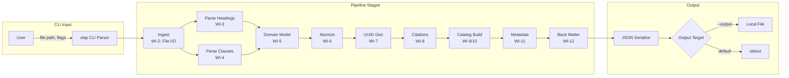
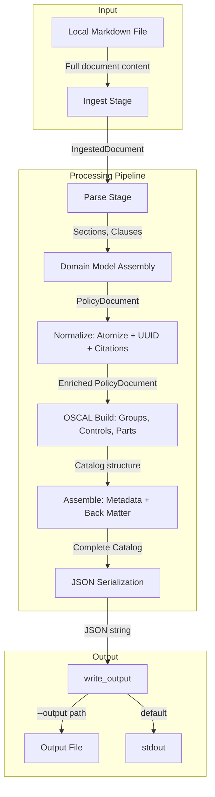
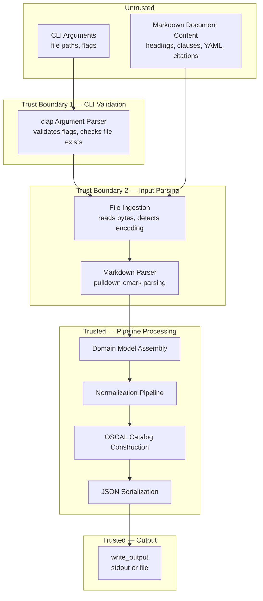

# 013-sec-catalog-pipeline

> **Document Type:** Security Review (Lightweight)
> **Audience:** LLM agents, human reviewers
> **Status:** Draft
> **Last Updated:** 2026-02-11 <!-- @auto -->
> **Reviewer:** Brian Luby <!-- @human-required -->
> **Risk Level:** Medium <!-- @human-required -->

---

## Review Tier Legend

| Marker | Tier | Speckit Behavior |
|--------|------|------------------|
| 🔴 `@human-required` | Human Generated | Prompt human to author; blocks until complete |
| 🟡 `@human-review` | LLM + Human Review | LLM drafts → prompt human to confirm/edit; blocks until confirmed |
| 🟢 `@llm-autonomous` | LLM Autonomous | LLM completes; no prompt; logged for audit |
| ⚪ `@auto` | Auto-generated | System fills (timestamps, links); no prompt |

---

## Severity Definitions

| Level | Label | Definition |
|-------|-------|------------|
| 🔴 | **Critical** | Immediate exploitation risk; data breach or system compromise likely |
| 🟠 | **High** | Significant risk; exploitation possible with moderate effort |
| 🟡 | **Medium** | Notable risk; exploitation requires specific conditions |
| 🟢 | **Low** | Minor risk; limited impact or unlikely exploitation |

---

## Linkage ⚪ `@auto`

| Document | ID | Relationship |
|----------|-----|--------------|
| Parent PRD | [013-prd-catalog-pipeline.md](../PRD/013-prd-catalog-pipeline.md) | Feature being reviewed |
| Architecture Review | [013-ar-catalog-pipeline.md](../AR/013-ar-catalog-pipeline.md) | Technical implementation |

---

## Purpose

This is a **lightweight security review** intended to catch obvious security concerns early in the product lifecycle. It is NOT a comprehensive threat model. Full threat modeling should occur during implementation when infrastructure-as-code and concrete implementations exist.

**This review answers three questions:**
1. What does this feature expose to attackers?
2. What data does it touch, and how sensitive is that data?
3. What's the impact if something goes wrong?

**Scope of this review:**
- ✅ Attack surface identification
- ✅ Data classification
- ✅ High-level CIA assessment
- ❌ Detailed threat enumeration (deferred to implementation)
- ❌ Penetration testing (deferred to implementation)
- ❌ Compliance audit (separate process)

---

## Feature Security Summary

### One-line Summary 🔴 `@human-required`
> The end-to-end catalog pipeline aggregates ALL attack surfaces from WI-2 through WI-12 into a single invocation — file I/O, Markdown parsing, structural extraction, domain model assembly, atomization, UUID generation, citation extraction, OSCAL mapping, metadata assembly, back matter generation, and JSON serialization — making it the first point where chained vulnerabilities across pipeline stages could compound.

### Risk Assessment 🔴 `@human-required`
> **Risk Level:** Medium
> **Justification:** While individual pipeline stages are Low risk, this integration point aggregates all attack surfaces into a single execution path. An adversarial input document traverses every parsing and transformation stage, and errors can propagate through the entire chain. The pipeline also introduces file output (`--output`) and processes complete policy documents end-to-end, making resource exhaustion from large or pathological inputs a realistic concern.

---

## Attack Surface Analysis

### Exposure Points 🟡 `@human-review`

| Exposure Type | Details | Authentication | Authorization | Notes |
|---------------|---------|----------------|---------------|-------|
| User Input Field | Markdown policy document file path (CLI argument) | — | — | File path from command line; standard `std::fs` for reading |
| User Input Field | `--output <path>` file path for writing OSCAL JSON | — | — | User-specified output path; `std::fs::write` for creation |
| User Input Field | `--strategy catalog` flag | — | — | Enum-validated by clap; only "catalog" accepted |
| User Input Field | `--format json` flag | — | — | Enum-validated by clap; only "json" accepted |
| User Input Field | Markdown document content (headings, clauses, prose, citations, YAML frontmatter) | — | — | Entire document content flows through all pipeline stages |

### Attack Surface Diagram 🟢 `@llm-autonomous`

### Exposure Checklist 🟢 `@llm-autonomous`

- [x] **Internet-facing endpoints require authentication** — N/A; no internet-facing endpoints
- [x] **No sensitive data in URL parameters** — N/A; local CLI tool
- [x] **File uploads validated** — Input file read with standard `std::fs`; no upload mechanism
- [x] **Rate limiting configured** — N/A; no endpoints to rate limit
- [x] **CORS policy is restrictive** — N/A; no web server
- [x] **No debug/admin endpoints exposed** — N/A; no endpoints
- [x] **Webhooks validate signatures** — N/A; no webhooks

---

## Data Flow Analysis

### Data Inventory 🟡 `@human-review`

| Data Element | PRD Entity | Classification | Source | Destination | Retention | Encrypted Rest | Encrypted Transit | Residency |
|--------------|------------|----------------|--------|-------------|-----------|----------------|-------------------|-----------|
| Input file path | CLI arg | Public | User command line | Pipeline ingest stage | None (transient) | N/A | N/A | Local |
| Output file path | CLI arg (--output) | Public | User command line | std::fs::write | None (transient) | N/A | N/A | Local |
| Markdown document content | IngestedDocument | Internal | Local filesystem | All pipeline stages (in-memory) | None (process lifetime) | N/A | N/A | Local |
| YAML frontmatter metadata | DocumentMetadata | Internal | Parsed from Markdown | OSCAL metadata fields | None (in output) | N/A | N/A | Local |
| Section headings | SectionNode | Internal | Parsed from Markdown | OSCAL groups | None (in output) | N/A | N/A | Local |
| Policy requirement text | PolicyRequirement | Internal | Parsed from clauses | OSCAL controls, statement parts | None (in output) | N/A | N/A | Local |
| Citation URLs and text | Citation | Internal | Extracted from document | OSCAL back-matter resources | None (in output) | N/A | N/A | Local |
| Generated UUIDs | uuid::Uuid | Public | UUID v5 generation | OSCAL element identifiers | None (in output) | N/A | N/A | Local |
| OSCAL Catalog JSON | serde_json::Value | Internal | Assembled from all stages | Output file or stdout | Persisted if --output | N/A | N/A | Local |

### Data Classification Reference 🟢 `@llm-autonomous`

| Level | Label | Description | Examples | Handling Requirements |
|-------|-------|-------------|----------|----------------------|
| 1 | **Public** | No impact if disclosed | Marketing content, public docs | No special handling |
| 2 | **Internal** | Minor impact if disclosed | Internal configs, non-sensitive logs | Access controls, no public exposure |
| 3 | **Confidential** | Significant impact if disclosed | PII, user data, credentials | Encryption, audit logging, access controls |
| 4 | **Restricted** | Severe impact if disclosed | Payment data, health records, secrets | Encryption, strict access, compliance requirements |

### Data Flow Diagram 🟢 `@llm-autonomous`

### Data Handling Checklist 🟢 `@llm-autonomous`

- [x] **No Restricted data stored unless absolutely required** — No Restricted data involved
- [x] **Confidential data encrypted at rest** — N/A; no Confidential data
- [x] **All data encrypted in transit (TLS 1.2+)** — N/A; no network transit
- [x] **PII has defined retention policy** — N/A; no PII
- [x] **Logs do not contain Confidential/Restricted data** — No logging of document content
- [x] **Secrets are not hardcoded** — No secrets involved
- [x] **Data minimization applied** — Only policy document content needed for OSCAL generation is processed
- [x] **Data residency requirements documented** — N/A; local filesystem only

---

## Third-Party & Supply Chain 🟡 `@human-review`

### New External Services

| Service | Purpose | Data Shared | Communication | Approved? |
|---------|---------|-------------|---------------|-----------|
| None | No external services | — | — | N/A |

### New Libraries/Dependencies

| Library | Version | License | Purpose | Security Check |
|---------|---------|---------|---------|----------------|
| serde_json | 1.x | MIT/Apache-2.0 | JSON serialization (to_string_pretty) | ✅ Approved — standard Rust JSON crate |

Note: No new dependencies introduced by WI-13. All pipeline stage dependencies (pulldown-cmark, uuid, url, serde, thiserror, clap) were introduced and reviewed in prior WIs.

### Supply Chain Checklist

- [x] **All new services use encrypted communication** — N/A; no external services
- [x] **Service agreements/ToS reviewed** — N/A; no services
- [x] **Dependencies have acceptable licenses** — All MIT/Apache-2.0
- [x] **Dependencies are actively maintained** — All crates are actively maintained
- [x] **No known critical vulnerabilities** — No known CVEs in dependency versions

---

## CIA Impact Assessment

If this feature is compromised, what's the impact?

### Confidentiality 🟡 `@human-review`

> **What could be disclosed?**

| Asset at Risk | Classification | Exposure Scenario | Impact | Likelihood |
|---------------|----------------|-------------------|--------|------------|
| Policy document content | Internal | Full policy text flows through pipeline and appears in OSCAL output; if output file permissions are misconfigured, policy content is exposed | Low | Low |
| Internal organizational references | Internal | Citation URLs, section headings, and requirement text may reveal organizational structure and compliance posture | Low | Low |
| YAML frontmatter metadata | Internal | Document title, version, and author metadata from frontmatter appear in OSCAL metadata | Low | Low |

**Confidentiality Risk Level:** Low

### Integrity 🟡 `@human-review`

> **What could be modified or corrupted?**

| Asset at Risk | Modification Scenario | Impact | Likelihood |
|---------------|----------------------|--------|------------|
| OSCAL Catalog output | Adversarial Markdown input crafted to produce incorrect OSCAL structure (e.g., malformed headings causing incorrect group hierarchy) | Medium | Low |
| Pipeline stage data | Error in one stage propagates silently through subsequent stages, producing subtly incorrect OSCAL output | Medium | Low |
| Output file | `--output` path points to an existing important file; overwritten without confirmation | Low | Low |
| Citation-to-control links | Crafted citations cause incorrect back matter resource-to-control link mapping | Low | Low |
| UUID stability | Non-deterministic behavior in any stage breaks UUID stability across re-conversions | Low | Very Low |

**Integrity Risk Level:** Medium

### Availability 🟡 `@human-review`

> **What could be disrupted?**

| Service/Function | Disruption Scenario | Impact | Likelihood |
|------------------|---------------------|--------|------------|
| Pipeline execution | Very large Markdown document (hundreds of MB) causes memory exhaustion across multiple in-memory stages | Medium | Low |
| Pipeline execution | Deeply nested heading structure causes stack overflow in recursive parsing | Low | Very Low |
| Pipeline execution | Pathological Markdown (e.g., thousands of headings with no content) causes excessive processing time in multiple stages | Low | Low |
| File output | `--output` path on a full filesystem causes write failure | Low | Very Low |

**Availability Risk Level:** Low

### CIA Summary 🟢 `@llm-autonomous`

| Dimension | Risk Level | Primary Concern | Mitigation Priority |
|-----------|------------|-----------------|---------------------|
| **Confidentiality** | Low | Policy content in output inherits source sensitivity | Low |
| **Integrity** | Medium | Chained errors across pipeline stages; adversarial input producing incorrect OSCAL | High |
| **Availability** | Low | Resource exhaustion from large or pathological input documents | Medium |

**Overall CIA Risk:** Medium — *The end-to-end pipeline aggregates attack surfaces from all prior work items. While no single stage introduces high risk, the chaining of 10+ processing stages means errors can compound and adversarial input traverses a larger attack surface than any individual stage. Integrity is the primary concern: ensuring the pipeline produces correct OSCAL output from valid input, and fails gracefully on invalid input.*

---

## Trust Boundaries 🟡 `@human-review`

### Trust Boundary Checklist 🟢 `@llm-autonomous`

- [x] **All input from untrusted sources is validated** — CLI flags validated by clap; file existence checked before reading; Markdown parsed by pulldown-cmark (well-tested library)
- [x] **External API responses are validated** — N/A; no external API calls
- [x] **Authorization checked at data access, not just entry point** — N/A; no authorization model
- [x] **Service-to-service calls are authenticated** — N/A; no service calls

---

## Known Risks & Mitigations 🟡 `@human-review`

| ID | Risk Description | Severity | Mitigation | Status | Owner |
|----|------------------|----------|------------|--------|-------|
| R1 | Chained error propagation: an error in an early pipeline stage (e.g., heading extraction) could cause incorrect but non-crashing behavior in downstream stages, producing subtly wrong OSCAL output | Medium | Each stage returns `Result<T, ForgeError>`; the `?` operator short-circuits on failure; smoke test validates end-to-end output structure | Mitigated | Brian Luby |
| R2 | Resource exhaustion: very large Markdown documents processed entirely in-memory across multiple stages could exhaust available memory | Low | Performance benchmarking deferred to WI-24; for current scope, FORGE targets policy documents (typically <1MB) not arbitrary large files | Open | Brian Luby |
| R3 | Output file overwrite: `--output` flag overwrites existing files without confirmation, potentially destroying important data | Low | Standard CLI behavior (consistent with tools like `jq`, `cargo`, `rustfmt`); users are expected to manage their output paths | Accepted | Brian Luby |
| R4 | Adversarial Markdown input: crafted Markdown with pathological heading structures, extremely long lines, or binary content injected into what appears to be a Markdown file | Low | pulldown-cmark handles malformed Markdown gracefully; pipeline stages should validate assumptions about input structure | Mitigated | Brian Luby |
| R5 | OSCAL output integrity: generated JSON may not conform to OSCAL schema due to integration mismatches between pipeline stages | Medium | Smoke test validates output structure; full schema validation deferred to WI-19 | Open | Brian Luby |

### Risk Acceptance 🔴 `@human-required`

| Risk ID | Accepted By | Date | Justification | Review Date |
|---------|-------------|------|---------------|-------------|
| R3 | Brian Luby | 2026-02-11 | Standard CLI file overwrite behavior; consistent with ecosystem conventions | 2026-08-11 |

---

## Security Requirements 🟡 `@human-review`

### Authentication & Authorization

| Req ID | Requirement | PRD AC | Verification Method |
|--------|-------------|--------|---------------------|
| — | N/A — local CLI tool with no authentication or authorization | — | — |

### Data Protection

| Req ID | Requirement | PRD AC | Verification Method |
|--------|-------------|--------|---------------------|
| SEC-1 | Output JSON shall not contain data beyond what is derived from the source policy document and OSCAL metadata conventions | AC-1, AC-2 | Integration Test (smoke test) |
| SEC-2 | Output file shall be created with default filesystem permissions (no elevated permissions) | AC-4 | Manual Review |

### Input Validation

| Req ID | Requirement | PRD AC | Verification Method |
|--------|-------------|--------|---------------------|
| SEC-3 | CLI flags (`--strategy`, `--format`) shall be validated by clap against known enum values; invalid values shall produce a descriptive error | AC-1 (EC-4, EC-5) | Unit Test |
| SEC-4 | Input file path shall be validated for existence before pipeline execution begins | AC-1 (EC-1) | Integration Test |
| SEC-5 | Empty input files shall produce a descriptive error, not a crash or undefined output | AC-1 (EC-2) | Integration Test |
| SEC-6 | Output path directory shall be validated for existence before attempting write | AC-4 (EC-3) | Integration Test |

### Operational Security

| Req ID | Requirement | PRD AC | Verification Method |
|--------|-------------|--------|---------------------|
| SEC-7 | Pipeline errors shall propagate to a non-zero exit code with descriptive error message to stderr | S-2 | Integration Test |
| SEC-8 | No pipeline stage shall silently swallow errors that could produce incorrect output | M-1 | Code Review |

---

## Compliance Considerations 🟡 `@human-review`

| Regulation | Applicable? | Relevant Requirements | N/A Justification |
|------------|-------------|----------------------|-------------------|
| GDPR | N/A | — | Local CLI tool; no PII collection, processing, or storage |
| CCPA | N/A | — | No personal data handling |
| SOC 2 | N/A | — | No hosted service or infrastructure |
| HIPAA | N/A | — | No health data |
| PCI-DSS | N/A | — | No payment data |
| Other | N/A | — | FORGE is a local development tool with no network services |

---

## Review Findings

### Issues Identified 🟡 `@human-review`

| ID | Finding | Severity | Category | Recommendation | Status |
|----|---------|----------|----------|----------------|--------|
| F1 | End-to-end pipeline has no resource limits; a pathological or very large input document could cause excessive memory consumption across all in-memory stages | Low | Availability | Add input file size limit check (e.g., warn or reject files >50MB) in a future sprint (WI-24 performance benchmarking) | Open |
| F2 | No OSCAL schema validation of output; generated JSON could be structurally incorrect without detection | Medium | Integrity | Addressed by WI-19 (Schema Validation); smoke test provides partial coverage in the interim | Open |
| F3 | `--output` flag accepts arbitrary file paths without restriction; could overwrite system files if run with elevated privileges | Low | Integrity | Standard CLI behavior; FORGE should not be run with elevated privileges; document this in user guidance | Resolved |

### Positive Observations 🟢 `@llm-autonomous`

- Pipeline uses `Result<T, ForgeError>` with `?` propagation throughout, ensuring errors from any stage surface immediately rather than being silently swallowed
- Sequential function composition pattern is simple and auditable — no dynamic dispatch or indirection that could obscure error flow
- stdout default output avoids filesystem interaction for the common case, reducing the attack surface
- Each pipeline stage was individually designed and tested before integration, providing defense-in-depth
- Pretty-printed JSON output is human-inspectable, supporting manual verification

---

## Open Questions 🟡 `@human-review`

- [ ] **Q1:** Should an input file size limit be enforced to prevent resource exhaustion, or is this deferred to WI-24 (performance benchmarking)?

---

## Changelog ⚪ `@auto`

| Version | Date | Author | Changes |
|---------|------|--------|---------|
| 0.1 | 2026-02-11 | LLM (Claude) | Initial review |

---

## Review Sign-off 🔴 `@human-required`

| Role | Name | Date | Decision |
|------|------|------|----------|
| Security Reviewer | Brian Luby | 2026-02-11 | [Approved / Approved with conditions / Rejected] |
| Feature Owner | Brian Luby | 2026-02-11 | [Acknowledged] |

### Conditions for Approval (if applicable) 🔴 `@human-required`

- [ ] OSCAL schema validation (WI-19) should be prioritized to close the output integrity gap (F2)
- [ ] Input file size limit should be evaluated during WI-24 performance benchmarking (F1)

---

## Security Requirements Traceability 🟢 `@llm-autonomous`

| SEC Req ID | PRD Req ID | PRD AC ID | Test Type | Test Location |
|------------|------------|-----------|-----------|---------------|
| SEC-1 | M-1, M-6 | AC-1, AC-2 | Integration | tests/pipeline_smoke_test.rs |
| SEC-2 | M-5 | AC-4 | Manual | Security checklist |
| SEC-3 | M-2, M-3 | AC-1 (EC-4, EC-5) | Unit | tests/cli_test.rs |
| SEC-4 | M-1 | AC-1 (EC-1) | Integration | tests/pipeline_smoke_test.rs |
| SEC-5 | M-1 | AC-1 (EC-2) | Integration | tests/pipeline_smoke_test.rs |
| SEC-6 | M-5 | AC-4 (EC-3) | Integration | tests/pipeline_smoke_test.rs |
| SEC-7 | S-2 | — | Integration | tests/pipeline_smoke_test.rs |
| SEC-8 | M-1 | — | Code Review | Code review during PR |

---

## Review Checklist 🟢 `@llm-autonomous`

Before marking as Approved:
- [x] Attack surface documented with auth/authz status for each exposure
- [x] Exposure Points table has no contradictory rows (None vs. actual endpoints)
- [x] All PRD Data Model entities appear in Data Inventory
- [x] All data elements are classified using the 4-tier model
- [x] Third-party dependencies and services are listed
- [x] CIA impact is assessed with Low/Medium/High ratings
- [x] Trust boundaries are identified
- [x] Security requirements have verification methods specified
- [x] Security requirements trace to PRD ACs where applicable
- [x] No Critical/High findings remain Open
- [x] Compliance N/A items have justification
- [x] Risk acceptance has named approver and review date
