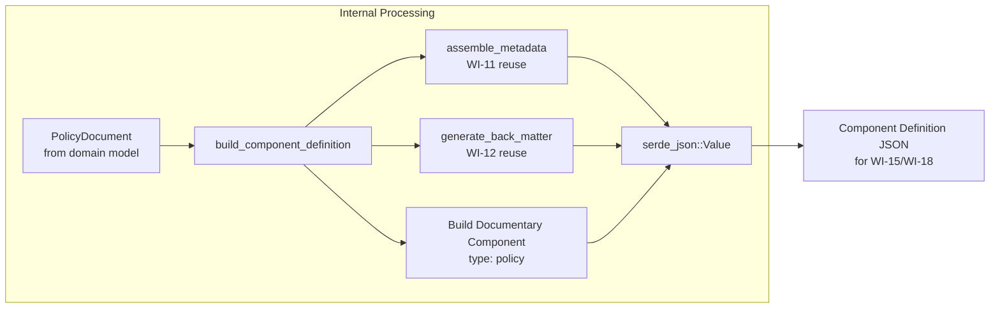
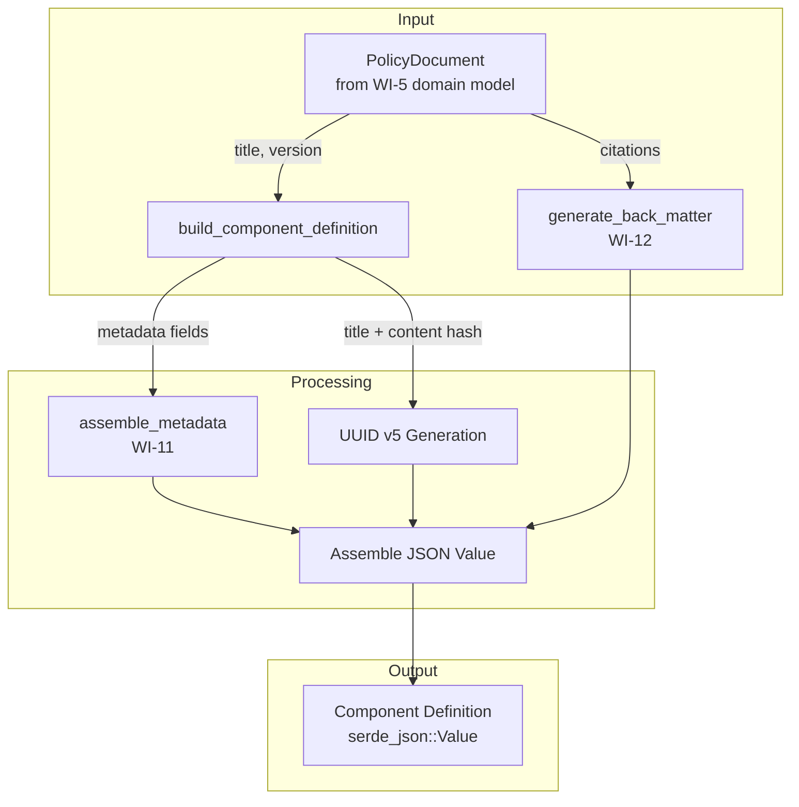
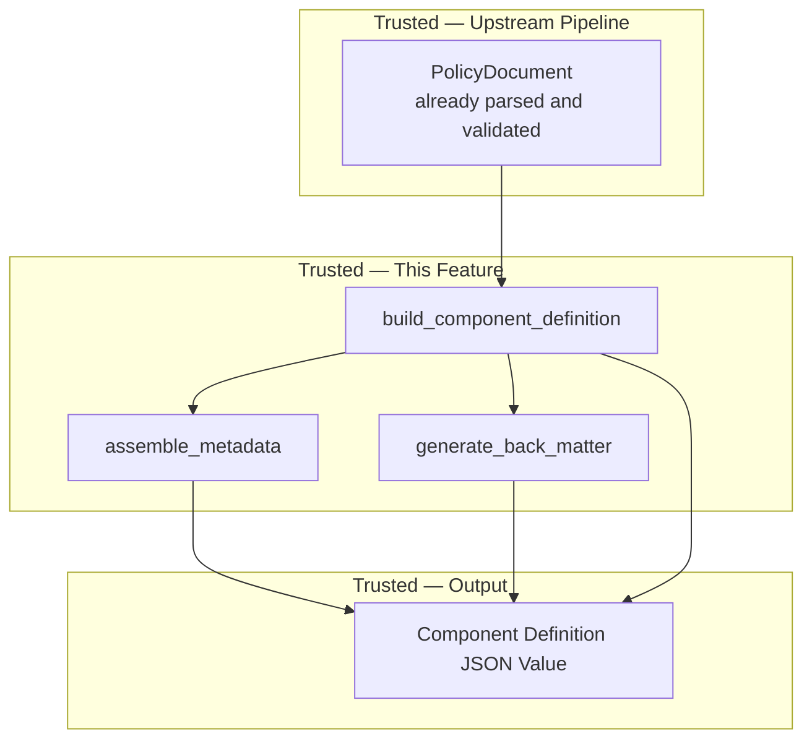

# 014-sec-component-definition-structure

> **Document Type:** Security Review (Lightweight)
> **Audience:** LLM agents, human reviewers
> **Status:** Draft
> **Last Updated:** 2026-02-11 <!-- @auto -->
> **Reviewer:** Brian Luby <!-- @human-required -->
> **Risk Level:** Low <!-- @human-required -->

---

## Review Tier Legend

| Marker | Tier | Speckit Behavior |
|--------|------|------------------|
| 🔴 `@human-required` | Human Generated | Prompt human to author; blocks until complete |
| 🟡 `@human-review` | LLM + Human Review | LLM drafts → prompt human to confirm/edit; blocks until confirmed |
| 🟢 `@llm-autonomous` | LLM Autonomous | LLM completes; no prompt; logged for audit |
| ⚪ `@auto` | Auto-generated | System fills (timestamps, links); no prompt |

---

## Severity Definitions

| Level | Label | Definition |
|-------|-------|------------|
| 🔴 | **Critical** | Immediate exploitation risk; data breach or system compromise likely |
| 🟠 | **High** | Significant risk; exploitation possible with moderate effort |
| 🟡 | **Medium** | Notable risk; exploitation requires specific conditions |
| 🟢 | **Low** | Minor risk; limited impact or unlikely exploitation |

---

## Linkage ⚪ `@auto`

| Document | ID | Relationship |
|----------|-----|--------------|
| Parent PRD | [014-prd-component-definition-structure.md](../PRD/014-prd-component-definition-structure.md) | Feature being reviewed |
| Architecture Review | [014-ar-component-definition-structure.md](../AR/014-ar-component-definition-structure.md) | Technical implementation |

---

## Purpose

This is a **lightweight security review** intended to catch obvious security concerns early in the product lifecycle. It is NOT a comprehensive threat model. Full threat modeling should occur during implementation when infrastructure-as-code and concrete implementations exist.

**This review answers three questions:**
1. What does this feature expose to attackers?
2. What data does it touch, and how sensitive is that data?
3. What's the impact if something goes wrong?

**Scope of this review:**
- ✅ Attack surface identification
- ✅ Data classification
- ✅ High-level CIA assessment
- ❌ Detailed threat enumeration (deferred to implementation)
- ❌ Penetration testing (deferred to implementation)
- ❌ Compliance audit (separate process)

---

## Feature Security Summary

### One-line Summary 🔴 `@human-required`
> Component Definition structure builder creates the OSCAL Component Definition JSON envelope with a documentary component of type "policy" from a parsed PolicyDocument — a purely internal data transformation with no new input parsing, network activity, or external interfaces.

### Risk Assessment 🔴 `@human-required`
> **Risk Level:** Low
> **Justification:** Internal data transformation only. Consumes an already-parsed and validated PolicyDocument (from prior pipeline stages), produces a `serde_json::Value` structure, and reuses existing metadata assembly (WI-11) and back matter generation (WI-12). No new input parsing, no file I/O, no network activity. The only security-relevant aspect is ensuring data integrity of the component mapping (correct type, title, description derivation).

---

## Attack Surface Analysis

### Exposure Points 🟡 `@human-review`

| Exposure Type | Details | Authentication | Authorization | Notes |
|---------------|---------|----------------|---------------|-------|
| **None** | **Feature has no external exposure** | — | — | Internal data transformation; consumes PolicyDocument from prior pipeline stages |

### Attack Surface Diagram 🟢 `@llm-autonomous`

### Exposure Checklist 🟢 `@llm-autonomous`

- [x] **Internet-facing endpoints require authentication** — N/A; no internet-facing endpoints
- [x] **No sensitive data in URL parameters** — N/A; no URLs
- [x] **File uploads validated** — N/A; no file I/O in this feature
- [x] **Rate limiting configured** — N/A; no endpoints
- [x] **CORS policy is restrictive** — N/A; no web server
- [x] **No debug/admin endpoints exposed** — N/A; no endpoints
- [x] **Webhooks validate signatures** — N/A; no webhooks

---

## Data Flow Analysis

### Data Inventory 🟡 `@human-review`

| Data Element | PRD Entity | Classification | Source | Destination | Retention | Encrypted Rest | Encrypted Transit | Residency |
|--------------|------------|----------------|--------|-------------|-----------|----------------|-------------------|-----------|
| Policy document title | PolicyDocument.metadata.title | Internal | Domain model (WI-5) | Component Definition JSON (component title, metadata title) | None (in output) | N/A | N/A | In-memory |
| Policy document version | PolicyDocument.metadata.version | Internal | Domain model (WI-5) | Component Definition JSON (metadata version) | None (in output) | N/A | N/A | In-memory |
| Documentary component UUID | Component.uuid | Public | Generated (UUID v5) | Component Definition JSON | None (in output) | N/A | N/A | In-memory |
| Document-level UUID | ComponentDefinition.uuid | Public | Generated (UUID v4) | Component Definition JSON | None (in output) | N/A | N/A | In-memory |
| Component description | Component.description | Internal | Generated from title | Component Definition JSON | None (in output) | N/A | N/A | In-memory |
| OSCAL metadata block | OscalMetadata | Internal | assemble_metadata (WI-11) | Component Definition JSON | None (in output) | N/A | N/A | In-memory |
| Back matter resources | BackMatter | Internal | generate_back_matter (WI-12) | Component Definition JSON | None (in output) | N/A | N/A | In-memory |

### Data Classification Reference 🟢 `@llm-autonomous`

| Level | Label | Description | Examples | Handling Requirements |
|-------|-------|-------------|----------|----------------------|
| 1 | **Public** | No impact if disclosed | Marketing content, public docs | No special handling |
| 2 | **Internal** | Minor impact if disclosed | Internal configs, non-sensitive logs | Access controls, no public exposure |
| 3 | **Confidential** | Significant impact if disclosed | PII, user data, credentials | Encryption, audit logging, access controls |
| 4 | **Restricted** | Severe impact if disclosed | Payment data, health records, secrets | Encryption, strict access, compliance requirements |

### Data Flow Diagram 🟢 `@llm-autonomous`

### Data Handling Checklist 🟢 `@llm-autonomous`

- [x] **No Restricted data stored unless absolutely required** — No Restricted data involved
- [x] **Confidential data encrypted at rest** — N/A; no Confidential data
- [x] **All data encrypted in transit (TLS 1.2+)** — N/A; no network transit
- [x] **PII has defined retention policy** — N/A; no PII
- [x] **Logs do not contain Confidential/Restricted data** — No logging in this feature
- [x] **Secrets are not hardcoded** — No secrets involved
- [x] **Data minimization applied** — Only title, version, and citations from PolicyDocument used
- [x] **Data residency requirements documented** — N/A; in-memory processing only

---

## Third-Party & Supply Chain 🟡 `@human-review`

### New External Services

| Service | Purpose | Data Shared | Communication | Approved? |
|---------|---------|-------------|---------------|-----------|
| None | No external services | — | — | N/A |

### New Libraries/Dependencies

| Library | Version | License | Purpose | Security Check |
|---------|---------|---------|---------|----------------|
| None | — | — | No new dependencies; reuses serde_json, uuid from prior WIs | N/A |

### Supply Chain Checklist

- [x] **All new services use encrypted communication** — N/A; no services
- [x] **Service agreements/ToS reviewed** — N/A
- [x] **Dependencies have acceptable licenses** — No new dependencies
- [x] **Dependencies are actively maintained** — No new dependencies
- [x] **No known critical vulnerabilities** — No new dependencies

---

## CIA Impact Assessment

If this feature is compromised, what's the impact?

### Confidentiality 🟡 `@human-review`

> **What could be disclosed?**

| Asset at Risk | Classification | Exposure Scenario | Impact | Likelihood |
|---------------|----------------|-------------------|--------|------------|
| Policy document title and version | Internal | Title and version appear in Component Definition output; if output is shared externally, organizational policy naming is revealed | Low | Low |

**Confidentiality Risk Level:** Low

### Integrity 🟡 `@human-review`

> **What could be modified or corrupted?**

| Asset at Risk | Modification Scenario | Impact | Likelihood |
|---------------|----------------------|--------|------------|
| Component Definition structure | Builder produces incorrect JSON structure (wrong root key, missing required fields, wrong component type) leading to invalid OSCAL output | Medium | Very Low |
| Component UUID determinism | UUID v5 generation uses wrong namespace or content hash, breaking stability across re-conversions | Low | Very Low |
| Metadata consistency | Metadata assembly diverges between Catalog and Component Definition due to incorrect reuse of WI-11 function | Low | Very Low |

**Integrity Risk Level:** Low

### Availability 🟡 `@human-review`

> **What could be disrupted?**

| Service/Function | Disruption Scenario | Impact | Likelihood |
|------------------|---------------------|--------|------------|
| Component Definition generation | N/A — single function call on already-validated data; no plausible availability disruption | N/A | N/A |

**Availability Risk Level:** Low

### CIA Summary 🟢 `@llm-autonomous`

| Dimension | Risk Level | Primary Concern | Mitigation Priority |
|-----------|------------|-----------------|---------------------|
| **Confidentiality** | Low | Policy title/version in output | Low |
| **Integrity** | Low | Correct JSON structure and component type mapping | Medium |
| **Availability** | Low | No plausible availability risk | Low |

**Overall CIA Risk:** Low — *Internal data transformation with no external exposure. Integrity focus is on producing a correctly structured Component Definition JSON that downstream WIs (WI-15, WI-18) can consume. All inputs are already-validated domain model objects.*

---

## Trust Boundaries 🟡 `@human-review`

### Trust Boundary Checklist 🟢 `@llm-autonomous`

- [x] **All input from untrusted sources is validated** — Input is an already-validated PolicyDocument from the domain model; no new untrusted input
- [x] **External API responses are validated** — N/A; no external API calls
- [x] **Authorization checked at data access, not just entry point** — N/A; no authorization model
- [x] **Service-to-service calls are authenticated** — N/A; no service calls

---

## Known Risks & Mitigations 🟡 `@human-review`

| ID | Risk Description | Severity | Mitigation | Status | Owner |
|----|------------------|----------|------------|--------|-------|
| R1 | Component Definition JSON structure does not match OSCAL v1.2.0 specification | Low | Compare output against NIST OSCAL examples; full schema validation in WI-19 | Mitigated | Brian Luby |
| R2 | Component UUID collides with Catalog control UUIDs | Low | Dedicated `COMPONENT_NAMESPACE` UUID v5 namespace prevents collisions by design | Mitigated | Brian Luby |

### Risk Acceptance 🔴 `@human-required`

| Risk ID | Accepted By | Date | Justification | Review Date |
|---------|-------------|------|---------------|-------------|
| — | — | — | No risks require acceptance; all mitigated | — |

---

## Security Requirements 🟡 `@human-review`

### Authentication & Authorization

| Req ID | Requirement | PRD AC | Verification Method |
|--------|-------------|--------|---------------------|
| — | N/A — local CLI tool; no authentication or authorization | — | — |

### Data Protection

| Req ID | Requirement | PRD AC | Verification Method |
|--------|-------------|--------|---------------------|
| SEC-1 | Component Definition output shall not contain data beyond what is derived from the PolicyDocument and OSCAL metadata conventions | AC-1, AC-5 | Unit Test |
| SEC-2 | No arbitrary data shall be stored in OSCAL `remarks` fields within the Component Definition | — | Unit Test |

### Input Validation

| Req ID | Requirement | PRD AC | Verification Method |
|--------|-------------|--------|---------------------|
| SEC-3 | Builder shall handle empty PolicyDocument title by defaulting to "Untitled Policy Document" | AC-5 (EC-1) | Unit Test |
| SEC-4 | Builder shall handle missing PolicyDocument version by defaulting to "0.0.0" | AC-2 (EC-2) | Unit Test |

### Operational Security

| Req ID | Requirement | PRD AC | Verification Method |
|--------|-------------|--------|---------------------|
| — | N/A — no operational infrastructure | — | — |

---

## Compliance Considerations 🟡 `@human-review`

| Regulation | Applicable? | Relevant Requirements | N/A Justification |
|------------|-------------|----------------------|-------------------|
| GDPR | N/A | — | Local CLI tool; no PII collection, processing, or storage |
| CCPA | N/A | — | No personal data handling |
| SOC 2 | N/A | — | No hosted service or infrastructure |
| HIPAA | N/A | — | No health data |
| PCI-DSS | N/A | — | No payment data |
| Other | N/A | — | FORGE is a local development tool with no network services |

---

## Review Findings

### Issues Identified 🟡 `@human-review`

| ID | Finding | Severity | Category | Recommendation | Status |
|----|---------|----------|----------|----------------|--------|
| — | No security issues identified | — | — | — | — |

### Positive Observations 🟢 `@llm-autonomous`

- Builder mirrors the established Catalog builder pattern, reducing cognitive load and minimizing the chance of pattern-divergence bugs
- Metadata assembly and back matter generation are reused from WI-11/WI-12, not duplicated, reducing the surface area for inconsistency
- Dedicated UUID v5 namespace for component UUIDs prevents collisions with other OSCAL element types
- Empty `control-implementations` placeholder provides a clean extension point for WI-15 without introducing premature complexity
- `serde_json::Value` construction using the `json!` macro is compile-time checked for JSON syntax correctness

---

## Open Questions 🟡 `@human-review`

- [x] **Q1:** No open questions — builder approach is well-defined by the AR decision

---

## Changelog ⚪ `@auto`

| Version | Date | Author | Changes |
|---------|------|--------|---------|
| 0.1 | 2026-02-11 | LLM (Claude) | Initial review |

---

## Review Sign-off 🔴 `@human-required`

| Role | Name | Date | Decision |
|------|------|------|----------|
| Security Reviewer | Brian Luby | 2026-02-11 | [Approved / Approved with conditions / Rejected] |
| Feature Owner | Brian Luby | 2026-02-11 | [Acknowledged] |

### Conditions for Approval (if applicable) 🔴 `@human-required`

- [ ] None — Low risk feature with no open issues

---

## Security Requirements Traceability 🟢 `@llm-autonomous`

| SEC Req ID | PRD Req ID | PRD AC ID | Test Type | Test Location |
|------------|------------|-----------|-----------|---------------|
| SEC-1 | M-1, M-5, M-6 | AC-1, AC-5 | Unit | src/oscal/component_definition.rs (in-module tests) |
| SEC-2 | — (Parent PRD M-11) | — | Unit | src/oscal/component_definition.rs (in-module tests) |
| SEC-3 | M-5 | AC-5 (EC-1) | Unit | src/oscal/component_definition.rs (in-module tests) |
| SEC-4 | M-2 | AC-2 (EC-2) | Unit | src/oscal/component_definition.rs (in-module tests) |

---

## Review Checklist 🟢 `@llm-autonomous`

Before marking as Approved:
- [x] Attack surface documented with auth/authz status for each exposure
- [x] Exposure Points table has no contradictory rows (None vs. actual endpoints)
- [x] All PRD Data Model entities appear in Data Inventory
- [x] All data elements are classified using the 4-tier model
- [x] Third-party dependencies and services are listed
- [x] CIA impact is assessed with Low/Medium/High ratings
- [x] Trust boundaries are identified
- [x] Security requirements have verification methods specified
- [x] Security requirements trace to PRD ACs where applicable
- [x] No Critical/High findings remain Open
- [x] Compliance N/A items have justification
- [x] Risk acceptance has named approver and review date
