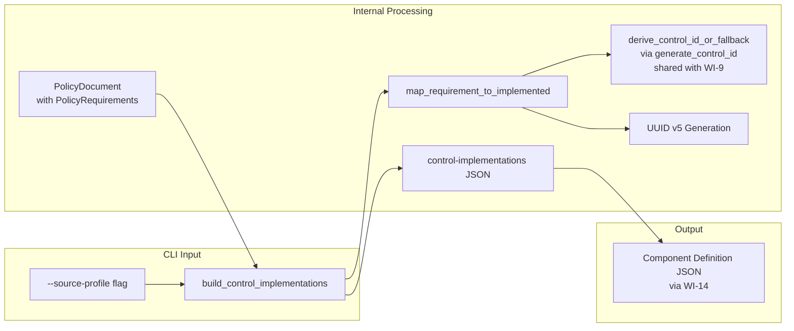
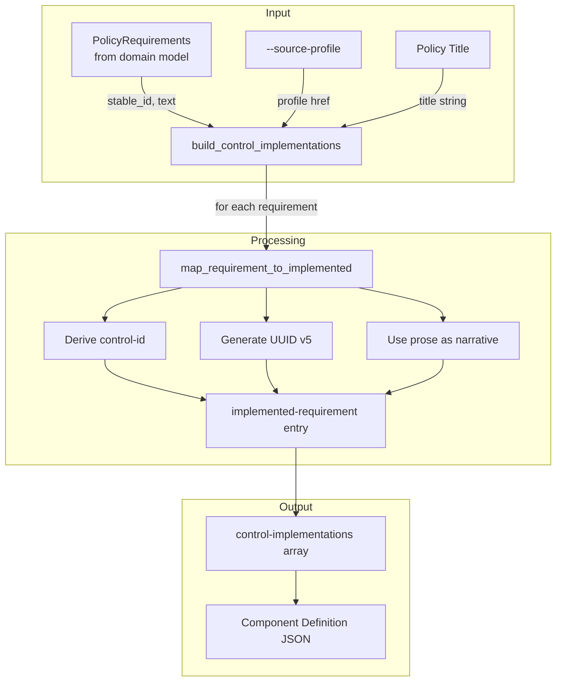
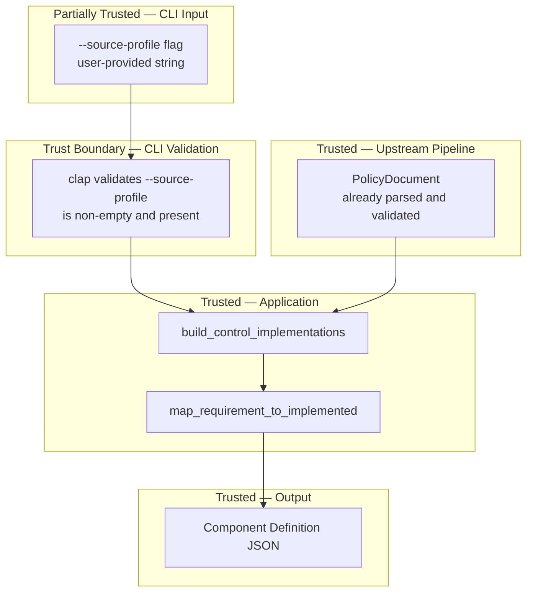

# 015-sec-component-implemented-requirements

> **Document Type:** Security Review (Lightweight)
> **Audience:** LLM agents, human reviewers
> **Status:** Draft
> **Last Updated:** 2026-02-11 <!-- @auto -->
> **Reviewer:** Brian Luby <!-- @human-required -->
> **Risk Level:** Low <!-- @human-required -->

---

## Review Tier Legend

| Marker | Tier | Speckit Behavior |
|--------|------|------------------|
| 🔴 `@human-required` | Human Generated | Prompt human to author; blocks until complete |
| 🟡 `@human-review` | LLM + Human Review | LLM drafts → prompt human to confirm/edit; blocks until confirmed |
| 🟢 `@llm-autonomous` | LLM Autonomous | LLM completes; no prompt; logged for audit |
| ⚪ `@auto` | Auto-generated | System fills (timestamps, links); no prompt |

---

## Severity Definitions

| Level | Label | Definition |
|-------|-------|------------|
| 🔴 | **Critical** | Immediate exploitation risk; data breach or system compromise likely |
| 🟠 | **High** | Significant risk; exploitation possible with moderate effort |
| 🟡 | **Medium** | Notable risk; exploitation requires specific conditions |
| 🟢 | **Low** | Minor risk; limited impact or unlikely exploitation |

---

## Linkage ⚪ `@auto`

| Document | ID | Relationship |
|----------|-----|--------------|
| Parent PRD | [015-prd-component-implemented-requirements.md](../PRD/015-prd-component-implemented-requirements.md) | Feature being reviewed |
| Architecture Review | [015-ar-component-implemented-requirements.md](../AR/015-ar-component-implemented-requirements.md) | Technical implementation |

---

## Purpose

This is a **lightweight security review** intended to catch obvious security concerns early in the product lifecycle. It is NOT a comprehensive threat model. Full threat modeling should occur during implementation when infrastructure-as-code and concrete implementations exist.

**This review answers three questions:**
1. What does this feature expose to attackers?
2. What data does it touch, and how sensitive is that data?
3. What's the impact if something goes wrong?

**Scope of this review:**
- ✅ Attack surface identification
- ✅ Data classification
- ✅ High-level CIA assessment
- ❌ Detailed threat enumeration (deferred to implementation)
- ❌ Penetration testing (deferred to implementation)
- ❌ Compliance audit (separate process)

---

## Feature Security Summary

### One-line Summary 🔴 `@human-required`
> Maps PolicyRequirements from the domain model to OSCAL `implemented-requirements` entries within the Component Definition, including a `--source-profile` CLI flag for the baseline profile reference — an internal data transformation that extends WI-14's component structure with control-level mapping.

### Risk Assessment 🔴 `@human-required`
> **Risk Level:** Low
> **Justification:** Internal data transformation consuming already-parsed PolicyRequirement objects. The `--source-profile` CLI flag introduces a user-provided string that is stored as a reference (href) but never fetched, resolved, or executed. No new file I/O beyond the CLI flag. The primary security concern is data integrity of the bidirectional linking between policy requirements and control-ids.

---

## Attack Surface Analysis

### Exposure Points 🟡 `@human-review`

| Exposure Type | Details | Authentication | Authorization | Notes |
|---------------|---------|----------------|---------------|-------|
| User Input Field | `--source-profile <path>` CLI flag | — | — | User-provided string stored as `source` href reference; never fetched or validated against the filesystem |
| **None** | **No network endpoints, webhooks, queues, or scheduled jobs** | — | — | Local CLI tool only |

### Attack Surface Diagram 🟢 `@llm-autonomous`

### Exposure Checklist 🟢 `@llm-autonomous`

- [x] **Internet-facing endpoints require authentication** — N/A; no internet-facing endpoints
- [x] **No sensitive data in URL parameters** — N/A; local CLI tool
- [x] **File uploads validated** — N/A; no file I/O in this feature
- [x] **Rate limiting configured** — N/A; no endpoints
- [x] **CORS policy is restrictive** — N/A; no web server
- [x] **No debug/admin endpoints exposed** — N/A; no endpoints
- [x] **Webhooks validate signatures** — N/A; no webhooks

---

## Data Flow Analysis

### Data Inventory 🟡 `@human-review`

| Data Element | PRD Entity | Classification | Source | Destination | Retention | Encrypted Rest | Encrypted Transit | Residency |
|--------------|------------|----------------|--------|-------------|-----------|----------------|-------------------|-----------|
| Source profile reference | ControlImplementation.source | Internal | `--source-profile` CLI flag | Component Definition JSON (`source` field) | None (in output) | N/A | N/A | In-memory |
| PolicyRequirement text | ImplementedRequirement.description | Internal | Domain model (WI-5/WI-6) | Component Definition JSON (implementation narrative) | None (in output) | N/A | N/A | In-memory |
| Control-id | ImplementedRequirement.control_id | Internal | Derived from requirement stable_id | Component Definition JSON (`control-id` field) | None (in output) | N/A | N/A | In-memory |
| Implemented-requirement UUID | ImplementedRequirement.uuid | Public | Generated (UUID v5) | Component Definition JSON | None (in output) | N/A | N/A | In-memory |
| Control-implementation UUID | ControlImplementation.uuid | Public | Generated (UUID v5) | Component Definition JSON | None (in output) | N/A | N/A | In-memory |
| Control-implementation description | ControlImplementation.description | Internal | Generated from policy title | Component Definition JSON | None (in output) | N/A | N/A | In-memory |

### Data Classification Reference 🟢 `@llm-autonomous`

| Level | Label | Description | Examples | Handling Requirements |
|-------|-------|-------------|----------|----------------------|
| 1 | **Public** | No impact if disclosed | Marketing content, public docs | No special handling |
| 2 | **Internal** | Minor impact if disclosed | Internal configs, non-sensitive logs | Access controls, no public exposure |
| 3 | **Confidential** | Significant impact if disclosed | PII, user data, credentials | Encryption, audit logging, access controls |
| 4 | **Restricted** | Severe impact if disclosed | Payment data, health records, secrets | Encryption, strict access, compliance requirements |

### Data Flow Diagram 🟢 `@llm-autonomous`

### Data Handling Checklist 🟢 `@llm-autonomous`

- [x] **No Restricted data stored unless absolutely required** — No Restricted data involved
- [x] **Confidential data encrypted at rest** — N/A; no Confidential data
- [x] **All data encrypted in transit (TLS 1.2+)** — N/A; no network transit
- [x] **PII has defined retention policy** — N/A; no PII
- [x] **Logs do not contain Confidential/Restricted data** — No logging of requirement content
- [x] **Secrets are not hardcoded** — No secrets involved
- [x] **Data minimization applied** — Only requirement stable_id and text used for mapping
- [x] **Data residency requirements documented** — N/A; in-memory processing only

---

## Third-Party & Supply Chain 🟡 `@human-review`

### New External Services

| Service | Purpose | Data Shared | Communication | Approved? |
|---------|---------|-------------|---------------|-----------|
| None | No external services | — | — | N/A |

### New Libraries/Dependencies

| Library | Version | License | Purpose | Security Check |
|---------|---------|---------|---------|----------------|
| None | — | — | No new dependencies; reuses uuid, serde_json, clap from prior WIs | N/A |

### Supply Chain Checklist

- [x] **All new services use encrypted communication** — N/A; no services
- [x] **Service agreements/ToS reviewed** — N/A
- [x] **Dependencies have acceptable licenses** — No new dependencies
- [x] **Dependencies are actively maintained** — No new dependencies
- [x] **No known critical vulnerabilities** — No new dependencies

---

## CIA Impact Assessment

If this feature is compromised, what's the impact?

### Confidentiality 🟡 `@human-review`

> **What could be disclosed?**

| Asset at Risk | Classification | Exposure Scenario | Impact | Likelihood |
|---------------|----------------|-------------------|--------|------------|
| PolicyRequirement text in implementation narratives | Internal | Requirement prose (which may contain sensitive operational details) persists in Component Definition output; if output is shared externally, internal security procedures are revealed | Low | Low |
| Source profile path | Internal | `--source-profile` value in output reveals which compliance baseline the organization uses | Low | Low |

**Confidentiality Risk Level:** Low

### Integrity 🟡 `@human-review`

> **What could be modified or corrupted?**

| Asset at Risk | Modification Scenario | Impact | Likelihood |
|---------------|----------------------|--------|------------|
| Control-id to requirement mapping | Incorrect `derive_control_id_or_fallback` mapping causes implemented-requirements to reference wrong control-ids, breaking compliance traceability | Medium | Low |
| UUID determinism | Non-deterministic UUID generation breaks stability across re-conversions; diffs become meaningless | Low | Very Low |
| Source profile reference | `--source-profile` value stored incorrectly or truncated, causing downstream consumers to misidentify the baseline | Low | Very Low |
| Implementation narrative fidelity | Requirement prose transformed or truncated, misrepresenting the source requirement | Low | Very Low |

**Integrity Risk Level:** Low

### Availability 🟡 `@human-review`

> **What could be disrupted?**

| Service/Function | Disruption Scenario | Impact | Likelihood |
|------------------|---------------------|--------|------------|
| Implemented-requirement generation | PolicyDocument with very large number of requirements (thousands) causes slow iteration and large JSON output | Low | Very Low |

**Availability Risk Level:** Low

### CIA Summary 🟢 `@llm-autonomous`

| Dimension | Risk Level | Primary Concern | Mitigation Priority |
|-----------|------------|-----------------|---------------------|
| **Confidentiality** | Low | Requirement prose in output inherits source sensitivity | Low |
| **Integrity** | Low | Control-id mapping accuracy and UUID determinism | Medium |
| **Availability** | Low | No plausible availability risk for expected input sizes | Low |

**Overall CIA Risk:** Low — *Internal data transformation extending the Component Definition with implemented-requirements. Integrity is the primary concern: ensuring correct control-id mapping and faithful preservation of requirement prose as implementation narratives. The `--source-profile` CLI flag introduces a user-provided string but it is stored as-is, never fetched or resolved.*

---

## Trust Boundaries 🟡 `@human-review`

### Trust Boundary Checklist 🟢 `@llm-autonomous`

- [x] **All input from untrusted sources is validated** — `--source-profile` validated for presence by clap; stored as-is (never fetched); PolicyDocument is already-validated domain model data
- [x] **External API responses are validated** — N/A; no external API calls
- [x] **Authorization checked at data access, not just entry point** — N/A; no authorization model
- [x] **Service-to-service calls are authenticated** — N/A; no service calls

---

## Known Risks & Mitigations 🟡 `@human-review`

| ID | Risk Description | Severity | Mitigation | Status | Owner |
|----|------------------|----------|------------|--------|-------|
| R1 | Control-id scheme diverges between Catalog builder (WI-9) and implemented-requirements mapping, causing cross-artifact inconsistency | Low | Both WI-9 and WI-15 use the same `generate_control_id` + `resolve_abbreviation` functions from `catalog.rs`, ensuring identical control-ids for the same document | Mitigated | Brian Luby |
| R2 | `--source-profile` value is stored in output as-is; if it contains a path with sensitive directory structure, that structure appears in the output | Low | Standard CLI behavior; users control what values they provide; output inherits sensitivity of inputs | Accepted | Brian Luby |
| R3 | Requirement prose used directly as implementation narrative may contain content that is misleading in the implemented-requirement context | Low | Direct prose use is auditable and faithful to source; users can edit output; AI-generated paraphrasing would introduce non-determinism | Accepted | Brian Luby |

### Risk Acceptance 🔴 `@human-required`

| Risk ID | Accepted By | Date | Justification | Review Date |
|---------|-------------|------|---------------|-------------|
| R2 | Brian Luby | 2026-02-11 | Standard CLI convention; users control inputs | 2026-08-11 |
| R3 | Brian Luby | 2026-02-11 | Direct prose is faithful and deterministic; refinement is a future enhancement | 2026-08-11 |

---

## Security Requirements 🟡 `@human-review`

### Authentication & Authorization

| Req ID | Requirement | PRD AC | Verification Method |
|--------|-------------|--------|---------------------|
| — | N/A — local CLI tool; no authentication or authorization | — | — |

### Data Protection

| Req ID | Requirement | PRD AC | Verification Method |
|--------|-------------|--------|---------------------|
| SEC-1 | Implementation narrative shall faithfully represent the source PolicyRequirement text without injecting additional data | AC-3 | Unit Test |
| SEC-2 | No arbitrary data shall be stored in OSCAL `remarks` fields; narratives shall use `description` field | — | Unit Test |

### Input Validation

| Req ID | Requirement | PRD AC | Verification Method |
|--------|-------------|--------|---------------------|
| SEC-3 | `--source-profile` flag shall be required when `--strategy component` is used; omission shall produce a descriptive error | AC-5 | Unit Test |
| SEC-4 | `--source-profile` with an empty string shall produce a descriptive error | AC-5 (EC-4) | Unit Test |
| SEC-5 | Empty PolicyRequirement text shall produce a placeholder description, not a crash | AC-3 (EC-3) | Unit Test |

### Operational Security

| Req ID | Requirement | PRD AC | Verification Method |
|--------|-------------|--------|---------------------|
| — | N/A — no operational infrastructure | — | — |

---

## Compliance Considerations 🟡 `@human-review`

| Regulation | Applicable? | Relevant Requirements | N/A Justification |
|------------|-------------|----------------------|-------------------|
| GDPR | N/A | — | Local CLI tool; no PII collection, processing, or storage |
| CCPA | N/A | — | No personal data handling |
| SOC 2 | N/A | — | No hosted service or infrastructure |
| HIPAA | N/A | — | No health data |
| PCI-DSS | N/A | — | No payment data |
| Other | N/A | — | FORGE is a local development tool with no network services |

---

## Review Findings

### Issues Identified 🟡 `@human-review`

| ID | Finding | Severity | Category | Recommendation | Status |
|----|---------|----------|----------|----------------|--------|
| — | No security issues identified | — | — | — | — |

### Positive Observations 🟢 `@llm-autonomous`

- Shared `generate_control_id` + `resolve_abbreviation` utilities (from `catalog.rs`) ensure cross-artifact consistency between Catalog controls and Component implemented-requirements
- Deterministic UUID v5 with dedicated namespaces for both control-implementation and implemented-requirement elements prevents UUID collisions
- Requirement prose is used directly as the implementation narrative — no non-deterministic transformation that could introduce inconsistency
- `--source-profile` is stored as a reference (href), not as embedded content — FORGE never fetches or resolves the profile, eliminating network-related attack vectors
- CLI validation via clap enforces that `--source-profile` is provided when `--strategy component` is used, preventing structurally incomplete output

---

## Open Questions 🟡 `@human-review`

- [x] **Q1:** No open questions — mapping approach and CLI validation are well-defined

---

## Changelog ⚪ `@auto`

| Version | Date | Author | Changes |
|---------|------|--------|---------|
| 0.1 | 2026-02-11 | LLM (Claude) | Initial review |

---

## Review Sign-off 🔴 `@human-required`

| Role | Name | Date | Decision |
|------|------|------|----------|
| Security Reviewer | Brian Luby | 2026-02-11 | [Approved / Approved with conditions / Rejected] |
| Feature Owner | Brian Luby | 2026-02-11 | [Acknowledged] |

### Conditions for Approval (if applicable) 🔴 `@human-required`

- [ ] None — Low risk feature with no open issues

---

## Security Requirements Traceability 🟢 `@llm-autonomous`

| SEC Req ID | PRD Req ID | PRD AC ID | Test Type | Test Location |
|------------|------------|-----------|-----------|---------------|
| SEC-1 | M-8 | AC-3 | Unit | tests/implemented_requirements_test.rs |
| SEC-2 | — (Parent PRD M-11) | — | Unit | tests/implemented_requirements_test.rs |
| SEC-3 | M-9 | AC-5 | Unit | tests/cli_test.rs |
| SEC-4 | M-9 | AC-5 (EC-4) | Unit | tests/cli_test.rs |
| SEC-5 | M-8 | AC-3 (EC-3) | Unit | tests/implemented_requirements_test.rs |

---

## Review Checklist 🟢 `@llm-autonomous`

Before marking as Approved:
- [x] Attack surface documented with auth/authz status for each exposure
- [x] Exposure Points table has no contradictory rows (None vs. actual endpoints)
- [x] All PRD Data Model entities appear in Data Inventory
- [x] All data elements are classified using the 4-tier model
- [x] Third-party dependencies and services are listed
- [x] CIA impact is assessed with Low/Medium/High ratings
- [x] Trust boundaries are identified
- [x] Security requirements have verification methods specified
- [x] Security requirements trace to PRD ACs where applicable
- [x] No Critical/High findings remain Open
- [x] Compliance N/A items have justification
- [x] Risk acceptance has named approver and review date
