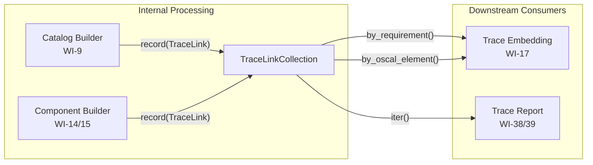
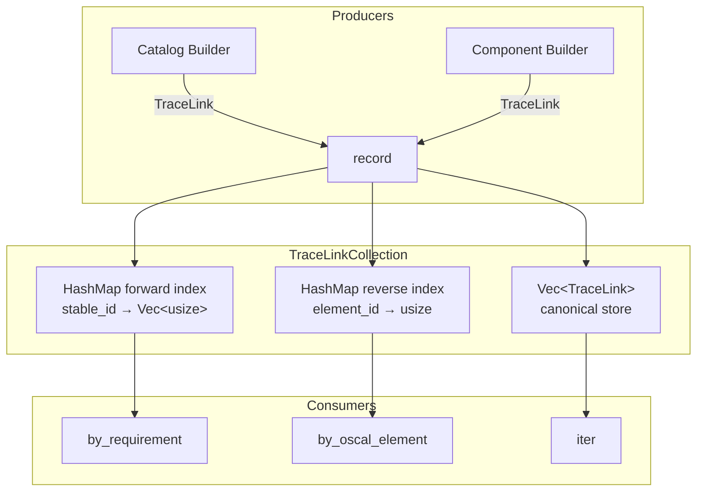
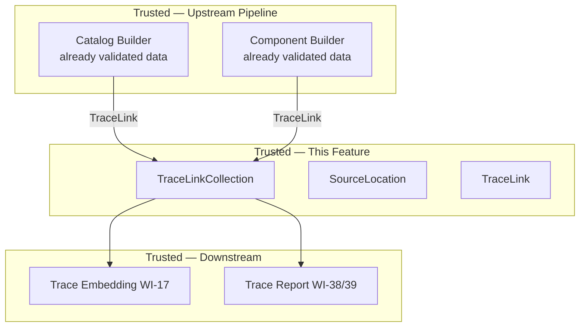

# 016-sec-traceability-model

> **Document Type:** Security Review (Lightweight)
> **Audience:** LLM agents, human reviewers
> **Status:** Draft
> **Last Updated:** 2026-02-11 <!-- @auto -->
> **Reviewer:** Brian Luby <!-- @human-required -->
> **Risk Level:** Low <!-- @human-required -->

---

## Review Tier Legend

| Marker | Tier | Speckit Behavior |
|--------|------|------------------|
| 🔴 `@human-required` | Human Generated | Prompt human to author; blocks until complete |
| 🟡 `@human-review` | LLM + Human Review | LLM drafts → prompt human to confirm/edit; blocks until confirmed |
| 🟢 `@llm-autonomous` | LLM Autonomous | LLM completes; no prompt; logged for audit |
| ⚪ `@auto` | Auto-generated | System fills (timestamps, links); no prompt |

---

## Severity Definitions

| Level | Label | Definition |
|-------|-------|------------|
| 🔴 | **Critical** | Immediate exploitation risk; data breach or system compromise likely |
| 🟠 | **High** | Significant risk; exploitation possible with moderate effort |
| 🟡 | **Medium** | Notable risk; exploitation requires specific conditions |
| 🟢 | **Low** | Minor risk; limited impact or unlikely exploitation |

---

## Linkage ⚪ `@auto`

| Document | ID | Relationship |
|----------|-----|--------------|
| Parent PRD | [016-prd-traceability-model.md](../PRD/016-prd-traceability-model.md) | Feature being reviewed |
| Architecture Review | [016-ar-traceability-model.md](../AR/016-ar-traceability-model.md) | Technical implementation |

---

## Purpose

This is a **lightweight security review** intended to catch obvious security concerns early in the product lifecycle. It is NOT a comprehensive threat model. Full threat modeling should occur during implementation when infrastructure-as-code and concrete implementations exist.

**This review answers three questions:**
1. What does this feature expose to attackers?
2. What data does it touch, and how sensitive is that data?
3. What's the impact if something goes wrong?

**Scope of this review:**
- ✅ Attack surface identification
- ✅ Data classification
- ✅ High-level CIA assessment
- ❌ Detailed threat enumeration (deferred to implementation)
- ❌ Penetration testing (deferred to implementation)
- ❌ Compliance audit (separate process)

---

## Feature Security Summary

### One-line Summary 🔴 `@human-required`
> Internal data model (`TraceLink`, `SourceLocation`, `TraceLinkCollection`) that maps source policy requirements to generated OSCAL elements — purely in-memory bookkeeping with no external exposure, no file I/O, and no network activity.

### Risk Assessment 🔴 `@human-required`
> **Risk Level:** Low
> **Justification:** Entirely internal data structures using standard library types (`Vec`, `HashMap`, `PathBuf`). No external dependencies, no file I/O, no network activity, no user input beyond what has already been validated by upstream pipeline stages. The only security-relevant aspects are memory usage for large traceability graphs and ensuring the data model does not inadvertently expose source file paths.

---

## Attack Surface Analysis

### Exposure Points 🟡 `@human-review`

| Exposure Type | Details | Authentication | Authorization | Notes |
|---------------|---------|----------------|---------------|-------|
| **None** | **Feature has no external exposure** | — | — | Internal data structures consumed by downstream WIs (WI-17, WI-38/39); no user-facing input or output |

### Attack Surface Diagram 🟢 `@llm-autonomous`

### Exposure Checklist 🟢 `@llm-autonomous`

- [x] **Internet-facing endpoints require authentication** — N/A; no internet-facing endpoints
- [x] **No sensitive data in URL parameters** — N/A; no URLs
- [x] **File uploads validated** — N/A; no file I/O
- [x] **Rate limiting configured** — N/A; no endpoints
- [x] **CORS policy is restrictive** — N/A; no web server
- [x] **No debug/admin endpoints exposed** — N/A; no endpoints
- [x] **Webhooks validate signatures** — N/A; no webhooks

---

## Data Flow Analysis

### Data Inventory 🟡 `@human-review`

| Data Element | PRD Entity | Classification | Source | Destination | Retention | Encrypted Rest | Encrypted Transit | Residency |
|--------------|------------|----------------|--------|-------------|-----------|----------------|-------------------|-----------|
| Requirement stable_id | TraceLink.requirement_stable_id | Internal | Domain model (WI-7) | TraceLinkCollection (in-memory) | None (process lifetime) | N/A | N/A | In-memory |
| OSCAL JSON path | TraceLink.oscal_json_path | Internal | Catalog/Component builder | TraceLinkCollection (in-memory) | None (process lifetime) | N/A | N/A | In-memory |
| OSCAL element ID | TraceLink.oscal_element_id | Public | Generated UUID from builders | TraceLinkCollection (in-memory) | None (process lifetime) | N/A | N/A | In-memory |
| Source file path | SourceLocation.file_path | Internal | DocumentMetadata.source_path | TraceLinkCollection (in-memory) | None (process lifetime) | N/A | N/A | In-memory |
| Source section title | SourceLocation.section_title | Internal | PolicySection.title | TraceLinkCollection (in-memory) | None (process lifetime) | N/A | N/A | In-memory |
| Source line number | SourceLocation.line_number | Public | PolicyRequirement.source_line | TraceLinkCollection (in-memory) | None (process lifetime) | N/A | N/A | In-memory |

### Data Classification Reference 🟢 `@llm-autonomous`

| Level | Label | Description | Examples | Handling Requirements |
|-------|-------|-------------|----------|----------------------|
| 1 | **Public** | No impact if disclosed | Marketing content, public docs | No special handling |
| 2 | **Internal** | Minor impact if disclosed | Internal configs, non-sensitive logs | Access controls, no public exposure |
| 3 | **Confidential** | Significant impact if disclosed | PII, user data, credentials | Encryption, audit logging, access controls |
| 4 | **Restricted** | Severe impact if disclosed | Payment data, health records, secrets | Encryption, strict access, compliance requirements |

### Data Flow Diagram 🟢 `@llm-autonomous`

### Data Handling Checklist 🟢 `@llm-autonomous`

- [x] **No Restricted data stored unless absolutely required** — No Restricted data involved
- [x] **Confidential data encrypted at rest** — N/A; no Confidential data; all in-memory
- [x] **All data encrypted in transit (TLS 1.2+)** — N/A; no network transit
- [x] **PII has defined retention policy** — N/A; no PII
- [x] **Logs do not contain Confidential/Restricted data** — Only trace link count logged at INFO level
- [x] **Secrets are not hardcoded** — No secrets involved
- [x] **Data minimization applied** — Only fields needed for source-to-OSCAL mapping are stored
- [x] **Data residency requirements documented** — N/A; in-memory only during process lifetime

---

## Third-Party & Supply Chain 🟡 `@human-review`

### New External Services

| Service | Purpose | Data Shared | Communication | Approved? |
|---------|---------|-------------|---------------|-----------|
| None | No external services | — | — | N/A |

### New Libraries/Dependencies

| Library | Version | License | Purpose | Security Check |
|---------|---------|---------|---------|----------------|
| None | — | — | Uses only std library (HashMap, Vec, PathBuf) plus serde/thiserror already in project | N/A |

### Supply Chain Checklist

- [x] **All new services use encrypted communication** — N/A; no services
- [x] **Service agreements/ToS reviewed** — N/A
- [x] **Dependencies have acceptable licenses** — No new dependencies
- [x] **Dependencies are actively maintained** — No new dependencies
- [x] **No known critical vulnerabilities** — No new dependencies

---

## CIA Impact Assessment

If this feature is compromised, what's the impact?

### Confidentiality 🟡 `@human-review`

> **What could be disclosed?**

| Asset at Risk | Classification | Exposure Scenario | Impact | Likelihood |
|---------------|----------------|-------------------|--------|------------|
| Source file paths | Internal | `SourceLocation.file_path` records absolute paths to policy documents on the user's filesystem; if trace data is serialized and shared externally (via WI-17 embedding or WI-38/39 reports), local filesystem paths could be exposed | Low | Low |
| Section titles | Internal | `SourceLocation.section_title` reveals internal policy document structure | Low | Low |

**Confidentiality Risk Level:** Low

### Integrity 🟡 `@human-review`

> **What could be modified or corrupted?**

| Asset at Risk | Modification Scenario | Impact | Likelihood |
|---------------|----------------------|--------|------------|
| Source-to-OSCAL mapping accuracy | Incorrect TraceLink data (wrong requirement_stable_id or oscal_element_id) causes traceability to point to wrong elements; undermines compliance audit trail | Medium | Low |
| Duplicate element detection | `record()` fails to reject duplicate oscal_element_id, allowing multiple requirements to claim the same OSCAL element; breaks one-to-one reverse mapping | Low | Very Low |
| TraceLinkCollection index consistency | Internal index corruption (stale pointers into Vec) causes incorrect lookup results | Low | Very Low |

**Integrity Risk Level:** Low

### Availability 🟡 `@human-review`

> **What could be disrupted?**

| Service/Function | Disruption Scenario | Impact | Likelihood |
|------------------|---------------------|--------|------------|
| TraceLinkCollection memory usage | Very large policy document with thousands of requirements causes memory exhaustion from Vec + two HashMap indexes | Low | Very Low |

**Availability Risk Level:** Low

### CIA Summary 🟢 `@llm-autonomous`

| Dimension | Risk Level | Primary Concern | Mitigation Priority |
|-----------|------------|-----------------|---------------------|
| **Confidentiality** | Low | Source file paths stored in SourceLocation may reveal filesystem structure if trace data is externalized | Low |
| **Integrity** | Low | Correct source-to-OSCAL mapping; duplicate element_id detection | Medium |
| **Availability** | Low | Memory usage for large traceability graphs | Low |

**Overall CIA Risk:** Low — *Purely internal data model with no external exposure. Integrity is the primary concern: ensuring TraceLinks accurately map requirements to OSCAL elements. The data model uses standard library types with well-understood behavior. Memory usage scales linearly with document size, and HashMap auto-resizes.*

---

## Trust Boundaries 🟡 `@human-review`

### Trust Boundary Checklist 🟢 `@llm-autonomous`

- [x] **All input from untrusted sources is validated** — All input comes from trusted upstream pipeline stages (Catalog builder, Component builder); no direct untrusted input
- [x] **External API responses are validated** — N/A; no external API calls
- [x] **Authorization checked at data access, not just entry point** — N/A; no authorization model
- [x] **Service-to-service calls are authenticated** — N/A; no service calls

---

## Known Risks & Mitigations 🟡 `@human-review`

| ID | Risk Description | Severity | Mitigation | Status | Owner |
|----|------------------|----------|------------|--------|-------|
| R1 | Source file paths in SourceLocation contain absolute filesystem paths that could reveal organizational directory structure if trace data is externalized | Low | Trace data is in-memory only in this WI; downstream WI-17 (embedding) should consider path sanitization if trace data is embedded in OSCAL output | Open | Brian Luby |
| R2 | Memory growth from large traceability graphs (thousands of trace links with dual HashMap indexes) | Low | Memory usage scales linearly (O(n) for Vec + O(n) for each HashMap); HashMap auto-resizes; 10,000+ trace links are trivial for modern systems | Mitigated | Brian Luby |
| R3 | Stale index entries in HashMap if Vec is modified after index creation | Low | Vec is append-only by design; indexes are only added, never removed; `record()` is the only mutation method | Mitigated | Brian Luby |

### Risk Acceptance 🔴 `@human-required`

| Risk ID | Accepted By | Date | Justification | Review Date |
|---------|-------------|------|---------------|-------------|
| R1 | Brian Luby | 2026-02-11 | In-memory only for this WI; path sanitization is WI-17's concern when externalizing trace data | 2026-08-11 |

---

## Security Requirements 🟡 `@human-review`

### Authentication & Authorization

| Req ID | Requirement | PRD AC | Verification Method |
|--------|-------------|--------|---------------------|
| — | N/A — internal data model with no authentication or authorization | — | — |

### Data Protection

| Req ID | Requirement | PRD AC | Verification Method |
|--------|-------------|--------|---------------------|
| SEC-1 | TraceLinkCollection shall not store data beyond what is needed for source-to-OSCAL mapping (requirement_stable_id, oscal_element_id, oscal_json_path, source_location) | AC-1, AC-2 | Unit Test |
| SEC-2 | TraceLink instances shall be immutable after creation (append-only collection) | — | Unit Test + Code Review |

### Input Validation

| Req ID | Requirement | PRD AC | Verification Method |
|--------|-------------|--------|---------------------|
| SEC-3 | `record()` shall reject duplicate oscal_element_id values with a `TraceError::DuplicateElement` error | AC-3 | Unit Test |
| SEC-4 | `by_requirement()` shall return an empty slice for unknown stable_ids, not an error or panic | AC-4, AC-5 | Unit Test |
| SEC-5 | `by_oscal_element()` shall return `None` for unknown element_ids, not an error or panic | AC-4, AC-5 | Unit Test |

### Operational Security

| Req ID | Requirement | PRD AC | Verification Method |
|--------|-------------|--------|---------------------|
| — | N/A — no operational infrastructure | — | — |

---

## Compliance Considerations 🟡 `@human-review`

| Regulation | Applicable? | Relevant Requirements | N/A Justification |
|------------|-------------|----------------------|-------------------|
| GDPR | N/A | — | Local CLI tool; internal data model with no PII |
| CCPA | N/A | — | No personal data handling |
| SOC 2 | N/A | — | No hosted service or infrastructure |
| HIPAA | N/A | — | No health data |
| PCI-DSS | N/A | — | No payment data |
| Other | N/A | — | FORGE is a local development tool with no network services |

---

## Review Findings

### Issues Identified 🟡 `@human-review`

| ID | Finding | Severity | Category | Recommendation | Status |
|----|---------|----------|----------|----------------|--------|
| F1 | SourceLocation stores absolute file paths which could leak filesystem structure if trace data is later externalized | Low | Confidentiality | WI-17 (trace embedding) should evaluate whether to sanitize or relativize file paths before embedding in OSCAL output | Open |

### Positive Observations 🟢 `@llm-autonomous`

- Zero external dependencies — uses only standard library types (Vec, HashMap, PathBuf), minimizing supply chain risk
- Append-only Vec with immutable TraceLink instances eliminates mutation-related bugs and makes the data model thread-safe for read access
- Duplicate element_id detection via `record()` catches generation bugs early rather than producing silently incorrect traceability data
- Dual HashMap indexes provide O(1) bidirectional lookup without introducing a graph library dependency
- TraceLinkCollection is independent of OSCAL serialization format (JSON/XML/YAML), reducing coupling and preventing format-specific vulnerabilities

---

## Open Questions 🟡 `@human-review`

- [x] **Q1:** No open questions blocking this review — path sanitization concern (F1) is deferred to WI-17

---

## Changelog ⚪ `@auto`

| Version | Date | Author | Changes |
|---------|------|--------|---------|
| 0.1 | 2026-02-11 | LLM (Claude) | Initial review |

---

## Review Sign-off 🔴 `@human-required`

| Role | Name | Date | Decision |
|------|------|------|----------|
| Security Reviewer | Brian Luby | 2026-02-11 | [Approved / Approved with conditions / Rejected] |
| Feature Owner | Brian Luby | 2026-02-11 | [Acknowledged] |

### Conditions for Approval (if applicable) 🔴 `@human-required`

- [ ] None — Low risk internal data model with no external exposure

---

## Security Requirements Traceability 🟢 `@llm-autonomous`

| SEC Req ID | PRD Req ID | PRD AC ID | Test Type | Test Location |
|------------|------------|-----------|-----------|---------------|
| SEC-1 | M-1, M-2 | AC-1, AC-2 | Unit | src/model/trace.rs (#[cfg(test)]) |
| SEC-2 | — (immutability constraint) | — | Unit + Code Review | src/model/trace.rs (#[cfg(test)]) |
| SEC-3 | M-5 | AC-3 | Unit | src/model/trace.rs (#[cfg(test)]) |
| SEC-4 | M-4 | AC-4, AC-5 | Unit | src/model/trace.rs (#[cfg(test)]) |
| SEC-5 | M-5 | AC-4, AC-5 | Unit | src/model/trace.rs (#[cfg(test)]) |

---

## Review Checklist 🟢 `@llm-autonomous`

Before marking as Approved:
- [x] Attack surface documented with auth/authz status for each exposure
- [x] Exposure Points table has no contradictory rows (None vs. actual endpoints)
- [x] All PRD Data Model entities appear in Data Inventory
- [x] All data elements are classified using the 4-tier model
- [x] Third-party dependencies and services are listed
- [x] CIA impact is assessed with Low/Medium/High ratings
- [x] Trust boundaries are identified
- [x] Security requirements have verification methods specified
- [x] Security requirements trace to PRD ACs where applicable
- [x] No Critical/High findings remain Open
- [x] Compliance N/A items have justification
- [x] Risk acceptance has named approver and review date
