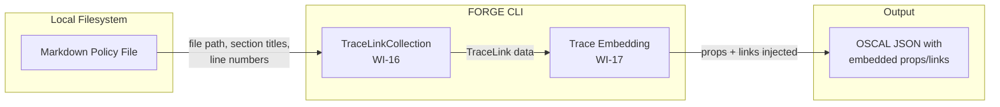
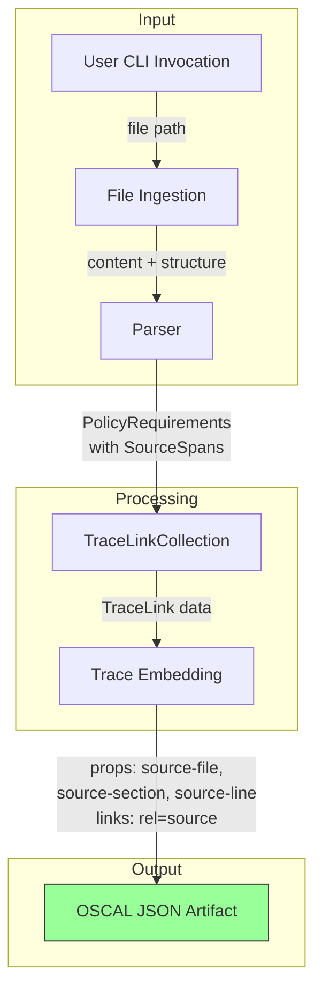
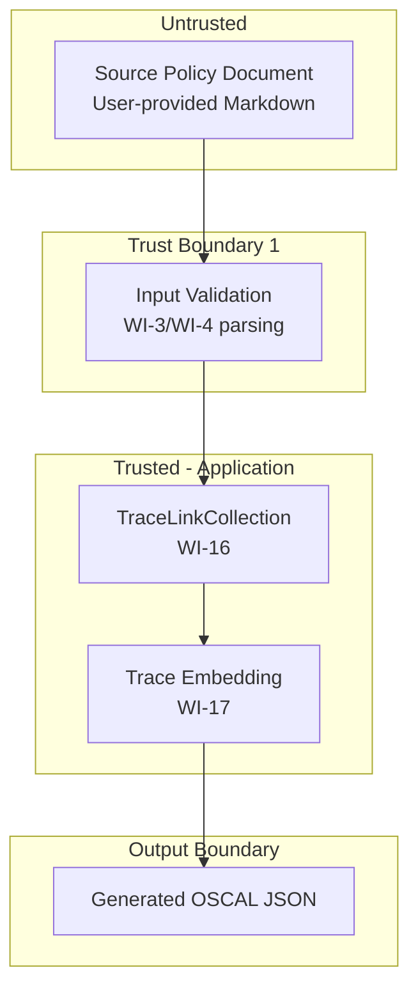

# 017-sec-traceability-embedding

> **Document Type:** Security Review (Lightweight)
> **Audience:** LLM agents, human reviewers
> **Status:** Draft
> **Last Updated:** 2026-02-11 <!-- @auto -->
> **Reviewer:** Brian Luby <!-- @human-required -->
> **Risk Level:** Low <!-- @human-required -->

---

## Review Tier Legend

| Marker | Tier | Speckit Behavior |
|--------|------|------------------|
| :red_circle: `@human-required` | Human Generated | Prompt human to author; blocks until complete |
| :yellow_circle: `@human-review` | LLM + Human Review | LLM drafts -> prompt human to confirm/edit; blocks until confirmed |
| :green_circle: `@llm-autonomous` | LLM Autonomous | LLM completes; no prompt; logged for audit |
| :white_circle: `@auto` | Auto-generated | System fills (timestamps, links); no prompt |

---

## Severity Definitions

| Level | Label | Definition |
|-------|-------|------------|
| :red_circle: | **Critical** | Immediate exploitation risk; data breach or system compromise likely |
| :orange_circle: | **High** | Significant risk; exploitation possible with moderate effort |
| :yellow_circle: | **Medium** | Notable risk; exploitation requires specific conditions |
| :green_circle: | **Low** | Minor risk; limited impact or unlikely exploitation |

---

## Linkage :white_circle: `@auto`

| Document | ID | Relationship |
|----------|-----|--------------|
| Parent PRD | [017-prd-traceability-embedding.md](../PRD/017-prd-traceability-embedding.md) | Feature being reviewed |
| Architecture Review | [017-ar-traceability-embedding.md](../AR/017-ar-traceability-embedding.md) | Technical implementation |

---

## Purpose

This is a **lightweight security review** intended to catch obvious security concerns early in the product lifecycle. It is NOT a comprehensive threat model. Full threat modeling should occur during implementation when infrastructure-as-code and concrete implementations exist.

**This review answers three questions:**
1. What does this feature expose to attackers?
2. What data does it touch, and how sensitive is that data?
3. What's the impact if something goes wrong?

**Scope of this review:**
- :white_check_mark: Attack surface identification
- :white_check_mark: Data classification
- :white_check_mark: High-level CIA assessment
- :x: Detailed threat enumeration (deferred to implementation)
- :x: Penetration testing (deferred to implementation)
- :x: Compliance audit (separate process)

---

## Feature Security Summary

### One-line Summary :red_circle: `@human-required`
> WI-17 embeds traceability metadata (source file paths, section titles, line numbers) as OSCAL `prop` and `link` elements into generated OSCAL artifacts. The primary security concern is that crafted source content could inject malicious or misleading property values into OSCAL output, and that source file paths embedded in output may reveal directory structure.

### Risk Assessment :red_circle: `@human-required`
> **Risk Level:** Low
> **Justification:** Local CLI tool with no network exposure; prop/link values are derived from user-provided input files and paths, not from untrusted external sources. Output integrity is the primary concern.

---

## Attack Surface Analysis

### Exposure Points :yellow_circle: `@human-review`

| Exposure Type | Details | Authentication | Authorization | Notes |
|---------------|---------|----------------|---------------|-------|
| User Input Field | Source policy document content (file paths, section titles, line numbers injected into OSCAL props) | -- | -- | Values originate from user-provided Markdown; no external untrusted input |
| **None (Network)** | **No network endpoints, webhooks, or message queues** | -- | -- | Local CLI tool; fully offline |

### Attack Surface Diagram :green_circle: `@llm-autonomous`

### Exposure Checklist :green_circle: `@llm-autonomous`

- [x] **Internet-facing endpoints require authentication** -- N/A: no internet-facing endpoints (local CLI)
- [x] **No sensitive data in URL parameters** -- N/A: no URLs or HTTP endpoints
- [x] **File uploads validated** -- N/A: no file uploads; input is a local file path provided by the user
- [x] **Rate limiting configured** -- N/A: no public endpoints
- [x] **CORS policy is restrictive** -- N/A: no web service
- [x] **No debug/admin endpoints exposed** -- N/A: no endpoints
- [x] **Webhooks validate signatures** -- N/A: no webhooks

---

## Data Flow Analysis

### Data Inventory :yellow_circle: `@human-review`

| Data Element | PRD Entity | Classification | Source | Destination | Retention | Encrypted Rest | Encrypted Transit | Residency |
|--------------|------------|----------------|--------|-------------|-----------|----------------|-------------------|-----------|
| Source file path | TraceLink.source_file | Internal | User CLI argument | OSCAL JSON props | None (transient) | N/A | N/A | Local filesystem |
| Source section title | TraceLink.source_section | Internal | Parsed from Markdown headings | OSCAL JSON props | None (transient) | N/A | N/A | Local filesystem |
| Source line number | TraceLink.source_line | Public | Parsed from Markdown | OSCAL JSON props | None (transient) | N/A | N/A | Local filesystem |
| Link href (file#line) | OSCALLink.href | Internal | Constructed from TraceLink | OSCAL JSON links | None (transient) | N/A | N/A | Local filesystem |

### Data Classification Reference :green_circle: `@llm-autonomous`

| Level | Label | Description | Examples | Handling Requirements |
|-------|-------|-------------|----------|----------------------|
| 1 | **Public** | No impact if disclosed | Line numbers, OSCAL element IDs | No special handling |
| 2 | **Internal** | Minor impact if disclosed | Source file paths, section titles | Access controls, no public exposure |
| 3 | **Confidential** | Significant impact if disclosed | Policy document content | Encryption, audit logging, access controls |
| 4 | **Restricted** | Severe impact if disclosed | N/A for this feature | N/A |

### Data Flow Diagram :green_circle: `@llm-autonomous`

### Data Handling Checklist :green_circle: `@llm-autonomous`

- [x] **No Restricted data stored unless absolutely required** -- No restricted data involved
- [x] **Confidential data encrypted at rest** -- N/A: no persistent storage; transient in-memory processing
- [x] **All data encrypted in transit (TLS 1.2+)** -- N/A: no network transit; local CLI
- [x] **PII has defined retention policy** -- N/A: no PII
- [x] **Logs do not contain Confidential/Restricted data** -- No logging of policy content in trace props
- [x] **Secrets are not hardcoded** -- No secrets involved
- [x] **Data minimization applied** -- Only file path, section title, and line number embedded; no policy content in trace metadata
- [x] **Data residency requirements documented** -- N/A: local filesystem only

---

## Third-Party & Supply Chain :yellow_circle: `@human-review`

### New External Services

| Service | Purpose | Data Shared | Communication | Approved? |
|---------|---------|-------------|---------------|-----------|
| None | No external services introduced | -- | -- | N/A |

### New Libraries/Dependencies

| Library | Version | License | Purpose | Security Check |
|---------|---------|---------|---------|----------------|
| None | -- | -- | No new dependencies; uses existing serde/JSON infrastructure | N/A |

### Supply Chain Checklist

- [x] **All new services use encrypted communication** -- N/A: no new services
- [x] **Service agreements/ToS reviewed** -- N/A: no external services
- [x] **Dependencies have acceptable licenses** -- No new dependencies
- [x] **Dependencies are actively maintained** -- No new dependencies
- [x] **No known critical vulnerabilities** -- No new dependencies

---

## CIA Impact Assessment

### Confidentiality :yellow_circle: `@human-review`

> **What could be disclosed?**

| Asset at Risk | Classification | Exposure Scenario | Impact | Likelihood |
|---------------|----------------|-------------------|--------|------------|
| Source file paths | Internal | Generated OSCAL artifacts shared externally reveal directory structure of the user's filesystem | Low | Medium |
| Section titles from policy documents | Internal | Policy section headings embedded in props could reveal organizational security posture structure | Low | Low |

**Confidentiality Risk Level:** Low

### Integrity :yellow_circle: `@human-review`

> **What could be modified or corrupted?**

| Asset at Risk | Modification Scenario | Impact | Likelihood |
|---------------|----------------------|--------|------------|
| OSCAL prop values | Crafted Markdown source with malicious section titles could inject misleading trace metadata into OSCAL output (e.g., fake source references) | Medium | Low |
| OSCAL link href values | Crafted source file paths with special characters could produce malformed or misleading link hrefs | Low | Low |

**Integrity Risk Level:** Low

### Availability :yellow_circle: `@human-review`

> **What could be disrupted?**

| Service/Function | Disruption Scenario | Impact | Likelihood |
|------------------|---------------------|--------|------------|
| Trace embedding pipeline | Extremely large TraceLinkCollection (hundreds of thousands of links) could slow embedding | Low | Very Low |

**Availability Risk Level:** Low

### CIA Summary :green_circle: `@llm-autonomous`

| Dimension | Risk Level | Primary Concern | Mitigation Priority |
|-----------|------------|-----------------|---------------------|
| **Confidentiality** | Low | Source file paths in generated artifacts reveal directory structure | Low |
| **Integrity** | Low | Crafted source content could inject misleading trace prop values | Medium |
| **Availability** | Low | Large TraceLinkCollections could slow embedding | Low |

**Overall CIA Risk:** Low -- *Local CLI tool embedding user-provided metadata into OSCAL output; no network exposure, no PII, no authentication. Primary concern is output integrity for downstream OSCAL consumers.*

---

## Trust Boundaries :yellow_circle: `@human-review`

### Trust Boundary Checklist :green_circle: `@llm-autonomous`

- [x] **All input from untrusted sources is validated** -- Markdown parsed by WI-3/WI-4 with structure extraction; trace data derived from parsed output
- [x] **External API responses are validated** -- N/A: no external APIs
- [x] **Authorization checked at data access, not just entry point** -- N/A: local CLI, no authorization model
- [x] **Service-to-service calls are authenticated** -- N/A: no services

---

## Known Risks & Mitigations :yellow_circle: `@human-review`

| ID | Risk Description | Severity | Mitigation | Status | Owner |
|----|------------------|----------|------------|--------|-------|
| R1 | Source file paths embedded in OSCAL output reveal user directory structure | Low | Document in user guide that generated artifacts contain source paths; users can use relative paths via CLI | Mitigated | Brian Luby |
| R2 | Crafted Markdown section titles with special characters could produce malformed OSCAL prop values | Low | Prop values are string-typed in OSCAL; serde serialization handles JSON escaping; schema validation (WI-19) catches structural violations | Mitigated | Brian Luby |
| R3 | Source file paths with special characters could produce malformed link href values | Low | URL-encode special characters in link href construction per PRD EC-6; validated by schema validation (WI-19) | Mitigated | Brian Luby |

### Risk Acceptance :red_circle: `@human-required`

| Risk ID | Accepted By | Date | Justification | Review Date |
|---------|-------------|------|---------------|-------------|
| R1 | Brian Luby | 2026-02-11 | Source paths reflect user-provided CLI arguments; inherent to traceability feature | 2026-08-11 |

---

## Security Requirements :yellow_circle: `@human-review`

### Authentication & Authorization

| Req ID | Requirement | PRD AC | Verification Method |
|--------|-------------|--------|---------------------|
| -- | N/A: Local CLI tool; no authentication or authorization | -- | -- |

### Data Protection

| Req ID | Requirement | PRD AC | Verification Method |
|--------|-------------|--------|---------------------|
| SEC-1 | No policy document content (prose text) shall be embedded in trace props; only file paths, section titles, and line numbers | AC-7 (M-7) | Unit Test |
| SEC-2 | Trace metadata shall not appear in OSCAL `remarks` fields | AC-7 (M-7) | Unit Test |

### Input Validation

| Req ID | Requirement | PRD AC | Verification Method |
|--------|-------------|--------|---------------------|
| SEC-3 | Source file paths with special characters (spaces, unicode) must be properly escaped in link href values | AC-2 (M-2), EC-6 | Unit Test |
| SEC-4 | All FORGE trace props must use the FORGE namespace to prevent collisions with NIST-defined prop names | AC-6 (M-6) | Unit Test |

### Operational Security

| Req ID | Requirement | PRD AC | Verification Method |
|--------|-------------|--------|---------------------|
| SEC-5 | All prop name strings must use shared constants (no raw string literals) to prevent typo-induced inconsistencies | -- | Code Review |

---

## Compliance Considerations :yellow_circle: `@human-review`

| Regulation | Applicable? | Relevant Requirements | N/A Justification |
|------------|-------------|----------------------|-------------------|
| GDPR | N/A | -- | No PII processed; local CLI tool; no network, no user accounts |
| CCPA | N/A | -- | No personal information collected or disclosed |
| SOC 2 | N/A | -- | No cloud service; local CLI tool |
| HIPAA | N/A | -- | No health records processed |
| PCI-DSS | N/A | -- | No payment data |
| Other | N/A | -- | No regulatory implications for a local CLI tool |

---

## Review Findings

### Issues Identified :yellow_circle: `@human-review`

| ID | Finding | Severity | Category | Recommendation | Status |
|----|---------|----------|----------|----------------|--------|
| F1 | Source file paths embedded in OSCAL output could reveal directory structure if artifacts are shared externally | Low | Data | Document behavior in user guide; consider offering a `--strip-paths` option in future | Open |

### Positive Observations :green_circle: `@llm-autonomous`

- Trace metadata uses a dedicated FORGE namespace, preventing collisions with NIST-defined prop names
- Policy document prose is not embedded in trace props -- only structural metadata (file, section, line)
- No trace data is placed in OSCAL `remarks` fields, complying with NIST guidance
- No new external dependencies introduced -- uses existing serialization infrastructure
- All prop/link name strings use shared constants, reducing risk of typo-induced inconsistencies

---

## Open Questions :yellow_circle: `@human-review`

- [ ] **Q1:** Should FORGE offer a `--strip-paths` or `--relative-paths` option to avoid embedding absolute filesystem paths in generated artifacts?

---

## Changelog :white_circle: `@auto`

| Version | Date | Author | Changes |
|---------|------|--------|---------|
| 0.1 | 2026-02-11 | LLM (Claude) | Initial review |

---

## Review Sign-off :red_circle: `@human-required`

| Role | Name | Date | Decision |
|------|------|------|----------|
| Security Reviewer | Brian Luby | YYYY-MM-DD | [Approved / Approved with conditions / Rejected] |
| Feature Owner | Brian Luby | YYYY-MM-DD | [Acknowledged] |

### Conditions for Approval (if applicable) :red_circle: `@human-required`

- [ ] Confirm that source file paths in trace props reflect only user-provided CLI argument paths, not resolved absolute paths

---

## Security Requirements Traceability :green_circle: `@llm-autonomous`

| SEC Req ID | PRD Req ID | PRD AC ID | Test Type | Test Location |
|------------|------------|-----------|-----------|---------------|
| SEC-1 | M-7 | AC-7 | Unit | tests/trace_embedding_test.rs |
| SEC-2 | M-7 | AC-7 | Unit | tests/trace_embedding_test.rs |
| SEC-3 | M-2 | AC-2 | Unit | tests/trace_link_test.rs |
| SEC-4 | M-6 | AC-6 | Unit | tests/trace_embedding_test.rs |
| SEC-5 | -- | -- | Code Review | Manual audit |

---

## Review Checklist :green_circle: `@llm-autonomous`

Before marking as Approved:
- [x] Attack surface documented with auth/authz status for each exposure
- [x] Exposure Points table has no contradictory rows (None vs. actual endpoints)
- [x] All PRD Data Model entities appear in Data Inventory
- [x] All data elements are classified using the 4-tier model
- [x] Third-party dependencies and services are listed
- [x] CIA impact is assessed with Low/Medium/High ratings
- [x] Trust boundaries are identified
- [x] Security requirements have verification methods specified
- [x] Security requirements trace to PRD ACs where applicable
- [x] No Critical/High findings remain Open
- [x] Compliance N/A items have justification
- [x] Risk acceptance has named approver and review date
