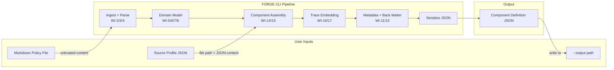
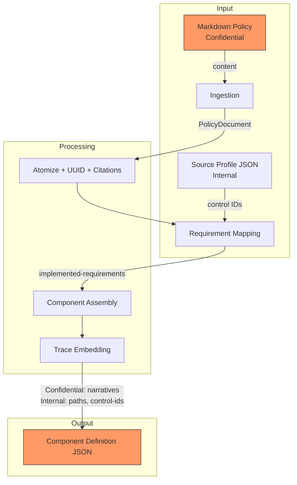
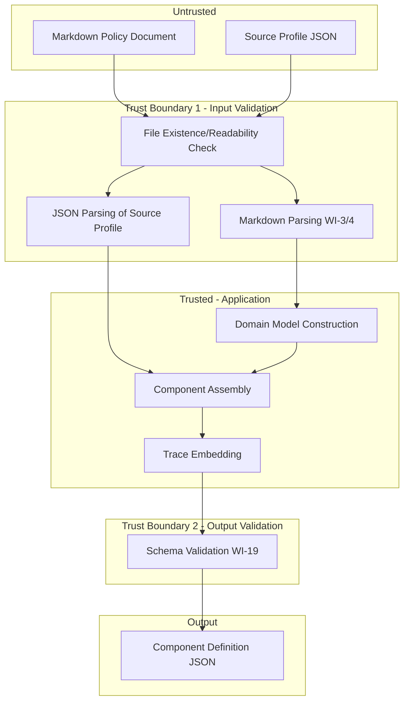

# 018-sec-component-pipeline

> **Document Type:** Security Review (Lightweight)
> **Audience:** LLM agents, human reviewers
> **Status:** Draft
> **Last Updated:** 2026-02-11 <!-- @auto -->
> **Reviewer:** Brian Luby <!-- @human-required -->
> **Risk Level:** Medium <!-- @human-required -->

---

## Review Tier Legend

| Marker | Tier | Speckit Behavior |
|--------|------|------------------|
| :red_circle: `@human-required` | Human Generated | Prompt human to author; blocks until complete |
| :yellow_circle: `@human-review` | LLM + Human Review | LLM drafts -> prompt human to confirm/edit; blocks until confirmed |
| :green_circle: `@llm-autonomous` | LLM Autonomous | LLM completes; no prompt; logged for audit |
| :white_circle: `@auto` | Auto-generated | System fills (timestamps, links); no prompt |

---

## Severity Definitions

| Level | Label | Definition |
|-------|-------|------------|
| :red_circle: | **Critical** | Immediate exploitation risk; data breach or system compromise likely |
| :orange_circle: | **High** | Significant risk; exploitation possible with moderate effort |
| :yellow_circle: | **Medium** | Notable risk; exploitation requires specific conditions |
| :green_circle: | **Low** | Minor risk; limited impact or unlikely exploitation |

---

## Linkage :white_circle: `@auto`

| Document | ID | Relationship |
|----------|-----|--------------|
| Parent PRD | [018-prd-component-pipeline.md](../PRD/018-prd-component-pipeline.md) | Feature being reviewed |
| Architecture Review | [018-ar-component-pipeline.md](../AR/018-ar-component-pipeline.md) | Technical implementation |

---

## Purpose

This is a **lightweight security review** intended to catch obvious security concerns early in the product lifecycle. It is NOT a comprehensive threat model. Full threat modeling should occur during implementation when infrastructure-as-code and concrete implementations exist.

**This review answers three questions:**
1. What does this feature expose to attackers?
2. What data does it touch, and how sensitive is that data?
3. What's the impact if something goes wrong?

**Scope of this review:**
- :white_check_mark: Attack surface identification
- :white_check_mark: Data classification
- :white_check_mark: High-level CIA assessment
- :x: Detailed threat enumeration (deferred to implementation)
- :x: Penetration testing (deferred to implementation)
- :x: Compliance audit (separate process)

---

## Feature Security Summary

### One-line Summary :red_circle: `@human-required`
> WI-18 wires the end-to-end Component Definition pipeline (`forge convert --strategy component`), aggregating attack surfaces from WI-2 through WI-17 -- including file ingestion, Markdown parsing, source profile loading, OSCAL generation, and traceability embedding. As a pipeline integration work item, it inherits and aggregates security considerations from all upstream stages.

### Risk Assessment :red_circle: `@human-required`
> **Risk Level:** Medium
> **Justification:** End-to-end pipeline aggregates attack surfaces from file ingestion (untrusted Markdown input), source profile file loading (filesystem path handling), and OSCAL output generation. The `--source-profile` flag introduces a new file path input that must be validated. While still a local CLI tool with no network exposure, the combined attack surface warrants medium risk.

---

## Attack Surface Analysis

### Exposure Points :yellow_circle: `@human-review`

| Exposure Type | Details | Authentication | Authorization | Notes |
|---------------|---------|----------------|---------------|-------|
| User Input Field | Markdown policy document (primary input file) | -- | -- | Untrusted content parsed by WI-3/WI-4; inherited from upstream WIs |
| User Input Field | `--source-profile <path>` (baseline catalog/profile JSON file) | -- | -- | New file path input; must validate existence, type, and readability |
| User Input Field | `--output <path>` (output file destination) | -- | -- | File path for writing output; must validate directory existence |
| User Input Field | `--strategy component` (strategy selector) | -- | -- | Enum-typed CLI argument; validated by clap |

### Attack Surface Diagram :green_circle: `@llm-autonomous`

### Exposure Checklist :green_circle: `@llm-autonomous`

- [x] **Internet-facing endpoints require authentication** -- N/A: no internet-facing endpoints (local CLI)
- [x] **No sensitive data in URL parameters** -- N/A: no URLs or HTTP endpoints
- [x] **File uploads validated** -- Source profile path validated for existence and readability before processing
- [x] **Rate limiting configured** -- N/A: no public endpoints
- [x] **CORS policy is restrictive** -- N/A: no web service
- [x] **No debug/admin endpoints exposed** -- N/A: no endpoints
- [x] **Webhooks validate signatures** -- N/A: no webhooks

---

## Data Flow Analysis

### Data Inventory :yellow_circle: `@human-review`

| Data Element | PRD Entity | Classification | Source | Destination | Retention | Encrypted Rest | Encrypted Transit | Residency |
|--------------|------------|----------------|--------|-------------|-----------|----------------|-------------------|-----------|
| Policy document content | PolicyDocument | Confidential | User-provided Markdown file | In-memory processing | None (transient) | N/A | N/A | Local filesystem |
| Source profile content | ControlImplementation.source | Internal | User-provided JSON file (`--source-profile`) | Referenced in Component Definition | None (transient) | N/A | N/A | Local filesystem |
| Control IDs from profile | ImplementedRequirement.control_id | Internal | Parsed from source profile JSON | Component Definition JSON | None (transient) | N/A | N/A | Local filesystem |
| Policy requirement narratives | ImplementedRequirement.description | Confidential | Extracted from Markdown | Component Definition JSON | Persisted in output | N/A | N/A | Local filesystem |
| Source file paths | Prop (source-file) | Internal | User CLI argument | Component Definition JSON props | Persisted in output | N/A | N/A | Local filesystem |
| Source section titles | Prop (source-section) | Internal | Parsed from Markdown headings | Component Definition JSON props | Persisted in output | N/A | N/A | Local filesystem |
| Source line numbers | Prop (source-line) | Public | Parsed from Markdown | Component Definition JSON props | Persisted in output | N/A | N/A | Local filesystem |
| Citation references | BackMatterResource | Internal | Extracted from Markdown | Component Definition back-matter | Persisted in output | N/A | N/A | Local filesystem |

### Data Classification Reference :green_circle: `@llm-autonomous`

| Level | Label | Description | Examples | Handling Requirements |
|-------|-------|-------------|----------|----------------------|
| 1 | **Public** | No impact if disclosed | Line numbers, OSCAL element IDs, OSCAL version | No special handling |
| 2 | **Internal** | Minor impact if disclosed | Source file paths, section titles, control IDs, citation URLs | Access controls, no public exposure |
| 3 | **Confidential** | Significant impact if disclosed | Policy document content, requirement narratives | Encryption, audit logging, access controls |
| 4 | **Restricted** | Severe impact if disclosed | N/A for this feature | N/A |

### Data Flow Diagram :green_circle: `@llm-autonomous`

### Data Handling Checklist :green_circle: `@llm-autonomous`

- [x] **No Restricted data stored unless absolutely required** -- No restricted data involved
- [x] **Confidential data encrypted at rest** -- N/A: output file security is user's responsibility
- [x] **All data encrypted in transit (TLS 1.2+)** -- N/A: no network transit; local CLI
- [x] **PII has defined retention policy** -- N/A: no PII
- [x] **Logs do not contain Confidential/Restricted data** -- Pipeline stage logging does not include policy content
- [x] **Secrets are not hardcoded** -- No secrets involved
- [x] **Data minimization applied** -- Only required OSCAL fields populated; trace metadata limited to structural references
- [x] **Data residency requirements documented** -- N/A: local filesystem only

---

## Third-Party & Supply Chain :yellow_circle: `@human-review`

### New External Services

| Service | Purpose | Data Shared | Communication | Approved? |
|---------|---------|-------------|---------------|-----------|
| None | No external services introduced | -- | -- | N/A |

### New Libraries/Dependencies

| Library | Version | License | Purpose | Security Check |
|---------|---------|---------|---------|----------------|
| None | -- | -- | No new dependencies; reuses existing clap, serde, serde_json infrastructure | N/A |

### Supply Chain Checklist

- [x] **All new services use encrypted communication** -- N/A: no new services
- [x] **Service agreements/ToS reviewed** -- N/A: no external services
- [x] **Dependencies have acceptable licenses** -- No new dependencies
- [x] **Dependencies are actively maintained** -- No new dependencies
- [x] **No known critical vulnerabilities** -- No new dependencies

---

## CIA Impact Assessment

### Confidentiality :yellow_circle: `@human-review`

> **What could be disclosed?**

| Asset at Risk | Classification | Exposure Scenario | Impact | Likelihood |
|---------------|----------------|-------------------|--------|------------|
| Policy requirement narratives | Confidential | Generated Component Definition JSON shared externally contains full policy text as implementation narratives | Medium | Medium |
| Source file paths | Internal | Generated artifacts reveal user's filesystem directory structure | Low | Medium |
| Source profile path | Internal | Error messages could reveal the `--source-profile` file path if validation fails | Low | Low |

**Confidentiality Risk Level:** Medium

### Integrity :yellow_circle: `@human-review`

> **What could be modified or corrupted?**

| Asset at Risk | Modification Scenario | Impact | Likelihood |
|---------------|----------------------|--------|------------|
| Generated Component Definition | Malformed source profile JSON could cause incorrect control-id mappings, producing misleading implemented-requirements | Medium | Low |
| OSCAL output structure | Crafted Markdown with adversarial structure could produce a structurally valid but semantically misleading Component Definition | Medium | Low |
| Trace metadata integrity | Manipulated source file paths or section titles injected into props could provide false provenance | Low | Low |

**Integrity Risk Level:** Medium

### Availability :yellow_circle: `@human-review`

> **What could be disrupted?**

| Service/Function | Disruption Scenario | Impact | Likelihood |
|------------------|---------------------|--------|------------|
| Pipeline execution | Extremely large Markdown input (>50MB) could cause high memory usage and slow processing | Low | Low |
| Pipeline execution | Malformed source profile JSON could halt the pipeline mid-execution | Low | Medium |

**Availability Risk Level:** Low

### CIA Summary :green_circle: `@llm-autonomous`

| Dimension | Risk Level | Primary Concern | Mitigation Priority |
|-----------|------------|-----------------|---------------------|
| **Confidentiality** | Medium | Policy narratives in output artifacts may be sensitive | Medium |
| **Integrity** | Medium | Malformed inputs could produce misleading OSCAL output | High |
| **Availability** | Low | Large inputs or malformed source profile could slow/halt pipeline | Low |

**Overall CIA Risk:** Medium -- *End-to-end pipeline processes potentially sensitive policy documents and user-provided source profiles. Output integrity is critical for downstream OSCAL consumers. Schema validation (WI-19) serves as a key mitigation for output integrity.*

---

## Trust Boundaries :yellow_circle: `@human-review`

### Trust Boundary Checklist :green_circle: `@llm-autonomous`

- [x] **All input from untrusted sources is validated** -- Markdown parsed by WI-3/WI-4; source profile validated for existence and JSON validity; output validated by schema (WI-19)
- [x] **External API responses are validated** -- N/A: no external APIs
- [x] **Authorization checked at data access, not just entry point** -- N/A: local CLI, no authorization model
- [x] **Service-to-service calls are authenticated** -- N/A: no services

---

## Known Risks & Mitigations :yellow_circle: `@human-review`

| ID | Risk Description | Severity | Mitigation | Status | Owner |
|----|------------------|----------|------------|--------|-------|
| R1 | `--source-profile` path could reference files outside working directory (path traversal) | Medium | Validate file existence and readability; do not resolve symlinks to sensitive locations; validate JSON structure before processing | Open | Brian Luby |
| R2 | Policy document content (potentially sensitive) is embedded verbatim in Component Definition output as implementation narratives | Medium | Document that output artifacts inherit the sensitivity classification of input documents; output file permissions are user's responsibility | Mitigated | Brian Luby |
| R3 | Malformed source profile JSON could cause incorrect control-id mappings producing misleading OSCAL output | Medium | Validate source profile JSON structure before mapping; schema validation (WI-19) catches structural output violations | Mitigated | Brian Luby |
| R4 | Error messages during pipeline execution could reveal internal file paths or system state | Low | Error messages include only user-provided paths; no internal module names or system paths exposed | Mitigated | Brian Luby |
| R5 | Output file path (`--output`) could overwrite existing files without warning | Low | Standard CLI behavior; user provides explicit output path; consider `--force` or confirmation in future | Accepted | Brian Luby |

### Risk Acceptance :red_circle: `@human-required`

| Risk ID | Accepted By | Date | Justification | Review Date |
|---------|-------------|------|---------------|-------------|
| R2 | Brian Luby | 2026-02-11 | Output necessarily contains policy text; users responsible for output file security | 2026-08-11 |
| R5 | Brian Luby | 2026-02-11 | Standard CLI behavior; explicit `--output` path is user-intentional | 2026-08-11 |

---

## Security Requirements :yellow_circle: `@human-review`

### Authentication & Authorization

| Req ID | Requirement | PRD AC | Verification Method |
|--------|-------------|--------|---------------------|
| -- | N/A: Local CLI tool; no authentication or authorization | -- | -- |

### Data Protection

| Req ID | Requirement | PRD AC | Verification Method |
|--------|-------------|--------|---------------------|
| SEC-1 | Generated Component Definition output shall not leak absolute filesystem paths beyond what the user explicitly provides in CLI arguments | -- | Code Review |
| SEC-2 | Error messages shall not expose internal module structure, stack traces, or system paths | AC-8 | Integration Test |

### Input Validation

| Req ID | Requirement | PRD AC | Verification Method |
|--------|-------------|--------|---------------------|
| SEC-3 | The `--source-profile` path shall be validated for existence and readability as a regular file before pipeline processing begins | AC-8 (S-2) | Integration Test |
| SEC-4 | The `--source-profile` file shall be validated as parseable JSON before control-id mapping | AC-8 (S-2) | Integration Test |
| SEC-5 | The `--output` directory shall be validated for existence before writing | AC-6 (M-8) | Integration Test |

### Operational Security

| Req ID | Requirement | PRD AC | Verification Method |
|--------|-------------|--------|---------------------|
| SEC-6 | When `--source-profile` is omitted, a warning shall be emitted to stderr (not silently skipped) | AC-7 (S-1) | Integration Test |
| SEC-7 | Pipeline errors shall produce non-zero exit codes for all failure conditions | -- | Integration Test |

---

## Compliance Considerations :yellow_circle: `@human-review`

| Regulation | Applicable? | Relevant Requirements | N/A Justification |
|------------|-------------|----------------------|-------------------|
| GDPR | N/A | -- | No PII processed; local CLI tool; no network, no user accounts |
| CCPA | N/A | -- | No personal information collected or disclosed |
| SOC 2 | N/A | -- | No cloud service; local CLI tool |
| HIPAA | N/A | -- | No health records processed |
| PCI-DSS | N/A | -- | No payment data |
| Other | N/A | -- | No regulatory implications for a local CLI tool |

---

## Review Findings

### Issues Identified :yellow_circle: `@human-review`

| ID | Finding | Severity | Category | Recommendation | Status |
|----|---------|----------|----------|----------------|--------|
| F1 | `--source-profile` file path is not checked for symlink traversal to sensitive locations | Medium | Exposure | Validate that `--source-profile` resolves to a regular file; consider restricting to current working directory subtree | Open |
| F2 | Policy requirement narratives are embedded verbatim in output -- generated artifacts are as sensitive as source documents | Medium | Data | Document this behavior clearly; warn users that output inherits input sensitivity | Open |
| F3 | No file size limit on source profile input -- extremely large JSON files could cause resource exhaustion | Low | CIA | Enforce reasonable file size limit (e.g., 10MB) on source profile input | Open |

### Positive Observations :green_circle: `@llm-autonomous`

- Pipeline reuses shared infrastructure from WI-13 (Catalog pipeline), inheriting its input validation
- Strategy dispatch uses a clap enum, preventing invalid strategy values at the CLI parsing level
- Source profile is optional -- the pipeline gracefully handles its absence with a warning
- Output schema validation (WI-19) serves as a critical integrity gate before any output is written
- No new external dependencies introduced -- no expanded supply chain risk

---

## Open Questions :yellow_circle: `@human-review`

- [ ] **Q1:** Should `--source-profile` be restricted to files within the current working directory or its subdirectories to prevent path traversal?
- [ ] **Q2:** Should output file writing use atomic write (write to temp file, then rename) to prevent partial output on pipeline failure?

---

## Changelog :white_circle: `@auto`

| Version | Date | Author | Changes |
|---------|------|--------|---------|
| 0.1 | 2026-02-11 | LLM (Claude) | Initial review |

---

## Review Sign-off :red_circle: `@human-required`

| Role | Name | Date | Decision |
|------|------|------|----------|
| Security Reviewer | Brian Luby | YYYY-MM-DD | [Approved / Approved with conditions / Rejected] |
| Feature Owner | Brian Luby | YYYY-MM-DD | [Acknowledged] |

### Conditions for Approval (if applicable) :red_circle: `@human-required`

- [ ] Resolve F1: Determine path validation policy for `--source-profile`
- [ ] Resolve F2: Document output sensitivity inheritance in user-facing documentation

---

## Security Requirements Traceability :green_circle: `@llm-autonomous`

| SEC Req ID | PRD Req ID | PRD AC ID | Test Type | Test Location |
|------------|------------|-----------|-----------|---------------|
| SEC-1 | -- | -- | Code Review | Manual audit |
| SEC-2 | S-2 | AC-8 | Integration | tests/component_pipeline_test.rs |
| SEC-3 | S-2 | AC-8 | Integration | tests/component_pipeline_test.rs |
| SEC-4 | S-2 | AC-8 | Integration | tests/component_pipeline_test.rs |
| SEC-5 | M-8 | AC-6 | Integration | tests/component_pipeline_test.rs |
| SEC-6 | S-1 | AC-7 | Integration | tests/component_pipeline_test.rs |
| SEC-7 | -- | -- | Integration | tests/component_pipeline_test.rs |

---

## Review Checklist :green_circle: `@llm-autonomous`

Before marking as Approved:
- [x] Attack surface documented with auth/authz status for each exposure
- [x] Exposure Points table has no contradictory rows (None vs. actual endpoints)
- [x] All PRD Data Model entities appear in Data Inventory
- [x] All data elements are classified using the 4-tier model
- [x] Third-party dependencies and services are listed
- [x] CIA impact is assessed with Low/Medium/High ratings
- [x] Trust boundaries are identified
- [x] Security requirements have verification methods specified
- [x] Security requirements trace to PRD ACs where applicable
- [ ] No Critical/High findings remain Open
- [x] Compliance N/A items have justification
- [x] Risk acceptance has named approver and review date
