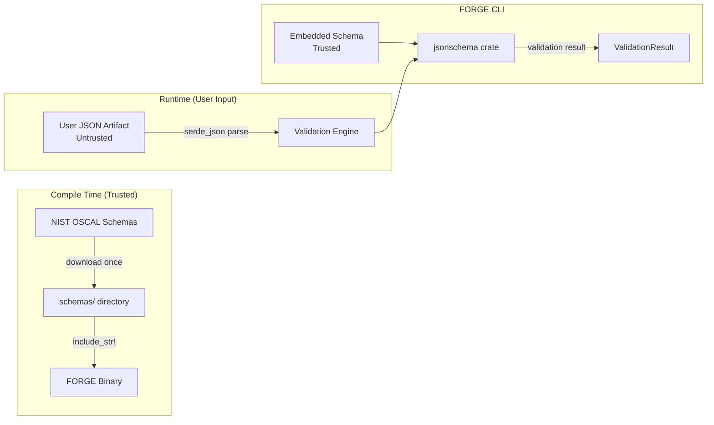
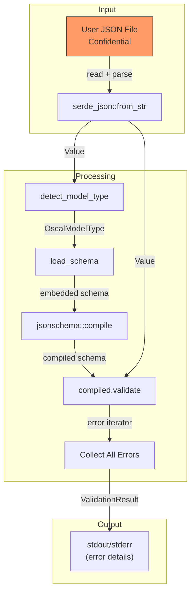
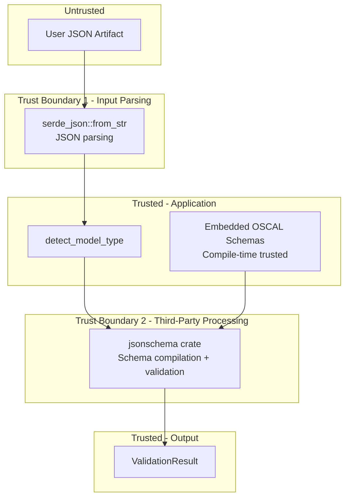

# 019-sec-schema-validation

> **Document Type:** Security Review (Lightweight)
> **Audience:** LLM agents, human reviewers
> **Status:** Draft
> **Last Updated:** 2026-02-11 <!-- @auto -->
> **Reviewer:** Brian Luby <!-- @human-required -->
> **Risk Level:** Medium <!-- @human-required -->

---

## Review Tier Legend

| Marker | Tier | Speckit Behavior |
|--------|------|------------------|
| :red_circle: `@human-required` | Human Generated | Prompt human to author; blocks until complete |
| :yellow_circle: `@human-review` | LLM + Human Review | LLM drafts -> prompt human to confirm/edit; blocks until confirmed |
| :green_circle: `@llm-autonomous` | LLM Autonomous | LLM completes; no prompt; logged for audit |
| :white_circle: `@auto` | Auto-generated | System fills (timestamps, links); no prompt |

---

## Severity Definitions

| Level | Label | Definition |
|-------|-------|------------|
| :red_circle: | **Critical** | Immediate exploitation risk; data breach or system compromise likely |
| :orange_circle: | **High** | Significant risk; exploitation possible with moderate effort |
| :yellow_circle: | **Medium** | Notable risk; exploitation requires specific conditions |
| :green_circle: | **Low** | Minor risk; limited impact or unlikely exploitation |

---

## Linkage :white_circle: `@auto`

| Document | ID | Relationship |
|----------|-----|--------------|
| Parent PRD | [019-prd-schema-validation.md](../PRD/019-prd-schema-validation.md) | Feature being reviewed |
| Architecture Review | [019-ar-schema-validation.md](../AR/019-ar-schema-validation.md) | Technical implementation |

---

## Purpose

This is a **lightweight security review** intended to catch obvious security concerns early in the product lifecycle. It is NOT a comprehensive threat model. Full threat modeling should occur during implementation when infrastructure-as-code and concrete implementations exist.

**This review answers three questions:**
1. What does this feature expose to attackers?
2. What data does it touch, and how sensitive is that data?
3. What's the impact if something goes wrong?

**Scope of this review:**
- :white_check_mark: Attack surface identification
- :white_check_mark: Data classification
- :white_check_mark: High-level CIA assessment
- :x: Detailed threat enumeration (deferred to implementation)
- :x: Penetration testing (deferred to implementation)
- :x: Compliance audit (separate process)

---

## Feature Security Summary

### One-line Summary :red_circle: `@human-required`
> WI-19 adds JSON Schema validation of OSCAL artifacts using the `jsonschema` crate with schemas embedded at compile time via `include_str!`. The primary security concerns are: (1) schema bomb attacks where deeply nested or self-referential JSON schemas cause resource exhaustion during validation, (2) handling of untrusted JSON files provided to `forge validate`, and (3) the `jsonschema` crate as a new third-party dependency processing potentially adversarial input.

### Risk Assessment :red_circle: `@human-required`
> **Risk Level:** Medium
> **Justification:** Introduces a new third-party dependency (`jsonschema` crate) that parses and compiles JSON schemas and validates user-provided JSON artifacts. Both operations involve parsing potentially complex nested structures that could trigger resource exhaustion. Schema files are embedded at compile time (trusted), but user-provided artifacts passed to `forge validate` are untrusted input.

---

## Attack Surface Analysis

### Exposure Points :yellow_circle: `@human-review`

| Exposure Type | Details | Authentication | Authorization | Notes |
|---------------|---------|----------------|---------------|-------|
| User Input Field | JSON artifact file provided to `forge validate <file>` | -- | -- | Untrusted JSON parsed by serde_json and validated by jsonschema crate |
| User Input Field | `--schema-type <type>` optional override for model type detection | -- | -- | Enum-typed by clap; validated at CLI parsing |
| Embedded Data | OSCAL JSON schemas embedded via `include_str!` at compile time | -- | -- | Trusted at build time; sourced from NIST OSCAL GitHub releases |

### Attack Surface Diagram :green_circle: `@llm-autonomous`

### Exposure Checklist :green_circle: `@llm-autonomous`

- [x] **Internet-facing endpoints require authentication** -- N/A: no internet-facing endpoints (local CLI)
- [x] **No sensitive data in URL parameters** -- N/A: no URLs or HTTP endpoints
- [x] **File uploads validated** -- User-provided JSON artifacts parsed by serde_json; malformed JSON produces descriptive error
- [x] **Rate limiting configured** -- N/A: no public endpoints
- [x] **CORS policy is restrictive** -- N/A: no web service
- [x] **No debug/admin endpoints exposed** -- N/A: no endpoints
- [x] **Webhooks validate signatures** -- N/A: no webhooks

---

## Data Flow Analysis

### Data Inventory :yellow_circle: `@human-review`

| Data Element | PRD Entity | Classification | Source | Destination | Retention | Encrypted Rest | Encrypted Transit | Residency |
|--------------|------------|----------------|--------|-------------|-----------|----------------|-------------------|-----------|
| User-provided JSON artifact | Input to forge validate | Confidential | User filesystem | In-memory processing | None (transient) | N/A | N/A | Local filesystem |
| Embedded OSCAL JSON schemas | Schema store | Public | NIST OSCAL GitHub releases (compile time) | In binary | Permanent (in binary) | N/A | N/A | Binary image |
| Validation errors | ValidationResult.errors | Internal | jsonschema crate processing | stderr/stdout | None (transient) | N/A | N/A | Terminal output |
| JSON pointer paths | SchemaError.instance_path | Internal | jsonschema crate error iterator | Error output | None (transient) | N/A | N/A | Terminal output |

### Data Classification Reference :green_circle: `@llm-autonomous`

| Level | Label | Description | Examples | Handling Requirements |
|-------|-------|-------------|----------|----------------------|
| 1 | **Public** | No impact if disclosed | OSCAL schema content, validation status (valid/invalid) | No special handling |
| 2 | **Internal** | Minor impact if disclosed | Validation error messages, JSON paths to failing fields | Avoid exposing in shared logs |
| 3 | **Confidential** | Significant impact if disclosed | Content of user's OSCAL artifact (may contain policy text) | Do not log content; truncate actual values |
| 4 | **Restricted** | Severe impact if disclosed | N/A for this feature | N/A |

### Data Flow Diagram :green_circle: `@llm-autonomous`

### Data Handling Checklist :green_circle: `@llm-autonomous`

- [x] **No Restricted data stored unless absolutely required** -- No restricted data involved
- [x] **Confidential data encrypted at rest** -- N/A: no persistent storage; transient in-memory processing
- [x] **All data encrypted in transit (TLS 1.2+)** -- N/A: no network transit; local CLI
- [x] **PII has defined retention policy** -- N/A: no PII
- [x] **Logs do not contain Confidential/Restricted data** -- Validation errors reference JSON paths, not document content (actual values truncated in WI-20)
- [x] **Secrets are not hardcoded** -- No secrets involved
- [x] **Data minimization applied** -- Validation only reads and inspects; does not copy or persist artifact content
- [x] **Data residency requirements documented** -- N/A: local filesystem only

---

## Third-Party & Supply Chain :yellow_circle: `@human-review`

### New External Services

| Service | Purpose | Data Shared | Communication | Approved? |
|---------|---------|-------------|---------------|-----------|
| None | No external services introduced | -- | -- | N/A |

### New Libraries/Dependencies

| Library | Version | License | Purpose | Security Check |
|---------|---------|---------|---------|----------------|
| `jsonschema` | Latest stable | MIT | JSON Schema validation (Draft 2020-12, Draft-07) | Active maintenance; widely used in Rust ecosystem; MIT-compatible |

### Supply Chain Checklist

- [x] **All new services use encrypted communication** -- N/A: no new services
- [x] **Service agreements/ToS reviewed** -- N/A: no external services
- [x] **Dependencies have acceptable licenses** -- `jsonschema` is MIT-licensed; compatible with FORGE's MIT license
- [x] **Dependencies are actively maintained** -- `jsonschema` has regular releases and active issue resolution
- [ ] **No known critical vulnerabilities** -- Verify via `cargo audit` before merging; check crates.io advisories

---

## CIA Impact Assessment

### Confidentiality :yellow_circle: `@human-review`

> **What could be disclosed?**

| Asset at Risk | Classification | Exposure Scenario | Impact | Likelihood |
|---------------|----------------|-------------------|--------|------------|
| User artifact content | Confidential | Validation error messages could include actual field values from the user's OSCAL artifact, potentially revealing policy content | Medium | Medium |
| File path of validated artifact | Internal | Error messages include the file path provided by the user | Low | High |

**Confidentiality Risk Level:** Medium

### Integrity :yellow_circle: `@human-review`

> **What could be modified or corrupted?**

| Asset at Risk | Modification Scenario | Impact | Likelihood |
|---------------|----------------------|--------|------------|
| Validation accuracy | If the jsonschema crate has bugs, valid artifacts could be reported as invalid (false positives) or invalid artifacts could pass (false negatives) | Medium | Low |
| Pipeline output integrity | If auto-validation in `forge convert` has a bypass, invalid artifacts could be written to output | High | Very Low |

**Integrity Risk Level:** Medium

### Availability :yellow_circle: `@human-review`

> **What could be disrupted?**

| Service/Function | Disruption Scenario | Impact | Likelihood |
|------------------|---------------------|--------|------------|
| Validation engine | Schema bomb: deeply nested or self-referential patterns in user-provided JSON cause excessive CPU/memory during validation | Medium | Low |
| Validation engine | Extremely large JSON artifact (hundreds of MB) causes out-of-memory during serde_json parsing | Medium | Low |
| Schema compilation | Malformed embedded schemas (build-time corruption) cause schema compilation failure at runtime | High | Very Low |

**Availability Risk Level:** Medium

### CIA Summary :green_circle: `@llm-autonomous`

| Dimension | Risk Level | Primary Concern | Mitigation Priority |
|-----------|------------|-----------------|---------------------|
| **Confidentiality** | Medium | Validation errors could reveal artifact content (field values) | High |
| **Integrity** | Medium | jsonschema crate bugs could produce false validation results | Medium |
| **Availability** | Medium | Resource exhaustion from adversarial JSON inputs or schema bomb patterns | Medium |

**Overall CIA Risk:** Medium -- *New third-party dependency processes untrusted user input (JSON artifacts). Schema bomb and resource exhaustion attacks are possible. Validation errors may leak artifact content. Embedded schemas are trusted but the jsonschema crate is a new attack surface.*

---

## Trust Boundaries :yellow_circle: `@human-review`

### Trust Boundary Checklist :green_circle: `@llm-autonomous`

- [x] **All input from untrusted sources is validated** -- User JSON parsed by serde_json (memory-safe); model type detected before validation
- [x] **External API responses are validated** -- N/A: no external APIs
- [x] **Authorization checked at data access, not just entry point** -- N/A: local CLI, no authorization model
- [x] **Service-to-service calls are authenticated** -- N/A: no services

---

## Known Risks & Mitigations :yellow_circle: `@human-review`

| ID | Risk Description | Severity | Mitigation | Status | Owner |
|----|------------------|----------|------------|--------|-------|
| R1 | Schema bomb: deeply nested JSON input causes excessive resource consumption during jsonschema validation | Medium | Enforce file size limit before parsing (e.g., 50MB); serde_json has built-in recursion limits; jsonschema crate processes embedded trusted schemas only | Open | Brian Luby |
| R2 | Validation error messages echo actual field values from user artifacts, potentially leaking policy content | Medium | WI-20 truncates actual values to 100 characters; raw crate messages are not exposed to users | Mitigated (WI-20 dependency) | Brian Luby |
| R3 | jsonschema crate vulnerability could affect validation correctness or introduce memory safety issues | Medium | Pin crate version; run `cargo audit` in CI; jsonschema is a pure Rust crate (memory-safe) | Mitigated | Brian Luby |
| R4 | Embedded schemas become outdated relative to OSCAL specification updates | Low | Pin schemas to specific NIST OSCAL release commit hash; document update process | Mitigated | Brian Luby |
| R5 | Extremely large JSON file causes out-of-memory during serde_json parsing | Medium | Enforce file size limit before reading file content; WI-23 adds input validation with FileTooLarge error | Open (WI-23 dependency) | Brian Luby |

### Risk Acceptance :red_circle: `@human-required`

| Risk ID | Accepted By | Date | Justification | Review Date |
|---------|-------------|------|---------------|-------------|
| R4 | Brian Luby | 2026-02-11 | Schemas are pinned to known NIST release; update process documented; acceptable latency | 2026-08-11 |

---

## Security Requirements :yellow_circle: `@human-review`

### Authentication & Authorization

| Req ID | Requirement | PRD AC | Verification Method |
|--------|-------------|--------|---------------------|
| -- | N/A: Local CLI tool; no authentication or authorization | -- | -- |

### Data Protection

| Req ID | Requirement | PRD AC | Verification Method |
|--------|-------------|--------|---------------------|
| SEC-1 | Validation error output shall not include raw artifact field values longer than 100 characters (truncation applied in WI-20) | AC-5 | Unit Test |
| SEC-2 | Validation error output shall not expose internal jsonschema crate implementation details (raw error messages) to end users | AC-5 | Unit Test |

### Input Validation

| Req ID | Requirement | PRD AC | Verification Method |
|--------|-------------|--------|---------------------|
| SEC-3 | User-provided JSON files shall be checked for reasonable file size before parsing (to prevent OOM on extremely large inputs) | -- | Integration Test |
| SEC-4 | Non-JSON files provided to `forge validate` shall produce a descriptive parse error, not a panic | AC-5 | Integration Test |
| SEC-5 | Empty files provided to `forge validate` shall produce a descriptive error message | AC-5 | Integration Test |
| SEC-6 | Files with unrecognized top-level JSON keys shall produce an `UnknownModelType` error with guidance to use `--schema-type` | AC-3 | Integration Test |

### Operational Security

| Req ID | Requirement | PRD AC | Verification Method |
|--------|-------------|--------|---------------------|
| SEC-7 | Schema compilation shall use `.unwrap()`-free error handling; `SchemaCompilation` error variant used on failure | AC-5, Constitution VIII | Code Review |
| SEC-8 | Auto-validation in `forge convert` shall block output writing when validation fails; no partial output shall be written | AC-6 | Integration Test |
| SEC-9 | Embedded schemas shall be sourced from a pinned NIST OSCAL release commit hash and documented in the repository | -- | Code Review |

---

## Compliance Considerations :yellow_circle: `@human-review`

| Regulation | Applicable? | Relevant Requirements | N/A Justification |
|------------|-------------|----------------------|-------------------|
| GDPR | N/A | -- | No PII processed; local CLI tool; no network, no user accounts |
| CCPA | N/A | -- | No personal information collected or disclosed |
| SOC 2 | N/A | -- | No cloud service; local CLI tool |
| HIPAA | N/A | -- | No health records processed |
| PCI-DSS | N/A | -- | No payment data |
| Other | N/A | -- | No regulatory implications for a local CLI tool |

---

## Review Findings

### Issues Identified :yellow_circle: `@human-review`

| ID | Finding | Severity | Category | Recommendation | Status |
|----|---------|----------|----------|----------------|--------|
| F1 | No file size limit enforced before serde_json parsing -- extremely large JSON files could cause OOM | Medium | CIA | Enforce file size check (e.g., 50MB limit) before reading file content into memory; coordinate with WI-23 input validation | Open |
| F2 | jsonschema crate is a new dependency that processes untrusted input -- requires `cargo audit` in CI pipeline | Medium | Supply Chain | Add `cargo audit` check to CI; pin jsonschema version in Cargo.toml | Open |
| F3 | Validation error messages from jsonschema crate may include field values from the user's artifact | Medium | Data | Ensure WI-20 error formatting truncates actual values and does not pass raw crate messages to users | Open (WI-20 dependency) |

### Positive Observations :green_circle: `@llm-autonomous`

- Schemas are embedded at compile time via `include_str!`, eliminating runtime schema fetching and the associated TOCTOU and network attack vectors
- Model type detection uses a simple top-level key check -- no complex parsing of untrusted JSON structure for detection
- Schema compilation occurs from trusted embedded data, not from user-provided schemas
- The architecture collects ALL validation errors via iterator API, preventing information asymmetry where some errors are hidden
- The jsonschema crate is pure Rust, providing memory safety guarantees against buffer overflows
- `--schema-type` override prevents user confusion on ambiguous model types without requiring complex auto-detection heuristics

---

## Open Questions :yellow_circle: `@human-review`

- [ ] **Q1:** Should `forge validate` enforce a maximum file size limit, and if so, what threshold is appropriate? (Recommended: 50MB, aligned with WI-23 FileTooLarge limit)
- [ ] **Q2:** Should `cargo audit` be added to the CI pipeline as part of this work item or deferred to WI-25 (CLI polish)?

---

## Changelog :white_circle: `@auto`

| Version | Date | Author | Changes |
|---------|------|--------|---------|
| 0.1 | 2026-02-11 | LLM (Claude) | Initial review |

---

## Review Sign-off :red_circle: `@human-required`

| Role | Name | Date | Decision |
|------|------|------|----------|
| Security Reviewer | Brian Luby | YYYY-MM-DD | [Approved / Approved with conditions / Rejected] |
| Feature Owner | Brian Luby | YYYY-MM-DD | [Acknowledged] |

### Conditions for Approval (if applicable) :red_circle: `@human-required`

- [ ] Resolve F1: Implement file size limit before JSON parsing (coordinate with WI-23)
- [ ] Resolve F2: Add `cargo audit` to CI pipeline
- [ ] Confirm F3 is addressed by WI-20 error formatting implementation

---

## Security Requirements Traceability :green_circle: `@llm-autonomous`

| SEC Req ID | PRD Req ID | PRD AC ID | Test Type | Test Location |
|------------|------------|-----------|-----------|---------------|
| SEC-1 | M-5 | AC-5 | Unit | tests/validate_test.rs |
| SEC-2 | M-5 | AC-5 | Unit | tests/validate_test.rs |
| SEC-3 | -- | -- | Integration | tests/validate_integration_test.rs |
| SEC-4 | M-5 | AC-5 | Integration | tests/validate_integration_test.rs |
| SEC-5 | M-5 | AC-5 | Integration | tests/validate_integration_test.rs |
| SEC-6 | M-3 | AC-3 | Integration | tests/validate_integration_test.rs |
| SEC-7 | -- | -- | Code Review | Manual audit |
| SEC-8 | M-6 | AC-6 | Integration | tests/convert_integration_test.rs |
| SEC-9 | -- | -- | Code Review | Manual audit |

---

## Review Checklist :green_circle: `@llm-autonomous`

Before marking as Approved:
- [x] Attack surface documented with auth/authz status for each exposure
- [x] Exposure Points table has no contradictory rows (None vs. actual endpoints)
- [x] All PRD Data Model entities appear in Data Inventory
- [x] All data elements are classified using the 4-tier model
- [x] Third-party dependencies and services are listed
- [x] CIA impact is assessed with Low/Medium/High ratings
- [x] Trust boundaries are identified
- [x] Security requirements have verification methods specified
- [x] Security requirements trace to PRD ACs where applicable
- [ ] No Critical/High findings remain Open
- [x] Compliance N/A items have justification
- [x] Risk acceptance has named approver and review date
