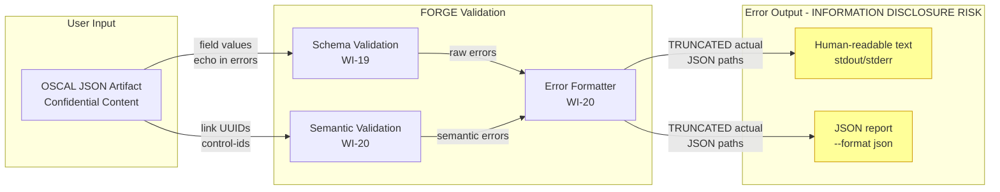
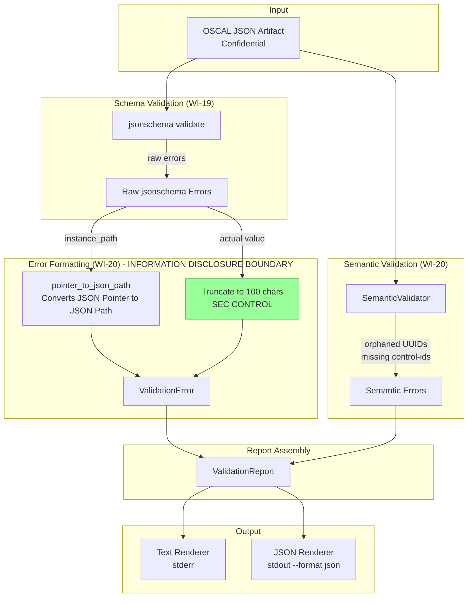
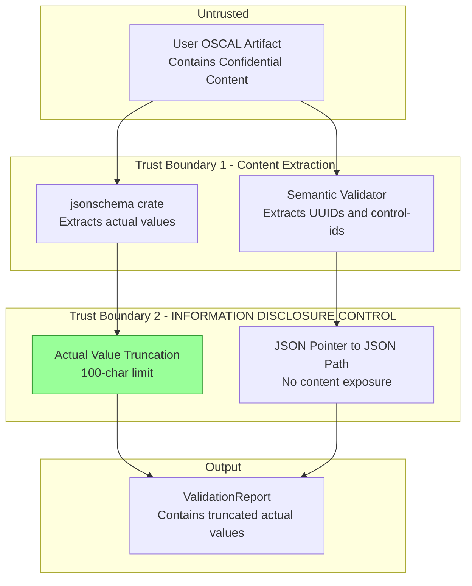

# 020-sec-validation-error-reporting

> **Document Type:** Security Review (Lightweight)
> **Audience:** LLM agents, human reviewers
> **Status:** Draft
> **Last Updated:** 2026-02-11 <!-- @auto -->
> **Reviewer:** Brian Luby <!-- @human-required -->
> **Risk Level:** Medium <!-- @human-required -->

---

## Review Tier Legend

| Marker | Tier | Speckit Behavior |
|--------|------|------------------|
| :red_circle: `@human-required` | Human Generated | Prompt human to author; blocks until complete |
| :yellow_circle: `@human-review` | LLM + Human Review | LLM drafts -> prompt human to confirm/edit; blocks until confirmed |
| :green_circle: `@llm-autonomous` | LLM Autonomous | LLM completes; no prompt; logged for audit |
| :white_circle: `@auto` | Auto-generated | System fills (timestamps, links); no prompt |

---

## Severity Definitions

| Level | Label | Definition |
|-------|-------|------------|
| :red_circle: | **Critical** | Immediate exploitation risk; data breach or system compromise likely |
| :orange_circle: | **High** | Significant risk; exploitation possible with moderate effort |
| :yellow_circle: | **Medium** | Notable risk; exploitation requires specific conditions |
| :green_circle: | **Low** | Minor risk; limited impact or unlikely exploitation |

---

## Linkage :white_circle: `@auto`

| Document | ID | Relationship |
|----------|-----|--------------|
| Parent PRD | [020-prd-validation-error-reporting.md](../PRD/020-prd-validation-error-reporting.md) | Feature being reviewed |
| Architecture Review | [020-ar-validation-error-reporting.md](../AR/020-ar-validation-error-reporting.md) | Technical implementation |
| Upstream SEC | [019-sec-schema-validation.md](019-sec-schema-validation.md) | Foundation: base validation infrastructure |

---

## Purpose

This is a **lightweight security review** intended to catch obvious security concerns early in the product lifecycle. It is NOT a comprehensive threat model. Full threat modeling should occur during implementation when infrastructure-as-code and concrete implementations exist.

**This review answers three questions:**
1. What does this feature expose to attackers?
2. What data does it touch, and how sensitive is that data?
3. What's the impact if something goes wrong?

**Scope of this review:**
- :white_check_mark: Attack surface identification
- :white_check_mark: Data classification
- :white_check_mark: High-level CIA assessment
- :x: Detailed threat enumeration (deferred to implementation)
- :x: Penetration testing (deferred to implementation)
- :x: Compliance audit (separate process)

---

## Feature Security Summary

### One-line Summary :red_circle: `@human-required`
> WI-20 enhances validation error reporting with actionable messages containing JSON paths, expected/actual values, and semantic validation. The primary security concern is **information disclosure**: error messages echo field values from potentially sensitive OSCAL artifacts, and verbose error output could reveal internal file paths, system state, or document content to unintended audiences.

### Risk Assessment :red_circle: `@human-required`
> **Risk Level:** Medium
> **Justification:** Error messages intentionally include field values (expected/actual) from user OSCAL artifacts to be actionable. These artifacts may contain sensitive policy content. Without proper truncation and sanitization, error output could disclose confidential document text, internal filesystem paths, or system details. This is particularly important because FORGE is a security tool -- its own output should not inadvertently disclose information.

---

## Attack Surface Analysis

### Exposure Points :yellow_circle: `@human-review`

| Exposure Type | Details | Authentication | Authorization | Notes |
|---------------|---------|----------------|---------------|-------|
| User Input Field | JSON artifact content echoed in error messages (actual values) | -- | -- | Confidential policy content could appear in error output |
| User Input Field | JSON artifact file path included in error output | -- | -- | File paths reveal directory structure |
| Generated Output | JSON-formatted error output (`--format json`) | -- | -- | Machine-parseable error reports could be stored in CI logs, shared, or forwarded |
| Generated Output | Human-readable error text to stdout/stderr | -- | -- | Terminal output visible to screen capture, logging, or shoulder surfing |

### Attack Surface Diagram :green_circle: `@llm-autonomous`

### Exposure Checklist :green_circle: `@llm-autonomous`

- [x] **Internet-facing endpoints require authentication** -- N/A: no internet-facing endpoints (local CLI)
- [x] **No sensitive data in URL parameters** -- N/A: no URLs or HTTP endpoints
- [x] **File uploads validated** -- N/A: no file uploads; input is a local file path
- [x] **Rate limiting configured** -- N/A: no public endpoints
- [x] **CORS policy is restrictive** -- N/A: no web service
- [x] **No debug/admin endpoints exposed** -- N/A: no endpoints
- [x] **Webhooks validate signatures** -- N/A: no webhooks

---

## Data Flow Analysis

### Data Inventory :yellow_circle: `@human-review`

| Data Element | PRD Entity | Classification | Source | Destination | Retention | Encrypted Rest | Encrypted Transit | Residency |
|--------------|------------|----------------|--------|-------------|-----------|----------------|-------------------|-----------|
| Artifact field values | ValidationError.actual | Confidential | User OSCAL artifact (field values) | Error output (truncated to 100 chars) | None (transient) | N/A | N/A | Terminal output |
| JSON paths to errors | ValidationError.path | Internal | Derived from artifact structure | Error output | None (transient) | N/A | N/A | Terminal output |
| Expected constraints | ValidationError.expected | Public | Derived from OSCAL schema rules | Error output | None (transient) | N/A | N/A | Terminal output |
| Error category | ValidationError.category | Public | Classification logic | Error output | None (transient) | N/A | N/A | Terminal output |
| Artifact file path | ValidationReport.artifact_path | Internal | User CLI argument | Error output | None (transient) | N/A | N/A | Terminal output |
| Back-matter resource UUIDs | Checked by semantic validator | Internal | User artifact back-matter | Error output (orphaned UUID referenced) | None (transient) | N/A | N/A | Terminal output |
| Control-id references | Checked by semantic validator | Internal | User artifact implemented-requirements | Error output (missing control-id referenced) | None (transient) | N/A | N/A | Terminal output |
| JSON error report | Full ValidationReport serialized | Confidential (contains actual values) | Formatter output | stdout/file via `--format json` | User-controlled | N/A | N/A | User filesystem / CI logs |

### Data Classification Reference :green_circle: `@llm-autonomous`

| Level | Label | Description | Examples | Handling Requirements |
|-------|-------|-------------|----------|----------------------|
| 1 | **Public** | No impact if disclosed | Error categories (Schema/Semantic), expected constraints, error counts | No special handling |
| 2 | **Internal** | Minor impact if disclosed | JSON paths within artifact, file paths, control-IDs, resource UUIDs | Avoid logging in shared environments |
| 3 | **Confidential** | Significant impact if disclosed | Actual field values from policy artifacts (truncated), error report containing artifact details | Truncation required; warn about output sensitivity |
| 4 | **Restricted** | Severe impact if disclosed | N/A for this feature | N/A |

### Data Flow Diagram :green_circle: `@llm-autonomous`

### Data Handling Checklist :green_circle: `@llm-autonomous`

- [x] **No Restricted data stored unless absolutely required** -- No restricted data involved
- [x] **Confidential data encrypted at rest** -- N/A: no persistent storage by FORGE; output file security is user's responsibility
- [x] **All data encrypted in transit (TLS 1.2+)** -- N/A: no network transit; local CLI
- [x] **PII has defined retention policy** -- N/A: no PII
- [x] **Logs do not contain Confidential/Restricted data** -- Actual values truncated to 100 chars; no full field values in error output
- [x] **Secrets are not hardcoded** -- No secrets involved
- [x] **Data minimization applied** -- Actual values truncated; only structural metadata (paths, UUIDs, control-IDs) included in error details
- [x] **Data residency requirements documented** -- N/A: local filesystem only

---

## Third-Party & Supply Chain :yellow_circle: `@human-review`

### New External Services

| Service | Purpose | Data Shared | Communication | Approved? |
|---------|---------|-------------|---------------|-----------|
| None | No external services introduced | -- | -- | N/A |

### New Libraries/Dependencies

| Library | Version | License | Purpose | Security Check |
|---------|---------|---------|---------|----------------|
| None | -- | -- | No new dependencies; builds on WI-19 jsonschema infrastructure + serde for JSON output | N/A |

### Supply Chain Checklist

- [x] **All new services use encrypted communication** -- N/A: no new services
- [x] **Service agreements/ToS reviewed** -- N/A: no external services
- [x] **Dependencies have acceptable licenses** -- No new dependencies
- [x] **Dependencies are actively maintained** -- No new dependencies
- [x] **No known critical vulnerabilities** -- No new dependencies

---

## CIA Impact Assessment

### Confidentiality :yellow_circle: `@human-review`

> **What could be disclosed?**

| Asset at Risk | Classification | Exposure Scenario | Impact | Likelihood |
|---------------|----------------|-------------------|--------|------------|
| Policy content in actual values | Confidential | Validation errors include field values from the user's OSCAL artifact; if not truncated, full policy text could appear in error output, CI logs, or shared error reports | Medium | High (without truncation) / Low (with 100-char truncation) |
| Internal file paths | Internal | Artifact file path and source paths appear in error messages; CI logs or shared error output reveal directory structure | Low | Medium |
| JSON structure of artifact | Internal | JSON paths in errors reveal the internal structure of the organization's OSCAL artifacts (field names, nesting patterns) | Low | High |
| JSON error report | Confidential | `--format json` error report serialized and potentially stored in CI logs, forwarded via email, or committed to version control | Medium | Medium |

**Confidentiality Risk Level:** Medium

### Integrity :yellow_circle: `@human-review`

> **What could be modified or corrupted?**

| Asset at Risk | Modification Scenario | Impact | Likelihood |
|---------------|----------------------|--------|------------|
| Error message accuracy | JSON Pointer to JSON Path conversion could produce incorrect paths, leading users to fix the wrong field | Low | Low |
| Semantic validation accuracy | Orphaned link detection could produce false positives (report valid links as orphaned) or false negatives (miss actual orphans) | Low | Low |

**Integrity Risk Level:** Low

### Availability :yellow_circle: `@human-review`

> **What could be disrupted?**

| Service/Function | Disruption Scenario | Impact | Likelihood |
|------------------|---------------------|--------|------------|
| Error reporting | Extremely large number of validation errors (1000+) could produce massive error output, consuming terminal buffer or disk space for JSON reports | Low | Low |
| Semantic validation | Deeply nested JSON artifact with extensive back-matter could slow the semantic tree walk | Low | Low |

**Availability Risk Level:** Low

### CIA Summary :green_circle: `@llm-autonomous`

| Dimension | Risk Level | Primary Concern | Mitigation Priority |
|-----------|------------|-----------------|---------------------|
| **Confidentiality** | Medium | Error messages echo artifact content; truncation is the primary control | High |
| **Integrity** | Low | Path conversion and semantic checks must be accurate | Low |
| **Availability** | Low | Large error counts could produce extensive output | Low |

**Overall CIA Risk:** Medium -- *Primary concern is information disclosure through error messages. Actual value truncation (100 chars) is the key security control. The `--format json` output mode creates a serialized record of error details that may be persisted in CI logs or shared -- users should be aware that error reports inherit the sensitivity of the input artifact.*

---

## Trust Boundaries :yellow_circle: `@human-review`

### Trust Boundary Checklist :green_circle: `@llm-autonomous`

- [x] **All input from untrusted sources is validated** -- Artifact parsed by serde_json (WI-19); error content truncated before output
- [x] **External API responses are validated** -- N/A: no external APIs
- [x] **Authorization checked at data access, not just entry point** -- N/A: local CLI, no authorization model
- [x] **Service-to-service calls are authenticated** -- N/A: no services

---

## Known Risks & Mitigations :yellow_circle: `@human-review`

| ID | Risk Description | Severity | Mitigation | Status | Owner |
|----|------------------|----------|------------|--------|-------|
| R1 | Validation error actual values echo potentially sensitive policy content from user artifacts | Medium | Truncate all actual values to 100 characters with "..." suffix (PRD security constraint) | Mitigated (by design) | Brian Luby |
| R2 | `--format json` error report creates a serialized record that may be persisted in CI logs or shared, containing truncated artifact details | Medium | Document that error reports inherit the sensitivity classification of input artifacts; truncation limits exposure | Open (documentation) | Brian Luby |
| R3 | Raw jsonschema crate error messages could leak implementation internals (Rust type names, schema fragment references) if passed through to users | Medium | All raw crate errors are transformed through `format_schema_error()` -- raw messages are never shown to users | Mitigated (by design) | Brian Luby |
| R4 | JSON paths in error output reveal internal structure of the organization's OSCAL artifacts | Low | Inherent to actionable error reporting; JSON paths are necessary for users to locate and fix errors | Accepted | Brian Luby |
| R5 | Semantic validator walks entire JSON tree -- crafted deeply nested JSON could be used for CPU exhaustion | Low | serde_json recursion limits apply; file size limit (WI-23) prevents extremely large inputs | Mitigated | Brian Luby |

### Risk Acceptance :red_circle: `@human-required`

| Risk ID | Accepted By | Date | Justification | Review Date |
|---------|-------------|------|---------------|-------------|
| R4 | Brian Luby | 2026-02-11 | JSON paths are essential for actionable error messages; revealing OSCAL field names is low risk | 2026-08-11 |

---

## Security Requirements :yellow_circle: `@human-review`

### Authentication & Authorization

| Req ID | Requirement | PRD AC | Verification Method |
|--------|-------------|--------|---------------------|
| -- | N/A: Local CLI tool; no authentication or authorization | -- | -- |

### Data Protection

| Req ID | Requirement | PRD AC | Verification Method |
|--------|-------------|--------|---------------------|
| SEC-1 | All actual values in ValidationError shall be truncated to a maximum of 100 characters, with "..." appended when truncated | PRD Security Constraint | Unit Test |
| SEC-2 | Raw jsonschema crate error messages shall never be exposed to end users; all errors must pass through `format_schema_error()` | -- | Unit Test |
| SEC-3 | The JSON error report (`--format json`) shall contain only the fields defined in ValidationReport and ValidationError structs; no additional system information shall be serialized | -- | Unit Test |
| SEC-4 | Error messages shall not include internal Rust module paths, type names, or stack traces | -- | Integration Test |

### Input Validation

| Req ID | Requirement | PRD AC | Verification Method |
|--------|-------------|--------|---------------------|
| SEC-5 | Semantic validation shall not follow external URLs found in `href` fields; all checks shall be performed against the artifact's internal structure only | -- | Unit Test |
| SEC-6 | The `pointer_to_json_path()` function shall handle malformed JSON pointers gracefully (no panics) | -- | Unit Test |

### Operational Security

| Req ID | Requirement | PRD AC | Verification Method |
|--------|-------------|--------|---------------------|
| SEC-7 | Auto-validation in `forge convert` shall output errors to stderr only; error content shall not be mixed into the OSCAL JSON output on stdout | AC-5 (M-5) | Integration Test |
| SEC-8 | Error count summary shall be accurate; schema_error_count + semantic_error_count shall equal total errors.len() | -- | Unit Test |

---

## Compliance Considerations :yellow_circle: `@human-review`

| Regulation | Applicable? | Relevant Requirements | N/A Justification |
|------------|-------------|----------------------|-------------------|
| GDPR | N/A | -- | No PII processed; local CLI tool; no network, no user accounts |
| CCPA | N/A | -- | No personal information collected or disclosed |
| SOC 2 | N/A | -- | No cloud service; local CLI tool |
| HIPAA | N/A | -- | No health records processed |
| PCI-DSS | N/A | -- | No payment data |
| Other | N/A | -- | No regulatory implications for a local CLI tool |

---

## Review Findings

### Issues Identified :yellow_circle: `@human-review`

| ID | Finding | Severity | Category | Recommendation | Status |
|----|---------|----------|----------|----------------|--------|
| F1 | `--format json` error reports could be stored in CI logs, version control, or shared channels -- they contain truncated but still potentially sensitive artifact field values | Medium | Data | Document that JSON error reports inherit the sensitivity of input artifacts; consider a warning when `--format json` is used with potentially sensitive artifacts | Open |
| F2 | Semantic validator tree walk does not have a depth limit independent of serde_json -- crafted deeply nested JSON could consume excessive stack space | Low | CIA | Rely on serde_json's built-in recursion limit; add a comment documenting this dependency | Open |

### Positive Observations :green_circle: `@llm-autonomous`

- The 100-character truncation limit on actual values is a strong information disclosure control, preventing large blocks of policy text from appearing in error output
- Raw jsonschema crate messages are never exposed to users -- all errors pass through a custom formatter that produces user-friendly messages
- Semantic validation operates on the artifact's internal structure only -- no external URL following or network access
- Error categories (Schema vs Semantic) provide clear classification without exposing implementation details
- JSON Path notation (`$.catalog.metadata.uuid`) is more user-friendly than JSON Pointer and does not reveal any additional information
- The architecture separates error collection from rendering, allowing the rendering layer to apply security controls (truncation, sanitization) consistently

---

## Open Questions :yellow_circle: `@human-review`

- [x] **Q1:** Should FORGE display a warning when `--format json` is used, reminding users that the error report may contain sensitive artifact details?
  > **Decision (2026-02-14):** No. Adding a warning to every `--format json` invocation would create noise for CI/CD pipelines where JSON output is the primary use case. The truncation control (SEC-1) already limits exposure. Document sensitivity in user-facing help text instead.
- [x] **Q2:** Should the 100-character truncation limit be configurable (e.g., `--max-value-length`), or should it remain a fixed security control?
  > **Decision (2026-02-14):** Fixed at 100 characters. Per constitution principle X (Simplicity/YAGNI), a configurable limit adds complexity without clear user demand. The fixed limit is a security control (SEC-1) and should not be user-overridable.

---

## Changelog :white_circle: `@auto`

| Version | Date | Author | Changes |
|---------|------|--------|---------|
| 0.1 | 2026-02-11 | LLM (Claude) | Initial review |

---

## Review Sign-off :red_circle: `@human-required`

| Role | Name | Date | Decision |
|------|------|------|----------|
| Security Reviewer | Brian Luby | YYYY-MM-DD | [Approved / Approved with conditions / Rejected] |
| Feature Owner | Brian Luby | YYYY-MM-DD | [Acknowledged] |

### Conditions for Approval (if applicable) :red_circle: `@human-required`

- [ ] Resolve F1: Add documentation about error report sensitivity
- [ ] Confirm 100-character truncation is implemented and tested as a non-negotiable security control

---

## Security Requirements Traceability :green_circle: `@llm-autonomous`

| SEC Req ID | PRD Req ID | PRD AC ID | Test Type | Test Location |
|------------|------------|-----------|-----------|---------------|
| SEC-1 | -- (Security Constraint) | -- | Unit | src/validate/formatter.rs (in-module tests) |
| SEC-2 | M-1 | AC-1 | Unit | src/validate/formatter.rs (in-module tests) |
| SEC-3 | S-1 | AC-7 | Unit | src/validate/report.rs (in-module tests) |
| SEC-4 | -- | -- | Integration | src/validate/formatter.rs (in-module tests) |
| SEC-5 | -- | -- | Unit | src/validate/semantic.rs (in-module tests) |
| SEC-6 | -- | -- | Unit | src/validate/formatter.rs (in-module tests) |
| SEC-7 | M-5 | AC-5 | Integration | src/pipeline.rs (in-module tests) |
| SEC-8 | S-2 | AC-8 | Unit | src/validate/error_types.rs (in-module tests) |

---

## Review Checklist :green_circle: `@llm-autonomous`

Before marking as Approved:
- [x] Attack surface documented with auth/authz status for each exposure
- [x] Exposure Points table has no contradictory rows (None vs. actual endpoints)
- [x] All PRD Data Model entities appear in Data Inventory
- [x] All data elements are classified using the 4-tier model
- [x] Third-party dependencies and services are listed
- [x] CIA impact is assessed with Low/Medium/High ratings
- [x] Trust boundaries are identified
- [x] Security requirements have verification methods specified
- [x] Security requirements trace to PRD ACs where applicable
- [ ] No Critical/High findings remain Open
- [x] Compliance N/A items have justification
- [x] Risk acceptance has named approver and review date
