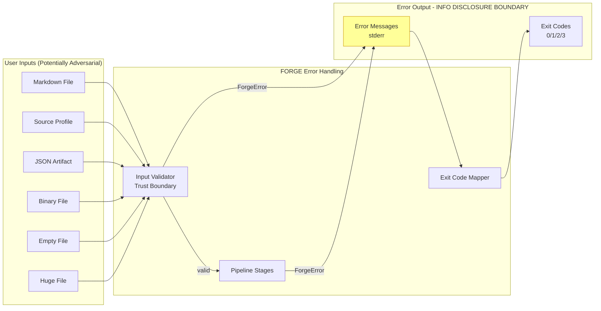
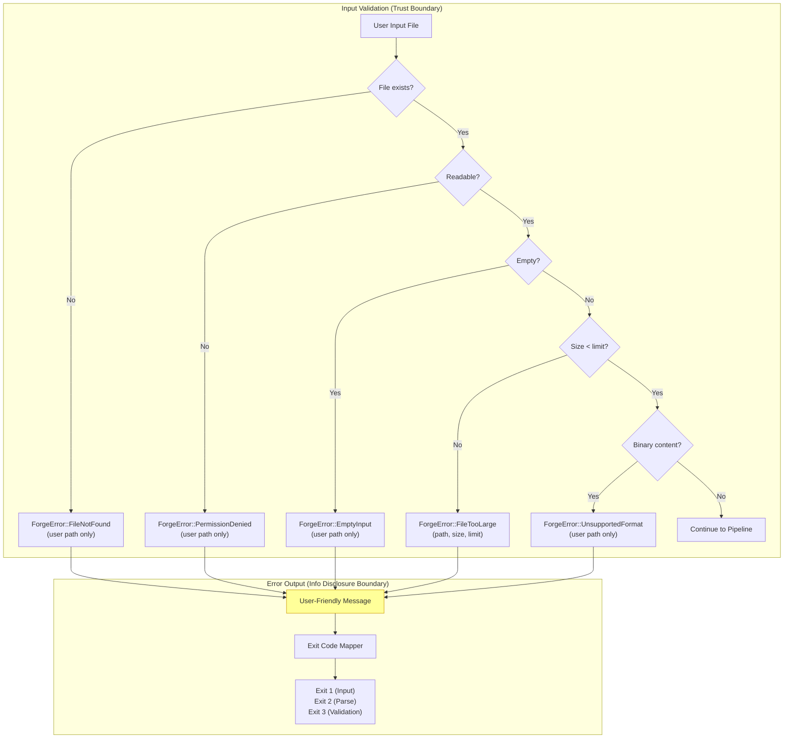
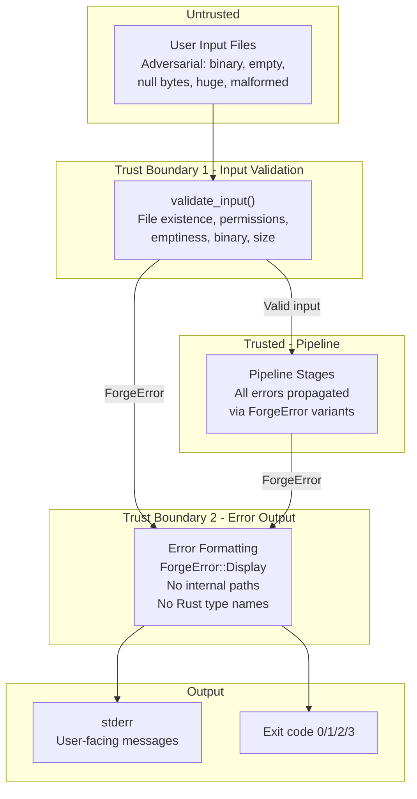

# 023-sec-error-handling

> **Document Type:** Security Review (Lightweight)
> **Audience:** LLM agents, human reviewers
> **Status:** Draft
> **Last Updated:** 2026-02-11 <!-- @auto -->
> **Reviewer:** Brian Luby <!-- @human-required -->
> **Risk Level:** Medium <!-- @human-required -->

---

## Review Tier Legend

| Marker | Tier | Speckit Behavior |
|--------|------|------------------|
| :red_circle: `@human-required` | Human Generated | Prompt human to author; blocks until complete |
| :yellow_circle: `@human-review` | LLM + Human Review | LLM drafts -> prompt human to confirm/edit; blocks until confirmed |
| :green_circle: `@llm-autonomous` | LLM Autonomous | LLM completes; no prompt; logged for audit |
| :white_circle: `@auto` | Auto-generated | System fills (timestamps, links); no prompt |

---

## Severity Definitions

| Level | Label | Definition |
|-------|-------|------------|
| :red_circle: | **Critical** | Immediate exploitation risk; data breach or system compromise likely |
| :orange_circle: | **High** | Significant risk; exploitation possible with moderate effort |
| :yellow_circle: | **Medium** | Notable risk; exploitation requires specific conditions |
| :green_circle: | **Low** | Minor risk; limited impact or unlikely exploitation |

---

## Linkage :white_circle: `@auto`

| Document | ID | Relationship |
|----------|-----|--------------|
| Parent PRD | [023-prd-error-handling.md](../PRD/023-prd-error-handling.md) | Feature being reviewed |
| Architecture Review | [023-ar-error-handling.md](../AR/023-ar-error-handling.md) | Technical implementation |

---

## Purpose

This is a **lightweight security review** intended to catch obvious security concerns early in the product lifecycle. It is NOT a comprehensive threat model. Full threat modeling should occur during implementation when infrastructure-as-code and concrete implementations exist.

**This review answers three questions:**
1. What does this feature expose to attackers?
2. What data does it touch, and how sensitive is that data?
3. What's the impact if something goes wrong?

**Scope of this review:**
- :white_check_mark: Attack surface identification
- :white_check_mark: Data classification
- :white_check_mark: High-level CIA assessment
- :x: Detailed threat enumeration (deferred to implementation)
- :x: Penetration testing (deferred to implementation)
- :x: Compliance audit (separate process)

---

## Feature Security Summary

### One-line Summary :red_circle: `@human-required`
> WI-23 implements comprehensive error handling across all pipeline stages with expanded `ForgeError` variants, input validation, exit code mapping, `.unwrap()` audit, and adversarial input testing. The primary security concerns are **information disclosure** (error messages could reveal internal file paths, system state, or Rust implementation details) and **format string safety** (error messages must be constructed safely without format string vulnerabilities).

### Risk Assessment :red_circle: `@human-required`
> **Risk Level:** Medium
> **Justification:** Error handling is a security boundary -- error messages are the primary information channel between the application and the user. For a security tool like FORGE, error messages must not leak internal system details, and the tool must never panic on adversarial input. The `.unwrap()` audit and adversarial input testing directly address robustness against crafted inputs. Information disclosure through verbose error messages is the key risk.

---

## Attack Surface Analysis

### Exposure Points :yellow_circle: `@human-review`

| Exposure Type | Details | Authentication | Authorization | Notes |
|---------------|---------|----------------|---------------|-------|
| Error Output | ForgeError Display implementations produce user-visible messages containing file paths and error context | -- | -- | Must not expose internal module names, Rust types, or system paths beyond user-provided inputs |
| Error Output | anyhow `.context()` chains could accumulate detailed internal state information | -- | -- | Context chains visible only with `--verbose`; must still not expose internal details |
| Error Output | `RUST_BACKTRACE=1` environment variable could expose full stack traces | -- | -- | Stack traces are developer debugging aid; must not be produced by default |
| User Input Field | Adversarial input files (binary, empty, null bytes, huge files) | -- | -- | Input validation must reject gracefully; no panics |

### Attack Surface Diagram :green_circle: `@llm-autonomous`

### Exposure Checklist :green_circle: `@llm-autonomous`

- [x] **Internet-facing endpoints require authentication** -- N/A: no internet-facing endpoints (local CLI)
- [x] **No sensitive data in URL parameters** -- N/A: no URLs or HTTP endpoints
- [x] **File uploads validated** -- Input validation checks existence, readability, emptiness, binary content, file size before pipeline processing
- [x] **Rate limiting configured** -- N/A: no public endpoints
- [x] **CORS policy is restrictive** -- N/A: no web service
- [x] **No debug/admin endpoints exposed** -- N/A: no endpoints
- [x] **Webhooks validate signatures** -- N/A: no webhooks

---

## Data Flow Analysis

### Data Inventory :yellow_circle: `@human-review`

| Data Element | PRD Entity | Classification | Source | Destination | Retention | Encrypted Rest | Encrypted Transit | Residency |
|--------------|------------|----------------|--------|-------------|-----------|----------------|-------------------|-----------|
| User-provided file path | ForgeError variants (path field) | Internal | User CLI argument | Error message on stderr | None (transient) | N/A | N/A | Terminal output |
| Error context messages | anyhow .context() chain | Internal | Pipeline stage names and descriptions | Error message on stderr (verbose mode) | None (transient) | N/A | N/A | Terminal output |
| File content (first 512 bytes) | Binary detection sample | Confidential | User input file | In-memory only; not output | None (transient) | N/A | N/A | Memory only |
| File size | ForgeError::FileTooLarge.actual_size | Public | std::fs::metadata | Error message on stderr | None (transient) | N/A | N/A | Terminal output |
| Exit code | Process exit status | Public | exit_code() mapping | Process exit status | None (transient) | N/A | N/A | Process metadata |
| Stack trace | Rust backtrace | Internal | RUST_BACKTRACE env var | stderr (developer mode only) | None (transient) | N/A | N/A | Terminal output |

### Data Classification Reference :green_circle: `@llm-autonomous`

| Level | Label | Description | Examples | Handling Requirements |
|-------|-------|-------------|----------|----------------------|
| 1 | **Public** | No impact if disclosed | Exit codes, file sizes, error category names | No special handling |
| 2 | **Internal** | Minor impact if disclosed | User-provided file paths, error context descriptions, pipeline stage names | Do not expose system paths; only user-provided paths |
| 3 | **Confidential** | Significant impact if disclosed | File content samples (binary detection), policy document content referenced in errors | Never output raw file content; binary detection uses in-memory-only sample |
| 4 | **Restricted** | Severe impact if disclosed | N/A for this feature | N/A |

### Data Flow Diagram :green_circle: `@llm-autonomous`

### Data Handling Checklist :green_circle: `@llm-autonomous`

- [x] **No Restricted data stored unless absolutely required** -- No restricted data involved
- [x] **Confidential data encrypted at rest** -- N/A: no persistent storage
- [x] **All data encrypted in transit (TLS 1.2+)** -- N/A: no network transit; local CLI
- [x] **PII has defined retention policy** -- N/A: no PII
- [x] **Logs do not contain Confidential/Restricted data** -- Error messages contain only user-provided paths and safe descriptions; no file content
- [x] **Secrets are not hardcoded** -- No secrets involved
- [x] **Data minimization applied** -- Binary detection reads only first 512 bytes; file content never included in error messages
- [x] **Data residency requirements documented** -- N/A: local filesystem only

---

## Third-Party & Supply Chain :yellow_circle: `@human-review`

### New External Services

| Service | Purpose | Data Shared | Communication | Approved? |
|---------|---------|-------------|---------------|-----------|
| None | No external services introduced | -- | -- | N/A |

### New Libraries/Dependencies

| Library | Version | License | Purpose | Security Check |
|---------|---------|---------|---------|----------------|
| None new | -- | -- | Uses existing thiserror + anyhow (binary crate); no new dependencies | N/A |

### Supply Chain Checklist

- [x] **All new services use encrypted communication** -- N/A: no new services
- [x] **Service agreements/ToS reviewed** -- N/A: no external services
- [x] **Dependencies have acceptable licenses** -- No new dependencies
- [x] **Dependencies are actively maintained** -- No new dependencies
- [x] **No known critical vulnerabilities** -- No new dependencies

---

## CIA Impact Assessment

### Confidentiality :yellow_circle: `@human-review`

> **What could be disclosed?**

| Asset at Risk | Classification | Exposure Scenario | Impact | Likelihood |
|---------------|----------------|-------------------|--------|------------|
| Internal filesystem paths | Internal | Error messages could include resolved absolute paths, system directory structure, or home directory paths if errors are not carefully constructed | Medium | Medium |
| Internal module/type names | Internal | Unformatted Rust error messages (e.g., from `.unwrap()` panics) could expose internal module paths and Rust type names | Medium | Low (after audit) |
| System state information | Internal | anyhow context chains could accumulate descriptive state from pipeline stages, revealing internal processing details | Low | Low |
| Stack traces | Internal | `RUST_BACKTRACE=1` produces full stack traces with function names and line numbers; if stderr is captured in logs, this reveals internal code structure | Low | Low |
| File content (via panics) | Confidential | An unhandled `.unwrap()` on a parsing operation could panic with a message including the parsed content fragment | Medium | Low (after audit) |

**Confidentiality Risk Level:** Medium

### Integrity :yellow_circle: `@human-review`

> **What could be modified or corrupted?**

| Asset at Risk | Modification Scenario | Impact | Likelihood |
|---------------|----------------------|--------|------------|
| Error message accuracy | Incorrect error variants or misleading Display messages could send users down the wrong debugging path | Low | Low |
| Exit code correctness | Incorrect exit code mapping could cause CI/CD pipelines to misclassify errors (e.g., treating a validation failure as an input error) | Low | Low |

**Integrity Risk Level:** Low

### Availability :yellow_circle: `@human-review`

> **What could be disrupted?**

| Service/Function | Disruption Scenario | Impact | Likelihood |
|------------------|---------------------|--------|------------|
| Pipeline execution | Adversarial binary input causes panic (before audit) -- process aborts without useful error message | Medium | Medium (before audit) / Very Low (after audit) |
| Pipeline execution | Extremely large file (>50MB) causes OOM if not size-checked before reading | Medium | Low |
| Pipeline execution | File with null bytes causes parser panic if not detected by binary content check | Medium | Low (after binary detection) |

**Availability Risk Level:** Medium (before audit) / Low (after audit)

### CIA Summary :green_circle: `@llm-autonomous`

| Dimension | Risk Level | Primary Concern | Mitigation Priority |
|-----------|------------|-----------------|---------------------|
| **Confidentiality** | Medium | Error messages could leak internal paths, module names, or system state | High |
| **Integrity** | Low | Error messages and exit codes must be accurate | Low |
| **Availability** | Medium (pre-audit) / Low (post-audit) | Adversarial inputs must not cause panics | High |

**Overall CIA Risk:** Medium -- *Error handling is a security boundary for a security tool. The `.unwrap()` audit eliminates a class of panic-induced information disclosure. Input validation provides a fail-fast barrier against adversarial inputs. Error message construction must never expose internal system details beyond user-provided paths. The primary post-audit residual risk is information disclosure through verbose error messages in shared environments.*

---

## Trust Boundaries :yellow_circle: `@human-review`

### Trust Boundary Checklist :green_circle: `@llm-autonomous`

- [x] **All input from untrusted sources is validated** -- Input validator checks existence, permissions, emptiness, binary content, and file size before pipeline processing
- [x] **External API responses are validated** -- N/A: no external APIs
- [x] **Authorization checked at data access, not just entry point** -- N/A: local CLI, no authorization model
- [x] **Service-to-service calls are authenticated** -- N/A: no services

---

## Known Risks & Mitigations :yellow_circle: `@human-review`

| ID | Risk Description | Severity | Mitigation | Status | Owner |
|----|------------------|----------|------------|--------|-------|
| R1 | Error messages could expose internal filesystem paths (absolute paths resolved by the OS) beyond what the user provided | Medium | ForgeError Display implementations must use only the user-provided path (PathBuf from CLI argument), not resolved/canonicalized paths | Open (verify in audit) | Brian Luby |
| R2 | Unaudited `.unwrap()` calls could panic, producing panic messages that include internal state, function names, and potentially file content fragments | Medium | Systematic `.unwrap()` audit across all production code; replace with `?` and ForgeError variants; document invariants with `// SAFETY:` comments for any remaining `.unwrap()` | Open (audit in progress) | Brian Luby |
| R3 | ForgeError Display implementations use `format!()` with user-provided data -- format string vulnerability if user content is used as format string | Medium | All ForgeError Display implementations use thiserror `#[error()]` attribute with named fields (e.g., `{path}`), not runtime format strings; user content is always an argument, never a format string | Mitigated (by design) | Brian Luby |
| R4 | `panic!()`, `todo!()`, and `unimplemented!()` macros in production code paths produce panic messages that could reveal internal structure | Medium | Audit for and remove all `panic!()`, `todo!()`, `unimplemented!()` in production code (test code excluded) | Open (audit in progress) | Brian Luby |
| R5 | Binary detection heuristic (null byte ratio) could produce false positives on unusual text encodings (UTF-16, etc.) | Low | Check known binary file signatures (PNG, JPEG, PDF magic bytes) first; null byte heuristic as secondary check; document supported encodings | Mitigated | Brian Luby |
| R6 | anyhow `.context()` messages could inadvertently include sensitive information if not carefully worded | Low | Review all `.context()` messages to ensure they describe the operation (e.g., "while ingesting policy.md"), not the data content | Open (verify in audit) | Brian Luby |

### Risk Acceptance :red_circle: `@human-required`

| Risk ID | Accepted By | Date | Justification | Review Date |
|---------|-------------|------|---------------|-------------|
| R5 | Brian Luby | 2026-02-11 | False positives on unusual encodings are acceptable; FORGE documents support for UTF-8 Markdown files | 2026-08-11 |

---

## Security Requirements :yellow_circle: `@human-review`

### Authentication & Authorization

| Req ID | Requirement | PRD AC | Verification Method |
|--------|-------------|--------|---------------------|
| -- | N/A: Local CLI tool; no authentication or authorization | -- | -- |

### Data Protection

| Req ID | Requirement | PRD AC | Verification Method |
|--------|-------------|--------|---------------------|
| SEC-1 | Error messages shall not expose internal Rust module paths, type names, or function names | PRD Constraint | Integration Test |
| SEC-2 | Error messages shall include only user-provided file paths, not resolved/canonicalized absolute paths | PRD M-6 | Unit Test |
| SEC-3 | Error messages shall not include file content fragments (policy text, JSON content) | -- | Integration Test |
| SEC-4 | Stack traces shall not be produced by default; only when `RUST_BACKTRACE=1` is explicitly set by the user | -- | Integration Test |
| SEC-5 | anyhow `.context()` messages shall describe operations, not data content (e.g., "while ingesting {path}" not "while reading {content}") | PRD M-5 | Code Review |

### Input Validation

| Req ID | Requirement | PRD AC | Verification Method |
|--------|-------------|--------|---------------------|
| SEC-6 | No `.unwrap()` shall exist in production code without a documented `// SAFETY:` invariant comment | PRD M-4 | Code Review + grep audit |
| SEC-7 | No `panic!()`, `todo!()`, or `unimplemented!()` shall exist in production code paths | PRD M-3 | Code Review + grep audit |
| SEC-8 | Binary file detection shall check known magic bytes (PNG, JPEG, PDF) before applying null-byte heuristic | -- | Unit Test |
| SEC-9 | File size limit shall be enforced before reading file content into memory | PRD M-3 | Integration Test |
| SEC-10 | Input validation shall fail fast on the first error condition detected, with a specific ForgeError variant | -- | Unit Test |

### Operational Security

| Req ID | Requirement | PRD AC | Verification Method |
|--------|-------------|--------|---------------------|
| SEC-11 | All ForgeError Display implementations shall use thiserror `#[error()]` attribute macros with named field interpolation, not runtime format strings | -- | Code Review |
| SEC-12 | Exit codes shall be deterministic: Input/IO errors -> 1, Parse/Structure -> 2, Validation -> 3 | PRD S-4 | Unit Test |
| SEC-13 | Adversarial input test suite shall cover: empty file, binary file, null bytes, whitespace-only, no-newlines, extremely large file | PRD M-10 | Integration Test |

---

## Compliance Considerations :yellow_circle: `@human-review`

| Regulation | Applicable? | Relevant Requirements | N/A Justification |
|------------|-------------|----------------------|-------------------|
| GDPR | N/A | -- | No PII processed; local CLI tool; no network, no user accounts |
| CCPA | N/A | -- | No personal information collected or disclosed |
| SOC 2 | N/A | -- | No cloud service; local CLI tool |
| HIPAA | N/A | -- | No health records processed |
| PCI-DSS | N/A | -- | No payment data |
| Other | N/A | -- | No regulatory implications for a local CLI tool |

---

## Review Findings

### Issues Identified :yellow_circle: `@human-review`

| ID | Finding | Severity | Category | Recommendation | Status |
|----|---------|----------|----------|----------------|--------|
| F1 | `.unwrap()` audit is critical -- unaudited calls could panic and leak internal state | Medium | CIA | Complete systematic `.unwrap()` audit before merging; use `grep -rn '.unwrap()' src/ --include='*.rs'` excluding test code | Open |
| F2 | `panic!()`/`todo!()`/`unimplemented!()` in production code paths could produce panic messages revealing internal structure | Medium | CIA | Audit and replace all occurrences in production code; verify with grep | Open |
| F3 | ForgeError Display implementations must not use resolved/canonicalized paths -- could reveal system directory structure | Medium | Data | Review all ForgeError variants to ensure they use only the user-provided PathBuf, not `path.canonicalize()` | Open |
| F4 | anyhow `.context()` messages should be reviewed for potential information leakage | Low | Data | Review all `.context()` calls for safe message construction | Open |

### Positive Observations :green_circle: `@llm-autonomous`

- The `ForgeError` enum uses thiserror `#[error()]` attributes with named field interpolation, which is immune to format string injection vulnerabilities
- Input validation implements fail-fast behavior, rejecting adversarial inputs before they reach the parser or pipeline stages
- Binary file detection combines magic byte checking with null-byte heuristic, providing defense-in-depth
- Exit code mapping is a simple deterministic match expression -- no complex logic that could produce incorrect classifications
- The adversarial input test suite provides systematic coverage of edge cases that could cause panics or information disclosure
- Error messages follow a consistent pattern ("what happened: context -- how to fix") that provides actionability without internal details
- File content is never included in error messages -- only structural metadata (path, size, format)
- The architecture separates error types (library crate, thiserror) from error context (binary crate, anyhow), preventing context chain leakage in library APIs

---

## Open Questions :yellow_circle: `@human-review`

- [ ] **Q1:** Should the `.unwrap()` audit results be documented in a separate audit log for traceability, or is the `// SAFETY:` comment convention sufficient?
- [ ] **Q2:** Should `RUST_BACKTRACE` be explicitly suppressed in production builds, or is the default (off) sufficient?

---

## Changelog :white_circle: `@auto`

| Version | Date | Author | Changes |
|---------|------|--------|---------|
| 0.1 | 2026-02-11 | LLM (Claude) | Initial review |

---

## Review Sign-off :red_circle: `@human-required`

| Role | Name | Date | Decision |
|------|------|------|----------|
| Security Reviewer | Brian Luby | YYYY-MM-DD | [Approved / Approved with conditions / Rejected] |
| Feature Owner | Brian Luby | YYYY-MM-DD | [Acknowledged] |

### Conditions for Approval (if applicable) :red_circle: `@human-required`

- [ ] Complete `.unwrap()` audit (F1) -- all production `.unwrap()` calls reviewed and replaced or documented
- [ ] Complete `panic!()`/`todo!()`/`unimplemented!()` audit (F2) -- none remaining in production code
- [ ] Verify ForgeError Display implementations use only user-provided paths (F3)
- [ ] Review anyhow `.context()` messages for information leakage (F4)

---

## Security Requirements Traceability :green_circle: `@llm-autonomous`

| SEC Req ID | PRD Req ID | PRD AC ID | Test Type | Test Location |
|------------|------------|-----------|-----------|---------------|
| SEC-1 | M-2 | AC-2 | Integration | tests/error_message_test.rs |
| SEC-2 | M-6 | AC-6 | Unit | tests/forge_error_test.rs |
| SEC-3 | -- | -- | Integration | tests/error_message_test.rs |
| SEC-4 | -- | -- | Integration | tests/error_message_test.rs |
| SEC-5 | M-5 | AC-5 | Code Review | Manual audit |
| SEC-6 | M-4 | AC-4 | Code Review | grep audit |
| SEC-7 | M-3 | AC-3 | Code Review | grep audit |
| SEC-8 | -- | -- | Unit | tests/input_validator_test.rs |
| SEC-9 | M-3 | AC-3 | Integration | tests/adversarial/mod.rs |
| SEC-10 | -- | -- | Unit | tests/input_validator_test.rs |
| SEC-11 | -- | -- | Code Review | Manual audit |
| SEC-12 | S-4 | AC-10 | Unit | tests/exit_code_test.rs |
| SEC-13 | M-10 | AC-10 | Integration | tests/adversarial/mod.rs |

---

## Review Checklist :green_circle: `@llm-autonomous`

Before marking as Approved:
- [x] Attack surface documented with auth/authz status for each exposure
- [x] Exposure Points table has no contradictory rows (None vs. actual endpoints)
- [x] All PRD Data Model entities appear in Data Inventory
- [x] All data elements are classified using the 4-tier model
- [x] Third-party dependencies and services are listed
- [x] CIA impact is assessed with Low/Medium/High ratings
- [x] Trust boundaries are identified
- [x] Security requirements have verification methods specified
- [x] Security requirements trace to PRD ACs where applicable
- [ ] No Critical/High findings remain Open
- [x] Compliance N/A items have justification
- [x] Risk acceptance has named approver and review date
