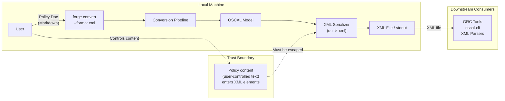
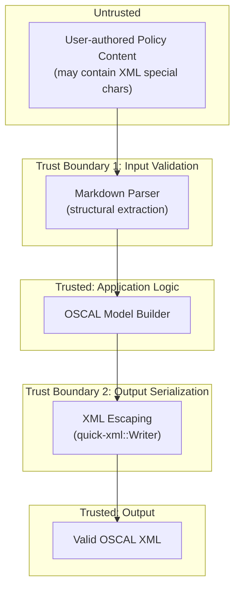

# 026-sec-xml-output

> **Document Type:** Security Review (Lightweight)
> **Audience:** LLM agents, human reviewers
> **Status:** Draft
> **Last Updated:** 2026-02-11 <!-- @auto -->
> **Reviewer:** Brian Luby <!-- @human-required -->
> **Risk Level:** Medium-High <!-- @human-required -->

---

## Review Tier Legend

| Marker | Tier | Speckit Behavior |
|--------|------|------------------|
| :red_circle: `@human-required` | Human Generated | Prompt human to author; blocks until complete |
| :yellow_circle: `@human-review` | LLM + Human Review | LLM drafts -> prompt human to confirm/edit; blocks until confirmed |
| :green_circle: `@llm-autonomous` | LLM Autonomous | LLM completes; no prompt; logged for audit |
| :white_circle: `@auto` | Auto-generated | System fills (timestamps, links); no prompt |

---

## Severity Definitions

| Level | Label | Definition |
|-------|-------|------------|
| :red_circle: | **Critical** | Immediate exploitation risk; data breach or system compromise likely |
| :orange_circle: | **High** | Significant risk; exploitation possible with moderate effort |
| :yellow_circle: | **Medium** | Notable risk; exploitation requires specific conditions |
| :green_circle: | **Low** | Minor risk; limited impact or unlikely exploitation |

---

## Linkage :white_circle: `@auto`

| Document | ID | Relationship |
|----------|-----|--------------|
| Parent PRD | [026-prd-xml-output.md](../PRD/026-prd-xml-output.md) | Feature being reviewed |
| Architecture Review | [026-ar-xml-output.md](../AR/026-ar-xml-output.md) | Technical implementation |

---

## Purpose

This is a **lightweight security review** intended to catch obvious security concerns early in the product lifecycle. It is NOT a comprehensive threat model. Full threat modeling should occur during implementation when infrastructure-as-code and concrete implementations exist.

**This review answers three questions:**
1. What does this feature expose to attackers?
2. What data does it touch, and how sensitive is that data?
3. What's the impact if something goes wrong?

**Scope of this review:**
- :white_check_mark: Attack surface identification
- :white_check_mark: Data classification
- :white_check_mark: High-level CIA assessment
- :x: Detailed threat enumeration (deferred to implementation)
- :x: Penetration testing (deferred to implementation)
- :x: Compliance audit (separate process)

---

## Feature Security Summary

### One-line Summary :red_circle: `@human-required`
> OSCAL XML serialization of policy-derived content using `quick-xml`, where user-sourced text (policy headings, control statements, prose) is embedded into XML elements -- requiring proper escaping to prevent XML injection and ensure downstream consumer safety.

### Risk Assessment :red_circle: `@human-required`
> **Risk Level:** Medium-High
> **Justification:** Policy content containing XML special characters (`<`, `>`, `&`, `"`, `'`) is embedded directly into XML elements; improper escaping could produce malformed XML that causes parsing failures or injection in downstream XML consumers. While FORGE only serializes (does not parse external XML), the output is consumed by third-party GRC tools that may be vulnerable to XXE or injection if FORGE produces unsafe XML.

---

## Attack Surface Analysis

### Exposure Points :yellow_circle: `@human-review`

| Exposure Type | Details | Authentication | Authorization | Notes |
|---------------|---------|----------------|---------------|-------|
| User Input Field | Policy document content (Markdown text with headings, clauses, prose) serialized into XML elements | -- | -- | Content passes through conversion pipeline into XML output; must be escaped |
| User Input Field | CLI arguments (`--format xml`, `--output <path>`) | -- | -- | Standard CLI argument parsing via clap |
| **None** (Network) | **No network exposure -- local CLI tool** | -- | -- | No internet endpoints, APIs, or webhooks |

### Attack Surface Diagram :green_circle: `@llm-autonomous`



### Exposure Checklist :green_circle: `@llm-autonomous`

- [x] **Internet-facing endpoints require authentication** -- N/A: no internet-facing endpoints
- [x] **No sensitive data in URL parameters** -- N/A: no URLs or web endpoints
- [x] **File uploads validated** -- N/A: no file uploads; input is local file path read from disk
- [x] **Rate limiting configured** -- N/A: no network endpoints
- [x] **CORS policy is restrictive** -- N/A: no web server
- [x] **No debug/admin endpoints exposed** -- N/A: CLI tool
- [x] **Webhooks validate signatures** -- N/A: no webhooks

---

## Data Flow Analysis

### Data Inventory :yellow_circle: `@human-review`

| Data Element | PRD Entity | Classification | Source | Destination | Retention | Encrypted Rest | Encrypted Transit | Residency |
|--------------|------------|----------------|--------|-------------|-----------|----------------|-------------------|-----------|
| Policy document text | Source Markdown content | Internal | Local filesystem | XML output file / stdout | None (pass-through) | N/A | N/A | Local |
| OSCAL metadata (uuid, title, version) | OscalMetadata | Internal | Generated in-memory | XML output | None (pass-through) | N/A | N/A | Local |
| Control statements and prose | Control.parts, Group.title | Internal | Derived from policy document | XML element text content | None (pass-through) | N/A | N/A | Local |
| Output XML file | Serialized OSCAL XML | Internal | Generated in-memory | Local filesystem / stdout | User-managed | N/A | N/A | Local |

### Data Classification Reference :green_circle: `@llm-autonomous`

| Level | Label | Description | Examples | Handling Requirements |
|-------|-------|-------------|----------|----------------------|
| 1 | **Public** | No impact if disclosed | Marketing content, public docs | No special handling |
| 2 | **Internal** | Minor impact if disclosed | Internal configs, non-sensitive logs | Access controls, no public exposure |
| 3 | **Confidential** | Significant impact if disclosed | PII, user data, credentials | Encryption, audit logging, access controls |
| 4 | **Restricted** | Severe impact if disclosed | Payment data, health records, secrets | Encryption, strict access, compliance requirements |

### Data Flow Diagram :green_circle: `@llm-autonomous`

```mermaid
flowchart TD
    subgraph Input
        U[User] -->|"Policy doc\n(Internal)"| F[forge convert]
    end

    subgraph Processing
        F -->|"Parsed content"| P[Conversion Pipeline]
        P -->|"OSCAL Model"| X[XML Serializer]
        X -->|"Escape special chars\n& < > \" '"| W["quick-xml::Writer"]
    end

    subgraph Output
        W -->|"Internal"| File["XML File"]
        W -->|"Internal"| Stdout["stdout"]
    end

    subgraph "Downstream (out of FORGE scope)"
        File -->|"Consumed by"| GRC["GRC Tools / oscal-cli"]
    end

    style X fill:#f96,stroke:#333
    style W fill:#f96,stroke:#333
```

### Data Handling Checklist :green_circle: `@llm-autonomous`

- [x] **No Restricted data stored unless absolutely required** -- No Restricted data involved; policy content is Internal classification
- [x] **Confidential data encrypted at rest** -- N/A: no Confidential data stored
- [x] **All data encrypted in transit (TLS 1.2+)** -- N/A: no network transit; local file I/O only
- [x] **PII has defined retention policy** -- N/A: no PII collected or processed
- [x] **Logs do not contain Confidential/Restricted data** -- N/A: CLI tool with no persistent logging
- [x] **Secrets are not hardcoded** -- No secrets in codebase; no authentication
- [x] **Data minimization applied** -- Only policy content necessary for OSCAL generation is processed
- [x] **Data residency requirements documented** -- N/A: all data local to user's machine

---

## Third-Party & Supply Chain :yellow_circle: `@human-review`

### New External Services

| Service | Purpose | Data Shared | Communication | Approved? |
|---------|---------|-------------|---------------|-----------|
| None | No external services | -- | -- | N/A |

### New Libraries/Dependencies

| Library | Version | License | Purpose | Security Check |
|---------|---------|---------|---------|----------------|
| quick-xml | latest stable | MIT | XML serialization -- writing OSCAL model to XML format | :white_check_mark: Approved -- well-maintained, widely used, MIT license, no known CVEs |

### Supply Chain Checklist

- [x] **All new services use encrypted communication** -- N/A: no external services
- [x] **Service agreements/ToS reviewed** -- N/A: no external services
- [x] **Dependencies have acceptable licenses** -- quick-xml is MIT licensed
- [x] **Dependencies are actively maintained** -- quick-xml has recent commits and responsive maintainers
- [x] **No known critical vulnerabilities** -- No CVEs for quick-xml at time of review

---

## CIA Impact Assessment

If this feature is compromised, what's the impact?

### Confidentiality :yellow_circle: `@human-review`

> **What could be disclosed?**

| Asset at Risk | Classification | Exposure Scenario | Impact | Likelihood |
|---------------|----------------|-------------------|--------|------------|
| Policy content in XML output | Internal | XML file written to world-readable path; user misconfigures output permissions | Low | Low |

**Confidentiality Risk Level:** Low

### Integrity :yellow_circle: `@human-review`

> **What could be modified or corrupted?**

| Asset at Risk | Modification Scenario | Impact | Likelihood |
|---------------|----------------------|--------|------------|
| OSCAL XML output | XML injection via unescaped policy content containing `<`, `>`, `&`, `"`, `'` characters -- producing malformed or structurally altered XML | High | Medium |
| OSCAL XML output | Incorrect XML element ordering or attribute placement producing schema-invalid XML that is silently accepted by lenient parsers | Medium | Low |
| Downstream GRC tool state | Malformed FORGE XML output causes XXE or injection when parsed by vulnerable downstream XML consumers | High | Low |

**Integrity Risk Level:** Medium-High

### Availability :yellow_circle: `@human-review`

> **What could be disrupted?**

| Service/Function | Disruption Scenario | Impact | Likelihood |
|------------------|---------------------|--------|------------|
| XML serialization | Policy content with extreme nesting or very large documents causes memory exhaustion during XML generation | Low | Low |
| Downstream XML parsers | Billion Laughs-style entity expansion in FORGE output (if FORGE were to emit DTD declarations -- it should NOT) | Medium | Very Low |

**Availability Risk Level:** Low

### CIA Summary :green_circle: `@llm-autonomous`

| Dimension | Risk Level | Primary Concern | Mitigation Priority |
|-----------|------------|-----------------|---------------------|
| **Confidentiality** | Low | Policy content in output file permissions | Low |
| **Integrity** | Medium-High | XML injection via unescaped special characters in policy content | High |
| **Availability** | Low | Memory exhaustion on extremely large documents | Low |

**Overall CIA Risk:** Medium-High -- *Integrity is the primary concern: policy-derived text content must be properly XML-escaped to prevent output corruption and downstream parser exploitation.*

---

## Trust Boundaries :yellow_circle: `@human-review`



### Trust Boundary Checklist :green_circle: `@llm-autonomous`

- [x] **All input from untrusted sources is validated** -- Policy content passes through Markdown parser; XML special characters must be escaped at serialization time by quick-xml
- [x] **External API responses are validated** -- N/A: no external API calls
- [x] **Authorization checked at data access, not just entry point** -- N/A: no authorization model
- [x] **Service-to-service calls are authenticated** -- N/A: no service-to-service calls

---

## Known Risks & Mitigations :yellow_circle: `@human-review`

| ID | Risk Description | Severity | Mitigation | Status | Owner |
|----|------------------|----------|------------|--------|-------|
| R1 | **XML Injection:** Policy content containing XML special characters (`<`, `>`, `&`, `"`, `'`) is embedded in XML elements without proper escaping, producing malformed or exploitable XML output | Medium-High | Use `quick-xml::Writer` exclusively for XML generation (never string concatenation); quick-xml automatically escapes text content in `BytesText` events; verify escaping in unit tests with adversarial input | Open | Brian Luby |
| R2 | **XXE Enablement:** Generated XML includes a DTD declaration or entity definitions that could enable XXE attacks when parsed by downstream consumers | Medium | Never emit `<!DOCTYPE>` declarations or entity definitions in generated XML; verify absence in unit tests | Open | Brian Luby |
| R3 | **Namespace Injection:** Policy content injected into XML attribute values could break namespace declarations or introduce unauthorized namespace bindings | Low | Use `quick-xml` attribute API (not string concatenation) for all attribute values; quick-xml escapes attribute values automatically | Open | Brian Luby |
| R4 | **CDATA Injection:** If CDATA sections are used for prose content, a `]]>` sequence in policy text could prematurely close the CDATA section | Low | Avoid CDATA sections entirely; use standard text escaping via `BytesText` for all content | Open | Brian Luby |
| R5 | **Large Document Memory Exhaustion:** Extremely large policy documents could cause unbounded memory consumption during XML serialization | Low | quick-xml uses streaming Writer with bounded buffer; document size is bounded by input file size | Mitigated | Brian Luby |

### Risk Acceptance :red_circle: `@human-required`

| Risk ID | Accepted By | Date | Justification | Review Date |
|---------|-------------|------|---------------|-------------|
| R5 | Brian Luby | 2026-02-11 | Memory consumption is bounded by input size; no amplification during XML serialization; performance benchmarks in WI-24 cover this scenario | 2026-08-11 |

---

## Security Requirements :yellow_circle: `@human-review`

### Authentication & Authorization

| Req ID | Requirement | PRD AC | Verification Method |
|--------|-------------|--------|---------------------|
| N/A | No authentication or authorization required -- local CLI tool | -- | -- |

### Data Protection

| Req ID | Requirement | PRD AC | Verification Method |
|--------|-------------|--------|---------------------|
| SEC-1 | XML output shall not contain DTD declarations or entity definitions | -- | Unit Test |
| SEC-2 | Policy content embedded in XML shall not alter XML document structure (no injection) | AC-1, AC-2 | Unit Test with adversarial input |

### Input Validation

| Req ID | Requirement | PRD AC | Verification Method |
|--------|-------------|--------|---------------------|
| SEC-3 | All user-derived text content shall be XML-escaped when serialized (special characters `<`, `>`, `&`, `"`, `'` properly escaped) | AC-5, EC-2 | Unit Test |
| SEC-4 | XML attributes (uuid, href, media-type) shall be properly escaped via quick-xml attribute API | AC-5 | Unit Test |
| SEC-5 | No string concatenation shall be used for XML construction -- all XML must go through quick-xml::Writer | -- | Code Review |

### Operational Security

| Req ID | Requirement | PRD AC | Verification Method |
|--------|-------------|--------|---------------------|
| SEC-6 | Generated XML shall include only the OSCAL namespace (`http://csrc.nist.gov/ns/oscal/1.0`) -- no additional namespace declarations from user content | AC-1, EC-4 | Unit Test |
| SEC-7 | XML output shall validate against OSCAL XSD schemas with zero errors, ensuring structural integrity | AC-3, AC-4 | Integration Test |

---

## Compliance Considerations :yellow_circle: `@human-review`

| Regulation | Applicable? | Relevant Requirements | N/A Justification |
|------------|-------------|----------------------|-------------------|
| GDPR | N/A | -- | Local CLI tool; no PII collection, storage, or transmission; no network communication |
| CCPA | N/A | -- | No personal information collected or shared; local processing only |
| SOC 2 | N/A | -- | No hosted service; no multi-tenant data handling |
| HIPAA | N/A | -- | No health information processed |
| PCI-DSS | N/A | -- | No payment data involved |
| Other | N/A | -- | FORGE is a local CLI tool with no network, auth, database, or PII |

---

## Review Findings

### Issues Identified :yellow_circle: `@human-review`

| ID | Finding | Severity | Category | Recommendation | Status |
|----|---------|----------|----------|----------------|--------|
| F1 | XML special character escaping must be verified for all text content paths (control titles, prose, remarks, property values) | Medium | Integrity | Write unit tests with input containing `<script>alert('xss')</script>`, `&entity;`, and `]]>` sequences; verify output is properly escaped | Open |
| F2 | Ensure no DTD or entity declarations are emitted in output -- prevents downstream XXE | Medium | Integrity | Add negative test: verify generated XML does not contain `<!DOCTYPE` or `<!ENTITY` strings | Open |
| F3 | XML serialization must use quick-xml::Writer API exclusively -- no string formatting for XML elements | Medium | Integrity | Code review checklist item; AR guardrail already mandates this | Open |
| F4 | OSCAL namespace should only appear on root element -- user content must not inject additional xmlns declarations | Low | Integrity | Unit test verifying namespace count in generated XML | Open |

### Positive Observations :green_circle: `@llm-autonomous`

- The AR mandates `quick-xml::Writer` for all XML construction, which provides automatic text escaping -- this is the correct approach and eliminates the most common XML injection vector
- The AR explicitly prohibits string concatenation for XML generation, which is a strong security-positive design decision
- The AR mandates XSD schema validation of all output, which serves as a structural integrity check that catches many injection and malformation issues
- FORGE only serializes XML (output-only) and never parses untrusted XML input, which eliminates the entire class of XXE deserialization attacks on FORGE itself
- The architecture is additive -- if XML serialization is found insecure, it can be removed without affecting JSON output

---

## Open Questions :yellow_circle: `@human-review`

- [ ] **Q1:** Should FORGE include an XML processing instruction (e.g., `<?xml-model?>`) linking to the OSCAL XSD schema in the output? This would aid downstream consumers but adds a potential injection vector if the href is derived from user input. Recommendation: use a hardcoded schema reference only.

---

## Changelog :white_circle: `@auto`

| Version | Date | Author | Changes |
|---------|------|--------|---------|
| 0.1 | 2026-02-11 | LLM (Claude) | Initial review |

---

## Review Sign-off :red_circle: `@human-required`

| Role | Name | Date | Decision |
|------|------|------|----------|
| Security Reviewer | Brian Luby | YYYY-MM-DD | [Approved / Approved with conditions / Rejected] |
| Feature Owner | Brian Luby | YYYY-MM-DD | [Acknowledged] |

### Conditions for Approval (if applicable) :red_circle: `@human-required`

- [ ] Unit tests with adversarial XML input (special characters, entity references, CDATA terminators) must pass before merge
- [ ] Code review confirms no string concatenation is used for XML element construction
- [ ] Generated XML verified to contain no DTD or entity declarations

---

## Security Requirements Traceability :green_circle: `@llm-autonomous`

| SEC Req ID | PRD Req ID | PRD AC ID | Test Type | Test Location |
|------------|------------|-----------|-----------|---------------|
| SEC-1 | -- | -- | Unit | tests/xml_serializer_test.rs |
| SEC-2 | M-1, M-2 | AC-1, AC-2 | Unit | tests/xml_injection_test.rs |
| SEC-3 | M-7 | AC-5, EC-2 | Unit | tests/xml_escaping_test.rs |
| SEC-4 | M-7 | AC-5 | Unit | tests/xml_attribute_test.rs |
| SEC-5 | -- | -- | Code Review | PR review checklist |
| SEC-6 | M-3 | AC-1, EC-4 | Unit | tests/xml_namespace_test.rs |
| SEC-7 | M-5 | AC-3, AC-4 | Integration | tests/xml_schema_validation_test.rs |

---

## Review Checklist :green_circle: `@llm-autonomous`

Before marking as Approved:
- [x] Attack surface documented with auth/authz status for each exposure
- [x] Exposure Points table has no contradictory rows (None vs. actual endpoints)
- [x] All PRD Data Model entities appear in Data Inventory
- [x] All data elements are classified using the 4-tier model
- [x] Third-party dependencies and services are listed
- [x] CIA impact is assessed with Low/Medium/High ratings
- [x] Trust boundaries are identified
- [x] Security requirements have verification methods specified
- [x] Security requirements trace to PRD ACs where applicable
- [ ] No Critical/High findings remain Open
- [x] Compliance N/A items have justification
- [x] Risk acceptance has named approver and review date
