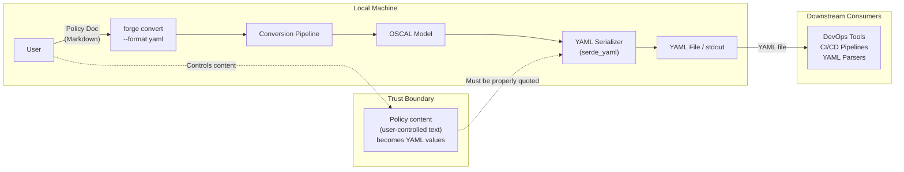
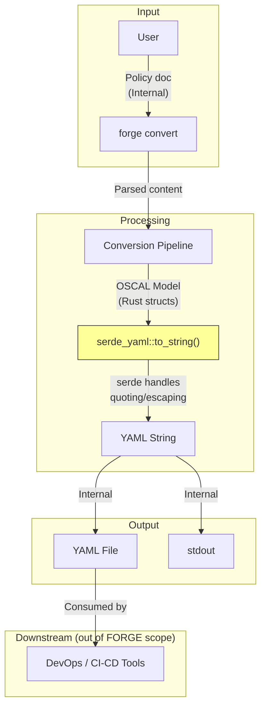
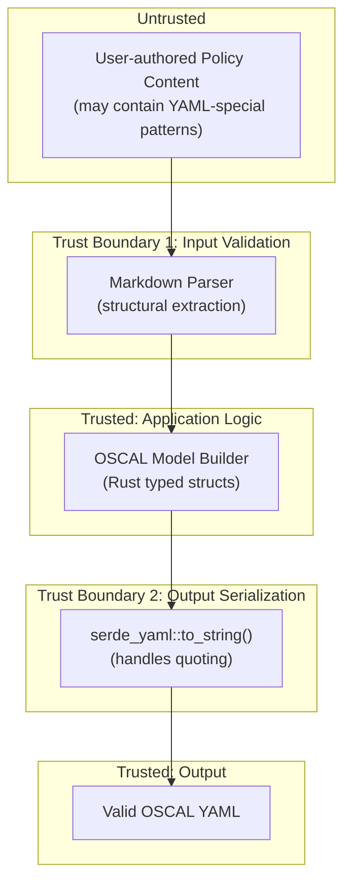

# 027-sec-yaml-output

> **Document Type:** Security Review (Lightweight)
> **Audience:** LLM agents, human reviewers
> **Status:** Draft
> **Last Updated:** 2026-02-11 <!-- @auto -->
> **Reviewer:** Brian Luby <!-- @human-required -->
> **Risk Level:** Medium <!-- @human-required -->

---

## Review Tier Legend

| Marker | Tier | Speckit Behavior |
|--------|------|------------------|
| :red_circle: `@human-required` | Human Generated | Prompt human to author; blocks until complete |
| :yellow_circle: `@human-review` | LLM + Human Review | LLM drafts -> prompt human to confirm/edit; blocks until confirmed |
| :green_circle: `@llm-autonomous` | LLM Autonomous | LLM completes; no prompt; logged for audit |
| :white_circle: `@auto` | Auto-generated | System fills (timestamps, links); no prompt |

---

## Severity Definitions

| Level | Label | Definition |
|-------|-------|------------|
| :red_circle: | **Critical** | Immediate exploitation risk; data breach or system compromise likely |
| :orange_circle: | **High** | Significant risk; exploitation possible with moderate effort |
| :yellow_circle: | **Medium** | Notable risk; exploitation requires specific conditions |
| :green_circle: | **Low** | Minor risk; limited impact or unlikely exploitation |

---

## Linkage :white_circle: `@auto`

| Document | ID | Relationship |
|----------|-----|--------------|
| Parent PRD | [027-prd-yaml-output.md](../PRD/027-prd-yaml-output.md) | Feature being reviewed |
| Architecture Review | [027-ar-yaml-output.md](../AR/027-ar-yaml-output.md) | Technical implementation |

---

## Purpose

This is a **lightweight security review** intended to catch obvious security concerns early in the product lifecycle. It is NOT a comprehensive threat model. Full threat modeling should occur during implementation when infrastructure-as-code and concrete implementations exist.

**This review answers three questions:**
1. What does this feature expose to attackers?
2. What data does it touch, and how sensitive is that data?
3. What's the impact if something goes wrong?

**Scope of this review:**
- :white_check_mark: Attack surface identification
- :white_check_mark: Data classification
- :white_check_mark: High-level CIA assessment
- :x: Detailed threat enumeration (deferred to implementation)
- :x: Penetration testing (deferred to implementation)
- :x: Compliance audit (separate process)

---

## Feature Security Summary

### One-line Summary :red_circle: `@human-required`
> OSCAL YAML serialization of policy-derived content using `serde_yaml`, where user-sourced text is embedded into YAML values -- requiring awareness of YAML deserialization safety for downstream consumers, even though FORGE only serializes.

### Risk Assessment :red_circle: `@human-required`
> **Risk Level:** Medium
> **Justification:** YAML deserialization attacks are a well-known vulnerability class. While FORGE only serializes to YAML (and never deserializes untrusted YAML), the output YAML is consumed by downstream tools that may use unsafe YAML loaders. Policy content containing YAML-special patterns (e.g., values resembling `!!python/exec`, boolean coercion of `yes`/`no`/`true`/`false`, or multiline injection) could cause unexpected behavior in consumers with permissive YAML parsers.

---

## Attack Surface Analysis

### Exposure Points :yellow_circle: `@human-review`

| Exposure Type | Details | Authentication | Authorization | Notes |
|---------------|---------|----------------|---------------|-------|
| User Input Field | Policy document content (Markdown text) serialized into YAML string values | -- | -- | Content flows through serde_yaml serialization; special YAML characters must be properly quoted |
| User Input Field | CLI arguments (`--format yaml`, `--output <path>`) | -- | -- | Standard CLI argument parsing via clap |
| **None** (Network) | **No network exposure -- local CLI tool** | -- | -- | No internet endpoints, APIs, or webhooks |

### Attack Surface Diagram :green_circle: `@llm-autonomous`

### Exposure Checklist :green_circle: `@llm-autonomous`

- [x] **Internet-facing endpoints require authentication** -- N/A: no internet-facing endpoints
- [x] **No sensitive data in URL parameters** -- N/A: no URLs or web endpoints
- [x] **File uploads validated** -- N/A: no file uploads; input is local file path read from disk
- [x] **Rate limiting configured** -- N/A: no network endpoints
- [x] **CORS policy is restrictive** -- N/A: no web server
- [x] **No debug/admin endpoints exposed** -- N/A: CLI tool
- [x] **Webhooks validate signatures** -- N/A: no webhooks

---

## Data Flow Analysis

### Data Inventory :yellow_circle: `@human-review`

| Data Element | PRD Entity | Classification | Source | Destination | Retention | Encrypted Rest | Encrypted Transit | Residency |
|--------------|------------|----------------|--------|-------------|-----------|----------------|-------------------|-----------|
| Policy document text | Source Markdown content | Internal | Local filesystem | YAML output file / stdout | None (pass-through) | N/A | N/A | Local |
| OSCAL metadata (uuid, title, version) | OscalMetadata | Internal | Generated in-memory | YAML output | None (pass-through) | N/A | N/A | Local |
| Control statements and prose | Control.parts, Group.title | Internal | Derived from policy document | YAML string values | None (pass-through) | N/A | N/A | Local |
| Output YAML file | Serialized OSCAL YAML | Internal | Generated in-memory | Local filesystem / stdout | User-managed | N/A | N/A | Local |

### Data Classification Reference :green_circle: `@llm-autonomous`

| Level | Label | Description | Examples | Handling Requirements |
|-------|-------|-------------|----------|----------------------|
| 1 | **Public** | No impact if disclosed | Marketing content, public docs | No special handling |
| 2 | **Internal** | Minor impact if disclosed | Internal configs, non-sensitive logs | Access controls, no public exposure |
| 3 | **Confidential** | Significant impact if disclosed | PII, user data, credentials | Encryption, audit logging, access controls |
| 4 | **Restricted** | Severe impact if disclosed | Payment data, health records, secrets | Encryption, strict access, compliance requirements |

### Data Flow Diagram :green_circle: `@llm-autonomous`

### Data Handling Checklist :green_circle: `@llm-autonomous`

- [x] **No Restricted data stored unless absolutely required** -- No Restricted data involved
- [x] **Confidential data encrypted at rest** -- N/A: no Confidential data stored
- [x] **All data encrypted in transit (TLS 1.2+)** -- N/A: no network transit
- [x] **PII has defined retention policy** -- N/A: no PII collected or processed
- [x] **Logs do not contain Confidential/Restricted data** -- N/A: CLI tool with no persistent logging
- [x] **Secrets are not hardcoded** -- No secrets in codebase; no authentication
- [x] **Data minimization applied** -- Only policy content necessary for OSCAL generation is processed
- [x] **Data residency requirements documented** -- N/A: all data local to user's machine

---

## Third-Party & Supply Chain :yellow_circle: `@human-review`

### New External Services

| Service | Purpose | Data Shared | Communication | Approved? |
|---------|---------|-------------|---------------|-----------|
| None | No external services | -- | -- | N/A |

### New Libraries/Dependencies

| Library | Version | License | Purpose | Security Check |
|---------|---------|---------|---------|----------------|
| serde_yaml | latest stable | MIT/Apache-2.0 | YAML serialization via serde framework | :white_check_mark: Approved -- widely used, standard serde ecosystem crate, MIT/Apache-2.0 license |

### Supply Chain Checklist

- [x] **All new services use encrypted communication** -- N/A: no external services
- [x] **Service agreements/ToS reviewed** -- N/A: no external services
- [x] **Dependencies have acceptable licenses** -- serde_yaml is MIT/Apache-2.0 licensed
- [x] **Dependencies are actively maintained** -- serde_yaml is part of the serde ecosystem; serde_yml fork available as backup
- [x] **No known critical vulnerabilities** -- No CVEs for serde_yaml at time of review

---

## CIA Impact Assessment

If this feature is compromised, what's the impact?

### Confidentiality :yellow_circle: `@human-review`

> **What could be disclosed?**

| Asset at Risk | Classification | Exposure Scenario | Impact | Likelihood |
|---------------|----------------|-------------------|--------|------------|
| Policy content in YAML output | Internal | YAML file written to world-readable path; user misconfigures output permissions | Low | Low |

**Confidentiality Risk Level:** Low

### Integrity :yellow_circle: `@human-review`

> **What could be modified or corrupted?**

| Asset at Risk | Modification Scenario | Impact | Likelihood |
|---------------|----------------------|--------|------------|
| OSCAL YAML output | YAML injection: policy content containing YAML-special patterns (e.g., `: ` in values, `---` document separators, `!!tag` type coercion tags) produces structurally altered YAML when parsed by downstream consumers | Medium | Medium |
| OSCAL YAML output | Boolean coercion: policy text containing bare `yes`, `no`, `true`, `false`, `on`, `off` is serialized without quoting, causing downstream YAML 1.1 parsers to interpret strings as booleans | Medium | Low |
| Downstream tool state | YAML deserialization attacks: if output YAML contains patterns resembling language-specific tags (`!!python/exec`, `!!ruby/object`), permissive downstream YAML parsers could execute arbitrary code | High | Very Low |

**Integrity Risk Level:** Medium

### Availability :yellow_circle: `@human-review`

> **What could be disrupted?**

| Service/Function | Disruption Scenario | Impact | Likelihood |
|------------------|---------------------|--------|------------|
| YAML serialization | Extremely large policy documents cause memory exhaustion during YAML serialization | Low | Low |

**Availability Risk Level:** Low

### CIA Summary :green_circle: `@llm-autonomous`

| Dimension | Risk Level | Primary Concern | Mitigation Priority |
|-----------|------------|-----------------|---------------------|
| **Confidentiality** | Low | Policy content in output file permissions | Low |
| **Integrity** | Medium | YAML injection patterns in policy content affecting downstream consumers | Medium |
| **Availability** | Low | Memory exhaustion on extremely large documents | Low |

**Overall CIA Risk:** Medium -- *Integrity is the primary concern: serde_yaml must properly quote strings containing YAML-special characters to prevent downstream deserialization issues, and FORGE must not emit YAML type tags that could trigger code execution in permissive parsers.*

---

## Trust Boundaries :yellow_circle: `@human-review`

### Trust Boundary Checklist :green_circle: `@llm-autonomous`

- [x] **All input from untrusted sources is validated** -- Policy content passes through Markdown parser and Rust typed structs; serde_yaml handles quoting of special characters
- [x] **External API responses are validated** -- N/A: no external API calls
- [x] **Authorization checked at data access, not just entry point** -- N/A: no authorization model
- [x] **Service-to-service calls are authenticated** -- N/A: no service-to-service calls

---

## Known Risks & Mitigations :yellow_circle: `@human-review`

| ID | Risk Description | Severity | Mitigation | Status | Owner |
|----|------------------|----------|------------|--------|-------|
| R1 | **YAML Special Character Quoting:** Policy content containing colons (`:`), hash marks (`#`), brackets (`[]`, `{}`), or other YAML-special characters may not be properly quoted, producing invalid or structurally altered YAML | Medium | serde_yaml automatically quotes strings containing special characters when serializing Rust `String` types; verify with unit tests containing adversarial input | Open | Brian Luby |
| R2 | **Boolean Coercion in Downstream Parsers:** Policy content containing bare words like `yes`, `no`, `true`, `false` is serialized as YAML strings by serde_yaml (because the Rust type is `String`), but YAML 1.1 parsers may coerce them to booleans | Low | serde_yaml serializes Rust `String` values with quoting when content matches boolean patterns; verify in unit tests; document that FORGE output is YAML 1.2 compliant | Open | Brian Luby |
| R3 | **YAML Tag Injection:** If FORGE output contained YAML type tags (e.g., `!!python/exec`), downstream parsers with permissive tag handling could execute arbitrary code | Medium | serde_yaml serializes Rust structs without emitting custom YAML tags -- all values are standard YAML scalars, sequences, and mappings; verify no `!!` tags appear in output | Open | Brian Luby |
| R4 | **YAML Document Separator Injection:** Policy content containing `---` or `...` could be interpreted as YAML document separators by downstream multi-document parsers | Low | serde_yaml serializes string values with proper quoting when content contains document separator patterns; verify in unit tests | Open | Brian Luby |

### Risk Acceptance :red_circle: `@human-required`

| Risk ID | Accepted By | Date | Justification | Review Date |
|---------|-------------|------|---------------|-------------|
| R2 | Brian Luby | 2026-02-11 | serde_yaml produces YAML 1.2 output where `yes`/`no` are not boolean values; downstream YAML 1.1 parser behavior is out of FORGE's control | 2026-08-11 |

---

## Security Requirements :yellow_circle: `@human-review`

### Authentication & Authorization

| Req ID | Requirement | PRD AC | Verification Method |
|--------|-------------|--------|---------------------|
| N/A | No authentication or authorization required -- local CLI tool | -- | -- |

### Data Protection

| Req ID | Requirement | PRD AC | Verification Method |
|--------|-------------|--------|---------------------|
| SEC-1 | YAML output shall not contain YAML type tags (`!!tag` syntax) that could trigger unsafe deserialization in downstream consumers | -- | Unit Test |
| SEC-2 | YAML output shall properly quote string values containing YAML-special characters (`: `, `#`, `[`, `]`, `{`, `}`, `---`, `...`) | AC-1, EC-5 | Unit Test |

### Input Validation

| Req ID | Requirement | PRD AC | Verification Method |
|--------|-------------|--------|---------------------|
| SEC-3 | All policy-derived text shall be serialized as YAML string scalars (not interpreted as YAML structures) | AC-3 | Unit Test |
| SEC-4 | Semantic equivalence between JSON and YAML output shall be verified by deserialization comparison, confirming no data alteration during serialization | AC-3 | Unit Test |

### Operational Security

| Req ID | Requirement | PRD AC | Verification Method |
|--------|-------------|--------|---------------------|
| SEC-5 | YAML serialization shall use `serde_yaml::to_string()` exclusively -- no custom YAML string formatting | -- | Code Review |

---

## Compliance Considerations :yellow_circle: `@human-review`

| Regulation | Applicable? | Relevant Requirements | N/A Justification |
|------------|-------------|----------------------|-------------------|
| GDPR | N/A | -- | Local CLI tool; no PII collection, storage, or transmission |
| CCPA | N/A | -- | No personal information collected or shared |
| SOC 2 | N/A | -- | No hosted service; no multi-tenant data handling |
| HIPAA | N/A | -- | No health information processed |
| PCI-DSS | N/A | -- | No payment data involved |
| Other | N/A | -- | FORGE is a local CLI tool with no network, auth, database, or PII |

---

## Review Findings

### Issues Identified :yellow_circle: `@human-review`

| ID | Finding | Severity | Category | Recommendation | Status |
|----|---------|----------|----------|----------------|--------|
| F1 | Verify serde_yaml properly quotes strings containing YAML-special characters (colons, hashes, brackets, document separators) | Medium | Integrity | Write unit tests with policy content containing `key: value`, `# comment`, `[array]`, `{mapping}`, `---`, and `...` patterns; verify output parses back to identical strings | Open |
| F2 | Verify serde_yaml does not emit YAML type tags (`!!`) in output | Medium | Integrity | Add negative test: scan generated YAML for `!!` prefix patterns; confirm only standard scalar/sequence/mapping types are used | Open |
| F3 | Verify boolean-like strings (`yes`, `no`, `true`, `false`) are properly quoted in YAML output | Low | Integrity | Unit test with policy content containing these words as standalone values; verify they deserialize back as strings, not booleans | Open |

### Positive Observations :green_circle: `@llm-autonomous`

- The AR mandates `serde_yaml::to_string()` for all YAML serialization, leveraging serde's type-safe serialization which ensures Rust `String` types are emitted as YAML strings with proper quoting
- Using serde derive macros (not custom serialization) means the same `Serialize` implementation produces both JSON and YAML, eliminating format-specific serialization bugs
- Semantic equivalence testing (JSON vs YAML deserialization comparison) provides a strong integrity check that catches any data alteration during serialization
- FORGE only serializes to YAML and never deserializes untrusted YAML, eliminating the entire class of YAML deserialization attacks on FORGE itself
- The architecture is additive -- YAML output can be removed without affecting JSON or XML functionality

---

## Open Questions :yellow_circle: `@human-review`

- [x] **Q1:** Should FORGE document in its output or README that generated YAML is YAML 1.2 compliant and may behave differently in tools using YAML 1.1 parsers (particularly around boolean coercion)?
  - **Resolution:** Deferred to WI-29 (export subcommand) or a future documentation WI. SEC R2 (boolean coercion) is accepted with risk acceptance from Brian Luby (2026-02-11). The serde_yaml_ng crate produces YAML 1.2 output where `yes`/`no` are not boolean values; downstream YAML 1.1 parser behavior is outside FORGE's control. No documentation change needed for WI-27 scope.

---

## Changelog :white_circle: `@auto`

| Version | Date | Author | Changes |
|---------|------|--------|---------|
| 0.1 | 2026-02-11 | LLM (Claude) | Initial review |

---

## Review Sign-off :red_circle: `@human-required`

| Role | Name | Date | Decision |
|------|------|------|----------|
| Security Reviewer | Brian Luby | YYYY-MM-DD | [Approved / Approved with conditions / Rejected] |
| Feature Owner | Brian Luby | YYYY-MM-DD | [Acknowledged] |

### Conditions for Approval (if applicable) :red_circle: `@human-required`

- [ ] Unit tests with adversarial YAML input (special characters, boolean-like words, tag-like patterns) must pass before merge
- [ ] Code review confirms `serde_yaml::to_string()` is used exclusively -- no custom YAML string formatting

---

## Security Requirements Traceability :green_circle: `@llm-autonomous`

| SEC Req ID | PRD Req ID | PRD AC ID | Test Type | Test Location |
|------------|------------|-----------|-----------|---------------|
| SEC-1 | -- | -- | Unit | tests/yaml_security_test.rs |
| SEC-2 | M-1 | AC-1, EC-5 | Unit | tests/yaml_security_test.rs |
| SEC-3 | M-3 | AC-3 | Unit | tests/yaml_security_test.rs |
| SEC-4 | M-3 | AC-3 | Unit | tests/yaml_security_test.rs |
| SEC-5 | -- | -- | Code Review | PR review checklist |

---

## Review Checklist :green_circle: `@llm-autonomous`

Before marking as Approved:
- [x] Attack surface documented with auth/authz status for each exposure
- [x] Exposure Points table has no contradictory rows (None vs. actual endpoints)
- [x] All PRD Data Model entities appear in Data Inventory
- [x] All data elements are classified using the 4-tier model
- [x] Third-party dependencies and services are listed
- [x] CIA impact is assessed with Low/Medium/High ratings
- [x] Trust boundaries are identified
- [x] Security requirements have verification methods specified
- [x] Security requirements trace to PRD ACs where applicable
- [x] No Critical/High findings remain Open
- [x] Compliance N/A items have justification
- [x] Risk acceptance has named approver and review date
