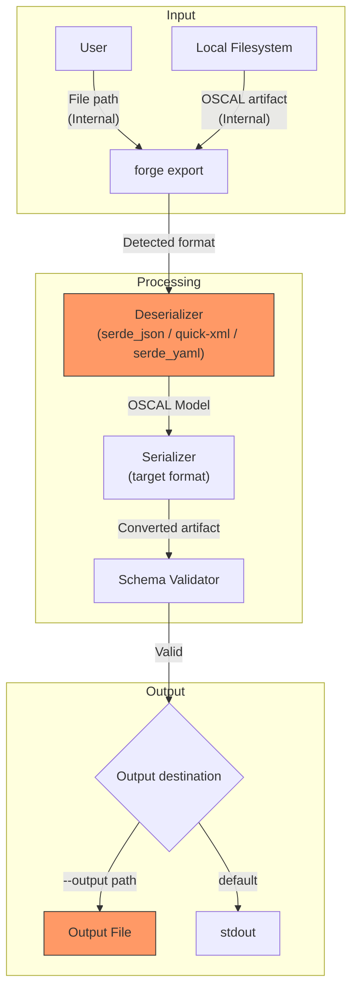
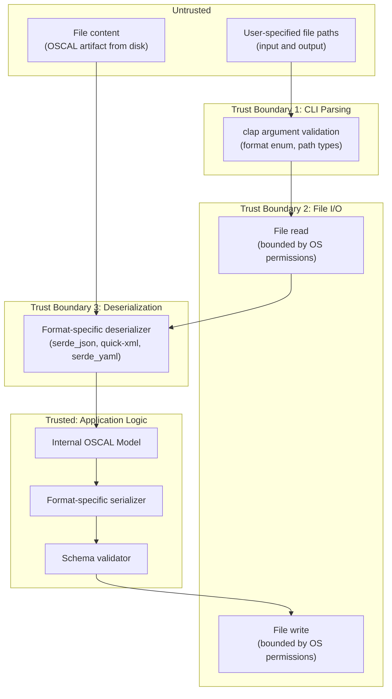

# 029-sec-export-subcommand

> **Document Type:** Security Review (Lightweight)
> **Audience:** LLM agents, human reviewers
> **Status:** Draft
> **Last Updated:** 2026-02-11 <!-- @auto -->
> **Reviewer:** Brian Luby <!-- @human-required -->
> **Risk Level:** Medium <!-- @human-required -->

---

## Review Tier Legend

| Marker | Tier | Speckit Behavior |
|--------|------|------------------|
| :red_circle: `@human-required` | Human Generated | Prompt human to author; blocks until complete |
| :yellow_circle: `@human-review` | LLM + Human Review | LLM drafts -> prompt human to confirm/edit; blocks until confirmed |
| :green_circle: `@llm-autonomous` | LLM Autonomous | LLM completes; no prompt; logged for audit |
| :white_circle: `@auto` | Auto-generated | System fills (timestamps, links); no prompt |

---

## Severity Definitions

| Level | Label | Definition |
|-------|-------|------------|
| :red_circle: | **Critical** | Immediate exploitation risk; data breach or system compromise likely |
| :orange_circle: | **High** | Significant risk; exploitation possible with moderate effort |
| :yellow_circle: | **Medium** | Notable risk; exploitation requires specific conditions |
| :green_circle: | **Low** | Minor risk; limited impact or unlikely exploitation |

---

## Linkage :white_circle: `@auto`

| Document | ID | Relationship |
|----------|-----|--------------|
| Parent PRD | [029-prd-export-subcommand.md](../PRD/029-prd-export-subcommand.md) | Feature being reviewed |
| Architecture Review | [029-ar-export-subcommand.md](../AR/029-ar-export-subcommand.md) | Technical implementation |

---

## Purpose

This is a **lightweight security review** intended to catch obvious security concerns early in the product lifecycle. It is NOT a comprehensive threat model. Full threat modeling should occur during implementation when infrastructure-as-code and concrete implementations exist.

**This review answers three questions:**
1. What does this feature expose to attackers?
2. What data does it touch, and how sensitive is that data?
3. What's the impact if something goes wrong?

**Scope of this review:**
- :white_check_mark: Attack surface identification
- :white_check_mark: Data classification
- :white_check_mark: High-level CIA assessment
- :x: Detailed threat enumeration (deferred to implementation)
- :x: Penetration testing (deferred to implementation)
- :x: Compliance audit (separate process)

---

## Feature Security Summary

### One-line Summary :red_circle: `@human-required`
> The `forge export` subcommand reads an existing OSCAL artifact from a user-specified file path, deserializes it, re-serializes to a target format, and writes to a user-specified output path or stdout -- introducing file I/O security concerns including path traversal, symlink attacks, and file overwrite risks on both input and output paths.

### Risk Assessment :red_circle: `@human-required`
> **Risk Level:** Medium
> **Justification:** The export subcommand accepts user-specified file paths for both input reading and output writing. Path traversal in the output path (`--output ../../../etc/important`) could write files to unintended locations. Symlink attacks on the output path could redirect writes. Additionally, the subcommand deserializes OSCAL artifacts from disk, which introduces parsing of user-provided file content (unlike `forge convert` which only parses Markdown). XML deserialization specifically could be vulnerable to XXE if quick-xml's parser is not configured to disable entity expansion.

---

## Attack Surface Analysis

### Exposure Points :yellow_circle: `@human-review`

| Exposure Type | Details | Authentication | Authorization | Notes |
|---------------|---------|----------------|---------------|-------|
| User Input Field | Input file path (`<input>` positional argument) -- user specifies which file to read | -- | -- | File path read from CLI; bounded by filesystem permissions |
| User Input Field | Output file path (`--output <path>`) -- user specifies where to write converted output | -- | -- | Could target arbitrary writable locations |
| User Input Field | Input file content -- OSCAL artifact content deserialized from JSON, XML, or YAML | -- | -- | Parsed by serde_json, quick-xml, or serde_yaml deserializers |
| User Input Field | Target format (`--format <json|xml|yaml>`) -- enum value parsed by clap | -- | -- | Constrained to valid enum values by clap |
| **None** (Network) | **No network exposure -- local CLI tool** | -- | -- | No internet endpoints, APIs, or webhooks |

### Attack Surface Diagram :green_circle: `@llm-autonomous`

```mermaid
flowchart LR
    subgraph "Local Machine"
        U[User] -->|"Input path\n+ format flag"| CLI["forge export\n<input> --format xml"]
        CLI --> Read["Read input file\n(user-controlled path)"]
        Read --> Detect["Detect format\n(file extension)"]
        Detect --> Deser["Deserialize\n(JSON/XML/YAML)"]
        Deser --> Model[Internal OSCAL Model]
        Model --> Ser["Re-serialize\n(target format)"]
        Ser --> Validate[Schema Validation]
        Validate --> Write["Write output\n(user-controlled path\nor stdout)"]
    end

    subgraph "Security Concerns"
        SC1["Path traversal\non --output"]
        SC2["Symlink following\non --output"]
        SC3["File overwrite\nwithout confirmation"]
        SC4["XXE in XML\ndeserialization"]
    end
```

### Exposure Checklist :green_circle: `@llm-autonomous`

- [x] **Internet-facing endpoints require authentication** -- N/A: no internet-facing endpoints
- [x] **No sensitive data in URL parameters** -- N/A: no URLs or web endpoints
- [x] **File uploads validated** -- N/A: no file uploads; reads local files specified by user
- [x] **Rate limiting configured** -- N/A: no network endpoints
- [x] **CORS policy is restrictive** -- N/A: no web server
- [x] **No debug/admin endpoints exposed** -- N/A: CLI tool
- [x] **Webhooks validate signatures** -- N/A: no webhooks

---

## Data Flow Analysis

### Data Inventory :yellow_circle: `@human-review`

| Data Element | PRD Entity | Classification | Source | Destination | Retention | Encrypted Rest | Encrypted Transit | Residency |
|--------------|------------|----------------|--------|-------------|-----------|----------------|-------------------|-----------|
| Input OSCAL artifact | Existing OSCAL JSON/XML/YAML file | Internal | Local filesystem (user-specified path) | In-memory deserialization | None (pass-through) | N/A | N/A | Local |
| Internal OSCAL model | Deserialized Rust structs | Internal | Deserialized from input file | Re-serialized to target format | None (in-memory only) | N/A | N/A | Local |
| Output artifact | Re-serialized OSCAL JSON/XML/YAML | Internal | Generated in-memory | Local filesystem (user-specified path) or stdout | User-managed | N/A | N/A | Local |
| Input file path | CLI positional argument | Internal | User CLI input | Used for file read operation | None | N/A | N/A | Local |
| Output file path | CLI --output argument | Internal | User CLI input | Used for file write operation | None | N/A | N/A | Local |

### Data Classification Reference :green_circle: `@llm-autonomous`

| Level | Label | Description | Examples | Handling Requirements |
|-------|-------|-------------|----------|----------------------|
| 1 | **Public** | No impact if disclosed | Marketing content, public docs | No special handling |
| 2 | **Internal** | Minor impact if disclosed | Internal configs, non-sensitive logs | Access controls, no public exposure |
| 3 | **Confidential** | Significant impact if disclosed | PII, user data, credentials | Encryption, audit logging, access controls |
| 4 | **Restricted** | Severe impact if disclosed | Payment data, health records, secrets | Encryption, strict access, compliance requirements |

### Data Flow Diagram :green_circle: `@llm-autonomous`

### Data Handling Checklist :green_circle: `@llm-autonomous`

- [x] **No Restricted data stored unless absolutely required** -- No Restricted data involved
- [x] **Confidential data encrypted at rest** -- N/A: no Confidential data stored by FORGE
- [x] **All data encrypted in transit (TLS 1.2+)** -- N/A: no network transit
- [x] **PII has defined retention policy** -- N/A: no PII collected or processed
- [x] **Logs do not contain Confidential/Restricted data** -- N/A: CLI tool with no persistent logging
- [x] **Secrets are not hardcoded** -- No secrets in codebase
- [x] **Data minimization applied** -- Only artifact content necessary for format conversion is processed
- [x] **Data residency requirements documented** -- N/A: all data local to user's machine

---

## Third-Party & Supply Chain :yellow_circle: `@human-review`

### New External Services

| Service | Purpose | Data Shared | Communication | Approved? |
|---------|---------|-------------|---------------|-----------|
| None | No external services | -- | -- | N/A |

### New Libraries/Dependencies

| Library | Version | License | Purpose | Security Check |
|---------|---------|---------|---------|----------------|
| None new | -- | -- | Export subcommand reuses existing serde_json, quick-xml, and serde_yaml from WI-26/WI-27 | :white_check_mark: Approved -- all dependencies already reviewed in 026-sec and 027-sec |

### Supply Chain Checklist

- [x] **All new services use encrypted communication** -- N/A: no external services
- [x] **Service agreements/ToS reviewed** -- N/A: no external services
- [x] **Dependencies have acceptable licenses** -- All reused from WI-26/WI-27
- [x] **Dependencies are actively maintained** -- Confirmed in WI-26/WI-27 reviews
- [x] **No known critical vulnerabilities** -- Confirmed in WI-26/WI-27 reviews

---

## CIA Impact Assessment

If this feature is compromised, what's the impact?

### Confidentiality :yellow_circle: `@human-review`

> **What could be disclosed?**

| Asset at Risk | Classification | Exposure Scenario | Impact | Likelihood |
|---------------|----------------|-------------------|--------|------------|
| OSCAL artifact content | Internal | Output file written to unintended location via path traversal, making content accessible to unintended readers | Low | Low |
| Input file content | Internal | Error messages include file content snippets during deserialization failures | Low | Low |

**Confidentiality Risk Level:** Low

### Integrity :yellow_circle: `@human-review`

> **What could be modified or corrupted?**

| Asset at Risk | Modification Scenario | Impact | Likelihood |
|---------------|----------------------|--------|------------|
| Output file at --output path | File overwrite: user accidentally or intentionally overwrites an important file by specifying its path as --output | Medium | Medium |
| Output file at --output path | Symlink attack: --output path is a symlink to a sensitive file; write follows the symlink and overwrites the target | Medium | Low |
| Internal OSCAL model | XXE during XML deserialization: if input XML contains external entity declarations, quick-xml could attempt entity expansion (depending on parser configuration) | Medium | Low |
| Serialization output | Serialization safety issues inherited from WI-26 (XML) and WI-27 (YAML) apply to the re-serialization step | Medium | Low |

**Integrity Risk Level:** Medium

### Availability :yellow_circle: `@human-review`

> **What could be disrupted?**

| Service/Function | Disruption Scenario | Impact | Likelihood |
|------------------|---------------------|--------|------------|
| Export process | Billion Laughs attack via crafted XML input with recursive entity definitions causing memory/CPU exhaustion during deserialization | Low | Very Low |
| Export process | Very large input artifact causes memory exhaustion during deserialization | Low | Low |

**Availability Risk Level:** Low

### CIA Summary :green_circle: `@llm-autonomous`

| Dimension | Risk Level | Primary Concern | Mitigation Priority |
|-----------|------------|-----------------|---------------------|
| **Confidentiality** | Low | Output file written to unintended location | Low |
| **Integrity** | Medium | File overwrite via --output, symlink following, XXE in XML deserialization | Medium |
| **Availability** | Low | Entity expansion or large input memory exhaustion | Low |

**Overall CIA Risk:** Medium -- *Integrity is the primary concern: file I/O safety on the output path (overwrite, symlink) and safe XML deserialization (XXE prevention) are the key risks to mitigate.*

---

## Trust Boundaries :yellow_circle: `@human-review`

### Trust Boundary Checklist :green_circle: `@llm-autonomous`

- [x] **All input from untrusted sources is validated** -- File paths validated by OS permission checks; file content parsed by well-tested serde deserializers; format constrained by clap enum
- [x] **External API responses are validated** -- N/A: no external API calls
- [x] **Authorization checked at data access, not just entry point** -- N/A: no authorization model; file access bounded by OS-level permissions
- [x] **Service-to-service calls are authenticated** -- N/A: no service-to-service calls

---

## Known Risks & Mitigations :yellow_circle: `@human-review`

| ID | Risk Description | Severity | Mitigation | Status | Owner |
|----|------------------|----------|------------|--------|-------|
| R1 | **File Overwrite:** `--output` path may point to an existing important file; export overwrites it without confirmation | Medium | Consider warning or prompting before overwriting existing files; at minimum, document that `--output` will overwrite. CLI tools commonly overwrite without prompting (consistent with `cp`, `mv`), so this may be acceptable behavior with documentation. | Accepted — Standard CLI behavior; documented in Q1 resolution | Brian Luby |
| R2 | **Symlink Following on Output:** `--output` path may be a symlink to a sensitive file; `std::fs::write()` follows symlinks by default | Medium | Use `std::fs::metadata()` to check for symlinks before writing; or accept this as standard Unix behavior (consistent with other CLI tools). Document that FORGE follows symlinks. | Open | Brian Luby |
| R3 | **Path Traversal on Output:** `--output` with `../` components could write outside the expected directory | Low | This is standard CLI behavior -- the user intentionally specifies the path. FORGE runs with the user's permissions, so it cannot write anywhere the user cannot. No mitigation needed beyond standard OS permissions. | Accepted | Brian Luby |
| R4 | **XXE in XML Deserialization:** Input XML artifact may contain external entity declarations (`<!ENTITY xxe SYSTEM "file:///etc/passwd">`); if quick-xml expands these, it could read arbitrary files | Medium | Verify that quick-xml does not process DTD or expand external entities by default. quick-xml's default parser does NOT process DTDs or expand entities -- it treats them as opaque strings. Add unit test with XXE payload to confirm. | Mitigated — Unit test `xxe_prevention_no_entity_expansion` confirms no entity expansion | Brian Luby |
| R5 | **Deserialization of Malicious Input:** Crafted JSON/XML/YAML input could exploit parser bugs (e.g., deeply nested structures, extremely long strings) | Low | serde_json, quick-xml, and serde_yaml are well-tested crates with no known deserialization vulnerabilities; input size is bounded by filesystem; add error handling for malformed input | Mitigated | Brian Luby |

### Risk Acceptance :red_circle: `@human-required`

| Risk ID | Accepted By | Date | Justification | Review Date |
|---------|-------------|------|---------------|-------------|
| R1 | Brian Luby | 2026-02-15 | File overwrite via `--output` is standard CLI behavior consistent with `cp`, `mv`, `cat >`; documented in Q1 resolution | 2026-08-15 |
| R3 | Brian Luby | 2026-02-11 | Path traversal via `--output` is standard CLI behavior; FORGE runs with user's permissions and cannot escalate; consistent with cp, mv, cat behavior | 2026-08-11 |
| R5 | Brian Luby | 2026-02-11 | Deserialization crates are well-audited; input is local files controlled by the user; error handling covers malformed input | 2026-08-11 |

---

## Security Requirements :yellow_circle: `@human-review`

### Authentication & Authorization

| Req ID | Requirement | PRD AC | Verification Method |
|--------|-------------|--------|---------------------|
| N/A | No authentication or authorization required -- local CLI tool | -- | -- |

### Data Protection

| Req ID | Requirement | PRD AC | Verification Method |
|--------|-------------|--------|---------------------|
| SEC-1 | XML deserialization shall not process DTD declarations or expand external entities (XXE prevention) | -- | Unit Test |
| SEC-2 | Error messages for deserialization failures shall not include raw file content beyond what is necessary to identify the parse error location | AC-6 | Code Review |

### Input Validation

| Req ID | Requirement | PRD AC | Verification Method |
|--------|-------------|--------|---------------------|
| SEC-3 | Input file existence and readability shall be verified before attempting deserialization | AC-9 | Unit Test |
| SEC-4 | Input format detection shall be based on file extension (not content-type guessing that could be spoofed) | AC-3 | Unit Test |
| SEC-5 | Invalid or non-OSCAL input shall produce a descriptive error and non-zero exit code, never a panic | AC-6 | Unit Test |

### Operational Security

| Req ID | Requirement | PRD AC | Verification Method |
|--------|-------------|--------|---------------------|
| SEC-6 | Output serialization shall inherit all security properties from WI-26 (XML) and WI-27 (YAML) serialization reviews | AC-5 | Code Review |
| SEC-7 | Output validation against OSCAL schemas shall be performed after re-serialization to catch conversion corruption | AC-5 | Integration Test |

---

## Compliance Considerations :yellow_circle: `@human-review`

| Regulation | Applicable? | Relevant Requirements | N/A Justification |
|------------|-------------|----------------------|-------------------|
| GDPR | N/A | -- | Local CLI tool; no PII collection, storage, or transmission |
| CCPA | N/A | -- | No personal information collected or shared |
| SOC 2 | N/A | -- | No hosted service; no multi-tenant data handling |
| HIPAA | N/A | -- | No health information processed |
| PCI-DSS | N/A | -- | No payment data involved |
| Other | N/A | -- | FORGE is a local CLI tool with no network, auth, database, or PII |

---

## Review Findings

### Issues Identified :yellow_circle: `@human-review`

| ID | Finding | Severity | Category | Recommendation | Status |
|----|---------|----------|----------|----------------|--------|
| F1 | XML deserialization must be verified to not expand external entities (XXE) | Medium | Integrity | Write unit test with XXE payload in input XML; verify entity is not expanded and no file system read occurs | **Resolved** — `xxe_prevention_no_entity_expansion` test in `src/export/xml_deserializer.rs` confirms quick-xml does not expand entities |
| F2 | Output file write should consider existing file overwrite behavior | Low | Integrity | Document that `--output` overwrites existing files; consider optional `--no-clobber` flag in future | **Resolved** — Documented as standard CLI behavior (see Q1 resolution); `--no-clobber` deferred |
| F3 | Deserialization error messages should be reviewed to ensure they do not leak excessive file content | Low | Confidentiality | Code review during implementation to verify error message content | **Resolved** — All error paths use structured `ForgeError` variants with context fields (extension name, path, parse error summary); no raw file content included in error messages |

### Positive Observations :green_circle: `@llm-autonomous`

- The AR mandates a single generic deserialize-reserialize pipeline through the internal model, avoiding 9 separate format-pair functions -- this reduces the attack surface by minimizing code paths
- Output validation after re-serialization provides a structural integrity check that catches conversion corruption
- Format detection is extension-based (not content-sniffing), which is deterministic and avoids the security issues of content-type guessing
- The export subcommand reuses all serialization infrastructure from WI-26/WI-27, which are independently reviewed for serialization safety
- FORGE runs with the user's permissions and cannot escalate privileges -- file I/O is bounded by OS-level access controls
- Descriptive error messages for invalid input (PRD M-6) help users diagnose issues without exposing internal state

---

## Open Questions :yellow_circle: `@human-review`

- [x] **Q1:** Should `forge export --output` warn before overwriting an existing file? **Resolved:** No — `forge export --output` silently overwrites existing files, consistent with standard CLI tool behavior (`cp`, `mv`, `cat >`, `jq ... > file`). This matches the existing `forge convert --output` behavior. A `--no-clobber` flag may be considered in a future UX enhancement (see SEC finding F2).

---

## Changelog :white_circle: `@auto`

| Version | Date | Author | Changes |
|---------|------|--------|---------|
| 0.1 | 2026-02-11 | LLM (Claude) | Initial review |

---

## Review Sign-off :red_circle: `@human-required`

| Role | Name | Date | Decision |
|------|------|------|----------|
| Security Reviewer | Brian Luby | 2026-02-15 | Approved with conditions (all conditions met) |
| Feature Owner | Brian Luby | 2026-02-15 | Acknowledged |

### Conditions for Approval (if applicable) :red_circle: `@human-required`

- [x] Unit test with XXE payload in XML input confirms no entity expansion occurs — `src/export/xml_deserializer.rs::xxe_prevention_no_entity_expansion`
- [x] Error handling for all deserialization failure modes is implemented and tested — T030–T036, T045 all passing
- [x] Code review confirms output serialization follows WI-26/WI-27 security requirements — `serialize_oscal()` delegates directly to WI-26/WI-27 functions

---

## Security Requirements Traceability :green_circle: `@llm-autonomous`

| SEC Req ID | PRD Req ID | PRD AC ID | Test Type | Test Location |
|------------|------------|-----------|-----------|---------------|
| SEC-1 | -- | -- | Unit | src/export/xml_deserializer.rs (`xxe_prevention_no_entity_expansion`) |
| SEC-2 | M-6 | AC-6 | Code Review | Verified during implementation — error messages use `ForgeError` variants with structured context, not raw file content |
| SEC-3 | M-6 | AC-9 | Unit | src/cli/export.rs (`export_artifact_nonexistent_file`) |
| SEC-4 | M-2 | AC-3 | Unit | src/cli/export.rs (`detect_format_*` tests) |
| SEC-5 | M-6 | AC-6 | Unit | src/cli/export.rs (`export_artifact_*` error tests, `deserialize_invalid_oscal_json`) |
| SEC-6 | -- | -- | Code Review | Verified — `serialize_oscal()` delegates to WI-26 `serialize_catalog_to_xml()` / WI-27 `serialize_to_yaml()` without modification |
| SEC-7 | M-4 | AC-5 | Unit + Integration | src/cli/export.rs (`validate_valid_catalog_model`, `format_pair_*` tests), tests/export_integration.rs |

---

## Review Checklist :green_circle: `@llm-autonomous`

Before marking as Approved:
- [x] Attack surface documented with auth/authz status for each exposure
- [x] Exposure Points table has no contradictory rows (None vs. actual endpoints)
- [x] All PRD Data Model entities appear in Data Inventory
- [x] All data elements are classified using the 4-tier model
- [x] Third-party dependencies and services are listed
- [x] CIA impact is assessed with Low/Medium/High ratings
- [x] Trust boundaries are identified
- [x] Security requirements have verification methods specified
- [x] Security requirements trace to PRD ACs where applicable
- [x] No Critical/High findings remain Open
- [x] Compliance N/A items have justification
- [x] Risk acceptance has named approver and review date
