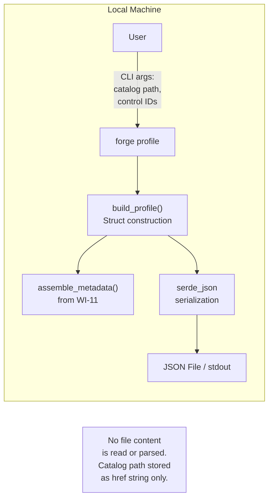
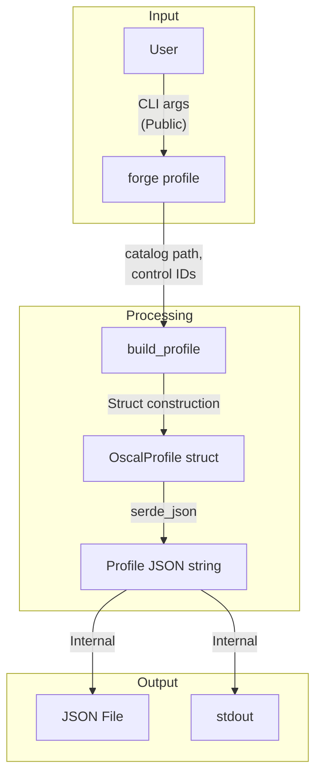
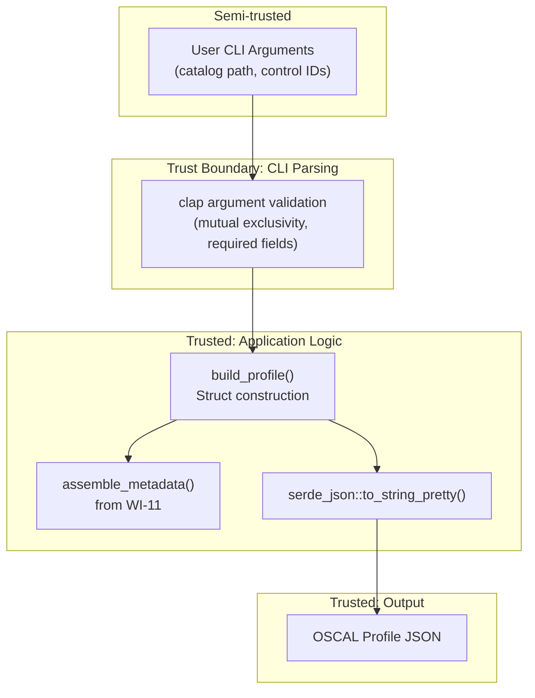

# 030-sec-profile-generation

> **Document Type:** Security Review (Lightweight)
> **Audience:** LLM agents, human reviewers
> **Status:** Draft
> **Last Updated:** 2026-02-11 <!-- @auto -->
> **Reviewer:** Brian Luby <!-- @human-required -->
> **Risk Level:** Low <!-- @human-required -->

---

## Review Tier Legend

| Marker | Tier | Speckit Behavior |
|--------|------|------------------|
| :red_circle: `@human-required` | Human Generated | Prompt human to author; blocks until complete |
| :yellow_circle: `@human-review` | LLM + Human Review | LLM drafts -> prompt human to confirm/edit; blocks until confirmed |
| :green_circle: `@llm-autonomous` | LLM Autonomous | LLM completes; no prompt; logged for audit |
| :white_circle: `@auto` | Auto-generated | System fills (timestamps, links); no prompt |

---

## Severity Definitions

| Level | Label | Definition |
|-------|-------|------------|
| :red_circle: | **Critical** | Immediate exploitation risk; data breach or system compromise likely |
| :orange_circle: | **High** | Significant risk; exploitation possible with moderate effort |
| :yellow_circle: | **Medium** | Notable risk; exploitation requires specific conditions |
| :green_circle: | **Low** | Minor risk; limited impact or unlikely exploitation |

---

## Linkage :white_circle: `@auto`

| Document | ID | Relationship |
|----------|-----|--------------|
| Parent PRD | [030-prd-profile-generation.md](../PRD/030-prd-profile-generation.md) | Feature being reviewed |
| Architecture Review | [030-ar-profile-generation.md](../AR/030-ar-profile-generation.md) | Technical implementation |

---

## Purpose

This is a **lightweight security review** intended to catch obvious security concerns early in the product lifecycle. It is NOT a comprehensive threat model. Full threat modeling should occur during implementation when infrastructure-as-code and concrete implementations exist.

**This review answers three questions:**
1. What does this feature expose to attackers?
2. What data does it touch, and how sensitive is that data?
3. What's the impact if something goes wrong?

**Scope of this review:**
- :white_check_mark: Attack surface identification
- :white_check_mark: Data classification
- :white_check_mark: High-level CIA assessment
- :x: Detailed threat enumeration (deferred to implementation)
- :x: Penetration testing (deferred to implementation)
- :x: Compliance audit (separate process)

---

## Feature Security Summary

### One-line Summary :red_circle: `@human-required`
> Profile generation constructs an OSCAL Profile JSON from CLI arguments (catalog path, control ID lists) and writes it to a file or stdout -- a low-risk internal data transformation with no parsing of untrusted content, no network access, and minimal file I/O.

### Risk Assessment :red_circle: `@human-required`
> **Risk Level:** Low
> **Justification:** Profile generation is an internal data construction operation. It takes CLI arguments (catalog path as a string, comma-separated control IDs), builds Rust structs, and serializes to JSON via serde. The catalog file is referenced by path in the `href` field but is NOT read or parsed by this work item (catalog parsing is deferred to WI-32 validation). No untrusted content is deserialized. The only file I/O is the optional `--output` write, which follows the same pattern established by `forge convert` and `forge export`.

---

## Attack Surface Analysis

### Exposure Points :yellow_circle: `@human-review`

| Exposure Type | Details | Authentication | Authorization | Notes |
|---------------|---------|----------------|---------------|-------|
| User Input Field | CLI arguments: `--catalog <path>`, `--include <ids>`, `--exclude <ids>`, `--output <path>` | -- | -- | All parsed by clap with type validation; control IDs are opaque strings passed through to output |
| **None** (Network) | **No network exposure -- local CLI tool** | -- | -- | No internet endpoints, APIs, or webhooks |
| **None** (File parsing) | **No file content parsing -- catalog path stored as href string only** | -- | -- | Source catalog is NOT read or deserialized in this WI |

### Attack Surface Diagram :green_circle: `@llm-autonomous`

### Exposure Checklist :green_circle: `@llm-autonomous`

- [x] **Internet-facing endpoints require authentication** -- N/A: no internet-facing endpoints
- [x] **No sensitive data in URL parameters** -- N/A: no URLs or web endpoints
- [x] **File uploads validated** -- N/A: no file uploads or file content parsing
- [x] **Rate limiting configured** -- N/A: no network endpoints
- [x] **CORS policy is restrictive** -- N/A: no web server
- [x] **No debug/admin endpoints exposed** -- N/A: CLI tool
- [x] **Webhooks validate signatures** -- N/A: no webhooks

---

## Data Flow Analysis

### Data Inventory :yellow_circle: `@human-review`

| Data Element | PRD Entity | Classification | Source | Destination | Retention | Encrypted Rest | Encrypted Transit | Residency |
|--------------|------------|----------------|--------|-------------|-----------|----------------|-------------------|-----------|
| Catalog file path | ProfileImport.href | Public | CLI argument (`--catalog`) | Profile JSON output as href string | None (pass-through) | N/A | N/A | Local |
| Control IDs | ControlSelection.with_ids | Public | CLI argument (`--include` / `--exclude`) | Profile JSON output in with-ids array | None (pass-through) | N/A | N/A | Local |
| Profile metadata | OscalMetadata (uuid, title, version, etc.) | Internal | Generated in-memory via WI-11 | Profile JSON output | None (pass-through) | N/A | N/A | Local |
| Output JSON file | Serialized OSCAL Profile JSON | Internal | Generated in-memory | Local filesystem / stdout | User-managed | N/A | N/A | Local |

### Data Classification Reference :green_circle: `@llm-autonomous`

| Level | Label | Description | Examples | Handling Requirements |
|-------|-------|-------------|----------|----------------------|
| 1 | **Public** | No impact if disclosed | Marketing content, public docs | No special handling |
| 2 | **Internal** | Minor impact if disclosed | Internal configs, non-sensitive logs | Access controls, no public exposure |
| 3 | **Confidential** | Significant impact if disclosed | PII, user data, credentials | Encryption, audit logging, access controls |
| 4 | **Restricted** | Severe impact if disclosed | Payment data, health records, secrets | Encryption, strict access, compliance requirements |

### Data Flow Diagram :green_circle: `@llm-autonomous`

### Data Handling Checklist :green_circle: `@llm-autonomous`

- [x] **No Restricted data stored unless absolutely required** -- No Restricted data involved; only Public/Internal data
- [x] **Confidential data encrypted at rest** -- N/A: no Confidential data
- [x] **All data encrypted in transit (TLS 1.2+)** -- N/A: no network transit
- [x] **PII has defined retention policy** -- N/A: no PII collected or processed
- [x] **Logs do not contain Confidential/Restricted data** -- N/A: CLI tool with no persistent logging
- [x] **Secrets are not hardcoded** -- No secrets in codebase
- [x] **Data minimization applied** -- Profile contains only control ID references and metadata; no policy text content
- [x] **Data residency requirements documented** -- N/A: all data local to user's machine

---

## Third-Party & Supply Chain :yellow_circle: `@human-review`

### New External Services

| Service | Purpose | Data Shared | Communication | Approved? |
|---------|---------|-------------|---------------|-----------|
| None | No external services | -- | -- | N/A |

### New Libraries/Dependencies

| Library | Version | License | Purpose | Security Check |
|---------|---------|---------|---------|----------------|
| None new | -- | -- | Profile generation reuses existing clap, serde, serde_json, uuid crates | :white_check_mark: Approved -- all dependencies already in use and reviewed |

### Supply Chain Checklist

- [x] **All new services use encrypted communication** -- N/A: no external services
- [x] **Service agreements/ToS reviewed** -- N/A: no external services
- [x] **Dependencies have acceptable licenses** -- All reused from existing codebase
- [x] **Dependencies are actively maintained** -- All actively maintained
- [x] **No known critical vulnerabilities** -- No known CVEs

---

## CIA Impact Assessment

If this feature is compromised, what's the impact?

### Confidentiality :yellow_circle: `@human-review`

> **What could be disclosed?**

| Asset at Risk | Classification | Exposure Scenario | Impact | Likelihood |
|---------------|----------------|-------------------|--------|------------|
| Control ID list in Profile | Public | Profile JSON file is readable; control IDs are not sensitive (they are identifiers, not policy text) | Very Low | Low |
| Catalog file path in href | Public | Profile JSON reveals the local path to the source catalog file | Very Low | Low |

**Confidentiality Risk Level:** Low

### Integrity :yellow_circle: `@human-review`

> **What could be modified or corrupted?**

| Asset at Risk | Modification Scenario | Impact | Likelihood |
|---------------|----------------------|--------|------------|
| Profile control selection | Incorrect control IDs in `--include`/`--exclude` produce a Profile that selects the wrong controls -- but this is user error, not a security vulnerability | Low | Low |
| Profile imports.href | Catalog path stored as-is from `--catalog` argument; if the path is wrong, the Profile references a non-existent or wrong catalog -- again user error | Low | Low |
| Profile JSON structure | serde serialization produces incorrect JSON (missing required OSCAL fields, wrong nesting) | Medium | Very Low |

**Integrity Risk Level:** Low

### Availability :yellow_circle: `@human-review`

> **What could be disrupted?**

| Service/Function | Disruption Scenario | Impact | Likelihood |
|------------------|---------------------|--------|------------|
| Profile generation | Extremely large control ID list (thousands of IDs) causes slow serialization | Very Low | Very Low |

**Availability Risk Level:** Low

### CIA Summary :green_circle: `@llm-autonomous`

| Dimension | Risk Level | Primary Concern | Mitigation Priority |
|-----------|------------|-----------------|---------------------|
| **Confidentiality** | Low | Catalog path and control IDs are not sensitive | Low |
| **Integrity** | Low | Correct OSCAL JSON structure ensured by serde typed serialization | Low |
| **Availability** | Low | No amplification or resource exhaustion vectors | Low |

**Overall CIA Risk:** Low -- *Profile generation is an internal data construction with no untrusted input parsing, no network access, and minimal file I/O. Integrity is ensured by Rust's type system and serde's deterministic serialization.*

---

## Trust Boundaries :yellow_circle: `@human-review`

### Trust Boundary Checklist :green_circle: `@llm-autonomous`

- [x] **All input from untrusted sources is validated** -- CLI arguments parsed by clap with type constraints; `--include`/`--exclude` mutual exclusivity enforced; control IDs are opaque strings (not executed or interpreted)
- [x] **External API responses are validated** -- N/A: no external API calls
- [x] **Authorization checked at data access, not just entry point** -- N/A: no authorization model
- [x] **Service-to-service calls are authenticated** -- N/A: no service-to-service calls

---

## Known Risks & Mitigations :yellow_circle: `@human-review`

| ID | Risk Description | Severity | Mitigation | Status | Owner |
|----|------------------|----------|------------|--------|-------|
| R1 | **Incorrect Control ID References:** User provides control IDs that do not exist in the source catalog, producing a Profile that references non-existent controls | Low | Profile generation is intentionally lightweight; ID validation is deferred to WI-32 (Profile validation). OSCAL Profiles validly reference IDs that may not yet exist in the catalog. | Accepted | Brian Luby |
| R2 | **Output File Overwrite:** `--output` path may overwrite an existing file without confirmation | Low | Standard CLI behavior; same pattern as `forge convert` and `forge export`; bounded by OS permissions | Accepted | Brian Luby |
| R3 | **Catalog Path Injection into href:** The `--catalog` path is stored as-is in the Profile `href` field; a malicious path string could be crafted to mislead downstream tools | Low | Profile `href` is a reference string, not an executable instruction; downstream tools validate hrefs independently; FORGE does not resolve or follow the href | Accepted | Brian Luby |

### Risk Acceptance :red_circle: `@human-required`

| Risk ID | Accepted By | Date | Justification | Review Date |
|---------|-------------|------|---------------|-------------|
| R1 | Brian Luby | 2026-02-11 | ID validation is explicitly WI-32's scope; OSCAL Profiles can validly reference IDs not yet in the catalog | 2026-08-11 |
| R2 | Brian Luby | 2026-02-11 | Standard CLI overwrite behavior; consistent with cp, mv, and other FORGE subcommands | 2026-08-11 |
| R3 | Brian Luby | 2026-02-11 | href is a data field, not an instruction; stored as-is per AR design decision; downstream tools independently validate | 2026-08-11 |

---

## Security Requirements :yellow_circle: `@human-review`

### Authentication & Authorization

| Req ID | Requirement | PRD AC | Verification Method |
|--------|-------------|--------|---------------------|
| N/A | No authentication or authorization required -- local CLI tool | -- | -- |

### Data Protection

| Req ID | Requirement | PRD AC | Verification Method |
|--------|-------------|--------|---------------------|
| SEC-1 | Profile JSON output shall not embed policy text content -- only control ID references and metadata | -- | Unit Test |

### Input Validation

| Req ID | Requirement | PRD AC | Verification Method |
|--------|-------------|--------|---------------------|
| SEC-2 | `--include` and `--exclude` shall be mutually exclusive, enforced by clap `conflicts_with` | AC-9 | Unit Test |
| SEC-3 | Empty control ID strings shall produce a descriptive error, not an empty Profile | EC-5 | Unit Test |
| SEC-4 | Catalog path argument shall be passed through as-is to href -- no file system operations on it | AC-2 | Unit Test |

### Operational Security

| Req ID | Requirement | PRD AC | Verification Method |
|--------|-------------|--------|---------------------|
| SEC-5 | Generated Profile JSON shall conform to the OSCAL v1.2.0 Profile schema structure | AC-5 | Unit Test |

---

## Compliance Considerations :yellow_circle: `@human-review`

| Regulation | Applicable? | Relevant Requirements | N/A Justification |
|------------|-------------|----------------------|-------------------|
| GDPR | N/A | -- | Local CLI tool; no PII collection, storage, or transmission |
| CCPA | N/A | -- | No personal information collected or shared |
| SOC 2 | N/A | -- | No hosted service; no multi-tenant data handling |
| HIPAA | N/A | -- | No health information processed |
| PCI-DSS | N/A | -- | No payment data involved |
| Other | N/A | -- | FORGE is a local CLI tool with no network, auth, database, or PII |

---

## Review Findings

### Issues Identified :yellow_circle: `@human-review`

| ID | Finding | Severity | Category | Recommendation | Status |
|----|---------|----------|----------|----------------|--------|
| F1 | Verify that the catalog path stored in `href` does not undergo any path normalization or resolution that could produce unexpected paths | Low | Integrity | Unit test confirming href value matches `--catalog` argument exactly | Open |

### Positive Observations :green_circle: `@llm-autonomous`

- Profile generation does NOT read or parse the source catalog file, which eliminates an entire class of deserialization risks
- Control IDs are treated as opaque strings -- they are never interpreted, executed, or used in file system operations
- The `--include`/`--exclude` mutual exclusivity is enforced at the CLI parsing layer (clap), preventing contradictory Profile generation
- Rust's type system and serde's deterministic serialization provide strong guarantees for correct OSCAL JSON structure
- Metadata generation reuses the shared WI-11 assembly, which has been reviewed in its own context -- no new metadata logic to assess
- No new dependencies are introduced -- all crates are already in use and reviewed

---

## Open Questions :yellow_circle: `@human-review`

No open questions for this work item.

---

## Changelog :white_circle: `@auto`

| Version | Date | Author | Changes |
|---------|------|--------|---------|
| 0.1 | 2026-02-11 | LLM (Claude) | Initial review |

---

## Review Sign-off :red_circle: `@human-required`

| Role | Name | Date | Decision |
|------|------|------|----------|
| Security Reviewer | Brian Luby | YYYY-MM-DD | [Approved / Approved with conditions / Rejected] |
| Feature Owner | Brian Luby | YYYY-MM-DD | [Acknowledged] |

### Conditions for Approval (if applicable) :red_circle: `@human-required`

- [ ] Unit test confirming href stores catalog path as-is (no normalization)
- [ ] Unit test confirming `--include`/`--exclude` mutual exclusivity produces clap error

---

## Security Requirements Traceability :green_circle: `@llm-autonomous`

| SEC Req ID | PRD Req ID | PRD AC ID | Test Type | Test Location |
|------------|------------|-----------|-----------|---------------|
| SEC-1 | -- | -- | Unit | tests/profile_generation_test.rs |
| SEC-2 | S-4 | AC-9 | Unit | tests/profile_generation_test.rs |
| SEC-3 | M-3 | EC-5 | Unit | tests/profile_generation_test.rs |
| SEC-4 | M-5 | AC-2 | Unit | tests/profile_generation_test.rs |
| SEC-5 | M-9 | AC-5 | Unit | tests/profile_generation_test.rs |

---

## Review Checklist :green_circle: `@llm-autonomous`

Before marking as Approved:
- [x] Attack surface documented with auth/authz status for each exposure
- [x] Exposure Points table has no contradictory rows (None vs. actual endpoints)
- [x] All PRD Data Model entities appear in Data Inventory
- [x] All data elements are classified using the 4-tier model
- [x] Third-party dependencies and services are listed
- [x] CIA impact is assessed with Low/Medium/High ratings
- [x] Trust boundaries are identified
- [x] Security requirements have verification methods specified
- [x] Security requirements trace to PRD ACs where applicable
- [x] No Critical/High findings remain Open
- [x] Compliance N/A items have justification
- [x] Risk acceptance has named approver and review date
