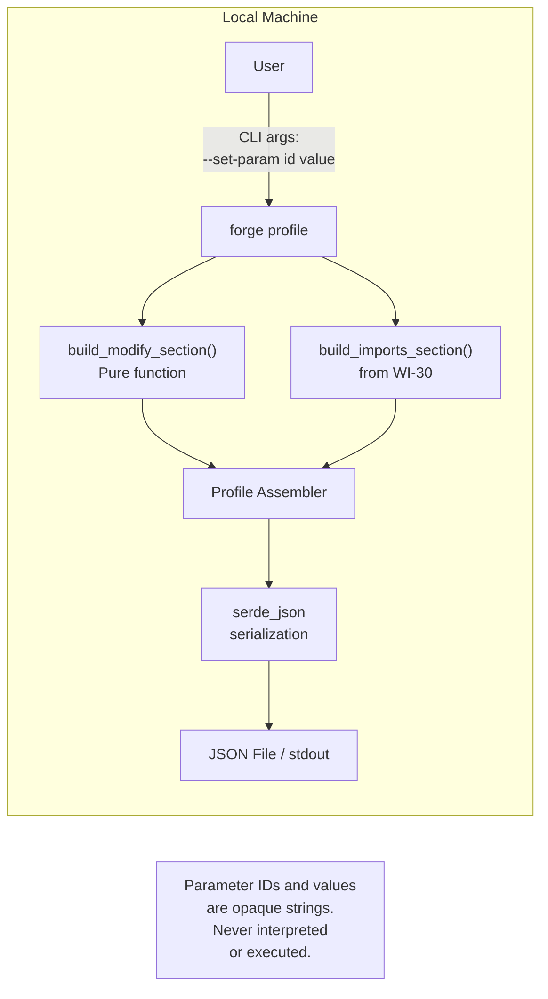
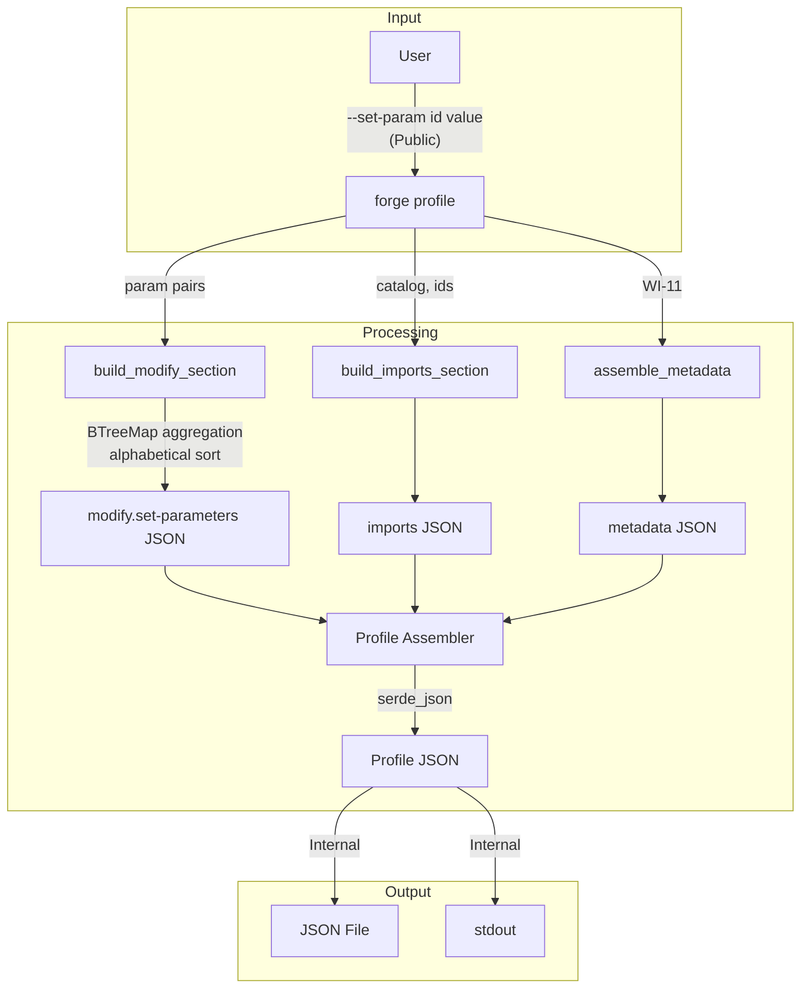
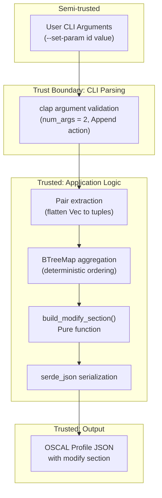

# 031-sec-profile-parameter-tailoring

> **Document Type:** Security Review (Lightweight)
> **Audience:** LLM agents, human reviewers
> **Status:** Draft
> **Last Updated:** 2026-02-11 <!-- @auto -->
> **Reviewer:** Brian Luby <!-- @human-required -->
> **Risk Level:** Low <!-- @human-required -->

---

## Review Tier Legend

| Marker | Tier | Speckit Behavior |
|--------|------|------------------|
| :red_circle: `@human-required` | Human Generated | Prompt human to author; blocks until complete |
| :yellow_circle: `@human-review` | LLM + Human Review | LLM drafts -> prompt human to confirm/edit; blocks until confirmed |
| :green_circle: `@llm-autonomous` | LLM Autonomous | LLM completes; no prompt; logged for audit |
| :white_circle: `@auto` | Auto-generated | System fills (timestamps, links); no prompt |

---

## Severity Definitions

| Level | Label | Definition |
|-------|-------|------------|
| :red_circle: | **Critical** | Immediate exploitation risk; data breach or system compromise likely |
| :orange_circle: | **High** | Significant risk; exploitation possible with moderate effort |
| :yellow_circle: | **Medium** | Notable risk; exploitation requires specific conditions |
| :green_circle: | **Low** | Minor risk; limited impact or unlikely exploitation |

---

## Linkage :white_circle: `@auto`

| Document | ID | Relationship |
|----------|-----|--------------|
| Parent PRD | [031-prd-profile-parameter-tailoring.md](../PRD/031-prd-profile-parameter-tailoring.md) | Feature being reviewed |
| Architecture Review | [031-ar-profile-parameter-tailoring.md](../AR/031-ar-profile-parameter-tailoring.md) | Technical implementation |

---

## Purpose

This is a **lightweight security review** intended to catch obvious security concerns early in the product lifecycle. It is NOT a comprehensive threat model. Full threat modeling should occur during implementation when infrastructure-as-code and concrete implementations exist.

**This review answers three questions:**
1. What does this feature expose to attackers?
2. What data does it touch, and how sensitive is that data?
3. What's the impact if something goes wrong?

**Scope of this review:**
- :white_check_mark: Attack surface identification
- :white_check_mark: Data classification
- :white_check_mark: High-level CIA assessment
- :x: Detailed threat enumeration (deferred to implementation)
- :x: Penetration testing (deferred to implementation)
- :x: Compliance audit (separate process)

---

## Feature Security Summary

### One-line Summary :red_circle: `@human-required`
> Parameter tailoring extends the WI-30 Profile builder by adding a `modify` section with `set-parameters` entries constructed from `--set-param` CLI arguments -- a low-risk additive extension that passes user-supplied parameter ID/value pairs through to JSON output without interpretation.

### Risk Assessment :red_circle: `@human-required`
> **Risk Level:** Low
> **Justification:** Parameter tailoring is an additive extension to the existing Profile builder. It takes user-supplied `--set-param <id> <value>` CLI arguments and constructs `set-parameters` entries in the Profile's `modify` section. The parameter IDs and values are opaque strings passed through to JSON output via serde -- they are never interpreted, executed, or used in file system operations. No new file parsing, network access, or untrusted content deserialization is introduced. The only new concern is data integrity: ensuring that parameter modifications produce valid, non-misleading OSCAL output.

---

## Attack Surface Analysis

### Exposure Points :yellow_circle: `@human-review`

| Exposure Type | Details | Authentication | Authorization | Notes |
|---------------|---------|----------------|---------------|-------|
| User Input Field | CLI arguments: `--set-param <id> <value>` (repeatable) | -- | -- | Parsed by clap with `num_args = 2`; values are opaque strings passed through to JSON |
| User Input Field | Inherited from WI-30: `--catalog <path>`, `--include <ids>`, `--exclude <ids>`, `--output <path>` | -- | -- | Same exposure as WI-30; see 030-sec-profile-generation |
| **None** (Network) | **No network exposure -- local CLI tool** | -- | -- | No internet endpoints, APIs, or webhooks |
| **None** (File parsing) | **No file content parsing** | -- | -- | Neither catalog nor parameter values involve file reads |

### Attack Surface Diagram :green_circle: `@llm-autonomous`

### Exposure Checklist :green_circle: `@llm-autonomous`

- [x] **Internet-facing endpoints require authentication** -- N/A: no internet-facing endpoints
- [x] **No sensitive data in URL parameters** -- N/A: no URLs or web endpoints
- [x] **File uploads validated** -- N/A: no file uploads or file content parsing
- [x] **Rate limiting configured** -- N/A: no network endpoints
- [x] **CORS policy is restrictive** -- N/A: no web server
- [x] **No debug/admin endpoints exposed** -- N/A: CLI tool
- [x] **Webhooks validate signatures** -- N/A: no webhooks

---

## Data Flow Analysis

### Data Inventory :yellow_circle: `@human-review`

| Data Element | PRD Entity | Classification | Source | Destination | Retention | Encrypted Rest | Encrypted Transit | Residency |
|--------------|------------|----------------|--------|-------------|-----------|----------------|-------------------|-----------|
| Parameter ID | SetParameter.param_id | Public | CLI argument (`--set-param` first value) | Profile JSON modify.set-parameters[].param-id | None (pass-through) | N/A | N/A | Local |
| Parameter value | SetParameter.values | Public | CLI argument (`--set-param` second value) | Profile JSON modify.set-parameters[].values[] | None (pass-through) | N/A | N/A | Local |
| Inherited: catalog path, control IDs, metadata | See WI-30 | Public/Internal | CLI arguments / generated | Profile JSON | None (pass-through) | N/A | N/A | Local |
| Output JSON file | Serialized OSCAL Profile JSON with modify section | Internal | Generated in-memory | Local filesystem / stdout | User-managed | N/A | N/A | Local |

### Data Classification Reference :green_circle: `@llm-autonomous`

| Level | Label | Description | Examples | Handling Requirements |
|-------|-------|-------------|----------|----------------------|
| 1 | **Public** | No impact if disclosed | Marketing content, public docs | No special handling |
| 2 | **Internal** | Minor impact if disclosed | Internal configs, non-sensitive logs | Access controls, no public exposure |
| 3 | **Confidential** | Significant impact if disclosed | PII, user data, credentials | Encryption, audit logging, access controls |
| 4 | **Restricted** | Severe impact if disclosed | Payment data, health records, secrets | Encryption, strict access, compliance requirements |

### Data Flow Diagram :green_circle: `@llm-autonomous`

### Data Handling Checklist :green_circle: `@llm-autonomous`

- [x] **No Restricted data stored unless absolutely required** -- No Restricted data involved; parameter IDs and values are Public
- [x] **Confidential data encrypted at rest** -- N/A: no Confidential data
- [x] **All data encrypted in transit (TLS 1.2+)** -- N/A: no network transit
- [x] **PII has defined retention policy** -- N/A: no PII collected or processed
- [x] **Logs do not contain Confidential/Restricted data** -- N/A: CLI tool with no persistent logging
- [x] **Secrets are not hardcoded** -- No secrets in codebase
- [x] **Data minimization applied** -- Only parameter ID/value pairs necessary for OSCAL generation are processed
- [x] **Data residency requirements documented** -- N/A: all data local to user's machine

---

## Third-Party & Supply Chain :yellow_circle: `@human-review`

### New External Services

| Service | Purpose | Data Shared | Communication | Approved? |
|---------|---------|-------------|---------------|-----------|
| None | No external services | -- | -- | N/A |

### New Libraries/Dependencies

| Library | Version | License | Purpose | Security Check |
|---------|---------|---------|---------|----------------|
| None new | -- | -- | Parameter tailoring reuses existing clap, serde, serde_json crates from WI-30 | :white_check_mark: Approved -- all dependencies already in use and reviewed |

### Supply Chain Checklist

- [x] **All new services use encrypted communication** -- N/A: no external services
- [x] **Service agreements/ToS reviewed** -- N/A: no external services
- [x] **Dependencies have acceptable licenses** -- All reused from existing codebase
- [x] **Dependencies are actively maintained** -- All actively maintained
- [x] **No known critical vulnerabilities** -- No known CVEs

---

## CIA Impact Assessment

If this feature is compromised, what's the impact?

### Confidentiality :yellow_circle: `@human-review`

> **What could be disclosed?**

| Asset at Risk | Classification | Exposure Scenario | Impact | Likelihood |
|---------------|----------------|-------------------|--------|------------|
| Parameter IDs and values in Profile JSON | Public | Profile JSON output file is readable; parameter values may contain organization-specific policy parameters (e.g., "60 days" password rotation) | Very Low | Low |

**Confidentiality Risk Level:** Low

### Integrity :yellow_circle: `@human-review`

> **What could be modified or corrupted?**

| Asset at Risk | Modification Scenario | Impact | Likelihood |
|---------------|----------------------|--------|------------|
| Profile set-parameters | User provides parameter ID that does not exist in the source catalog, producing a Profile that modifies a non-existent parameter -- but this is user error, not a security vulnerability; validation deferred to WI-32 | Low | Low |
| Profile set-parameters | Duplicate parameter IDs from multiple `--set-param` flags are aggregated into a single entry with combined values array; this could lead to unexpected multi-value parameters if user does not intend aggregation | Low | Low |
| Profile JSON structure | `build_modify_section` produces incorrect JSON structure (wrong nesting, missing required fields) | Medium | Very Low |

**Integrity Risk Level:** Low

### Availability :yellow_circle: `@human-review`

> **What could be disrupted?**

| Service/Function | Disruption Scenario | Impact | Likelihood |
|------------------|---------------------|--------|------------|
| Profile generation | Extremely large number of `--set-param` flags causes slow aggregation or memory exhaustion | Very Low | Very Low |

**Availability Risk Level:** Low

### CIA Summary :green_circle: `@llm-autonomous`

| Dimension | Risk Level | Primary Concern | Mitigation Priority |
|-----------|------------|-----------------|---------------------|
| **Confidentiality** | Low | Parameter values are organization-specific but not sensitive | Low |
| **Integrity** | Low | Correct OSCAL JSON structure ensured by serde; parameter ID validation deferred to WI-32 | Low |
| **Availability** | Low | No amplification or resource exhaustion vectors | Low |

**Overall CIA Risk:** Low -- *Parameter tailoring is an additive data construction with opaque string pass-through. Integrity is ensured by Rust's type system, serde's deterministic serialization, and BTreeMap's deterministic ordering. No untrusted content is parsed or interpreted.*

---

## Trust Boundaries :yellow_circle: `@human-review`

### Trust Boundary Checklist :green_circle: `@llm-autonomous`

- [x] **All input from untrusted sources is validated** -- CLI arguments parsed by clap with `num_args = 2` enforcement; parameter IDs and values are opaque strings (not executed or interpreted)
- [x] **External API responses are validated** -- N/A: no external API calls
- [x] **Authorization checked at data access, not just entry point** -- N/A: no authorization model
- [x] **Service-to-service calls are authenticated** -- N/A: no service-to-service calls

---

## Known Risks & Mitigations :yellow_circle: `@human-review`

| ID | Risk Description | Severity | Mitigation | Status | Owner |
|----|------------------|----------|------------|--------|-------|
| R1 | **Non-existent Parameter IDs:** User provides parameter IDs that do not exist in the source catalog, producing a Profile that modifies non-existent parameters | Low | ID validation is explicitly WI-32's scope; OSCAL Profiles can validly set parameters that may be defined in future catalog versions; document that FORGE does not validate parameter IDs | Accepted | Brian Luby |
| R2 | **Duplicate Parameter ID Aggregation:** Multiple `--set-param` flags with the same parameter ID are aggregated into a single entry with a combined values array; user may not intend multi-value parameters | Low | Document aggregation behavior; add DEBUG-level log warning when duplicate parameter IDs are detected; BTreeMap ensures deterministic aggregation | Accepted | Brian Luby |
| R3 | **Misleading Parameter Values:** User could set a parameter to a misleading value (e.g., setting password rotation to "never") that produces a valid but insecure OSCAL Profile | Low | FORGE is a generation tool, not a policy enforcement tool; parameter value validity is out of scope; downstream tools and human review are responsible for policy correctness | Accepted | Brian Luby |
| R4 | **Flattened Vec Pairing Error:** The clap `num_args = 2` with `Append` action produces a flattened `Vec<String>` that requires manual pairing; an odd number of values would cause an off-by-one error | Low | clap enforces `num_args = 2` at parse time, rejecting invocations with odd numbers of `--set-param` values; add unit test confirming this behavior | Accepted | Brian Luby |

### Risk Acceptance :red_circle: `@human-required`

| Risk ID | Accepted By | Date | Justification | Review Date |
|---------|-------------|------|---------------|-------------|
| R1 | Brian Luby | 2026-02-11 | Parameter ID validation is WI-32's scope; OSCAL specification does not require Profile param-ids to match catalog | 2026-08-11 |
| R2 | Brian Luby | 2026-02-11 | Aggregation is documented behavior; BTreeMap ensures deterministic output; OSCAL set-parameters supports multi-value entries | 2026-08-11 |
| R3 | Brian Luby | 2026-02-11 | FORGE generates OSCAL structure; policy correctness is a human governance responsibility, not a tool enforcement concern | 2026-08-11 |
| R4 | Brian Luby | 2026-02-11 | clap's `num_args = 2` prevents odd-number invocations at parse time; unit test confirms | 2026-08-11 |

---

## Security Requirements :yellow_circle: `@human-review`

### Authentication & Authorization

| Req ID | Requirement | PRD AC | Verification Method |
|--------|-------------|--------|---------------------|
| N/A | No authentication or authorization required -- local CLI tool | -- | -- |

### Data Protection

| Req ID | Requirement | PRD AC | Verification Method |
|--------|-------------|--------|---------------------|
| SEC-1 | Parameter IDs and values shall be treated as opaque strings -- never interpreted, executed, or used in file system operations | -- | Code Review |

### Input Validation

| Req ID | Requirement | PRD AC | Verification Method |
|--------|-------------|--------|---------------------|
| SEC-2 | `--set-param` shall require exactly two values per occurrence (param-id and value), enforced by clap `num_args = 2` | AC-1 | Unit Test |
| SEC-3 | When no `--set-param` flags are provided, the `modify` section shall be omitted entirely (backward compatibility with WI-30 output) | AC-3 | Unit Test |
| SEC-4 | Duplicate parameter IDs shall be aggregated deterministically using BTreeMap (alphabetical ordering) | AC-4, EC-2 | Unit Test |

### Operational Security

| Req ID | Requirement | PRD AC | Verification Method |
|--------|-------------|--------|---------------------|
| SEC-5 | Generated modify.set-parameters shall conform to OSCAL v1.2.0 Profile schema structure | AC-3 | Unit Test |
| SEC-6 | `build_modify_section` shall be a pure function with no side effects (no I/O, no network, no file access) | -- | Code Review |

---

## Compliance Considerations :yellow_circle: `@human-review`

| Regulation | Applicable? | Relevant Requirements | N/A Justification |
|------------|-------------|----------------------|-------------------|
| GDPR | N/A | -- | Local CLI tool; no PII collection, storage, or transmission |
| CCPA | N/A | -- | No personal information collected or shared |
| SOC 2 | N/A | -- | No hosted service; no multi-tenant data handling |
| HIPAA | N/A | -- | No health information processed |
| PCI-DSS | N/A | -- | No payment data involved |
| Other | N/A | -- | FORGE is a local CLI tool with no network, auth, database, or PII |

---

## Review Findings

### Issues Identified :yellow_circle: `@human-review`

| ID | Finding | Severity | Category | Recommendation | Status |
|----|---------|----------|----------|----------------|--------|
| -- | No security issues identified beyond accepted risks | -- | -- | -- | -- |

### Positive Observations :green_circle: `@llm-autonomous`

- The `build_modify_section` function is designed as a pure function with no side effects, making it trivially auditable for security
- BTreeMap aggregation provides deterministic output ordering, preventing non-determinism bugs that could produce inconsistent Profiles
- Parameter IDs and values are opaque strings passed through serde serialization -- they are never parsed, interpreted, or used as commands
- Backward compatibility is maintained: no `--set-param` flags produce identical output to WI-30, ensuring the new code path is only activated when explicitly requested
- clap's `num_args = 2` enforcement prevents malformed argument parsing at the CLI layer, before any application logic executes
- No new dependencies are introduced -- all crates are already in use and reviewed

---

## Open Questions :yellow_circle: `@human-review`

No open questions for this work item.

---

## Changelog :white_circle: `@auto`

| Version | Date | Author | Changes |
|---------|------|--------|---------|
| 0.1 | 2026-02-11 | LLM (Claude) | Initial review |

---

## Review Sign-off :red_circle: `@human-required`

| Role | Name | Date | Decision |
|------|------|------|----------|
| Security Reviewer | Brian Luby | 2026-02-19 | Approved |
| Feature Owner | Brian Luby | 2026-02-19 | Acknowledged |

### Conditions for Approval (if applicable) :red_circle: `@human-required`

- [x] Unit test confirming clap rejects odd-number `--set-param` values
- [x] Unit test confirming no `--set-param` produces output identical to WI-30

---

## Security Requirements Traceability :green_circle: `@llm-autonomous`

| SEC Req ID | PRD Req ID | PRD AC ID | Test Type | Test Location |
|------------|------------|-----------|-----------|---------------|
| SEC-1 | -- | -- | Code Review | PR review checklist |
| SEC-2 | M-1 | AC-1 | Unit | tests/profile_param_test.rs |
| SEC-3 | M-6 | AC-3 | Unit | tests/profile_param_test.rs |
| SEC-4 | M-4, S-1 | AC-4, EC-2 | Unit | tests/profile_param_test.rs |
| SEC-5 | M-2, M-3 | AC-3 | Unit | tests/profile_param_test.rs |
| SEC-6 | -- | -- | Code Review | PR review checklist |

---

## Review Checklist :green_circle: `@llm-autonomous`

Before marking as Approved:
- [x] Attack surface documented with auth/authz status for each exposure
- [x] Exposure Points table has no contradictory rows (None vs. actual endpoints)
- [x] All PRD Data Model entities appear in Data Inventory
- [x] All data elements are classified using the 4-tier model
- [x] Third-party dependencies and services are listed
- [x] CIA impact is assessed with Low/Medium/High ratings
- [x] Trust boundaries are identified
- [x] Security requirements have verification methods specified
- [x] Security requirements trace to PRD ACs where applicable
- [x] No Critical/High findings remain Open
- [x] Compliance N/A items have justification
- [x] Risk acceptance has named approver and review date
