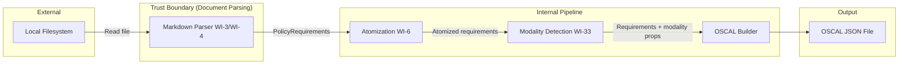
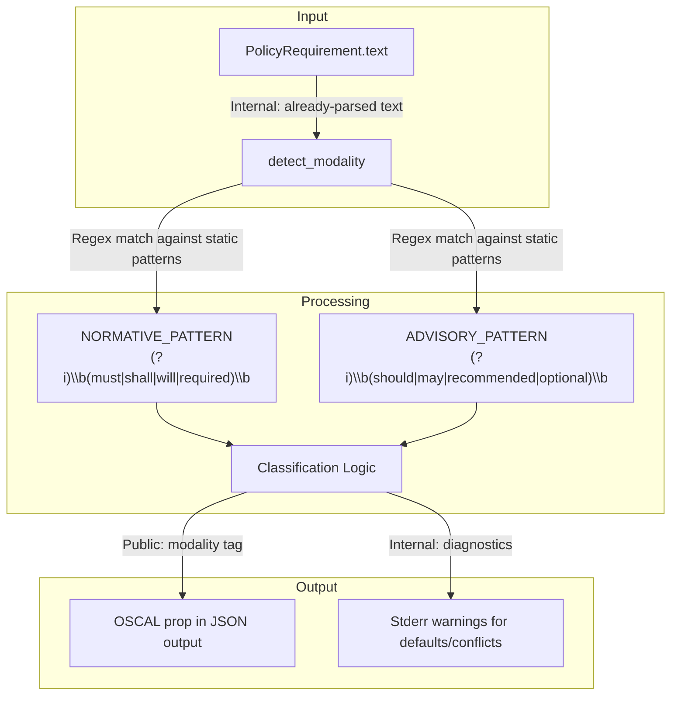
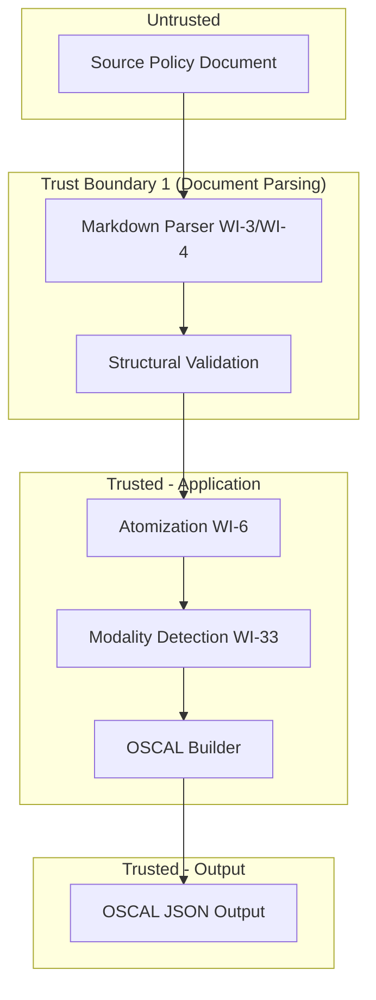

# 033-sec-normative-advisory-detection

> **Document Type:** Security Review (Lightweight)
> **Audience:** LLM agents, human reviewers
> **Status:** Draft
> **Last Updated:** 2026-02-11 <!-- @auto -->
> **Reviewer:** Brian Luby <!-- @human-required -->
> **Risk Level:** Low <!-- @human-required -->

---

## Review Tier Legend

| Marker | Tier | Speckit Behavior |
|--------|------|------------------|
| :red_circle: `@human-required` | Human Generated | Prompt human to author; blocks until complete |
| :yellow_circle: `@human-review` | LLM + Human Review | LLM drafts -> prompt human to confirm/edit; blocks until confirmed |
| :green_circle: `@llm-autonomous` | LLM Autonomous | LLM completes; no prompt; logged for audit |
| :white_circle: `@auto` | Auto-generated | System fills (timestamps, links); no prompt |

---

## Severity Definitions

| Level | Label | Definition |
|-------|-------|------------|
| :red_circle: | **Critical** | Immediate exploitation risk; data breach or system compromise likely |
| :orange_circle: | **High** | Significant risk; exploitation possible with moderate effort |
| :yellow_circle: | **Medium** | Notable risk; exploitation requires specific conditions |
| :green_circle: | **Low** | Minor risk; limited impact or unlikely exploitation |

---

## Linkage :white_circle: `@auto`

| Document | ID | Relationship |
|----------|-----|--------------|
| Parent PRD | [033-prd-normative-advisory-detection.md](../PRD/033-prd-normative-advisory-detection.md) | Feature being reviewed |
| Architecture Review | [033-ar-normative-advisory-detection.md](../AR/033-ar-normative-advisory-detection.md) | Technical implementation |

---

## Purpose

This is a **lightweight security review** intended to catch obvious security concerns early in the product lifecycle. It is NOT a comprehensive threat model. Full threat modeling should occur during implementation when infrastructure-as-code and concrete implementations exist.

**This review answers three questions:**
1. What does this feature expose to attackers?
2. What data does it touch, and how sensitive is that data?
3. What's the impact if something goes wrong?

**Scope of this review:**
- :white_check_mark: Attack surface identification
- :white_check_mark: Data classification
- :white_check_mark: High-level CIA assessment
- :x: Detailed threat enumeration (deferred to implementation)
- :x: Penetration testing (deferred to implementation)
- :x: Compliance audit (separate process)

---

## Feature Security Summary

### One-line Summary :red_circle: `@human-required`
> Regex-based keyword matching on already-parsed policy requirement text to classify normative ("must"/"shall") vs advisory ("should"/"may") language, with results emitted as OSCAL `prop` annotations. No network, no auth, no subprocess invocation.

### Risk Assessment :red_circle: `@human-required`
> **Risk Level:** Low
> **Justification:** Pure in-process text classification using static regex patterns against already-parsed `PolicyRequirement` text. No external input processing beyond the source document, no network exposure, no subprocess invocation. The only non-trivial risk is ReDoS from crafted input, which is mitigated by the simplicity of the regex patterns used (no nested quantifiers).

---

## Attack Surface Analysis

### Exposure Points :yellow_circle: `@human-review`

| Exposure Type | Details | Authentication | Authorization | Notes |
|---------------|---------|----------------|---------------|-------|
| User Input Field | Source policy document (Markdown file) read from local filesystem | -- | -- | Input is parsed upstream by WI-3/WI-4; modality detection operates on already-parsed `PolicyRequirement.text` strings |
| **None (direct)** | **Modality detection has no direct external exposure -- it is an internal pipeline enrichment pass** | -- | -- | All input has already crossed the trust boundary at document parsing |

### Attack Surface Diagram :green_circle: `@llm-autonomous`

### Exposure Checklist :green_circle: `@llm-autonomous`

- [x] **Internet-facing endpoints require authentication** -- N/A: Local CLI tool, no network endpoints
- [x] **No sensitive data in URL parameters** -- N/A: No URLs, no network
- [x] **File uploads validated** -- N/A: File reading is handled upstream by document parser (WI-3/WI-4)
- [x] **Rate limiting configured** -- N/A: Local CLI tool, no endpoints
- [x] **CORS policy is restrictive** -- N/A: No web interface
- [x] **No debug/admin endpoints exposed** -- N/A: No network endpoints
- [x] **Webhooks validate signatures** -- N/A: No webhooks

---

## Data Flow Analysis

### Data Inventory :yellow_circle: `@human-review`

| Data Element | PRD Entity | Classification | Source | Destination | Retention | Encrypted Rest | Encrypted Transit | Residency |
|--------------|------------|----------------|--------|-------------|-----------|----------------|-------------------|-----------|
| PolicyRequirement text | PolicyRequirement.text | Internal | Parsed from source document | In-memory processing | None (transient) | N/A | N/A | Local |
| Modality classification | PolicyRequirement.modality | Public | Computed by regex matching | OSCAL JSON output prop | Persistent in output file | No | N/A | Local |
| Matched verb list | ModalityResult.matched_verbs | Internal | Regex capture groups | Logging (stderr at DEBUG) | None (transient) | N/A | N/A | Local |

### Data Classification Reference :green_circle: `@llm-autonomous`

| Level | Label | Description | Examples | Handling Requirements |
|-------|-------|-------------|----------|----------------------|
| 1 | **Public** | No impact if disclosed | Modality classification ("normative"/"advisory") | No special handling |
| 2 | **Internal** | Minor impact if disclosed | Policy requirement text, matched verb details | Access controls, no public exposure |
| 3 | **Confidential** | Significant impact if disclosed | N/A for this feature | N/A |
| 4 | **Restricted** | Severe impact if disclosed | N/A for this feature | N/A |

### Data Flow Diagram :green_circle: `@llm-autonomous`

### Data Handling Checklist :green_circle: `@llm-autonomous`

- [x] **No Restricted data stored unless absolutely required** -- No Restricted data involved
- [x] **Confidential data encrypted at rest** -- N/A: No Confidential data
- [x] **All data encrypted in transit (TLS 1.2+)** -- N/A: No network transit
- [x] **PII has defined retention policy** -- N/A: No PII processed
- [x] **Logs do not contain Confidential/Restricted data** -- Logs contain only matched verb keywords (Public/Internal)
- [x] **Secrets are not hardcoded** -- N/A: No secrets
- [x] **Data minimization applied** -- Only processes requirement text; no additional data collection
- [x] **Data residency requirements documented** -- N/A: Local filesystem only

---

## Third-Party & Supply Chain :yellow_circle: `@human-review`

### New External Services

| Service | Purpose | Data Shared | Communication | Approved? |
|---------|---------|-------------|---------------|-----------|
| None | No external services introduced | -- | -- | N/A |

### New Libraries/Dependencies

| Library | Version | License | Purpose | Security Check |
|---------|---------|---------|---------|----------------|
| regex | 1.x | MIT/Apache-2.0 | Word-boundary-aware pattern matching for verb detection | Already a transitive dependency; well-audited Rust ecosystem crate |
| std::sync::LazyLock | N/A (stdlib) | N/A | One-time compilation and caching of regex patterns | Rust stdlib (stable since 1.80); no external dependency introduced |

### Supply Chain Checklist

- [x] **All new services use encrypted communication** -- N/A: No external services
- [x] **Service agreements/ToS reviewed** -- N/A
- [x] **Dependencies have acceptable licenses** -- Both MIT/Apache-2.0
- [x] **Dependencies are actively maintained** -- `regex` is a core Rust ecosystem crate with active maintenance; `std::sync::LazyLock` is stdlib (no external dependency)
- [x] **No known critical vulnerabilities** -- No known CVEs in current versions

---

## CIA Impact Assessment

### Confidentiality :yellow_circle: `@human-review`

> **What could be disclosed?**

| Asset at Risk | Classification | Exposure Scenario | Impact | Likelihood |
|---------------|----------------|-------------------|--------|------------|
| Policy requirement text | Internal | Debug logging at excessive verbosity | Low | Low |
| Modality classification | Public | Included in OSCAL output by design | None | N/A |

**Confidentiality Risk Level:** Low

### Integrity :yellow_circle: `@human-review`

> **What could be modified or corrupted?**

| Asset at Risk | Modification Scenario | Impact | Likelihood |
|---------------|----------------------|--------|------------|
| Modality classification | Crafted input text designed to produce incorrect normative/advisory classification (e.g., "must" in non-obligation context) | Low -- known limitation of heuristic matching; conservative default (normative) mitigates underclassification | Medium |
| OSCAL output props | Incorrect modality prop on controls due to misclassification | Low -- downstream consumers can override; no automated enforcement actions based on modality | Low |

**Integrity Risk Level:** Low

### Availability :yellow_circle: `@human-review`

> **What could be disrupted?**

| Service/Function | Disruption Scenario | Impact | Likelihood |
|------------------|---------------------|--------|------------|
| Modality detection pipeline | ReDoS via crafted input text causing catastrophic regex backtracking | Low -- patterns use simple alternation with word boundaries, no nested quantifiers; `regex` crate has built-in complexity limits | Low |
| CLI processing | Extremely large document with millions of requirements causing excessive processing time | Low -- linear O(n) processing; sub-microsecond per requirement | Very Low |

**Availability Risk Level:** Low

### CIA Summary :green_circle: `@llm-autonomous`

| Dimension | Risk Level | Primary Concern | Mitigation Priority |
|-----------|------------|-----------------|---------------------|
| **Confidentiality** | Low | Debug logging of requirement text | Low |
| **Integrity** | Low | Heuristic misclassification of ambiguous text | Low |
| **Availability** | Low | ReDoS from crafted input patterns | Low |

**Overall CIA Risk:** Low -- *Pure in-process text classification with static regex patterns on already-parsed input. No network, no auth, no PII, no subprocess invocation.*

---

## Trust Boundaries :yellow_circle: `@human-review`

### Trust Boundary Checklist :green_circle: `@llm-autonomous`

- [x] **All input from untrusted sources is validated** -- Source document is parsed and validated by WI-3/WI-4 before reaching modality detection
- [x] **External API responses are validated** -- N/A: No external API calls
- [x] **Authorization checked at data access, not just entry point** -- N/A: No authorization model
- [x] **Service-to-service calls are authenticated** -- N/A: No service calls

---

## Known Risks & Mitigations :yellow_circle: `@human-review`

| ID | Risk Description | Severity | Mitigation | Status | Owner |
|----|------------------|----------|------------|--------|-------|
| R1 | ReDoS via crafted input text causing catastrophic backtracking in regex patterns | Low | Regex patterns use simple alternation `(must\|shall\|will\|required)` with `\b` word boundaries -- no nested quantifiers or unbounded repetition. The `regex` crate also enforces built-in complexity limits that prevent catastrophic backtracking by design. | Mitigated | Brian Luby |
| R2 | Heuristic misclassification of "must"/"should" in non-obligation contexts (e.g., "this must be understood as guidance") | Low | Accepted limitation of heuristic verb matching. Conservative default (normative) ensures mandatory obligations are never silently downgraded. PRD C-1 allows future extension with configurable verb lists. | Accepted | Brian Luby |
| R3 | "may" matching month name "May" in date references (e.g., "review by May 2026") | Low | Word boundary `\b` anchors handle most cases. Policy requirement text is expected to contain obligation language, not date references (those typically appear in metadata, not in atomized requirement text). | Accepted | Brian Luby |

### Risk Acceptance :red_circle: `@human-required`

| Risk ID | Accepted By | Date | Justification | Review Date |
|---------|-------------|------|---------------|-------------|
| R2 | Brian Luby | 2026-02-11 | Heuristic matching is sufficient for well-structured policy documents with RFC 2119 keywords; NLP deferred per PRD W-1 | 2026-08-11 |
| R3 | Brian Luby | 2026-02-11 | Word boundaries prevent most false matches; "May" as month is rare in atomized requirement text | 2026-08-11 |

---

## Security Requirements :yellow_circle: `@human-review`

### Authentication & Authorization

| Req ID | Requirement | PRD AC | Verification Method |
|--------|-------------|--------|---------------------|
| N/A | No authentication or authorization required | -- | N/A -- local CLI tool |

### Data Protection

| Req ID | Requirement | PRD AC | Verification Method |
|--------|-------------|--------|---------------------|
| SEC-1 | Requirement text shall not be logged at INFO level or above (DEBUG only) | -- | Code review |

### Input Validation

| Req ID | Requirement | PRD AC | Verification Method |
|--------|-------------|--------|---------------------|
| SEC-2 | Regex patterns shall use word boundary anchors (`\b`) to prevent partial word matches | AC-7 | Unit tests with false-positive fixtures ("customize", "dismay", "shouldering") |
| SEC-3 | Regex patterns shall not contain nested quantifiers or unbounded repetition to prevent ReDoS | -- | Code review of static pattern definitions |

### Operational Security

| Req ID | Requirement | PRD AC | Verification Method |
|--------|-------------|--------|---------------------|
| SEC-4 | Regex patterns shall be compiled once via `std::sync::LazyLock` (not per-invocation) to prevent resource exhaustion on large documents | -- | Code review |

---

## Compliance Considerations :yellow_circle: `@human-review`

| Regulation | Applicable? | Relevant Requirements | N/A Justification |
|------------|-------------|----------------------|-------------------|
| GDPR | N/A | -- | No PII processed; local CLI tool processes policy documents, not personal data |
| CCPA | N/A | -- | No personal information collected or processed |
| SOC 2 | N/A | -- | No cloud service; local CLI tool |
| HIPAA | N/A | -- | No PHI processing |
| PCI-DSS | N/A | -- | No payment data |
| Other | N/A | -- | FORGE is a local CLI tool with no network, auth, database, or PII |

---

## Review Findings

### Issues Identified :yellow_circle: `@human-review`

| ID | Finding | Severity | Category | Recommendation | Status |
|----|---------|----------|----------|----------------|--------|
| F1 | No issues identified | -- | -- | -- | N/A |

### Positive Observations :green_circle: `@llm-autonomous`

- Regex patterns are static and compiled once -- no user-supplied patterns, eliminating ReDoS risk from user input
- The `regex` crate has built-in protection against catastrophic backtracking via its RE2-style engine
- Modality detection is a pure enrichment pass with no side effects beyond populating the `modality` field
- Conservative default (normative) ensures that unclassified requirements are never silently downgraded to advisory
- Word boundary anchors prevent the most common class of false positive matches

---

## Open Questions :yellow_circle: `@human-review`

- [x] **Q1:** No open security questions for this work item.

---

## Changelog :white_circle: `@auto`

| Version | Date | Author | Changes |
|---------|------|--------|---------|
| 0.1 | 2026-02-11 | LLM (Claude) | Initial security review |

---

## Review Sign-off :red_circle: `@human-required`

| Role | Name | Date | Decision |
|------|------|------|----------|
| Security Reviewer | Brian Luby | — | ⏳ Pending — complete before merge |
| Feature Owner | Brian Luby | — | ⏳ Pending — complete before merge |

### Conditions for Approval (if applicable) :red_circle: `@human-required`

- [ ] Verify regex patterns in implementation match the static patterns described in the AR (no nested quantifiers)
- [ ] Verify debug logging does not emit full requirement text at INFO level

---

## Security Requirements Traceability :green_circle: `@llm-autonomous`

| SEC Req ID | PRD Req ID | PRD AC ID | Test Type | Test Location |
|------------|------------|-----------|-----------|---------------|
| SEC-2 | M-6 | AC-7 | Unit | tests for word boundary false-positive prevention |
| SEC-3 | -- | -- | Code Review | Static pattern definitions in modality module |
| SEC-4 | -- | -- | Code Review | `std::sync::LazyLock` usage in modality module |

---

## Review Checklist :green_circle: `@llm-autonomous`

Before marking as Approved:
- [x] Attack surface documented with auth/authz status for each exposure
- [x] Exposure Points table has no contradictory rows (None vs. actual endpoints)
- [x] All PRD Data Model entities appear in Data Inventory
- [x] All data elements are classified using the 4-tier model
- [x] Third-party dependencies and services are listed
- [x] CIA impact is assessed with Low/Medium/High ratings
- [x] Trust boundaries are identified
- [x] Security requirements have verification methods specified
- [x] Security requirements trace to PRD ACs where applicable
- [x] No Critical/High findings remain Open
- [x] Compliance N/A items have justification
- [x] Risk acceptance has named approver and review date
