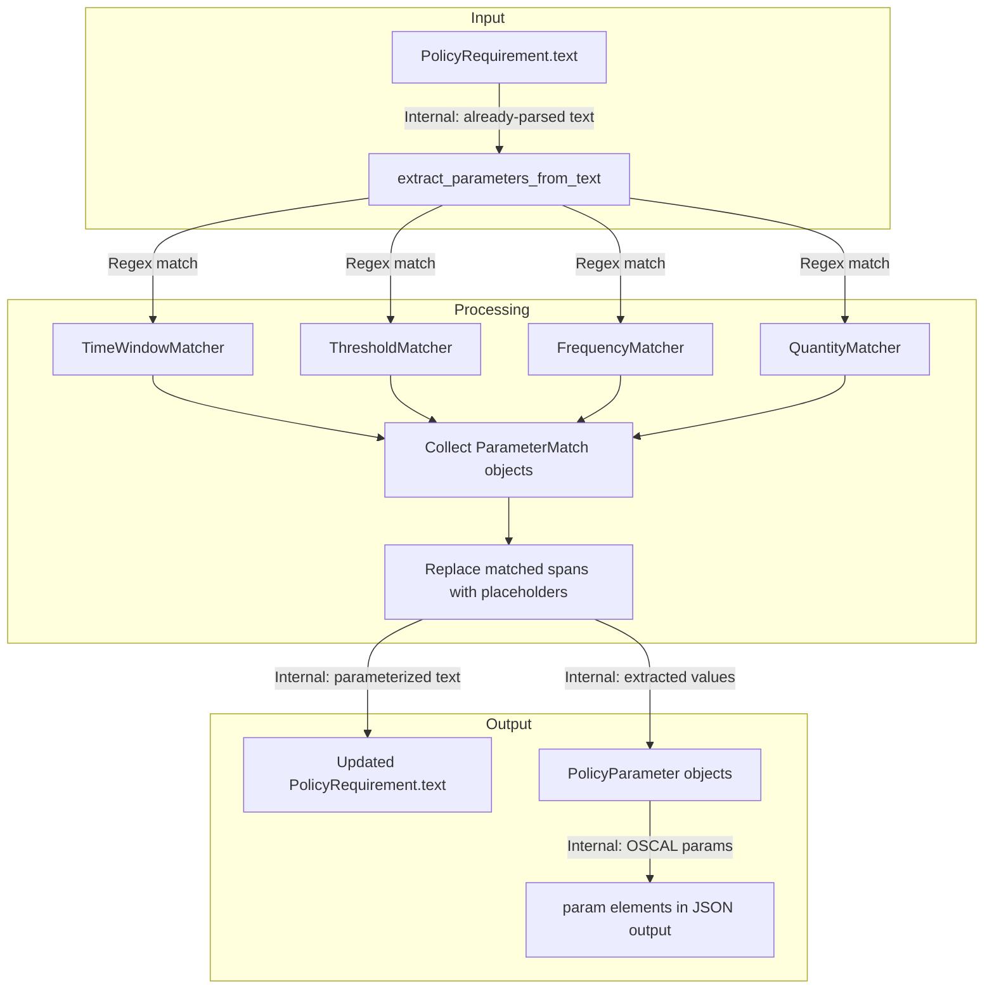
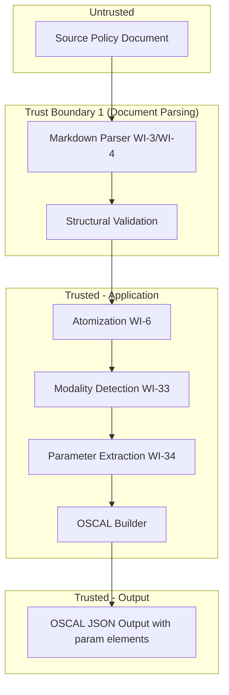

# 034-sec-parameter-extraction

> **Document Type:** Security Review (Lightweight)
> **Audience:** LLM agents, human reviewers
> **Status:** Draft
> **Last Updated:** 2026-02-11 <!-- @auto -->
> **Reviewer:** Brian Luby <!-- @human-required -->
> **Risk Level:** Low <!-- @human-required -->

---

## Review Tier Legend

| Marker | Tier | Speckit Behavior |
|--------|------|------------------|
| :red_circle: `@human-required` | Human Generated | Prompt human to author; blocks until complete |
| :yellow_circle: `@human-review` | LLM + Human Review | LLM drafts -> prompt human to confirm/edit; blocks until confirmed |
| :green_circle: `@llm-autonomous` | LLM Autonomous | LLM completes; no prompt; logged for audit |
| :white_circle: `@auto` | Auto-generated | System fills (timestamps, links); no prompt |

---

## Severity Definitions

| Level | Label | Definition |
|-------|-------|------------|
| :red_circle: | **Critical** | Immediate exploitation risk; data breach or system compromise likely |
| :orange_circle: | **High** | Significant risk; exploitation possible with moderate effort |
| :yellow_circle: | **Medium** | Notable risk; exploitation requires specific conditions |
| :green_circle: | **Low** | Minor risk; limited impact or unlikely exploitation |

---

## Linkage :white_circle: `@auto`

| Document | ID | Relationship |
|----------|-----|--------------|
| Parent PRD | [034-prd-parameter-extraction.md](../PRD/034-prd-parameter-extraction.md) | Feature being reviewed |
| Architecture Review | [034-ar-parameter-extraction.md](../AR/034-ar-parameter-extraction.md) | Technical implementation |

---

## Purpose

This is a **lightweight security review** intended to catch obvious security concerns early in the product lifecycle. It is NOT a comprehensive threat model. Full threat modeling should occur during implementation when infrastructure-as-code and concrete implementations exist.

**This review answers three questions:**
1. What does this feature expose to attackers?
2. What data does it touch, and how sensitive is that data?
3. What's the impact if something goes wrong?

**Scope of this review:**
- :white_check_mark: Attack surface identification
- :white_check_mark: Data classification
- :white_check_mark: High-level CIA assessment
- :x: Detailed threat enumeration (deferred to implementation)
- :x: Penetration testing (deferred to implementation)
- :x: Compliance audit (separate process)

---

## Feature Security Summary

### One-line Summary :red_circle: `@human-required`
> Regex-based extraction of parameterizable values (time windows, thresholds, frequencies, quantities) from already-parsed policy requirement text, with results emitted as OSCAL `param` elements and insertion placeholders. No network, no auth, no subprocess invocation.

### Risk Assessment :red_circle: `@human-required`
> **Risk Level:** Low
> **Justification:** Pure in-process text processing using multiple regex patterns with named capture groups against already-parsed `PolicyRequirement` text. The patterns are more complex than WI-33 (modality detection) due to named captures and quantifier phrases, but all patterns are static (not user-supplied), and the `regex` crate's RE2-style engine prevents catastrophic backtracking. No network exposure, no subprocess invocation, no PII.

---

## Attack Surface Analysis

### Exposure Points :yellow_circle: `@human-review`

| Exposure Type | Details | Authentication | Authorization | Notes |
|---------------|---------|----------------|---------------|-------|
| User Input Field | Source policy document (Markdown file) read from local filesystem | -- | -- | Input is parsed upstream by WI-3/WI-4; parameter extraction operates on already-parsed `PolicyRequirement.text` strings |
| **None (direct)** | **Parameter extraction has no direct external exposure -- it is an internal pipeline enrichment pass** | -- | -- | All input has already crossed the trust boundary at document parsing |

### Attack Surface Diagram :green_circle: `@llm-autonomous`

```mermaid
flowchart LR
    subgraph External
        FS[Local Filesystem]
    end

    subgraph "Trust Boundary (Document Parsing)"
        Parser[Markdown Parser WI-3/WI-4]
    end

    subgraph "Internal Pipeline"
        Atomizer[Atomization WI-6]
        Modality[Modality Detection WI-33]
        ParamExtract[Parameter Extraction WI-34]
        Builder[OSCAL Builder]
    end

    subgraph Output
        JSON[OSCAL JSON File]
    end

    FS -->|"Read file"| Parser
    Parser -->|"PolicyRequirements"| Atomizer
    Atomizer --> Modality
    Modality -->|"Requirements + modality"| ParamExtract
    ParamExtract -->|"Requirements + params + placeholders"| Builder
    Builder --> JSON
```

### Exposure Checklist :green_circle: `@llm-autonomous`

- [x] **Internet-facing endpoints require authentication** -- N/A: Local CLI tool, no network endpoints
- [x] **No sensitive data in URL parameters** -- N/A: No URLs, no network
- [x] **File uploads validated** -- N/A: File reading is handled upstream by document parser
- [x] **Rate limiting configured** -- N/A: Local CLI tool
- [x] **CORS policy is restrictive** -- N/A: No web interface
- [x] **No debug/admin endpoints exposed** -- N/A: No network endpoints
- [x] **Webhooks validate signatures** -- N/A: No webhooks

---

## Data Flow Analysis

### Data Inventory :yellow_circle: `@human-review`

| Data Element | PRD Entity | Classification | Source | Destination | Retention | Encrypted Rest | Encrypted Transit | Residency |
|--------------|------------|----------------|--------|-------------|-----------|----------------|-------------------|-----------|
| PolicyRequirement text | PolicyRequirement.text | Internal | Parsed from source document | Modified in-place with insertion placeholders | None (transient) | N/A | N/A | Local |
| Extracted parameter values | PolicyParameter.value | Internal | Regex extraction from requirement text | OSCAL JSON `param` elements | Persistent in output file | No | N/A | Local |
| Parameter constraint info | PolicyParameter.constraint | Internal | Inferred from qualifier words | OSCAL JSON `param.constraint` elements | Persistent in output file | No | N/A | Local |
| Parameterized prose | PolicyRequirement.text (modified) | Internal | Text with values replaced by OSCAL insertion placeholders | OSCAL JSON control statement text | Persistent in output file | No | N/A | Local |

### Data Classification Reference :green_circle: `@llm-autonomous`

| Level | Label | Description | Examples | Handling Requirements |
|-------|-------|-------------|----------|----------------------|
| 1 | **Public** | No impact if disclosed | Parameter types, constraint types | No special handling |
| 2 | **Internal** | Minor impact if disclosed | Extracted parameter values (e.g., "128-bit", "30 days"), policy requirement text | Access controls, no public exposure |
| 3 | **Confidential** | Significant impact if disclosed | N/A for this feature | N/A |
| 4 | **Restricted** | Severe impact if disclosed | N/A for this feature | N/A |

### Data Flow Diagram :green_circle: `@llm-autonomous`

### Data Handling Checklist :green_circle: `@llm-autonomous`

- [x] **No Restricted data stored unless absolutely required** -- No Restricted data involved
- [x] **Confidential data encrypted at rest** -- N/A: No Confidential data
- [x] **All data encrypted in transit (TLS 1.2+)** -- N/A: No network transit
- [x] **PII has defined retention policy** -- N/A: No PII processed
- [x] **Logs do not contain Confidential/Restricted data** -- Extracted parameter values (key lengths, timeouts) logged at DEBUG only; these are Internal-classified policy details, not secrets
- [x] **Secrets are not hardcoded** -- N/A: No secrets
- [x] **Data minimization applied** -- Only processes requirement text; extracts only recognized parameter patterns
- [x] **Data residency requirements documented** -- N/A: Local filesystem only

---

## Third-Party & Supply Chain :yellow_circle: `@human-review`

### New External Services

| Service | Purpose | Data Shared | Communication | Approved? |
|---------|---------|-------------|---------------|-----------|
| None | No external services introduced | -- | -- | N/A |

### New Libraries/Dependencies

| Library | Version | License | Purpose | Security Check |
|---------|---------|---------|---------|----------------|
| regex | 1.x | MIT/Apache-2.0 | Named capture group pattern matching for parameter detection | Already a transitive dependency; well-audited Rust ecosystem crate |
| once_cell | 1.x | MIT/Apache-2.0 | One-time compilation and caching of multiple regex patterns | Already a transitive dependency; widely used in Rust ecosystem |

### Supply Chain Checklist

- [x] **All new services use encrypted communication** -- N/A: No external services
- [x] **Service agreements/ToS reviewed** -- N/A
- [x] **Dependencies have acceptable licenses** -- Both MIT/Apache-2.0
- [x] **Dependencies are actively maintained** -- `regex` and `once_cell` are core Rust ecosystem crates
- [x] **No known critical vulnerabilities** -- No known CVEs in current versions

---

## CIA Impact Assessment

### Confidentiality :yellow_circle: `@human-review`

> **What could be disclosed?**

| Asset at Risk | Classification | Exposure Scenario | Impact | Likelihood |
|---------------|----------------|-------------------|--------|------------|
| Extracted parameter values (key lengths, timeout durations, frequencies) | Internal | Debug logging reveals security posture details (e.g., "minimum 128-bit encryption", "30-day password rotation") | Low -- operational details, not credentials | Low |
| Policy requirement text | Internal | Verbose logging includes full requirement text | Low | Low |

**Confidentiality Risk Level:** Low

### Integrity :yellow_circle: `@human-review`

> **What could be modified or corrupted?**

| Asset at Risk | Modification Scenario | Impact | Likelihood |
|---------------|----------------------|--------|------------|
| Extracted parameter values | Crafted input text with unusual phrasing causes incorrect extraction or missed extraction | Low -- incorrect parameters in OSCAL output; downstream tools may use wrong thresholds | Medium |
| Parameterized prose | Insertion placeholder incorrectly replaces text, corrupting requirement readability | Low -- cosmetic issue; source document is not modified | Low |
| False positive extraction | Section references ("Section 3.2") or standard numbers ("NIST SP 800-53") incorrectly extracted as parameters | Low -- produces spurious OSCAL `param` elements; mitigated by contextual qualifier word requirement | Low |

**Integrity Risk Level:** Low

### Availability :yellow_circle: `@human-review`

> **What could be disrupted?**

| Service/Function | Disruption Scenario | Impact | Likelihood |
|------------------|---------------------|--------|------------|
| Parameter extraction pipeline | ReDoS via crafted input text causing catastrophic regex backtracking | Low -- patterns use named captures with bounded quantifiers; `regex` crate enforces complexity limits; no nested repetition | Low |
| CLI processing | Very long requirement text strings causing excessive regex matching time | Low -- `regex` crate has linear-time guarantees; bounded by input size | Very Low |

**Availability Risk Level:** Low

### CIA Summary :green_circle: `@llm-autonomous`

| Dimension | Risk Level | Primary Concern | Mitigation Priority |
|-----------|------------|-----------------|---------------------|
| **Confidentiality** | Low | Debug logging of security posture values (key lengths, timeouts) | Low |
| **Integrity** | Low | False positive/negative parameter extraction from unusual phrasings | Low |
| **Availability** | Low | ReDoS from complex regex patterns on crafted input | Low |

**Overall CIA Risk:** Low -- *Pure in-process text extraction with static regex patterns on already-parsed input. Multiple patterns are more complex than WI-33 but all use bounded captures and the `regex` crate's linear-time engine.*

---

## Trust Boundaries :yellow_circle: `@human-review`

### Trust Boundary Checklist :green_circle: `@llm-autonomous`

- [x] **All input from untrusted sources is validated** -- Source document is parsed and validated by WI-3/WI-4 before reaching parameter extraction
- [x] **External API responses are validated** -- N/A: No external API calls
- [x] **Authorization checked at data access, not just entry point** -- N/A: No authorization model
- [x] **Service-to-service calls are authenticated** -- N/A: No service calls

---

## Known Risks & Mitigations :yellow_circle: `@human-review`

| ID | Risk Description | Severity | Mitigation | Status | Owner |
|----|------------------|----------|------------|--------|-------|
| R1 | ReDoS via crafted input text -- parameter patterns are more complex than modality patterns (named captures, qualifier phrases, numeric groups) | Low | All patterns use the `regex` crate which guarantees linear-time matching via its RE2-style engine. No nested quantifiers or unbounded repetition in any pattern. Patterns are static, not user-supplied. | Mitigated | Brian Luby |
| R2 | False positive extraction of section references or standard numbers (e.g., "NIST SP 800-53") as parameters | Low | AR-034 requires contextual qualifier words ("within", "at least", "minimum") to trigger extraction. Bare numbers without qualifiers are never extracted. Negative test fixtures required per PRD EC-2. | Mitigated | Brian Luby |
| R3 | Extracted parameter values reveal security posture details (e.g., encryption key lengths, password rotation windows) in OSCAL output | Low | These values are already present in the source policy document and in the OSCAL output prose. Parameter extraction makes them more structured but does not increase their exposure. Output files should be treated with same sensitivity as source policy. | Accepted | Brian Luby |
| R4 | Overlapping regex matches from multiple matchers could produce corrupted text if spans are replaced incorrectly | Low | AR-034 specifies position-based sorting with first-match-wins resolution and reverse-order replacement to preserve byte offsets. Unit tests required for overlap scenarios. | Mitigated | Brian Luby |

### Risk Acceptance :red_circle: `@human-required`

| Risk ID | Accepted By | Date | Justification | Review Date |
|---------|-------------|------|---------------|-------------|
| R3 | Brian Luby | 2026-02-11 | Parameter values are already in the source document and OSCAL prose; structured extraction does not increase exposure | 2026-08-11 |

---

## Security Requirements :yellow_circle: `@human-review`

### Authentication & Authorization

| Req ID | Requirement | PRD AC | Verification Method |
|--------|-------------|--------|---------------------|
| N/A | No authentication or authorization required | -- | N/A -- local CLI tool |

### Data Protection

| Req ID | Requirement | PRD AC | Verification Method |
|--------|-------------|--------|---------------------|
| SEC-1 | Extracted parameter values (key lengths, timeout durations) shall not be logged at INFO level or above | -- | Code review |

### Input Validation

| Req ID | Requirement | PRD AC | Verification Method |
|--------|-------------|--------|---------------------|
| SEC-2 | Parameter extraction patterns shall require contextual qualifier words to prevent false positive extraction of bare numbers | AC-2, AC-9 | Unit tests with negative fixtures (section refs, standard numbers) |
| SEC-3 | Regex patterns shall not contain nested quantifiers or unbounded repetition to prevent ReDoS | -- | Code review of static pattern definitions |
| SEC-4 | Regex patterns shall be compiled once via `once_cell::sync::Lazy` to prevent resource exhaustion | -- | Code review |
| SEC-5 | Overlapping match resolution shall use position-based sorting and reverse-order replacement to prevent text corruption | -- | Unit tests with multi-parameter and overlapping fixtures |

### Operational Security

| Req ID | Requirement | PRD AC | Verification Method |
|--------|-------------|--------|---------------------|
| SEC-6 | Parameter extraction shall be idempotent -- OSCAL insertion placeholders shall not be re-matched as parameters on subsequent runs | AC-8, S-4 | Unit test: extract twice, assert identical results |

---

## Compliance Considerations :yellow_circle: `@human-review`

| Regulation | Applicable? | Relevant Requirements | N/A Justification |
|------------|-------------|----------------------|-------------------|
| GDPR | N/A | -- | No PII processed; local CLI tool processes policy documents, not personal data |
| CCPA | N/A | -- | No personal information collected or processed |
| SOC 2 | N/A | -- | No cloud service; local CLI tool |
| HIPAA | N/A | -- | No PHI processing |
| PCI-DSS | N/A | -- | No payment data |
| Other | N/A | -- | FORGE is a local CLI tool with no network, auth, database, or PII |

---

## Review Findings

### Issues Identified :yellow_circle: `@human-review`

| ID | Finding | Severity | Category | Recommendation | Status |
|----|---------|----------|----------|----------------|--------|
| F1 | No issues identified | -- | -- | -- | N/A |

### Positive Observations :green_circle: `@llm-autonomous`

- All regex patterns are static and compiled once -- no user-supplied patterns, eliminating ReDoS risk from user input
- The `regex` crate's RE2-style engine provides linear-time guarantees regardless of input
- Contextual qualifier word requirement prevents the most common class of false positive extractions
- Parameter extraction is a pure enrichment pass with no side effects beyond populating fields on the domain model
- AR-034 specifies idempotence as a requirement, preventing double-extraction bugs
- Reverse-order span replacement correctly handles multiple parameters in a single requirement

---

## Open Questions :yellow_circle: `@human-review`

- [x] **Q1:** No open security questions for this work item.

---

## Changelog :white_circle: `@auto`

| Version | Date | Author | Changes |
|---------|------|--------|---------|
| 0.1 | 2026-02-11 | LLM (Claude) | Initial security review |

---

## Review Sign-off :red_circle: `@human-required`

| Role | Name | Date | Decision |
|------|------|------|----------|
| Security Reviewer | Brian Luby | YYYY-MM-DD | [Approved / Approved with conditions / Rejected] |
| Feature Owner | Brian Luby | YYYY-MM-DD | [Acknowledged] |

### Conditions for Approval (if applicable) :red_circle: `@human-required`

- [ ] Verify regex patterns in implementation use bounded captures (no nested quantifiers)
- [ ] Verify negative test fixtures exist for section references and standard numbers (PRD EC-2)
- [ ] Verify idempotence test exists (extract twice, same result)

---

## Security Requirements Traceability :green_circle: `@llm-autonomous`

| SEC Req ID | PRD Req ID | PRD AC ID | Test Type | Test Location |
|------------|------------|-----------|-----------|---------------|
| SEC-2 | M-1, M-2 | AC-2, AC-9 | Unit | Negative fixture tests for false positive prevention |
| SEC-3 | -- | -- | Code Review | Static pattern definitions in parameter module |
| SEC-4 | -- | -- | Code Review | `once_cell::sync::Lazy` usage in parameter module |
| SEC-5 | M-7 | -- | Unit | Multi-parameter and overlap test fixtures |
| SEC-6 | S-4 | AC-8 | Unit | Idempotence test: double extraction |

---

## Review Checklist :green_circle: `@llm-autonomous`

Before marking as Approved:
- [x] Attack surface documented with auth/authz status for each exposure
- [x] Exposure Points table has no contradictory rows (None vs. actual endpoints)
- [x] All PRD Data Model entities appear in Data Inventory
- [x] All data elements are classified using the 4-tier model
- [x] Third-party dependencies and services are listed
- [x] CIA impact is assessed with Low/Medium/High ratings
- [x] Trust boundaries are identified
- [x] Security requirements have verification methods specified
- [x] Security requirements trace to PRD ACs where applicable
- [x] No Critical/High findings remain Open
- [x] Compliance N/A items have justification
- [x] Risk acceptance has named approver and review date
