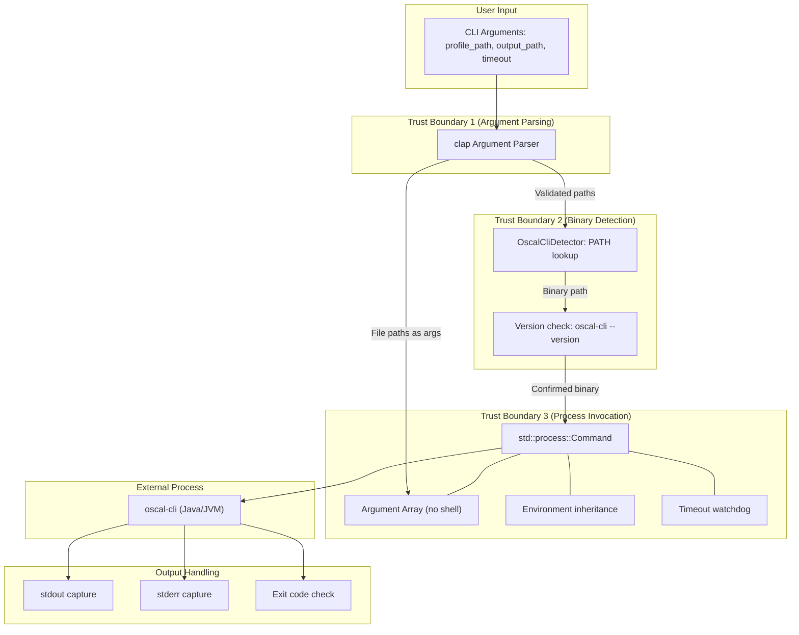
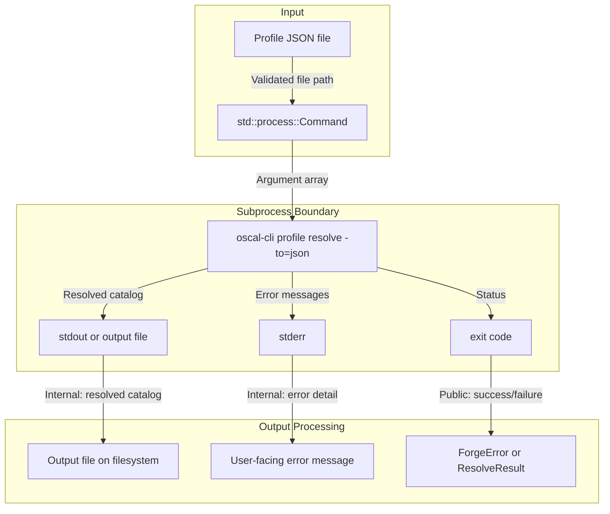
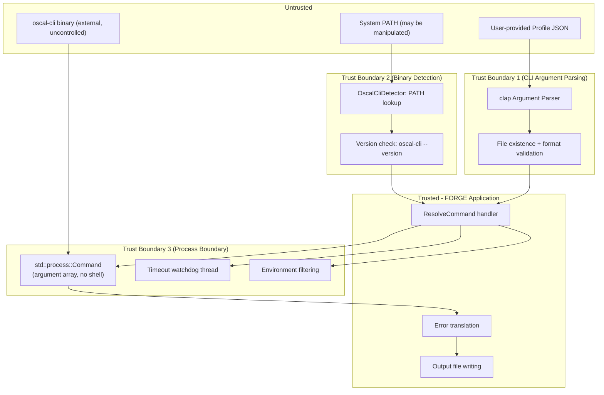

# 036-sec-oscal-cli-profile-resolution

> **Document Type:** Security Review (Lightweight)
> **Audience:** LLM agents, human reviewers
> **Status:** Draft
> **Last Updated:** 2026-02-11 <!-- @auto -->
> **Reviewer:** Brian Luby <!-- @human-required -->
> **Risk Level:** Medium-High <!-- @human-required -->

---

## Review Tier Legend

| Marker | Tier | Speckit Behavior |
|--------|------|------------------|
| :red_circle: `@human-required` | Human Generated | Prompt human to author; blocks until complete |
| :yellow_circle: `@human-review` | LLM + Human Review | LLM drafts -> prompt human to confirm/edit; blocks until confirmed |
| :green_circle: `@llm-autonomous` | LLM Autonomous | LLM completes; no prompt; logged for audit |
| :white_circle: `@auto` | Auto-generated | System fills (timestamps, links); no prompt |

---

## Severity Definitions

| Level | Label | Definition |
|-------|-------|------------|
| :red_circle: | **Critical** | Immediate exploitation risk; data breach or system compromise likely |
| :orange_circle: | **High** | Significant risk; exploitation possible with moderate effort |
| :yellow_circle: | **Medium** | Notable risk; exploitation requires specific conditions |
| :green_circle: | **Low** | Minor risk; limited impact or unlikely exploitation |

---

## Linkage :white_circle: `@auto`

| Document | ID | Relationship |
|----------|-----|--------------|
| Parent PRD | [036-prd-oscal-cli-profile-resolution.md](../PRD/036-prd-oscal-cli-profile-resolution.md) | Feature being reviewed |
| Architecture Review | [036-ar-oscal-cli-profile-resolution.md](../AR/036-ar-oscal-cli-profile-resolution.md) | Technical implementation |

---

## Purpose

This is a **lightweight security review** intended to catch obvious security concerns early in the product lifecycle. It is NOT a comprehensive threat model. Full threat modeling should occur during implementation when infrastructure-as-code and concrete implementations exist.

**This review answers three questions:**
1. What does this feature expose to attackers?
2. What data does it touch, and how sensitive is that data?
3. What's the impact if something goes wrong?

**Scope of this review:**
- :white_check_mark: Attack surface identification
- :white_check_mark: Data classification
- :white_check_mark: High-level CIA assessment
- :white_check_mark: Subprocess security analysis (command injection, environment, TOCTOU)
- :x: Detailed threat enumeration (deferred to implementation)
- :x: Penetration testing (deferred to implementation)
- :x: Compliance audit (separate process)

---

## Feature Security Summary

### One-line Summary :red_circle: `@human-required`
> Subprocess invocation of external NIST `oscal-cli` binary via `std::process::Command` to delegate OSCAL Profile Resolution, introducing command injection risk via file path arguments, TOCTOU risk on the external binary, environment variable injection, and hanging subprocess (availability) concerns.

### Risk Assessment :red_circle: `@human-required`
> **Risk Level:** Medium-High
> **Justification:** This is the first work item in FORGE that invokes an external process. Subprocess invocation is an inherently higher-risk operation than in-process computation. While FORGE is a local CLI tool (no network, no auth), the introduction of `std::process::Command` creates new attack vectors: command injection via crafted file paths if arguments are not properly sanitized, PATH manipulation to substitute a malicious binary for oscal-cli, TOCTOU (time-of-check-time-of-use) between binary detection and invocation, environment variable leakage to the child process, and subprocess hangs causing availability impact. The risk is elevated to Medium-High because the architectural pattern established here will be reused by WI-37 and potentially future work items.

---

## Attack Surface Analysis

### Exposure Points :yellow_circle: `@human-review`

| Exposure Type | Details | Authentication | Authorization | Notes |
|---------------|---------|----------------|---------------|-------|
| CLI Argument | `forge resolve <profile_path>` -- file path argument passed to `std::process::Command` | -- | -- | File path becomes an argument to the external oscal-cli process; must not be interpolated into a shell string |
| CLI Argument | `--output <output_path>` -- output file path argument | -- | -- | Output path passed as an argument to oscal-cli; same sanitization requirements as profile_path |
| CLI Argument | `--timeout <duration>` -- timeout value for subprocess | -- | -- | Parsed as Duration; bounded by reasonable defaults |
| Subprocess Invocation | `std::process::Command::new("oscal-cli")` -- external binary execution | -- | -- | **Primary attack surface.** External binary looked up on PATH; process inherits environment |
| PATH Environment | System PATH used to locate oscal-cli binary | -- | -- | PATH manipulation could substitute a malicious binary |
| Child Process Environment | Environment variables inherited by oscal-cli subprocess | -- | -- | Sensitive environment variables could leak to the child process |

### Attack Surface Diagram :green_circle: `@llm-autonomous`

### Exposure Checklist :green_circle: `@llm-autonomous`

- [x] **Internet-facing endpoints require authentication** -- N/A: Local CLI tool, no network endpoints
- [x] **No sensitive data in URL parameters** -- N/A: No URLs, no network
- [x] **File uploads validated** -- Input file is validated to exist and be JSON before invocation (PRD M-7)
- [x] **Rate limiting configured** -- N/A: Local CLI tool
- [x] **CORS policy is restrictive** -- N/A: No web interface
- [x] **No debug/admin endpoints exposed** -- N/A: No network endpoints
- [x] **Webhooks validate signatures** -- N/A: No webhooks

---

## Data Flow Analysis

### Data Inventory :yellow_circle: `@human-review`

| Data Element | PRD Entity | Classification | Source | Destination | Retention | Encrypted Rest | Encrypted Transit | Residency |
|--------------|------------|----------------|--------|-------------|-----------|----------------|-------------------|-----------|
| Profile JSON input | OSCAL Profile | Internal | Local filesystem | Passed as file path to oscal-cli subprocess | Persistent (user's file) | No | N/A | Local |
| Resolved Catalog JSON output | OSCAL Catalog | Internal | oscal-cli subprocess stdout/file | Written to output file on local filesystem | Persistent (user's file) | No | N/A | Local |
| oscal-cli stderr | Error/diagnostic messages | Internal | oscal-cli subprocess stderr | Logged and/or displayed to user | None (transient) | N/A | N/A | Local |
| oscal-cli exit code | Process status | Public | oscal-cli subprocess | Used for error determination | None (transient) | N/A | N/A | Local |
| System PATH | Environment variable | Internal | Operating system | Used for binary lookup | None (transient) | N/A | N/A | Local |
| oscal-cli binary path | File system path | Internal | PATH detection | Used for process invocation | None (transient) | N/A | N/A | Local |

### Data Classification Reference :green_circle: `@llm-autonomous`

| Level | Label | Description | Examples | Handling Requirements |
|-------|-------|-------------|----------|----------------------|
| 1 | **Public** | No impact if disclosed | oscal-cli exit codes, version string | No special handling |
| 2 | **Internal** | Minor impact if disclosed | Profile JSON content, resolved Catalog content, file paths, error messages | Access controls, no public exposure |
| 3 | **Confidential** | Significant impact if disclosed | N/A for this feature | N/A |
| 4 | **Restricted** | Severe impact if disclosed | N/A for this feature | N/A |

### Data Flow Diagram :green_circle: `@llm-autonomous`

### Data Handling Checklist :green_circle: `@llm-autonomous`

- [x] **No Restricted data stored unless absolutely required** -- No Restricted data involved
- [x] **Confidential data encrypted at rest** -- N/A: No Confidential data
- [x] **All data encrypted in transit (TLS 1.2+)** -- N/A: No network transit; subprocess uses local IPC
- [x] **PII has defined retention policy** -- N/A: No PII processed
- [x] **Logs do not contain Confidential/Restricted data** -- Logs contain file paths and oscal-cli stderr (Internal classification)
- [x] **Secrets are not hardcoded** -- N/A: No secrets
- [x] **Data minimization applied** -- Only the Profile file path and necessary arguments are passed to oscal-cli
- [x] **Data residency requirements documented** -- N/A: Local filesystem only

---

## Third-Party & Supply Chain :yellow_circle: `@human-review`

### New External Services

| Service | Purpose | Data Shared | Communication | Approved? |
|---------|---------|-------------|---------------|-----------|
| NIST oscal-cli | External binary invoked as subprocess for Profile Resolution | Profile JSON file path (argument), resolved Catalog (output) | Local subprocess (stdin/stdout/stderr) | Pending -- external binary not bundled; user must install separately |

### New Libraries/Dependencies

| Library | Version | License | Purpose | Security Check |
|---------|---------|---------|---------|----------------|
| which (optional) | 6.x | MIT | Cross-platform PATH detection for oscal-cli binary | Well-audited; used by cargo and other Rust ecosystem tools |

### Supply Chain Checklist

- [x] **All new services use encrypted communication** -- N/A: Local subprocess, not a network service
- [ ] **Service agreements/ToS reviewed** -- oscal-cli is an open-source NIST tool (public domain); no service agreement required, but version compatibility must be documented
- [x] **Dependencies have acceptable licenses** -- `which` is MIT
- [x] **Dependencies are actively maintained** -- `which` is actively maintained
- [x] **No known critical vulnerabilities** -- No known CVEs in `which` crate

**External Binary Risk Note:** oscal-cli is a Java-based tool maintained by NIST. FORGE does not control its releases, bugs, or security posture. FORGE trusts oscal-cli's output as authoritative for Profile Resolution. If oscal-cli is compromised, its output would be trusted by FORGE and passed to the user.

---

## CIA Impact Assessment

### Confidentiality :yellow_circle: `@human-review`

> **What could be disclosed?**

| Asset at Risk | Classification | Exposure Scenario | Impact | Likelihood |
|---------------|----------------|-------------------|--------|------------|
| Profile JSON content | Internal | Passed as file path to external process; external process reads the file directly | Low -- local process on same machine, no network | Very Low |
| Environment variables | Internal | Child process inherits parent's full environment by default, which may include API keys, tokens, or credentials set in the shell | Medium -- if sensitive env vars exist, they are accessible to oscal-cli | Low |
| File system paths | Internal | Error messages or logs may reveal directory structure | Low -- local tool; attacker already has local access | Very Low |

**Confidentiality Risk Level:** Low -- *Environment variable inheritance is the primary concern, mitigated by explicit environment clearing (see SEC-4).*

### Integrity :yellow_circle: `@human-review`

> **What could be modified or corrupted?**

| Asset at Risk | Modification Scenario | Impact | Likelihood |
|---------------|----------------------|--------|------------|
| Resolved Catalog output | **PATH manipulation:** Attacker places a malicious binary named "oscal-cli" earlier in PATH, which produces corrupted or malicious output that FORGE trusts | Medium -- user would receive incorrect compliance data; could undermine compliance decisions | Low (requires local access + PATH modification) |
| Resolved Catalog output | **TOCTOU attack:** Between detection (checking oscal-cli exists) and invocation (running it), the binary is swapped for a malicious one | Low -- race window is very small; requires local access | Very Low |
| Resolved Catalog output | **Argument injection via crafted file path:** File path containing shell metacharacters is interpreted by a shell | Low -- mitigated by using argument arrays (no shell invocation) | Very Low (mitigated by design) |
| Output file | oscal-cli writes to output path; if output path is a symlink, it could overwrite an unintended file | Low -- requires local access to create symlink | Very Low |

**Integrity Risk Level:** Medium -- *PATH manipulation is the highest-impact integrity risk for local CLI tools that invoke external binaries.*

### Availability :yellow_circle: `@human-review`

> **What could be disrupted?**

| Service/Function | Disruption Scenario | Impact | Likelihood |
|------------------|---------------------|--------|------------|
| `forge resolve` command | **Subprocess hang:** oscal-cli hangs indefinitely on malformed input, consuming system resources | Medium -- blocks user workflow; process must be manually killed if no timeout | Medium |
| `forge resolve` command | **Resource exhaustion:** oscal-cli (JVM-based) consumes excessive memory or CPU | Low -- external to FORGE; user's system responsibility | Low |
| `forge resolve` command | **oscal-cli not installed:** Feature entirely unavailable | Low -- expected case; graceful degradation required | Medium |

**Availability Risk Level:** Medium -- *Subprocess hang is the primary availability concern, mitigated by mandatory timeout (see SEC-5).*

### CIA Summary :green_circle: `@llm-autonomous`

| Dimension | Risk Level | Primary Concern | Mitigation Priority |
|-----------|------------|-----------------|---------------------|
| **Confidentiality** | Low | Environment variable inheritance to child process | Medium |
| **Integrity** | Medium | PATH manipulation substituting malicious binary | Medium |
| **Availability** | Medium | Subprocess hang on malformed input | High |

**Overall CIA Risk:** Medium-High -- *Subprocess invocation introduces a fundamentally different risk profile from pure in-process computation. The combination of external binary trust, environment inheritance, and subprocess lifecycle management creates a larger attack surface than previous work items.*

---

## Trust Boundaries :yellow_circle: `@human-review`

### Trust Boundary Checklist :green_circle: `@llm-autonomous`

- [x] **All input from untrusted sources is validated** -- File paths validated for existence and JSON format before invocation
- [x] **External API responses are validated** -- oscal-cli exit code and stderr are checked; non-zero exit codes are translated to ForgeError
- [x] **Authorization checked at data access, not just entry point** -- N/A: No authorization model
- [x] **Service-to-service calls are authenticated** -- N/A: No service calls; subprocess is a local process

---

## Known Risks & Mitigations :yellow_circle: `@human-review`

| ID | Risk Description | Severity | Mitigation | Status | Owner |
|----|------------------|----------|------------|--------|-------|
| R1 | **Command injection via shell string interpolation:** If file paths are passed through `sh -c` or similar shell invocation, metacharacters in file paths could execute arbitrary commands | Medium | **MUST** use `Command::new("oscal-cli").args(["profile", "resolve"]).arg(path)` argument arrays. **MUST NOT** use `Command::new("sh").arg("-c").arg(format!(...))`. This is enforced by AR-036 implementation guardrails and must be verified via code review. | Mitigated (by design) | Brian Luby |
| R2 | **PATH manipulation:** Attacker places a malicious binary named "oscal-cli" earlier in PATH, which executes instead of the legitimate oscal-cli | Medium | Log the full resolved path of the detected binary at INFO level so users can verify. Consider allowing `--oscal-cli-path` override for explicit binary specification. Version check (`--version`) provides a weak but non-zero signal of binary legitimacy. | Partially Mitigated | Brian Luby |
| R3 | **TOCTOU between detection and invocation:** Binary is swapped between the `detect()` call and the `resolve_profile()` call | Low | Use the absolute path returned by detection for invocation (not a second PATH lookup). The race window is extremely small. Full mitigation would require binary hash verification, which is over-engineering for a local CLI tool. | Accepted | Brian Luby |
| R4 | **Environment variable injection:** Child process inherits sensitive environment variables (API keys, tokens, credentials) from parent shell | Low | Implemented `Command::env_clear()` with explicit allowlist of PATH, HOME, JAVA_HOME, TMPDIR (+ USERPROFILE, SYSTEMROOT, TEMP, TMP on Windows) per FR-013 and task T030. | Mitigated | Brian Luby |
| R5 | **Subprocess hang:** oscal-cli hangs indefinitely on malformed input, blocking the user and consuming system resources | Medium | **MUST** implement configurable timeout via `--timeout` flag with a default of 60 seconds. Timeout implementation uses a thread-based watchdog that kills the child process if the timeout expires. | Mitigated (by design) | Brian Luby |
| R6 | **Symlink attack on output path:** Output path is a symlink to a sensitive file; oscal-cli overwrites the symlink target | Low | Validate output path is not a symlink before invocation. For a local CLI tool where the user controls the invocation, this is a low-priority concern (user is attacking themselves). | Accepted | Brian Luby |
| R7 | **oscal-cli stderr leaks sensitive information:** Error messages from oscal-cli may contain file contents, internal paths, or Java stack traces | Low | oscal-cli stderr is displayed to the user (who already has local access) and logged at WARN level. No network exposure of stderr content. | Accepted | Brian Luby |

### Risk Acceptance :red_circle: `@human-required`

| Risk ID | Accepted By | Date | Justification | Review Date |
|---------|-------------|------|---------------|-------------|
| R3 | Brian Luby | 2026-02-11 | TOCTOU race window is extremely small; full mitigation (binary hash verification) is over-engineering for a local CLI tool | 2026-08-11 |
| R6 | Brian Luby | 2026-02-11 | Local CLI tool -- user controls invocation and file system; symlink attacks are self-inflicted | 2026-08-11 |
| R7 | Brian Luby | 2026-02-11 | stderr is displayed to the user who already has local access; no network exposure | 2026-08-11 |

---

## Security Requirements :yellow_circle: `@human-review`

### Authentication & Authorization

| Req ID | Requirement | PRD AC | Verification Method |
|--------|-------------|--------|---------------------|
| N/A | No authentication or authorization required | -- | N/A -- local CLI tool |

### Data Protection

| Req ID | Requirement | PRD AC | Verification Method |
|--------|-------------|--------|---------------------|
| SEC-1 | Profile file content shall not be logged (only the file path) | -- | Code review |

### Input Validation

| Req ID | Requirement | PRD AC | Verification Method |
|--------|-------------|--------|---------------------|
| SEC-2 | Input file shall be validated to exist and have a .json extension before invoking oscal-cli | M-7 | Unit test |
| SEC-3 | Input file path shall be canonicalized via `std::fs::canonicalize` to resolve symlinks and relative paths before passing to oscal-cli | -- | Unit test |

### Subprocess Security

| Req ID | Requirement | PRD AC | Verification Method |
|--------|-------------|--------|---------------------|
| SEC-4 | **CRITICAL:** All process arguments shall be passed via `Command::arg()` argument arrays. Shell string interpolation (`sh -c`, `cmd /c`) shall NEVER be used. | -- | Code review -- **MUST** verify no `Command::new("sh")` or `format!` in argument construction |
| SEC-5 | Subprocess execution shall have a configurable timeout (default 60 seconds) enforced by a watchdog mechanism that kills the child process on timeout | S-3 | Unit test with mock invoker; integration test with real timeout |
| SEC-6 | The detected absolute path of oscal-cli shall be logged at INFO level so users can verify the correct binary is being invoked | -- | Code review |
| SEC-7 | The child process environment should be filtered to minimize environment variable leakage. At minimum, consider using `Command::env_clear()` with explicit re-addition of PATH, HOME, JAVA_HOME, and TMPDIR. | -- | Code review |
| SEC-8 | oscal-cli detection shall use the absolute path returned by PATH lookup for invocation, not a second lookup, to minimize TOCTOU window | -- | Code review |

### Operational Security

| Req ID | Requirement | PRD AC | Verification Method |
|--------|-------------|--------|---------------------|
| SEC-9 | Graceful degradation when oscal-cli is not found: informative error message with installation guidance, exit code 4 (distinct from existing exit codes 1-3) | M-4 | Integration test |
| SEC-10 | Non-zero exit codes from oscal-cli shall be translated to descriptive ForgeError messages including the oscal-cli stderr content | M-5 | Unit test with mock invoker |

---

## Compliance Considerations :yellow_circle: `@human-review`

| Regulation | Applicable? | Relevant Requirements | N/A Justification |
|------------|-------------|----------------------|-------------------|
| GDPR | N/A | -- | No PII processed; local CLI tool |
| CCPA | N/A | -- | No personal information collected or processed |
| SOC 2 | N/A | -- | No cloud service; local CLI tool |
| HIPAA | N/A | -- | No PHI processing |
| PCI-DSS | N/A | -- | No payment data |
| Other | N/A | -- | FORGE is a local CLI tool with no network, auth, database, or PII |

---

## Review Findings

### Issues Identified :yellow_circle: `@human-review`

| ID | Finding | Severity | Category | Recommendation | Status |
|----|---------|----------|----------|----------------|--------|
| F1 | Subprocess invocation via `std::process::Command` must use argument arrays, never shell string interpolation | Medium | Command Injection | Enforce via code review and unit tests that verify `Command::new` is never called with `"sh"` or `"cmd"` as the program. AR-036 guardrails prohibit this pattern. | Open -- verify during implementation |
| F2 | Environment variable leakage to child process | Low | Confidentiality | Implemented `Command::env_clear()` with explicit allowlist (PATH, HOME, JAVA_HOME, TMPDIR; + USERPROFILE, SYSTEMROOT, TEMP, TMP on Windows) per FR-013/T030 | Mitigated |
| F3 | Subprocess timeout must be enforced to prevent hangs | Medium | Availability | AR-036 specifies thread-based watchdog with configurable `--timeout` flag and 60-second default. Verify timeout kills child process (not just stops waiting). | Open -- verify during implementation |

### Positive Observations :green_circle: `@llm-autonomous`

- AR-036 explicitly prohibits shell string interpolation in implementation guardrails -- command injection is mitigated by architectural decision
- Trait-based abstraction enables full unit testing without requiring oscal-cli binary -- security-relevant code paths are testable
- Detection-before-invocation pattern provides clear graceful degradation and prevents invocation of non-existent binaries
- Argument array API of `std::process::Command` eliminates command injection by construction (when used correctly)
- Timeout requirement is architecturally mandated, not optional -- availability protection is built in

---

## Open Questions :yellow_circle: `@human-review`

- [x] **Q1:** ~~Should FORGE use `Command::env_clear()` to filter environment variables passed to the child process?~~ **Resolved:** Implemented `env_clear()` with explicit allowlist (PATH, HOME, JAVA_HOME, TMPDIR; + USERPROFILE, SYSTEMROOT, TEMP, TMP on Windows) per FR-013 and spec clarification.
- [ ] **Q2:** Should FORGE verify the oscal-cli binary's integrity (e.g., check a known hash or signature) before invocation? This would fully mitigate PATH manipulation attacks but adds significant complexity. Recommendation: Defer to a future work item; log the binary path for now.

---

## Changelog :white_circle: `@auto`

| Version | Date | Author | Changes |
|---------|------|--------|---------|
| 0.1 | 2026-02-11 | LLM (Claude) | Initial security review |

---

## Review Sign-off :red_circle: `@human-required`

| Role | Name | Date | Decision |
|------|------|------|----------|
| Security Reviewer | Brian Luby | YYYY-MM-DD | [Approved / Approved with conditions / Rejected] |
| Feature Owner | Brian Luby | YYYY-MM-DD | [Acknowledged] |

### Conditions for Approval (if applicable) :red_circle: `@human-required`

- [ ] **CRITICAL:** Verify implementation uses `Command::arg()` arrays exclusively -- no `sh -c`, no `cmd /c`, no `format!` in argument construction
- [ ] Verify subprocess timeout is enforced with child process kill on expiry
- [ ] Verify detected binary absolute path is logged at INFO level
- [ ] Verify input file validation occurs before subprocess invocation
- [x] ~~Decide on environment variable filtering approach (Q1)~~ Resolved: `env_clear()` + explicit allowlist implemented per FR-013
- [ ] Verify trait-based mock coverage includes timeout, failure, and success paths

---

## Security Requirements Traceability :green_circle: `@llm-autonomous`

| SEC Req ID | PRD Req ID | PRD AC ID | Test Type | Test Location |
|------------|------------|-----------|-----------|---------------|
| SEC-2 | M-7 | -- | Unit | Input file validation tests |
| SEC-3 | M-7 | -- | Unit | Path canonicalization tests |
| SEC-4 | -- | -- | Code Review | **CRITICAL** -- process invocation code |
| SEC-5 | S-3 | -- | Unit + Integration | Timeout enforcement tests |
| SEC-6 | -- | -- | Code Review | Binary path logging |
| SEC-7 | -- | -- | Code Review | Environment filtering |
| SEC-8 | -- | -- | Code Review | Absolute path usage |
| SEC-9 | M-4 | -- | Integration | Graceful degradation test |
| SEC-10 | M-5 | -- | Unit | Error translation tests |

---

## Review Checklist :green_circle: `@llm-autonomous`

Before marking as Approved:
- [x] Attack surface documented with auth/authz status for each exposure
- [x] Exposure Points table covers all subprocess-specific attack vectors
- [x] All PRD Data Model entities appear in Data Inventory
- [x] All data elements are classified using the 4-tier model
- [x] Third-party dependencies and services are listed (including external binary)
- [x] CIA impact is assessed with Low/Medium/High ratings
- [x] Trust boundaries are identified (including subprocess boundary)
- [x] Security requirements have verification methods specified
- [x] Security requirements trace to PRD ACs where applicable
- [x] No Critical findings remain Open (F1 is Medium, pending implementation verification)
- [x] Compliance N/A items have justification
- [x] Risk acceptance has named approver and review date
- [x] Command injection mitigation is documented and has verification method
- [x] Subprocess timeout is documented and has verification method
- [x] Environment variable handling is documented
