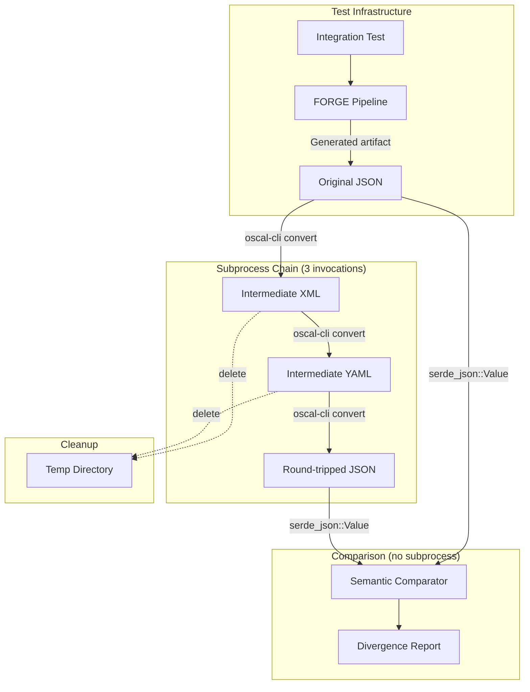
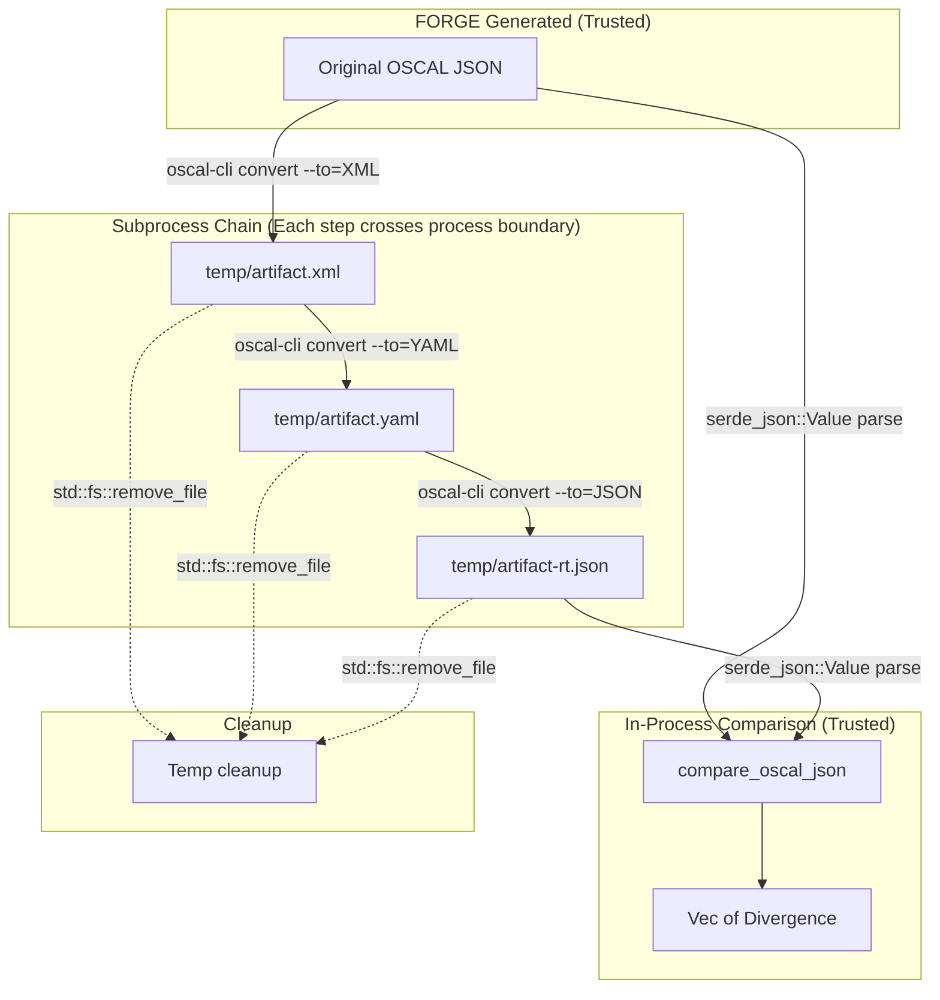
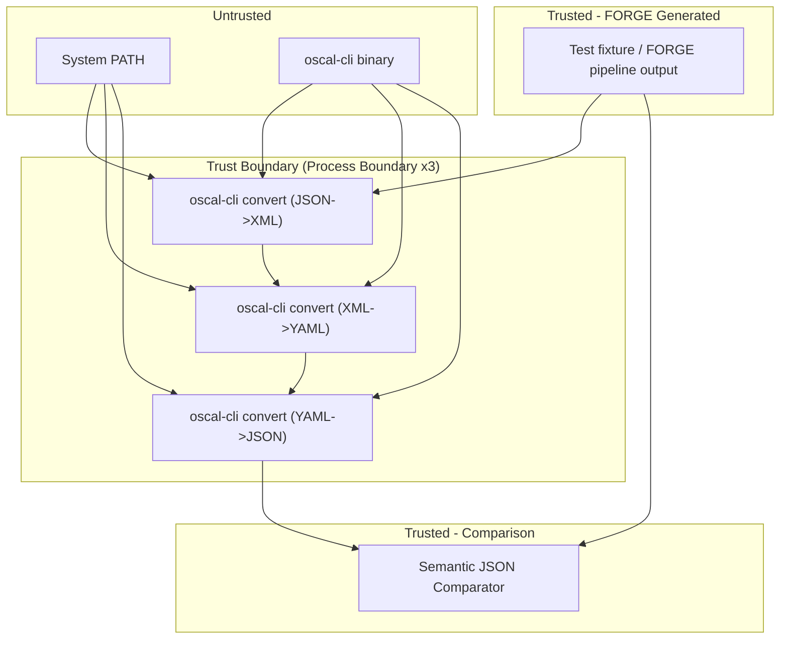

# 037-sec-oscal-cli-round-trip

> **Document Type:** Security Review (Lightweight)
> **Audience:** LLM agents, human reviewers
> **Status:** Draft
> **Last Updated:** 2026-02-11 <!-- @auto -->
> **Reviewer:** Brian Luby <!-- @human-required -->
> **Risk Level:** Medium <!-- @human-required -->

---

## Review Tier Legend

| Marker | Tier | Speckit Behavior |
|--------|------|------------------|
| :red_circle: `@human-required` | Human Generated | Prompt human to author; blocks until complete |
| :yellow_circle: `@human-review` | LLM + Human Review | LLM drafts -> prompt human to confirm/edit; blocks until confirmed |
| :green_circle: `@llm-autonomous` | LLM Autonomous | LLM completes; no prompt; logged for audit |
| :white_circle: `@auto` | Auto-generated | System fills (timestamps, links); no prompt |

---

## Severity Definitions

| Level | Label | Definition |
|-------|-------|------------|
| :red_circle: | **Critical** | Immediate exploitation risk; data breach or system compromise likely |
| :orange_circle: | **High** | Significant risk; exploitation possible with moderate effort |
| :yellow_circle: | **Medium** | Notable risk; exploitation requires specific conditions |
| :green_circle: | **Low** | Minor risk; limited impact or unlikely exploitation |

---

## Linkage :white_circle: `@auto`

| Document | ID | Relationship |
|----------|-----|--------------|
| Parent PRD | [037-prd-oscal-cli-round-trip.md](../PRD/037-prd-oscal-cli-round-trip.md) | Feature being reviewed |
| Architecture Review | [037-ar-oscal-cli-round-trip.md](../AR/037-ar-oscal-cli-round-trip.md) | Technical implementation |
| Related SEC | [036-sec-oscal-cli-profile-resolution.md](036-sec-oscal-cli-profile-resolution.md) | Subprocess security baseline -- WI-37 inherits all subprocess mitigations from WI-36 |

---

## Purpose

This is a **lightweight security review** intended to catch obvious security concerns early in the product lifecycle. It is NOT a comprehensive threat model. Full threat modeling should occur during implementation when infrastructure-as-code and concrete implementations exist.

**This review answers three questions:**
1. What does this feature expose to attackers?
2. What data does it touch, and how sensitive is that data?
3. What's the impact if something goes wrong?

**Scope of this review:**
- :white_check_mark: Attack surface identification
- :white_check_mark: Data classification
- :white_check_mark: High-level CIA assessment
- :white_check_mark: Subprocess security delta from SEC-036
- :x: Detailed threat enumeration (deferred to implementation)
- :x: Penetration testing (deferred to implementation)
- :x: Compliance audit (separate process)

---

## Feature Security Summary

### One-line Summary :red_circle: `@human-required`
> Reuses oscal-cli subprocess infrastructure from WI-36 to chain format conversions (JSON -> XML -> YAML -> JSON) for round-trip validation testing, with the same command injection, PATH manipulation, and hanging subprocess risks as WI-36 but in a testing context that reduces overall impact.

### Risk Assessment :red_circle: `@human-required`
> **Risk Level:** Medium
> **Justification:** WI-37 reuses the oscal-cli subprocess invocation infrastructure established in WI-36 (SEC-036), inheriting the same fundamental risks: command injection via process arguments, PATH manipulation, TOCTOU, environment variable leakage, and subprocess hangs. The risk is reduced from Medium-High (WI-36) to Medium because: (1) round-trip testing runs in a testing context (CI/development), not in production user workflows; (2) input is generated by FORGE itself (not arbitrary user input); (3) intermediate files (XML, YAML) are created in a temporary directory and cleaned up. However, the conversion chain invokes oscal-cli three separate times (JSON->XML, XML->YAML, YAML->JSON), tripling the subprocess attack surface per test run.

---

## Attack Surface Analysis

### Exposure Points :yellow_circle: `@human-review`

| Exposure Type | Details | Authentication | Authorization | Notes |
|---------------|---------|----------------|---------------|-------|
| Subprocess Invocation (x3) | `oscal-cli convert` invoked three times per round-trip test (JSON->XML, XML->YAML, YAML->JSON) | -- | -- | Reuses `OscalCliInvoker` from WI-36; same argument array pattern; 3x subprocess invocations per test |
| Temporary Files | Intermediate XML and YAML files written to temp directory during conversion chain | -- | -- | Files contain policy content from FORGE output; must be cleaned up after test |
| Test Fixtures | FORGE-generated OSCAL artifacts used as round-trip inputs | -- | -- | Generated by FORGE pipeline; not arbitrary user input |
| PATH Environment | Same as WI-36 -- oscal-cli looked up on system PATH | -- | -- | Inherited from WI-36 subprocess infrastructure |

### Attack Surface Diagram :green_circle: `@llm-autonomous`

### Exposure Checklist :green_circle: `@llm-autonomous`

- [x] **Internet-facing endpoints require authentication** -- N/A: Local CLI tool, test-only infrastructure
- [x] **No sensitive data in URL parameters** -- N/A: No URLs, no network
- [x] **File uploads validated** -- Input files are generated by FORGE itself, not user-supplied
- [x] **Rate limiting configured** -- N/A: Test infrastructure
- [x] **CORS policy is restrictive** -- N/A: No web interface
- [x] **No debug/admin endpoints exposed** -- N/A: No network endpoints
- [x] **Webhooks validate signatures** -- N/A: No webhooks

---

## Data Flow Analysis

### Data Inventory :yellow_circle: `@human-review`

| Data Element | PRD Entity | Classification | Source | Destination | Retention | Encrypted Rest | Encrypted Transit | Residency |
|--------------|------------|----------------|--------|-------------|-----------|----------------|-------------------|-----------|
| Original OSCAL JSON | Catalog/CompDef | Internal | Generated by FORGE pipeline | Input to oscal-cli conversion chain | Temporary (test scope) | No | N/A | Local |
| Intermediate XML | Converted artifact | Internal | oscal-cli convert output | Input to next conversion step | Temporary (cleaned up) | No | N/A | Local temp dir |
| Intermediate YAML | Converted artifact | Internal | oscal-cli convert output | Input to next conversion step | Temporary (cleaned up) | No | N/A | Local temp dir |
| Round-tripped JSON | Converted artifact | Internal | oscal-cli convert output | Input to semantic comparator | Temporary (test scope) | No | N/A | Local temp dir |
| Divergence report | Test results | Public | Semantic comparator | Test output / CI logs | Test-scoped | No | N/A | Local |

### Data Flow Diagram :green_circle: `@llm-autonomous`

### Data Handling Checklist :green_circle: `@llm-autonomous`

- [x] **No Restricted data stored unless absolutely required** -- No Restricted data involved
- [x] **Confidential data encrypted at rest** -- N/A: No Confidential data
- [x] **All data encrypted in transit (TLS 1.2+)** -- N/A: No network transit
- [x] **PII has defined retention policy** -- N/A: No PII processed
- [x] **Logs do not contain Confidential/Restricted data** -- Divergence reports contain element IDs and values (Internal); no secrets
- [x] **Secrets are not hardcoded** -- N/A: No secrets
- [x] **Data minimization applied** -- Only FORGE-generated test artifacts processed
- [x] **Data residency requirements documented** -- N/A: Local filesystem only

---

## Third-Party & Supply Chain :yellow_circle: `@human-review`

### New External Services

| Service | Purpose | Data Shared | Communication | Approved? |
|---------|---------|-------------|---------------|-----------|
| NIST oscal-cli (reused from WI-36) | External binary invoked 3x per round-trip for format conversions | OSCAL artifact file paths | Local subprocess | See SEC-036 |

### New Libraries/Dependencies

| Library | Version | License | Purpose | Security Check |
|---------|---------|---------|---------|----------------|
| None new | -- | -- | Reuses WI-36 infrastructure and serde_json (already present) | -- |

### Supply Chain Checklist

- [x] **All new services use encrypted communication** -- N/A: Local subprocess
- [x] **Service agreements/ToS reviewed** -- See SEC-036
- [x] **Dependencies have acceptable licenses** -- No new dependencies
- [x] **Dependencies are actively maintained** -- See SEC-036
- [x] **No known critical vulnerabilities** -- See SEC-036

---

## CIA Impact Assessment

### Confidentiality :yellow_circle: `@human-review`

> **What could be disclosed?**

| Asset at Risk | Classification | Exposure Scenario | Impact | Likelihood |
|---------------|----------------|-------------------|--------|------------|
| Intermediate conversion files (XML, YAML) | Internal | Temporary files left behind in temp directory if cleanup fails, potentially accessible to other users on shared systems | Low -- test environment; files contain FORGE-generated test artifacts, not production policies | Low |
| Environment variables | Internal | Same as WI-36 -- child process inherits environment (3 times per test) | Low -- test context | Low |

**Confidentiality Risk Level:** Low

### Integrity :yellow_circle: `@human-review`

> **What could be modified or corrupted?**

| Asset at Risk | Modification Scenario | Impact | Likelihood |
|---------------|----------------------|--------|------------|
| Round-trip comparison results | PATH manipulation causes a malicious oscal-cli to produce crafted output that passes comparison, masking real divergences | Low -- testing context; false "pass" would not affect production output | Low |
| Intermediate files | TOCTOU on temp files -- intermediate XML/YAML swapped between conversion steps | Very Low -- files are in a test-owned temp directory with short lifetimes | Very Low |

**Integrity Risk Level:** Low -- *Testing context significantly reduces integrity impact.*

### Availability :yellow_circle: `@human-review`

> **What could be disrupted?**

| Service/Function | Disruption Scenario | Impact | Likelihood |
|------------------|---------------------|--------|------------|
| Round-trip test execution | **Chained subprocess hang:** One of three oscal-cli invocations hangs, blocking the test suite | Medium -- CI pipeline stalls; developer workflow blocked | Medium |
| CI pipeline | **Resource exhaustion:** Three JVM instances launched in rapid succession (if conversions are parallelized) consume excessive memory | Low -- sequential invocation per AR-037 mitigates this | Low |
| Disk space | **Temp file accumulation:** If cleanup fails repeatedly (e.g., permissions issue), intermediate files accumulate | Low -- temporary directory; OS cleans up eventually | Very Low |

**Availability Risk Level:** Medium -- *Three sequential subprocess invocations increase the chance of at least one hang. Timeout from WI-36 infrastructure applies to each invocation individually.*

### CIA Summary :green_circle: `@llm-autonomous`

| Dimension | Risk Level | Primary Concern | Mitigation Priority |
|-----------|------------|-----------------|---------------------|
| **Confidentiality** | Low | Intermediate temp files left behind on cleanup failure | Low |
| **Integrity** | Low | PATH manipulation producing false comparison results (testing context) | Low |
| **Availability** | Medium | Chained subprocess hangs blocking CI/developer workflow | Medium |

**Overall CIA Risk:** Medium -- *Subprocess risks inherited from WI-36 apply 3x per test run. Testing context reduces integrity/confidentiality impact but availability risk (chained hangs) is the primary concern.*

---

## Trust Boundaries :yellow_circle: `@human-review`

### Trust Boundary Checklist :green_circle: `@llm-autonomous`

- [x] **All input from untrusted sources is validated** -- Input is generated by FORGE itself; oscal-cli output is parsed via serde_json (validated JSON)
- [x] **External API responses are validated** -- oscal-cli exit codes are checked at each conversion step
- [x] **Authorization checked at data access, not just entry point** -- N/A: No authorization model
- [x] **Service-to-service calls are authenticated** -- N/A: Local subprocess

---

## Known Risks & Mitigations :yellow_circle: `@human-review`

| ID | Risk Description | Severity | Mitigation | Status | Owner |
|----|------------------|----------|------------|--------|-------|
| R1 | **All subprocess risks from SEC-036 apply:** command injection, PATH manipulation, TOCTOU, environment leakage, subprocess hang | Medium | All mitigations from SEC-036 are inherited -- argument arrays, timeout, absolute path usage, environment filtering. No additional subprocess code is introduced; WI-37 reuses the `OscalCliInvoker` interface. | Inherited (SEC-036) | Brian Luby |
| R2 | **Chained hang risk:** Three sequential subprocess invocations increase probability of at least one hang per test run | Medium | Each invocation has its own timeout (inherited from WI-36 ProcessInvoker). Total test timeout = 3x per-invocation timeout. Consider a test-level timeout in addition to per-invocation timeout. | Partially Mitigated | Brian Luby |
| R3 | **Temp file cleanup failure:** Intermediate XML/YAML files persist in temp directory if test panics or cleanup code is not reached | Low | Use Rust's `Drop` trait or `tempfile` crate for RAII-based temp directory cleanup. Even on panic, destructors run (unless `abort`). | Mitigated (by design) | Brian Luby |
| R4 | **Temp directory permissions:** On shared systems (CI runners), temp files may be readable by other processes/users | Low | Use `tempfile::tempdir()` which creates directories with restricted permissions (0o700 on Unix). Do not use a fixed temp directory path. | Mitigated (by design) | Brian Luby |

### Risk Acceptance :red_circle: `@human-required`

| Risk ID | Accepted By | Date | Justification | Review Date |
|---------|-------------|------|---------------|-------------|
| R1 | Brian Luby | 2026-02-11 | All subprocess risks accepted per SEC-036; testing context reduces impact | 2026-08-11 |

---

## Security Requirements :yellow_circle: `@human-review`

### Authentication & Authorization

| Req ID | Requirement | PRD AC | Verification Method |
|--------|-------------|--------|---------------------|
| N/A | No authentication or authorization required | -- | N/A -- test infrastructure |

### Subprocess Security (Inherited from SEC-036)

| Req ID | Requirement | PRD AC | Verification Method |
|--------|-------------|--------|---------------------|
| SEC-1 | All SEC-036 subprocess security requirements (SEC-4 through SEC-8) apply to each oscal-cli invocation in the conversion chain | -- | Inherited -- WI-37 reuses OscalCliInvoker which enforces these requirements |

### Temporary File Security

| Req ID | Requirement | PRD AC | Verification Method |
|--------|-------------|--------|---------------------|
| SEC-2 | Intermediate conversion files shall be created in a uniquely-named temporary directory, not a fixed path | -- | Code review |
| SEC-3 | Temporary directory shall be cleaned up after each test run, including on test failure (RAII pattern or explicit cleanup in test teardown) | -- | Code review; verify Drop/RAII usage |
| SEC-4 | Temporary directory shall use restricted permissions (0o700 on Unix) to prevent access by other users on shared systems | -- | Code review; verify `tempfile::tempdir()` or equivalent |

### Test Execution Security

| Req ID | Requirement | PRD AC | Verification Method |
|--------|-------------|--------|---------------------|
| SEC-5 | Round-trip tests shall skip gracefully (not fail) when oscal-cli is unavailable, to prevent CI failures in environments without oscal-cli | S-2 | Integration test |
| SEC-6 | Per-invocation timeout from WI-36 shall apply to each of the three conversion steps independently | -- | Code review |

---

## Compliance Considerations :yellow_circle: `@human-review`

| Regulation | Applicable? | Relevant Requirements | N/A Justification |
|------------|-------------|----------------------|-------------------|
| GDPR | N/A | -- | No PII processed; test infrastructure |
| CCPA | N/A | -- | No personal information |
| SOC 2 | N/A | -- | No cloud service |
| HIPAA | N/A | -- | No PHI processing |
| PCI-DSS | N/A | -- | No payment data |
| Other | N/A | -- | Test infrastructure for a local CLI tool |

---

## Review Findings

### Issues Identified :yellow_circle: `@human-review`

| ID | Finding | Severity | Category | Recommendation | Status |
|----|---------|----------|----------|----------------|--------|
| F1 | Temporary files must use RAII cleanup pattern to prevent persistence on test failure | Low | Data Protection | Use `tempfile::tempdir()` or equivalent RAII pattern; verify cleanup occurs even on test panic | Open -- verify during implementation |

### Positive Observations :green_circle: `@llm-autonomous`

- Full reuse of WI-36 subprocess infrastructure means no new subprocess security code to review -- all mitigations are inherited
- Input is generated by FORGE itself, significantly reducing the risk of crafted/malicious input compared to arbitrary user files
- Testing context limits the impact of integrity and confidentiality risks
- Semantic comparison (serde_json::Value) is a pure in-process operation with no security concerns
- Conditional test execution prevents CI disruption when oscal-cli is unavailable

---

## Open Questions :yellow_circle: `@human-review`

- [x] **Q1:** No open security questions for this work item. All subprocess security decisions are inherited from SEC-036.

---

## Changelog :white_circle: `@auto`

| Version | Date | Author | Changes |
|---------|------|--------|---------|
| 0.1 | 2026-02-11 | LLM (Claude) | Initial security review |

---

## Review Sign-off :red_circle: `@human-required`

| Role | Name | Date | Decision |
|------|------|------|----------|
| Security Reviewer | Brian Luby | YYYY-MM-DD | [Approved / Approved with conditions / Rejected] |
| Feature Owner | Brian Luby | YYYY-MM-DD | [Acknowledged] |

### Conditions for Approval (if applicable) :red_circle: `@human-required`

- [ ] Verify SEC-036 subprocess security requirements are enforced (argument arrays, timeout, absolute paths)
- [ ] Verify temporary directory uses RAII cleanup pattern (Drop trait or `tempfile` crate)
- [ ] Verify temporary directory uses restricted permissions
- [ ] Verify per-invocation timeout applies to each conversion step independently

---

## Security Requirements Traceability :green_circle: `@llm-autonomous`

| SEC Req ID | PRD Req ID | PRD AC ID | Test Type | Test Location |
|------------|------------|-----------|-----------|---------------|
| SEC-1 | -- | -- | Inherited | See SEC-036 traceability |
| SEC-2 | -- | -- | Code Review | Temp directory creation in chain.rs |
| SEC-3 | -- | -- | Code Review | Temp directory cleanup (Drop/RAII) |
| SEC-4 | -- | -- | Code Review | Temp directory permissions |
| SEC-5 | S-2 | -- | Integration | Conditional skip test |
| SEC-6 | -- | -- | Code Review | Per-invocation timeout in chain.rs |

---

## Review Checklist :green_circle: `@llm-autonomous`

Before marking as Approved:
- [x] Attack surface documented with auth/authz status for each exposure
- [x] Subprocess risks documented as inherited from SEC-036
- [x] All PRD Data Model entities appear in Data Inventory
- [x] All data elements are classified using the 4-tier model
- [x] Third-party dependencies and services are listed
- [x] CIA impact is assessed with Low/Medium/High ratings
- [x] Trust boundaries are identified (including 3x subprocess boundary)
- [x] Security requirements have verification methods specified
- [x] Security requirements trace to PRD ACs where applicable
- [x] No Critical/High findings remain Open
- [x] Compliance N/A items have justification
- [x] Risk acceptance has named approver and review date
- [x] Temporary file security requirements are documented
- [x] Chained subprocess timeout strategy is documented
