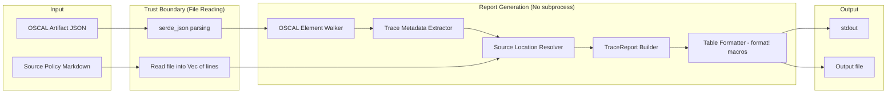
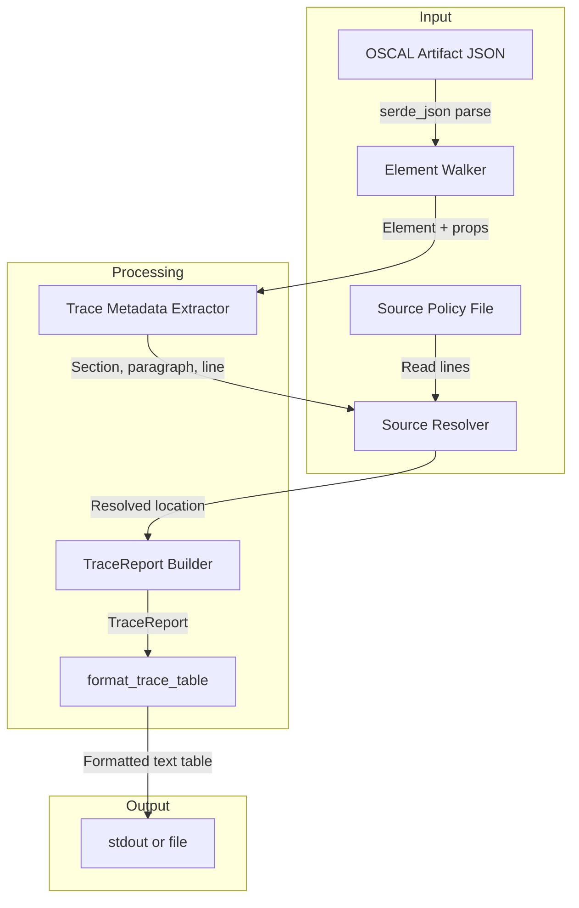
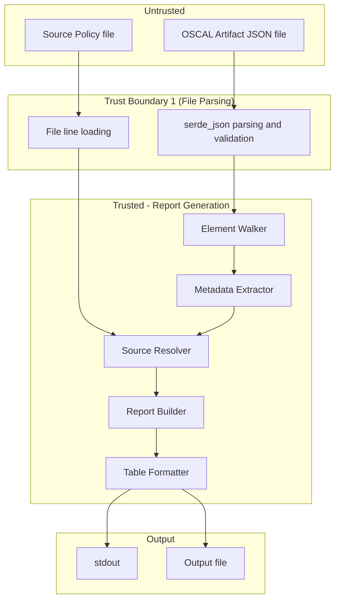

# 038-sec-traceability-report

> **Document Type:** Security Review (Lightweight)
> **Audience:** LLM agents, human reviewers
> **Status:** Draft
> **Last Updated:** 2026-02-11 <!-- @auto -->
> **Reviewer:** Brian Luby <!-- @human-required -->
> **Risk Level:** Low <!-- @human-required -->

---

## Review Tier Legend

| Marker | Tier | Speckit Behavior |
|--------|------|------------------|
| :red_circle: `@human-required` | Human Generated | Prompt human to author; blocks until complete |
| :yellow_circle: `@human-review` | LLM + Human Review | LLM drafts -> prompt human to confirm/edit; blocks until confirmed |
| :green_circle: `@llm-autonomous` | LLM Autonomous | LLM completes; no prompt; logged for audit |
| :white_circle: `@auto` | Auto-generated | System fills (timestamps, links); no prompt |

---

## Severity Definitions

| Level | Label | Definition |
|-------|-------|------------|
| :red_circle: | **Critical** | Immediate exploitation risk; data breach or system compromise likely |
| :orange_circle: | **High** | Significant risk; exploitation possible with moderate effort |
| :yellow_circle: | **Medium** | Notable risk; exploitation requires specific conditions |
| :green_circle: | **Low** | Minor risk; limited impact or unlikely exploitation |

---

## Linkage :white_circle: `@auto`

| Document | ID | Relationship |
|----------|-----|--------------|
| Parent PRD | [038-prd-traceability-report.md](../PRD/038-prd-traceability-report.md) | Feature being reviewed |
| Architecture Review | [038-ar-traceability-report.md](../AR/038-ar-traceability-report.md) | Technical implementation |

---

## Purpose

This is a **lightweight security review** intended to catch obvious security concerns early in the product lifecycle. It is NOT a comprehensive threat model. Full threat modeling should occur during implementation when infrastructure-as-code and concrete implementations exist.

**This review answers three questions:**
1. What does this feature expose to attackers?
2. What data does it touch, and how sensitive is that data?
3. What's the impact if something goes wrong?

**Scope of this review:**
- :white_check_mark: Attack surface identification
- :white_check_mark: Data classification
- :white_check_mark: High-level CIA assessment
- :white_check_mark: Output escaping analysis (XSS/injection in generated reports)
- :x: Detailed threat enumeration (deferred to implementation)
- :x: Penetration testing (deferred to implementation)
- :x: Compliance audit (separate process)

---

## Feature Security Summary

### One-line Summary :red_circle: `@human-required`
> Report generation that reads OSCAL artifact JSON and source policy Markdown to produce a traceability table (text output to stdout or file). The report embeds source document content (element IDs, section titles, line numbers) in the output. If HTML output is added in a future WI, source content must be escaped. Current scope is plain text only.

### Risk Assessment :red_circle: `@human-required`
> **Risk Level:** Low
> **Justification:** The `forge trace` subcommand reads two local files (OSCAL artifact JSON and source policy Markdown), extracts trace metadata from the OSCAL props/links, resolves source locations by line number, and produces a plain text table. No network, no auth, no subprocess invocation, no template engine. The primary security consideration is output escaping: if source document content (section titles, requirement text) contains control characters or formatting sequences, these could affect terminal rendering. The current scope is text-only output (no HTML/Markdown), which limits XSS risk. The future WI-39 extension for HTML output would elevate the risk and require a separate SEC review.

---

## Attack Surface Analysis

### Exposure Points :yellow_circle: `@human-review`

| Exposure Type | Details | Authentication | Authorization | Notes |
|---------------|---------|----------------|---------------|-------|
| CLI Argument | `forge trace <artifact_path> --source <source_path>` -- two file path arguments | -- | -- | Both paths reference local files; standard file system access |
| CLI Argument | `--output <output_path>` -- optional output file path | -- | -- | If specified, report written to file instead of stdout |
| File Read | OSCAL artifact JSON file -- read and parsed via serde_json | -- | -- | JSON parsing is handled by serde_json; malformed JSON produces a parse error |
| File Read | Source policy Markdown file -- read into memory as Vec of lines | -- | -- | Read as plain text; no Markdown parsing in this WI |
| Output Generation | Text table written to stdout or output file | -- | -- | Contains element IDs, types, section titles, line numbers from source inputs |

### Attack Surface Diagram :green_circle: `@llm-autonomous`

### Exposure Checklist :green_circle: `@llm-autonomous`

- [x] **Internet-facing endpoints require authentication** -- N/A: Local CLI tool, no network endpoints
- [x] **No sensitive data in URL parameters** -- N/A: No URLs, no network
- [x] **File uploads validated** -- Both input files validated to exist before processing
- [x] **Rate limiting configured** -- N/A: Local CLI tool
- [x] **CORS policy is restrictive** -- N/A: No web interface
- [x] **No debug/admin endpoints exposed** -- N/A: No network endpoints
- [x] **Webhooks validate signatures** -- N/A: No webhooks

---

## Data Flow Analysis

### Data Inventory :yellow_circle: `@human-review`

| Data Element | PRD Entity | Classification | Source | Destination | Retention | Encrypted Rest | Encrypted Transit | Residency |
|--------------|------------|----------------|--------|-------------|-----------|----------------|-------------------|-----------|
| OSCAL artifact JSON | Catalog/CompDef | Internal | Local filesystem | Parsed into serde_json::Value (in-memory) | None (transient) | No | N/A | Local |
| Source policy text | Source document | Internal | Local filesystem | Read into Vec of String lines (in-memory) | None (transient) | No | N/A | Local |
| Trace metadata (section, paragraph, line) | TraceMetadata | Internal | Extracted from OSCAL props | TraceReport data structure | None (transient) | No | N/A | Local |
| Element IDs and types | TraceEntry | Internal | OSCAL artifact elements | TraceReport data structure | None (transient) | No | N/A | Local |
| Coverage statistics | TraceSummary | Public | Computed from TraceReport entries | Report output (stdout or file) | Persistent if written to file | No | N/A | Local |
| Formatted report table | Report output | Internal | Composed from TraceReport | stdout or output file | Persistent if written to file | No | N/A | Local |

### Data Classification Reference :green_circle: `@llm-autonomous`

| Level | Label | Description | Examples | Handling Requirements |
|-------|-------|-------------|----------|----------------------|
| 1 | **Public** | No impact if disclosed | Coverage statistics, element types, column headers | No special handling |
| 2 | **Internal** | Minor impact if disclosed | Element IDs, section titles, source line numbers, source text excerpts | Access controls, no public exposure |
| 3 | **Confidential** | Significant impact if disclosed | N/A for this feature | N/A |
| 4 | **Restricted** | Severe impact if disclosed | N/A for this feature | N/A |

### Data Flow Diagram :green_circle: `@llm-autonomous`

### Data Handling Checklist :green_circle: `@llm-autonomous`

- [x] **No Restricted data stored unless absolutely required** -- No Restricted data involved
- [x] **Confidential data encrypted at rest** -- N/A: No Confidential data
- [x] **All data encrypted in transit (TLS 1.2+)** -- N/A: No network transit
- [x] **PII has defined retention policy** -- N/A: No PII processed
- [x] **Logs do not contain Confidential/Restricted data** -- Logs contain element counts and coverage at INFO; element details at DEBUG
- [x] **Secrets are not hardcoded** -- N/A: No secrets
- [x] **Data minimization applied** -- Report includes only trace-relevant metadata (IDs, types, source locations)
- [x] **Data residency requirements documented** -- N/A: Local filesystem only

---

## Third-Party & Supply Chain :yellow_circle: `@human-review`

### New External Services

| Service | Purpose | Data Shared | Communication | Approved? |
|---------|---------|-------------|---------------|-----------|
| None | No external services introduced | -- | -- | N/A |

### New Libraries/Dependencies

| Library | Version | License | Purpose | Security Check |
|---------|---------|---------|---------|----------------|
| serde_json | 1.x | MIT/Apache-2.0 | Parsing OSCAL artifact JSON | Already a core dependency; well-audited |
| clap | 4.x | MIT/Apache-2.0 | CLI subcommand definition | Already a core dependency; well-audited |

No new dependencies introduced. All libraries are already present in the FORGE dependency tree.

### Supply Chain Checklist

- [x] **All new services use encrypted communication** -- N/A: No external services
- [x] **Service agreements/ToS reviewed** -- N/A
- [x] **Dependencies have acceptable licenses** -- All MIT/Apache-2.0
- [x] **Dependencies are actively maintained** -- All are core Rust ecosystem crates
- [x] **No known critical vulnerabilities** -- No known CVEs in current versions

---

## CIA Impact Assessment

### Confidentiality :yellow_circle: `@human-review`

> **What could be disclosed?**

| Asset at Risk | Classification | Exposure Scenario | Impact | Likelihood |
|---------------|----------------|-------------------|--------|------------|
| Policy content (section titles, requirement text excerpts) | Internal | Report output written to stdout or an output file, potentially in a shared environment (CI logs, shared terminal) | Low -- content is from the source policy document, which the user already has access to | Low |
| Source file path and line numbers | Internal | Included in report output by design | Low -- reveals directory structure; user already has local access | Very Low |

**Confidentiality Risk Level:** Low

### Integrity :yellow_circle: `@human-review`

> **What could be modified or corrupted?**

| Asset at Risk | Modification Scenario | Impact | Likelihood |
|---------------|----------------------|--------|------------|
| Report accuracy | Source file modified after OSCAL artifact was generated; line numbers no longer correspond to actual content | Low -- report shows stale source locations; user receives incorrect traceability information | Medium |
| Report accuracy | OSCAL artifact contains malformed trace props (invalid line numbers, missing section references) | Low -- report shows incomplete entries; flagged as unmapped if metadata is missing | Low |
| Output file | If `--output` path is a symlink, report could overwrite an unintended file | Low -- user controls invocation; self-inflicted | Very Low |

**Integrity Risk Level:** Low

### Availability :yellow_circle: `@human-review`

> **What could be disrupted?**

| Service/Function | Disruption Scenario | Impact | Likelihood |
|------------------|---------------------|--------|------------|
| Report generation | Extremely large OSCAL artifact (millions of elements) causes excessive memory usage or processing time | Low -- linear O(n) processing; serde_json parsing is the bottleneck | Very Low |
| Report generation | Source file with extremely long lines causes excessive memory usage in line vector | Low -- bounded by file size | Very Low |
| Report formatting | Element IDs or section titles with extreme lengths cause column width explosion in table output | Low -- cosmetic issue; no functional impact | Low |

**Availability Risk Level:** Low

### CIA Summary :green_circle: `@llm-autonomous`

| Dimension | Risk Level | Primary Concern | Mitigation Priority |
|-----------|------------|-----------------|---------------------|
| **Confidentiality** | Low | Policy content in report output visible in shared environments | Low |
| **Integrity** | Low | Stale source locations if source file is modified after conversion | Low |
| **Availability** | Low | Large artifacts causing processing time | Low |

**Overall CIA Risk:** Low -- *Pure read-only report generation from two local files. No network, no auth, no subprocess, no template engine. Plain text output eliminates XSS/injection concerns.*

---

## Trust Boundaries :yellow_circle: `@human-review`

### Trust Boundary Checklist :green_circle: `@llm-autonomous`

- [x] **All input from untrusted sources is validated** -- OSCAL artifact validated via serde_json parsing; source file read as plain text lines
- [x] **External API responses are validated** -- N/A: No external API calls
- [x] **Authorization checked at data access, not just entry point** -- N/A: No authorization model
- [x] **Service-to-service calls are authenticated** -- N/A: No service calls

---

## Known Risks & Mitigations :yellow_circle: `@human-review`

| ID | Risk Description | Severity | Mitigation | Status | Owner |
|----|------------------|----------|------------|--------|-------|
| R1 | **Output escaping -- terminal injection:** Source document content (section titles, element IDs) embedded in plain text output may contain terminal escape sequences (ANSI codes) that manipulate terminal behavior when output is displayed via stdout | Low | Plain text table output via `format!` macros does not interpret escape sequences -- they pass through as literal characters. However, terminal emulators interpret ANSI sequences. Consider stripping or escaping control characters (ASCII 0x00-0x1F except newline/tab) from source content before embedding in output. | Open | Brian Luby |
| R2 | **Output escaping -- future HTML output (WI-39):** If WI-39 adds HTML output format, source content embedded without escaping could enable XSS if the report is served via a web browser | Low (current), Medium (future) | Current scope is plain text only -- no HTML output. When WI-39 adds HTML output, a new SEC review must be conducted, and all source content must be HTML-escaped before embedding in template output. AR-038 explicitly separates data (TraceReport) from formatting, making it straightforward to add escaping in the HTML formatter. | Accepted (current scope) | Brian Luby |
| R3 | **Stale source locations:** Source file may have been modified after the OSCAL artifact was generated, causing line numbers in the trace report to point to incorrect content | Low | AR-038 specifies source file hash comparison (PRD S-3) -- if the source file has changed, warn the user that source locations may be inaccurate. | Mitigated (by design) | Brian Luby |
| R4 | **Malformed OSCAL artifact:** Artifact JSON may have unexpected structure, missing props, or invalid trace metadata that causes the walker to produce incomplete reports | Low | AR-038 requires that elements without trace metadata appear as "unmapped" -- the walker must not crash or silently skip elements. Defensive parsing via serde_json handles unexpected structure. | Mitigated (by design) | Brian Luby |
| R5 | **Large output file:** Very large artifacts could produce reports that consume significant disk space when written to `--output` file | Low | Linear relationship between artifact size and report size. No amplification. For extremely large artifacts, user should be aware of output size. | Accepted | Brian Luby |

### Risk Acceptance :red_circle: `@human-required`

| Risk ID | Accepted By | Date | Justification | Review Date |
|---------|-------------|------|---------------|-------------|
| R2 | Brian Luby | 2026-02-11 | Current scope is plain text only; HTML output will require a new SEC review in WI-39 | When WI-39 begins |
| R5 | Brian Luby | 2026-02-11 | Linear relationship between input and output size; no amplification risk; user controls invocation | 2026-08-11 |

---

## Security Requirements :yellow_circle: `@human-review`

### Authentication & Authorization

| Req ID | Requirement | PRD AC | Verification Method |
|--------|-------------|--------|---------------------|
| N/A | No authentication or authorization required | -- | N/A -- local CLI tool |

### Data Protection

| Req ID | Requirement | PRD AC | Verification Method |
|--------|-------------|--------|---------------------|
| SEC-1 | Report output shall inherit the sensitivity classification of the source policy document. Users should treat the traceability report with the same access controls as the source policy. | -- | Documentation |

### Input Validation

| Req ID | Requirement | PRD AC | Verification Method |
|--------|-------------|--------|---------------------|
| SEC-2 | Both input files (artifact and source) shall be validated to exist before processing begins | M-1 | Unit test |
| SEC-3 | OSCAL artifact shall be validated as parseable JSON before element walking begins | -- | Unit test (malformed JSON fixture) |
| SEC-4 | Source line number references shall be bounds-checked against the actual source file line count; out-of-range references shall produce a "source modified" warning, not a panic or crash | -- | Unit test (out-of-range line number fixture) |

### Output Escaping

| Req ID | Requirement | PRD AC | Verification Method |
|--------|-------------|--------|---------------------|
| SEC-5 | Source content embedded in plain text report output should have ASCII control characters (0x00-0x1F, excluding 0x0A newline and 0x09 tab) stripped or replaced to prevent terminal escape sequence injection | -- | Unit test with control character fixture |
| SEC-6 | If HTML output is added in a future WI (WI-39), ALL source content must be HTML-escaped before embedding in the output. This is a **blocking requirement** for any HTML formatter implementation. | -- | Deferred to WI-39 SEC review |

### Operational Security

| Req ID | Requirement | PRD AC | Verification Method |
|--------|-------------|--------|---------------------|
| SEC-7 | Source file hash comparison shall warn the user if the source file appears to have been modified since the OSCAL artifact was generated | S-3 | Unit test |

---

## Compliance Considerations :yellow_circle: `@human-review`

| Regulation | Applicable? | Relevant Requirements | N/A Justification |
|------------|-------------|----------------------|-------------------|
| GDPR | N/A | -- | No PII processed; local CLI tool |
| CCPA | N/A | -- | No personal information |
| SOC 2 | N/A | -- | No cloud service |
| HIPAA | N/A | -- | No PHI processing |
| PCI-DSS | N/A | -- | No payment data |
| Other | N/A | -- | FORGE is a local CLI tool with no network, auth, database, or PII |

---

## Review Findings

### Issues Identified :yellow_circle: `@human-review`

| ID | Finding | Severity | Category | Recommendation | Status |
|----|---------|----------|----------|----------------|--------|
| F1 | Terminal escape sequence injection possible if source content contains ANSI control codes | Low | Output Escaping | Strip ASCII control characters (0x00-0x1F except 0x0A, 0x09) from source content before embedding in plain text output | Open -- implement during WI-38 |
| F2 | HTML output (future WI-39) will require mandatory HTML escaping of all source content | Low (future) | Output Escaping | Document as a blocking requirement for WI-39; SEC-6 captures this | Deferred to WI-39 |

### Positive Observations :green_circle: `@llm-autonomous`

- Plain text output via `format!` macros is the simplest and safest output approach -- no template engine, no HTML, no injection vectors beyond terminal escape sequences
- TraceReport intermediate data structure cleanly separates data extraction from formatting, making it straightforward to add escaping in future formatters
- Read-only operation -- no modification of source documents or OSCAL artifacts
- Defensive handling of missing trace metadata (elements appear as "unmapped") prevents silent data loss
- Source file hash comparison provides early warning of stale traceability data
- No new dependencies introduced -- serde_json and clap are already in the dependency tree

---

## Open Questions :yellow_circle: `@human-review`

- [ ] **Q1:** Should plain text output strip ASCII control characters from source content? The risk is low (terminal escape injection), but stripping is easy to implement and eliminates the concern entirely. Recommendation: Strip characters 0x00-0x1F (except newline 0x0A and tab 0x09) from any source-derived content embedded in table output.

---

## Changelog :white_circle: `@auto`

| Version | Date | Author | Changes |
|---------|------|--------|---------|
| 0.1 | 2026-02-11 | LLM (Claude) | Initial security review |

---

## Review Sign-off :red_circle: `@human-required`

| Role | Name | Date | Decision |
|------|------|------|----------|
| Security Reviewer | Brian Luby | YYYY-MM-DD | [Approved / Approved with conditions / Rejected] |
| Feature Owner | Brian Luby | YYYY-MM-DD | [Acknowledged] |

### Conditions for Approval (if applicable) :red_circle: `@human-required`

- [ ] Verify input file existence validation occurs before processing
- [ ] Verify source line number bounds checking prevents panics
- [ ] Decide on control character stripping for plain text output (Q1)
- [ ] Verify elements without trace metadata appear as "unmapped" (not silently omitted)

---

## Security Requirements Traceability :green_circle: `@llm-autonomous`

| SEC Req ID | PRD Req ID | PRD AC ID | Test Type | Test Location |
|------------|------------|-----------|-----------|---------------|
| SEC-2 | M-1 | -- | Unit | Input file validation tests |
| SEC-3 | -- | -- | Unit | Malformed JSON fixture test |
| SEC-4 | -- | -- | Unit | Out-of-range line number test |
| SEC-5 | -- | -- | Unit | Control character fixture test |
| SEC-6 | -- | -- | Deferred | WI-39 HTML formatter |
| SEC-7 | S-3 | -- | Unit | Source file hash comparison test |

---

## Review Checklist :green_circle: `@llm-autonomous`

Before marking as Approved:
- [x] Attack surface documented with auth/authz status for each exposure
- [x] Exposure Points table has no contradictory rows
- [x] All PRD Data Model entities appear in Data Inventory
- [x] All data elements are classified using the 4-tier model
- [x] Third-party dependencies and services are listed
- [x] CIA impact is assessed with Low/Medium/High ratings
- [x] Trust boundaries are identified
- [x] Security requirements have verification methods specified
- [x] Security requirements trace to PRD ACs where applicable
- [x] No Critical/High findings remain Open
- [x] Compliance N/A items have justification
- [x] Risk acceptance has named approver and review date
- [x] Output escaping considerations documented for current and future output formats
- [x] Future HTML output documented as requiring separate SEC review
