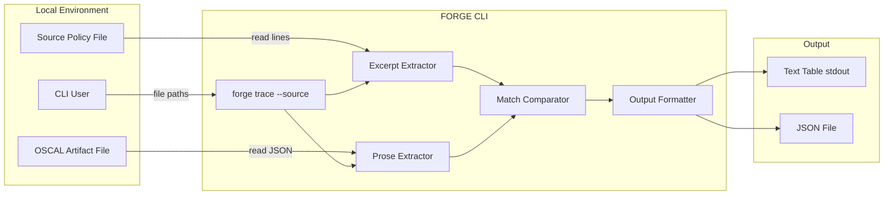
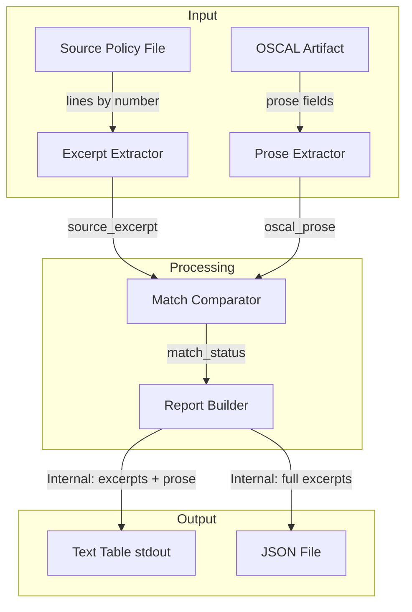
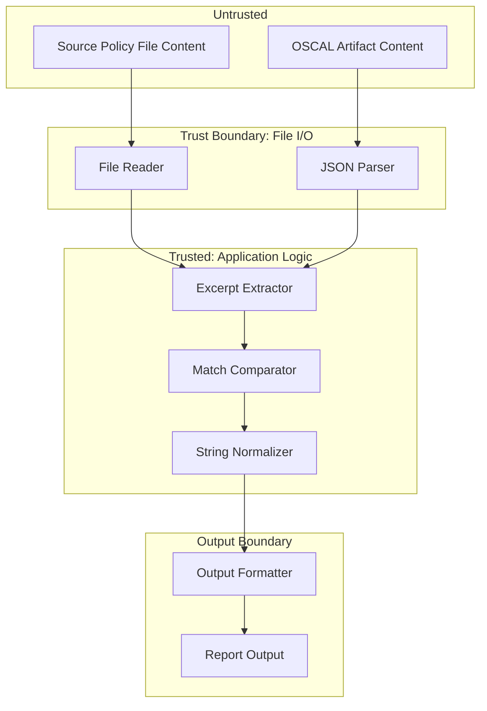

# 039-sec-traceability-report-excerpts

> **Document Type:** Security Review (Lightweight)
> **Audience:** LLM agents, human reviewers
> **Status:** Draft
> **Last Updated:** 2026-02-11 <!-- @auto -->
> **Reviewer:** Brian Luby <!-- @human-required -->
> **Risk Level:** Low <!-- @human-required -->

---

## Review Tier Legend

| Marker | Tier | Speckit Behavior |
|--------|------|------------------|
| 🔴 `@human-required` | Human Generated | Prompt human to author; blocks until complete |
| 🟡 `@human-review` | LLM + Human Review | LLM drafts → prompt human to confirm/edit; blocks until confirmed |
| 🟢 `@llm-autonomous` | LLM Autonomous | LLM completes; no prompt; logged for audit |
| ⚪ `@auto` | Auto-generated | System fills (timestamps, links); no prompt |

---

## Severity Definitions

| Level | Label | Definition |
|-------|-------|------------|
| 🔴 | **Critical** | Immediate exploitation risk; data breach or system compromise likely |
| 🟠 | **High** | Significant risk; exploitation possible with moderate effort |
| 🟡 | **Medium** | Notable risk; exploitation requires specific conditions |
| 🟢 | **Low** | Minor risk; limited impact or unlikely exploitation |

---

## Linkage ⚪ `@auto`

| Document | ID | Relationship |
|----------|-----|--------------|
| Parent PRD | [039-prd-traceability-report-excerpts.md](../PRD/039-prd-traceability-report-excerpts.md) | Feature being reviewed |
| Architecture Review | [039-ar-traceability-report-excerpts.md](../AR/039-ar-traceability-report-excerpts.md) | Technical implementation |

---

## Purpose

This is a **lightweight security review** intended to catch obvious security concerns early in the product lifecycle. It is NOT a comprehensive threat model. Full threat modeling should occur during implementation when infrastructure-as-code and concrete implementations exist.

**This review answers three questions:**
1. What does this feature expose to attackers?
2. What data does it touch, and how sensitive is that data?
3. What's the impact if something goes wrong?

**Scope of this review:**
- Attack surface identification
- Data classification
- High-level CIA assessment
- ~~Detailed threat enumeration (deferred to implementation)~~
- ~~Penetration testing (deferred to implementation)~~
- ~~Compliance audit (separate process)~~

---

## Feature Security Summary

### One-line Summary 🔴 `@human-required`
> WI-39 extends the traceability report with source text excerpts from the original policy and OSCAL prose comparison. Source document content is included verbatim in report output (text table and JSON), which means any malicious content in source documents (script tags, format strings, control characters) could be carried through into reports.

### Risk Assessment 🔴 `@human-required`
> **Risk Level:** Low
> **Justification:** Local CLI tool with no network exposure; the primary risk is content passthrough from source documents into report output, which could affect downstream consumers of the JSON report but has no direct exploitation path within FORGE itself.

---

## Attack Surface Analysis

### Exposure Points 🟡 `@human-review`

| Exposure Type | Details | Authentication | Authorization | Notes |
|---------------|---------|----------------|---------------|-------|
| User Input Field | Source policy file path (`--source` flag) | -- | -- | File path validated by existing CLI/OS mechanisms |
| User Input Field | `--format` flag (table or json) | -- | -- | Enum-constrained by clap; no injection risk |
| User Input Field | `--excerpt-length` flag (integer) | -- | -- | Integer parsed by clap; no injection risk |
| User Input Field | Source policy file content (read by line number) | -- | -- | Content passthrough: source text is included verbatim in report output |
| **None** | **No network, API, or service exposure** | -- | -- | Local CLI tool only |

### Attack Surface Diagram 🟢 `@llm-autonomous`

### Exposure Checklist 🟢 `@llm-autonomous`

- [x] **Internet-facing endpoints require authentication** — N/A: no internet-facing endpoints
- [x] **No sensitive data in URL parameters** — N/A: no URLs, no parameters
- [x] **File uploads validated** — N/A: no uploads; local file reads only
- [x] **Rate limiting configured** — N/A: local CLI tool
- [x] **CORS policy is restrictive** — N/A: no web service
- [x] **No debug/admin endpoints exposed** — N/A: no endpoints
- [x] **Webhooks validate signatures** — N/A: no webhooks

---

## Data Flow Analysis

### Data Inventory 🟡 `@human-review`

| Data Element | PRD Entity | Classification | Source | Destination | Retention | Encrypted Rest | Encrypted Transit | Residency |
|--------------|------------|----------------|--------|-------------|-----------|----------------|-------------------|-----------|
| Source text excerpts | TraceEntry.source_excerpt | Internal | Source policy file (local) | Report output (stdout/file) | None (ephemeral) | N/A | N/A | Local |
| OSCAL prose text | TraceEntry.oscal_prose | Internal | OSCAL artifact file (local) | Report output (stdout/file) | None (ephemeral) | N/A | N/A | Local |
| Match status | TraceEntry.match_status | Public | Computed comparison | Report output (stdout/file) | None (ephemeral) | N/A | N/A | Local |
| Traceability summary | TraceSummary | Public | Computed aggregation | Report output (stdout/file) | None (ephemeral) | N/A | N/A | Local |
| Source file path | TraceReport.source_path | Internal | CLI argument | Report output | None (ephemeral) | N/A | N/A | Local |

### Data Classification Reference 🟢 `@llm-autonomous`

| Level | Label | Description | Examples | Handling Requirements |
|-------|-------|-------------|----------|----------------------|
| 1 | **Public** | No impact if disclosed | Match status, summary counts | No special handling |
| 2 | **Internal** | Minor impact if disclosed | Source excerpts, OSCAL prose, file paths | Access controls, no public exposure |
| 3 | **Confidential** | Significant impact if disclosed | PII, user data, credentials | Encryption, audit logging, access controls |
| 4 | **Restricted** | Severe impact if disclosed | Payment data, health records, secrets | Encryption, strict access, compliance requirements |

### Data Flow Diagram 🟢 `@llm-autonomous`

### Data Handling Checklist 🟢 `@llm-autonomous`

- [x] **No Restricted data stored unless absolutely required** — No Restricted data involved
- [x] **Confidential data encrypted at rest** — N/A: no Confidential data stored
- [x] **All data encrypted in transit (TLS 1.2+)** — N/A: no network transit
- [x] **PII has defined retention policy** — N/A: no PII collected
- [x] **Logs do not contain Confidential/Restricted data** — N/A: CLI tool with no persistent logging
- [x] **Secrets are not hardcoded** — N/A: no secrets
- [x] **Data minimization applied** — Only referenced lines are extracted (not entire source file)
- [x] **Data residency requirements documented** — N/A: local file system only

---

## Third-Party & Supply Chain 🟡 `@human-review`

### New External Services

| Service | Purpose | Data Shared | Communication | Approved? |
|---------|---------|-------------|---------------|-----------|
| None | No external services | -- | -- | N/A |

### New Libraries/Dependencies

| Library | Version | License | Purpose | Security Check |
|---------|---------|---------|---------|----------------|
| serde | 1.x | MIT/Apache-2.0 | Serialize derive for JSON output | Already approved (existing dependency) |
| serde_json | 1.x | MIT/Apache-2.0 | JSON serialization | Already approved (existing dependency) |

No new dependencies are introduced by WI-39. All libraries are existing project dependencies.

### Supply Chain Checklist

- [x] **All new services use encrypted communication** — N/A: no new services
- [x] **Service agreements/ToS reviewed** — N/A: no new services
- [x] **Dependencies have acceptable licenses** — MIT/Apache-2.0 (already approved)
- [x] **Dependencies are actively maintained** — serde and serde_json are actively maintained
- [x] **No known critical vulnerabilities** — No known CVEs in current versions

---

## CIA Impact Assessment

If this feature is compromised, what's the impact?

### Confidentiality 🟡 `@human-review`

> **What could be disclosed?**

| Asset at Risk | Classification | Exposure Scenario | Impact | Likelihood |
|---------------|----------------|-------------------|--------|------------|
| Source policy text excerpts | Internal | JSON report file committed to public repository or shared inappropriately | Low | Low |
| File system paths | Internal | Report output reveals local directory structure | Low | Low |

**Confidentiality Risk Level:** Low

### Integrity 🟡 `@human-review`

> **What could be modified or corrupted?**

| Asset at Risk | Modification Scenario | Impact | Likelihood |
|---------------|----------------------|--------|------------|
| Source text excerpts in report | Malicious content in source policy (script tags, format strings, control characters) passes through into report output without escaping | Low-Medium | Low |
| Match status (matched/mismatch) | Normalization algorithm incorrectly classifies matches, leading to false confidence in conversion fidelity | Low | Low |

**Integrity Risk Level:** Low-Medium

### Availability 🟡 `@human-review`

> **What could be disrupted?**

| Service/Function | Disruption Scenario | Impact | Likelihood |
|------------------|---------------------|--------|------------|
| Excerpt extraction | Source file with extremely long lines causes excessive memory allocation | Low | Low |
| Report generation | Pathologically large OSCAL artifact with thousands of elements produces oversized report | Low | Low |

**Availability Risk Level:** Low

### CIA Summary 🟢 `@llm-autonomous`

| Dimension | Risk Level | Primary Concern | Mitigation Priority |
|-----------|------------|-----------------|---------------------|
| **Confidentiality** | Low | Source policy text in report output | Low |
| **Integrity** | Low-Medium | Content passthrough without escaping | Medium |
| **Availability** | Low | Large input handling | Low |

**Overall CIA Risk:** Low — *Local CLI tool with no network exposure; primary concern is content passthrough from source documents into report output, which could carry malicious content to downstream consumers.*

---

## Trust Boundaries 🟡 `@human-review`

### Trust Boundary Checklist 🟢 `@llm-autonomous`

- [x] **All input from untrusted sources is validated** — File existence validated; line range bounds checked; JSON parsed with serde (rejects malformed JSON)
- [x] **External API responses are validated** — N/A: no external APIs
- [x] **Authorization checked at data access, not just entry point** — N/A: local CLI, no authorization model
- [x] **Service-to-service calls are authenticated** — N/A: no service calls

---

## Known Risks & Mitigations 🟡 `@human-review`

| ID | Risk Description | Severity | Mitigation | Status | Owner |
|----|------------------|----------|------------|--------|-------|
| R1 | Source document content passthrough: if source policy contains script tags, HTML injection, or format string patterns, these are included verbatim in the report output (especially JSON), which could affect downstream consumers that render the output | Low | Document that report output should be treated with the same sensitivity as source policy; consider output escaping in future enhancement | Open | Brian Luby |
| R2 | Source file modified since conversion: excerpt extraction returns text that does not correspond to the original conversion, potentially misleading the reviewer | Low | AR-038 S-3 provides file hash checking; warn if source has been modified | Mitigated | Brian Luby |
| R3 | Extremely long source lines or very large source files could cause excessive memory usage during excerpt extraction | Low | Source file is already loaded as Vec<String> by AR-038; line-range extraction is O(1) slice; no amplification | Mitigated | Brian Luby |

### Risk Acceptance 🔴 `@human-required`

| Risk ID | Accepted By | Date | Justification | Review Date |
|---------|-------------|------|---------------|-------------|
| R1 | Brian Luby | 2026-02-11 | Content passthrough is inherent to the excerpt feature's purpose; downstream consumers are responsible for their own input handling; FORGE is a local CLI tool with no rendering engine | 2026-08-11 |

---

## Security Requirements 🟡 `@human-review`

### Authentication & Authorization

| Req ID | Requirement | PRD AC | Verification Method |
|--------|-------------|--------|---------------------|
| — | N/A: Local CLI tool, no authentication or authorization | — | — |

### Data Protection

| Req ID | Requirement | PRD AC | Verification Method |
|--------|-------------|--------|---------------------|
| SEC-1 | JSON report output should be treated with the same sensitivity as the source policy document | — | Documentation review |
| SEC-2 | Source text excerpts must not be truncated in JSON output (data integrity) | AC-5 | Unit test |

### Input Validation

| Req ID | Requirement | PRD AC | Verification Method |
|--------|-------------|--------|---------------------|
| SEC-3 | Line range bounds must be validated before extraction (prevent out-of-bounds access) | AC-7 | Unit test |
| SEC-4 | `--excerpt-length` must be validated as a non-negative integer | — | Clap argument validation |

### Operational Security

| Req ID | Requirement | PRD AC | Verification Method |
|--------|-------------|--------|---------------------|
| SEC-5 | Source file modification since conversion should produce a warning | — | Unit test |

---

## Compliance Considerations 🟡 `@human-review`

| Regulation | Applicable? | Relevant Requirements | N/A Justification |
|------------|-------------|----------------------|-------------------|
| GDPR | N/A | — | Local CLI tool; no PII collection, processing, or storage; no network communication |
| CCPA | N/A | — | Local CLI tool; no personal information handling |
| SOC 2 | N/A | — | Not a service; local development tool |
| HIPAA | N/A | — | No health data processing |
| PCI-DSS | N/A | — | No payment data processing |
| Other | N/A | — | FORGE is a local CLI tool with no network, auth, database, or PII |

---

## Review Findings

### Issues Identified 🟡 `@human-review`

| ID | Finding | Severity | Category | Recommendation | Status |
|----|---------|----------|----------|----------------|--------|
| F1 | Source document content is passed through verbatim into report output without escaping. If source policies contain HTML tags, script content, or format strings, these could affect downstream consumers that render report output | Low | Data | Consider adding optional output escaping for HTML/script content in a future enhancement; document that report output inherits source document sensitivity | Open |

### Positive Observations 🟢 `@llm-autonomous`

- Excerpt extraction uses line-number indexing against an already-loaded Vec<String>, avoiding additional file I/O and associated TOCTOU risks
- The four-state MatchStatus enum (Matched, Mismatch, Unmapped, NoExcerpt) provides unambiguous classification, preventing silent misclassification
- Normalized string comparison uses only stdlib operations (trim, whitespace collapse) with no external dependencies, minimizing supply chain risk
- JSON output uses serde Serialize derive, which provides type-safe serialization and prevents manual JSON construction errors
- Data minimization is applied: only referenced lines are extracted from the source file, not the entire document content

---

## Open Questions 🟡 `@human-review`

- [ ] **Q1:** Should the JSON output include any escaping for HTML or script content in source excerpts, or is raw passthrough acceptable for a CLI tool whose output is consumed programmatically?

---

## Changelog ⚪ `@auto`

| Version | Date | Author | Changes |
|---------|------|--------|---------|
| 0.1 | 2026-02-11 | LLM (Claude) | Initial review |

---

## Review Sign-off 🔴 `@human-required`

| Role | Name | Date | Decision |
|------|------|------|----------|
| Security Reviewer | Brian Luby | YYYY-MM-DD | [Approved / Approved with conditions / Rejected] |
| Feature Owner | Brian Luby | YYYY-MM-DD | [Acknowledged] |

### Conditions for Approval (if applicable) 🔴 `@human-required`

- [ ] Document in user-facing guidance that report output (especially JSON) should be treated with the same sensitivity as source policy documents

---

## Security Requirements Traceability 🟢 `@llm-autonomous`

| SEC Req ID | PRD Req ID | PRD AC ID | Test Type | Test Location |
|------------|------------|-----------|-----------|---------------|
| SEC-1 | — | — | Manual | Documentation review |
| SEC-2 | M-4 | AC-5 | Unit | tests/trace_json_test.rs |
| SEC-3 | M-6 | AC-7 | Unit | tests/excerpt_test.rs |
| SEC-4 | S-1 | — | Unit | Clap argument validation |
| SEC-5 | — | — | Unit | tests/trace_report_test.rs |

---

## Review Checklist 🟢 `@llm-autonomous`

Before marking as Approved:
- [x] Attack surface documented with auth/authz status for each exposure
- [x] Exposure Points table has no contradictory rows (None vs. actual endpoints)
- [x] All PRD Data Model entities appear in Data Inventory
- [x] All data elements are classified using the 4-tier model
- [x] Third-party dependencies and services are listed
- [x] CIA impact is assessed with Low/Medium/High ratings
- [x] Trust boundaries are identified
- [x] Security requirements have verification methods specified
- [x] Security requirements trace to PRD ACs where applicable
- [x] No Critical/High findings remain Open
- [x] Compliance N/A items have justification
- [x] Risk acceptance has named approver and review date
