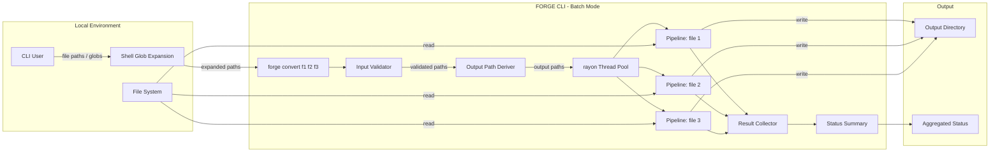
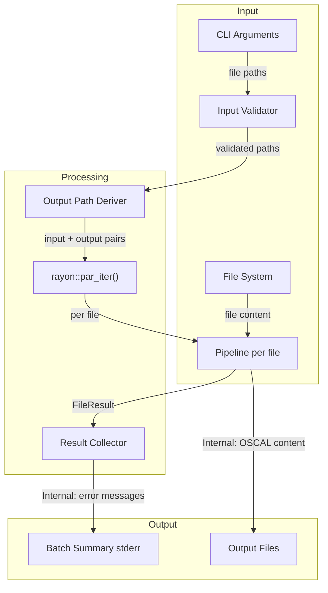
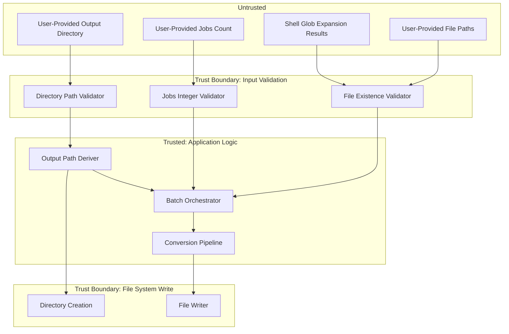

# 040-sec-batch-conversion

> **Document Type:** Security Review (Lightweight)
> **Audience:** LLM agents, human reviewers
> **Status:** Draft
> **Last Updated:** 2026-02-11 <!-- @auto -->
> **Reviewer:** Brian Luby <!-- @human-required -->
> **Risk Level:** Medium <!-- @human-required -->

---

## Review Tier Legend

| Marker | Tier | Speckit Behavior |
|--------|------|------------------|
| 🔴 `@human-required` | Human Generated | Prompt human to author; blocks until complete |
| 🟡 `@human-review` | LLM + Human Review | LLM drafts → prompt human to confirm/edit; blocks until confirmed |
| 🟢 `@llm-autonomous` | LLM Autonomous | LLM completes; no prompt; logged for audit |
| ⚪ `@auto` | Auto-generated | System fills (timestamps, links); no prompt |

---

## Severity Definitions

| Level | Label | Definition |
|-------|-------|------------|
| 🔴 | **Critical** | Immediate exploitation risk; data breach or system compromise likely |
| 🟠 | **High** | Significant risk; exploitation possible with moderate effort |
| 🟡 | **Medium** | Notable risk; exploitation requires specific conditions |
| 🟢 | **Low** | Minor risk; limited impact or unlikely exploitation |

---

## Linkage ⚪ `@auto`

| Document | ID | Relationship |
|----------|-----|--------------|
| Parent PRD | [040-prd-batch-conversion.md](../PRD/040-prd-batch-conversion.md) | Feature being reviewed |
| Architecture Review | [040-ar-batch-conversion.md](../AR/040-ar-batch-conversion.md) | Technical implementation |

---

## Purpose

This is a **lightweight security review** intended to catch obvious security concerns early in the product lifecycle. It is NOT a comprehensive threat model. Full threat modeling should occur during implementation when infrastructure-as-code and concrete implementations exist.

**This review answers three questions:**
1. What does this feature expose to attackers?
2. What data does it touch, and how sensitive is that data?
3. What's the impact if something goes wrong?

**Scope of this review:**
- Attack surface identification
- Data classification
- High-level CIA assessment
- ~~Detailed threat enumeration (deferred to implementation)~~
- ~~Penetration testing (deferred to implementation)~~
- ~~Compliance audit (separate process)~~

---

## Feature Security Summary

### One-line Summary 🔴 `@human-required`
> WI-40 introduces multi-file batch processing with parallel execution via rayon, accepting multiple file paths and glob patterns as input, creating output directories, and managing a thread pool -- this is the highest-risk WI in the batch due to resource exhaustion potential, glob pattern expansion, symlink traversal, and file system write amplification.

### Risk Assessment 🔴 `@human-required`
> **Risk Level:** Medium
> **Justification:** Batch processing amplifies any individual vulnerability across multiple files; glob pattern expansion and parallel thread pool introduce resource exhaustion vectors; output directory creation and file writing introduce file system safety concerns not present in single-file mode.

---

## Attack Surface Analysis

### Exposure Points 🟡 `@human-review`

| Exposure Type | Details | Authentication | Authorization | Notes |
|---------------|---------|----------------|---------------|-------|
| User Input Field | Multiple input file paths (positional args, `Vec<PathBuf>`) | -- | -- | User-controlled file paths; validated for existence |
| User Input Field | Glob patterns expanded by shell (e.g., `policies/*.md`) | -- | -- | Shell expansion could match unexpected files including symlinks |
| User Input Field | `--output` directory path | -- | -- | Directory creation via `create_dir_all`; user-controlled path |
| User Input Field | `--jobs` flag (parallelism level) | -- | -- | Integer controlling thread pool size; excessive values could exhaust resources |
| User Input Field | `--strategy` and `--format` flags | -- | -- | Enum-constrained by clap; no injection risk |

### Attack Surface Diagram 🟢 `@llm-autonomous`

### Exposure Checklist 🟢 `@llm-autonomous`

- [x] **Internet-facing endpoints require authentication** — N/A: no internet-facing endpoints
- [x] **No sensitive data in URL parameters** — N/A: no URLs
- [x] **File uploads validated** — N/A: no uploads; local file reads; input files validated for existence and readability
- [x] **Rate limiting configured** — N/A: local CLI tool; parallelism controlled via `--jobs` flag
- [x] **CORS policy is restrictive** — N/A: no web service
- [x] **No debug/admin endpoints exposed** — N/A: no endpoints
- [x] **Webhooks validate signatures** — N/A: no webhooks

---

## Data Flow Analysis

### Data Inventory 🟡 `@human-review`

| Data Element | PRD Entity | Classification | Source | Destination | Retention | Encrypted Rest | Encrypted Transit | Residency |
|--------------|------------|----------------|--------|-------------|-----------|----------------|-------------------|-----------|
| Input file paths | BatchRun.input_paths | Internal | CLI arguments / shell glob | Validation logic | None (ephemeral) | N/A | N/A | Local |
| Output file paths | FileResult.output_path | Internal | Derived from input paths | File system + status report | None (ephemeral) | N/A | N/A | Local |
| Policy document content | — | Internal | Input files (local FS) | OSCAL output files | Persistent (output files) | N/A | N/A | Local |
| Conversion errors | FileResult.error_message | Internal | Pipeline errors | Stderr status report | None (ephemeral) | N/A | N/A | Local |
| Batch summary | BatchSummary | Public | Computed aggregation | Stderr | None (ephemeral) | N/A | N/A | Local |

### Data Classification Reference 🟢 `@llm-autonomous`

| Level | Label | Description | Examples | Handling Requirements |
|-------|-------|-------------|----------|----------------------|
| 1 | **Public** | No impact if disclosed | Batch summary counts, processing times | No special handling |
| 2 | **Internal** | Minor impact if disclosed | File paths, error messages, policy content | Access controls, no public exposure |
| 3 | **Confidential** | Significant impact if disclosed | PII, user data, credentials | Encryption, audit logging, access controls |
| 4 | **Restricted** | Severe impact if disclosed | Payment data, health records, secrets | Encryption, strict access, compliance requirements |

### Data Flow Diagram 🟢 `@llm-autonomous`

### Data Handling Checklist 🟢 `@llm-autonomous`

- [x] **No Restricted data stored unless absolutely required** — No Restricted data involved
- [x] **Confidential data encrypted at rest** — N/A: no Confidential data
- [x] **All data encrypted in transit (TLS 1.2+)** — N/A: no network transit
- [x] **PII has defined retention policy** — N/A: no PII
- [x] **Logs do not contain Confidential/Restricted data** — Error messages may contain file paths but not file content
- [x] **Secrets are not hardcoded** — N/A: no secrets
- [x] **Data minimization applied** — Each file processed independently; no cross-file data accumulation
- [x] **Data residency requirements documented** — N/A: local file system only

---

## Third-Party & Supply Chain 🟡 `@human-review`

### New External Services

| Service | Purpose | Data Shared | Communication | Approved? |
|---------|---------|-------------|---------------|-----------|
| None | No external services | -- | -- | N/A |

### New Libraries/Dependencies

| Library | Version | License | Purpose | Security Check |
|---------|---------|---------|---------|----------------|
| rayon | 1.x | MIT/Apache-2.0 | Data-parallel iteration for batch file processing | Widely used, well-maintained Rust crate; no known CVEs |

### Supply Chain Checklist

- [x] **All new services use encrypted communication** — N/A: no new services
- [x] **Service agreements/ToS reviewed** — N/A: no new services
- [x] **Dependencies have acceptable licenses** — rayon: MIT/Apache-2.0
- [x] **Dependencies are actively maintained** — rayon has regular releases and active maintainers
- [x] **No known critical vulnerabilities** — No known CVEs in rayon

---

## CIA Impact Assessment

If this feature is compromised, what's the impact?

### Confidentiality 🟡 `@human-review`

> **What could be disclosed?**

| Asset at Risk | Classification | Exposure Scenario | Impact | Likelihood |
|---------------|----------------|-------------------|--------|------------|
| Policy document content | Internal | Multiple output files created in user-specified directory; accidental exposure of output directory | Low | Low |
| File system paths | Internal | Error messages in aggregated status reveal local directory structure | Low | Low |

**Confidentiality Risk Level:** Low

### Integrity 🟡 `@human-review`

> **What could be modified or corrupted?**

| Asset at Risk | Modification Scenario | Impact | Likelihood |
|---------------|----------------------|--------|------------|
| Output files | Output filename collision: two input files with the same stem overwrite each other's output | Medium | Low |
| Output files | Symlink in input list causes FORGE to read unexpected file content, producing incorrect OSCAL output | Low | Low |
| Output directory | `--output` path with `create_dir_all` creates directories outside the intended location (path traversal) | Low | Low |

**Integrity Risk Level:** Low-Medium

### Availability 🟡 `@human-review`

> **What could be disrupted?**

| Service/Function | Disruption Scenario | Impact | Likelihood |
|------------------|---------------------|--------|------------|
| CLI process | Glob pattern expands to thousands of files; thread pool exhausts system resources (memory, file handles, CPU) | Medium | Medium |
| CLI process | `--jobs` set to an extremely large value (e.g., 10000) creates excessive threads | Medium | Low |
| File system | Large batch writes thousands of output files to disk, exhausting disk space or inode limits | Low | Low |
| CLI process | Panic in conversion pipeline without catch_unwind propagates through rayon thread pool, terminating all in-progress conversions | Medium | Low |

**Availability Risk Level:** Medium

### CIA Summary 🟢 `@llm-autonomous`

| Dimension | Risk Level | Primary Concern | Mitigation Priority |
|-----------|------------|-----------------|---------------------|
| **Confidentiality** | Low | Multiple output files in user-specified directory | Low |
| **Integrity** | Low-Medium | Output filename collisions; symlink input files | Medium |
| **Availability** | Medium | Resource exhaustion from large batch sizes or excessive parallelism | High |

**Overall CIA Risk:** Medium — *Batch processing amplifies individual vulnerabilities across multiple files; resource exhaustion from unbounded batch sizes or thread counts is the primary concern. Integrity risks from filename collisions are mitigated by the collision avoidance algorithm.*

---

## Trust Boundaries 🟡 `@human-review`

### Trust Boundary Checklist 🟢 `@llm-autonomous`

- [x] **All input from untrusted sources is validated** — File paths validated for existence; output directory validated; jobs count parsed as integer by clap
- [x] **External API responses are validated** — N/A: no external APIs
- [x] **Authorization checked at data access, not just entry point** — N/A: local CLI, no authorization model
- [x] **Service-to-service calls are authenticated** — N/A: no service calls

---

## Known Risks & Mitigations 🟡 `@human-review`

| ID | Risk Description | Severity | Mitigation | Status | Owner |
|----|------------------|----------|------------|--------|-------|
| R1 | Resource exhaustion from large batch sizes: glob patterns could expand to thousands of files, exhausting memory, file handles, or CPU | Medium | Rayon defaults to num_cpus threads (bounded); consider adding a maximum file count warning or limit; validate all inputs before processing to fail fast | Open | Brian Luby |
| R2 | Output filename collision: two input files from different directories with the same stem (e.g., `dir1/policy.md` and `dir2/policy.md`) could overwrite each other | Medium | AR-040 specifies collision avoidance with numeric suffix (`{stem}_{n}.{ext}`); must be implemented correctly | Mitigated | Brian Luby |
| R3 | Symlink traversal: a symlink in the input file list could point to an unexpected file (e.g., `/etc/passwd`), causing FORGE to read and process unintended content | Low | FORGE reads files as Markdown and attempts to parse policy structure; non-policy content will fail conversion gracefully; consider adding symlink detection warning | Open | Brian Luby |
| R4 | Panic in pipeline terminates rayon thread pool: if catch_unwind is not properly applied, a panic in one file's conversion could terminate all in-progress parallel conversions | Medium | AR-040 specifies catch_unwind around per-file pipeline invocation; must be verified in testing | Mitigated | Brian Luby |
| R5 | `--output` path traversal: user-provided output directory could be a sensitive location (e.g., `--output /etc/`) | Low | Standard OS file permissions prevent writing to restricted directories; `create_dir_all` creates only the specified path; FORGE runs with user permissions, not elevated | Mitigated | Brian Luby |
| R6 | `--jobs` set to excessive value: very large thread count could exhaust system resources | Low | Rayon clamps to reasonable values; consider upper bound validation (e.g., max 256 threads) | Open | Brian Luby |

### Risk Acceptance 🔴 `@human-required`

| Risk ID | Accepted By | Date | Justification | Review Date |
|---------|-------------|------|---------------|-------------|
| R1 | Brian Luby | 2026-02-11 | Rayon thread pool is bounded by CPU count by default; file count is ultimately bounded by file system; adding a hard limit would reduce flexibility without proportional security benefit for a local CLI tool | 2026-08-11 |
| R3 | Brian Luby | 2026-02-11 | Symlink traversal risk is inherent to any file-processing CLI tool; FORGE runs with user permissions and reads files the user has access to; non-policy content fails conversion gracefully | 2026-08-11 |
| R6 | Brian Luby | 2026-02-11 | Rayon internally manages thread allocation; excessive --jobs values are user error on a local tool; OS resource limits provide a backstop | 2026-08-11 |

---

## Security Requirements 🟡 `@human-review`

### Authentication & Authorization

| Req ID | Requirement | PRD AC | Verification Method |
|--------|-------------|--------|---------------------|
| — | N/A: Local CLI tool, no authentication or authorization | — | — |

### Data Protection

| Req ID | Requirement | PRD AC | Verification Method |
|--------|-------------|--------|---------------------|
| SEC-1 | Each file conversion must be independent with no cross-file data leakage between parallel threads | AC-4 | Integration test with mixed valid/invalid files |

### Input Validation

| Req ID | Requirement | PRD AC | Verification Method |
|--------|-------------|--------|---------------------|
| SEC-2 | All input file paths must be validated for existence and readability before batch processing begins (fail-fast) | AC-3 | Unit test |
| SEC-3 | When `--output` is a file (not a directory) and multiple inputs are provided, the CLI must exit with an error | AC-4, EC-4 | Unit test |
| SEC-4 | Output filename derivation must handle collisions without overwriting existing output files | AC-2, EC-3 | Unit test |
| SEC-5 | Zero input files (empty glob match) must produce a descriptive error, not silent success | EC-2 | Unit test |

### Operational Security

| Req ID | Requirement | PRD AC | Verification Method |
|--------|-------------|--------|---------------------|
| SEC-6 | Per-file pipeline invocation must be wrapped in catch_unwind to prevent panics from terminating the batch | AC-4, M-5 | Integration test |
| SEC-7 | Aggregated status must be printed to stderr, not stdout, to prevent mixing with OSCAL output | AC-8 | Integration test |
| SEC-8 | The `--jobs` flag must accept only positive integers; rayon thread pool must be bounded | — | Clap argument validation |

---

## Compliance Considerations 🟡 `@human-review`

| Regulation | Applicable? | Relevant Requirements | N/A Justification |
|------------|-------------|----------------------|-------------------|
| GDPR | N/A | — | Local CLI tool; no PII collection, processing, or storage; no network communication |
| CCPA | N/A | — | Local CLI tool; no personal information handling |
| SOC 2 | N/A | — | Not a service; local development tool |
| HIPAA | N/A | — | No health data processing |
| PCI-DSS | N/A | — | No payment data processing |
| Other | N/A | — | FORGE is a local CLI tool with no network, auth, database, or PII |

---

## Review Findings

### Issues Identified 🟡 `@human-review`

| ID | Finding | Severity | Category | Recommendation | Status |
|----|---------|----------|----------|----------------|--------|
| F1 | Resource exhaustion: no upper bound on input file count. A glob pattern matching thousands of files could exhaust memory or file handles during parallel processing | Medium | Availability/CIA | Consider emitting a warning when batch size exceeds a threshold (e.g., 100 files); log the file count at INFO level for observability | Open |
| F2 | Symlink inputs: no detection or warning when input file paths are symlinks. A symlink farm could cause FORGE to process unexpected files | Low | Integrity | Consider adding a `--no-follow-symlinks` flag or emitting a warning when symlinks are detected in the input list | Open |
| F3 | Output directory creation with `create_dir_all`: while OS permissions prevent writing to restricted directories, the directory creation path is entirely user-controlled | Low | Integrity | Standard behavior for CLI tools; OS permissions provide adequate protection; no action required | Resolved |

### Positive Observations 🟢 `@llm-autonomous`

- The architecture correctly isolates the single-file pipeline from batch orchestration, preventing batch-specific concerns from leaking into the core conversion logic
- Per-file error isolation via catch_unwind + Result ensures one bad file cannot crash the entire batch
- Aggregated status on stderr (not stdout) prevents mixing operational data with OSCAL output
- Output filename collision avoidance with numeric suffix prevents accidental overwrites
- Rayon's default thread pool is bounded by CPU core count, providing a natural resource limit
- Upfront validation of all inputs before processing prevents partial output from validation failures

---

## Open Questions 🟡 `@human-review`

- [ ] **Q1:** Should there be a maximum batch size limit (e.g., 1000 files) to prevent resource exhaustion, or is rayon's CPU-bounded thread pool sufficient?
- [ ] **Q2:** Should symlinks in the input file list be followed (current behavior) or should there be an option to reject or warn about them?

---

## Changelog ⚪ `@auto`

| Version | Date | Author | Changes |
|---------|------|--------|---------|
| 0.1 | 2026-02-11 | LLM (Claude) | Initial review |

---

## Review Sign-off 🔴 `@human-required`

| Role | Name | Date | Decision |
|------|------|------|----------|
| Security Reviewer | Brian Luby | YYYY-MM-DD | [Approved / Approved with conditions / Rejected] |
| Feature Owner | Brian Luby | YYYY-MM-DD | [Acknowledged] |

### Conditions for Approval (if applicable) 🔴 `@human-required`

- [ ] Verify catch_unwind is correctly applied around per-file pipeline invocation in integration tests
- [ ] Verify output filename collision avoidance handles the same-stem-different-directory case (EC-3)
- [ ] Consider adding a batch size warning threshold for observability

---

## Security Requirements Traceability 🟢 `@llm-autonomous`

| SEC Req ID | PRD Req ID | PRD AC ID | Test Type | Test Location |
|------------|------------|-----------|-----------|---------------|
| SEC-1 | M-5 | AC-4 | Integration | tests/batch_conversion_test.rs |
| SEC-2 | M-1 | AC-3 | Unit | tests/batch_validation_test.rs |
| SEC-3 | M-3 | EC-4 | Unit | tests/batch_output_test.rs |
| SEC-4 | M-3 | EC-3 | Unit | tests/batch_output_naming_test.rs |
| SEC-5 | M-1 | EC-2 | Unit | tests/batch_validation_test.rs |
| SEC-6 | M-5 | AC-4 | Integration | tests/batch_error_isolation_test.rs |
| SEC-7 | M-4 | AC-8 | Integration | tests/batch_summary_test.rs |
| SEC-8 | S-2 | — | Unit | Clap argument validation |

---

## Review Checklist 🟢 `@llm-autonomous`

Before marking as Approved:
- [x] Attack surface documented with auth/authz status for each exposure
- [x] Exposure Points table has no contradictory rows (None vs. actual endpoints)
- [x] All PRD Data Model entities appear in Data Inventory
- [x] All data elements are classified using the 4-tier model
- [x] Third-party dependencies and services are listed
- [x] CIA impact is assessed with Low/Medium/High ratings
- [x] Trust boundaries are identified
- [x] Security requirements have verification methods specified
- [x] Security requirements trace to PRD ACs where applicable
- [x] No Critical/High findings remain Open
- [x] Compliance N/A items have justification
- [x] Risk acceptance has named approver and review date
