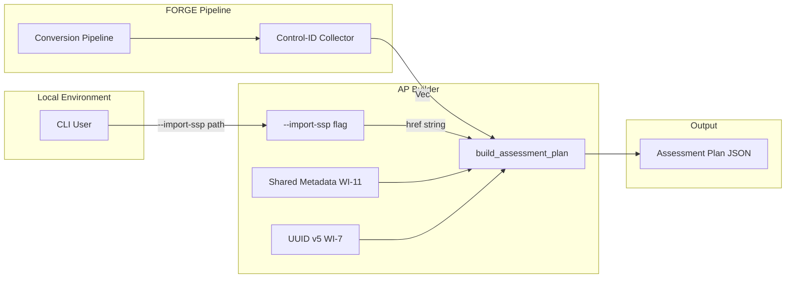
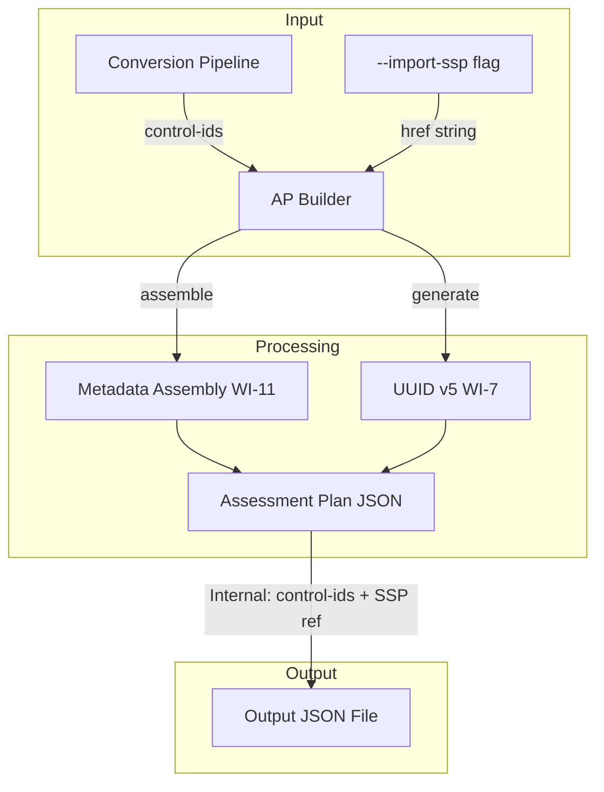
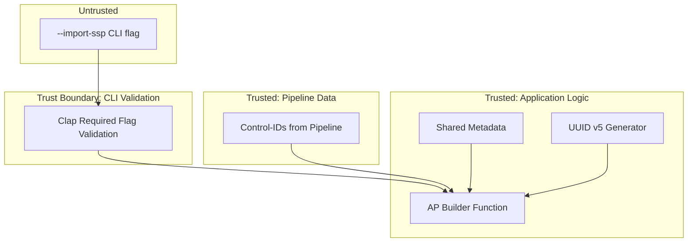

# 041-sec-assessment-plan-controls

> **Document Type:** Security Review (Lightweight)
> **Audience:** LLM agents, human reviewers
> **Status:** Draft
> **Last Updated:** 2026-02-11 <!-- @auto -->
> **Reviewer:** Brian Luby <!-- @human-required -->
> **Risk Level:** Low <!-- @human-required -->

---

## Review Tier Legend

| Marker | Tier | Speckit Behavior |
|--------|------|------------------|
| 🔴 `@human-required` | Human Generated | Prompt human to author; blocks until complete |
| 🟡 `@human-review` | LLM + Human Review | LLM drafts → prompt human to confirm/edit; blocks until confirmed |
| 🟢 `@llm-autonomous` | LLM Autonomous | LLM completes; no prompt; logged for audit |
| ⚪ `@auto` | Auto-generated | System fills (timestamps, links); no prompt |

---

## Severity Definitions

| Level | Label | Definition |
|-------|-------|------------|
| 🔴 | **Critical** | Immediate exploitation risk; data breach or system compromise likely |
| 🟠 | **High** | Significant risk; exploitation possible with moderate effort |
| 🟡 | **Medium** | Notable risk; exploitation requires specific conditions |
| 🟢 | **Low** | Minor risk; limited impact or unlikely exploitation |

---

## Linkage ⚪ `@auto`

| Document | ID | Relationship |
|----------|-----|--------------|
| Parent PRD | [041-prd-assessment-plan-controls.md](../PRD/041-prd-assessment-plan-controls.md) | Feature being reviewed |
| Architecture Review | [041-ar-assessment-plan-controls.md](../AR/041-ar-assessment-plan-controls.md) | Technical implementation |

---

## Purpose

This is a **lightweight security review** intended to catch obvious security concerns early in the product lifecycle. It is NOT a comprehensive threat model. Full threat modeling should occur during implementation when infrastructure-as-code and concrete implementations exist.

**This review answers three questions:**
1. What does this feature expose to attackers?
2. What data does it touch, and how sensitive is that data?
3. What's the impact if something goes wrong?

**Scope of this review:**
- Attack surface identification
- Data classification
- High-level CIA assessment
- ~~Detailed threat enumeration (deferred to implementation)~~
- ~~Penetration testing (deferred to implementation)~~
- ~~Compliance audit (separate process)~~

---

## Feature Security Summary

### One-line Summary 🔴 `@human-required`
> WI-41 generates an OSCAL Assessment Plan JSON skeleton with reviewed-controls and import-ssp from conversion output control-ids and a user-provided SSP path -- a pure in-memory data transformation with minimal attack surface and no new file I/O beyond the existing pipeline.

### Risk Assessment 🔴 `@human-required`
> **Risk Level:** Low
> **Justification:** Pure function builder pattern with no network exposure, no new file I/O, no new parsing of untrusted input. The builder receives typed data (control-id strings, SSP href string) from the existing pipeline and assembles JSON output. The only security-relevant concern is data integrity of the control selection mapping.

---

## Attack Surface Analysis

### Exposure Points 🟡 `@human-review`

| Exposure Type | Details | Authentication | Authorization | Notes |
|---------------|---------|----------------|---------------|-------|
| User Input Field | `--import-ssp` CLI flag (string path) | -- | -- | Passed directly to `import-ssp.href` field; not read or validated as a file |
| User Input Field | Control-ids from conversion pipeline output | -- | -- | Internal data flow; not directly user-controlled |
| **None** | **No network, API, or service exposure** | -- | -- | Local CLI tool; pure in-memory JSON assembly |

### Attack Surface Diagram 🟢 `@llm-autonomous`

### Exposure Checklist 🟢 `@llm-autonomous`

- [x] **Internet-facing endpoints require authentication** — N/A: no internet-facing endpoints
- [x] **No sensitive data in URL parameters** — N/A: no URLs
- [x] **File uploads validated** — N/A: no file uploads; no new file reading
- [x] **Rate limiting configured** — N/A: local CLI tool
- [x] **CORS policy is restrictive** — N/A: no web service
- [x] **No debug/admin endpoints exposed** — N/A: no endpoints
- [x] **Webhooks validate signatures** — N/A: no webhooks

---

## Data Flow Analysis

### Data Inventory 🟡 `@human-review`

| Data Element | PRD Entity | Classification | Source | Destination | Retention | Encrypted Rest | Encrypted Transit | Residency |
|--------------|------------|----------------|--------|-------------|-----------|----------------|-------------------|-----------|
| Control-ids | ControlSelection.include-controls | Internal | Conversion pipeline output | Assessment Plan JSON | Persistent (output file) | N/A | N/A | Local |
| Import-SSP href | ImportSsp.href | Internal | CLI `--import-ssp` flag | Assessment Plan JSON | Persistent (output file) | N/A | N/A | Local |
| AP metadata | OscalMetadata | Public | Shared metadata assembly (WI-11) | Assessment Plan JSON | Persistent (output file) | N/A | N/A | Local |
| Document UUID | AssessmentPlan.uuid | Public | UUID v5 generation (WI-7) | Assessment Plan JSON | Persistent (output file) | N/A | N/A | Local |
| Reviewed-controls description | ReviewedControls.description | Internal | Generated from policy title | Assessment Plan JSON | Persistent (output file) | N/A | N/A | Local |

### Data Classification Reference 🟢 `@llm-autonomous`

| Level | Label | Description | Examples | Handling Requirements |
|-------|-------|-------------|----------|----------------------|
| 1 | **Public** | No impact if disclosed | Metadata, UUIDs, OSCAL version | No special handling |
| 2 | **Internal** | Minor impact if disclosed | Control-ids, SSP path, reviewed-controls description | Access controls, no public exposure |
| 3 | **Confidential** | Significant impact if disclosed | PII, user data, credentials | Encryption, audit logging, access controls |
| 4 | **Restricted** | Severe impact if disclosed | Payment data, health records, secrets | Encryption, strict access, compliance requirements |

### Data Flow Diagram 🟢 `@llm-autonomous`

### Data Handling Checklist 🟢 `@llm-autonomous`

- [x] **No Restricted data stored unless absolutely required** — No Restricted data involved
- [x] **Confidential data encrypted at rest** — N/A: no Confidential data
- [x] **All data encrypted in transit (TLS 1.2+)** — N/A: no network transit
- [x] **PII has defined retention policy** — N/A: no PII
- [x] **Logs do not contain Confidential/Restricted data** — Only control counts and SSP href logged
- [x] **Secrets are not hardcoded** — N/A: no secrets
- [x] **Data minimization applied** — Only control-ids are included; no full control content in the AP
- [x] **Data residency requirements documented** — N/A: local file system only

---

## Third-Party & Supply Chain 🟡 `@human-review`

### New External Services

| Service | Purpose | Data Shared | Communication | Approved? |
|---------|---------|-------------|---------------|-----------|
| None | No external services | -- | -- | N/A |

### New Libraries/Dependencies

| Library | Version | License | Purpose | Security Check |
|---------|---------|---------|---------|----------------|
| None | — | — | No new dependencies; reuses existing serde_json, uuid crates | N/A |

No new dependencies are introduced by WI-41. All libraries are existing project dependencies (serde_json for JSON output, uuid for UUID v5 generation).

### Supply Chain Checklist

- [x] **All new services use encrypted communication** — N/A: no new services
- [x] **Service agreements/ToS reviewed** — N/A: no new services
- [x] **Dependencies have acceptable licenses** — No new dependencies
- [x] **Dependencies are actively maintained** — Existing dependencies only
- [x] **No known critical vulnerabilities** — No new dependencies

---

## CIA Impact Assessment

If this feature is compromised, what's the impact?

### Confidentiality 🟡 `@human-review`

> **What could be disclosed?**

| Asset at Risk | Classification | Exposure Scenario | Impact | Likelihood |
|---------------|----------------|-------------------|--------|------------|
| Control-ids in reviewed-controls | Internal | Assessment Plan JSON reveals which controls the organization implements, indicating security posture | Low | Low |
| SSP file path | Internal | Assessment Plan JSON reveals local file path structure | Low | Low |

**Confidentiality Risk Level:** Low

### Integrity 🟡 `@human-review`

> **What could be modified or corrupted?**

| Asset at Risk | Modification Scenario | Impact | Likelihood |
|---------------|----------------------|--------|------------|
| Control selection completeness | Bug in control-id collection causes some controls to be omitted from reviewed-controls, leading to incomplete assessment scope | Medium | Low |
| Control-id deduplication | Failure to deduplicate produces duplicate entries in include-controls, which may confuse downstream OSCAL tools | Low | Low |
| Import-SSP reference | Incorrect SSP href passes through to the Assessment Plan, linking to wrong system context | Low | Low |

**Integrity Risk Level:** Low

### Availability 🟡 `@human-review`

> **What could be disrupted?**

| Service/Function | Disruption Scenario | Impact | Likelihood |
|------------------|---------------------|--------|------------|
| AP generation | Extremely large control list (thousands of controls) could produce oversized JSON output | Low | Low |

**Availability Risk Level:** Low

### CIA Summary 🟢 `@llm-autonomous`

| Dimension | Risk Level | Primary Concern | Mitigation Priority |
|-----------|------------|-----------------|---------------------|
| **Confidentiality** | Low | Control-ids reveal security posture | Low |
| **Integrity** | Low | Control selection completeness | Medium |
| **Availability** | Low | Large control list handling | Low |

**Overall CIA Risk:** Low — *Pure function builder with no network exposure; the primary concern is data integrity of the control selection mapping, ensuring all controls from the conversion output appear in the Assessment Plan's reviewed-controls.*

---

## Trust Boundaries 🟡 `@human-review`

### Trust Boundary Checklist 🟢 `@llm-autonomous`

- [x] **All input from untrusted sources is validated** — `--import-ssp` is validated as non-empty by clap; control-ids come from trusted pipeline output
- [x] **External API responses are validated** — N/A: no external APIs
- [x] **Authorization checked at data access, not just entry point** — N/A: local CLI, no authorization model
- [x] **Service-to-service calls are authenticated** — N/A: no service calls

---

## Known Risks & Mitigations 🟡 `@human-review`

| ID | Risk Description | Severity | Mitigation | Status | Owner |
|----|------------------|----------|------------|--------|-------|
| R1 | Incomplete control-id collection: if the pipeline fails to collect all control-ids, the Assessment Plan reviewed-controls will have incomplete scope, leading to gaps in assessment coverage | Low | Unit tests verify 100% control-id coverage from conversion output; AR-041 specifies pipeline extension to collect control-ids during generation | Mitigated | Brian Luby |
| R2 | Duplicate control-ids in include-controls: if deduplication is not applied, downstream OSCAL tools may behave unexpectedly | Low | AR-041 specifies deduplication before building include-controls (PRD EC-3) | Mitigated | Brian Luby |

### Risk Acceptance 🔴 `@human-required`

No risks require acceptance. All identified risks are mitigated through design decisions documented in the AR.

---

## Security Requirements 🟡 `@human-review`

### Authentication & Authorization

| Req ID | Requirement | PRD AC | Verification Method |
|--------|-------------|--------|---------------------|
| — | N/A: Local CLI tool, no authentication or authorization | — | — |

### Data Protection

| Req ID | Requirement | PRD AC | Verification Method |
|--------|-------------|--------|---------------------|
| SEC-1 | Assessment Plan output should be treated as Internal (contains control-ids revealing security posture) | — | Documentation review |

### Input Validation

| Req ID | Requirement | PRD AC | Verification Method |
|--------|-------------|--------|---------------------|
| SEC-2 | `--import-ssp` must be validated as non-empty; empty string must produce descriptive error | AC-5 | Unit test |
| SEC-3 | Control-ids must be deduplicated before populating include-controls | EC-3 | Unit test |

### Operational Security

| Req ID | Requirement | PRD AC | Verification Method |
|--------|-------------|--------|---------------------|
| SEC-4 | All UUIDs must be deterministic (v5), not random (v4), ensuring reproducible output | AC-6 | Unit test |

---

## Compliance Considerations 🟡 `@human-review`

| Regulation | Applicable? | Relevant Requirements | N/A Justification |
|------------|-------------|----------------------|-------------------|
| GDPR | N/A | — | Local CLI tool; no PII collection, processing, or storage; no network communication |
| CCPA | N/A | — | Local CLI tool; no personal information handling |
| SOC 2 | N/A | — | Not a service; local development tool |
| HIPAA | N/A | — | No health data processing |
| PCI-DSS | N/A | — | No payment data processing |
| Other | N/A | — | FORGE is a local CLI tool with no network, auth, database, or PII |

---

## Review Findings

### Issues Identified 🟡 `@human-review`

| ID | Finding | Severity | Category | Recommendation | Status |
|----|---------|----------|----------|----------------|--------|
| — | No security issues identified | — | — | — | — |

### Positive Observations 🟢 `@llm-autonomous`

- The builder function is a pure function with no file I/O, no network access, and no side effects -- minimal attack surface
- Control-ids come from the trusted conversion pipeline, not from direct user input
- The `--import-ssp` flag is a reference (href) only -- no SSP file content is read or parsed, eliminating an entire class of input handling risks
- UUID v5 deterministic generation prevents non-determinism that could mask integrity issues
- Reusing shared metadata assembly (WI-11) and UUID generation (WI-7) avoids duplicating security-relevant code
- Control-id deduplication ensures clean output for downstream OSCAL tools

---

## Open Questions 🟡 `@human-review`

No open security questions for this work item.

---

## Changelog ⚪ `@auto`

| Version | Date | Author | Changes |
|---------|------|--------|---------|
| 0.1 | 2026-02-11 | LLM (Claude) | Initial review |

---

## Review Sign-off 🔴 `@human-required`

| Role | Name | Date | Decision |
|------|------|------|----------|
| Security Reviewer | Brian Luby | YYYY-MM-DD | [Approved / Approved with conditions / Rejected] |
| Feature Owner | Brian Luby | YYYY-MM-DD | [Acknowledged] |

### Conditions for Approval (if applicable) 🔴 `@human-required`

No conditions. Low-risk feature with no identified security issues.

---

## Security Requirements Traceability 🟢 `@llm-autonomous`

| SEC Req ID | PRD Req ID | PRD AC ID | Test Type | Test Location |
|------------|------------|-----------|-----------|---------------|
| SEC-1 | — | — | Manual | Documentation review |
| SEC-2 | M-6 | AC-5 | Unit | tests/assessment_plan_test.rs |
| SEC-3 | M-5 | EC-3 | Unit | tests/assessment_plan_test.rs |
| SEC-4 | M-7 | AC-6 | Unit | tests/assessment_plan_test.rs |

---

## Review Checklist 🟢 `@llm-autonomous`

Before marking as Approved:
- [x] Attack surface documented with auth/authz status for each exposure
- [x] Exposure Points table has no contradictory rows (None vs. actual endpoints)
- [x] All PRD Data Model entities appear in Data Inventory
- [x] All data elements are classified using the 4-tier model
- [x] Third-party dependencies and services are listed
- [x] CIA impact is assessed with Low/Medium/High ratings
- [x] Trust boundaries are identified
- [x] Security requirements have verification methods specified
- [x] Security requirements trace to PRD ACs where applicable
- [x] No Critical/High findings remain Open
- [x] Compliance N/A items have justification
- [x] Risk acceptance has named approver and review date
