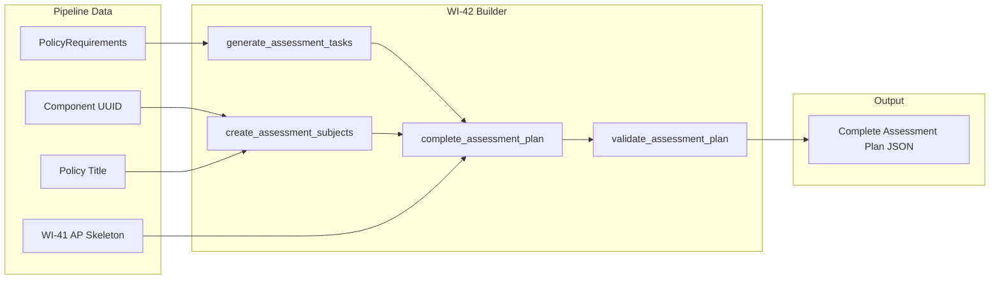
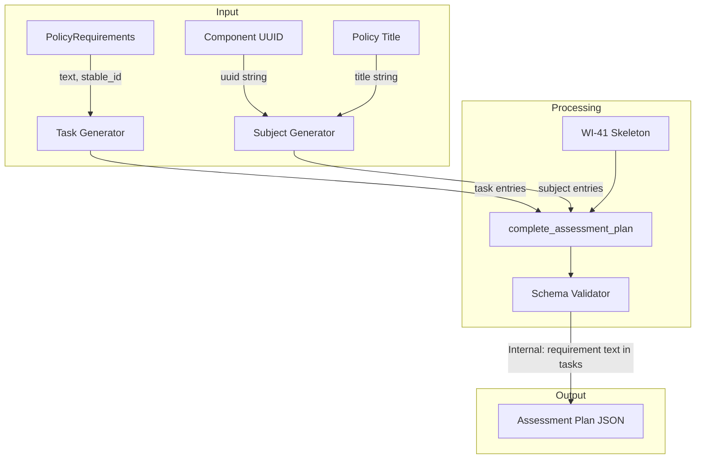
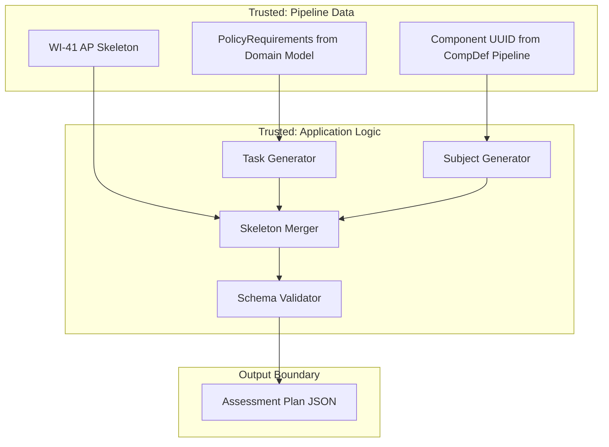

# 042-sec-assessment-plan-subjects

> **Document Type:** Security Review (Lightweight)
> **Audience:** LLM agents, human reviewers
> **Status:** Draft
> **Last Updated:** 2026-02-11 <!-- @auto -->
> **Reviewer:** Brian Luby <!-- @human-required -->
> **Risk Level:** Low <!-- @human-required -->

---

## Review Tier Legend

| Marker | Tier | Speckit Behavior |
|--------|------|------------------|
| 🔴 `@human-required` | Human Generated | Prompt human to author; blocks until complete |
| 🟡 `@human-review` | LLM + Human Review | LLM drafts → prompt human to confirm/edit; blocks until confirmed |
| 🟢 `@llm-autonomous` | LLM Autonomous | LLM completes; no prompt; logged for audit |
| ⚪ `@auto` | Auto-generated | System fills (timestamps, links); no prompt |

---

## Severity Definitions

| Level | Label | Definition |
|-------|-------|------------|
| 🔴 | **Critical** | Immediate exploitation risk; data breach or system compromise likely |
| 🟠 | **High** | Significant risk; exploitation possible with moderate effort |
| 🟡 | **Medium** | Notable risk; exploitation requires specific conditions |
| 🟢 | **Low** | Minor risk; limited impact or unlikely exploitation |

---

## Linkage ⚪ `@auto`

| Document | ID | Relationship |
|----------|-----|--------------|
| Parent PRD | [042-prd-assessment-plan-subjects.md](../PRD/042-prd-assessment-plan-subjects.md) | Feature being reviewed |
| Architecture Review | [042-ar-assessment-plan-subjects.md](../AR/042-ar-assessment-plan-subjects.md) | Technical implementation |

---

## Purpose

This is a **lightweight security review** intended to catch obvious security concerns early in the product lifecycle. It is NOT a comprehensive threat model. Full threat modeling should occur during implementation when infrastructure-as-code and concrete implementations exist.

**This review answers three questions:**
1. What does this feature expose to attackers?
2. What data does it touch, and how sensitive is that data?
3. What's the impact if something goes wrong?

**Scope of this review:**
- Attack surface identification
- Data classification
- High-level CIA assessment
- ~~Detailed threat enumeration (deferred to implementation)~~
- ~~Penetration testing (deferred to implementation)~~
- ~~Compliance audit (separate process)~~

---

## Feature Security Summary

### One-line Summary 🔴 `@human-required`
> WI-42 extends the WI-41 Assessment Plan skeleton by generating assessment tasks from PolicyRequirements and assessment-subjects from documentary component metadata -- a pure in-memory data transformation that includes policy requirement text in task descriptions, which could carry through sensitive or malicious content from source documents.

### Risk Assessment 🔴 `@human-required`
> **Risk Level:** Low
> **Justification:** Pure function builder pattern extending WI-41 with no new file I/O, no network exposure, no new parsing of untrusted input. Policy requirement text is included in task descriptions, inheriting the same content passthrough considerations as WI-39 but at lower risk because the text is already processed through the pipeline's domain model.

---

## Attack Surface Analysis

### Exposure Points 🟡 `@human-review`

| Exposure Type | Details | Authentication | Authorization | Notes |
|---------------|---------|----------------|---------------|-------|
| User Input Field | PolicyRequirement text (from domain model, originally from source document) | -- | -- | Text is included in task descriptions; already parsed through pipeline |
| User Input Field | Documentary component UUID (from Component Definition pipeline) | -- | -- | Internal pipeline data; UUID string passthrough |
| User Input Field | Policy title (from domain model) | -- | -- | Included in assessment-subject description |
| **None** | **No network, API, or service exposure** | -- | -- | Local CLI tool; pure in-memory JSON assembly |

### Attack Surface Diagram 🟢 `@llm-autonomous`

### Exposure Checklist 🟢 `@llm-autonomous`

- [x] **Internet-facing endpoints require authentication** — N/A: no internet-facing endpoints
- [x] **No sensitive data in URL parameters** — N/A: no URLs
- [x] **File uploads validated** — N/A: no file uploads; no new file reading
- [x] **Rate limiting configured** — N/A: local CLI tool
- [x] **CORS policy is restrictive** — N/A: no web service
- [x] **No debug/admin endpoints exposed** — N/A: no endpoints
- [x] **Webhooks validate signatures** — N/A: no webhooks

---

## Data Flow Analysis

### Data Inventory 🟡 `@human-review`

| Data Element | PRD Entity | Classification | Source | Destination | Retention | Encrypted Rest | Encrypted Transit | Residency |
|--------------|------------|----------------|--------|-------------|-----------|----------------|-------------------|-----------|
| Task UUIDs | Task.uuid | Public | UUID v5 generation (WI-7) | Assessment Plan JSON | Persistent (output file) | N/A | N/A | Local |
| Task descriptions | Task.description | Internal | PolicyRequirement.text | Assessment Plan JSON | Persistent (output file) | N/A | N/A | Local |
| Task titles | Task.title | Internal | Derived from PolicyRequirement.text | Assessment Plan JSON | Persistent (output file) | N/A | N/A | Local |
| Assessment subject type | AssessmentSubject.type | Public | Static value ("component") | Assessment Plan JSON | Persistent (output file) | N/A | N/A | Local |
| Subject description | AssessmentSubject.description | Internal | Derived from policy title | Assessment Plan JSON | Persistent (output file) | N/A | N/A | Local |
| Component UUID reference | IncludeSubject.subject_uuid | Internal | Component Definition pipeline | Assessment Plan JSON | Persistent (output file) | N/A | N/A | Local |

### Data Classification Reference 🟢 `@llm-autonomous`

| Level | Label | Description | Examples | Handling Requirements |
|-------|-------|-------------|----------|----------------------|
| 1 | **Public** | No impact if disclosed | Task UUIDs, task type, subject type | No special handling |
| 2 | **Internal** | Minor impact if disclosed | Task descriptions (requirement text), subject descriptions, component UUIDs | Access controls, no public exposure |
| 3 | **Confidential** | Significant impact if disclosed | PII, user data, credentials | Encryption, audit logging, access controls |
| 4 | **Restricted** | Severe impact if disclosed | Payment data, health records, secrets | Encryption, strict access, compliance requirements |

### Data Flow Diagram 🟢 `@llm-autonomous`

### Data Handling Checklist 🟢 `@llm-autonomous`

- [x] **No Restricted data stored unless absolutely required** — No Restricted data involved
- [x] **Confidential data encrypted at rest** — N/A: no Confidential data
- [x] **All data encrypted in transit (TLS 1.2+)** — N/A: no network transit
- [x] **PII has defined retention policy** — N/A: no PII
- [x] **Logs do not contain Confidential/Restricted data** — Only task counts logged
- [x] **Secrets are not hardcoded** — N/A: no secrets
- [x] **Data minimization applied** — Task descriptions use requirement text directly; no additional data beyond what is needed for assessment guidance
- [x] **Data residency requirements documented** — N/A: local file system only

---

## Third-Party & Supply Chain 🟡 `@human-review`

### New External Services

| Service | Purpose | Data Shared | Communication | Approved? |
|---------|---------|-------------|---------------|-----------|
| None | No external services | -- | -- | N/A |

### New Libraries/Dependencies

| Library | Version | License | Purpose | Security Check |
|---------|---------|---------|---------|----------------|
| jsonschema (conditional) | 0.x | MIT | OSCAL AP schema validation (if available from WI-19) | Established Rust crate; fallback to structural checks if not available |

Note: The jsonschema crate may already be a project dependency from WI-19. If not available, WI-42 falls back to structural validation checks with no new dependency.

### Supply Chain Checklist

- [x] **All new services use encrypted communication** — N/A: no new services
- [x] **Service agreements/ToS reviewed** — N/A: no new services
- [x] **Dependencies have acceptable licenses** — jsonschema: MIT (if used)
- [x] **Dependencies are actively maintained** — jsonschema is actively maintained
- [x] **No known critical vulnerabilities** — No known CVEs

---

## CIA Impact Assessment

If this feature is compromised, what's the impact?

### Confidentiality 🟡 `@human-review`

> **What could be disclosed?**

| Asset at Risk | Classification | Exposure Scenario | Impact | Likelihood |
|---------------|----------------|-------------------|--------|------------|
| Policy requirement text in task descriptions | Internal | Assessment Plan JSON shared inappropriately reveals detailed security requirements and operational controls | Low | Low |
| Component UUID | Internal | Assessment Plan reveals the documentary component UUID, which could be used to correlate with Component Definition output | Low | Low |

**Confidentiality Risk Level:** Low

### Integrity 🟡 `@human-review`

> **What could be modified or corrupted?**

| Asset at Risk | Modification Scenario | Impact | Likelihood |
|---------------|----------------------|--------|------------|
| Task completeness | Bug in 1:1 mapping causes some PolicyRequirements to be omitted, leading to incomplete assessment task coverage | Medium | Low |
| Task description accuracy | Requirement text is used verbatim with assessment framing; if text contains malicious content (e.g., embedded instructions), this is carried through to the task description | Low | Low |
| Schema validation result | Validation passes on structurally invalid AP, giving false confidence | Low | Low |

**Integrity Risk Level:** Low

### Availability 🟡 `@human-review`

> **What could be disrupted?**

| Service/Function | Disruption Scenario | Impact | Likelihood |
|------------------|---------------------|--------|------------|
| AP generation | Policy with thousands of requirements produces thousands of tasks, creating a very large JSON output | Low | Low |

**Availability Risk Level:** Low

### CIA Summary 🟢 `@llm-autonomous`

| Dimension | Risk Level | Primary Concern | Mitigation Priority |
|-----------|------------|-----------------|---------------------|
| **Confidentiality** | Low | Requirement text in task descriptions | Low |
| **Integrity** | Low | Task mapping completeness; content passthrough | Medium |
| **Availability** | Low | Large requirement sets producing large output | Low |

**Overall CIA Risk:** Low — *Pure function builder extending WI-41 with no network exposure; primary concern is data integrity of the 1:1 requirement-to-task mapping and passthrough of requirement text into task descriptions.*

---

## Trust Boundaries 🟡 `@human-review`

Note: All inputs to WI-42 come from trusted pipeline data (already parsed and validated by upstream stages). There is no direct untrusted user input at this stage -- the `--import-ssp` flag was processed in WI-41, and PolicyRequirements were parsed from the source document in earlier pipeline stages.

### Trust Boundary Checklist 🟢 `@llm-autonomous`

- [x] **All input from untrusted sources is validated** — All inputs come from trusted pipeline output; original source document was parsed in upstream stages
- [x] **External API responses are validated** — N/A: no external APIs
- [x] **Authorization checked at data access, not just entry point** — N/A: local CLI, no authorization model
- [x] **Service-to-service calls are authenticated** — N/A: no service calls

---

## Known Risks & Mitigations 🟡 `@human-review`

| ID | Risk Description | Severity | Mitigation | Status | Owner |
|----|------------------|----------|------------|--------|-------|
| R1 | Incomplete task mapping: if the 1:1 mapping from PolicyRequirement to task drops any requirements, assessment coverage is incomplete | Low | Unit tests verify that task count equals requirement count; AR-042 specifies iterator-based mapping | Mitigated | Brian Luby |
| R2 | Content passthrough in task descriptions: policy requirement text is included verbatim in task descriptions; if source text contains malicious content, it is carried through | Low | Text has already been parsed through the pipeline domain model (string content only, no executable code); downstream AP consumers are responsible for their own input handling | Mitigated | Brian Luby |

### Risk Acceptance 🔴 `@human-required`

No risks require acceptance. All identified risks are mitigated through design decisions documented in the AR.

---

## Security Requirements 🟡 `@human-review`

### Authentication & Authorization

| Req ID | Requirement | PRD AC | Verification Method |
|--------|-------------|--------|---------------------|
| — | N/A: Local CLI tool, no authentication or authorization | — | — |

### Data Protection

| Req ID | Requirement | PRD AC | Verification Method |
|--------|-------------|--------|---------------------|
| SEC-1 | Assessment Plan output should be treated as Internal (contains policy requirement text in task descriptions) | — | Documentation review |

### Input Validation

| Req ID | Requirement | PRD AC | Verification Method |
|--------|-------------|--------|---------------------|
| SEC-2 | Empty requirement text must produce a placeholder task description, not a panic or empty field | EC-2 | Unit test |
| SEC-3 | Missing documentary component UUID must be handled gracefully (generic subject without include-subjects) | EC-3 | Unit test |

### Operational Security

| Req ID | Requirement | PRD AC | Verification Method |
|--------|-------------|--------|---------------------|
| SEC-4 | All task UUIDs must be deterministic (v5) with requirement stable_id as seed, not random (v4) | AC-6 | Unit test |
| SEC-5 | The completed Assessment Plan must pass OSCAL AP schema validation | AC-5 | Integration test |
| SEC-6 | complete_assessment_plan must not modify the WI-41 skeleton's reviewed-controls or import-ssp (additive merge only) | — | Unit test |

---

## Compliance Considerations 🟡 `@human-review`

| Regulation | Applicable? | Relevant Requirements | N/A Justification |
|------------|-------------|----------------------|-------------------|
| GDPR | N/A | — | Local CLI tool; no PII collection, processing, or storage; no network communication |
| CCPA | N/A | — | Local CLI tool; no personal information handling |
| SOC 2 | N/A | — | Not a service; local development tool |
| HIPAA | N/A | — | No health data processing |
| PCI-DSS | N/A | — | No payment data processing |
| Other | N/A | — | FORGE is a local CLI tool with no network, auth, database, or PII |

---

## Review Findings

### Issues Identified 🟡 `@human-review`

| ID | Finding | Severity | Category | Recommendation | Status |
|----|---------|----------|----------|----------------|--------|
| — | No security issues identified | — | — | — | — |

### Positive Observations 🟢 `@llm-autonomous`

- All inputs come from trusted pipeline data (PolicyRequirements parsed upstream, Component UUID from CompDef pipeline, WI-41 skeleton from AP builder) -- no direct untrusted user input at this stage
- The 1:1 mapping from requirements to tasks is deterministic and testable, avoiding heuristic classification that could introduce non-determinism
- Task descriptions use original requirement text rather than AI-generated summaries, ensuring content integrity and traceability
- Schema validation catches structural issues before output, preventing delivery of invalid OSCAL artifacts
- The additive merge pattern (WI-42 extends WI-41 without modifying it) maintains separation of concerns and reduces the risk of regression in the skeleton structure
- UUID v5 generation from requirement stable_id ensures unique, deterministic task identifiers

---

## Open Questions 🟡 `@human-review`

No open security questions for this work item.

---

## Changelog ⚪ `@auto`

| Version | Date | Author | Changes |
|---------|------|--------|---------|
| 0.1 | 2026-02-11 | LLM (Claude) | Initial review |

---

## Review Sign-off 🔴 `@human-required`

| Role | Name | Date | Decision |
|------|------|------|----------|
| Security Reviewer | Brian Luby | YYYY-MM-DD | [Approved / Approved with conditions / Rejected] |
| Feature Owner | Brian Luby | YYYY-MM-DD | [Acknowledged] |

### Conditions for Approval (if applicable) 🔴 `@human-required`

No conditions. Low-risk feature with no identified security issues.

---

## Security Requirements Traceability 🟢 `@llm-autonomous`

| SEC Req ID | PRD Req ID | PRD AC ID | Test Type | Test Location |
|------------|------------|-----------|-----------|---------------|
| SEC-1 | — | — | Manual | Documentation review |
| SEC-2 | M-5 | EC-2 | Unit | tests/assessment_tasks_test.rs |
| SEC-3 | M-6 | EC-3 | Unit | tests/assessment_subjects_test.rs |
| SEC-4 | M-2 | AC-6 | Unit | tests/assessment_tasks_test.rs |
| SEC-5 | M-8 | AC-5 | Integration | tests/assessment_plan_validation_test.rs |
| SEC-6 | — | — | Unit | tests/assessment_plan_merge_test.rs |

---

## Review Checklist 🟢 `@llm-autonomous`

Before marking as Approved:
- [x] Attack surface documented with auth/authz status for each exposure
- [x] Exposure Points table has no contradictory rows (None vs. actual endpoints)
- [x] All PRD Data Model entities appear in Data Inventory
- [x] All data elements are classified using the 4-tier model
- [x] Third-party dependencies and services are listed
- [x] CIA impact is assessed with Low/Medium/High ratings
- [x] Trust boundaries are identified
- [x] Security requirements have verification methods specified
- [x] Security requirements trace to PRD ACs where applicable
- [x] No Critical/High findings remain Open
- [x] Compliance N/A items have justification
- [x] Risk acceptance has named approver and review date
