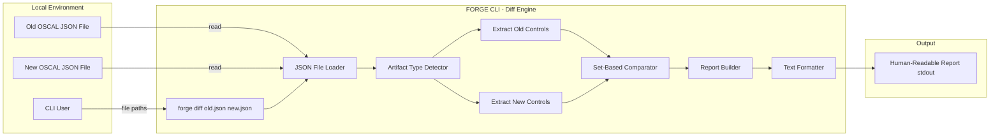
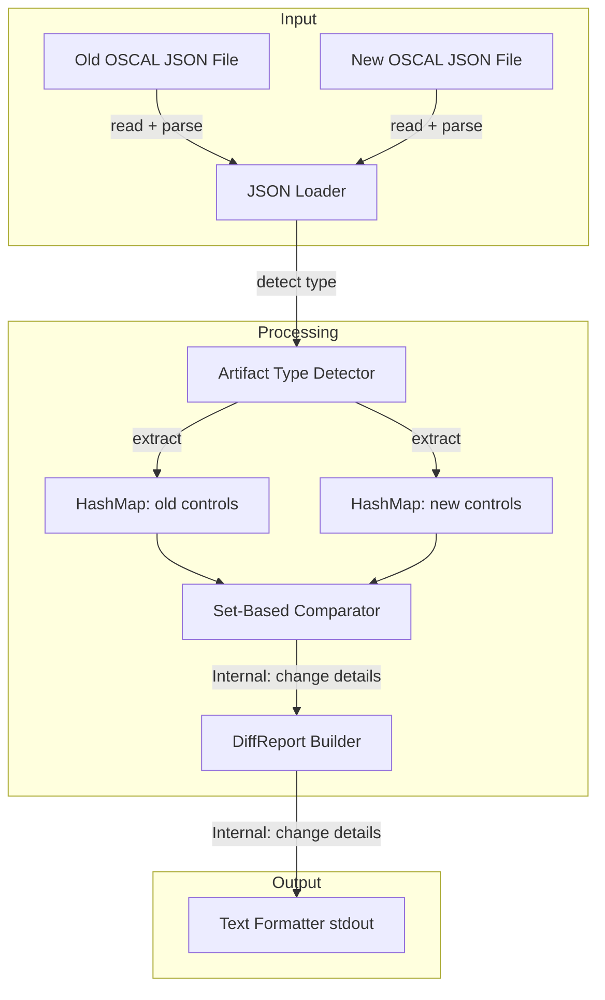
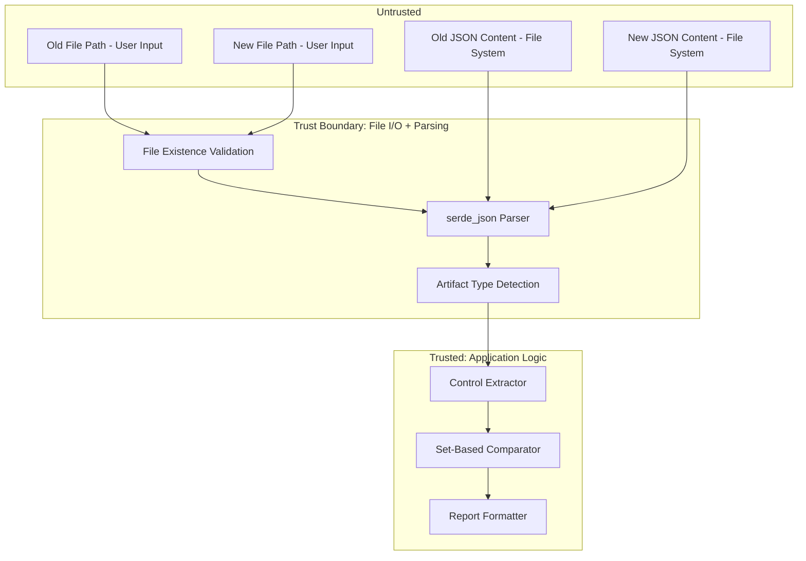

# 043-sec-diff-report

> **Document Type:** Security Review (Lightweight)
> **Audience:** LLM agents, human reviewers
> **Status:** Draft
> **Last Updated:** 2026-02-11 <!-- @auto -->
> **Reviewer:** Brian Luby <!-- @human-required -->
> **Risk Level:** Low-Medium <!-- @human-required -->

---

## Review Tier Legend

| Marker | Tier | Speckit Behavior |
|--------|------|------------------|
| 🔴 `@human-required` | Human Generated | Prompt human to author; blocks until complete |
| 🟡 `@human-review` | LLM + Human Review | LLM drafts → prompt human to confirm/edit; blocks until confirmed |
| 🟢 `@llm-autonomous` | LLM Autonomous | LLM completes; no prompt; logged for audit |
| ⚪ `@auto` | Auto-generated | System fills (timestamps, links); no prompt |

---

## Severity Definitions

| Level | Label | Definition |
|-------|-------|------------|
| 🔴 | **Critical** | Immediate exploitation risk; data breach or system compromise likely |
| 🟠 | **High** | Significant risk; exploitation possible with moderate effort |
| 🟡 | **Medium** | Notable risk; exploitation requires specific conditions |
| 🟢 | **Low** | Minor risk; limited impact or unlikely exploitation |

---

## Linkage ⚪ `@auto`

| Document | ID | Relationship |
|----------|-----|--------------|
| Parent PRD | [043-prd-diff-report.md](../PRD/043-prd-diff-report.md) | Feature being reviewed |
| Architecture Review | [043-ar-diff-report.md](../AR/043-ar-diff-report.md) | Technical implementation |

---

## Purpose

This is a **lightweight security review** intended to catch obvious security concerns early in the product lifecycle. It is NOT a comprehensive threat model. Full threat modeling should occur during implementation when infrastructure-as-code and concrete implementations exist.

**This review answers three questions:**
1. What does this feature expose to attackers?
2. What data does it touch, and how sensitive is that data?
3. What's the impact if something goes wrong?

**Scope of this review:**
- Attack surface identification
- Data classification
- High-level CIA assessment
- ~~Detailed threat enumeration (deferred to implementation)~~
- ~~Penetration testing (deferred to implementation)~~
- ~~Compliance audit (separate process)~~

---

## Feature Security Summary

### One-line Summary 🔴 `@human-required`
> WI-43 introduces a `forge diff` subcommand that reads two OSCAL JSON files, extracts controls into HashMaps, performs set-based comparison, and outputs a human-readable diff report to stdout -- the primary risks are memory consumption from loading two large JSON files simultaneously and information disclosure through the diff report revealing policy changes.

### Risk Assessment 🔴 `@human-required`
> **Risk Level:** Low-Medium
> **Justification:** The diff engine reads two JSON files into memory simultaneously, which doubles the memory footprint compared to single-file operations. The report output reveals what changed between policy versions, which could be sensitive. No network exposure, no file writing (output to stdout only), and read-only file access limit the attack surface.

---

## Attack Surface Analysis

### Exposure Points 🟡 `@human-review`

| Exposure Type | Details | Authentication | Authorization | Notes |
|---------------|---------|----------------|---------------|-------|
| User Input Field | Old OSCAL file path (positional arg) | -- | -- | File path validated for existence; file content parsed as JSON |
| User Input Field | New OSCAL file path (positional arg) | -- | -- | File path validated for existence; file content parsed as JSON |
| User Input Field | `--summary-only` flag (Could Have C-2 — **deferred, not in MVP scope**) | -- | -- | Boolean flag; no injection risk; attack surface entry retained for when C-2 is implemented |
| **None** | **No network, API, or service exposure** | -- | -- | Local CLI tool; read-only operation |

### Attack Surface Diagram 🟢 `@llm-autonomous`

### Exposure Checklist 🟢 `@llm-autonomous`

- [x] **Internet-facing endpoints require authentication** — N/A: no internet-facing endpoints
- [x] **No sensitive data in URL parameters** — N/A: no URLs
- [x] **File uploads validated** — N/A: no uploads; local file reads only; files validated for existence and valid JSON
- [x] **Rate limiting configured** — N/A: local CLI tool
- [x] **CORS policy is restrictive** — N/A: no web service
- [x] **No debug/admin endpoints exposed** — N/A: no endpoints
- [x] **Webhooks validate signatures** — N/A: no webhooks

---

## Data Flow Analysis

### Data Inventory 🟡 `@human-review`

| Data Element | PRD Entity | Classification | Source | Destination | Retention | Encrypted Rest | Encrypted Transit | Residency |
|--------------|------------|----------------|--------|-------------|-----------|----------------|-------------------|-----------|
| Old OSCAL JSON content | — | Internal | Old JSON file (local) | In-memory HashMap | None (ephemeral) | N/A | N/A | Local |
| New OSCAL JSON content | — | Internal | New JSON file (local) | In-memory HashMap | None (ephemeral) | N/A | N/A | Local |
| Control snapshots (old) | ControlSnapshot | Internal | Extracted from old JSON | In-memory comparison | None (ephemeral) | N/A | N/A | Local |
| Control snapshots (new) | ControlSnapshot | Internal | Extracted from new JSON | In-memory comparison | None (ephemeral) | N/A | N/A | Local |
| Diff entries | DiffEntry (Added/Removed/Changed/UuidChanged) | Internal | Computed comparison | Report output (stdout) | None (ephemeral) | N/A | N/A | Local |
| Diff summary | DiffSummary | Public | Computed aggregation | Report output (stdout) | None (ephemeral) | N/A | N/A | Local |
| File paths | DiffReport.old_file, .new_file | Internal | CLI arguments | Report output (stdout) | None (ephemeral) | N/A | N/A | Local |

### Data Classification Reference 🟢 `@llm-autonomous`

| Level | Label | Description | Examples | Handling Requirements |
|-------|-------|-------------|----------|----------------------|
| 1 | **Public** | No impact if disclosed | Diff summary counts, artifact type | No special handling |
| 2 | **Internal** | Minor impact if disclosed | Control-ids, titles, descriptions, UUIDs, file paths, change details | Access controls, no public exposure |
| 3 | **Confidential** | Significant impact if disclosed | PII, user data, credentials | Encryption, audit logging, access controls |
| 4 | **Restricted** | Severe impact if disclosed | Payment data, health records, secrets | Encryption, strict access, compliance requirements |

### Data Flow Diagram 🟢 `@llm-autonomous`

### Data Handling Checklist 🟢 `@llm-autonomous`

- [x] **No Restricted data stored unless absolutely required** — No Restricted data involved
- [x] **Confidential data encrypted at rest** — N/A: no Confidential data; no persistent storage
- [x] **All data encrypted in transit (TLS 1.2+)** — N/A: no network transit
- [x] **PII has defined retention policy** — N/A: no PII
- [x] **Logs do not contain Confidential/Restricted data** — Only file paths and control counts logged
- [x] **Secrets are not hardcoded** — N/A: no secrets
- [x] **Data minimization applied** — Only diffable fields extracted from controls (title, description, parts prose, UUID); full JSON not retained
- [x] **Data residency requirements documented** — N/A: local file system only; all data in memory is ephemeral

---

## Third-Party & Supply Chain 🟡 `@human-review`

### New External Services

| Service | Purpose | Data Shared | Communication | Approved? |
|---------|---------|-------------|---------------|-----------|
| None | No external services | -- | -- | N/A |

### New Libraries/Dependencies

| Library | Version | License | Purpose | Security Check |
|---------|---------|---------|---------|----------------|
| None | — | — | No new dependencies; uses serde_json (existing) and std::collections::HashMap | N/A |

No new dependencies are introduced by WI-43. The diff engine uses serde_json for JSON parsing (existing dependency) and HashMap from the standard library for control-id matching.

### Supply Chain Checklist

- [x] **All new services use encrypted communication** — N/A: no new services
- [x] **Service agreements/ToS reviewed** — N/A: no new services
- [x] **Dependencies have acceptable licenses** — No new dependencies
- [x] **Dependencies are actively maintained** — Existing dependencies only
- [x] **No known critical vulnerabilities** — No new dependencies

---

## CIA Impact Assessment

If this feature is compromised, what's the impact?

### Confidentiality 🟡 `@human-review`

> **What could be disclosed?**

| Asset at Risk | Classification | Exposure Scenario | Impact | Likelihood |
|---------------|----------------|-------------------|--------|------------|
| Diff report reveals policy changes | Internal | Diff report output (stdout or piped to file) reveals what controls were added, removed, or changed between policy versions, exposing the organization's security posture evolution | Low-Medium | Low |
| Control titles and descriptions | Internal | Report includes old and new values for changed fields, revealing policy content | Low | Low |
| UUID stability changes | Internal | Report explicitly flags UUID changes, which reveals implementation details of the OSCAL generation process | Low | Low |
| File system paths | Internal | Report header includes old and new file paths | Low | Low |

**Confidentiality Risk Level:** Low-Medium

### Integrity 🟡 `@human-review`

> **What could be modified or corrupted?**

| Asset at Risk | Modification Scenario | Impact | Likelihood |
|---------------|----------------------|--------|------------|
| Diff accuracy | Bug in control extraction or comparison produces incorrect diff results (missed changes, false additions/removals) | Medium | Low |
| Diff accuracy | Artifact type misdetection (catalog vs. component-definition) causes incorrect field extraction | Medium | Low |
| Report output | Read-only operation; no files are modified; no integrity risk to the input files | N/A | N/A |

**Integrity Risk Level:** Low

### Availability 🟡 `@human-review`

> **What could be disrupted?**

| Service/Function | Disruption Scenario | Impact | Likelihood |
|------------------|---------------------|--------|------------|
| Diff process | Two very large OSCAL JSON files loaded simultaneously into memory; combined memory usage could exceed available RAM | Medium | Low |
| Diff process | OSCAL artifact with thousands of controls produces very large HashMap and very long diff report | Low | Low |
| Diff process | Malformed JSON input causes parse error; handled gracefully by serde_json | Low | Low |

**Availability Risk Level:** Low-Medium

### CIA Summary 🟢 `@llm-autonomous`

| Dimension | Risk Level | Primary Concern | Mitigation Priority |
|-----------|------------|-----------------|---------------------|
| **Confidentiality** | Low-Medium | Diff report reveals policy change details | Low |
| **Integrity** | Low | Diff accuracy depends on correct extraction and comparison | Medium |
| **Availability** | Low-Medium | Two large JSON files loaded simultaneously | Medium |

**Overall CIA Risk:** Low-Medium — *Read-only file comparison with no network exposure; primary concerns are memory consumption from loading two files simultaneously and information disclosure through the diff report revealing policy evolution.*

---

## Trust Boundaries 🟡 `@human-review`

### Trust Boundary Checklist 🟢 `@llm-autonomous`

- [x] **All input from untrusted sources is validated** — File paths validated for existence; JSON parsed by serde_json (rejects malformed JSON); artifact type validated by root key check; both files validated as same artifact type
- [x] **External API responses are validated** — N/A: no external APIs
- [x] **Authorization checked at data access, not just entry point** — N/A: local CLI, no authorization model
- [x] **Service-to-service calls are authenticated** — N/A: no service calls

---

## Known Risks & Mitigations 🟡 `@human-review`

| ID | Risk Description | Severity | Mitigation | Status | Owner |
|----|------------------|----------|------------|--------|-------|
| R1 | Memory consumption: loading two large OSCAL JSON files simultaneously into memory doubles the memory footprint; very large files (hundreds of MB) could exhaust available RAM | Low-Medium | OSCAL artifacts from FORGE are typically small (KB-low MB); standard serde_json parsing provides reasonable limits; for extreme cases, users can increase system memory or split files | Open | Brian Luby |
| R2 | Information disclosure: the diff report reveals detailed policy changes (added controls, removed controls, changed descriptions, UUID changes) which could be sensitive in regulated environments | Low | Diff output goes to stdout; users control where stdout is directed; document that diff reports should be treated with the same sensitivity as the source OSCAL artifacts | Open | Brian Luby |
| R3 | Incorrect diff results: bugs in control extraction or comparison logic could produce misleading reports (false positives or negatives), leading to incorrect compliance conclusions | Low | Unit tests cover all diff categories (added, removed, changed, UUID changed, unchanged); edge cases (empty artifacts, single control) explicitly tested per AR-043 testing strategy | Mitigated | Brian Luby |
| R4 | Non-OSCAL JSON input: user provides valid JSON that is not an OSCAL artifact, causing unexpected behavior in the extraction logic | Low | AR-043 specifies artifact type detection by root key ("catalog" or "component-definition"); non-OSCAL JSON returns a descriptive ForgeError | Mitigated | Brian Luby |

### Risk Acceptance 🔴 `@human-required`

| Risk ID | Accepted By | Date | Justification | Review Date |
|---------|-------------|------|---------------|-------------|
| R1 | Brian Luby | 2026-02-11 | FORGE-generated OSCAL artifacts are small (KB-low MB); loading two simultaneously is well within typical system RAM; no external user-provided arbitrary JSON expected in normal usage | 2026-08-11 |
| R2 | Brian Luby | 2026-02-11 | Diff output to stdout is standard CLI behavior; users control stdout destination; local CLI tool with no network exposure | 2026-08-11 |

---

## Security Requirements 🟡 `@human-review`

### Authentication & Authorization

| Req ID | Requirement | PRD AC | Verification Method |
|--------|-------------|--------|---------------------|
| — | N/A: Local CLI tool, no authentication or authorization | — | — |

### Data Protection

| Req ID | Requirement | PRD AC | Verification Method |
|--------|-------------|--------|---------------------|
| SEC-1 | Diff report output should be treated with the same sensitivity as the input OSCAL artifacts | — | Documentation review |

### Input Validation

| Req ID | Requirement | PRD AC | Verification Method |
|--------|-------------|--------|---------------------|
| SEC-2 | Both input files must be validated as existing and readable before processing | AC-7 | Unit test |
| SEC-3 | Input files must be validated as valid JSON; malformed JSON must produce a descriptive error, not a panic | AC-7 | Unit test |
| SEC-4 | Input files must be validated as OSCAL artifacts (contain "catalog" or "component-definition" root key) | AC-7 | Unit test |
| SEC-5 | Both input files must be the same artifact type; mismatched types must produce a descriptive error | AC-7 | Unit test |

### Operational Security

| Req ID | Requirement | PRD AC | Verification Method |
|--------|-------------|--------|---------------------|
| SEC-6 | All error conditions must return descriptive ForgeError, not panic | AC-7 | Unit test |
| SEC-7 | Diff report must sort output by control-id for deterministic, reproducible results | — | Unit test |

---

## Compliance Considerations 🟡 `@human-review`

| Regulation | Applicable? | Relevant Requirements | N/A Justification |
|------------|-------------|----------------------|-------------------|
| GDPR | N/A | — | Local CLI tool; no PII collection, processing, or storage; no network communication |
| CCPA | N/A | — | Local CLI tool; no personal information handling |
| SOC 2 | N/A | — | Not a service; local development tool |
| HIPAA | N/A | — | No health data processing |
| PCI-DSS | N/A | — | No payment data processing |
| Other | N/A | — | FORGE is a local CLI tool with no network, auth, database, or PII |

---

## Review Findings

### Issues Identified 🟡 `@human-review`

| ID | Finding | Severity | Category | Recommendation | Status |
|----|---------|----------|----------|----------------|--------|
| F1 | Two large JSON files loaded simultaneously into memory could exhaust RAM for very large artifacts. While FORGE-generated artifacts are typically small, the diff command accepts arbitrary file paths | Low | Availability | Consider adding a file size check and warning for files exceeding a threshold (e.g., 50 MB); not blocking for Phase 3 exploratory scope | Open |

### Positive Observations 🟢 `@llm-autonomous`

- Read-only operation: the diff engine never writes to the input files or creates output files, eliminating file integrity risks
- No new dependencies: the diff engine uses only serde_json (existing) and std::collections (stdlib), minimizing supply chain risk
- Artifact type validation prevents cross-type comparison (catalog vs. component-definition), which would produce meaningless results
- Control-id matching (not UUID matching) is the correct semantic key, since UUIDs change when content changes -- AR-043 explicitly prohibits UUID-based matching
- The HashMap-based set comparison is O(n) for extraction and O(n+m) for comparison, with predictable performance characteristics
- serde_json provides robust JSON parsing with clear error messages for malformed input, preventing undefined behavior
- Deterministic output ordering (sorted by control-id) ensures reproducible reports

---

## Open Questions 🟡 `@human-review`

- [ ] **Q1:** Should there be a file size limit or warning for diff input files to prevent excessive memory consumption, or is this unnecessary for a local CLI tool?

---

## Changelog ⚪ `@auto`

| Version | Date | Author | Changes |
|---------|------|--------|---------|
| 0.1 | 2026-02-11 | LLM (Claude) | Initial review |

---

## Review Sign-off 🔴 `@human-required`

| Role | Name | Date | Decision |
|------|------|------|----------|
| Security Reviewer | Brian Luby | YYYY-MM-DD | [Approved / Approved with conditions / Rejected] |
| Feature Owner | Brian Luby | YYYY-MM-DD | [Acknowledged] |

### Conditions for Approval (if applicable) 🔴 `@human-required`

- [ ] Verify all four input validation requirements (SEC-2 through SEC-5) are covered by unit tests

---

## Security Requirements Traceability 🟢 `@llm-autonomous`

| SEC Req ID | PRD Req ID | PRD AC ID | Test Type | Test Location |
|------------|------------|-----------|-----------|---------------|
| SEC-1 | — | — | Manual | Documentation review |
| SEC-2 | M-8 | AC-7 | Unit | tests/diff_test.rs |
| SEC-3 | M-8 | AC-7 | Unit | tests/diff_test.rs |
| SEC-4 | M-7 | AC-7 | Unit | tests/diff_test.rs |
| SEC-5 | M-7 | AC-7 | Unit | tests/diff_test.rs |
| SEC-6 | M-8 | AC-7 | Unit | tests/diff_test.rs |
| SEC-7 | — | — | Unit | tests/diff_format_test.rs |

---

## Review Checklist 🟢 `@llm-autonomous`

Before marking as Approved:
- [x] Attack surface documented with auth/authz status for each exposure
- [x] Exposure Points table has no contradictory rows (None vs. actual endpoints)
- [x] All PRD Data Model entities appear in Data Inventory
- [x] All data elements are classified using the 4-tier model
- [x] Third-party dependencies and services are listed
- [x] CIA impact is assessed with Low/Medium/High ratings
- [x] Trust boundaries are identified
- [x] Security requirements have verification methods specified
- [x] Security requirements trace to PRD ACs where applicable
- [x] No Critical/High findings remain Open
- [x] Compliance N/A items have justification
- [x] Risk acceptance has named approver and review date
