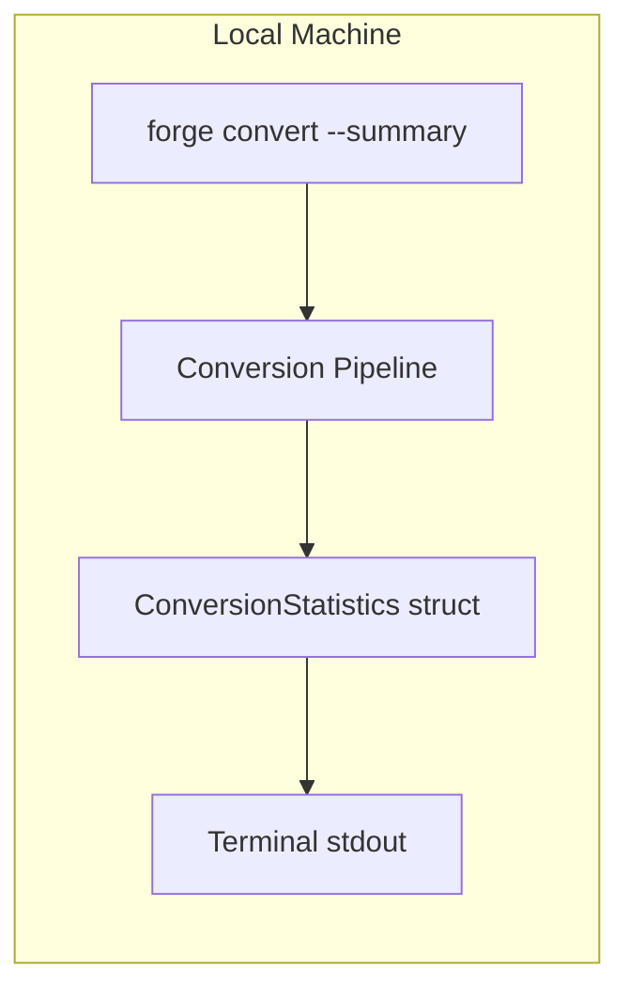
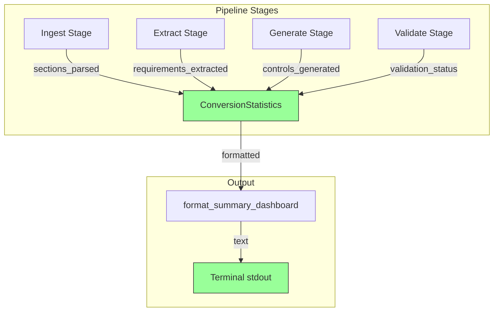
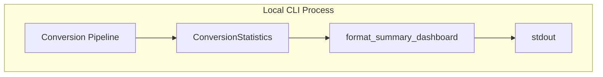

# 044-sec-summary-dashboard

> **Document Type:** Security Review (Lightweight)
> **Audience:** LLM agents, human reviewers
> **Status:** Draft
> **Last Updated:** 2026-02-11 <!-- @auto -->
> **Reviewer:** Brian Luby <!-- @human-required -->
> **Risk Level:** Low <!-- @human-required -->

---

## Review Tier Legend

| Marker | Tier | Speckit Behavior |
|--------|------|------------------|
| 🔴 `@human-required` | Human Generated | Prompt human to author; blocks until complete |
| 🟡 `@human-review` | LLM + Human Review | LLM drafts → prompt human to confirm/edit; blocks until confirmed |
| 🟢 `@llm-autonomous` | LLM Autonomous | LLM completes; no prompt; logged for audit |
| ⚪ `@auto` | Auto-generated | System fills (timestamps, links); no prompt |

---

## Severity Definitions

| Level | Label | Definition |
|-------|-------|------------|
| 🔴 | **Critical** | Immediate exploitation risk; data breach or system compromise likely |
| 🟠 | **High** | Significant risk; exploitation possible with moderate effort |
| 🟡 | **Medium** | Notable risk; exploitation requires specific conditions |
| 🟢 | **Low** | Minor risk; limited impact or unlikely exploitation |

---

## Linkage ⚪ `@auto`

| Document | ID | Relationship |
|----------|-----|--------------|
| Parent PRD | [044-prd-summary-dashboard.md](../PRD/044-prd-summary-dashboard.md) | Feature being reviewed |
| Architecture Review | [044-ar-summary-dashboard.md](../AR/044-ar-summary-dashboard.md) | Technical implementation |

---

## Purpose

This is a **lightweight security review** intended to catch obvious security concerns early in the product lifecycle. It is NOT a comprehensive threat model. Full threat modeling should occur during implementation when infrastructure-as-code and concrete implementations exist.

**This review answers three questions:**
1. What does this feature expose to attackers?
2. What data does it touch, and how sensitive is that data?
3. What's the impact if something goes wrong?

**Scope of this review:**
- ✅ Attack surface identification
- ✅ Data classification
- ✅ High-level CIA assessment
- ❌ Detailed threat enumeration (deferred to implementation)
- ❌ Penetration testing (deferred to implementation)
- ❌ Compliance audit (separate process)

---

## Feature Security Summary

### One-line Summary 🔴 `@human-required`
> The summary dashboard adds a `--summary` flag to `forge convert` that prints aggregate conversion statistics (section counts, requirement counts, control counts, validation status, mapping coverage) to stdout after conversion. No new input parsing, no network activity, no sensitive data in output.

### Risk Assessment 🔴 `@human-required`
> **Risk Level:** Low
> **Justification:** Read-only statistics collection and terminal text output of aggregate counts; no new input vectors, no network exposure, no sensitive data handling. This is a local CLI tool with no authentication, no database, and no PII.

---

## Attack Surface Analysis

### Exposure Points 🟡 `@human-review`

| Exposure Type | Details | Authentication | Authorization | Notes |
|---------------|---------|----------------|---------------|-------|
| **None** | **Feature has no external exposure** | — | — | Local CLI tool; statistics printed to stdout only |

### Attack Surface Diagram 🟢 `@llm-autonomous`

This feature operates entirely within the local machine. There are no external connections, no network boundaries, and no authentication layers. The data flow is: pipeline stages increment counters in a struct, and the struct is formatted and printed to stdout.

### Exposure Checklist 🟢 `@llm-autonomous`

All items are N/A for this feature -- FORGE is a local CLI tool with no internet-facing endpoints, no file uploads from untrusted sources (beyond the existing document ingestion pipeline), no rate limiting needs, no CORS, no debug endpoints, and no webhooks.

- [x] **Internet-facing endpoints require authentication** — N/A: no endpoints
- [x] **No sensitive data in URL parameters** — N/A: no URLs
- [x] **File uploads validated** — N/A: no new file inputs
- [x] **Rate limiting configured** — N/A: local CLI
- [x] **CORS policy is restrictive** — N/A: no web server
- [x] **No debug/admin endpoints exposed** — N/A: no endpoints
- [x] **Webhooks validate signatures** — N/A: no webhooks

---

## Data Flow Analysis

### Data Inventory 🟡 `@human-review`

| Data Element | PRD Entity | Classification | Source | Destination | Retention | Encrypted Rest | Encrypted Transit | Residency |
|--------------|------------|----------------|--------|-------------|-----------|----------------|-------------------|-----------|
| Sections parsed count | ConversionStatistics.sections_parsed | Public | Pipeline ingestion stage | stdout | None (transient) | N/A | N/A | Local |
| Requirements extracted count | ConversionStatistics.requirements_extracted | Public | Pipeline extraction stage | stdout | None (transient) | N/A | N/A | Local |
| Controls generated count | ConversionStatistics.controls_generated | Public | Pipeline generation stage | stdout | None (transient) | N/A | N/A | Local |
| Validation status | ConversionStatistics.validation_status | Public | Pipeline validation stage | stdout | None (transient) | N/A | N/A | Local |
| Mapping coverage percentage | Derived from above | Public | Calculation | stdout | None (transient) | N/A | N/A | Local |

### Data Classification Reference 🟢 `@llm-autonomous`

| Level | Label | Description | Examples | Handling Requirements |
|-------|-------|-------------|----------|----------------------|
| 1 | **Public** | No impact if disclosed | Marketing content, public docs | No special handling |
| 2 | **Internal** | Minor impact if disclosed | Internal configs, non-sensitive logs | Access controls, no public exposure |
| 3 | **Confidential** | Significant impact if disclosed | PII, user data, credentials | Encryption, audit logging, access controls |
| 4 | **Restricted** | Severe impact if disclosed | Payment data, health records, secrets | Encryption, strict access, compliance requirements |

All data elements in this feature are **Level 1 (Public)**. The summary dashboard displays only aggregate counts -- no policy content, no organizational identifiers, no sensitive data.

### Data Flow Diagram 🟢 `@llm-autonomous`

### Data Handling Checklist 🟢 `@llm-autonomous`

- [x] **No Restricted data stored unless absolutely required** — No restricted data involved
- [x] **Confidential data encrypted at rest** — N/A: no confidential data
- [x] **All data encrypted in transit (TLS 1.2+)** — N/A: no transit; local stdout only
- [x] **PII has defined retention policy** — N/A: no PII
- [x] **Logs do not contain Confidential/Restricted data** — Only aggregate counts logged
- [x] **Secrets are not hardcoded** — N/A: no secrets
- [x] **Data minimization applied** — Only aggregate counts collected; no policy content in statistics
- [x] **Data residency requirements documented** — N/A: local CLI tool

---

## Third-Party & Supply Chain 🟡 `@human-review`

### New External Services

| Service | Purpose | Data Shared | Communication | Approved? |
|---------|---------|-------------|---------------|-----------|
| None | No external services | — | — | N/A |

### New Libraries/Dependencies

| Library | Version | License | Purpose | Security Check |
|---------|---------|---------|---------|----------------|
| None | — | — | No new dependencies; uses existing std::fmt and box-drawing Unicode characters | N/A |

### Supply Chain Checklist

- [x] **All new services use encrypted communication** — N/A: no new services
- [x] **Service agreements/ToS reviewed** — N/A: no new services
- [x] **Dependencies have acceptable licenses** — N/A: no new dependencies
- [x] **Dependencies are actively maintained** — N/A: no new dependencies
- [x] **No known critical vulnerabilities** — N/A: no new dependencies

---

## CIA Impact Assessment

If this feature is compromised, what's the impact?

### Confidentiality 🟡 `@human-review`

> **What could be disclosed?**

| Asset at Risk | Classification | Exposure Scenario | Impact | Likelihood |
|---------------|----------------|-------------------|--------|------------|
| Aggregate conversion counts | Public | Statistics displayed on shared terminal | None | N/A |

**Confidentiality Risk Level:** Low

The summary dashboard displays only aggregate counts (integers and a percentage). No policy content, organizational names, or sensitive information appears in the output. Even if a terminal session is observed, the disclosed data is non-sensitive.

### Integrity 🟡 `@human-review`

> **What could be modified or corrupted?**

| Asset at Risk | Modification Scenario | Impact | Likelihood |
|---------------|----------------------|--------|------------|
| Statistics accuracy | Bug causes incorrect count (e.g., off-by-one) | Low — user gets wrong conversion quality signal | Low |
| Mapping coverage calculation | Division error or float precision issue | Low — misleading percentage | Very Low |

**Integrity Risk Level:** Low

Statistics integrity depends on correct instrumentation of pipeline stages. Incorrect counts would mislead users about conversion quality but would not affect the actual OSCAL artifact. The `--summary` flag has no effect on pipeline behavior per the architecture decision.

### Availability 🟡 `@human-review`

> **What could be disrupted?**

| Service/Function | Disruption Scenario | Impact | Likelihood |
|------------------|---------------------|--------|------------|
| Summary output | Formatting function panics | Low — conversion still succeeds; only summary is missing | Very Low |

**Availability Risk Level:** Low

The summary dashboard is purely additive output. If it fails, the conversion pipeline and artifact output are unaffected. The formatting function uses basic string operations that cannot realistically fail.

### CIA Summary 🟢 `@llm-autonomous`

| Dimension | Risk Level | Primary Concern | Mitigation Priority |
|-----------|------------|-----------------|---------------------|
| **Confidentiality** | Low | No sensitive data in output | Low |
| **Integrity** | Low | Statistics accuracy depends on correct instrumentation | Low |
| **Availability** | Low | Formatting failure would not affect conversion | Low |

**Overall CIA Risk:** Low — *Aggregate statistics output with no sensitive data, no external exposure, and no impact on core conversion functionality.*

---

## Trust Boundaries 🟡 `@human-review`

There are no trust boundaries crossed by this feature. All data flows within a single local process. The statistics are derived from internal pipeline state and output to the local terminal. No untrusted external input is processed by the summary dashboard -- it only reads internal pipeline counters.

### Trust Boundary Checklist 🟢 `@llm-autonomous`

- [x] **All input from untrusted sources is validated** — N/A: no external input to the dashboard; counters are internal
- [x] **External API responses are validated** — N/A: no external APIs
- [x] **Authorization checked at data access, not just entry point** — N/A: no authorization
- [x] **Service-to-service calls are authenticated** — N/A: single local process

---

## Known Risks & Mitigations 🟡 `@human-review`

| ID | Risk Description | Severity | Mitigation | Status | Owner |
|----|------------------|----------|------------|--------|-------|
| R1 | Statistics could be inaccurate due to instrumentation bugs, misleading user about conversion quality | Low | Unit tests with known-count fixtures verify all statistics; TDD mandatory | Mitigated | Brian Luby |

### Risk Acceptance 🔴 `@human-required`

No risks require formal acceptance. R1 is mitigated through testing.

---

## Security Requirements 🟡 `@human-review`

### Authentication & Authorization

| Req ID | Requirement | PRD AC | Verification Method |
|--------|-------------|--------|---------------------|
| — | N/A — local CLI tool with no authentication or authorization | — | — |

### Data Protection

| Req ID | Requirement | PRD AC | Verification Method |
|--------|-------------|--------|---------------------|
| SEC-1 | Summary dashboard must not include policy content (only aggregate counts) | AC-2 through AC-6 | Unit test: verify output contains only numbers and labels |

### Input Validation

| Req ID | Requirement | PRD AC | Verification Method |
|--------|-------------|--------|---------------------|
| SEC-2 | Mapping coverage calculation must handle zero-requirements case without division by zero | AC-6 | Unit test: verify 0/0 edge case returns 0.0% |

### Operational Security

| Req ID | Requirement | PRD AC | Verification Method |
|--------|-------------|--------|---------------------|
| SEC-3 | The `--summary` flag must not alter conversion pipeline behavior | AC-7 | Integration test: verify identical artifact output with and without `--summary` |

---

## Compliance Considerations 🟡 `@human-review`

| Regulation | Applicable? | Relevant Requirements | N/A Justification |
|------------|-------------|----------------------|-------------------|
| GDPR | N/A | — | No PII collected, processed, or stored. Local CLI tool with no network activity. |
| CCPA | N/A | — | No personal information. Local CLI tool. |
| SOC 2 | N/A | — | No cloud services, no data storage, no access controls needed. |
| HIPAA | N/A | — | No health information. Local CLI tool. |
| PCI-DSS | N/A | — | No payment data. Local CLI tool. |
| Other | N/A | — | FORGE is a local CLI tool with no network, no auth, no database, no PII. |

---

## Review Findings

### Issues Identified 🟡 `@human-review`

| ID | Finding | Severity | Category | Recommendation | Status |
|----|---------|----------|----------|----------------|--------|
| — | No security issues identified | — | — | — | — |

### Positive Observations 🟢 `@llm-autonomous`

- Summary dashboard outputs only aggregate counts, not policy content -- good data minimization
- The `--summary` flag is purely additive output with no side effects on the conversion pipeline
- No new dependencies introduced -- zero supply chain impact
- Statistics are transient (in-memory struct, printed to stdout) with no persistence -- no data-at-rest concerns

---

## Open Questions 🟡 `@human-review`

No open security questions for this work item.

---

## Changelog ⚪ `@auto`

| Version | Date | Author | Changes |
|---------|------|--------|---------|
| 0.1 | 2026-02-11 | LLM (Claude) | Initial review |

---

## Review Sign-off 🔴 `@human-required`

| Role | Name | Date | Decision |
|------|------|------|----------|
| Security Reviewer | Brian Luby | YYYY-MM-DD | [Approved / Approved with conditions / Rejected] |
| Feature Owner | Brian Luby | YYYY-MM-DD | [Acknowledged] |

### Conditions for Approval (if applicable) 🔴 `@human-required`

None -- no conditions required for this low-risk feature.

---

## Security Requirements Traceability 🟢 `@llm-autonomous`

| SEC Req ID | PRD Req ID | PRD AC ID | Test Type | Test Location |
|------------|------------|-----------|-----------|---------------|
| SEC-1 | M-2, M-3, M-4 | AC-2, AC-3, AC-4 | Unit | tests/summary_dashboard_test.rs |
| SEC-2 | M-6 | AC-6 | Unit | tests/summary_dashboard_test.rs |
| SEC-3 | M-7 | AC-7 | Integration | tests/cli_integration_test.rs |

---

## Review Checklist 🟢 `@llm-autonomous`

Before marking as Approved:
- [x] Attack surface documented with auth/authz status for each exposure
- [x] Exposure Points table has no contradictory rows (None vs. actual endpoints)
- [x] All PRD Data Model entities appear in Data Inventory
- [x] All data elements are classified using the 4-tier model
- [x] Third-party dependencies and services are listed
- [x] CIA impact is assessed with Low/Medium/High ratings
- [x] Trust boundaries are identified
- [x] Security requirements have verification methods specified
- [x] Security requirements trace to PRD ACs where applicable
- [x] No Critical/High findings remain Open
- [x] Compliance N/A items have justification
- [x] Risk acceptance has named approver and review date
