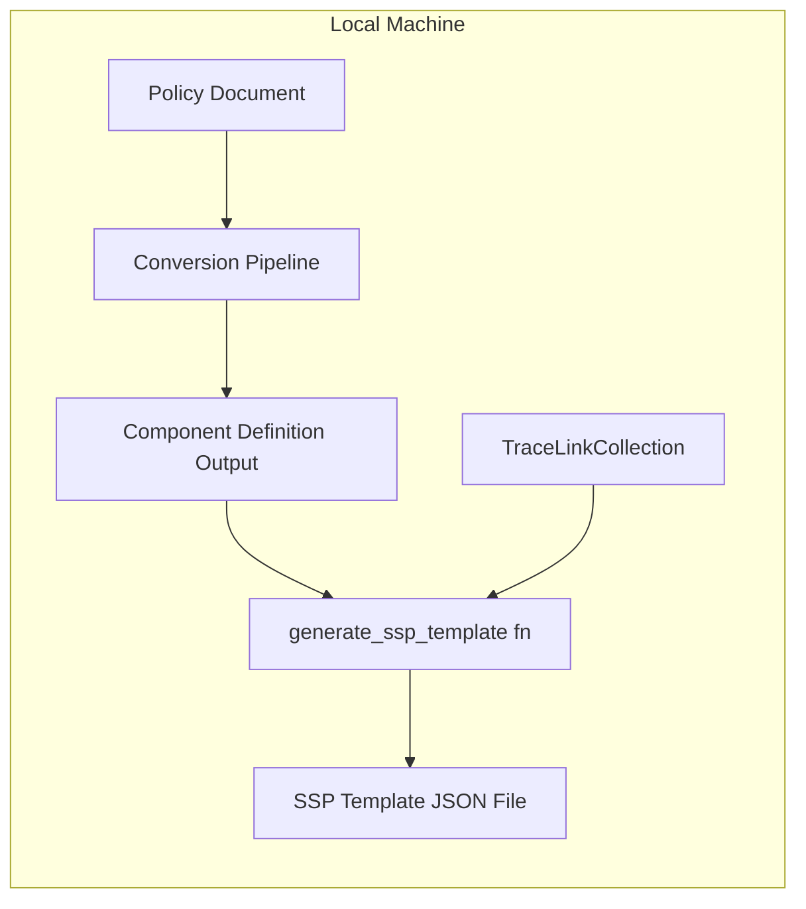
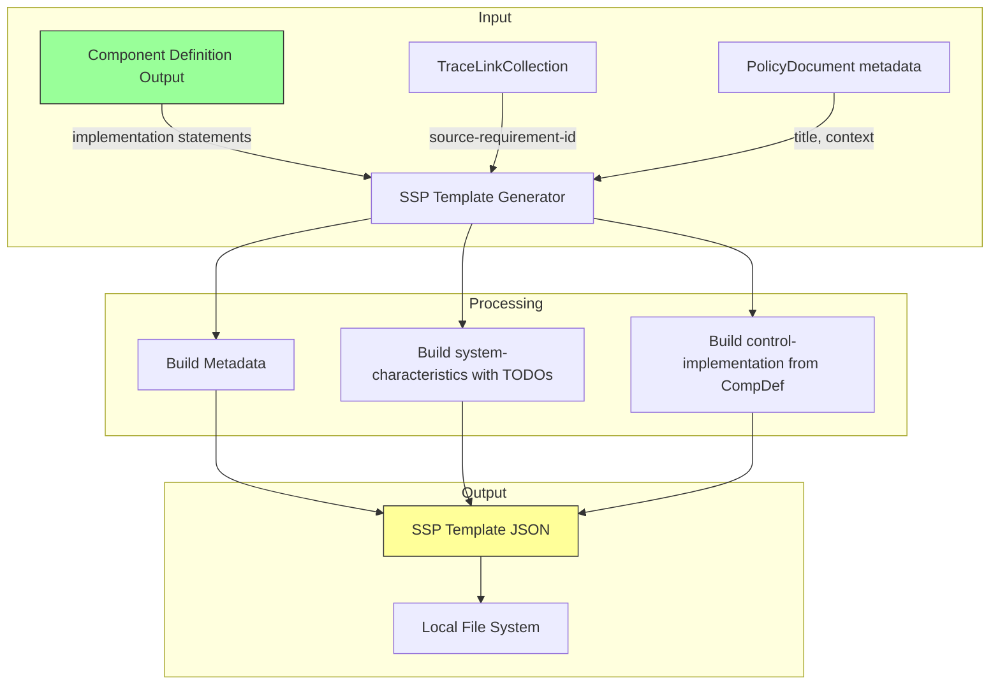
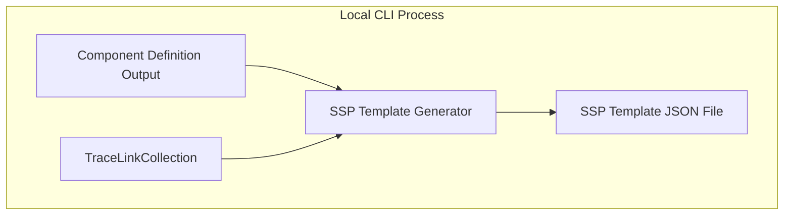

# 045-sec-ssp-template-structure

> **Document Type:** Security Review (Lightweight)
> **Audience:** LLM agents, human reviewers
> **Status:** Draft
> **Last Updated:** 2026-02-11 <!-- @auto -->
> **Reviewer:** Brian Luby <!-- @human-required -->
> **Risk Level:** Low <!-- @human-required -->

---

## Review Tier Legend

| Marker | Tier | Speckit Behavior |
|--------|------|------------------|
| 🔴 `@human-required` | Human Generated | Prompt human to author; blocks until complete |
| 🟡 `@human-review` | LLM + Human Review | LLM drafts → prompt human to confirm/edit; blocks until confirmed |
| 🟢 `@llm-autonomous` | LLM Autonomous | LLM completes; no prompt; logged for audit |
| ⚪ `@auto` | Auto-generated | System fills (timestamps, links); no prompt |

---

## Severity Definitions

| Level | Label | Definition |
|-------|-------|------------|
| 🔴 | **Critical** | Immediate exploitation risk; data breach or system compromise likely |
| 🟠 | **High** | Significant risk; exploitation possible with moderate effort |
| 🟡 | **Medium** | Notable risk; exploitation requires specific conditions |
| 🟢 | **Low** | Minor risk; limited impact or unlikely exploitation |

---

## Linkage ⚪ `@auto`

| Document | ID | Relationship |
|----------|-----|--------------|
| Parent PRD | [045-prd-ssp-template-structure.md](../PRD/045-prd-ssp-template-structure.md) | Feature being reviewed |
| Architecture Review | [045-ar-ssp-template-structure.md](../AR/045-ar-ssp-template-structure.md) | Technical implementation |

---

## Purpose

This is a **lightweight security review** intended to catch obvious security concerns early in the product lifecycle. It is NOT a comprehensive threat model. Full threat modeling should occur during implementation when infrastructure-as-code and concrete implementations exist.

**This review answers three questions:**
1. What does this feature expose to attackers?
2. What data does it touch, and how sensitive is that data?
3. What's the impact if something goes wrong?

**Scope of this review:**
- ✅ Attack surface identification
- ✅ Data classification
- ✅ High-level CIA assessment
- ❌ Detailed threat enumeration (deferred to implementation)
- ❌ Penetration testing (deferred to implementation)
- ❌ Compliance audit (separate process)

---

## Feature Security Summary

### One-line Summary 🔴 `@human-required`
> The SSP template generator creates a structured OSCAL System Security Plan JSON scaffold from policy-derived implementation statements and TODO marker placeholders for system-specific sections, using direct `serde_json` construction with no template engine and no network activity.

### Risk Assessment 🔴 `@human-required`
> **Risk Level:** Low
> **Justification:** Template skeleton generation using direct `serde_json::Value` construction. No template engine (no template injection risk). No network exposure. Data integrity concern is limited to structural correctness of the generated SSP template. Generated templates may contain policy-derived implementation narratives that could reveal security posture, but FORGE itself does not transmit or store these externally.

---

## Attack Surface Analysis

### Exposure Points 🟡 `@human-review`

| Exposure Type | Details | Authentication | Authorization | Notes |
|---------------|---------|----------------|---------------|-------|
| **None** | **Feature has no external exposure** | — | — | Local CLI tool; SSP template written to local file or stdout |

### Attack Surface Diagram 🟢 `@llm-autonomous`

This feature operates entirely within the local machine. The SSP template generator reads existing pipeline outputs (Component Definition, TraceLinkCollection) and constructs a JSON file. No external connections, no network boundaries, no authentication layers.

### Exposure Checklist 🟢 `@llm-autonomous`

All items are N/A for this feature -- FORGE is a local CLI tool.

- [x] **Internet-facing endpoints require authentication** — N/A: no endpoints
- [x] **No sensitive data in URL parameters** — N/A: no URLs
- [x] **File uploads validated** — N/A: no new file inputs (reads existing pipeline outputs)
- [x] **Rate limiting configured** — N/A: local CLI
- [x] **CORS policy is restrictive** — N/A: no web server
- [x] **No debug/admin endpoints exposed** — N/A: no endpoints
- [x] **Webhooks validate signatures** — N/A: no webhooks

---

## Data Flow Analysis

### Data Inventory 🟡 `@human-review`

| Data Element | PRD Entity | Classification | Source | Destination | Retention | Encrypted Rest | Encrypted Transit | Residency |
|--------------|------------|----------------|--------|-------------|-----------|----------------|-------------------|-----------|
| SSP template JSON structure | SspTemplate | Internal | Generated by FORGE | Local file system | User-managed | User responsibility | N/A (local) | Local |
| Implementation statements | ImplementedRequirement.Statement | Internal | Component Definition pipeline | SSP template JSON | Embedded in output | User responsibility | N/A (local) | Local |
| Trace link props | Statement.Prop (source-requirement-id) | Internal | TraceLinkCollection | SSP template JSON | Embedded in output | User responsibility | N/A (local) | Local |
| TODO marker strings | SystemCharacteristics fields | Public | Generated constants | SSP template JSON | Embedded in output | N/A | N/A | Local |
| Template status metadata | Metadata.Prop (template-status) | Public | Generated constant | SSP template JSON | Embedded in output | N/A | N/A | Local |

### Data Classification Reference 🟢 `@llm-autonomous`

| Level | Label | Description | Examples | Handling Requirements |
|-------|-------|-------------|----------|----------------------|
| 1 | **Public** | No impact if disclosed | Marketing content, public docs | No special handling |
| 2 | **Internal** | Minor impact if disclosed | Internal configs, non-sensitive logs | Access controls, no public exposure |
| 3 | **Confidential** | Significant impact if disclosed | PII, user data, credentials | Encryption, audit logging, access controls |
| 4 | **Restricted** | Severe impact if disclosed | Payment data, health records, secrets | Encryption, strict access, compliance requirements |

Implementation statements are classified as **Level 2 (Internal)** because they contain policy-derived narratives describing how security controls are implemented. While FORGE generates these from publicly-sourced policy documents, the resulting implementation descriptions may reveal an organization's security posture. FORGE itself does not transmit or persist these beyond the local file system -- the user is responsible for handling the generated SSP template appropriately.

### Data Flow Diagram 🟢 `@llm-autonomous`

### Data Handling Checklist 🟢 `@llm-autonomous`

- [x] **No Restricted data stored unless absolutely required** — No restricted data; implementation narratives are Internal classification
- [x] **Confidential data encrypted at rest** — N/A: no confidential data generated by FORGE
- [x] **All data encrypted in transit (TLS 1.2+)** — N/A: no transit; local file output only
- [x] **PII has defined retention policy** — N/A: no PII
- [x] **Logs do not contain Confidential/Restricted data** — Logs contain only structural info (statement counts, section names)
- [x] **Secrets are not hardcoded** — N/A: no secrets
- [x] **Data minimization applied** — Only policy-derived content and structural TODO markers included
- [x] **Data residency requirements documented** — N/A: local CLI tool; user manages file storage

---

## Third-Party & Supply Chain 🟡 `@human-review`

### New External Services

| Service | Purpose | Data Shared | Communication | Approved? |
|---------|---------|-------------|---------------|-----------|
| None | No external services | — | — | N/A |

### New Libraries/Dependencies

| Library | Version | License | Purpose | Security Check |
|---------|---------|---------|---------|----------------|
| None | — | — | No new dependencies; uses existing serde_json, uuid, and shared metadata functions | N/A |

The AR decision explicitly rejected template engines (Tera, Handlebars) in favor of direct `serde_json::Value` construction. This eliminates the template injection risk that would come with a template engine dependency.

### Supply Chain Checklist

- [x] **All new services use encrypted communication** — N/A: no new services
- [x] **Service agreements/ToS reviewed** — N/A: no new services
- [x] **Dependencies have acceptable licenses** — N/A: no new dependencies
- [x] **Dependencies are actively maintained** — N/A: no new dependencies
- [x] **No known critical vulnerabilities** — N/A: no new dependencies

---

## CIA Impact Assessment

If this feature is compromised, what's the impact?

### Confidentiality 🟡 `@human-review`

> **What could be disclosed?**

| Asset at Risk | Classification | Exposure Scenario | Impact | Likelihood |
|---------------|----------------|-------------------|--------|------------|
| Implementation statements in SSP template | Internal | Generated SSP template file shared or exposed publicly | Low — reveals policy-derived implementation descriptions | Low |

**Confidentiality Risk Level:** Low

The SSP template contains policy-derived implementation narratives that could reveal how an organization implements security controls. However, FORGE only writes to the local file system. Confidentiality depends on the user's handling of the output file, not on FORGE's behavior.

### Integrity 🟡 `@human-review`

> **What could be modified or corrupted?**

| Asset at Risk | Modification Scenario | Impact | Likelihood |
|---------------|----------------------|--------|------------|
| SSP template structure | Bug produces malformed OSCAL SSP JSON | Medium — downstream tools reject template; user wastes time completing an invalid structure | Low |
| Trace link accuracy | Incorrect source-requirement-id props due to lookup error | Low — traceability is degraded but template is still functional | Low |
| TODO marker presence | Bug omits TODO markers, creating false impression of completeness | Low — user may skip required fields | Very Low |

**Integrity Risk Level:** Low

The primary integrity concern is structural correctness of the generated SSP template. If the template structure is wrong, downstream OSCAL tools will reject it. This is mitigated by unit tests validating the template structure against the OSCAL SSP v1.2.0 model. The `template-status=incomplete` prop in metadata provides an additional signal that the template is not final.

### Availability 🟡 `@human-review`

> **What could be disrupted?**

| Service/Function | Disruption Scenario | Impact | Likelihood |
|------------------|---------------------|--------|------------|
| SSP template generation | Generator function fails or panics | Low — user cannot generate template; falls back to manual SSP creation | Very Low |

**Availability Risk Level:** Low

The SSP template generator is a self-contained builder function. Failure does not affect other FORGE functionality (Catalog, Profile, Component Definition generation). The feature is additive.

### CIA Summary 🟢 `@llm-autonomous`

| Dimension | Risk Level | Primary Concern | Mitigation Priority |
|-----------|------------|-----------------|---------------------|
| **Confidentiality** | Low | Implementation narratives reveal security posture if template is exposed | Low |
| **Integrity** | Low | Template structural correctness affects downstream usability | Medium |
| **Availability** | Low | Generator failure does not affect core conversion pipeline | Low |

**Overall CIA Risk:** Low — *Local file generation with no network exposure. Integrity of the SSP template structure is the primary concern, mitigated through unit testing and OSCAL schema alignment.*

---

## Trust Boundaries 🟡 `@human-review`

There are no trust boundaries crossed by this feature. All inputs (Component Definition output, TraceLinkCollection) are generated by FORGE's own pipeline within the same process. The output is written to the local file system. No external or untrusted data enters the SSP template generator.

### Trust Boundary Checklist 🟢 `@llm-autonomous`

- [x] **All input from untrusted sources is validated** — N/A: inputs are internal pipeline outputs
- [x] **External API responses are validated** — N/A: no external APIs
- [x] **Authorization checked at data access, not just entry point** — N/A: no authorization
- [x] **Service-to-service calls are authenticated** — N/A: single local process

---

## Known Risks & Mitigations 🟡 `@human-review`

| ID | Risk Description | Severity | Mitigation | Status | Owner |
|----|------------------|----------|------------|--------|-------|
| R1 | SSP template structure may not align with OSCAL SSP v1.2.0 schema expectations for downstream tools | Low | Unit tests validate template structure against OSCAL SSP model; template-status=incomplete prop signals incompleteness | Mitigated | Brian Luby |
| R2 | Users may treat the template as a complete SSP and submit it as-is | Low | template-status=incomplete metadata prop; TODO markers throughout; CLI output message stating "template generated" | Mitigated | Brian Luby |

### Risk Acceptance 🔴 `@human-required`

No risks require formal acceptance. Both identified risks are mitigated through design decisions.

---

## Security Requirements 🟡 `@human-review`

### Authentication & Authorization

| Req ID | Requirement | PRD AC | Verification Method |
|--------|-------------|--------|---------------------|
| — | N/A — local CLI tool with no authentication or authorization | — | — |

### Data Protection

| Req ID | Requirement | PRD AC | Verification Method |
|--------|-------------|--------|---------------------|
| SEC-1 | SSP template must include `template-status=incomplete` metadata prop to prevent confusion with a complete SSP | AC-6 | Unit test |
| SEC-2 | Generated SSP template must not include system-specific data beyond TODO markers in system-characteristics | AC-3 | Unit test: verify system-specific fields contain only TODO strings |

### Input Validation

| Req ID | Requirement | PRD AC | Verification Method |
|--------|-------------|--------|---------------------|
| SEC-3 | SSP template generator must handle missing trace links gracefully (warning + omit prop) rather than crashing | EC-3 | Unit test |

### Operational Security

| Req ID | Requirement | PRD AC | Verification Method |
|--------|-------------|--------|---------------------|
| SEC-4 | The `--strategy ssp-template` option must use direct serde_json construction, not a template engine, to avoid template injection risk | — | Code review; AR decision compliance |

---

## Compliance Considerations 🟡 `@human-review`

| Regulation | Applicable? | Relevant Requirements | N/A Justification |
|------------|-------------|----------------------|-------------------|
| GDPR | N/A | — | No PII collected, processed, or stored. Local CLI tool with no network activity. |
| CCPA | N/A | — | No personal information. Local CLI tool. |
| SOC 2 | N/A | — | No cloud services, no data storage, no access controls needed. |
| HIPAA | N/A | — | No health information. Local CLI tool. |
| PCI-DSS | N/A | — | No payment data. Local CLI tool. |
| Other | N/A | — | FORGE is a local CLI tool with no network, no auth, no database, no PII. |

---

## Review Findings

### Issues Identified 🟡 `@human-review`

| ID | Finding | Severity | Category | Recommendation | Status |
|----|---------|----------|----------|----------------|--------|
| — | No security issues identified | — | — | — | — |

### Positive Observations 🟢 `@llm-autonomous`

- Architecture decision explicitly rejected template engines (Tera, Handlebars) in favor of direct `serde_json::Value` construction, eliminating template injection as a concern
- `template-status=incomplete` metadata prop provides clear machine-readable signal that the output is a template, not a finalized SSP
- No new dependencies introduced -- zero supply chain impact
- Trace link embedding via props maintains Product Principle P-2 (traceability) without introducing additional security surface
- TODO markers use simple string constants, not a markup language that could be abused

---

## Open Questions 🟡 `@human-review`

No open security questions for this work item.

---

## Changelog ⚪ `@auto`

| Version | Date | Author | Changes |
|---------|------|--------|---------|
| 0.1 | 2026-02-11 | LLM (Claude) | Initial review |

---

## Review Sign-off 🔴 `@human-required`

| Role | Name | Date | Decision |
|------|------|------|----------|
| Security Reviewer | Brian Luby | YYYY-MM-DD | [Approved / Approved with conditions / Rejected] |
| Feature Owner | Brian Luby | YYYY-MM-DD | [Acknowledged] |

### Conditions for Approval (if applicable) 🔴 `@human-required`

None -- no conditions required for this low-risk feature.

---

## Security Requirements Traceability 🟢 `@llm-autonomous`

| SEC Req ID | PRD Req ID | PRD AC ID | Test Type | Test Location |
|------------|------------|-----------|-----------|---------------|
| SEC-1 | M-6 | AC-6 | Unit | tests/ssp_template_test.rs |
| SEC-2 | M-3 | AC-3 | Unit | tests/ssp_template_test.rs |
| SEC-3 | — | EC-3 | Unit | tests/ssp_template_test.rs |
| SEC-4 | — | — | Code Review | AR compliance check |

---

## Review Checklist 🟢 `@llm-autonomous`

Before marking as Approved:
- [x] Attack surface documented with auth/authz status for each exposure
- [x] Exposure Points table has no contradictory rows (None vs. actual endpoints)
- [x] All PRD Data Model entities appear in Data Inventory
- [x] All data elements are classified using the 4-tier model
- [x] Third-party dependencies and services are listed
- [x] CIA impact is assessed with Low/Medium/High ratings
- [x] Trust boundaries are identified
- [x] Security requirements have verification methods specified
- [x] Security requirements trace to PRD ACs where applicable
- [x] No Critical/High findings remain Open
- [x] Compliance N/A items have justification
- [x] Risk acceptance has named approver and review date
