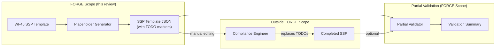
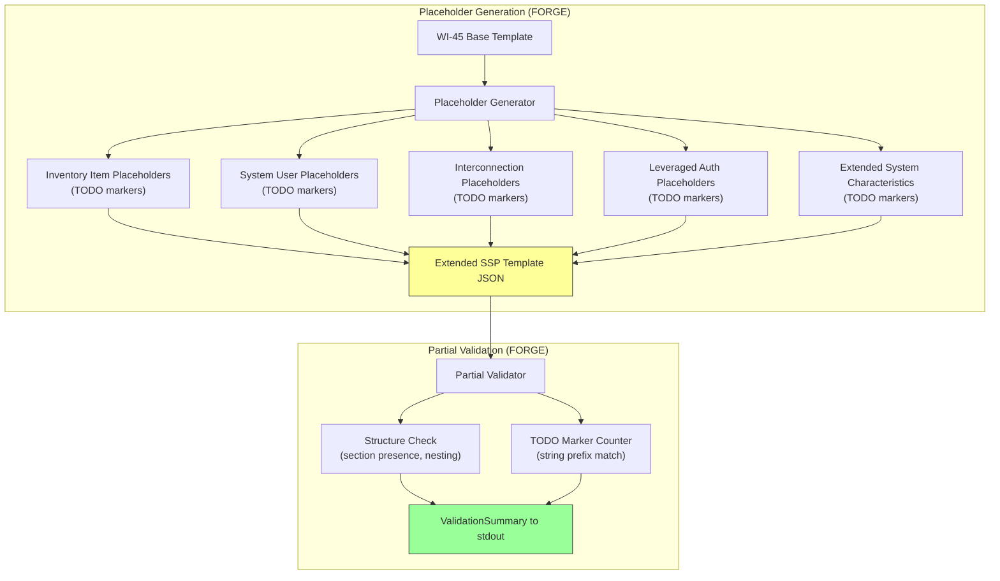
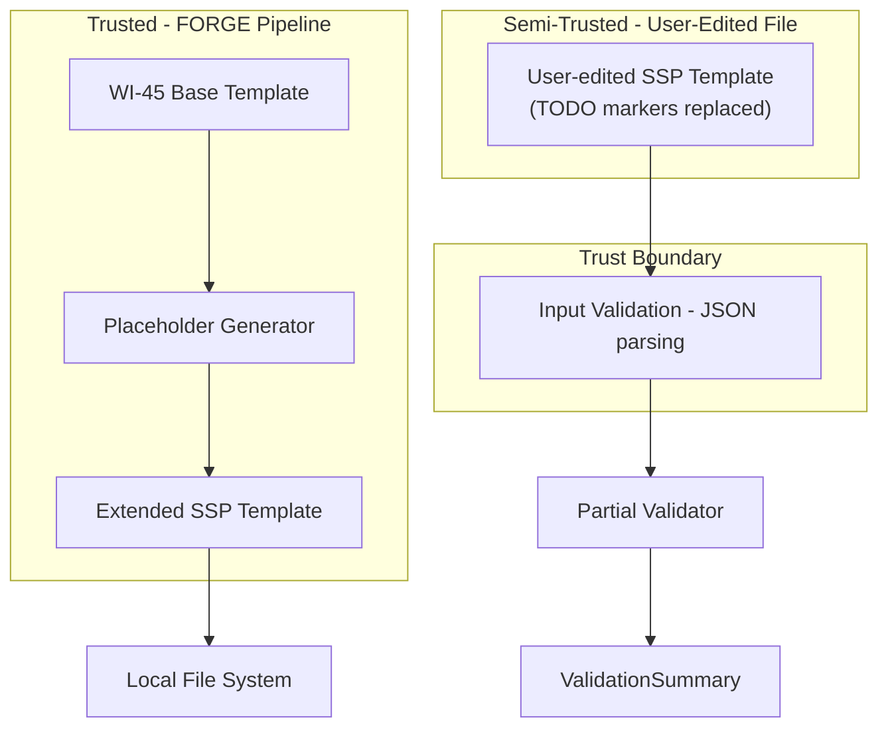

# 046-sec-ssp-template-placeholders

> **Document Type:** Security Review (Lightweight)
> **Audience:** LLM agents, human reviewers
> **Status:** Draft
> **Last Updated:** 2026-02-11 <!-- @auto -->
> **Reviewer:** Brian Luby <!-- @human-required -->
> **Risk Level:** Medium <!-- @human-required -->

---

## Review Tier Legend

| Marker | Tier | Speckit Behavior |
|--------|------|------------------|
| 🔴 `@human-required` | Human Generated | Prompt human to author; blocks until complete |
| 🟡 `@human-review` | LLM + Human Review | LLM drafts → prompt human to confirm/edit; blocks until confirmed |
| 🟢 `@llm-autonomous` | LLM Autonomous | LLM completes; no prompt; logged for audit |
| ⚪ `@auto` | Auto-generated | System fills (timestamps, links); no prompt |

---

## Severity Definitions

| Level | Label | Definition |
|-------|-------|------------|
| 🔴 | **Critical** | Immediate exploitation risk; data breach or system compromise likely |
| 🟠 | **High** | Significant risk; exploitation possible with moderate effort |
| 🟡 | **Medium** | Notable risk; exploitation requires specific conditions |
| 🟢 | **Low** | Minor risk; limited impact or unlikely exploitation |

---

## Linkage ⚪ `@auto`

| Document | ID | Relationship |
|----------|-----|--------------|
| Parent PRD | [046-prd-ssp-template-placeholders.md](../PRD/046-prd-ssp-template-placeholders.md) | Feature being reviewed |
| Architecture Review | [046-ar-ssp-template-placeholders.md](../AR/046-ar-ssp-template-placeholders.md) | Technical implementation |

---

## Purpose

This is a **lightweight security review** intended to catch obvious security concerns early in the product lifecycle. It is NOT a comprehensive threat model. Full threat modeling should occur during implementation when infrastructure-as-code and concrete implementations exist.

**This review answers three questions:**
1. What does this feature expose to attackers?
2. What data does it touch, and how sensitive is that data?
3. What's the impact if something goes wrong?

**Scope of this review:**
- ✅ Attack surface identification
- ✅ Data classification
- ✅ High-level CIA assessment
- ✅ Template injection risk assessment (specific to this work item)
- ❌ Detailed threat enumeration (deferred to implementation)
- ❌ Penetration testing (deferred to implementation)
- ❌ Compliance audit (separate process)

---

## Feature Security Summary

### One-line Summary 🔴 `@human-required`
> The SSP template placeholder system extends the WI-45 SSP template with structured placeholder sections for system-specific data (inventory items, users, interconnections, leveraged authorizations) using typed TODO marker strings via direct `serde_json` construction -- no template engine is used, which mitigates the primary template injection risk.

### Risk Assessment 🔴 `@human-required`
> **Risk Level:** Medium
> **Justification:** The placeholder system introduces a pattern where user-provided values may eventually replace TODO markers. While the AR decision to use direct `serde_json` construction (not a template engine) significantly reduces template injection risk, the TODO marker format itself establishes a convention that downstream tooling or manual processes must handle safely. The partial validation system introduces a secondary concern: validation output could be influenced by crafted TODO-like strings in completed fields. Risk is Medium rather than Low because this work item establishes the placeholder replacement pattern that future tooling will build upon.

---

## Attack Surface Analysis

### Exposure Points 🟡 `@human-review`

| Exposure Type | Details | Authentication | Authorization | Notes |
|---------------|---------|----------------|---------------|-------|
| User Input Field | TODO marker replacement values (manual, post-generation) | — | — | Users replace TODO strings with system-specific data. FORGE does not process these replacements -- they happen outside FORGE. |
| **None** (for FORGE itself) | **FORGE generates placeholders only; does not process replacements** | — | — | The replacement of TODO markers happens outside FORGE's scope |

### Attack Surface Diagram 🟢 `@llm-autonomous`

The placeholder generator itself has no external exposure. However, the partial validator accepts SSP template files as input, including files that have been manually edited by users. This is the only point where potentially untrusted data enters the system.

### Exposure Checklist 🟢 `@llm-autonomous`

- [x] **Internet-facing endpoints require authentication** — N/A: no endpoints
- [x] **No sensitive data in URL parameters** — N/A: no URLs
- [x] **File uploads validated** — Partial validator reads JSON files; standard JSON parsing via serde_json
- [x] **Rate limiting configured** — N/A: local CLI
- [x] **CORS policy is restrictive** — N/A: no web server
- [x] **No debug/admin endpoints exposed** — N/A: no endpoints
- [x] **Webhooks validate signatures** — N/A: no webhooks

---

## Data Flow Analysis

### Data Inventory 🟡 `@human-review`

| Data Element | PRD Entity | Classification | Source | Destination | Retention | Encrypted Rest | Encrypted Transit | Residency |
|--------------|------------|----------------|--------|-------------|-----------|----------------|-------------------|-----------|
| Inventory item placeholders | InventoryItem (TODO fields) | Public | Generated constants | SSP template JSON | Embedded in output | User responsibility | N/A (local) | Local |
| System user placeholders | SystemUser (TODO fields) | Public | Generated constants | SSP template JSON | Embedded in output | User responsibility | N/A (local) | Local |
| Interconnection placeholders | Interconnection (TODO fields) | Public | Generated constants | SSP template JSON | Embedded in output | User responsibility | N/A (local) | Local |
| Leveraged authorization placeholders | LeveragedAuthorization (TODO fields) | Public | Generated constants | SSP template JSON | Embedded in output | User responsibility | N/A (local) | Local |
| Extended system-characteristics TODOs | SystemCharacteristics (network, data-flow, boundary) | Public | Generated constants | SSP template JSON | Embedded in output | User responsibility | N/A (local) | Local |
| Validation summary output | ValidationSummary | Internal | Partial validator analysis | stdout | None (transient) | N/A | N/A | Local |
| Completed field values (post-editing) | Various (user-supplied) | Internal to Confidential | User manual input | SSP template JSON | User-managed | User responsibility | N/A (local) | Local |

### Data Classification Reference 🟢 `@llm-autonomous`

| Level | Label | Description | Examples | Handling Requirements |
|-------|-------|-------------|----------|----------------------|
| 1 | **Public** | No impact if disclosed | Marketing content, public docs | No special handling |
| 2 | **Internal** | Minor impact if disclosed | Internal configs, non-sensitive logs | Access controls, no public exposure |
| 3 | **Confidential** | Significant impact if disclosed | PII, user data, credentials | Encryption, audit logging, access controls |
| 4 | **Restricted** | Severe impact if disclosed | Payment data, health records, secrets | Encryption, strict access, compliance requirements |

FORGE-generated TODO marker strings are **Level 1 (Public)** -- they are generic placeholder text with no organizational data. However, once users replace TODOs with actual system-specific data (inventory details, network architecture, interconnection descriptions), the completed SSP template escalates to **Level 2-3 (Internal to Confidential)** depending on content. This escalation happens outside FORGE's scope.

### Data Flow Diagram 🟢 `@llm-autonomous`

### Data Handling Checklist 🟢 `@llm-autonomous`

- [x] **No Restricted data stored unless absolutely required** — FORGE generates only TODO markers; no restricted data
- [x] **Confidential data encrypted at rest** — N/A: FORGE does not generate confidential data; user-completed templates are user's responsibility
- [x] **All data encrypted in transit (TLS 1.2+)** — N/A: no transit; local file output only
- [x] **PII has defined retention policy** — N/A: no PII generated by FORGE
- [x] **Logs do not contain Confidential/Restricted data** — Logs contain only structural info (section names, TODO counts)
- [x] **Secrets are not hardcoded** — N/A: no secrets
- [x] **Data minimization applied** — One annotated example per category; minimal placeholder generation
- [x] **Data residency requirements documented** — N/A: local CLI tool

---

## Third-Party & Supply Chain 🟡 `@human-review`

### New External Services

| Service | Purpose | Data Shared | Communication | Approved? |
|---------|---------|-------------|---------------|-----------|
| None | No external services | — | — | N/A |

### New Libraries/Dependencies

| Library | Version | License | Purpose | Security Check |
|---------|---------|---------|---------|----------------|
| None | — | — | No new dependencies; uses existing serde_json. jsonschema may be reused from WI-19 if available for partial validation. | N/A |

**Template engine risk assessment:** The AR considered and explicitly rejected Mustache/Handlebars template variables (Option 1) and interactive prompt systems (Option 3). The selected approach (Option 2: Typed Schema Placeholders) uses direct `serde_json` construction with string constants. This means:
- No template engine is used -- template injection via Tera/Handlebars/etc. is not possible
- Placeholder values are static string constants defined in Rust source code
- No user input is processed during placeholder generation
- The TODO marker format (`"TODO: [instruction] (type: [data-type], example: [value])"`) is a plain string, not a template expression

### Supply Chain Checklist

- [x] **All new services use encrypted communication** — N/A: no new services
- [x] **Service agreements/ToS reviewed** — N/A: no new services
- [x] **Dependencies have acceptable licenses** — N/A: no new dependencies
- [x] **Dependencies are actively maintained** — N/A: no new dependencies
- [x] **No known critical vulnerabilities** — N/A: no new dependencies

---

## CIA Impact Assessment

If this feature is compromised, what's the impact?

### Confidentiality 🟡 `@human-review`

> **What could be disclosed?**

| Asset at Risk | Classification | Exposure Scenario | Impact | Likelihood |
|---------------|----------------|-------------------|--------|------------|
| TODO marker strings | Public | Template shared publicly before completion | None | N/A |
| Completed SSP template (post-editing) | Internal-Confidential | User shares completed template with system inventory, network details, interconnections | Medium — reveals organizational infrastructure | Low (outside FORGE scope) |

**Confidentiality Risk Level:** Low

FORGE itself generates only Public-classification TODO markers. Confidentiality risk arises when users complete the template with system-specific data, but this is outside FORGE's operational scope. FORGE does not transmit or persist user-completed data.

### Integrity 🟡 `@human-review`

> **What could be modified or corrupted?**

| Asset at Risk | Modification Scenario | Impact | Likelihood |
|---------------|----------------------|--------|------------|
| Placeholder structure correctness | Bug produces invalid OSCAL SSP field names or nesting | Medium — users complete fields in wrong structure; validation fails | Low |
| TODO marker format consistency | Inconsistent marker format between WI-45 and WI-46 | Low — partial validator may miss some markers if prefix differs | Low |
| Partial validation accuracy | Validator reports false positives (marks incomplete section as complete) or false negatives | Medium — user misled about completion status | Low |
| TODO marker content | Misleading TODO instructions cause users to enter wrong data type or format | Low — validation catches format errors post-completion | Very Low |

**Integrity Risk Level:** Medium

The primary integrity concern is the **accuracy of the partial validator**. If the validator falsely reports a section as complete (when it still has TODO markers), users may submit an incomplete SSP. The `TODO:` prefix string matching approach is robust but must be consistently applied. A secondary concern is structural correctness of placeholder OSCAL elements -- incorrect field names or nesting will cause downstream OSCAL tools to reject the template.

### Availability 🟡 `@human-review`

> **What could be disrupted?**

| Service/Function | Disruption Scenario | Impact | Likelihood |
|------------------|---------------------|--------|------------|
| Placeholder generation | Generator function fails | Low — user cannot generate extended template; falls back to WI-45 base template | Very Low |
| Partial validation | Validator panics on malformed input JSON | Low — validation fails; user cannot check completion status | Low |

**Availability Risk Level:** Low

Both placeholder generation and partial validation are self-contained functions. Failure does not affect core FORGE conversion functionality (Catalog, Profile, Component Definition).

### CIA Summary 🟢 `@llm-autonomous`

| Dimension | Risk Level | Primary Concern | Mitigation Priority |
|-----------|------------|-----------------|---------------------|
| **Confidentiality** | Low | User-completed templates may reveal infrastructure details (outside FORGE scope) | Low |
| **Integrity** | Medium | Placeholder structural correctness and partial validation accuracy | Medium |
| **Availability** | Low | Generator/validator failure does not affect core pipeline | Low |

**Overall CIA Risk:** Medium — *Integrity is the primary concern: placeholder structure must be correct OSCAL, and partial validation must accurately distinguish complete from incomplete sections. Template injection risk is mitigated by the use of direct `serde_json` construction rather than a template engine.*

---

## Trust Boundaries 🟡 `@human-review`

The key trust boundary in this feature is between FORGE's internal pipeline outputs (trusted) and user-edited SSP template files that are fed back into the partial validator (semi-trusted). When a user runs `forge validate` on a manually edited SSP template, the input file may contain arbitrary JSON content. The `serde_json` parser provides the first layer of defense -- malformed JSON is rejected. The partial validator then performs string-prefix matching on `"TODO:"` to count remaining placeholders.

**Trust boundary concern:** A user-edited file could contain strings that start with `"TODO:"` in unexpected locations, or conversely, could contain strings that look like TODO markers but use a slightly different prefix (e.g., `"Todo:"`, `"todo: "`) to bypass detection. This is a low-severity concern because the partial validator is a convenience tool, not a security gate.

### Trust Boundary Checklist 🟢 `@llm-autonomous`

- [x] **All input from untrusted sources is validated** — User-edited JSON files are parsed by serde_json (validates JSON structure); partial validator checks structural completeness
- [x] **External API responses are validated** — N/A: no external APIs
- [x] **Authorization checked at data access, not just entry point** — N/A: no authorization model
- [x] **Service-to-service calls are authenticated** — N/A: single local process

---

## Known Risks & Mitigations 🟡 `@human-review`

| ID | Risk Description | Severity | Mitigation | Status | Owner |
|----|------------------|----------|------------|--------|-------|
| R1 | **Template injection via future template engine adoption:** If a future work item replaces direct `serde_json` construction with a template engine (Tera, Handlebars), crafted placeholder values could execute template logic | Medium | AR decision explicitly locks this to `serde_json` construction. Any future change to a template engine MUST undergo a separate security review. Document this constraint in implementation guardrails. | Mitigated | Brian Luby |
| R2 | **Partial validator false completeness:** Validator reports section as complete when TODO markers remain, due to non-standard TODO marker format | Low | Use shared `todo_marker_with_type()` helper for ALL marker generation to ensure consistent `"TODO: "` prefix. Case-sensitive prefix match is deterministic. | Mitigated | Brian Luby |
| R3 | **Placeholder structure mismatch with OSCAL schema:** Generated placeholder structures use incorrect field names or nesting, causing downstream tool failures | Low | Unit tests validate placeholder structure against OSCAL SSP v1.2.0 field names. One annotated example per category is small enough to manually verify. | Mitigated | Brian Luby |
| R4 | **Crafted JSON input to partial validator:** Extremely large or deeply nested JSON input to `forge validate` could cause memory exhaustion or stack overflow | Low | serde_json has configurable recursion limits. Standard JSON size limits apply. This is a local CLI tool, so the attacker is the user (self-attack scenario). | Accepted | Brian Luby |

### Risk Acceptance 🔴 `@human-required`

| Risk ID | Accepted By | Date | Justification | Review Date |
|---------|-------------|------|---------------|-------------|
| R4 | Brian Luby | 2026-02-11 | Local CLI tool; the "attacker" is the user running the tool on their own machine. Crafted input is a self-attack scenario with no privilege escalation. serde_json provides reasonable default protections. | 2027-02-11 |

---

## Security Requirements 🟡 `@human-review`

### Authentication & Authorization

| Req ID | Requirement | PRD AC | Verification Method |
|--------|-------------|--------|---------------------|
| — | N/A — local CLI tool with no authentication or authorization | — | — |

### Data Protection

| Req ID | Requirement | PRD AC | Verification Method |
|--------|-------------|--------|---------------------|
| SEC-1 | Placeholder generation must use direct `serde_json` construction, NOT a template engine, to prevent template injection | — | Code review; AR decision compliance |
| SEC-2 | TODO markers must use the consistent `"TODO: "` string prefix for reliable detection by the partial validator | AC-4 | Unit test: verify all generated markers start with `"TODO: "` |
| SEC-3 | Partial validator must not execute or interpret TODO marker content -- string prefix matching only | AC-6 | Code review; unit test |

### Input Validation

| Req ID | Requirement | PRD AC | Verification Method |
|--------|-------------|--------|---------------------|
| SEC-4 | Partial validator must handle malformed JSON input gracefully (serde_json parsing errors) without panicking | AC-6 | Unit test: feed invalid JSON to validator |
| SEC-5 | Partial validator must use case-sensitive `"TODO: "` prefix matching -- do not use case-insensitive matching that could miss markers | AC-6, AC-4 | Unit test |

### Operational Security

| Req ID | Requirement | PRD AC | Verification Method |
|--------|-------------|--------|---------------------|
| SEC-6 | Validation summary output must not echo raw field values from user-edited templates to stdout -- report only field paths and TODO counts | M-7 | Unit test: verify output contains only section names and counts |
| SEC-7 | Any future migration to a template engine MUST trigger a new security review before implementation proceeds | — | Process requirement; documented in implementation guardrails |

---

## Compliance Considerations 🟡 `@human-review`

| Regulation | Applicable? | Relevant Requirements | N/A Justification |
|------------|-------------|----------------------|-------------------|
| GDPR | N/A | — | No PII collected, processed, or stored. Local CLI tool. FORGE generates only TODO markers; users may enter PII when completing templates, but this is outside FORGE's scope. |
| CCPA | N/A | — | No personal information. Local CLI tool. |
| SOC 2 | N/A | — | No cloud services, no data storage, no access controls needed. |
| HIPAA | N/A | — | No health information. Local CLI tool. |
| PCI-DSS | N/A | — | No payment data. Local CLI tool. |
| Other | N/A | — | FORGE is a local CLI tool with no network, no auth, no database, no PII. |

---

## Review Findings

### Issues Identified 🟡 `@human-review`

| ID | Finding | Severity | Category | Recommendation | Status |
|----|---------|----------|----------|----------------|--------|
| F1 | Template injection risk is present in concept but mitigated by architecture decision to use `serde_json` instead of template engine | Medium | Exposure | Maintain AR decision; add implementation guardrail preventing future template engine adoption without security review | Resolved (by design) |
| F2 | Partial validator processes user-edited JSON files -- a trust boundary crossing | Low | Trust Boundary | Use serde_json for safe JSON parsing; do not echo raw field values in validation output | Open |

### Positive Observations 🟢 `@llm-autonomous`

- Architecture explicitly considered and rejected template engines (Tera, Handlebars, Mustache), eliminating the primary template injection attack vector
- TODO markers are generated from static Rust string constants, not from user input or external data
- Partial validation uses simple string-prefix matching (`"TODO: "`) rather than pattern evaluation, avoiding regex-based injection risks
- One annotated example per category (not multiple empty placeholders) minimizes the template surface area
- The `todo_marker_with_type()` helper function centralizes marker generation, ensuring format consistency across all placeholder categories

---

## Open Questions 🟡 `@human-review`

- [ ] **Q1:** Should the partial validator sanitize or escape field paths in its output to prevent any possibility of terminal escape sequence injection from crafted JSON field names? (Low risk -- local CLI tool, self-attack scenario only)

---

## Changelog ⚪ `@auto`

| Version | Date | Author | Changes |
|---------|------|--------|---------|
| 0.1 | 2026-02-11 | LLM (Claude) | Initial review |

---

## Review Sign-off 🔴 `@human-required`

| Role | Name | Date | Decision |
|------|------|------|----------|
| Security Reviewer | Brian Luby | YYYY-MM-DD | [Approved / Approved with conditions / Rejected] |
| Feature Owner | Brian Luby | YYYY-MM-DD | [Acknowledged] |

### Conditions for Approval (if applicable) 🔴 `@human-required`

- [ ] Confirm that the implementation uses direct `serde_json` construction and does NOT introduce a template engine dependency
- [ ] Confirm that the partial validator does not echo raw field values from user-edited templates

---

## Security Requirements Traceability 🟢 `@llm-autonomous`

| SEC Req ID | PRD Req ID | PRD AC ID | Test Type | Test Location |
|------------|------------|-----------|-----------|---------------|
| SEC-1 | — | — | Code Review | AR compliance check |
| SEC-2 | M-4 | AC-4 | Unit | tests/ssp_placeholder_test.rs |
| SEC-3 | M-6 | AC-6 | Code Review + Unit | tests/ssp_placeholder_test.rs |
| SEC-4 | M-6 | AC-6 | Unit | tests/ssp_placeholder_test.rs |
| SEC-5 | M-4, M-6 | AC-4, AC-6 | Unit | tests/ssp_placeholder_test.rs |
| SEC-6 | M-7 | — | Unit | tests/ssp_placeholder_test.rs |
| SEC-7 | — | — | Process | Security review gate |

---

## Review Checklist 🟢 `@llm-autonomous`

Before marking as Approved:
- [x] Attack surface documented with auth/authz status for each exposure
- [x] Exposure Points table has no contradictory rows (None vs. actual endpoints)
- [x] All PRD Data Model entities appear in Data Inventory
- [x] All data elements are classified using the 4-tier model
- [x] Third-party dependencies and services are listed
- [x] CIA impact is assessed with Low/Medium/High ratings
- [x] Trust boundaries are identified
- [x] Security requirements have verification methods specified
- [x] Security requirements trace to PRD ACs where applicable
- [x] No Critical/High findings remain Open
- [x] Compliance N/A items have justification
- [x] Risk acceptance has named approver and review date
