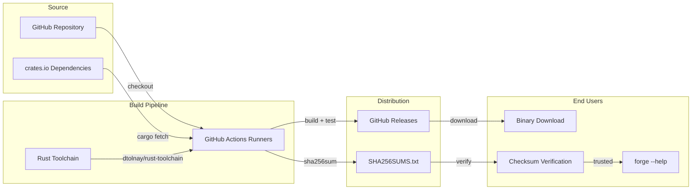
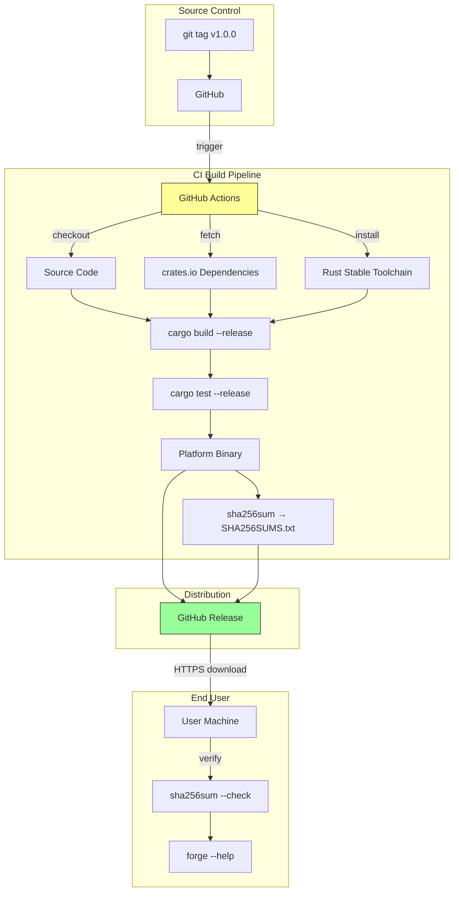
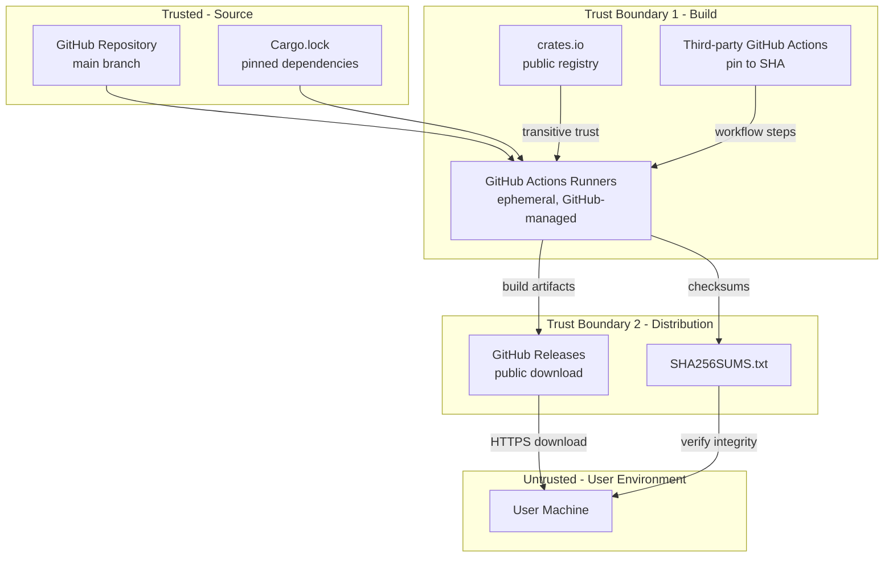

# 049-sec-cross-platform-release

> **Document Type:** Security Review (Lightweight)
> **Audience:** LLM agents, human reviewers
> **Status:** Draft
> **Last Updated:** 2026-02-11 <!-- @auto -->
> **Reviewer:** Brian Luby <!-- @human-required -->
> **Risk Level:** Medium-High <!-- @human-required -->

---

## Review Tier Legend

| Marker | Tier | Speckit Behavior |
|--------|------|------------------|
| 🔴 `@human-required` | Human Generated | Prompt human to author; blocks until complete |
| 🟡 `@human-review` | LLM + Human Review | LLM drafts → prompt human to confirm/edit; blocks until confirmed |
| 🟢 `@llm-autonomous` | LLM Autonomous | LLM completes; no prompt; logged for audit |
| ⚪ `@auto` | Auto-generated | System fills (timestamps, links); no prompt |

---

## Severity Definitions

| Level | Label | Definition |
|-------|-------|------------|
| 🔴 | **Critical** | Immediate exploitation risk; data breach or system compromise likely |
| 🟠 | **High** | Significant risk; exploitation possible with moderate effort |
| 🟡 | **Medium** | Notable risk; exploitation requires specific conditions |
| 🟢 | **Low** | Minor risk; limited impact or unlikely exploitation |

---

## Linkage ⚪ `@auto`

| Document | ID | Relationship |
|----------|-----|--------------|
| Parent PRD | [049-prd-cross-platform-release.md](../PRD/049-prd-cross-platform-release.md) | Feature being reviewed |
| Architecture Review | [049-ar-cross-platform-release.md](../AR/049-ar-cross-platform-release.md) | Technical implementation |

---

## Purpose

This is a **lightweight security review** intended to catch obvious security concerns early in the product lifecycle. It is NOT a comprehensive threat model. Full threat modeling should occur during implementation when infrastructure-as-code and concrete implementations exist.

**This review answers three questions:**
1. What does this feature expose to attackers?
2. What data does it touch, and how sensitive is that data?
3. What's the impact if something goes wrong?

**Additional scope for this review (supply chain focus):**
- ✅ Attack surface identification
- ✅ Data classification
- ✅ High-level CIA assessment
- ✅ Supply chain security assessment
- ✅ Binary distribution integrity
- ✅ CI/CD pipeline security
- ✅ Dependency audit posture
- ❌ Detailed threat enumeration (deferred to implementation)
- ❌ Penetration testing (deferred to implementation)
- ❌ Compliance audit (separate process)

---

## Feature Security Summary

### One-line Summary 🔴 `@human-required`
> Cross-platform release establishes GitHub Actions CI/CD pipelines that build, test, and distribute pre-built FORGE binaries for Linux, macOS, and Windows via GitHub Releases, with SHA-256 checksums for integrity verification -- introducing supply chain security considerations around binary signing, build reproducibility, dependency trust, and CI workflow security.

### Risk Assessment 🔴 `@human-required`
> **Risk Level:** Medium-High
> **Justification:** This is the first FORGE work item that distributes executable binaries to end users. Supply chain attacks targeting CI/CD pipelines, dependency poisoning, and binary tampering are real-world threats. While FORGE is an open-source local CLI tool (not a service), users who download pre-built binaries must trust the build pipeline. Key risk factors: (1) binaries are not code-signed (deferred), (2) builds depend on GitHub Actions runner integrity, (3) Rust dependency supply chain (crates.io) is trusted transitively, (4) no reproducible build verification. SHA-256 checksums provide integrity verification but not provenance attestation.

---

## Attack Surface Analysis

### Exposure Points 🟡 `@human-review`

| Exposure Type | Details | Authentication | Authorization | Notes |
|---------------|---------|----------------|---------------|-------|
| Public Internet Endpoint | GitHub Releases page with downloadable binaries | No | No | Binaries are publicly downloadable; integrity relies on SHA-256 checksums |
| CI/CD Pipeline | GitHub Actions workflows (.github/workflows/) | GitHub OIDC | Repository permissions | Workflow files define build steps; compromise could inject malicious code |
| Dependency Resolution | cargo/crates.io dependency resolution during build | No (public registry) | No | Transitive dependencies fetched during CI builds |

### Attack Surface Diagram 🟢 `@llm-autonomous`

### Exposure Checklist 🟢 `@llm-autonomous`

- [ ] **Internet-facing endpoints require authentication** — GitHub Releases is public by design for open-source; no auth for downloads
- [x] **No sensitive data in URL parameters** — N/A: download URLs are standard GitHub Release asset URLs
- [x] **File uploads validated** — N/A: FORGE does not accept uploads; binaries are build artifacts
- [x] **Rate limiting configured** — N/A: GitHub handles rate limiting for Releases
- [x] **CORS policy is restrictive** — N/A: no FORGE web server
- [x] **No debug/admin endpoints exposed** — N/A: no FORGE endpoints
- [x] **Webhooks validate signatures** — N/A: no webhooks in FORGE

---

## Data Flow Analysis

### Data Inventory 🟡 `@human-review`

| Data Element | PRD Entity | Classification | Source | Destination | Retention | Encrypted Rest | Encrypted Transit | Residency |
|--------------|------------|----------------|--------|-------------|-----------|----------------|-------------------|-----------|
| Source code | FORGE repository | Public | GitHub repository | GitHub Actions runners | Permanent (git history) | GitHub managed | HTTPS | GitHub (US) |
| Rust dependencies | Cargo.lock pinned versions | Public | crates.io | GitHub Actions runners | Build-time only | N/A | HTTPS | GitHub runners (ephemeral) |
| Build artifacts (binaries) | Release binaries | Public | GitHub Actions build | GitHub Releases | Permanent (per release) | GitHub managed | HTTPS | GitHub (US) |
| SHA-256 checksums | SHA256SUMS.txt | Public | GitHub Actions sha256sum | GitHub Releases | Permanent (per release) | GitHub managed | HTTPS | GitHub (US) |
| GITHUB_TOKEN | CI secret | Restricted | GitHub OIDC | GitHub Actions workflow | Build-time only | GitHub managed | HTTPS (OIDC) | GitHub (ephemeral) |
| Build logs | CI run output | Internal | GitHub Actions | GitHub Actions logs | 90 days (GitHub default) | GitHub managed | HTTPS | GitHub (US) |

### Data Classification Reference 🟢 `@llm-autonomous`

| Level | Label | Description | Examples | Handling Requirements |
|-------|-------|-------------|----------|----------------------|
| 1 | **Public** | No impact if disclosed | Marketing content, public docs | No special handling |
| 2 | **Internal** | Minor impact if disclosed | Internal configs, non-sensitive logs | Access controls, no public exposure |
| 3 | **Confidential** | Significant impact if disclosed | PII, user data, credentials | Encryption, audit logging, access controls |
| 4 | **Restricted** | Severe impact if disclosed | Payment data, health records, secrets | Encryption, strict access, compliance requirements |

Most data elements are **Level 1 (Public)** -- FORGE is an open-source project. The `GITHUB_TOKEN` is **Level 4 (Restricted)** and is managed entirely by GitHub's OIDC infrastructure; it is never exposed in logs or stored persistently. Build logs are **Level 2 (Internal)** as they may contain environment details about GitHub runners.

### Data Flow Diagram 🟢 `@llm-autonomous`

### Data Handling Checklist 🟢 `@llm-autonomous`

- [x] **No Restricted data stored unless absolutely required** — GITHUB_TOKEN is restricted but managed by GitHub OIDC; never persisted by FORGE
- [x] **Confidential data encrypted at rest** — N/A: no FORGE-managed confidential data
- [x] **All data encrypted in transit (TLS 1.2+)** — GitHub uses HTTPS for all operations (checkout, crates.io fetch, release upload, user download)
- [x] **PII has defined retention policy** — N/A: no PII
- [x] **Logs do not contain Confidential/Restricted data** — CI logs must not expose GITHUB_TOKEN (GitHub masks secrets automatically)
- [x] **Secrets are not hardcoded** — GITHUB_TOKEN provided via GitHub OIDC; no hardcoded secrets
- [x] **Data minimization applied** — Only build artifacts and checksums published; no debug symbols or intermediate files
- [x] **Data residency requirements documented** — GitHub infrastructure (US-based); acceptable for open-source project

---

## Third-Party & Supply Chain 🟡 `@human-review`

### New External Services

| Service | Purpose | Data Shared | Communication | Approved? |
|---------|---------|-------------|---------------|-----------|
| GitHub Actions | CI/CD pipeline execution | Source code, build artifacts | HTTPS | ✅ Approved (existing platform) |
| GitHub Releases | Binary distribution | Compiled binaries, checksums | HTTPS | ✅ Approved (existing platform) |
| crates.io | Rust dependency resolution | Dependency names and versions | HTTPS | ✅ Approved (Rust ecosystem standard) |

### New Libraries/Dependencies

| Library | Version | License | Purpose | Security Check |
|---------|---------|---------|---------|----------------|
| dtolnay/rust-toolchain (GH Action) | stable | MIT | Install Rust toolchain in CI | ✅ Approved — widely used, maintained by Rust ecosystem lead |
| actions/checkout (GH Action) | v4 | MIT | Check out repository in CI | ✅ Approved — official GitHub action |
| softprops/action-gh-release (GH Action) | latest | MIT | Create GitHub Releases | ⚠️ Review — third-party action; pin to specific SHA for supply chain safety |

### Supply Chain Checklist

- [x] **All new services use encrypted communication** — GitHub uses HTTPS throughout
- [x] **Service agreements/ToS reviewed** — GitHub ToS applicable (existing relationship)
- [x] **Dependencies have acceptable licenses** — MIT/Apache-2.0 for all Rust dependencies; MIT for GH Actions
- [ ] **Dependencies are actively maintained** — Verify before implementation: run `cargo audit` to check for known vulnerabilities
- [ ] **No known critical vulnerabilities** — Run `cargo audit` as part of CI pipeline

### Supply Chain Security Checklist 🟡 `@human-review`

This checklist is specific to WI-49's binary distribution concerns:

**Build Pipeline Security:**
- [ ] **Pin GitHub Actions to commit SHAs, not tags** — Prevents tag hijacking attacks on third-party actions (e.g., `softprops/action-gh-release@<sha>` not `@v2`)
- [ ] **Use `actions/checkout@v4` with `persist-credentials: false`** — Minimizes credential exposure in checkout step
- [ ] **Restrict GITHUB_TOKEN permissions to minimum required** — Use `permissions:` block in workflow to limit token scope (e.g., `contents: write` for release creation only)
- [ ] **Do not allow workflow_dispatch or pull_request_target triggers on release workflow** — Prevents unauthorized release triggering from forks

**Dependency Security:**
- [ ] **Run `cargo audit` in CI pipeline** — Checks Cargo dependencies against RustSec Advisory Database
- [ ] **Commit and verify Cargo.lock** — Ensures reproducible dependency resolution; prevents dependency confusion
- [ ] **Review new dependencies before merging** — Any new `Cargo.toml` dependency addition should be reviewed for security posture

**Binary Integrity:**
- [x] **SHA-256 checksums generated for all release binaries** — PRD M-5 requirement
- [ ] **Checksums generated on the same runner that built the binary** — Prevents MITM between build and checksum generation
- [ ] **Consider SLSA provenance attestation** — Provides tamper-proof build provenance (deferred but recommended for future)
- [ ] **Consider binary signing** — Code signing provides stronger integrity guarantee than checksums alone (deferred per PRD W-3)

**Build Reproducibility:**
- [ ] **Release builds use `codegen-units = 1`** — Ensures deterministic compilation order
- [ ] **Cargo.lock committed to repository** — Ensures identical dependency versions across builds
- [ ] **Document build environment expectations** — Rust version, OS version, toolchain components

---

## CIA Impact Assessment

If this feature is compromised, what's the impact?

### Confidentiality 🟡 `@human-review`

> **What could be disclosed?**

| Asset at Risk | Classification | Exposure Scenario | Impact | Likelihood |
|---------------|----------------|-------------------|--------|------------|
| Source code | Public | Repository is public | None | N/A |
| Build logs | Internal | GitHub Actions logs may reveal runner environment details | Low | Low |
| GITHUB_TOKEN | Restricted | Token leaked via misconfigured workflow step | Medium — could allow unauthorized release publishing | Very Low (GitHub masks secrets) |

**Confidentiality Risk Level:** Low

FORGE is open-source; source code is public. Build logs are ephemeral and contain no sensitive application data. The primary confidentiality concern is the `GITHUB_TOKEN`, which is managed by GitHub's OIDC infrastructure and automatically masked in logs.

### Integrity 🟡 `@human-review`

> **What could be modified or corrupted?**

| Asset at Risk | Modification Scenario | Impact | Likelihood |
|---------------|----------------------|--------|------------|
| Release binaries | Compromised GitHub Actions runner injects malicious code during build | High — users download and execute tampered binary | Very Low (GitHub runner infrastructure is trusted) |
| Release binaries | Dependency poisoning via compromised crate on crates.io | High — malicious dependency compiled into binary | Low |
| Release binaries | Tag hijacking of third-party GitHub Actions (e.g., softprops/action-gh-release) | Medium — malicious action modifies build or release process | Low (mitigated by SHA pinning) |
| SHA-256 checksums | Attacker modifies both binary and checksum simultaneously | High — checksum verification provides false assurance | Very Low (requires compromising GitHub Release infrastructure) |
| Workflow files | Malicious PR modifies workflow to exfiltrate secrets or alter builds | Medium — CI behavior changed | Low (PR review required; workflow changes visible in diff) |

**Integrity Risk Level:** Medium

Binary integrity is the **primary security concern** for this work item. Users trust that downloaded binaries are compiled from the public source code by the public CI pipeline. Threats include: (1) dependency supply chain attacks via crates.io, (2) compromised CI pipeline via third-party GitHub Actions, and (3) compromised GitHub infrastructure. SHA-256 checksums provide integrity verification against download corruption and basic tampering, but do not provide provenance attestation (proving the binary was built from a specific commit by a specific pipeline). Code signing and SLSA attestation would provide stronger guarantees but are deferred.

### Availability 🟡 `@human-review`

> **What could be disrupted?**

| Service/Function | Disruption Scenario | Impact | Likelihood |
|------------------|---------------------|--------|------------|
| CI pipeline | GitHub Actions outage or runner unavailability | Low — development blocked temporarily; no user impact | Low |
| GitHub Releases | GitHub infrastructure outage | Low — users cannot download binaries temporarily; can build from source | Very Low |
| Release workflow | Misconfigured workflow fails to produce binaries for one platform | Medium — users on affected platform cannot install without building from source | Low |

**Availability Risk Level:** Low

CI and release infrastructure depend on GitHub, which has high availability. Disruptions are temporary and users can always fall back to building from source.

### CIA Summary 🟢 `@llm-autonomous`

| Dimension | Risk Level | Primary Concern | Mitigation Priority |
|-----------|------------|-----------------|---------------------|
| **Confidentiality** | Low | GITHUB_TOKEN exposure (mitigated by GitHub OIDC) | Low |
| **Integrity** | Medium | Binary supply chain: dependency poisoning, CI pipeline compromise, binary tampering | High |
| **Availability** | Low | GitHub infrastructure dependency (high availability) | Low |

**Overall CIA Risk:** Medium-High — *Integrity is the dominant concern. Users downloading pre-built binaries must trust the entire supply chain: source code, dependencies, CI pipeline, and distribution channel. SHA-256 checksums provide basic integrity verification but not provenance. Code signing and SLSA attestation are recommended for future hardening.*

---

## Trust Boundaries 🟡 `@human-review`

**Trust Boundary 1 (Build):** The build pipeline trusts GitHub Actions runners (ephemeral VMs managed by GitHub), crates.io dependencies (resolved from Cargo.lock), and third-party GitHub Actions. Each of these is a potential supply chain attack vector.

**Trust Boundary 2 (Distribution):** GitHub Releases is the distribution channel. Users trust that binaries on the Releases page were produced by the CI pipeline from the public source code. SHA-256 checksums provide integrity verification but not provenance attestation.

### Trust Boundary Checklist 🟢 `@llm-autonomous`

- [ ] **All input from untrusted sources is validated** — Third-party GitHub Actions should be pinned to commit SHAs; crates.io dependencies pinned via Cargo.lock
- [x] **External API responses are validated** — N/A: no FORGE API calls during build
- [x] **Authorization checked at data access, not just entry point** — GitHub OIDC token has scoped permissions
- [x] **Service-to-service calls are authenticated** — GitHub Actions to GitHub Releases uses GITHUB_TOKEN (OIDC)

---

## Known Risks & Mitigations 🟡 `@human-review`

| ID | Risk Description | Severity | Mitigation | Status | Owner |
|----|------------------|----------|------------|--------|-------|
| R1 | **Dependency supply chain attack:** A compromised crate on crates.io is compiled into FORGE binaries | High | Run `cargo audit` in CI pipeline to check for known vulnerabilities. Commit Cargo.lock for reproducible builds. Review new dependency additions. | Open | Brian Luby |
| R2 | **Third-party GitHub Action compromise:** A tag-hijacked GitHub Action (e.g., `softprops/action-gh-release`) injects malicious steps | Medium | Pin all third-party GitHub Actions to specific commit SHAs instead of tags. Regularly audit pinned SHAs against upstream releases. | Open | Brian Luby |
| R3 | **Binaries not code-signed:** Users cannot verify binary provenance beyond SHA-256 checksums | Medium | SHA-256 checksums provide integrity verification against tampering. Code signing is deferred per PRD W-3. SLSA provenance attestation should be considered for future releases. | Accepted | Brian Luby |
| R4 | **Workflow file modification via PR:** A malicious contributor modifies `.github/workflows/release.yml` to exfiltrate GITHUB_TOKEN or inject code | Medium | Require PR review for all workflow file changes. Use `pull_request` (not `pull_request_target`) trigger for CI. Release workflow triggers only on `v*` tags pushed to main. | Open | Brian Luby |
| R5 | **GITHUB_TOKEN over-permissioning:** Token has more permissions than necessary, increasing blast radius if compromised | Low | Use explicit `permissions:` block in workflow files to restrict token to minimum required scope (e.g., `contents: write` for release creation). | Open | Brian Luby |
| R6 | **Partial release publication:** Release workflow fails after publishing some but not all platform binaries, leaving an incomplete release | Low | Use draft release mechanism: create release as draft, upload all artifacts, then publish. If any upload fails, the draft is not published. | Open | Brian Luby |
| R7 | **Build environment drift:** Different GitHub runner versions across builds may produce subtly different binaries | Low | Pin Rust toolchain to `stable` (not `nightly`). Use `codegen-units = 1` for deterministic compilation. Document expected build environment. | Mitigated | Brian Luby |

### Risk Acceptance 🔴 `@human-required`

| Risk ID | Accepted By | Date | Justification | Review Date |
|---------|-------------|------|---------------|-------------|
| R3 | Brian Luby | 2026-02-11 | Code signing is deferred per PRD W-3. SHA-256 checksums provide meaningful integrity verification for an open-source CLI tool. The risk of binary tampering via GitHub Releases infrastructure is very low. Code signing should be revisited if: (1) macOS Gatekeeper blocks unsigned binaries, or (2) FORGE gains enterprise adoption requiring stronger provenance. | 2027-02-11 |

---

## Security Requirements 🟡 `@human-review`

### Authentication & Authorization

| Req ID | Requirement | PRD AC | Verification Method |
|--------|-------------|--------|---------------------|
| SEC-1 | Release workflow must use GITHUB_TOKEN via GitHub OIDC, not a personal access token or hardcoded secret | — | Code review of workflow files |
| SEC-2 | Workflow `permissions:` block must restrict GITHUB_TOKEN to minimum required scope | — | Code review of workflow files |

### Data Protection

| Req ID | Requirement | PRD AC | Verification Method |
|--------|-------------|--------|---------------------|
| SEC-3 | SHA-256 checksums must be generated for every release binary | AC-3 | Verify SHA256SUMS.txt present in GitHub Release |
| SEC-4 | Checksums must be generated on the same runner that built the binary (no cross-runner checksum generation) | — | Code review of workflow files |
| SEC-5 | Build logs must not expose secrets (GITHUB_TOKEN or any other sensitive values) | — | Manual review of CI logs; GitHub auto-masks secrets |

### Input Validation

| Req ID | Requirement | PRD AC | Verification Method |
|--------|-------------|--------|---------------------|
| SEC-6 | Release workflow must trigger only on `v*` tags, not on arbitrary branches or PRs | AC-2 | Code review of workflow `on:` trigger |
| SEC-7 | All third-party GitHub Actions must be pinned to specific commit SHAs, not mutable tags | — | Code review of workflow files |

### Operational Security

| Req ID | Requirement | PRD AC | Verification Method |
|--------|-------------|--------|---------------------|
| SEC-8 | `cargo audit` must be run as part of CI pipeline to detect known dependency vulnerabilities | — | Verify `cargo audit` step in ci.yml |
| SEC-9 | Cargo.lock must be committed to the repository and verified during CI builds | — | Verify Cargo.lock in git; verify `--locked` flag usage in CI |
| SEC-10 | Release builds must use `--release` profile with `strip = true` to remove debug symbols from distributed binaries | AC-6 | Verify Cargo.toml `[profile.release]` and binary inspection |
| SEC-11 | Release workflow must use draft-then-publish pattern to prevent partial releases | — | Code review of workflow release step |

---

## Compliance Considerations 🟡 `@human-review`

| Regulation | Applicable? | Relevant Requirements | N/A Justification |
|------------|-------------|----------------------|-------------------|
| GDPR | N/A | — | No PII collected, processed, or stored. Binary distribution only. |
| CCPA | N/A | — | No personal information. Binary distribution only. |
| SOC 2 | N/A | — | Open-source project; no SOC 2 certification required. CI/CD uses GitHub's SOC 2-certified infrastructure. |
| HIPAA | N/A | — | No health information. Binary distribution only. |
| PCI-DSS | N/A | — | No payment data. Binary distribution only. |
| Export Control (EAR/ITAR) | N/A | — | FORGE does not implement cryptography or export-controlled technology. It uses standard Rust libraries (serde, uuid) that are publicly available. |
| OSS License Compliance | Yes | MIT license compliance for FORGE and all dependencies | Verify all dependencies use compatible licenses (MIT, Apache-2.0, BSD). Run `cargo license` to generate license report. |

---

## Review Findings

### Issues Identified 🟡 `@human-review`

| ID | Finding | Severity | Category | Recommendation | Status |
|----|---------|----------|----------|----------------|--------|
| F1 | No `cargo audit` step in CI pipeline | Medium | Supply Chain | Add `cargo audit` to ci.yml to detect known dependency vulnerabilities before release | Open |
| F2 | Third-party GitHub Actions (softprops/action-gh-release) not pinned to commit SHA | Medium | Supply Chain | Pin all third-party actions to specific commit SHAs instead of mutable version tags | Open |
| F3 | No binary code signing | Medium | Integrity | Deferred per PRD W-3. Accepted risk. Revisit if macOS Gatekeeper issues arise or enterprise adoption occurs. | Accepted |
| F4 | No SLSA provenance attestation | Low | Supply Chain | Consider adding SLSA provenance via `slsa-framework/slsa-github-generator` for tamper-proof build provenance. Recommended for future release hardening. | Open |
| F5 | GITHUB_TOKEN permissions not explicitly scoped | Low | CIA | Add `permissions:` block to workflow files restricting token to `contents: write` | Open |

### Positive Observations 🟢 `@llm-autonomous`

- Architecture decision to use native platform runners (not cross-compilation) means binaries are built and tested on the actual target platform, increasing trustworthiness
- SHA-256 checksums for all release binaries provide meaningful integrity verification
- Builds from public source code on ephemeral GitHub-managed runners -- no persistent build servers to compromise
- Tag-triggered release workflow (`v*` pattern) prevents unauthorized release creation from arbitrary branches
- `--release` profile with LTO and symbol stripping produces optimized, production-quality binaries without debug information leakage
- Cargo.lock pinning ensures reproducible dependency resolution
- All tests run in release mode before binary publication -- release binaries are verified correct
- GitHub Actions is free for public repositories, eliminating cost-based incentives to cut security corners (e.g., skipping tests)

---

## Open Questions 🟡 `@human-review`

- [ ] **Q1:** Should `cargo audit` be a blocking step (fail CI on any advisory) or advisory-only (warn but pass)? Blocking is more secure but may cause CI failures on new advisories in transitive dependencies that FORGE does not control.
- [ ] **Q2:** Should the project adopt SLSA provenance attestation (via `slsa-framework/slsa-github-generator`) for the initial release, or defer to a future hardening sprint?
- [ ] **Q3:** When macOS aarch64 requires cross-compilation from an x86_64 runner (if no native aarch64 runner is available), does this introduce additional supply chain risk from the cross-compilation toolchain?

---

## Changelog ⚪ `@auto`

| Version | Date | Author | Changes |
|---------|------|--------|---------|
| 0.1 | 2026-02-11 | LLM (Claude) | Initial review |

---

## Review Sign-off 🔴 `@human-required`

| Role | Name | Date | Decision |
|------|------|------|----------|
| Security Reviewer | Brian Luby | YYYY-MM-DD | [Approved / Approved with conditions / Rejected] |
| Feature Owner | Brian Luby | YYYY-MM-DD | [Acknowledged] |

### Conditions for Approval (if applicable) 🔴 `@human-required`

- [ ] Add `cargo audit` to CI pipeline (F1) before first binary release
- [ ] Pin all third-party GitHub Actions to commit SHAs (F2) before first binary release
- [ ] Add explicit `permissions:` block to workflow files (F5) before first binary release
- [ ] Commit Cargo.lock to repository if not already committed

---

## Security Requirements Traceability 🟢 `@llm-autonomous`

| SEC Req ID | PRD Req ID | PRD AC ID | Test Type | Test Location |
|------------|------------|-----------|-----------|---------------|
| SEC-1 | — | — | Code Review | .github/workflows/release.yml |
| SEC-2 | — | — | Code Review | .github/workflows/release.yml |
| SEC-3 | M-5 | AC-3 | Manual | GitHub Release page inspection |
| SEC-4 | M-5 | AC-3 | Code Review | .github/workflows/release.yml |
| SEC-5 | — | — | Manual | CI log inspection |
| SEC-6 | M-3 | AC-2 | Code Review | .github/workflows/release.yml |
| SEC-7 | — | — | Code Review | .github/workflows/release.yml, .github/workflows/ci.yml |
| SEC-8 | — | — | CI | .github/workflows/ci.yml |
| SEC-9 | — | — | Code Review | Cargo.lock in repository |
| SEC-10 | S-2 | AC-6 | Code Review + Binary | Cargo.toml [profile.release] |
| SEC-11 | — | — | Code Review | .github/workflows/release.yml |

---

## Review Checklist 🟢 `@llm-autonomous`

Before marking as Approved:
- [x] Attack surface documented with auth/authz status for each exposure
- [x] Exposure Points table has no contradictory rows (None vs. actual endpoints)
- [x] All PRD Data Model entities appear in Data Inventory
- [x] All data elements are classified using the 4-tier model
- [x] Third-party dependencies and services are listed
- [x] CIA impact is assessed with Low/Medium/High ratings
- [x] Trust boundaries are identified
- [x] Security requirements have verification methods specified
- [x] Security requirements trace to PRD ACs where applicable
- [ ] No Critical/High findings remain Open — F1 and F2 are Medium findings that should be resolved before first release
- [x] Compliance N/A items have justification
- [x] Risk acceptance has named approver and review date
