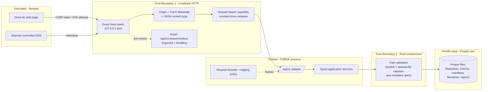
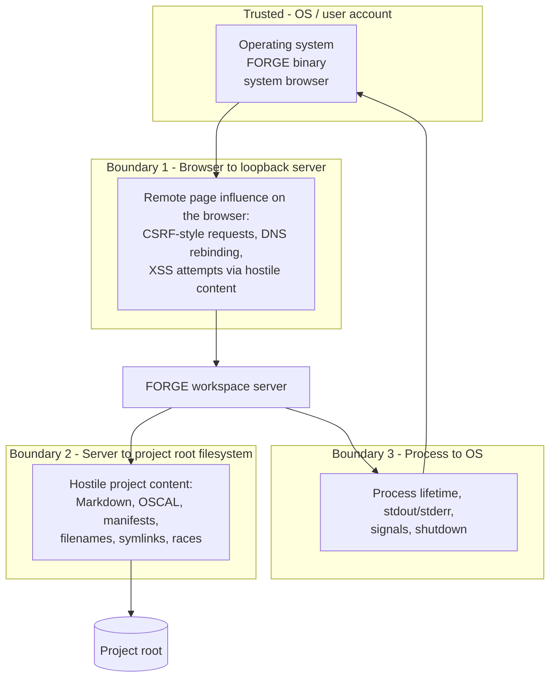

# 062-sec-local-web-workspace

> **Document Type:** Security Review and Threat Model (extended scope per PRD 062 Slice 0)
> **Audience:** LLM agents, human reviewers
> **Status:** Draft
> **Last Updated:** 2026-09-08 <!-- @auto -->
> **Reviewer:** Brian Luby <!-- @human-required -->
> **Risk Level:** High <!-- @human-required -->

---

## Review Tier Legend

| Marker | Tier | Speckit Behavior |
|--------|------|------------------|
| 🔴 `@human-required` | Human Generated | Prompt human to author; blocks until complete |
| 🟡 `@human-review` | LLM + Human Review | LLM drafts → prompt human to confirm/edit; blocks until confirmed |
| 🟢 `@llm-autonomous` | LLM Autonomous | LLM completes; no prompt; logged for audit |
| ⚪ `@auto` | Auto-generated | System fills (timestamps, links); no prompt |

---

## Severity Definitions

| Level | Label | Definition |
|-------|-------|------------|
| 🔴 | **Critical** | Immediate exploitation risk; data breach or system compromise likely |
| 🟠 | **High** | Significant risk; exploitation possible with moderate effort |
| 🟡 | **Medium** | Notable risk; exploitation requires specific conditions |
| 🟢 | **Low** | Minor risk; limited impact or unlikely exploitation |

---

## Linkage ⚪ `@auto`

| Document | ID | Relationship |
|----------|-----|--------------|
| Parent PRD | [062-prd-local-web-workspace.md](../PRD/062-prd-local-web-workspace.md) | Feature being reviewed |
| API Contract | [forge-workspace-v1.openapi.yaml](../api/forge-workspace-v1.openapi.yaml) | Normative local API contract (Slice 0 artifact; sole normative path source) |
| ADR | [0002-application-service-and-effect-boundaries.md](../adr/0002-application-service-and-effect-boundaries.md) | Application-service and effect boundary the containment controls enforce |
| ADR | [0004-supported-browser-and-accessibility-matrix.md](../adr/0004-supported-browser-and-accessibility-matrix.md) | Supported browser matrix; security-relevant browser behavior baseline |
| Plan | [2026-09-08-062-slice0-service-boundaries.md](../plans/2026-09-08-062-slice0-service-boundaries.md) | Slice 0 execution plan this record gates |
| Accessibility Requirements | [062-accessibility-requirements.md](../accessibility/062-accessibility-requirements.md) | Rendering constraints shared with accessible content presentation |

> Note: the API contract, ADRs, and plan are authored in parallel for Slice 0. Links are to the
> canonical committed paths; this record cites them by path and does not depend on their content.

---

## Purpose 🟡 `@human-review`

This record is the **local-server threat model** that PRD 062 requires Security to approve at
Slice 0 (Dependencies → Security; Launch Gates; Definition of Ready). It is therefore an
**extended-scope** security review: unlike the default lightweight review, the PRD explicitly
requires detailed threat enumeration, Argon2id parameter selection, containment design, and an
adversarial test plan before browser implementation.

**This review answers:**

1. What does this feature expose to attackers?
2. What data does it touch, and how sensitive is it?
3. What is the impact if something goes wrong?
4. What specific attacks must the verification suite execute, and how is each detected?

**Scope of this review:**

In scope:

- Attack surface identification
- Data classification and protected-asset inventory
- High-level CIA assessment
- Detailed threat enumeration (STRIDE-organized; required by the PRD for this feature)
- Normative platform and HTTP requirements traceable to PRD clauses
- Adversarial verification matrix (PRD Slice 0 acceptance item)
- Argon2id parameter selection and ownership
- OWASP ASVS 5.0.0 applicability scoping rule

Out of scope (deferred or owned elsewhere):

- Penetration testing (deferred to the release-gate security test layer)
- Compliance audit (separate process)
- Hosted / remotely-exposed deployment threat modeling (PRD Non-Goals; separate PRD)

---

## Feature Security Summary

### One-line Summary 🔴 `@human-required`

> PRD 062 adds the first FORGE surface that grants an HTTP listener — reachable from the user's
> browser and bound to an OS-assigned loopback port — read and atomic-write authority over one
> explicitly selected project root, gated by a per-launch passphrase unlock and scoped,
> memory-only capabilities, with project files treated as hostile input.

### Risk Assessment 🔴 `@human-required`

> **Risk Level:** High
> **Justification:** The workspace converts a purely local CLI trust model into a local
> client/server model: a browser under partial influence of remote web content (drive-by pages,
> DNS rebinding, CSRF-style requests) gains a path to request reads and writes of project files,
> and project-root content itself (Markdown, OSCAL, manifests, filenames, reports) is defined by
> the PRD as hostile input. A containment or authorization failure yields host-file disclosure
> or corruption outside the project root — the highest-impact loss in FORGE's model. The High
> rating reflects the authority delegated, not a known defect; the controls below (loopback-only
> binding, exact Host/Origin checks, non-ambient scoped capabilities, typed resource APIs,
> hash-bound one-time preview receipts, race-resistant containment) are designed to reduce
> residual risk to Low/Medium and are enforced by the adversarial matrix and PRD test layers.

---

## Attack Surface Analysis

### Exposure Points 🟡 `@human-review`

| Exposure Type | Details | Authentication | Authorization | Notes |
|---------------|---------|----------------|---------------|-------|
| Local loopback HTTP endpoint | `127.0.0.1:<OS-assigned port>`, `/api/v1/*` | Bearer capability (browser- or machine-scoped) | Capability bound to session ID, project root, client mode, read/write scope | Reachable by any process/page able to address the visitor's loopback; loopback binding plus Host/Origin/capability checks are the boundary |
| Unauthenticated API operation | `POST /api/v1/session/unlock` only | None (by design; sole unauthenticated `/api/v1` operation) | None pre-unlock | Throttled with bounded increasing delay; generic, indistinguishable failures |
| Static bootstrap assets | Application shell served before unlock | None | None | Must contain no project data; CSP-restricted |
| User input fields | Uploaded bytes, draft decisions, filenames, project file content, idempotency keys | Capability | Typed role + scope | Validated by declared role, media type, size, parser, and destination rules |
| Local filesystem | Files beneath the one selected project root | Capability (typed resource APIs only) | Root containment: no generic read/write/list endpoint | Project files are hostile input |
| Machine session stdout descriptor | One-line JSON descriptor on stdout (`--machine-session`) | Explicit operator opt-in | Machine-scoped capability | Secret material; stdout capture must be treated as secret by the client |

There is no public-internet endpoint, LAN endpoint, webhook, scheduled job, or message consumer.
All runtime network traffic is loopback (PRD Guardrail 8, W-1).

### Attack Surface Diagram 🟢 `@llm-autonomous`

### Exposure Checklist 🟢 `@llm-autonomous`

- [x] **Internet-facing endpoints require authentication** — no internet-facing endpoint exists; loopback-only, and every `/api/v1` operation except `POST /api/v1/session/unlock` requires a scoped bearer capability
- [x] **No sensitive data in URL parameters** — capability and passphrase MUST never appear in URLs (see SEC-CAP-8, SEC-PW-3); unlock submits the passphrase in a request body
- [ ] **File uploads validated** — REQUIRED by design (typed role, extension/media type, size, parser, destination rules before preview); verified by AV-01/AV-09
- [ ] **Rate limiting configured** — REQUIRED by design for unlock (bounded increasing delay) and general requests; values are security-review-owned (SEC-RB-*)
- [x] **CORS policy is restrictive** — CORS MUST NOT be enabled at all (SEC-OR-5)
- [x] **No debug/admin endpoints exposed** — typed resource APIs only; no generic read/write/list (SEC-CTN-1)
- [x] **Webhooks validate signatures** — N/A: no webhooks

---

## Protected Assets and Data Classification 🟡 `@human-review`

### Data Inventory

PRD 062 does not introduce a PRD Data Model section; the inventory below is derived from the
PRD "Protected Assets" list plus session material.

| Data Element | Classification | Source | Destination | Retention | Encrypted Rest | Encrypted Transit | Residency |
|--------------|----------------|--------|-------------|-----------|----------------|-------------------|-----------|
| Policy and framework content | Confidential | User project files | Parsers, view models, browser (post-unlock) | On-disk project files (user-controlled) | N/A (versioned files are the source of truth) | Loopback only | Local machine |
| Manifests and reviewer metadata (asserted names) | Confidential | User project files | View models, reports | On-disk project files | N/A | Loopback only | Local machine |
| Generated OSCAL artifacts | Confidential | Conversion services | Project files (atomic write) | On-disk project files | N/A | Loopback only | Local machine |
| Reports and static export content | Confidential | Report models | Project files / downloaded export | On-disk files; export is redacted by default | N/A | Loopback only | Local machine |
| Source excerpts (bounded provenance quotes) | Confidential | Policy files | API responses, UI | Ephemeral (memory/response only; `no-store`) | N/A | Loopback only | Local machine |
| Unlock passphrase | Restricted | Operator (no-echo terminal prompt) | Argon2id verifier | Never persisted; plaintext buffers erased ASAP | N/A | Loopback only | Local machine |
| Argon2id verifier (hash + per-launch salt) | Restricted | Derived at launch | Process memory only | Session lifetime; invalidated at shutdown | N/A | N/A | Local machine |
| Browser capability (≥256-bit) | Restricted | CSPRNG at unlock | Unlock response; page memory only | Session lifetime; expired at shutdown | N/A | Loopback only | Local machine |
| Machine capability descriptor | Restricted | CSPRNG at machine bootstrap | One-line stdout descriptor | Session lifetime | N/A | N/A (local stdout) | Local machine |
| Preview receipts (one-time, hash-bound) | Restricted | Preview service | Process memory | Short-lived, bounded; invalidated at shutdown or on use | N/A | Loopback only | Local machine |
| Canonical project root path | Internal | CLI launch argument | Process memory; never logged by default | Session lifetime | N/A | N/A | Local machine |
| Security event logs | Internal | Server | Local stderr/diagnostics | Session lifetime | N/A | N/A | Local machine |

### Data Classification Reference 🟢 `@llm-autonomous`

| Level | Label | Description | Examples | Handling Requirements |
|-------|-------|-------------|----------|----------------------|
| 1 | **Public** | No impact if disclosed | Marketing content, public docs | No special handling |
| 2 | **Internal** | Minor impact if disclosed | Internal configs, non-sensitive logs | Access controls, no public exposure |
| 3 | **Confidential** | Significant impact if disclosed | PII, user data, credentials | Encryption, audit logging, access controls |
| 4 | **Restricted** | Severe impact if disclosed | Payment data, health records, secrets | Encryption, strict access, compliance requirements |

Project content and session secrets (passphrase, verifier, capabilities, receipts) dominate this
feature. Restricted session material is memory-only by contract; Confidential project content
crosses the loopback boundary only in responses carrying `no-store` and never enters browser
storage, service workers, logs, or default static export.

### Data Handling Checklist 🟢 `@llm-autonomous`

- [x] **No Restricted data stored unless absolutely required** — passphrase/verifier/capability/receipts are process-memory-only; nothing persisted
- [x] **Confidential data encrypted at rest** — N/A: versioned project files remain in user-controlled storage exactly as the CLI produces them; the workspace adds no database or cache
- [x] **All data encrypted in transit (TLS 1.2+)** — intentionally NOT used: traffic never leaves the loopback interface and the OS/browser/account are trusted (see Trust Assumptions and Open Question Q1); a same-user eavesdropper is outside the MVP claim
- [x] **PII has defined retention policy** — reviewer metadata lives only in user-controlled versioned files; never logged (M-16)
- [ ] **Logs do not contain Confidential/Restricted data** — REQUIRED by SEC-LOG-*; verified by AV-10
- [x] **Secrets are not hardcoded** — all session secrets are per-launch CSPRNG output
- [x] **Data minimization applied** — static bootstrap carries no project data; excerpts bounded; exports redacted by default
- [x] **Data residency requirements documented** — all processing and storage is local to the operator's machine

---

## Trust Boundaries and Trust Assumptions 🟡 `@human-review`

**Boundary 1 — browser ↔ loopback server.** The browser is trusted software but is partially
under the influence of remote web pages (form posts, fetch attempts, navigation, DNS rebinding
of attacker domains to `127.0.0.1`). The server must treat every inbound request as
potentially forged until Host, Origin, Fetch Metadata, content type, and capability checks
pass.

**Boundary 2 — server ↔ project root filesystem.** Project files are hostile input even though
the operator selected the root. All content crossing this boundary inward is parsed with
bounded, duplicate-key-safe, depth-limited tooling; all effects crossing outward pass typed
resource APIs, path validation, symlink/special-file rejection, identity revalidation, and the
atomic writer.

**Boundary 3 — process ↔ OS.** The process relies on OS-assigned ports, the controlling
terminal for the no-echo passphrase prompt, signal delivery for shutdown, and durable
filesystem operations. Secrets expire with the process.

### Explicit Trust Assumptions (from the PRD)

1. The local operating system, FORGE binary, system browser, and user account are trusted.
2. The capability stops **drive-by web pages**, not a malicious process running as the same OS
   user. A same-account attacker may inspect browser or process memory and is **outside the MVP
   security claim** (recorded as Decision D-2 and an accepted risk below).
3. Reviewer identity strings are asserted by the user; passing the local unlock proves
   possession of a per-launch secret, not who operated the browser.
4. Project-root files are potentially hostile input even though the user selected the root.

Consequences of these assumptions that implementers must preserve: no TLS on the loopback
listener is an accepted design outcome (traffic never leaves the host; same-user eavesdropping
is out of scope), stdout of `--machine-session` is secret material, and no control in this
document is weakened to defend against the same-user attacker.

---

## Threat Enumeration (STRIDE) 🟡 `@human-review`

Residual ratings use the Severity Definitions above and assume the planned controls in
"Platform and HTTP Requirements" are implemented and verified by the adversarial matrix.

### Spoofing

| ID | Threat | Attacker | Vector | Asset | Existing / planned control | Residual |
|----|--------|----------|--------|-------|----------------------------|----------|
| S-1 | Drive-by website forging requests to a running workspace (CSRF-style) | Any website operator visited by the operator | Browser sends cross-origin form/fetch to `127.0.0.1:<port>` | Project data; write authority | Exact session Origin + Fetch Metadata + non-simple JSON content type + browser-scoped non-ambient bearer; no cookies, no CORS (SEC-OR-*) | 🟢 Low |
| S-2 | DNS rebinding | Website operator with controlled DNS | Attacker domain rebinds to `127.0.0.1`, making a hostile page same-origin-ish to loopback | Project data; write authority | Exact `Host: 127.0.0.1:<port>` match; reject DNS names (including `localhost`), alternate ports, forwarded headers, proxy routing (SEC-LB-*) | 🟢 Low |
| S-3 | Online passphrase guessing at unlock | Drive-by page or local script issuing repeated `POST /api/v1/session/unlock` | Rapid wrong-passphrase submissions | Session authority | 15–128 char acceptance floor, bounded increasing delay after failures, generic indistinguishable failures, ≥256-bit capability output, security-event log without credential detail (SEC-PW-*, SEC-UU-*) | 🟢 Low |
| S-4 | Capability guessing or forgery | Any request origin | Brute-force or crafted `Authorization: Bearer` values | Session authority | ≥256 bits of CSPRNG material per launch; constant-time comparison; generic rejection (SEC-CAP-*) | 🟢 Low |
| S-5 | Capability replay across sessions or after shutdown | Possessor of an old capability value (e.g., from a leaked log) | Reusing a prior session's capability | Session authority | Memory-only retention; expiry at process shutdown; per-launch derivation; never persisted (SEC-CAP-6/7/8) | 🟢 Low |
| S-6 | Client-mode spoofing (browser presenting as machine client or vice versa) | Drive-by page or local client | Using a browser capability on machine paths or emulating browser headers with a machine capability | Write authority; machine surface | Distinctly typed capabilities bound to session ID, project root, client mode, and read/write scope; mode/scope mismatches rejected generically (SEC-CAP-4/5) | 🟢 Low |

### Tampering

| ID | Threat | Attacker | Vector | Asset | Existing / planned control | Residual |
|----|--------|----------|--------|-------|----------------------------|----------|
| T-1 | TOCTOU: project file changed externally between read, preview, confirm, and commit | Any process able to write project files (editor, sync tool, attacker) | Modify input or target after preview issuance, before commit | Integrity of human decisions and generated outputs | Receipt bound to base hash, input hashes, destination identity, and exact proposed-byte hash; destination/input identities revalidated immediately before commit; conditional mutation on observed resource version; no last-write-wins (SEC-CTN-5; PRD Write Preview and Transaction Model) | 🟡 Medium |
| T-2 | Symlink swap / reparse-point race at open or commit | Same or different local process | Replace a validated regular file with a symlink (or Windows reparse point) between validation and open/commit | Files outside the project root | Symlink and non-regular-file rejection at every open; parent/target identity revalidation immediately before commit; race-resistant directory-relative primitives with documented fail-closed fallback (SEC-CTN-3/4/6) | 🟡 Medium |
| T-3 | Output/input aliasing (a write destination that is also a conversion input or otherwise aliases another resource) | Hostile project index or crafted registration | Register a target whose path aliases an input, corrupting the pipeline's own inputs | Integrity of inputs and decisions | Destination identity is part of the preview and receipt; typed roles; aliasing checks at registration and commit boundaries (SEC-CTN-2; AC-4) | 🟢 Low |
| T-4 | Hostile project content tampering with the review surface (markup injection) | Author of project files / uploaded content | Markdown, OSCAL, manifest, filename, or report content containing HTML/script | Integrity of user decisions in the browser; capability confidentiality | Escaped text or narrowly allowlisted tested Markdown rendering; CSP without inline/eval script and without remote origins; generated report HTML never injected into the application DOM (SEC-REN-*, SEC-HDR-*) | 🟢 Low (with adversarial corpus) |
| T-5 | Partial writes on interruption, disconnect, disk-full, or permission failure | Accidental conditions | Interruption between write start and completion | Integrity of authoritative files | Atomic temp-file + rename writer with fsync (existing `src/io.rs::write_atomic`), preserving original bytes on any failure; operation/idempotency model so a commit is all-or-nothing (PRD M-14; AC-17) | 🟢 Low |

### Repudiation

| ID | Threat | Attacker | Vector | Asset | Existing / planned control | Residual |
|----|--------|----------|--------|-------|----------------------------|----------|
| R-1 | Reviewer attribution forgery: decisions recorded under a reviewer name the operator did not authorize | Any browser session holder | Enter/keep an asserted reviewer string in manifests | Integrity meaning of reviewer metadata | Documented non-goal: unlock proves possession of a per-launch secret, not identity; release notes must not market the capability as reviewer authentication (PRD trust assumptions; Accepted Risk R-A2) | 🟢 Low (documented limitation within claim) |

### Information Disclosure

| ID | Threat | Attacker | Vector | Asset | Existing / planned control | Residual |
|----|--------|----------|--------|-------|----------------------------|----------|
| I-1 | XSS in the workspace DOM exfiltrating project data or the capability | Hostile project/report content or a reflected value | Script execution via unescaped content, filenames, error strings, or report HTML | Project data; capability | Escaped/allowlisted rendering; restrictive CSP with no remote origins (blocking egress even on XSS), no object/embed, no framing; `no-store` on project-derived responses (SEC-REN-*, SEC-HDR-*) | 🟢 Low |
| I-2 | Leakage through error envelopes, logs, caches, or static export | Any requestor or log reader | Over-inclusive diagnostics, debug strings, absolute paths, excerpts, secrets | Confidential project content; session secrets | Stable machine-readable codes with safe messages; no capabilities/absolute paths/raw excerpts/Rust debug strings in generic errors; logging policy (SEC-LOG-*); redacted-by-default export with sensitive-content preview (M-16; AC-12) | 🟢 Low |
| I-3 | Secret leakage via URL, referrer, HTML reflection, storage, logs, crash output, CLI arguments, or environment | Any local or drive-by observer | Capability or passphrase appearing in any durable or reflected artifact | Session secrets | SEC-CAP-8 and SEC-PW-3 prohibitions; no-echo controlling-terminal prompt; machine capability only in the explicit stdout descriptor | 🟢 Low |
| I-4 | Pre-unlock state disclosure | Unauthenticated requestor | Probing `/api/v1` or static assets before unlock | Project state | Exactly one unauthenticated operation (`POST /api/v1/session/unlock`); static bootstrap contains no project data; no state-derived responses before successful unlock (SEC-UU-*) | 🟢 Low |
| I-5 | Loopback traffic observation (no TLS) | Same-OS-user process or local packet capture | Reading loopback sockets or process memory | Project data; secrets | Out of scope per trust assumptions (Decision D-2); traffic never leaves the host | Accepted (out of MVP claim) |

### Denial of Service

| ID | Threat | Attacker | Vector | Asset | Existing / planned control | Residual |
|----|--------|----------|--------|-------|----------------------------|----------|
| D-1 | Parser/resource exhaustion via oversized, deep, malformed, or compressed inputs | Drive-by page or hostile project files | Huge bodies, deep JSON, many multipart parts, decompression bombs, duplicate keys, malformed encodings, oversize filenames | Workspace availability; operator time | Fail-closed bounds on body size, JSON depth, header/URL sizes, multipart parts, decompressed size (SEC-RB-*); duplicate-key-safe bounded parsing (existing `src/json_strict.rs`); bounded reads (`src/io.rs::read_bounded`, 50 MB `MAX_FILE_SIZE` guardrail) | 🟡 Medium until bounds tuned and verified (AV-09) |
| D-2 | Request flooding and concurrent-operation exhaustion | Drive-by page or local client | High request rate; many simultaneous operations | Workspace availability | Request rate limits; concurrent-operation and operation-duration caps (SEC-RB-8/9/10) | 🟡 Medium (single-user tool; availability impact bounded to the local session) |
| D-3 | Throttle abuse: attacker-induced lockout of the operator | Drive-by page issuing failing unlocks | Exhausting the unlock delay budget from the browser | Operator access | Bounded increasing delay (not unbounded lockout); recovery is stopping and relaunching (SEC-UU-4) | 🟢 Low |
| D-4 | Disk-full or permission failure mid-commit | Environmental | Filesystem errors during atomic write | Integrity/availability of files | Atomic writer preserves originals on failure; typed permission-denied and resource-limit errors with recovery guidance (M-14, M-18) | 🟢 Low |

### Elevation of Privilege

| ID | Threat | Attacker | Vector | Asset | Existing / planned control | Residual |
|----|--------|----------|--------|-------|----------------------------|----------|
| E-1 | Path traversal escaping the project root | Hostile registration/upload/manifest content or crafted requests | Absolute paths, `..` segments, platform prefixes (UNC, drive letters, `\\?\`), encoded traversal | Confidentiality/integrity of files outside the root | Typed resource APIs only; normalize and validate every project-relative path; reject absolute paths and platform prefixes; enforce root at open time (SEC-CTN-1/2; AC-4) | 🟢 Low |
| E-2 | Generic file-API abuse | Authorized-but-curious or hostile client | Attempting generic read/write/directory-listing operations | Files outside typed resources | No generic read/write/path-listing endpoint exists in the contract (SEC-CTN-1; PRD Project Containment) | 🟢 Low |
| E-3 | Shell/subprocess/templating/plugin/network-client injection via project content | Hostile project content | Content reaching an interpreter, shell, template evaluator, plugin, or outbound network client | Host execution; data exfiltration | Prohibited by contract: no shell, subprocess, embedded terminal, plugin, browser extension, URL import, or network client touches project content (PRD W-2, M-5; SEC-CTN-7) | 🟢 Low |
| E-4 | Scope escalation (read-only capability mutating; browser capability used as machine) | Authorized client holding a lesser scope | Mutation attempt with a read-only capability; machine-surface call with a browser capability | Write authority; machine surface | Capability scope and mode binding enforced per request; generic rejection without state disclosure (SEC-CAP-4/5; AC-2, AC-3) | 🟢 Low |
| E-5 | Attacker-controlled Argon2id cost (client-supplied parameters forcing expensive hashing) | Unlock requestor | Sending workload parameters in the unlock request | CPU/memory availability; verifier integrity | Parameters are fixed constants from the security-review-owned module, per launch; no client-supplied cost parameters are accepted (SEC-ARG-6) | 🟢 Low |

Threat count: 26 (S: 6, T: 5, R: 1, I: 5, D: 4, E: 5).

---

## CIA Impact Assessment

### Confidentiality 🟡 `@human-review`

> **What could be disclosed?**

| Asset at Risk | Classification | Exposure Scenario | Impact | Likelihood |
|---------------|----------------|-------------------|--------|------------|
| Project content (policies, OSCAL, reports, excerpts) | Confidential | XSS via hostile content, DNS rebinding, pre-unlock probing, log/export leakage | High — host policy data disclosure | Low (layered controls; each independently tested) |
| Session secrets (passphrase, verifier, capability) | Restricted | Reflection, logging, URL/referrer/crash leakage | High — full session authority | Low |

**Confidentiality Risk Level:** Medium-High — high-impact assets, but every exposure path has at
least two independent controls and an adversarial matrix row.

### Integrity 🟡 `@human-review`

> **What could be modified or corrupted?**

| Asset at Risk | Modification Scenario | Impact | Likelihood |
|---------------|----------------------|--------|------------|
| Files outside the project root | Path traversal, symlink swap race, reparse-point abuse | High — out-of-root write/read | Low (containment stack) |
| Human decisions and generated outputs | TOCTOU external change, output/input aliasing, partial writes | High — silent corruption of authoritative review state | Medium (narrow race windows remain until primitives verified per platform) |

**Integrity Risk Level:** High — this is the dominant concern; the preview/receipt/revalidation
contract and race-resistant containment exist specifically to drive likelihood down.

### Availability 🟡 `@human-review`

> **What could be disrupted?**

| Service/Function | Disruption Scenario | Impact | Likelihood |
|------------------|---------------------|--------|------------|
| Workspace session | Parser/request exhaustion (D-1, D-2) | Medium — single local session stalls; CLI unaffected | Medium until bounds verified |
| Operator access | Throttle abuse (D-3) | Low — bounded delay; relaunch recovers | Low |

**Availability Risk Level:** Medium — local-only blast radius; the CLI remains a full fallback
and authoritative files are preserved.

### CIA Summary 🟢 `@llm-autonomous`

| Dimension | Risk Level | Primary Concern | Mitigation Priority |
|-----------|------------|-----------------|---------------------|
| **Confidentiality** | Medium-High | Project data via browser-borne attacks or leakage channels | High |
| **Integrity** | High | Out-of-root writes; silent corruption of human decisions via races | High |
| **Availability** | Medium | Local resource exhaustion | Medium |

**Overall CIA Risk:** High — *The workspace delegates filesystem authority to a loopback HTTP
listener influenced by the browser environment; integrity of files and decisions is the primary
asset, defended by loopback/Host/Origin/capability authorization, typed root containment, and
hash-bound atomic writes, each verified by an adversarial test.*

---

## Platform and HTTP Requirements 🟡 `@human-review`

Normative statements below use RFC 2119 language. Each requirement traces to a PRD clause ID
(M-number or AC-number) or a named PRD section where no M/AC exists. The normative API path
source is [docs/api/forge-workspace-v1.openapi.yaml](../api/forge-workspace-v1.openapi.yaml);
this section does not define additional paths.

### Loopback Binding (SEC-LB)

| Req ID | Requirement | PRD clause | Verification |
|--------|-------------|-----------|--------------|
| SEC-LB-1 | The server MUST bind to an OS-assigned port on `127.0.0.1` only; it MUST NOT bind `0.0.0.0`, `::`, a LAN address, or the hostname `localhost` | M-1; AC-1; Launch Contract | Security test layer; socket inspection in CI |
| SEC-LB-2 | Every request MUST carry the exact `Host` value `127.0.0.1:<bound-port>`; any other Host MUST be rejected | Browser and HTTP Controls; M-15; AC-3 | Layer 7 (hostile Host matrix) in CI |
| SEC-LB-3 | The server MUST reject DNS names, alternate ports, forwarded-host/forwarded-for headers, and proxy-routed requests | Browser and HTTP Controls; M-15; AC-3 | Layer 7 in CI |
| SEC-LB-4 | No host/port configurability MUST exist (no flags, config file, or environment override) | W-1; Launch Contract | Code review + option-surface test in CI |
| SEC-LB-5 | All rejections in this group MUST fail closed with a generic response and no project-state disclosure | AC-3 | Layer 7 in CI |

### Origin and Fetch Metadata (SEC-OR)

| Req ID | Requirement | PRD clause | Verification |
|--------|-------------|-----------|--------------|
| SEC-OR-1 | Browser state-changing requests MUST present the exact session Origin | M-15; AC-3 | Layer 7 (forged/absent Origin) in CI |
| SEC-OR-2 | Browser state-changing requests MUST present appropriate Fetch Metadata (`sec-fetch-site: same-origin` and consistent mode/dest); mismatches MUST be rejected | M-15; AC-3 | Layer 7 in CI |
| SEC-OR-3 | Requests to JSON operations MUST use the documented non-simple JSON content type; other content types MUST be rejected before parsing | M-15; Local Unlock section | Layer 7 in CI |
| SEC-OR-4 | Browser clients MUST use the browser-scoped bearer capability; machine clients MUST use the machine-scoped capability and MUST NOT emulate browser headers (Origin/Fetch Metadata) to obtain browser-surface access | M-2; M-15; Browser and HTTP Controls | Layer 2 capability-scope tests in CI |
| SEC-OR-5 | CORS MUST NOT be enabled: no `Access-Control-Allow-Origin` or related response headers on any operation | M-15 | Layer 7 in CI |
| SEC-OR-6 | A cross-origin browser request with a non-simple content type MUST fail its preflight (no CORS response), which combined with SEC-OR-5 prevents the body from ever being sent | Browser and HTTP Controls; M-15 | Layer 7 in CI |

### Capability Contract (SEC-CAP)

| Req ID | Requirement | PRD clause | Verification |
|--------|-------------|-----------|--------------|
| SEC-CAP-1 | Each launch MUST generate at least 256 bits of cryptographically secure random capability material | Local Unlock section | Unit test on generator length/entropy source in CI |
| SEC-CAP-2 | Secret comparisons MUST be constant time | Local Unlock section; AC-3 | Code review + timing-consistency test in CI |
| SEC-CAP-3 | Missing, malformed, or wrong capabilities MUST be rejected with a generic response and no project-state disclosure | AC-3 | Layer 2/7 in CI |
| SEC-CAP-4 | Every capability MUST be bound to the session ID, project root, client mode (browser/machine), and read/write scope | Local Unlock section; M-2 | Layer 2 scope-binding tests in CI |
| SEC-CAP-5 | The API MUST reject a browser capability used as a machine capability, a machine capability on browser-surface operations requiring browser scope, and a read-only capability used for mutation | Local Unlock section; AC-2; AC-3 | Layer 2 in CI (AV-11) |
| SEC-CAP-6 | Capabilities MUST be retained only in memory: the browser capability only in page memory after the one-time unlock response; the machine capability only in the one-line stdout descriptor | Local Unlock section; M-2 | Layer 4/7 asset inspection in CI |
| SEC-CAP-7 | Capabilities and preview receipts MUST expire at process shutdown; shutdown invalidates the passphrase verifier, all capabilities, and in-memory receipts | M-1; Launch Contract | Layer 6 shutdown tests in CI |
| SEC-CAP-8 | The capability MUST NEVER be placed in a URL, cookie, browser storage (local/session/IndexedDB), server-rendered HTML, static asset, log, crash output, or referrer-visible response | M-16; AC-12; AC-26 | Layer 7 leakage sweep in CI (AV-10) |
| SEC-CAP-9 | A second browser context MUST unlock separately and MUST receive a different capability | Local Unlock section | Layer 2 in CI |
| SEC-CAP-10 | Ambient authentication (cookies, HTTP Basic per RFC 7617) MUST NOT be used | Local Unlock section; M-2 | Code review + layer 7 in CI |

### Passphrase Unlock (SEC-PW)

| Req ID | Requirement | PRD clause | Verification |
|--------|-------------|-----------|--------------|
| SEC-PW-1 | The unlock passphrase MUST be per-launch, accepted from 15 through 128 characters including spaces and Unicode, with no composition rules | Local Unlock section; AC-26 | Unit tests in CI |
| SEC-PW-2 | The passphrase MUST be collected and confirmed through a no-echo controlling-terminal prompt before browser access is enabled | M-1; AC-1 | Manual terminal check + automated TTY test |
| SEC-PW-3 | The passphrase MUST NOT be accepted as a command-line argument, environment variable, URL value, or project/workspace file content | Local Unlock section; M-16 | Layer 7 + code review in CI |
| SEC-PW-4 | An interactive launch without a usable controlling terminal MUST fail closed and direct automation to `--machine-session` | M-1; Local Unlock section | Layer 6/9 in CI |
| SEC-PW-5 | The passphrase MUST be hashed with Argon2id using a cryptographically random per-launch salt and the bounded, documented parameters fixed in SEC-ARG | M-2; Local Unlock section | Unit test on parameter wiring in CI |
| SEC-PW-6 | Only the hash MUST be retained in process memory; plaintext buffers MUST be erased as soon as practical; no password, hash, salt, recovery answer, or account MUST be persisted | Local Unlock section; AC-26 | Code review + memory-lifetime review; AV-10 leakage sweep |
| SEC-PW-7 | If the passphrase is lost, the only supported recovery MUST be to stop and relaunch with project files unchanged | Launch Contract | Manual verification of recovery path |

### Argon2id Parameter Ownership (SEC-ARG) 🔴 `@human-required`

**Fixed parameters (Decision D-1):**

| Parameter | Value | Rationale |
|-----------|-------|-----------|
| Memory cost (m) | 64 MiB (65,536 KiB) | RFC 9106's recommended interactive variant uses m=64 MiB; comfortably above the OWASP Password Storage Cheat Sheet minimum configuration class (m=19 MiB, t=2, p=1) while keeping interactive unlock latency well under one second on supported desktop hardware |
| Iterations (t) | 3 | Pairs with m=64 MiB per RFC 9106's second recommended option; exceeds the OWASP minimum t=2 |
| Parallelism (p) | 1 | Single-lane keeps verification time deterministic on low-core machines and simplifies constant-runtime comparison of the flow; the interactive-latency target does not benefit from more lanes at this memory cost |
| Tag length | 32 bytes (256 bits) | Matches the ≥256-bit authority material standard used for capabilities; no truncation |
| Salt length | 16 bytes (128 bits), cryptographically random per launch | Exceeds the 16-byte uniqueness floor; per-launch salt ensures verifier values are never comparable across launches |

**Ownership and change control:**

| Req ID | Requirement | PRD clause | Verification |
|--------|-------------|-----------|--------------|
| SEC-ARG-1 | The parameters MUST live in exactly one versioned constant module in the FORGE binary (target: `src/workspace/auth/params.rs`; exact path may be adjusted by the implementation ADR, but the single-module constraint may not), exposing the constants above and nothing configurable | Dependencies → Security (Argon2id parameter selection); Definition of Ready | Code review in CI (single-definition check) |
| SEC-ARG-2 | Both the terminal-prompt verification path and all future verification code MUST reference this module; duplicate parameter definitions are prohibited | Dependencies → Security | Code review / duplicate-symbol check in CI |
| SEC-ARG-3 | Any change to these parameters MUST have security-review sign-off recorded as a new entry in this document's Decision Log | Definition of Ready (Security approves Argon2id parameters) | Process control |
| SEC-ARG-4 | Parameters MUST be fixed per launch | Local Unlock section (bounded, documented parameters) | Unit test |
| SEC-ARG-5 | Client-supplied cost or algorithm parameters MUST NOT be accepted anywhere in the unlock contract (prevents attacker-controlled cost per threat E-5) | This review (E-5) | Layer 2 negative tests in CI |
| SEC-ARG-6 | The salt MUST be cryptographically random per launch and never reused across launches | Local Unlock section | Unit test on salt source/uniqueness |

### Unauthenticated Surface (SEC-UU)

| Req ID | Requirement | PRD clause | Verification |
|--------|-------------|-----------|--------------|
| SEC-UU-1 | Exactly one `/api/v1` operation — `POST /api/v1/session/unlock` — MUST be callable without an existing bearer capability; every other `/api/v1` operation MUST require a correctly scoped capability | M-2; HTTP and Resource Semantics; AC-3 | Layer 2 conformance sweep in CI |
| SEC-UU-2 | Unauthenticated static bootstrap assets MUST contain no project data and no state-derived content | M-22; AC-20 | Static inspection in CI (AC-20) |
| SEC-UU-3 | Before a successful unlock, the server MUST return no project data or state-derived response | AC-1; AC-3; AC-26 | Layer 7 pre-unlock probing (AV-14) |
| SEC-UU-4 | Failed unlocks MUST incur a bounded increasing delay per session (baseline class: 500 ms doubling to a 15 s cap — placeholder, security-review-owned) and failures MUST be indistinguishable (same generic response and timing shape for wrong-length, wrong-value, and malformed input) | M-2; AC-26 | Layer 7 timing/identity tests in CI (AV-12) |
| SEC-UU-5 | Security-event logs MUST record unlock attempts without the passphrase, hash, project state, or distinguishing credential details | M-16; Local Unlock section | Log inspection in CI (AV-10) |
| SEC-UU-6 | The delay budget MUST be bounded (never an unbounded lockout) so an attacker cannot permanently deny the operator access; recovery remains stop-and-relaunch | This review (D-3); Launch Contract | Layer 7 in CI |

### Request Bounds (SEC-RB) — all fail closed

All numeric values in this group are placeholders marked **[security-review-owned]**; final
values must be fixed before Slice 1 and recorded in this document's Decision Log.

| Req ID | Requirement | PRD clause | Verification |
|--------|-------------|-----------|--------------|
| SEC-RB-1 | Host, Origin, and Fetch-Metadata checks MUST run before body parsing; failure MUST close the request without reading the body | M-15; AC-3 | Layer 7 in CI |
| SEC-RB-2 | JSON operations MUST enforce the documented JSON content type and reject others before parsing | M-15 | Layer 7 in CI |
| SEC-RB-3 | Request body size MUST be bounded (JSON API bodies: 1 MiB class [security-review-owned]; uploads: aligned with the existing 50 MB `MAX_FILE_SIZE` guardrail in `src/io.rs` [security-review-owned]); oversized requests MUST be rejected before buffering completes | Browser and HTTP Controls; Import Semantics | Layer 7 in CI (AV-09) |
| SEC-RB-4 | Header count, per-header size, and URL length MUST be bounded (class: ≤100 headers, ≤8 KiB/header, ≤2 KiB URL [security-review-owned]) | Browser and HTTP Controls | Layer 7 in CI |
| SEC-RB-5 | JSON depth and string sizes MUST be bounded via the shared duplicate-key-safe bounded parser (`src/json_strict.rs` `Limits`), with limits set per operation and raw input bytes capped before parsing | Browser and HTTP Controls; AC-12 | Layer 6/7 in CI |
| SEC-RB-6 | Multipart part count and per-part size MUST be bounded (class: ≤16 parts [security-review-owned]) and each part re-validated as an inert upload | Browser and HTTP Controls; Import Semantics | Layer 7 in CI |
| SEC-RB-7 | Decompressed request content MUST be bounded to the effective body limit before parsing (decompression bombs rejected) | Browser and HTTP Controls | Layer 7 in CI |
| SEC-RB-8 | Request rate MUST be limited per capability and per session [security-review-owned]; abuse MUST fail closed with a typed retryable error | Browser and HTTP Controls | Layer 7 in CI |
| SEC-RB-9 | Concurrent operations per session MUST be capped (class: ≤2 [security-review-owned]); excess requests MUST be rejected, not queued without bound | Operations capability; S-4 | Layer 6 in CI |
| SEC-RB-10 | Operation duration MUST be capped [security-review-owned]; long work follows the bounded operation model with cancellation and restart-safe re-execution (S-4), never an unbounded request | Operations capability; S-4 | Layer 6 in CI |
| SEC-RB-11 | Every bound MUST fail closed: the request/operation is rejected with a typed error and no partial effect | M-14; M-18 | Layer 6/7 in CI |

### Logging Policy (SEC-LOG)

| Req ID | Requirement | PRD clause | Verification |
|--------|-------------|-----------|--------------|
| SEC-LOG-1 | The passphrase, password hash, salt, capability, sensitive request bodies, source excerpts, and absolute paths MUST NOT be logged by default | M-16; Launch Contract; AC-12 | Log sweep in CI (AV-10) |
| SEC-LOG-2 | Security events (unlock attempt/failure/success, capability rejection, bound violations, receipt invalidation) MUST use a bounded schema: event type, timestamp, session ID, outcome, and coarse attempt-count bucket only | M-2; M-16; Local Unlock section | Log inspection in CI |
| SEC-LOG-3 | Log lines MUST pass through the control-character stripping convention (`src/sanitize.rs::strip_control_chars`) so hostile content cannot forge log entries | This review; existing SEC-5 convention | Unit test in CI |
| SEC-LOG-4 | The safe session summary printed at launch MUST exclude the passphrase, hash, capability, sensitive bodies, excerpts, and absolute paths by default | Launch Contract; M-16 | Output snapshot test in CI |
| SEC-LOG-5 | Crash output and panic messages MUST NOT include secrets or project content | AC-12; Local Unlock section | Fault-injection test in CI |

### Response Headers and CSP (SEC-HDR)

| Req ID | Requirement | PRD clause | Verification |
|--------|-------------|-----------|--------------|
| SEC-HDR-1 | All responses MUST carry a restrictive CSP with: no remote origins (`default-src 'self'`), no inline or evaluated script (`script-src 'self'` with no `unsafe-inline`/`unsafe-eval`), no object/embed (`object-src 'none'`), no framing (`frame-ancestors 'none'`), and restricted navigation (`base-uri 'none'`; `form-action 'self'`) | Browser and HTTP Controls; M-15 | Header snapshot tests in CI |
| SEC-HDR-2 | API and project-derived responses MUST carry `Cache-Control: no-store` | Browser and HTTP Controls; M-16 | Layer 2/7 in CI |
| SEC-HDR-3 | No service worker MUST be registered or permitted; assets and responses MUST NOT enable one | Scope (Out of Scope: service workers); Browser and HTTP Controls | Layer 4/7 asset inspection in CI |
| SEC-HDR-4 | The server MUST set `Referrer-Policy: no-referrer` | Browser and HTTP Controls; AC-12 | Header test in CI |
| SEC-HDR-5 | The server MUST set `X-Content-Type-Options: nosniff` and an explicit, correct `Content-Type` per response | Browser and HTTP Controls | Header test in CI |
| SEC-HDR-6 | Framing MUST be denied redundantly (`X-Frame-Options: DENY` alongside CSP `frame-ancestors 'none'`) | Browser and HTTP Controls | Header test in CI |
| SEC-HDR-7 | A restrictive `Permissions-Policy` MUST disable powerful web features not used by the workspace (camera, microphone, geolocation, payment, USB, serial, Bluetooth, and similar) | Browser and HTTP Controls | Header test in CI |
| SEC-HDR-8 | Downloads MUST use a sanitized filename and a safe content type in `Content-Disposition` (never derived trust from hostile filenames) | Reports/exports capability; AC-12 | Layer 7 malicious-download tests in CI (AV-15) |

### Rendering (SEC-REN)

| Req ID | Requirement | PRD clause | Verification |
|--------|-------------|-----------|--------------|
| SEC-REN-1 | All project content MUST be rendered as escaped text or through a narrowly allowlisted, tested Markdown representation | Browser and HTTP Controls; M-15; AC-12 | Adversarial XSS corpus in CI (AV-03) |
| SEC-REN-2 | Generated report HTML MUST NEVER be injected into the application DOM; reports render through view models or in isolated, non-application contexts | Browser and HTTP Controls; Risks table | Code review + DOM inspection in CI |
| SEC-REN-3 | Filenames, error strings, and any other hostile-origin strings echoed to the UI MUST be escaped and control-character-stripped | AC-12; `src/sanitize.rs` convention | Layer 7 in CI |
| SEC-REN-4 | The rendering layer MUST preserve semantic structure required by the accessibility contract (headings, lists, table semantics) within the security allowlist; security and accessibility reviews jointly own any allowlist change | M-17; Accessibility Requirements cross-reference | Joint review; a11y layer 8 |

### Root Containment (SEC-CTN)

| Req ID | Requirement | PRD clause | Verification |
|--------|-------------|-----------|--------------|
| SEC-CTN-1 | The HTTP adapter MUST expose only typed resource and operation APIs; generic "read path", "write path", or directory-listing operations MUST NOT exist | Project Containment; M-3; W-2 | Contract review + layer 2 negative tests in CI |
| SEC-CTN-2 | Every project-relative path MUST be normalized and validated, rejecting absolute paths and platform prefixes (UNC paths, drive letters, `\\?\` on Windows); the selected root MUST be enforced at open time | Project Containment; M-3; AC-4 | Layer 7 traversal corpus in CI (AV-01) |
| SEC-CTN-3 | Symbolic links and non-regular files MUST be rejected for supported inputs and outputs, consistent with the existing `src/io.rs` `regular_file_metadata`/`read_bounded` conventions | Project Containment; M-3; AC-4 | Layer 7 in CI (AV-02) |
| SEC-CTN-4 | Parent and target identities MUST be revalidated immediately before commit; any mismatch MUST invalidate the receipt | Project Containment; AC-11 | Layer 6 transaction tests in CI |
| SEC-CTN-5 | The commit path MUST recheck input/target hashes and write only the exact previewed bytes atomically (temp-file + rename + fsync per `src/io.rs::write_atomic`) | Write Preview and Transaction Model; M-13; M-14; AC-10 | Layer 6 in CI |
| SEC-CTN-6 | Race-resistant directory-relative open/create primitives MUST be used where supported: on Unix, `openat`-family calls with `O_NOFOLLOW`/`O_DIRECTORY` (and `openat2` `RESOLVE_BENEATH` where available) with dirfd-relative resolution and identity (dev/ino) checks; on Windows, handle-based opens that do not traverse reparse points (e.g., `FILE_FLAG_OPEN_REPARSE_POINT`-style semantics) with final-path verification against the canonical root. Where a platform lacks a sufficient primitive, the documented fallback MUST fail closed: full component-wise validation plus identity revalidation immediately before the atomic commit, rejecting symlinks/reparse points rather than proceeding | Project Containment; M-3; Open Questions (platform primitives) | Platform matrix tests in CI + manual security review of the per-platform primitive choice |
| SEC-CTN-7 | Project content MUST NOT be passed to a shell, subprocess, templating evaluator, browser extension, plugin, or network client | Project Containment; W-2; M-5 | Code review + capability scan in CI |
| SEC-CTN-8 | Resource fingerprints MUST use the shared 64-character lowercase-hex SHA-256 convention (`src/hashing.rs`) so preview/commit hash binding cannot drift across adapters | Write Preview and Transaction Model; M-13; M-19 | Unit/parity tests in CI |

---

## Adversarial Verification Matrix 🟡 `@human-review`

Each row is a Slice 0 acceptance item for the adversarial suite. "Detection" maps to the PRD
Verification Plan test layer and acceptance criteria. Gate: **CI** = automated suite must run it
in continuous integration; **Manual** = release-gate evidence produced by security review
(captured procedure and retained output); both may apply.

| ID | Attack | Vector / method | Expected defense (control) | Detection — test layer + PRD AC | Gate |
|----|--------|-----------------|----------------------------|----------------------------------|------|
| AV-01 | Path traversal escaping the project root | Register/upload/commit with absolute paths, `..` segments, platform prefixes (UNC, drive letters, `\\?\`), encoded traversal, output/input aliasing, special-file targets | Typed APIs; path normalization rejecting absolute/prefixed/traversing paths; root enforced at open; symlink/special-file rejection (SEC-CTN-1/2/3) | Layer 7 (security); AC-4, AC-3 | CI + Manual (corpus review) |
| AV-02 | Symlink swap / reparse-point race during validate→commit | Replace a validated file or parent dir with a symlink/reparse point between preview validation and commit; race the atomic writer | Symlink/non-regular rejection at every open; race-resistant dir-relative primitives; identity (dev/ino/file-ID) revalidation immediately before commit; fail-closed fallback (SEC-CTN-3/4/6) | Layers 6+7 (transaction, security); AC-4, AC-11 | CI (per-platform) + Manual (primitive review) |
| AV-03 | XSS via Markdown/OSCAL/manifest/report content | Seeded corpus: raw HTML/script in policy text, titles, filenames, error strings, review rationale, report fragments, Unicode/tag-lookalike payloads | Escaped rendering or narrow tested Markdown allowlist; CSP without inline/eval and no remote origins (defense in depth blocking exfiltration); report HTML never injected into app DOM (SEC-REN-1/2/3, SEC-HDR-1) | Layer 7 (security); AC-12 | CI (adversarial corpus) |
| AV-04 | CSRF-style cross-origin request with forged/absent Origin and Fetch Metadata | Drive-by page posts/fetches to unlock, reads, and mutations with wrong/absent Origin, `sec-fetch-site` values, simple content types, or no bearer | Exact session Origin + Fetch Metadata + non-simple JSON content type + non-ambient scoped bearer; no CORS so preflighted cross-origin JSON requests fail (SEC-OR-1..6) | Layer 7 (security); AC-3 | CI |
| AV-05 | DNS rebinding (Host mismatch) | Controlled DNS name rebound to `127.0.0.1`, then requests carrying the attacker Host | Exact `Host: 127.0.0.1:<port>` match; DNS names, alternate ports, forwarded headers, proxy routing rejected (SEC-LB-2/3) | Layer 7 (security); AC-3 | CI (Host-mismatch simulation) + Manual (live rebinding check once, retained evidence) |
| AV-06 | Stale, expired, or reused preview receipt | Confirm after target/input change, after expiry, or replay a one-time receipt | Receipt bound to session, operation type, destination identity, base hash, input hashes, exact-byte hash; one-time use; revalidation invalidates on mismatch/expiry/reuse/drift; no last-write-wins (Write Preview model; SEC-CTN-4/5) | Layer 6 (transaction); AC-11, AC-10 | CI |
| AV-07 | Replayed idempotency key with different content | Retry an effect-creating request with the same key but altered body | Idempotency key binding: same key + same request returns the original result; same key + different content fails typed (M-23) | Layers 2+6 (API contract, transaction); AC-22 | CI |
| AV-08 | Response loss → duplicate commit attempt | Drop the HTTP response after commit; client retries identical request | Original operation/commit result retained session-scoped and returned for identical retry; server never repeats the effect (M-23, M-24) | Layer 6 (transaction); AC-22, AC-23 | CI |
| AV-09 | Oversized/deep/malformed inputs (body, JSON depth, multipart, filenames, encodings, duplicate keys) | Huge bodies, deeply nested JSON, duplicate object keys, invalid UTF-8/encodings, oversize or hostile filenames, many multipart parts, compressed bombs | Fail-closed bounds (SEC-RB-3..7); duplicate-key-safe bounded parser (`src/json_strict.rs`); bounded reads (`src/io.rs`); inert-upload validation | Layers 6+7 (transaction, security); AC-12 | CI |
| AV-10 | Information leakage via error envelopes, logs, caches, static export | Inspect generic errors, diagnostics, cached responses, exported HTML, crash output for secrets, absolute paths, excerpts, credential detail, distinguishing failure causes | Safe error contract (no capability/path/excerpt/debug strings); logging policy (SEC-LOG-*); `no-store` (SEC-HDR-2); redacted-by-default export; indistinguishable unlock failures (SEC-UU-4) | Layer 7 (security); AC-12, AC-26 | CI (sweep) + Manual (log/export review) |
| AV-11 | Capability scope confusion (browser-as-machine, read-only mutation, wrong session) | Use browser capability on machine surface; read-only capability for mutation; capability from another session/context | Capability bound to session ID + root + client mode + scope; generic rejection on any mismatch; second context must unlock separately (SEC-CAP-4/5/9) | Layer 2 (API contract); AC-2, AC-3 | CI |
| AV-12 | Unlock throttling and response indistinguishability | Submit wrong-length vs wrong-value vs malformed passphrases; measure timing and compare response identity | Bounded increasing delay; generic indistinguishable failure responses and timing shape; no credential detail in responses or logs (SEC-UU-4/5, SEC-PW-*) | Layer 7 (security); AC-26 | CI + Manual (timing analysis) |
| AV-13 | Interruption mid-commit (disconnect, process kill, disk-full, permission) | Kill process or fill disk/void permissions during the atomic write window; reopen and inspect files | Atomic temp+rename+fsync writer; originals preserved on any failure; operation state resolves to committed-or-unchanged, never partial (M-14, M-24) | Layer 6 (transaction); AC-17 | CI (platform matrix) |
| AV-14 | Pre-unlock state disclosure | Probe `/api/v1` operations and static assets before any successful unlock | Single unauthenticated operation; static bootstrap without project data; no state-derived responses pre-unlock (SEC-UU-1/2/3) | Layers 2+7 (API contract, security); AC-1, AC-3, AC-26 | CI |
| AV-15 | Unsafe download (malicious filename/content type in export) | Export content whose embedded titles/filenames would produce executable or misleadingly typed downloads | Sanitized filename + safe content type in `Content-Disposition`; uploads are inert data; no remote publish (SEC-HDR-8; Import Semantics) | Layers 7+9 (security, end-to-end); AC-12 | CI |

Matrix row count: 15. Every row maps to at least one PRD acceptance criterion and one test
layer; rows AV-02, AV-05, AV-10, AV-12 additionally require retained manual security-review
evidence at the release gate.

---

## OWASP ASVS 5.0.0 Scoping Rule 🟡 `@human-review`

The PRD pins [OWASP ASVS 5.0.0](https://github.com/OWASP/ASVS/tree/v5.0.0) as the version-pinned
source for an **applicability-scoped verification checklist**, and the Launch Gates require
Security to approve that checklist. This document was authored offline; it therefore defines the
scoping rule and defers the item-level checklist to a follow-up gate artifact. No ASVS text is
reproduced or paraphrased verbatim here.

**Scoping rule.** A chapter (and, item-level, a requirement) is in scope if and only if its
subject matter exists in the PRD 062 architecture: a single-user, loopback-only local
application service with a browser client, per-launch passphrase unlock, scoped capabilities,
and filesystem authority over one project root. Chapters whose subject presupposes a
remotely-exposed, multi-tenant, or hosted deployment are excluded and must be recorded as
not-applicable with justification in the checklist artifact.

**In-scope chapters (best-known ASVS 5.0.0 naming; the checklist artifact MUST reconcile
numbering against the pinned v5.0.0 tree as its first step):**

| Chapter (best-known name) | Why in scope |
|---------------------------|--------------|
| V3 — Session Management | Per-launch unlock, capability lifecycle, expiry, throttling |
| V4 — Access Control | Capability scope binding, typed resource authorization, root containment |
| V5 — Validation, Sanitization and Encoding | Hostile project content, escaping/allowlisted Markdown, bounded parsing |
| V12 — Files and Resources | Typed resource APIs, path validation, symlink/reparse-point handling, safe downloads |
| V14 — Configuration | CSP/response headers, loopback binding, no-CORS, packaged offline assets, debug-surface removal |
| Error handling / logging chapter (V7-era numbering) | Security-event schema, secret-free logging policy (SEC-LOG-*) |
| API / web-service chapter (V13-era numbering) | `/api/v1` contract semantics, error envelopes, pagination/idempotency bounds |

**Out-of-scope exclusions to record in the checklist artifact:** chapters/requirements that
presuppose remote network exposure, TLS termination for external traffic, multi-user identity
federation, server-side data stores, cloud/IoT/mobile clients, or key management beyond
per-launch secret generation. TLS on loopback is an accepted omission under the trust
assumptions (see Open Question Q1).

**Follow-up gate artifact.** The applicability-scoped checklist MUST be produced from the
pinned v5.0.0 tree (checked-out tag, not a moving ref) before browser implementation proceeds
past Slice 1, with each selected item mapped to a control in this document or dispositioned as
not-applicable with justification. That artifact, not this section, is the launch-gate
checklist.

---

## Known Risks and Mitigations 🟡 `@human-review`

| ID | Risk Description | Severity | Mitigation | Status | Owner |
|----|------------------|----------|------------|--------|-------|
| R1 | Containment or authorization failure exposes or corrupts files outside the project root | Critical (impact) / mitigated to Low | The full SEC-LB/SEC-OR/SEC-CAP/SEC-CTN stack; adversarial rows AV-01/02/04/05/11; per-platform primitive review | Open until adversarial suite + manual review pass | Brian Luby |
| R2 | TOCTOU race windows remain between revalidation and commit on platforms lacking race-resistant primitives | High (impact) / Medium (residual) | SEC-CTN-6 fail-closed fallback; AV-02 per-platform tests; PRD open question on primitive selection tracked to ADR | Open | Brian Luby |
| R3 | Resource-exhaustion bounds are placeholders until tuned (D-1/D-2) | Medium | SEC-RB placeholders marked security-review-owned; AV-09 must pass with the final values recorded in the Decision Log | Open | Brian Luby |
| R4 | XSS defense depends on a Markdown allowlist that is not yet built | Medium | SEC-REN-1/4; adversarial corpus AV-03; joint security+accessibility ownership of the allowlist | Open | Brian Luby |
| R5 | Reviewer metadata is asserted, not authenticated; downstream users may over-trust it | Low (documented limitation) | Explicit non-identity claim in PRD, docs, and release notes; Accepted Risk R-A2 | Accepted | Brian Luby |

### Risk Acceptance 🔴 `@human-required`

| Risk ID | Accepted By | Date | Justification | Review Date |
|---------|-------------|------|---------------|-------------|
| R-A1 (T-2/I-5 residual) | Brian Luby | 2026-09-08 | A malicious process running as the same OS user may inspect browser/process memory or loopback traffic; defending against it requires OS-level isolation out of MVP scope. The capability is documented as stopping drive-by web pages only. | Revisit before any hosted/multi-user PRD |
| R-A2 (R-1) | Brian Luby | 2026-09-08 | Reviewer identity strings are asserted metadata by design; the unlock authenticates possession of a per-launch secret, not a person. Documented in PRD trust assumptions and release-notes guidance. | Revisit with any identity/signature feature |

---

## Third-Party and Supply Chain 🟡 `@human-review`

### New External Services

| Service | Purpose | Data Shared | Communication | Approved? |
|---------|---------|-------------|---------------|-----------|
| None | The workspace performs no runtime outbound requests (M-4, AC-16) | — | — | N/A |

### New Libraries/Dependencies

| Library | Version | License | Purpose | Security Check |
|---------|---------|---------|---------|----------------|
| Argon2 implementation crate (e.g., RustCrypto `argon2`) | TBD, pinned via Cargo.lock | MIT/Apache-2.0 expected | Passphrase hashing per SEC-ARG | Review — must support fixed m/t/p and raw 32-byte tag; verify against test vectors in CI |
| HTTP server / routing stack | TBD (per service-boundary ADR) | MIT/Apache-2.0 expected | Loopback listener and `/api/v1` adapter | Review — header/body limit hooks and exact Host matching must be enforceable |
| Front-end build toolchain (bundled assets) | TBD (per front-end/build ADR) | Per ADR | Offline embedded UI assets | Review — deterministic offline build; no runtime remote fetch; CSP-compatible output (no inline/eval) |

Per the conventions established in [049-sec-cross-platform-release.md](049-sec-cross-platform-release.md):
commit `Cargo.lock`, run dependency vulnerability audit in CI, pin build actions, and review any
later dependency addition.

### Supply Chain Checklist

- [x] **All new services use encrypted communication** — no new services; loopback only
- [x] **Service agreements/ToS reviewed** — N/A: no external services
- [ ] **Dependencies have acceptable licenses** — verify at introduction
- [ ] **Dependencies are actively maintained** — verify at introduction
- [ ] **No known critical vulnerabilities** — dependency audit must run in CI before release

---

## Compliance Considerations 🟡 `@human-review`

| Regulation | Applicable? | Relevant Requirements | N/A Justification |
|------------|-------------|----------------------|-------------------|
| GDPR | N/A | — | No personal data collection by FORGE; reviewer metadata is user-authored local content under the operator's control |
| CCPA | N/A | — | No personal information collected or transmitted |
| SOC 2 | N/A | — | Local-only tool; no service operation |
| HIPAA | N/A | — | No health information processed by the product itself; users remain responsible for their content |
| PCI-DSS | N/A | — | No payment data |
| Export Control (EAR/ITAR) | N/A | — | Uses publicly available standard libraries; Argon2/SHA-256 via mainstream open-source crates |
| OSS License Compliance | Yes | Compatible licenses for the Argon2, HTTP, and front-end dependencies | License report for new dependencies before release |
| WCAG 2.2 AA | Yes (product gate, not regulation) | See Accessibility Requirements | Enforced via PRD M-17 / AC-15, not this document |

---

## Decision Log 🔴 `@human-required`

| Date | Decision | Rationale | Reversal point / alternatives |
|------|----------|-----------|-------------------------------|
| 2026-09-08 | **D-1 — Argon2id parameters fixed and centrally owned:** m = 64 MiB (65,536 KiB), t = 3, p = 1, tag = 32 bytes, salt = 16 bytes cryptographically random per launch; defined once in a single versioned constant module (target `src/workspace/auth/params.rs`) owned by security review, referenced by the terminal-prompt verification path and all future verification code; parameters fixed per launch with no client-supplied cost inputs; changes require security-review sign-off recorded here | Aligns with RFC 9106's recommended interactive variant and exceeds the OWASP Password Storage Cheat Sheet minimum class while keeping interactive unlock latency comfortably sub-second on supported desktops; single-lane keeps runtime deterministic; central ownership prevents drift between prompt and verification code and blocks attacker-controlled cost (threat E-5) | Security-review sign-off required for any change; revisit if interactive latency targets are missed on supported hardware (then prefer m=19 MiB/t=2 floor only with sign-off) |
| 2026-09-08 | **D-2 — Same-OS-user attacker explicitly out of scope for the MVP claim:** the capability stops drive-by web pages, not a malicious process running as the same OS user; such an attacker may inspect browser/process memory and loopback traffic and is not defended against | Mirrors the PRD trust assumptions verbatim; OS-isolation defenses (sandboxing, OS keyrings, protected memory) are separate product decisions | Revisit before any hosted, multi-user, or privileged-integration PRD; recorded as Accepted Risk R-A1 |

---

## Review Findings

### Issues Identified 🟡 `@human-review`

| ID | Finding | Severity | Category | Recommendation | Status |
|----|---------|----------|----------|----------------|--------|
| F1 | No TLS on the loopback listener is an implied-but-undocumented design outcome of the trust assumptions | Low | Exposure | Confirm and document explicitly (Open Question Q1); ensure no browser feature used by the workspace requires a secure context | Open |
| F2 | Windows reparse-point-safe open primitive and its fail-closed fallback are not yet selected | Medium | Trust Boundary | Track the PRD open question to a decision; AV-02 must pass on Windows before Slice 1 exit | Open |
| F3 | All SEC-RB numeric bounds are placeholders | Medium | Exposure | Fix values with security-review sign-off before Slice 1; record in Decision Log | Open |
| F4 | Markdown rendering allowlist (SEC-REN-1/4) does not exist yet and has joint security/accessibility ownership | Medium | Exposure | Build with the adversarial corpus (AV-03) and accessibility structure requirements (SEC-REN-4) from the start | Open |
| F5 | Static export redaction must be verified, not assumed (AV-10) | Medium | Data | Add export inspection to the security sweep; sensitive-content preview per S-1 | Open |

### Positive Observations 🟢 `@llm-autonomous`

- Non-ambient, scoped, memory-only capabilities with constant-time comparison and generic rejection avoid the entire cookie/HTTP-Basic ambient-credential class the PRD explicitly rejects (RFC 7617 rationale)
- Loopback-only binding with exact Host matching and no host configurability eliminates network-exposure misconfiguration by construction
- The preview/receipt/revalidate/atomic-commit transaction model gives integrity protection that most local tools lack; receipts bind destination identity, base hash, input hashes, and exact-byte hash
- Existing code conventions (atomic writer, bounded duplicate-key-safe JSON, symlink-rejecting reads, control-character stripping, shared SHA-256 hex fingerprints) already encode several required controls and are reused rather than reinvented
- No-runtime-network and no-service-worker constraints mean even a successful XSS cannot exfiltrate data to a remote origin under the CSP
- Project Containment's typed-API-only rule removes generic file-server abuse rather than trying to filter it

---

## Open Questions 🟡 `@human-review`

- [ ] **Q1:** Confirm that plain HTTP on the loopback listener (no TLS) is the accepted design under the trusted-OS/browser assumptions, and that no workspace feature requires a browser secure context. If any does, decide between loopback TLS with a generated per-launch certificate or dropping the feature.
- [ ] **Q2:** Which exact Windows open/create primitives provide reparse-point-safe, race-resistant containment (PRD open question), and what is the documented fail-closed fallback where they are unavailable?
- [ ] **Q3:** Final numeric values for all SEC-RB bounds (recorded with sign-off in the Decision Log)?
- [ ] **Q4:** Should the adversarial corpus (AV-03, AV-10) be committed as fixtures alongside the API fixtures directory so CI and manual review share the same corpus?
- [ ] **Q5:** Does the unlock throttling budget need to also cover unauthenticated Host/Origin failures, or only passphrase attempts, to avoid a no-auth cost-free request channel?

---

## Changelog ⚪ `@auto`

| Version | Date | Author | Changes |
|---------|------|--------|---------|
| 0.1 | 2026-09-08 | ZCode (LLM) | Initial threat model, platform/HTTP requirements, Argon2id parameter decision, adversarial verification matrix, ASVS 5.0.0 scoping rule, and decision log for PRD 062 Slice 0 |

---

## Implementation evidence — 2026-09-10 (not sign-off)

The isolated implementation keeps this record's human findings and acceptance
gates open. [The workspace guide](../local-workspace.md) records exact limits,
recovery behavior and publication assumptions; [the verification record](../plans/2026-09-10-062-verification.md)
separates executable evidence from pending approval.

- D-1 is implemented in `src/workspace/session.rs` with the specified Argon2id
  parameters, random salt and capability material, zeroizing owned buffers,
  generic unlock failures, and throttling. The module location changes from
  the proposed `auth/params.rs`; the parameter values do not change.
- F2 has an implemented candidate: canonical Windows ancestor handles without
  delete sharing, the existing confined regular-file reader, and held-handle
  `SetFileInformationByHandle(FileRenameInfo)` publication. Cross-compilation
  passes; hosted Windows execution and security acceptance remain required.
- F3 has explicit candidate limits in the guide and runtime constants. Their
  suitability and security approval remain pending. Body/tree/output/retention
  bounds are enforced; bounded CPU operations check their deadline after the
  domain call rather than supporting forcible mid-call interruption.
- F4 uses text-only DOM construction and escaped inert static reports. The
  workspace does not render arbitrary Markdown/HTML into the DOM. Browser
  tests use synthetic markup-bearing labels and rationale; full accessibility
  evaluation remains pending.
- F5 has closed export parsing, canonical byte validation, hash-bound download,
  redaction assertions, and tamper tests. These tests do not constitute human
  security approval or a review of real organization content.
- Conditional overwrite retains the documented final recheck-to-rename window
  against an uncooperating external writer. It is not a portable filesystem
  compare-and-swap primitive. Do not claim that the complete M-14 launch gate
  or all adversarial platform cases are closed.

---

## Review Sign-off 🔴 `@human-required`

| Role | Name | Date | Decision |
|------|------|------|----------|
| Security Reviewer | Brian Luby | YYYY-MM-DD | [Approved / Approved with conditions / Rejected] |
| Feature Owner | Brian Luby | YYYY-MM-DD | [Acknowledged] |

### Conditions for Approval (if applicable) 🔴 `@human-required`

- [ ] Confirm Decision D-1 (Argon2id parameters and module ownership)
- [ ] Confirm Decision D-2 and Accepted Risks R-A1/R-A2
- [ ] Resolve Q1 (loopback HTTP/TLS disposition) and Q2 (Windows primitives) before Slice 1
- [ ] Fix all SEC-RB placeholder bounds with sign-off before Slice 1 (F3)
- [ ] Produce the applicability-scoped ASVS 5.0.0 checklist gate artifact from the pinned v5.0.0 tree

---

## Security Requirements Traceability 🟢 `@llm-autonomous`

Requirement-level traceability is carried inline: every requirement table row in "Platform and
HTTP Requirements" includes its PRD clause and verification method, and every adversarial
matrix row includes its test layer and PRD AC. Summary by group:

| Req group | PRD requirements | PRD ACs | Primary test layers | Gate |
|-----------|------------------|---------|---------------------|------|
| SEC-LB (loopback binding) | M-1, M-15, W-1 | AC-1, AC-3 | 7 (security) | CI |
| SEC-OR (origin/fetch metadata) | M-2, M-15 | AC-3 | 7 | CI |
| SEC-CAP (capability contract) | M-1, M-2, M-16, M-22 | AC-2, AC-3, AC-12, AC-20, AC-26 | 2, 4, 7 | CI |
| SEC-PW (passphrase unlock) | M-1, M-2, M-16 | AC-1, AC-12, AC-26 | 2, 7 | CI + Manual |
| SEC-ARG (Argon2id ownership) | M-2 | AC-26 | 2 | CI + Sign-off |
| SEC-UU (unauthenticated surface) | M-2, M-22 | AC-1, AC-3, AC-20, AC-26 | 2, 7 | CI |
| SEC-RB (request bounds) | M-14, M-18 | AC-12 | 6, 7 | CI |
| SEC-LOG (logging policy) | M-16 | AC-12 | 7 | CI + Manual |
| SEC-HDR (headers/CSP) | M-15, M-16 | AC-12 | 2, 4, 7 | CI |
| SEC-REN (rendering) | M-15, M-17 | AC-12 | 7, 8 | CI + Manual |
| SEC-CTN (root containment) | M-3, M-5, M-13, M-14, M-19, W-2 | AC-4, AC-10, AC-11 | 6, 7 | CI + Manual (platform primitives) |
| Adversarial matrix AV-01..AV-15 | M-2, M-3, M-13, M-14, M-15, M-16, M-23, M-24 | AC-1..AC-4, AC-10..AC-12, AC-17, AC-20, AC-22, AC-23, AC-26 | 2, 4, 6, 7, 9 | CI (+ Manual rows noted) |

---

## Review Checklist 🟢 `@llm-autonomous`

Before marking as Approved:

- [x] Attack surface documented with auth/authz status for each exposure
- [x] Exposure Points table has no contradictory rows (loopback-only; no "None" row retained alongside exposures)
- [x] All protected assets from the PRD trust model appear in the Data Inventory with classification
- [x] All data elements are classified using the 4-tier model
- [x] New dependencies listed (Argon2 crate, HTTP stack, front-end build) with review status
- [x] CIA impact is assessed with Low/Medium/High ratings
- [x] Trust boundaries and explicit trust assumptions identified (including the out-of-scope same-user attacker)
- [x] Detailed threat enumeration provided (26 threats, STRIDE) as required by this PRD's expanded scope
- [x] Security requirements have verification methods and PRD clause traceability
- [x] Adversarial verification matrix (15 rows) maps attacks to controls, test layers, ACs, and gates
- [x] Argon2id parameters selected with ownership and change control (Decision D-1)
- [x] ASVS 5.0.0 scoping rule defined; checklist artifact deferred without fabricated ASVS text
- [ ] No Critical/High findings remain Open — R1/R2 close only when the adversarial suite and platform primitive review pass
- [x] Compliance N/A items have justification
- [x] Risk acceptance has named approver and review date
