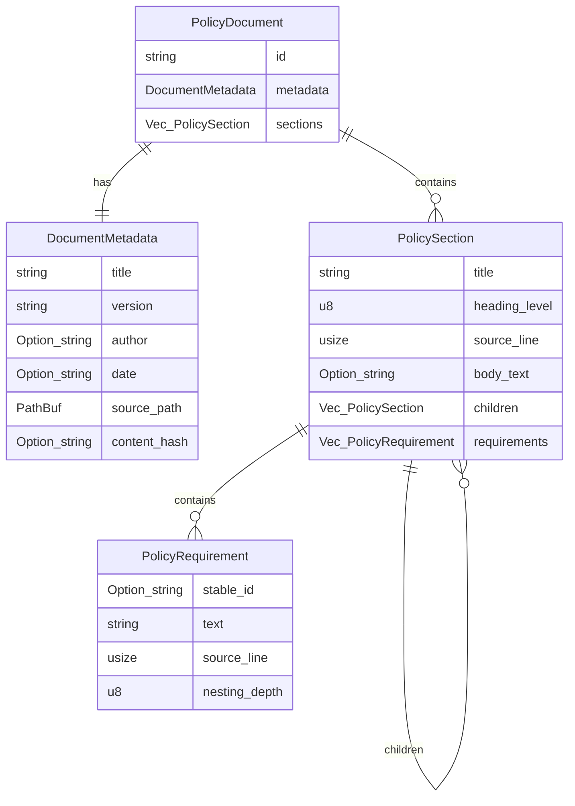
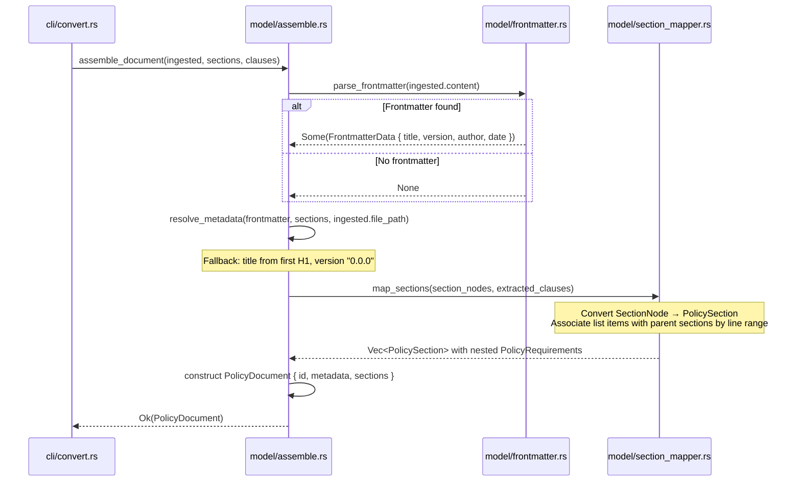

# Data Model: Internal Domain Model

**Feature**: 005-domain-model
**Date**: 2026-02-11
**Status**: Complete

## Overview

The internal domain model is a struct hierarchy that bridges extracted Markdown structure (from WI-2, WI-3, WI-4) to OSCAL concepts. It provides a clean, format-agnostic interface between ingestion/extraction and OSCAL generation, enabling independent testing of both sides of the pipeline.

**Key Design Principles**:
- **Format-agnostic**: No extraction-specific fields (no raw Markdown); no OSCAL-specific fields (no `control_id`, `group_id`)
- **Incremental enrichment**: `Option` fields for data populated by later WIs (stable_id, citations, modality)
- **Functional transformation**: Owned values passed through pipeline; no in-place mutation
- **Source traceability**: All structures preserve `source_line` for compliance requirements

---

## Entity Relationship Diagram



---

## Entities

### PolicyDocument

**Description**: Top-level structure representing a complete parsed policy document. This is the canonical internal representation consumed by all downstream pipeline stages (atomization, UUID generation, OSCAL generation).

**Fields**:

| Field | Type | Required | Description | Populated By |
|-------|------|----------|-------------|--------------|
| `id` | `String` | Yes | Document identifier (derived from filename or frontmatter) | WI-5 (this feature) |
| `metadata` | `DocumentMetadata` | Yes | Document-level metadata (title, version, author, date, source path) | WI-5 (this feature) |
| `sections` | `Vec<PolicySection>` | Yes | Top-level sections (may contain nested children); empty vec if document has no sections | WI-5 (this feature) |

**Validation Rules**:
- `id` must be non-empty
- `sections` may be empty (valid for documents with no structure)

**State Transitions**:
- Created by `assemble_document` function (WI-5)
- Enriched by WI-6 (atomization adds atomized requirements)
- Enriched by WI-7 (populates `stable_id` fields on requirements)
- Enriched by WI-8 (adds citations to requirements)
- Consumed by WI-9+ (OSCAL generation)

**Lifecycle**: Owned value passed through pipeline using functional transformation (each WI takes ownership and returns enriched instance)

---

### DocumentMetadata

**Description**: Metadata about the source policy document, extracted from YAML frontmatter or derived from document structure.

**Fields**:

| Field | Type | Required | Description | Populated By | Fallback Logic |
|-------|------|----------|-------------|--------------|----------------|
| `title` | `String` | Yes | Document title | WI-5 | Frontmatter → first H1 heading → filename (without extension) |
| `version` | `String` | Yes | Document version (semantic versioning format) | WI-5 | Frontmatter → default "0.0.0" |
| `author` | `Option<String>` | No | Document author | WI-5 | Frontmatter only; None if not present |
| `date` | `Option<String>` | No | Document date (ISO 8601 format preferred) | WI-5 | Frontmatter only; None if not present |
| `source_path` | `PathBuf` | Yes | Path to the source file | WI-2 (ingestion) | Provided by IngestedDocument |
| `content_hash` | `Option<String>` | No | SHA-256 hash of source content for integrity tracking | WI-2 (ingestion) | Provided by IngestedDocument; could be added per requirement C-1 |

**Validation Rules**:
- `title` must be non-empty
- `version` should follow semantic versioning format (validated as warning, not error)
- `source_path` must be valid PathBuf

**Extraction Logic**:
```
1. Check for YAML frontmatter (content starts with "---\n")
2. If present: deserialize with serde_yaml into FrontmatterData { title, version, author, date }
3. If parsing fails: warn to stderr, fall through to heading-based extraction
4. If no frontmatter or parsing failed:
   a. title: first H1 heading text, or filename (without extension)
   b. version: default "0.0.0"
   c. author: None
   d. date: None
```

---

### PolicySection

**Description**: A hierarchical section within a policy document, mapped from Markdown headings. Sections form a tree structure with parent-child relationships.

**Fields**:

| Field | Type | Required | Description | Populated By |
|-------|------|----------|-------------|--------------|
| `title` | `String` | Yes | Section title (heading text) | WI-3 (section extraction) |
| `heading_level` | `u8` | Yes | Heading level: 1 for H1, 2 for H2, ..., 6 for H6 | WI-3 (section extraction) |
| `source_line` | `usize` | Yes | Source line number in the original document (1-based) | WI-3 (section extraction) |
| `body_text` | `Option<String>` | No | Text content between this heading and first child heading or next sibling; None if section has no body text | WI-3 (section extraction) |
| `children` | `Vec<PolicySection>` | Yes | Child sections (deeper heading levels); empty vec if no children | WI-3 (section extraction) |
| `requirements` | `Vec<PolicyRequirement>` | Yes | Policy requirements extracted from list items within this section; empty vec if no requirements | WI-4 (clause extraction) + WI-5 (association) |

**Validation Rules**:
- `title` must be non-empty
- `heading_level` must be in range 1-6
- `source_line` must be >= 1 (1-based line numbering)

**Hierarchical Structure**:
- Sections with `heading_level = N` can contain child sections with `heading_level > N`
- Requirements are associated with sections by line range: if requirement's `source_line` falls between this section's `source_line` and the next sibling's `source_line` (or document end), it belongs to this section

**State Transitions**:
- Created by WI-5 (assembly) from `SectionNode` tree (WI-3)
- No direct enrichment by later WIs (requirements within sections are enriched)

---

### PolicyRequirement

**Description**: An individual policy requirement extracted from list items or clause patterns. Requirements represent the atomic units of policy that will map to OSCAL controls.

**Fields**:

| Field | Type | Required | Description | Populated By |
|-------|------|----------|-------------|--------------|
| `stable_id` | `Option<String>` | No | Stable UUID for this requirement; None until populated by WI-7 | WI-7 (UUID generation) |
| `text` | `String` | Yes | Full text of the requirement (pre-atomization; may be compound statement) | WI-4 (clause extraction) |
| `source_line` | `usize` | Yes | Source line number in the original document (1-based) | WI-4 (clause extraction) |
| `nesting_depth` | `u8` | Yes | Nesting depth from extraction (0 = top-level list item, 1 = nested once, etc.) | WI-4 (clause extraction) |

**Validation Rules**:
- `text` must be non-empty
- `source_line` must be >= 1 (1-based line numbering)

**Temporary Identity** (before `stable_id` is assigned):
- Requirements can be temporarily identified by `(source_line, text_hash)` tuple for testing and debugging
- Text hash: lightweight hash of first 64 characters + source_line
- Not persisted; purely for intermediate pipeline stages (Assumption A-6)

**State Transitions**:
- Created by WI-5 (assembly) from `ExtractedListItem` (WI-4)
- Enriched by WI-6 (atomization splits compound statements into multiple requirements)
- Enriched by WI-7 (populates `stable_id` with UUID)
- Enriched by WI-8 (adds citations - citation model TBD)
- Consumed by WI-9+ (OSCAL control mapping)

**Note**: At this stage (WI-5), requirements are pre-atomization and may contain compound statements. Splitting compound requirements is deferred to WI-6.

---

## Assembly Function

### assemble_document

**Signature**:
```rust
pub fn assemble_document(
    ingested: &IngestedDocument,
    sections: Vec<SectionNode>,
    clauses: ExtractedContent,
) -> Result<PolicyDocument, ForgeError>
```

**Purpose**: Bridge the three extraction outputs (IngestedDocument from WI-2, Vec<SectionNode> from WI-3, ExtractedContent from WI-4) into a unified domain model.

**Inputs**:

| Parameter | Type | Source | Description |
|-----------|------|--------|-------------|
| `ingested` | `&IngestedDocument` | WI-2 | Contains file path, raw content, content hash, line map |
| `sections` | `Vec<SectionNode>` | WI-3 | Heading hierarchy tree |
| `clauses` | `ExtractedContent` | WI-4 | Extracted list items, tables, paragraphs |

**Outputs**:

| Case | Type | Description |
|------|------|-------------|
| Success | `Ok(PolicyDocument)` | Complete domain model with all sections and requirements assembled |
| Recoverable error | `Ok(PolicyDocument)` + warning to stderr | Malformed YAML frontmatter → warn, use fallback metadata, return Ok |
| Fatal error | `Err(ForgeError)` | Data inconsistency preventing assembly (e.g., invalid section tree structure) |

**Algorithm**:
```
1. Parse frontmatter:
   a. Check if content starts with "---\n"
   b. If yes: extract YAML between delimiters, deserialize with serde_yaml
   c. If parsing fails: warn to stderr, set frontmatter = None
   d. If no frontmatter: set frontmatter = None

2. Resolve metadata:
   a. title: frontmatter.title OR sections[0].title (if H1) OR filename
   b. version: frontmatter.version OR "0.0.0"
   c. author: frontmatter.author OR None
   d. date: frontmatter.date OR None
   e. source_path: ingested.file_path
   f. content_hash: ingested.content_hash (if available)

3. Map sections:
   For each SectionNode:
     a. Create PolicySection { title, heading_level, source_line, body_text }
     b. Determine line range for this section (source_line → next sibling or document end)
     c. Find all ExtractedListItems whose source_line falls within this range
     d. Convert matching list items to PolicyRequirement { None, text, source_line, nesting_depth }
     e. Recursively map child SectionNodes
     f. Return PolicySection with nested children and requirements

4. Construct PolicyDocument:
   PolicyDocument { id: filename_stem, metadata, sections: mapped_sections }

5. Return Ok(PolicyDocument)
```

**Error Handling**:
- Malformed YAML: `eprintln!("Warning: ...")`, fall back to heading/filename, return Ok
- Empty document: Return `Ok(PolicyDocument { ..., sections: vec![] })` per Edge Case EC-3
- Section tree inconsistency: Return `Err(ForgeError::Parse("..."))`

---

## Data Flow



---

## Dependencies Between Entities

| Entity | Depends On | Relationship |
|--------|-----------|--------------|
| `PolicyDocument` | `DocumentMetadata` | Composition (owns metadata) |
| `PolicyDocument` | `Vec<PolicySection>` | Composition (owns top-level sections) |
| `PolicySection` | `Vec<PolicySection>` | Recursive composition (owns child sections) |
| `PolicySection` | `Vec<PolicyRequirement>` | Composition (owns requirements within section) |
| `PolicyRequirement` | None | Leaf entity (no dependencies) |

---

## Mapping from Extraction Types

| Extraction Type | Source WI | Maps To | Transformation |
|-----------------|-----------|---------|----------------|
| `IngestedDocument` | WI-2 | `DocumentMetadata.source_path`, `DocumentMetadata.content_hash` | Direct field copy |
| `SectionNode` | WI-3 | `PolicySection` | Recursive tree mapping: title, heading_level, source_line, body_text, children (recursive) |
| `ExtractedListItem` | WI-4 | `PolicyRequirement` | Field mapping: text, source_line, nesting_depth; stable_id = None. Note: `list_type` (Ordered/Unordered) is intentionally not carried into the domain model — the domain model is format-agnostic and list type is a Markdown-specific concept. |

**Line-Range-Based Association**:
- For each `PolicySection`, determine its line range: `[section.source_line, next_sibling.source_line)` or `[section.source_line, document_end]`
- Assign all `ExtractedListItem`s whose `source_line` falls within this range to `section.requirements`
- This heuristic assumes list items belong to the most recent heading

---

## Testing Strategy

### Unit Tests

| Test Category | Coverage | Test Files |
|---------------|----------|------------|
| Struct construction | All fields populated correctly | `tests/unit/model_test.rs` |
| Frontmatter parsing | Present, absent, malformed, partial fields | `tests/unit/frontmatter_test.rs` |
| Metadata resolution | Frontmatter path, H1 fallback, filename fallback | `tests/unit/frontmatter_test.rs` |
| Section mapping | Flat sections, nested sections, empty sections | `tests/unit/assemble_test.rs` |
| Requirement association | Items within sections, items outside sections | `tests/unit/assemble_test.rs` |
| Edge cases | Empty document, no headings, no requirements | `tests/unit/model_test.rs` |

### Integration Tests

| Test Category | Coverage | Test Files |
|---------------|----------|------------|
| Full assembly | Ingest → extract → assemble → verify all fields | `tests/integration/pipeline_test.rs` |

---

## Security Considerations

| Data Element | Classification | Security Notes |
|--------------|----------------|----------------|
| Document metadata | Internal | No PII or secrets expected; policy document metadata is organizational information |
| Policy requirement text | Internal | Policy text may contain organizational information; no encryption needed (local CLI) |
| Source path | Internal | Local file path; no exposure beyond CLI process |

**Threat Model**: See `docs/SEC/005-sec-domain-model.md` for full security review. Key points:
- No external exposure (local CLI tool, no network communication)
- YAML deserialization via serde_yaml (well-maintained library, resistant to YAML bombs)
- SEC-1: Frontmatter parsing is fault-tolerant (malformed YAML → warning + fallback, not error)
- SEC-6: Do not use `unwrap()` on serde_yaml deserialization results

---

## Next Steps

Proceed to contracts generation (Phase 1 continued).
