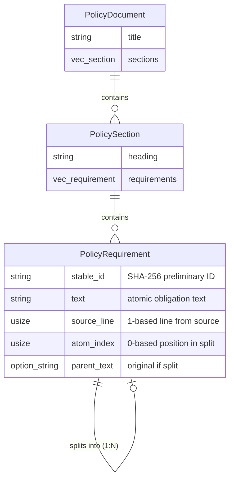

# Data Model: Requirement Atomization

**Feature**: 006-requirement-atomization
**Generated**: 2026-02-11
**Source**: [spec.md](./spec.md), [plan.md](./plan.md)

## Overview

The atomization feature operates on the existing domain model from WI-5 (`PolicyDocument`, `PolicySection`, `PolicyRequirement`). It does not introduce new domain entities, but rather transforms compound `PolicyRequirement` instances into multiple atomic `PolicyRequirement` instances.

## Entities

### PolicyRequirement (Modified)

**Source**: Existing struct from WI-5 domain model (`src/model/`)

**Purpose**: Represents a single policy requirement (atomic or compound). After atomization, compound requirements are replaced by N atomic requirements.

**Fields**:

| Field | Type | Description | Validation Rules |
|-------|------|-------------|------------------|
| `stable_id` | `String` | Preliminary ID (SHA-256 hex-encoded, 64 chars). Generated via `preliminary_id(text, source_line, atom_index)`. Will be replaced by UUID v5 in WI-7. | FR-004: Must be deterministic (same inputs = same output). Non-empty. Exactly 64 characters (SHA-256 hex). |
| `text` | `String` | Atomic obligation text. For split requirements, this is the reconstructed clause with shared subject prepended. For atomic (non-split) requirements, this is the original text unchanged. | FR-002: Must be a complete sentence (subject + verb + object). FR-003: Atomic statements preserved unchanged. Non-empty. |
| `source_line` | `usize` | 1-based line number from the original policy document. Preserved from parent requirement when split. | FR-005: Must match parent requirement's source_line. Must be >= 1. |
| `atom_index` | `usize` | 0-based position in the split. For non-split (atomic) requirements, this is 0. For split requirements, this is 0..N where N is the number of atomic parts produced. | Must be >= 0. For atomic requirements, must be 0. For split requirements, must be sequential (0, 1, 2, ...). |
| `parent_text` | `Option<String>` | Original compound text if this requirement was produced by splitting. `None` if the requirement was already atomic (not split). | If `was_split` true, must be `Some(original)`. If `was_split` false, must be `None`. |

**Invariants**:
- If `atom_index == 0` and `parent_text.is_none()`, then this requirement was not split (atomic).
- If `atom_index > 0`, then `parent_text.is_some()` (must have been split).
- All requirements with the same `parent_text` and `source_line` form a split group and must have sequential `atom_index` values (0, 1, 2, ...).

**Lifecycle**: Immutable once created. No state transitions.

**Example** (Before Atomization):
```rust
PolicyRequirement {
    stable_id: "preliminary-abc123...",  // Will be replaced in WI-7
    text: "Systems must enforce MFA and must require complex passwords",
    source_line: 42,
    atom_index: 0,  // Not yet split
    parent_text: None,  // Not yet split
}
```

**Example** (After Atomization — Split into 2):
```rust
// Part 1
PolicyRequirement {
    stable_id: "sha256-hash-of-'Systems must enforce MFA|42|0'",
    text: "Systems must enforce MFA",
    source_line: 42,  // Preserved from parent
    atom_index: 0,  // First part
    parent_text: Some("Systems must enforce MFA and must require complex passwords"),
}

// Part 2
PolicyRequirement {
    stable_id: "sha256-hash-of-'Systems must require complex passwords|42|1'",
    text: "Systems must require complex passwords",
    source_line: 42,  // Preserved from parent
    atom_index: 1,  // Second part
    parent_text: Some("Systems must enforce MFA and must require complex passwords"),
}
```

### PolicyDocument (Unchanged)

**Source**: Existing struct from WI-5

**Purpose**: Top-level container for policy sections and requirements.

**Relationship**: Contains multiple `PolicySection` instances.

**Atomization Impact**: The atomizer's `atomize_document` function accepts a `PolicyDocument`, iterates over all `PolicySection` and `PolicyRequirement` instances, splits compound requirements, and returns an updated `PolicyDocument` with atomized requirements.

### PolicySection (Unchanged)

**Source**: Existing struct from WI-5

**Purpose**: Logical grouping of requirements (e.g., by policy section heading).

**Relationship**: Contains multiple `PolicyRequirement` instances.

**Atomization Impact**: Requirements within each section are atomized independently. Section structure is preserved.

## Relationships



**Notes**:
- The "splits into (1:N)" relationship is a transformation, not a persistent link. After splitting, the original compound requirement is removed and replaced by N atomic requirements.
- All atomic requirements from the same compound statement share the same `source_line` and `parent_text` values.

## Validation Rules

### Per-Field Validation

| Field | Rule | Error Condition | Enforcement Point |
|-------|------|-----------------|-------------------|
| `stable_id` | Must be 64-character hex string | Length != 64 or non-hex chars | `preliminary_id` function |
| `text` | Non-empty string | Empty or whitespace-only | `atomize_requirement` (EC-7: preserve as-is, no error) |
| `source_line` | >= 1 | source_line == 0 | Domain model constructor (from WI-5) |
| `atom_index` | >= 0 | atom_index < 0 | `atomize_requirement` function |

### Cross-Field Validation

| Rule | Validation Logic | Error Condition |
|------|------------------|-----------------|
| **Atom index consistency** | All requirements in a split group (same `parent_text` + `source_line`) must have sequential `atom_index` values starting from 0 | Gap in sequence or duplicate index |
| **Parent text consistency** | If `atom_index > 0`, then `parent_text` must be `Some(...)` | `atom_index > 0` but `parent_text.is_none()` |
| **Deterministic ID** | Same `text` + `source_line` + `atom_index` always produces the same `stable_id` | `preliminary_id(text, line, index)` produces different output on repeated calls (FR-004 violation) |

### Document-Level Validation

| Rule | Validation Logic | Error Condition |
|------|------------------|-----------------|
| **Total requirement count** | After atomization, `count(atomic_requirements) >= count(original_requirements)` | Count decreased (requirements lost) |
| **Source line preservation** | All atomic requirements have `source_line` matching their parent | `source_line` modified during atomization |
| **No orphan requirements** | All requirements trace to a source line | `source_line` is 0 or invalid |

## State Transitions

**None**. `PolicyRequirement` instances are immutable once created. The atomization process creates new requirements and discards compound ones; it does not modify existing instances.

## Edge Cases (Domain Model Perspective)

| Edge Case | Behavior | Rationale |
|-----------|----------|-----------|
| **EC-7**: Empty or whitespace-only `text` | Preserved as-is, `atom_index=0`, `parent_text=None` | Conservative: do not error on malformed input (FR-003) |
| **EC-8**: `PolicyDocument` with zero requirements | Returned unchanged | No-op when no requirements exist |
| **EC-9**: Compound statement producing >50 splits | Preserved as-is (not split), warning logged | SEC-5 mitigation: prevent cardinality explosion |
| **EC-10**: Statement with uppercase normative verbs | Preserved as-is (not split) | Case-sensitive matching (clarification 2026-02-11) |

## Traceability Map

| Domain Field | Source in Original Document | Purpose |
|--------------|----------------------------|---------|
| `source_line` | Line number from Markdown ingestion (WI-2) | Enables bidirectional traceability from OSCAL control back to source policy document |
| `parent_text` | Original compound requirement text before splitting | Audit trail: shows what the original statement was before atomization |
| `stable_id` | Computed from `text` + `source_line` + `atom_index` | Unique identifier for each atomic requirement; replaced by UUID v5 in WI-7 |

## Summary

The atomization feature **transforms** the domain model by replacing compound `PolicyRequirement` instances with multiple atomic `PolicyRequirement` instances. It does not introduce new entity types. The key fields added/modified are `atom_index` (position in split) and `parent_text` (audit trail). The `stable_id` field is populated with a preliminary SHA-256 hash for determinism, and `source_line` is preserved for traceability.

**Validation Focus**: Determinism (same input = same output), traceability (source_line preserved), completeness (text includes shared subject), and consistency (atom_index sequential, parent_text set correctly).

**Next Steps**: See [contracts/atomize-api.md](./contracts/atomize-api.md) for function signatures and [quickstart.md](./quickstart.md) for TDD workflow.
